# 基建与其他 — V1.0.0 原文切片

> 状态：`history`  · 来源：`demo/V1.0.0/V1.0.0.docx`

## 文首

【删除】3.5.3.2.3增加WhatsApp跳转180

【删除】3.5.3.2.4 充值代理支持私聊一键群发182

【删除】3.5.3.2.5 充值代理支持私聊自动回复消息185

3.1.3.3 【含H5】代理列表入口&代理列表188

【删除】3.5.4.1 Message增加Agency分类（币商消息板块）190

3.6 第六部分 个人中心模块（许静）191

3.6.1个人中心页面191

3.6.2个人资料编辑195

3.6.2.1 个人资料编辑页195

3.6.2.2 头像编辑196

3.6.2.3 昵称编辑200

2.6.3.4 国籍修改201

3.6.2.5个人简介编辑203

3.6.3互动数据列表205

3.6.3.1关注列表/添加好友/取消关注205

3.6.3.2好友列表207

3.6.3.3粉丝列表208

3.6.3.4访客列表209

3.6.4他人主页210

3.6.4.1他人主页210

3.6.4.2拉黑和举报212

3.6.5 头像框215

3.6.7问题反馈219

3.6.7.1 问题反馈 - 落地页219

3.6.7.2问题反馈 – 问题递交220

3.6.7.3问题反馈 – 我的反馈221

3.6.8 设置223

3.6.8.1设置列表223

3.6.8.2设置 – 账号绑定225

3.6.8.3设置 - 修改绑定手机227

3.6.8.4设置 - 解除三方绑定账号229

3.6.8.5设置 – 隐私设置231

3.6.9语言修改233

3.6.10新增官方账号支持切换国家235

3.6.10黑名单236

3.6.11关于我们238

3.6.11 IOS新增相册管理权限240

3.6.12 删除&激活账号242

3.6.12.1删除账号242

3.6.12.2激活停用账号251

3.6.13 版本更新&协议更新253

3.6.13.1 版本更新253

3.6.13.2 协议更新257

3.6.14【H5】Feedback优化258

3.6.15用户/房间头像-查看原图功能259

3.6.16 个人主页相关功能删除对应页面调整261

3.7 第七部分 消息（许静）262

3.7.1 消息页列表262

3.7.2系统消息265

3.7.3官方团队266

3.7.4好友申请267

3.7.5私聊详情269

3.7.5.1私聊详情 - 异常提示271

3.7.5.2私聊消息 - 文字表情输入272

3.7.6 私聊送礼274

3.7.7 好友列表277

3.7.7.1好友列表 – 搜索278

3.7.8 成为好友发私聊消息280

3.8 第八部分 金币充值（许静）282

3.8.1 金币充值282

3.8.2 货币变动记录284

3.8.3房间消费商品余额不足提示场景286

3.8.4 充值页面&充值路径优化286

3.8.5 私聊送礼金币/宝石不足288

3.8.6 商城购买金币&宝石不足290

3.8.7 充值界面&取消充值优化292

3.8.8 奖励293

3.8.8.1房间内293

3.8.8.2 房间外299

3.8.9 赠送金币礼物余额不足时弹窗补全“差XXX金币”文案302

3.8.10 删除逻辑303

3.9 第九部分 房间功能（许静）303

3.9.1 房间大厅303

3.9.2 跟随好友进房308

3.9.3 房间标签310

3.9.2 搜索311

3.9.3 国家筛选315

3.9.4 创建房间316

3.9.5 进房规则318

3.9.6 房间界面排版318

3.9.7 顶部状态栏320

3.9.8 消息展示区&底部操作栏325

3.9.9 送礼329

3.9.10 麦克风操作336

3.9.11 查看用户资料338

3.9.12 查看房间资料343

3.9.13 换麦(新增)350

3.9.14 房间禁言功能调整352

3.9.15 复制链接分享房间355

3.9.16 锁麦356

3.9.16.1 管理员权限356

3.9.16.2 锁麦/解锁麦357

3.9.17礼物计数器360

3.9.17.1 入口&时间选择360

3.9.17.2  计分排行榜367

3.9.18礼物面板增加背包：礼物372

3.9.18.1 功能概述372

3.9.18.2 礼物面板背包入口及页面372

3.9.18.3 包裹礼物373

3.9.18.4 礼物面板-背包展示头像框376

3.9.19 密码房377

3.9.19.1 密码房设置377

3.9.19.2 更换密码&解锁380

3.9.19.3 进入密码房382

3.9.20 房间升级386

3.9.21 房间音乐390

3.9.21.1房间音乐入口390

3.9.21.2添加音乐-安卓391

3.9.21.3添加音乐-本地音乐-ios393

3.9.21.4 添加音乐-WIFI上传音乐-ios394

3.9.21.5 音乐列表396

3.9.21.6 播放音乐398

3.9.22房间聊天发图399

3.9.23 房间添加banner入口403

3.9.24 麦上表情包404

3.9.25 周星礼物榜单405

3.9.26 房间用户列表排序优化407

3.9.27 活动礼物标识407

3.9.28 房间关注列表优化408

3.9.29 消息列表添加活动消息409

3.9.30 网络检测410

3.9.31 一键打招呼413

3.9.32 房间删除内容&调整416

3.10第十部分 排行榜（许静）419

3.10.1 房间内排行榜419

3.10.2 平台排行榜422

3.11第十一部分 其他基建需求（许静）426

3.11.1 在房状态展示426

3.11.2 短信风控接入430

3.11.3 删除小号充值限制逻辑431

3.11.4 新人礼包&新人进入运营房间引导432

3.11.4.1 新人礼包432

3.11.4.2 新人进房引导435

3.11.4.3 送礼引导438

【删除】3.11.5 新注册用户进入运营房间引导441

3.11.6 新注册用户国家&语区分配逻辑443

3.11.7 手机号注册国家446

3.11.8 message 消息提示数字448

3.11.8应用组件规范450

3.11.8.1 弹窗450

3.11.8.2 Toast提示451

3.11.8.3 占位页452

3.11.8.4 刷新加载453

3.11.8.5时间戳显示455

3.11.9 退款封号冻币456

3.11.10 SDK检查457

3.11.11 支持网页删除账号457

3.12第十二部分 商城、背包、靓号（许静）460

3.12.1 靓号460

3.12.1.1 个人靓号460

3.12.1.2 房间靓号465

3.12.2 商城&背包467

3.12.2.1 商品&标识展示467

3.12.2.2 商品-房间背景471

3.12.2.3 商品-头像框472

3.12.2.4 商城475

3.12.2.5 背包481

3.13 第十三部分 关系体系（许静）487

3.13.1 关注、好友体系487

3.13.1.1 房间个人资料卡&个人主页&粉丝列表&关注列表487

3.13.1.2 房间公屏区关注引导&提醒491

3.13.1.3私聊关注引导&提醒495

3.13.1.4 线上关注、好友关系隐私设置498

3.1.2 发消息限制逻辑调整499

3.13.2 相关逻辑504

3.13.2.1 跟随进房调整504

3.13.2.2 分享功能优化506

3.14 用户VIP（丛国序）507

3.14.1 VIP - 数值及计算逻辑507

3.14.2 VIP - 页面510

3.14.3 VIP - 权益516

3.14.4 VIP - 高级VIP账号私聊页增加WhatsApp跳转531

3.14.5 VIP – 个人相关通知533

3.14.6 VIP - 全服“VIP升级全服通知”特权535

3.14.7 VIP - 增加靓号权益展示537

## 3.11第十一部分 其他基建需求（许静）

3.11第十一部分 其他基建需求（许静）

3.11.1 在房状态展示

| 功能名称 | 在房状态 |
|---|---|
| 优先级 | 高 |
| 功能描述 | 展示用户在房状态 |
| 前置条件 |  |
| 交互原型 | [图1]                   [图2] [图3]                    [图4] [图5] [图6] |
| 字段描述 |  |
| 需求描述 | [图1]个人主页展示在房状态 若用户在房，则展示在房模块 文案： 显示房间名称 房间当前人数 点击整个模块： 若已在该房间中，则直接进入该房间； 若未在该房间，则关闭当前所在房间（若有），并进入该房间 注：进入房间的逻辑复用，例如黑名单无法进房 展示规则 用户在房时，根据隐私设置，展示给好友或关注者或所有人或不展示 永久可见自己的在房状态 [图2-图3]消息页、消息-好友页 消息页展示（含房间内的消息浮层） 展示在房麦波：若用户在房且权限可见，展示在房的麦波 增加交互：点击头像进入私聊页 消息好友页展示（含房间内好友浮层） 展示在房icon：若用户在房且权限可见，展示在房icon，点击跳转到对应房间 其它交互改动： 取消原“聊天”icon 点击头像、昵称，跳转到个人主页（原为私聊页） 更新规则 用户进入消息页或消息好友页时，更新前50位用户的在房状态 更新频次：每次更新后，1分钟内不会再次更新 消息页与好友页不共享1分钟限制 [图4]私聊页增加在房icon 若用户在房且权限可见，则展示在房icon，点击跳转到对应房间 更新方式：进入私聊页更新最新状态 [图5]ME页4个列表展示在房icon 若用户在房且权限可见，在ME页的followed、Friends、Followers、Visitors展示在房icon，点击跳转到对应房间 [图6]隐私设置 展示用户当前权限设置，初始权限为“所有人” 点击对应区域，弹出权限设置浮层 点击【好友】【好友与关注的人】或【所有人】按钮修改权限 成功修改后，关闭浮层，实时变更隐私设置页的权限展示 若点击当前正在使用的权限，则直接关闭浮层 若权限修改失败，则toast“修改失败”，不关闭浮层 点击【取消】按钮，关闭浮层 |
| 补充说明 |  |

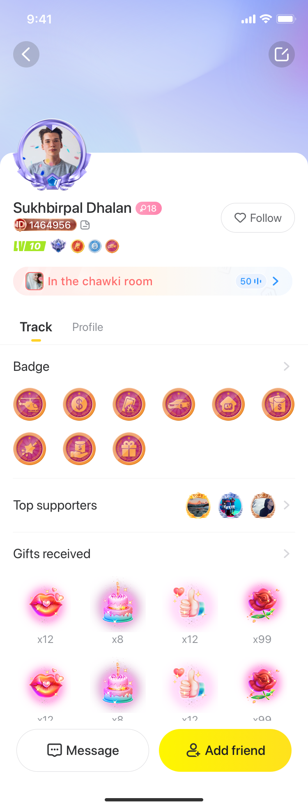

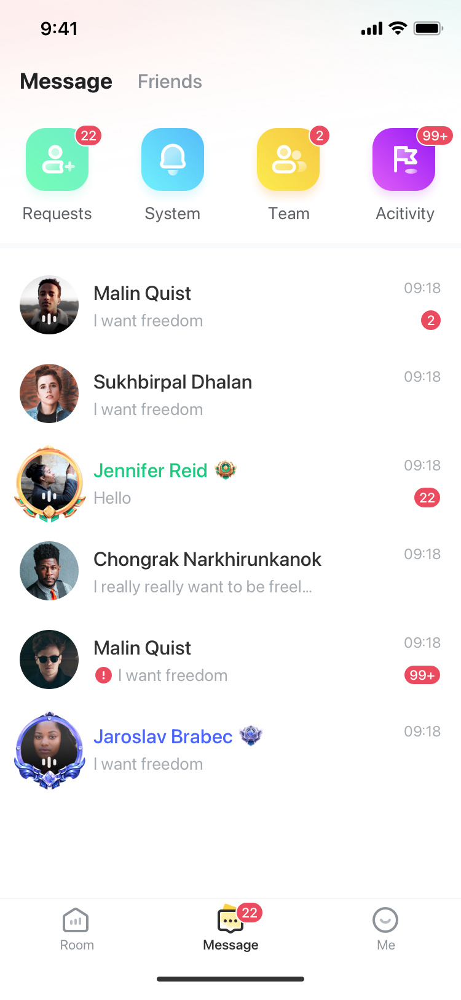

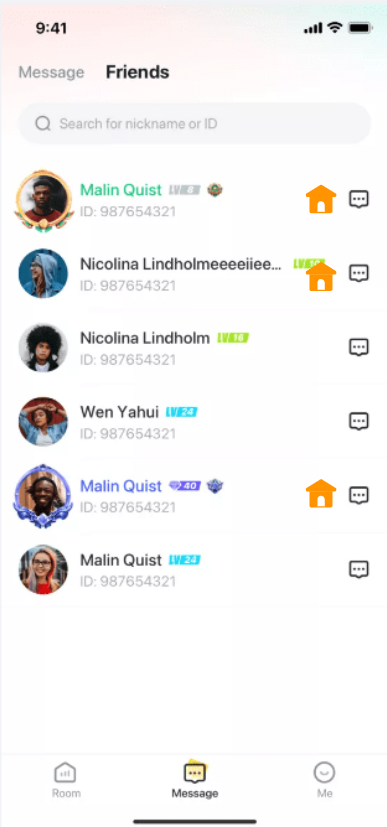

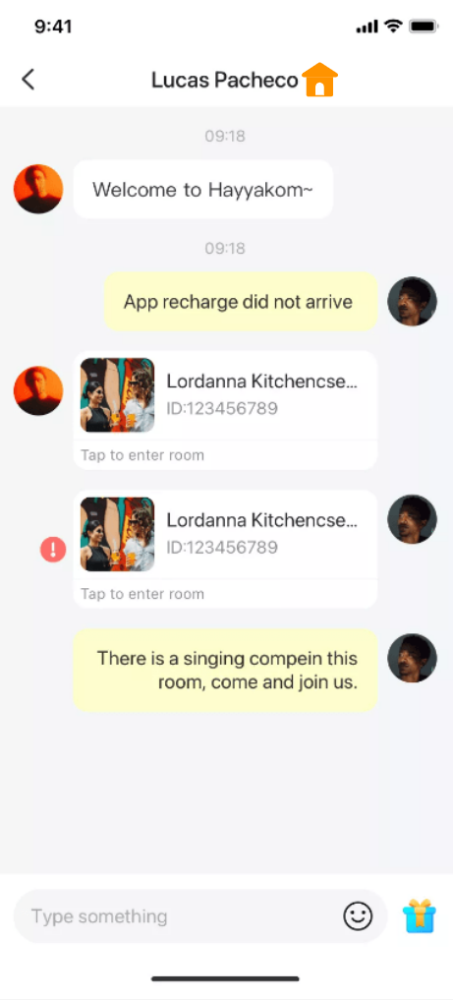

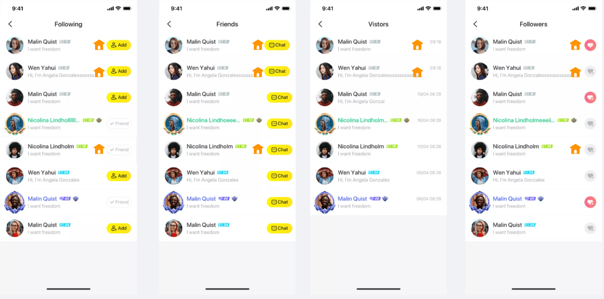

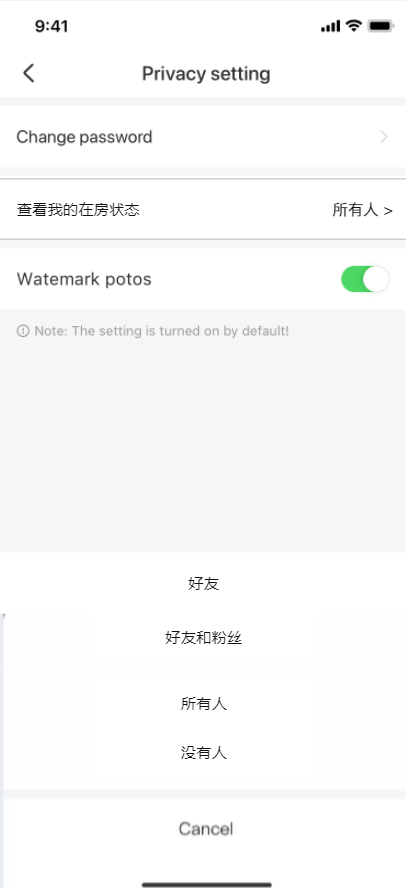

3.11.2 短信风控接入

1. 用户注册或绑定/换绑手机号或修改密码发送短信验证码需要调用“手机号黑名单库”，若该用户是“手机号黑名单库”用户则不发送短信验证码并toast提示：“验证码发送失败”（同现在短信验证码发送失败的文案即可）；

注：“手机号黑名单库”为安全部门提供的定期更新的涉及风险手机账号；

以下业务需要限制每天的短信发送次数：

绑定（绑定+换绑）手机号2次/天、解绑手机号3次/天、忘记密码2次/天、修改密码2次/天、删除账号2次/天，触发限制不再发送短信并提示toast：“验证码发送失败”；

同一手机号短信验证码限制发送总次数9次/天（数值待定），触发限制不再发送短信并提示：“今日短信发送次数已达上限”；

设备及IP限制：

同设备历史累计登陆过的账号数量≥X且ip数量≥Y；

同设备昨日或今日（今日0点至当前时间）累计登陆过的账号数量≥5（99.5%用户不会命中）或ip数量≥15（99.5%用户不会命中）；

不发送验证码并toast提示：“验证码发送失败”；

注：同设备昨日或今日任意天触发验证码发送限制条件则限制发送验证码。上述设备用设备指纹判断

验证码使用率数据落库，忘记密码（原数据含忘记密码&修改密码）数据统计数据拆分为修改密码和忘记密码；

3.11.3 删除小号充值限制逻辑

删除以下逻辑：

【T-1数据风控】充值风控规则：当前设备历史累计充值有N个账号，且这N个账号仅在当前设备上有过充值行为时：若当前设备下任意账号（除历史累计充值最高的账号（不算退款））退款导致账户欠款，则当前设备被自动拉入“设备充值黑名单”；

充值风控规则命中用户大数据每天更新1次；

【T数据风控】充值风控规则：若当天有设备欠款且不在“设备充值黑名单”中，则封禁该设备充值，直到还清当前设备欠款可解除充值限制；封禁充值限制同“设备充值黑名单对应业务限制”。

该逻辑需服务端判断，每1个小时更新一次，需要日志记录限制用户充值的时间、用户ID、设备ID、设备指纹信息；

上述“设备”识别规则：

1）新版本：根据设备指纹进行判定；

2）老版本：根据设备ID进行判定（广告ID）；

考虑当前版本后台排期紧张，暂不做“设备充值黑名单”列表页面，“设备充值黑名单”设备数据（仅上周新增的“设备充值黑名单”相关数据，不含【T数据风控】数据）每周邮件自动发送1次（含设备ID、设备指纹ID、用户ID、用户注册时间、用户最近登录时间、用户历史累计充值、用户历史累计退款信息）；

设备充值黑名单对应业务限制：用户在客户端点击“充值”按钮时判断当前用户是否是“设备充值黑名单”设备，如果是则当前设备下除历史累计充值最高的账号（不算退款）外的其他所有账号在禁止充值/订阅并toast提示：“账户异常，充值失败。”；

自动移除“设备充值黑名单”条件：当当前设备下所有账号不再欠款时自动将当前设备从“设备充值黑名单”中移除（数据每天更新一次，用户今日还清欠款次日才能充值解封）；

3.11.4 新人礼包&新人进入运营房间引导

3.11.4.1 新人礼包

| 功能描述 | 新注册用户进入Samer自动发放新人礼包 |
|---|---|
| 优先级 | 高 |
| 前置条件 | 新注册用户进入Samer |
| 需求描述 | [图1] 支持服务端配置是否开启 新注册用户进入Samer自动弹出新人奖励弹窗，见图1；点击关闭按钮可关闭当前弹窗，点击弹窗外区域不可关闭弹窗； 注： 若用户注册后进入APP弹出过该弹窗，前置条件没有点击“进入”按钮或“关闭”按钮时，再次进入不再弹出该弹窗； 卸载后重新安装，但不是新注册用户不会弹出该弹窗； 新人奖励发放限制：同设备最多只发三次 新人奖励内容：宝石个数、头饰卡样式服务端可配置 新人奖励发放形式：用户注册登录后自动发放至用户的账户。 宝石自动进入用户的货币账户，并产生ban对应流水记录：“新人礼包            +XXX”； 头饰卡自动放入用户的头饰卡库存中（房间头饰卡面板与背包都显示库存数量），永久有效，展示位置？存库排序？（见图3），若该头饰卡样式与商城头饰卡样式不同，该头饰卡不会再商城显示； 用户收到系统消息通知：亲爱的用户，恭喜你获得我们为你赠送的专属礼包！奖励以发放至你的账户，请前往“我的>钱包”查看宝石，“我的>背包”查看头饰卡+宝石图标+头饰卡图标；点击可跳转，跳转至推荐房间（根据3.1.1.2推荐逻辑推荐的运营房）； 注：文案以翻译文档为准 弹窗展示内容： 文案：“恭喜获得为你准备的专属礼包”、“去房间享用它们吧”，文案以翻译文档为准 礼包展示区： 奖励图标：奖励图标展示顺序为：宝石、座驾、头饰卡 奖励数量/使用期限：×AAA、AAA天；“AAA”为大于0的自然数；赠送奖励的数量/使用期限服务端可配置 “进入”按钮：“进入”按钮添加呼吸动效 |
| 补充说明 |  |

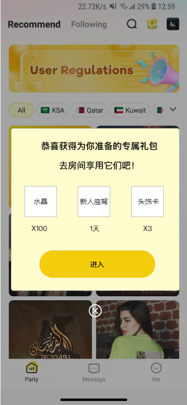

3.11.4.2 新人进房引导

| 功能描述 | 新注册用户进入Samer引导其进入官方/运营房间 |
|---|---|
| 优先级 | 高 |
| 前置条件 | 新注册用户进入Samer |
| 需求描述 | [图1]                  [图2]                   [图3] 新人礼包引导，见图1： 用户点击“进入”按钮，页面自动跳转至官方/运营房，一个账号仅展示一次（以下逻辑同1.1.2版本“引导新人进房”的进房排序逻辑相同） 跳转房间数据从“后台运营管理-运营房管理”中获取数据 获取数据优先级： 1> “后台运营管理-运营房管理”用户所在语区的房间 2>“后台运营管理-运营房管理”中房间分级标签为A和B、且房间内麦位在线人数>=1的房间（麦上用户可为任何人）。 3>如符合条件1>、2>的房间数为0，则取官方房XID: 10000进入；如符合条件1>的房间数>=1，则从中按以下优先级进行随机抽取、供用户进入： 上述规则中： 第一：房间在线人数在“后台运营管理-运营房管理-推荐标准设置”设置区间内的>区间外的 第二：房间分级标签A>B 弹出“新人礼包”弹窗后： 若用户关闭当前引导弹窗，弹出签到弹窗，关闭签到弹窗后展示首页-房间大厅进房引导、创建房间引导； 若用户点击“新人礼包”弹窗的“进入”按钮进入引导指定房间，退出该房间后弹出签到弹窗，不再展示首页-房间大厅进房引导、创建房间引导 新安装的，但不是新注册用户，首页-房间大厅进房引导、创建房间引导走原有引导逻辑 邀请进房引导，见图2： 浮层展示范围：用户停留在Party、Message、Me一级界面时才会弹出 弹出条件：用户注册14天内（服务端配置），当天没有进入过任何房间。 本次登录（退出到后台再次进入APP也算登录）期间则需要：每间隔30s、120s、300s触发一次，触发成功后才开始计时下一次触发时间（若触发时刻用户不在一级页面则退出当前一级页面后立即触发）；一个账号一天最多弹出三次 本次登录有展示“新手礼包”弹窗： 用户关闭“新人礼包”弹窗后，开始计时30s弹出，第一次引导进房浮层消失后再开始计时120s，再次弹出第二次引导进房弹窗后并消失后再开始计时300s；杀掉程序或再次登录不会再弹窗“新人礼包”弹窗； 本次登录没有展示“新手礼包”弹窗： 本次登录进来开始倒计时30s弹出，第一次引导进房浮层消失后再开始计时120s.，第二次引导进房浮层消失后，开始300s倒计时； 浮层消失条件： 弹窗显示满10s自动消失 用户点击浮层“进入”按钮后自动消失 用户进入二级页面后自动消失 点击“拒绝”按钮 浮层展示位置：固定位置悬浮在主界面顶部导航栏下面的位置，浮层不可拖动，切换主页面浮层仍展示直到满足“浮层消失条件”才会消失； 推送的房间：点击“进入”按钮匹配房间逻辑同点击“新人礼包引导”页面“进入”按钮匹配房间逻辑 浮层展示内容： 展示被推送房间在房用户头像、昵称；头像获取优先级：取女性房主、女性管理员（多个随机）、男性房主、男性管理员（多个随机）；头像位置展示麦波动效；展示音波动效； 固定文案：邀请你进入房间 展示被推送房间封面、房间名称、房间ID、房间人数 “进入”按钮； 消息推送引导，见图3： 推送条件：若新注册用户（注册时间14天内，服务端配置）进入Samer后当天却没有进入过任何房间，用户退出Samer后立刻（监测到退出APP开始计算时间）收到邀请进房的推送消息。 推送内容： 展示被推送房间的房间封面、Samer Logo XXX邀请你进入他的房间YYY，该房间正在举行派对，文案以翻译文档为准；“XXX”为被推荐房间在房用户昵称，优先级：取女性房主、女性管理员（多个随机）、男性房主、男性管理员（多个随机） 推送的房间：点击消息推送卡片，匹配房间逻辑同点击“新人礼包引导”页面“进入”按钮匹配房间逻辑 推送次数限制：一天最多3次 |
| 补充说明 |  |

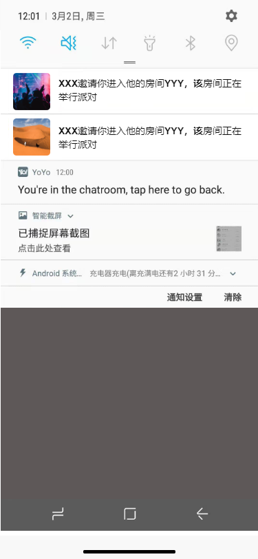

3.11.4.3 送礼引导

| 功能描述 | 用户完成第一次送礼引导 |
|---|---|
| 优先级 | 高 |
| 前置条件 | 用户注册后房间未送过任何礼物 |
| 需求描述 | [图1]                    [图2] [图3] 新手引导-添加送礼入口指示： 用户关闭新手引导-上麦引导和新手引导-发言引导浮层后，出现图3引导用户点击送礼按钮，点击浮层外区域或送礼图标浮层消失，一个账号弹出一次（同新手引导弹出频率） 用户房间内互动送礼引导： 送礼引导消息触发条件：用户注册后房间从未送过礼物，且进入一个房间满2分钟（服务端可调，换房间或房间断线时间重计） 注：进入二级页面不会展示，返回页面会看到 送礼引导消息触发限制：每天最多触发1次 送礼引导消息展示形式：跟随发言区显示由下向上推出展示，固定展示在发言区域上方3秒后（见图1），跟随发言区消息向上移动 送礼引导消息展示内容：“玩的开心吗？送个小礼物支持一下吧！  >”（文案以翻译文档为准）； 点击整个浮层区域（图1、图2区域）弹出送礼面板，自动选中礼物面板第一个礼物，默认选中收礼者； 选中收礼者礼物优先级： 优先选中房间麦上的用户，麦上用户优先房主、管理员（多个时随机）、普通用户（多个时随机）； 如果麦上无人，房间有人，选取送礼列表第一个用户； 如果麦位没有任何人，房主也不在房间，选中房主； 房主自己房间不需要展示图1、图2引导； 图1、图2游戏房也会显示 老版本用户送礼引导展示（因老版本没有存用户是否送过礼的数据）：上线后注册3天内用户第一次进房满2分钟触发1次送礼引导弹窗 |
| 补充说明 |  |

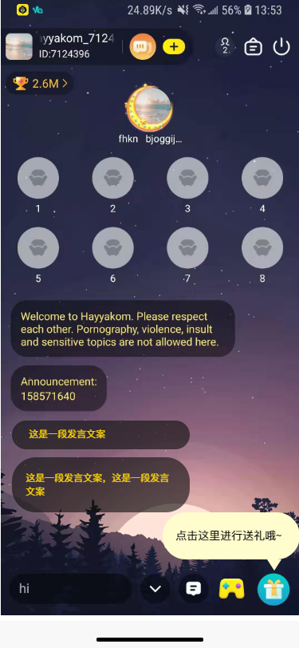

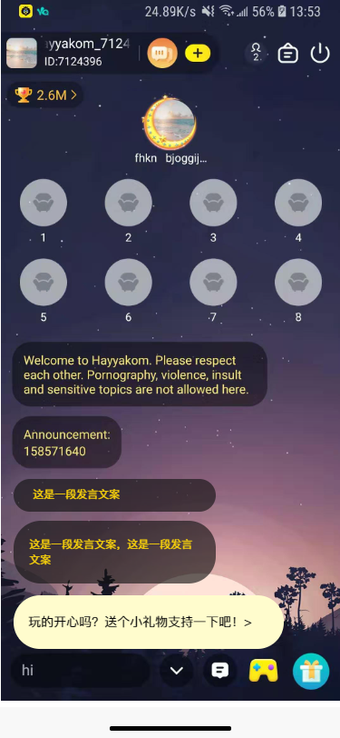

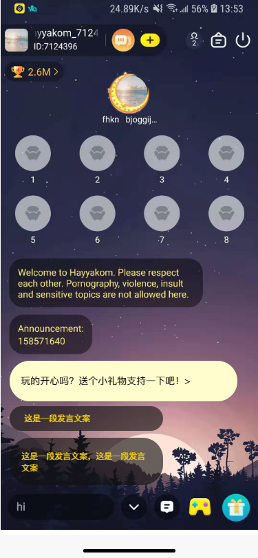

【删除】3.11.5 新注册用户进入运营房间引导

| 功能名称 | 新注册用户进入Samer引导其进入官方/运营房间 |
|---|---|
| 优先级 | 高 |
| 前置条件 | 新注册用户进入Samer |
| 功能描述 | [图1] 新注册用户进入Samer关闭签到弹窗后自动弹出“引导进入官方/运营房间”弹窗，见图1；点击关闭按钮可关闭当前弹窗，点击弹窗外区域不可关闭弹窗； 弹窗展示内容：弹窗展示用户头像、【用户名称-静态写死】、【固定文案1】、【固定文案2】、关闭按钮、“Go Have Fun”按钮： 每次注册头像从【头像库】中随机取一个头像进行展示（【头像库】包含10左右头像，后期运营提供，头像库内头像可保存至客户端） 【固定文案1】、【固定文案2】内容以翻译文档为准 “Go Have Fun”按钮添加呼吸动效 【用户名称-静态写死】：دمــꦿߦ몙દـ⃕ـ͜ـ٭ٴـوع）（见图1，具体文案从翻译文案中复制） 用户点击“Go Have Fun”按钮，页面自动跳转至官方/运营房 跳转房间数据从“后台运营管理-运营房管理”中获取数据 获取数据优先级： 1> “后台运营管理-运营房管理”用户所在语区的房间 2>“后台运营管理-运营房管理”中房间分级标签为A和B、且房间内麦位在线人数>=1的房间（麦上用户可为任何人）（房间分级标签详见3.1.3.2）。 3>如符合条件1>、2>的房间数为0，则取官方房XID: 10000进入；如符合条件1>的房间数>=1，则从中按以下优先级进行随机抽取、供用户进入： 上述规则中： 第一：房间在线人数在“后台运营管理-运营房管理-推荐标准设置”设置区间内的>区间外的 第二：房间分级标签A>B 弹出“引导进入官方/运营房间”弹窗后： 若用户关闭当前引导弹窗，展示首页-房间大厅进房引导、创建房间引导； 若用户点击“引导进入官方/运营房间”弹窗的“Go Have Fun”按钮进入引导指定房间，退出该房间后不再展示首页-房间大厅进房引导、创建房间引导 新安装的，但不是新注册用户，首页-房间大厅进房引导、创建房间引导走原有引导逻辑 5. 获得签到奖励的toast弹窗展示0.5s后弹窗才消失，toast对应文案优化（见翻译文档），toast展示时间缩短 |
| 补充说明 |  |

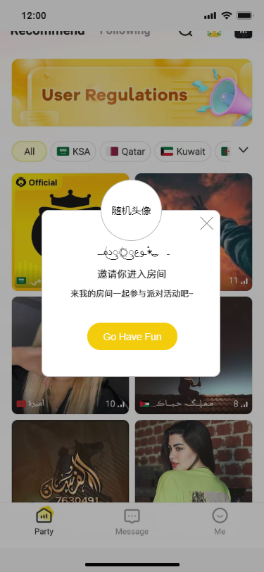

3.11.6 新注册用户国家&语区分配逻辑

| 功能名称 | 新注册用户进入Same国家展示规则和后台国家统计规则优化 |
|---|---|
| 优先级 | 高 |
| 前置条件 | 注册 |
| 功能描述 | 国家判定逻辑： 历史逻辑： 1、手机号注册，用户选择的国家 2、第三方账号注册，优先获取手机设置的国家，如果为空使用用户网络ip所在的国家，如果这个国家不在系统设置的国家列表中，设置为未知 按以下优先级给用户配对国家信息： 区号方案为SIM卡网络识别国家（可获取到SIM卡的国家和网络信息，优先取国家信息，获取不到国家信息使用网络信息）； 服务端IP识别国家； 设备地区/语言设置识别国家； 备注：1可以在用户点击第三方注册按钮的时候进行获取 以上都获取不到，设置为未知 注册归属国家影响新注册用户归属语区 【埋点】需要对新注册用户匹配国家进行埋点 用户语区归属： 用户注册后根据下表国家分配对应用户归属语区，若用户注册对应国家不在下表默认为归属英语语区，国家信息在个人中心展示“未知”； 注：用户个人资料页面国家修改限制： 用户注册后国家确认&修改： 新注册用户注册进入APP内需要先进行核心信息确认才能进入首页（若用户注册停留在此页面退出，下次登录仍需要完成此步骤） 若用户通过三方媒体账号注册对应获取到头像、昵称、性别信息则根据获取到的信息填充对应信息；若没有获取到则头像展示默认占位图，性别展示未选择状态（不支持反选），昵称展示默认昵称； 用户国家根据上述国家判定逻辑展示对应国家信息，支持用户点击进行修改，点击对应国家进入国家编辑页面，支持修改平台提供的所有国家（包括非当前客户端判定逻辑判定当前用户归属语区外的所有语区国家）； 用户个人信息确认页面所有信息支持修改；点击用户头像打开相册支持更换头像（同用户编辑头像逻辑，没有相册权限需要获取相册权限）； 若用户修改了国家信息，点击保存时二次确认弹窗提示：“30天内仅支持修改1次，后续仅能修改同语区国家【取消】 【确定】”； 若三方未获取到用户的头像、性别信息，则头像展示默认占位图，点击性别后根据性别自动匹配一个用户对应性别的默认头像（详见用户资料信息编辑中的头像编辑需求）； 点击“开启旅程”则页面进入APP首页； 用户在确认信息后，不能修改用户性别，国家信息仅支持30天后用户可修改同语区国家，但不能修改为非同语区国家，且30天内只能修改1次； 点击确认信息时，如果用户没有选择性别则弹窗提示：“你还没有选择性别哦。【好的】”； 若用户停留在“用户信息确认”页面，切到后台再次启动APP仍进入“用户信息确认”页面，杀掉程序再次启动APP进入登录页面，登录同账号仍进入“用户信息确认”页面需要完成当前用户的信息确认； |
| 补充说明 |  |

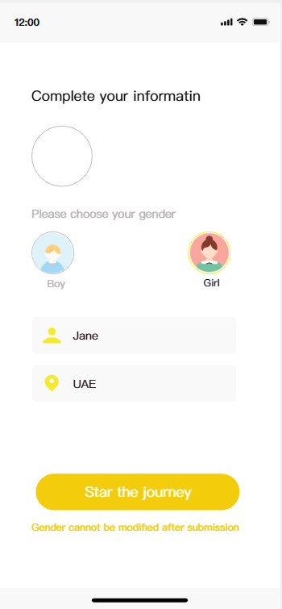

3.11.7 手机号注册国家

| 功能描述 | 注册国家 |
|---|---|
| 优先级 | 高 |
| 输入/前置条件 |  |
| 需求描述 | 图1                    图2 图3                      图4 手机号支持注册的国家： 展示排序根据英文首字母排序展示： |
| 输出/后置条件 |  |
| 补充说明 |  |
| 输出/后置条件 |  |
| 补充说明 |  |

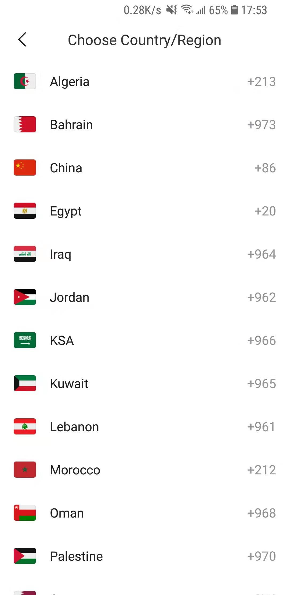

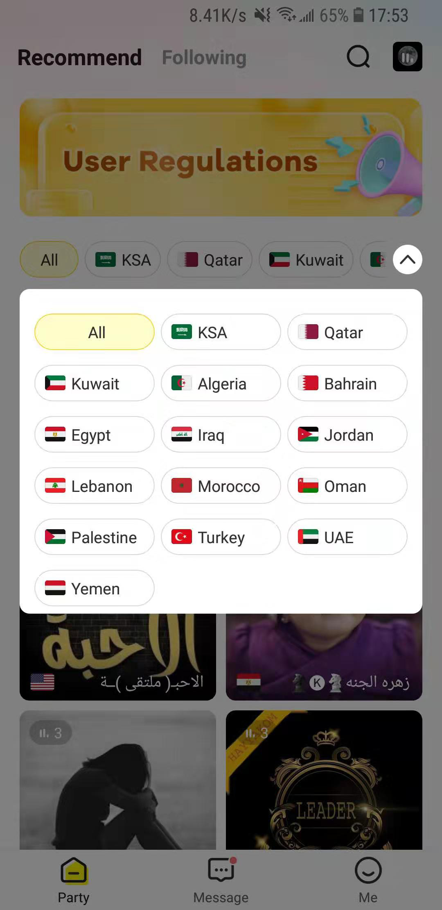

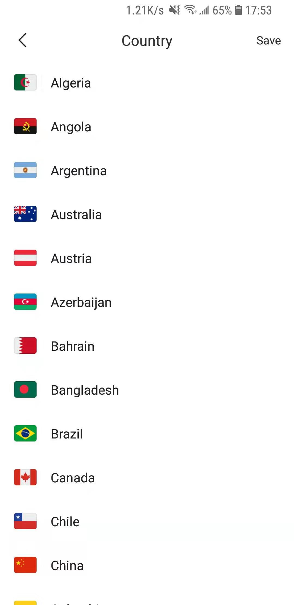

3.11.8 message 消息提示数字

| 功能名称 | message icon 消息提示优化 |
|---|---|
| 优先级 | 中 |
| 功能描述 | 消息提示由红点改为消息数 |
| 前置条件 | 用户新消息数变更 |
| 交互原型 | 「图1」 |
| 字段描述 | 「图1」底部icon消息提示数字 数值 所有新消息数friends，system，Samer，activity及私聊消息 数值实时更新用户各类新消息数变动时，数值实时更新注：用户在其它一级页时，该数值也实时更新 数值展示 0，不展示； 1~99，展示具体数字； >99，展示99+。 |
| 需求描述 |  |
| 补充说明 |  |

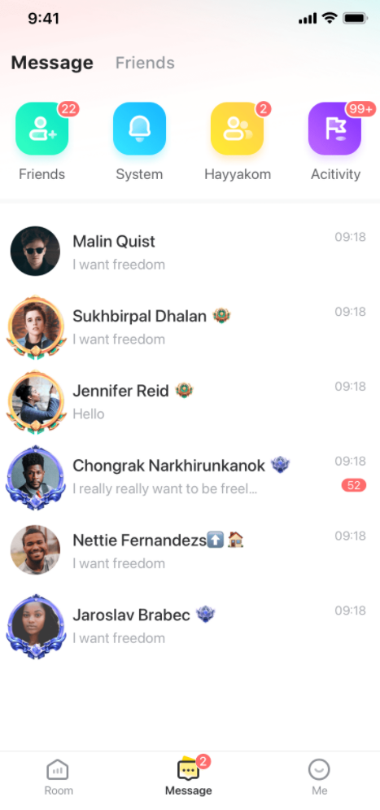

3.11.8应用组件规范

3.11.8.1 弹窗

| 命名 | 说明 | 样式 |
|---|---|---|
| 弹窗1 | 1.说明文案+确定/取消按钮（若有特殊文案按钮则会在文档中标明） 2.页面中部弹出，由小放大式效果弹出效果 3.关闭效果为直接消失 4.左边按钮为低亮，右边按钮为高亮 ，详见UI设计 |  |
| 弹窗2 | 1.说明文案+确定按钮 2.页面中部弹出，由小放大式效果弹出效果 3.关闭效果为直接消失 |  |
| 弹窗3 | 1.多选项+取消按钮 2.页面底部向上滑出 3.关闭效果为向下滑出 |  |
| 弹窗4 | 1.弹窗标题+说明文案+确定/取消按钮 2.页面中部弹出，由小放大式效果弹出效果 3.关闭效果为直接消失 4.左边按钮为低亮，右边按钮为高亮 ，详见UI设计 |  |
| 弹窗5 | 1.弹窗标题+说明文案+确定按钮 2.页面中部弹出，由小放大式效果弹出效果 3.关闭效果为直接消失 |  |
| 弹窗6 | 1、说明文案+不再提示勾选框+确定/取消按钮 2.页面中部弹出，由小放大式效果弹出效果 3.关闭效果为直接消失 4.“下次不再提示”勾选框默认为不选中状态，点击勾选框可进行选中。 5.选中下次不再提示时，关闭弹窗后该弹窗永远不再出现。未选中下次不再提示时，关闭弹窗后该弹窗下次仍会被触发。 6.左边按钮为低亮，右边按钮为高亮 ，详见UI设计 |  |

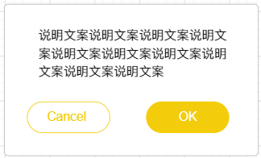

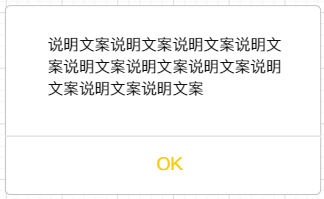

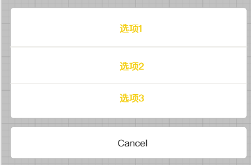

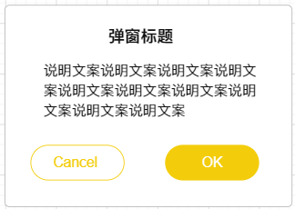

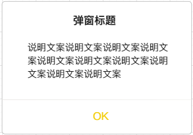

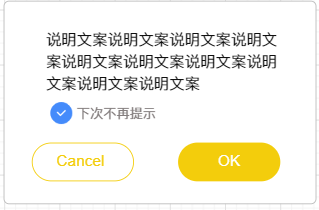

3.11.8.2 Toast提示

| 命名 | 说明 | 样式 |
|---|---|---|
| Toast | 1.说明文案 2.页面中部弹出，渐隐出现。显示3秒 3.渐隐消失 |  |

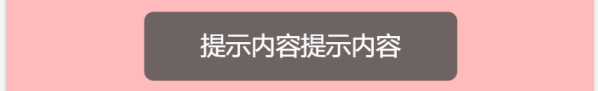

3.11.8.3 占位页

| 命名 | 说明 | 样式 |
|---|---|---|
| 占位页1 | 页面加载成功但是无数据时： 1. 占位图+说明文案 |  |
| 占位页2 | 网络请求失败导致界面为空，需要重新刷新时： 1、占位图+说明文案+操作按钮 2、占位图为“连接失败图”，占位语为“网络请求失败，请重试”，按钮文案为“再试一次”。 |  |

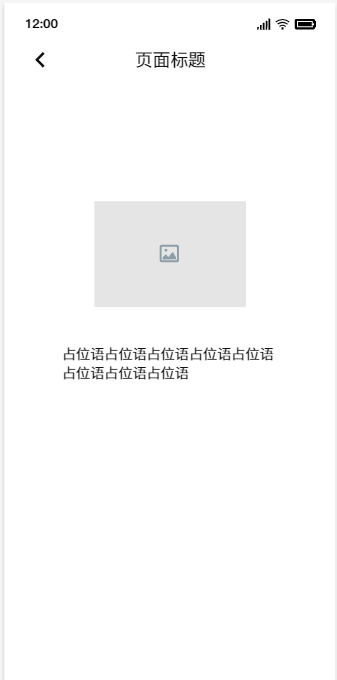

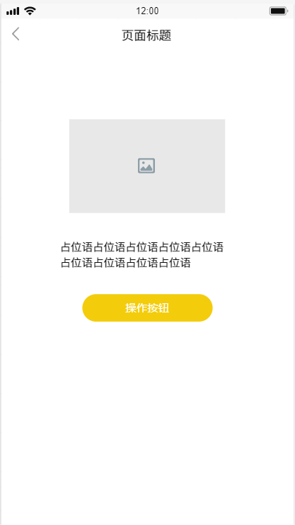

3.11.8.4 刷新加载

| 命名 | 说明 | 样式 |
|---|---|---|
| 页面加载 | 1.加载数据时通用 2.屏幕居中显示加载动画 3.加载完毕后动画消失 |  |
| 下拉刷新 | 页面下拉刷新 1. 页面顶部居中位置显示加载动画 2. 加载结束后加载动画直接消失 3. 刷新失败时，避免页面为空，仍保留原有数据，且使用【Toast】提示用户网络异常 |  |
| 上拉加载 | 页面上拉刷新 1.页面底部居中位置显示加载控件 2.加载结束后加载动画直接消失 3.刷新失败时，避免页面为空，仍保留原有数据，且使用【Toast】提示用户网络异常 |  |
| 底部占位 | 页面上拉刷新加载成功全部数据后 1. 页面底部居中位置显示“已全部加载” 2. 无法继续上拉刷新 |  |

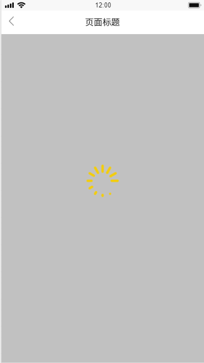

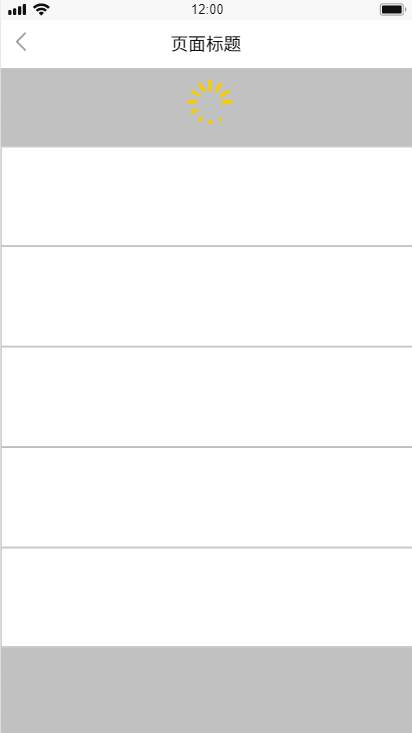

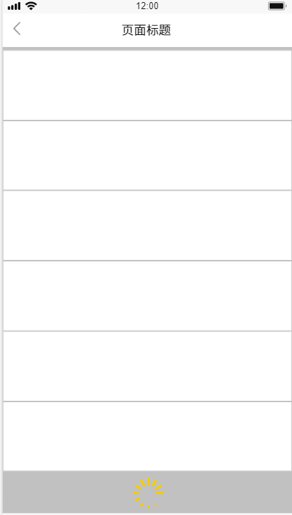

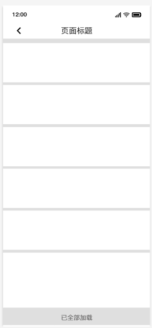

3.11.8.5时间戳显示

| 命名 | 说明 |
|---|---|
| 时间显示 | 1、时间制式：支持24h/12h两种格式，根据系统设置自动匹配对应格式。24h时，当小时小于10时，显示0X，例.09:08，07:30。 2、时间段：上午6:00-12:59，下午12:00-6:59，凌晨00:00-5:59。 3、时间段后缀：12小时制 上午10:00（10:00 AM）、下午1:00（1:00 PM）。 4、时间格式：今天、昨天、一周内、更早、跨年5个类型； 5、星期英文缩写:Mon.Tues.Wed.Thur.Fri.Sat.Sun; |

3.11.9 退款封号冻币

| 功能描述 | 用户退款后封号冻币 |
|---|---|
| 优先级 | 高 |
| 输入/前置条件 |  |
| 需求描述 | 用户退款后自动扣款、冻币、封号处理（未欠款不封号不冻币）： 自动扣款：若用户退款，自动从该用户账户扣除退款金额，若账户余额不足以扣款则立即冻币，若该用户再次充值或代理加币或后台加币需要继续扣币直到不欠平台金币即可立即解冻币； 自动扣款流水：退款扣币               -XXX金币 冻币：用户被冻币后不能进行金币消费（送礼、参与游戏、购买商城礼物）、不能钻石兑换，只能进行充值；若用户冻币期间进行金币消费或兑换钻石行为则触发弹窗提示，见下表 封号处理：若用户退款立即封号并受到封号弹窗提示，见下表： 若用户欠款：解封后仍保持冻币状态直到还清欠款，且需要在48小时内还清欠款，若在48小时内该用户没有还清欠款，需要自动再次封号处理并给用户推送封号弹窗，见下表格 若用户未欠款：解封后不会冻币，可正常消费 |
| 输出/后置条件 |  |
| 补充说明 |  |

3.11.10 SDK检查

检查应用内SDK版本，如有新版请及时查看更新说明，并升级为最新版本。包括Facebook、Twitter等快捷登录，友盟、AppsFlyer等统计，Agora语音等相关的第三方SDK。

3.11.11 支持网页删除账号

官网展示“网页账号删除”入口，点击跳转进入“网页删除”页面（见下图底部“账号删除”文案即为“网页账号删除入口”）：

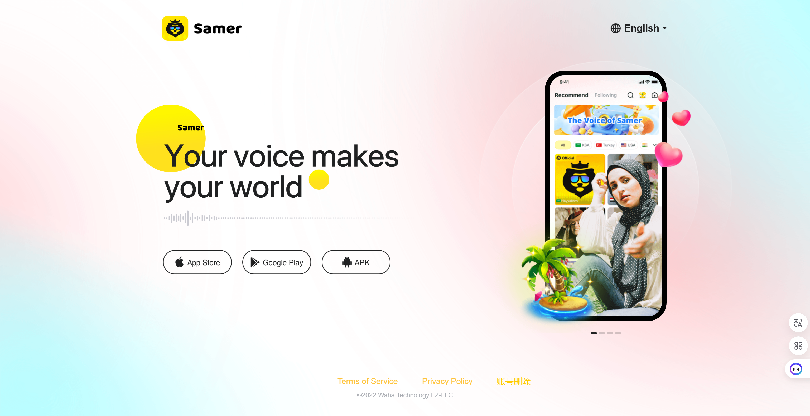

删除账号网页：

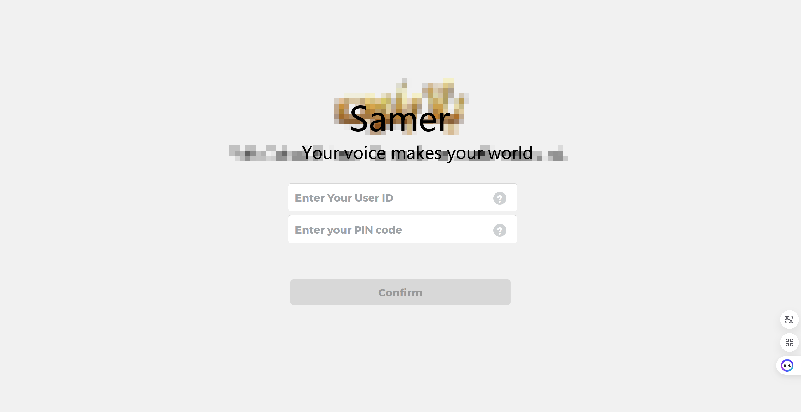

每个Samer账号在创建时自动生成一个PIN code唯一标识码（数字+字母组合），在设置页面内的-“我的 PIN code”位置展示，默认展示“***”,点击“查看”按钮支持查看完整信息，点击旁边“复制”按钮支持复制自己的PIN code，复制后toast提示“复制成功”（文案可复用复制用户昵称toast提示），见下图：

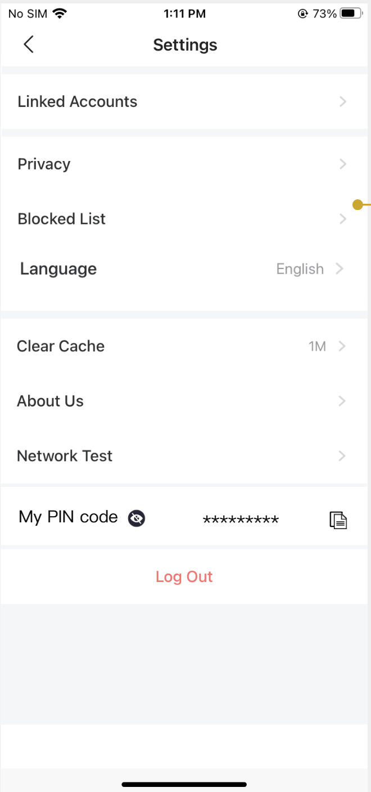

删除账号网页需要输入用户的用户ID、PIN code后点亮“确认”按钮，点击“确认”校验用户ID与对应PIN code是否匹配和正确，若错误弹窗提示：“输入的用户ID/PIN code错误。 请检查APP内信息或联系support@samer.com 。【好的】”；若输入正确二次确认弹窗：“你确定要删除用户ID为XXX的账号？删除后该账号项管信息将会被删除。【取消】 【确定】”；点击【确定】按钮toast提示：该账号已删除；

点击网页用户ID和PIN code旁的“？”图标气泡悬浮展示对应说明，点击气泡外任意区域消失，否则不消失；

用户ID说明：如果你需要找到你的用户ID请联系support@samer.com或登录APP查看你的用户ID。

PIN code说明：如果需要找到你PIN code请联系support@samer.com或登录APP在设置页面查看你的PIN code。

3.411.12 屏蔽词规则

优先级：中

需求描述：房间内聊天时的屏蔽词词语内容取自后台配置，客户端处理规则如下：

| 后台录入屏蔽词规则 | 客户端识别规则 | 客户端展示结果 | 例子 |
|---|---|---|---|
| 1.去大小写；2.去空格 例子，后台加入屏蔽词“A   B”或者”Ab“ 与“ab”的结果是一样的没有区别 | 1.去大小写；2.去空格；3.多语言输入时，每种语言的屏蔽词都要检测 例子，客户端用户输入“aaccA   B”与“aaccab”的字段，系统识别结果是一样的，没有区别 | 用户发送含屏蔽词的内容时可以发送，但是其中的屏蔽词会显示为*，且其他用户看不到。 | 敏感字为"a b" 用户发送信息为"DSJJABJ BDFSV"，客户端显示的信息为"DSJJ**J BDFSV" |

编辑用户名和个人简介、房间名和房间简介时的屏蔽词处理规则如下：

| 后台录入屏蔽词规则 | 客户端识别规则 | 客户端展示结果 | 例子 |
|---|---|---|---|
| 1.去大小写；2.去空格 例子，后台加入屏蔽词“A   B”或者”Ab“ 与“ab”的结果是一样的没有区别 | 1.去大小写；2.去空格；3.多语言输入时，每种语言的屏蔽词都要检测 例子，客户端用户输入“aaccA   B”与“aaccab”的字段，系统识别结果是一样的，没有区别 | 用户发送含屏蔽词的内容，【Toast】提示有“内容中含有敏感词”，不可提交保存。 | 敏感字为"a b" A用户编辑用户名为"DSJJABJ BDFSV" A用户用户名中包含了屏蔽词，不可以提交该用户名 |
