# 消息 — V1.0.0 原文切片

> 状态：`history`  · 来源：`demo/V1.0.0/V1.0.0.docx`

## 3.7 第七部分 消息（许静）

3.7 第七部分 消息（许静）

3.7.1 消息页列表

| 功能名称 | 消息列表 |
|---|---|
| 优先级 | 高 |
| 功能描述 | 官方和用户消息列表样式 |
| 输入/前置条件 | 消息导航页的落地页 |
| 交互原型 | 「图1」                   「图2」 |
| 字段描述 | 消息页导航 消息列表：消息页落地页； 朋友列表：好友列表； 官方消息模块，带官方标识 官方团队：问题引导和问题回复； 系统消息：系统推送的相关消息； 好友请求：关于好友请求的处理； 未读消息数量：新增消息数量，正整数，最小1当超过99条显示“99+”； 用户消息模块 用户头像/用户昵称； 未读消息数量：新增消息数量，正整数，最小1当超过99条显示“99+”； 最后一条消息的时间和格式 当前自然日内的：hh:mm 前一个自然日的：Yesterday hh:mm 其他时间：dd/MM hh:mm 当前和当前用户聊天内容的最后一条的检视： 文字：就显示具体文字内容，超过一行长度部分用“…”； 表情：如果是表情那么用“「表情」”显示； 文字和表情那么显示：“文字内容「表情」”（表情部分用“「表情」”来替换）； 礼物：如果是礼物那么用“「礼物」”显示； 如果最后一条消息发送失败则带有发送失败的“叹号”标识； |
| ；需求描述 | 官方消息模块 1. 静止，用户滑动消息列表只是滑动用户消息模块； 用户消息模块 消息展示逻辑 优先展示未读消息（权重一） 再按照最后一条消息距离当前时间点最近时间点的倒序显示（权重二） 点击对应用户所在行，进入消息详情页； 向左滑动对应用户所在行，展示内容向左移动，右侧显示安卓和苹果均统一为长按显示“删除”弹窗如「图2」，点击“删除”后删除对应用户所在行列，如若下方有其他用户消息，则上移占位原删除用户所在行； 导航页 如果有未读消息，导航栏中的“消息”右上角展示对应提示； |
| 补充说明 | 注：发送失败的消息和普通消息一样，不需要优先展示，参考上方“权重二”； |

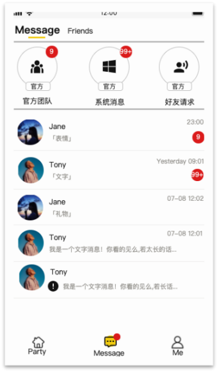

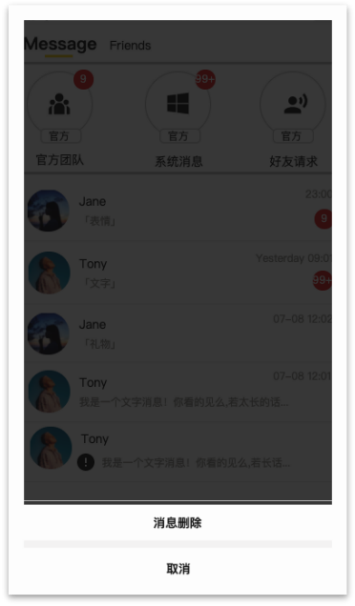

3.7.2系统消息

| 功能名称 | 系统消息提示 |
|---|---|
| 优先级 | 高 |
| 功能描述 | 系统消息 |
| 输入/前置条件 | 消息列表进入 |
| 交互原型 | 「图1」                        「图2」 |
| 字段描述 | 官方消息图标 官方标识 官方消息标题：具体根据实际整理内容分类显示； 该条消息时间格式：dd/MM hh:mm； 消息详情：具体的消息内容，展示全文； |
| 需求描述 | 排序按照消息的时间倒序显示； 当官方消息为空时显示样式「图2」； |
| 补充说明 | 系统消息当前类型； |

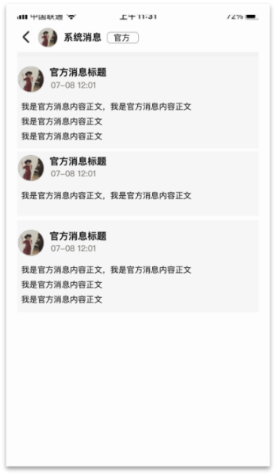

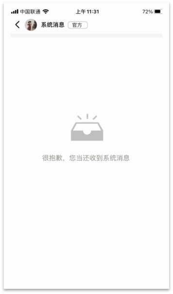

3.7.3官方团队

| 功能名称 | 官方团队消息 |
|---|---|
| 优先级 | 高 |
| 功能描述 | 官方消息功能 |
| 输入/前置条件 | 消息列表进入 |
| 交互原型 | 「图1」 |
| 字段描述 | 官方团队图标：不可点击 官方标识 |
| 需求描述 | 时间戳展示格式，详情参考下方用户聊天详情页的时间戳展示逻辑； 消息输入窗口，详情参考下方用户聊天详情页的输入窗口逻辑； 1.新用户注册成功时，该页面自动收到一条欢迎消息，消息内容为“欢迎来到Samer，如果您有什么问题和意见，可以在这里告诉我们哦～。”。 3、问题反馈：与设置中的问题反馈共用后台； 3.1页面底部可快速选择反馈的类型，可左右滑动查看所有类型。共四种类型：“APP问题”、“充值”、“建议”、“其它”，必选且单选，默认选中“APP问题”。 3.2用户可以通过输入框发送反馈内容。输入框中无内容输入时，显示占位语“Say something”。若仅输入了空格或者换行，没有其他内容，或者没有输入内容时，则发送按钮置灰不可点击。 3.3 反馈内容发出后，消息面板中仅需展示用户手动输入的内容，反馈类型不需要显示。与此同时，系统自动给出回复，回复内容为“感谢你的反馈！我们会尽快给您回复，请在“我的反馈”中查看”，其中“我的反馈”为按钮，颜色需突出显示，点击进入“我的反馈”页面； 3.4输入框中每发出一条反馈，便会提交一条反馈信息，在“我的反馈”页生成一条反馈记录。 用户的反馈被回复时，发送一条通知消息至当前页，消息内容为“你的反馈已被回复，请在“我的反馈”查看。”，其中“我的反馈” 颜色突出显示，点击进入“3.2.7.3我的反馈“页面； |
| 补充说明 |  |

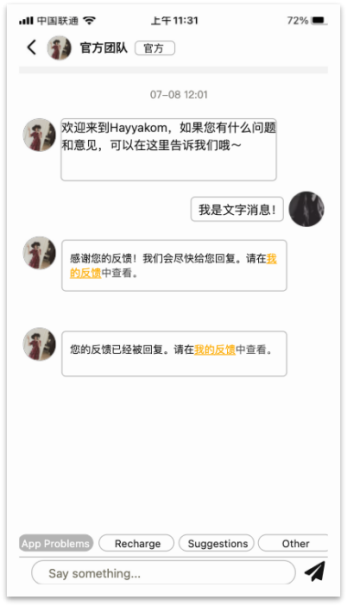

【删除】3.7.4好友申请

| 功能名称 | 好友申请 |
|---|---|
| 优先级 | 高 |
| 功能描述 | 好友申请信息处理 |
| 输入/前置条件 | 好友列表进入 |
| 交互原型 | 「图1」                         「图2」 「图3」                    「图4」 |
| 字段描述 | 「图1」好友申请列表 用户头像/用户昵称； 预留信息：好友申请时用户预留信息； 时间点：好友请求生成时间，时间格式：dd/MM hh:mm； 处理状态：已同意/已拒绝；待处理状态为“同意”按钮；已过期：1个月（请求生成后30个自然日，720小时内） |
| 需求描述 | 列表显示按照好友请求生成时间的时间倒序显示，只显示最近1个月的数据； 处理按钮：未处理的消息显示“同意”按钮；已经处理、已经超时的消息则不可再点击； 点击同意判断用户好友是否已经达到上限； 如果达到上限toast提示“对不起，您的好友数量已达上限！”如「图1」； 如果没有达到上限，则toast提示“已同意！”； 对于未处理的和未过期的好友请求，点击好友所在行，进入处理详情页如「图2」； 带入好友申请信息；并给出选择； 同意：判断如果达到上限toast提示“对不起，您的好友数量已达上限！”如果没有达到上限，则toast提示“已同意！”，显示处理结果并停留当前页面，如「图4」； 拒绝：点击拒绝“toast”提示“已拒绝！”，显示处理结果并停留当前页面，如「图4」； 5. 对于已经过期的好友请求和已经处理过的好友请求，点击友所在行，则进入他人资料页； 6. 当好友申请为空时，显示滞空样式如「图3」； |
| 补充说明 | 补充情况说明： 当同一个人的好友请求出现在了A、B两个手机上，B手机处理了该请求，A手机则在触发该条消息的时候获取最新的关系状态，产生状态变更； |

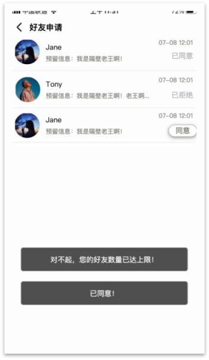

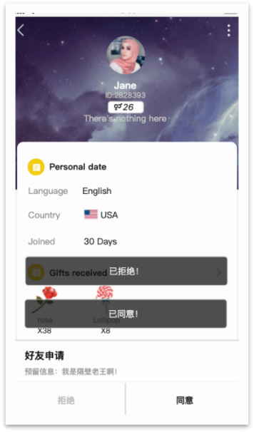

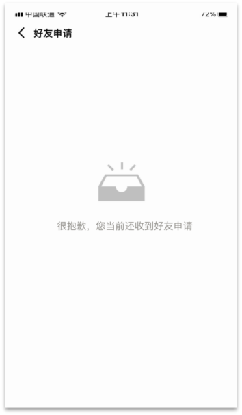

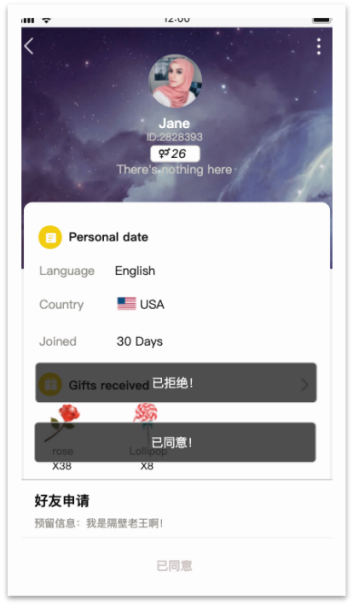

3.7.5私聊详情

| 功能名称 | 私聊详情页 |
|---|---|
| 优先级 | 高 |
| 功能描述 | 用户消息 |
| 输入/前置条件 | 消息列表或者其他入口 |
| 交互原型 | 「图1」                   「图2」 |
| 字段描述 | 用户头像：点击后进入用户详情页； 用户昵称； 消息时间格式 当前自然日内的：hh:mm 前一个自然日的：Yesterday hh:mm 其他时间：dd/MM hh:mm 距离上一条消息中间超过5分钟则显示时间戳； 礼物 显示礼物图片； 显示礼物数量； 显示礼物名称； |
| 需求描述 | 陌生人之间聊天限制，陌生人之间可以发送消息和送礼，成为好友不限制 1.1送礼：每日不限制次数； 1.2文字、表情，每个自然日针对每个陌生人只可发送20条消息（服务端配置，若后期限制单个用户单日发消息总数量，接口需要支持），超限则弹窗提示“陌生人之间每日只可发送20条消息！”选择“取消”关闭弹窗，点击“添加好友”则进行添加好友流程判断，如「图2」； 2. 文字消息气泡需要根据文字消息内容数量适配；如「图1」； 3. 送礼样式： 3.1 显示礼物图片配合对应礼物数量； 3.2 如果是对方送的则提示：“给您送礼物「礼物名称」” 3.3 如果是本人送的则提示：“您送出礼物「礼物名称」” 3.4 礼物名称需要根据用户当前使用的设置语言区分英语或阿语“礼物名称”； 4. 点击用户头像，进入他人主页的样式； |
| 补充说明 |  |

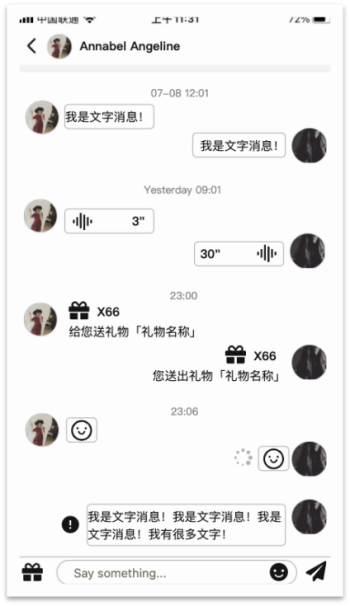

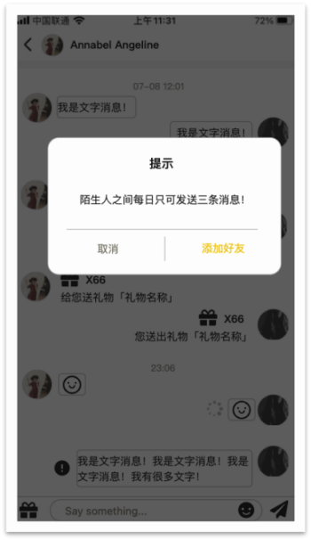

3.7.5.1私聊详情 - 异常提示

| 功能名称 | 相关异常处理 |
|---|---|
| 优先级 | 高 |
| 功能描述 | 异常提示和处理 |
| 输入/前置条件 | / |
| 交互原型 | 「图1」                                       「图2」 |
| 字段描述 | / |
| 需求描述 | 消息发送中的样式如「图1」 如若30s内持续发送失败，则变成“叹号”标识，并给出toast提示“发送失败，请稍后再试！”； 点击“叹号”标识，从下方向上弹出选项如「图2」，点击黑色和“取消”则关闭弹窗；如若点击“重新发送”则叹号标识消失，重新进行消息发送； |
| 补充说明 |  |

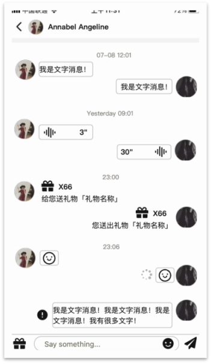

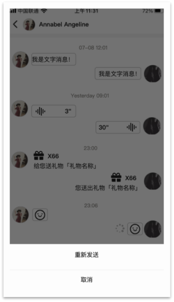

3.7.5.2私聊消息 - 文字表情输入

| 功能名称 | 私聊消息 |
|---|---|
| 优先级 | 高 |
| 功能描述 | 聊天消息 |
| 输入/前置条件 | 私聊详情页触发 |
| 交互原型 | 「图1」                 「图2」 「图3」                     「图4」 「图5」 |
| 字段描述 | / |
| 需求描述 | 输入窗 默认为空的请下输入窗提示“说些什么”； 点击后激活输入状态，光标落入输入窗，从下向上显示全键盘，输入窗和聊天内容整体上移，送礼按钮变成“退出输入状态”按钮如「图1」； 输入窗口最多可以输入300个字符，支持多行显示，但是最多5行，超过300个字符后不显示，自动截断，当有内容输入后，提示文案隐藏如「图2」； 点击聊天窗口中的“表情”按钮，变成表情输入状态，“表情”按钮变更为“键盘”按钮； 如果是文字输入状态变更表情输入状态，键盘被替换为表情列表如「图3」，未发送内容保留； 如果是非输入状态，则直接进入表情输入状态如「图4」； 如果表情列表一页显示不开支持上下滑动，右下角有“退格”按钮用于删除输入的内容； 点击选择表情，并且在输入窗中显示，可以和文字一起发送，表情也算在60个字符内； 再次点击“键盘”按钮或者直接点击输入窗，则变更回文字输入状态； 点击“退出输入状态按钮”（包括文字和表情）或者单机消息列表，都可退出输入状态，如若输入窗口中有未发送消息，消息保留，如若多行回归单行显示，超过一行显示的用“…”表示如「图5」，再次单机输入窗或者点击“表情”按钮进入输入状态显示； 点击“发送”按钮，如果输入窗无消息，点击无效果，如果有消息则发送消息，但如果全都是空格则法发送，如果是空格+内容，则之前的空格部分保留并可发送； 对方收到的消息顺序格式于发出消息的顺序一致； 发送时需要进行屏蔽词检测，详情参考“屏蔽词规则” 黑名单判断 先判断对方是否在此用户的黑名单中，如果在黑名单则toast提示“您已将对方拉黑！” 再判断此用户是否在对方的黑名单中，如果在对方黑名单中，则toast提示“对方将您拉黑，无法发送消息！”； 当输出窗中有消息但是点击了页面的返回按钮，直接返回上级页面，输入窗中的消息不保留； |
| 补充说明 |  |

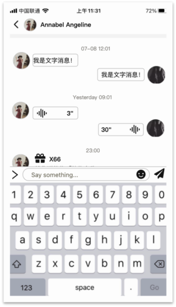

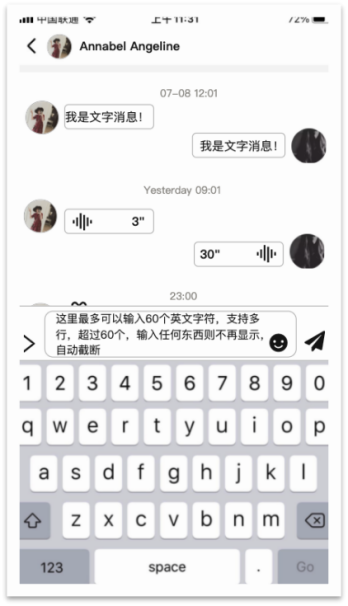

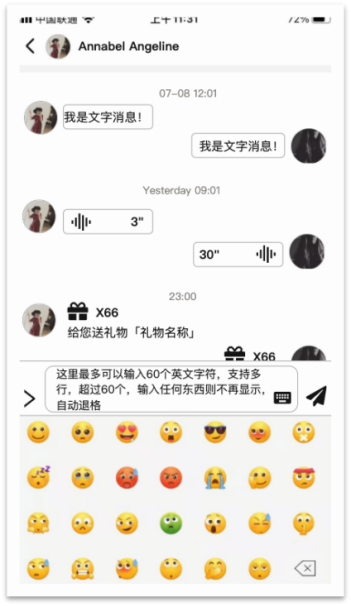

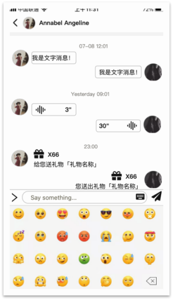

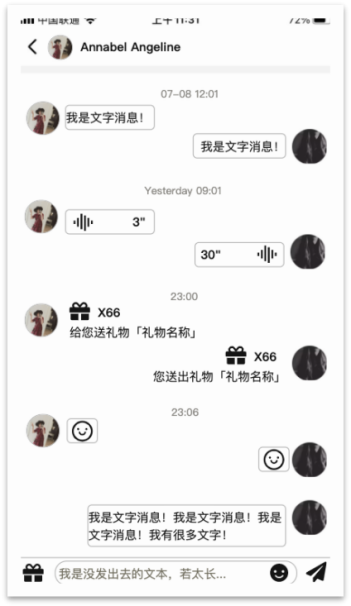

3.7.6 私聊送礼

| 功能名称 | 私聊送礼 |
|---|---|
| 优先级 | 高 |
| 功能描述 | 私聊场景中，支持送礼物给对方 |
| 输入/前置条件 | 点击私聊页面右下角“礼物”icon |
| 交互原型 | 「图1」                          「图2」 「图3」                          「图4」 「图4」 |
| 字段描述 | 送礼逻辑和判断以及跳转参考聊天房中送礼逻辑； 区别在于消息详情页的送礼为定向送礼，因此不需要筛选送礼对象，因此无选择用户菜单，送礼后样式如“图1聊天详情”页展示； 如果送礼的礼物包含特效的大礼物，则需要展示对应的特效； 如果对方送礼时，此用户在非对应的聊天详情页，之后此用户进入此聊天详情页则需自动展示对应效果； 「图1」私聊送礼 入口：右下角原发送按钮，改为动态按钮。 当输入框无内容时，显示送礼按钮，点击后关闭键盘（若有），并唤起送礼面板。 当输入框有内容时，显示发送按钮。点击后发送消息，清空输入框，变为送礼按钮。 礼物消息：显示礼物图+送礼个数。 送礼文案：送你{礼物名称}，送出{礼物名称} 若礼物图片加载失败，显示占位图。 「图2」私聊送礼浮层 功能逻辑同房间送礼浮层，区别为： 左下角送礼对象，写死为聊天对象。 UI改为浅色系，适配私聊页面。 「图3」幸运礼物弹窗 用户赠送幸运礼物，获奖时，展示幸运礼物弹窗。 「图4」礼物说明展示（无全站礼物说明） 私聊页面展示幸运礼物、活动礼物、周星礼物的礼物说明。但不展示全站礼物的说明。 展示与关闭规则同房间。 「图5」送礼新手引导 用户第一次打开送礼面板，展示送礼引导。仅展示2步，见蓝湖。 引导仅显示一次。优先级低于房间送礼引导。 若房间送礼已显示引导，则用户打开私聊送礼时不再显示。 若私聊送礼已展示过引导，但用户第一次打开房间送礼面板，则须再次展示房间送礼面板的送礼新手引导。 新手引导的关闭规则，同房间送礼面板。 |
| 需求描述 | 送礼消息透出到信息页。 送礼消息，在信息页展示，一律显示为”[礼物]“。 送礼消息时间戳说明 送礼消息与聊天消息共享时间戳规则。即距离上一条消息（含送礼消息、文字消息）超过5分钟则显示时间戳。 非好友送礼限制说明 非好友送礼无限制，不计入每天20条消息的限制中。（即每天20条限制，仅统计文字消息条数。） 若非好友之间存在拉黑关系，则无法送礼，参考下方第4条。 黑名单送礼黑名单判断用户点击发送礼物按钮时，进行如下判断 先判断对方是否在此用户的黑名单中，如果在黑名单则toast提示“您已拉黑对方” 再判断此用户是否在对方的黑名单中，如果在对方黑名单中，则toast提示“送礼失败，您已被拉黑” |
| 补充说明 | 不展示送礼特效： 私聊送礼不展示礼物特效；送全站礼物，不会在其它房间广播展示。 |

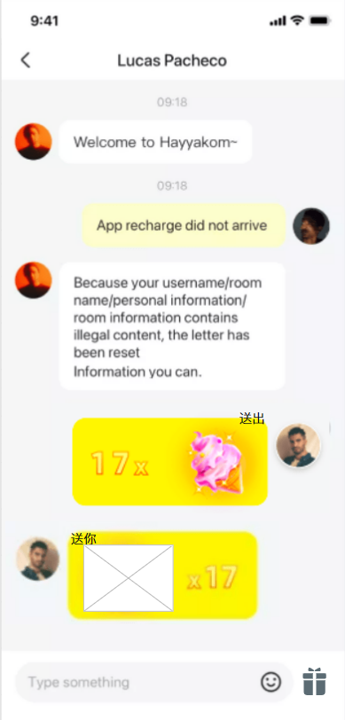

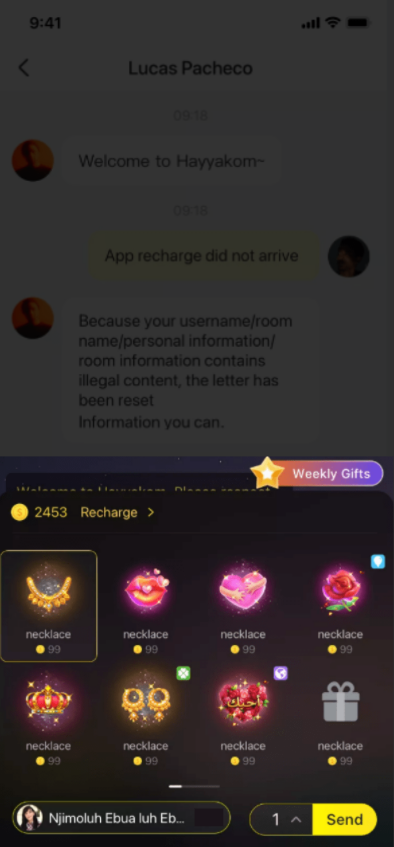

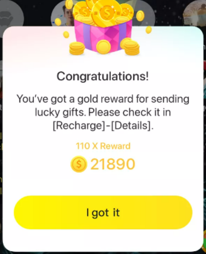

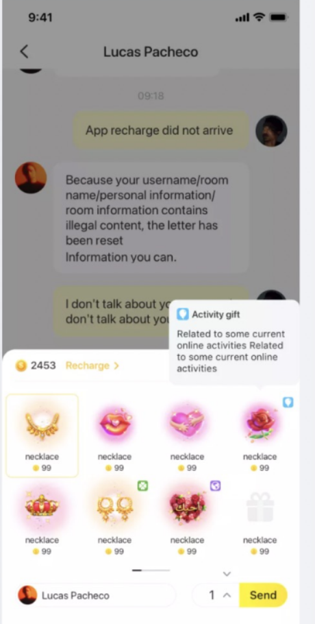

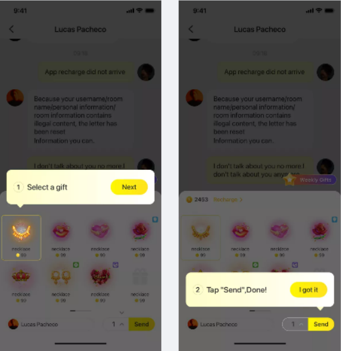

3.7.7 好友列表

| 功能名称 | 好友列表 |
|---|---|
| 优先级 | 高 |
| 功能描述 | 好友列表详情 |
| 输入/前置条件 | 消息中的朋友标签 |
| 交互原型 | 「图1」                    「图2」 |
| 字段描述 | 搜索栏：支持昵称和ID搜索 用户头像/用户昵称/用户ID |
| 需求描述 | 列表排序：按照成为好友的时间倒序排列显示，距离当前时间点最近的优先展示； 点击用户头像，进入他人详情页； 点击用户所在行，以及“聊天”按钮，进入和该用户的聊天详情页； 好友列表滞空样式和个人主页朋友列表（3.2.3.2好友列表）滞空提示相同如「图2」,点按钮跳房间列表页； |
| 补充说明 | / |

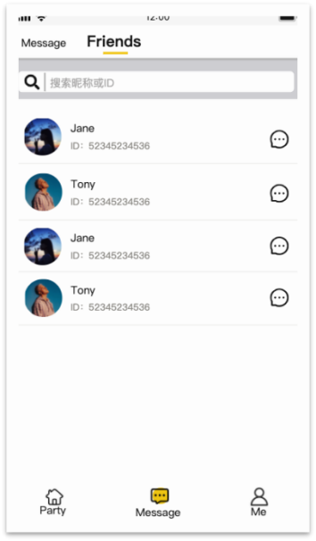

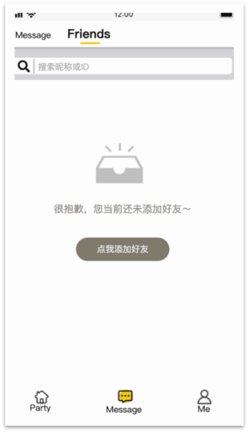

3.7.7.1好友列表 – 搜索

| 功能名称 | 好友列表 – 搜索 |
|---|---|
| 优先级 | 中 |
| 功能描述 | 模糊搜索列表中好友 |
| 输入/前置条件 | 好友列表 |
| 交互原型 | 「图1」                    「图2」 「图3」 |
| 字段描述 | / |
| 需求描述 | 当搜索框中无信息输入时给出提示文案“点击搜索ID或昵称” 点击搜索框，激活搜索出入窗口，光标落入搜索窗，全键盘从下方弹入；输入窗右侧出现“取消”按钮，点击后清空搜索结果和搜索窗信息，并退出输入和搜索结果样式，反回列表； 输入框最多支持30个字符输入上限，超过的将不予显示，自动截断； 根据输入的内容进行实时匹配，只支持连续字符匹配不支持分割，匹配对应的匹配对应的昵称或者用户， 如果有匹配内容，匹配相同部分高亮显示如「图1」和「图2」； 匹配结果按照成为好友的时间倒序排列显示，距离当前时间点最近的优先展示； 如果无匹配结果，则显示为空如「图3」； |
| 补充说明 |  |

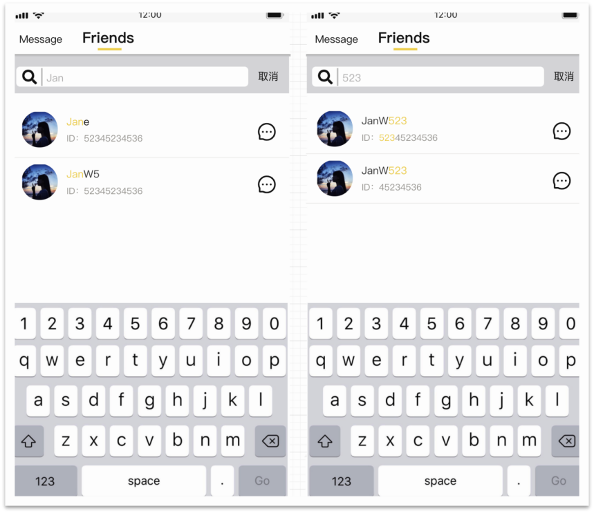

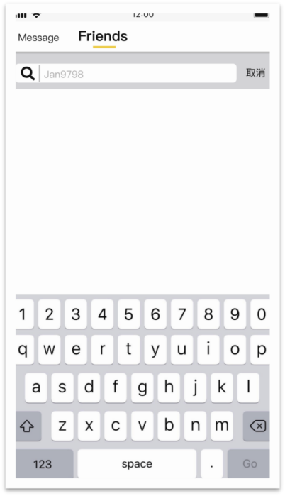

3.7.8 成为好友发私聊消息

| 功能名称 | 成为好友发私聊消息 |
|---|---|
| 优先级 | 高 |
| 功能描述 | 双方成为好友后，发一条系统消息 |
| 前置条件 |  |
| 交互原型 | [图1] [图2]                            [图3] |
| 需求描述 | [图1]消息页列表 消息展示 双方成为好友后，双方用户消息模块均展示【成为好友消息】“我们现在已经是好友，发送消息开始聊天吧。”字符长度超过一行用“...”表示。 2.未读消息数 双方成为好友后，好友申请方用户消息模块右侧和底部tab的message右上角的未读消息数量+1；如未读消息数量超过99条，则展示99+。 特殊说明 如果双方成为好友后，一方移除好友关系，双方再次成为好友时，好友双方均在用户消息模块展示【成为好友消息】，且好友申请方未读消息数+1。 如果【加好友设置】是不需要好友验证，则双方成为好友后，以接受邀请方的名义发送【成为好友消息】：“我们现在已经是好友，发送消息开始聊天吧。”，且仅在好友申请方用户消息模块右侧和底部tab的message右上角的未读消息数量+1，仅在好友申请方端用户消息模块均展示【成为好友消息】。 [图2]私聊详情页 展示内容：点击用户消息模块用户所在的行进入私聊详情页，聊天页面展示时间（沿用现有逻辑）+头像+【成为好友消息】提示：“我们现在已成为好友，发送消息开始聊天吧。”其中，该提示以接受好友邀请方的名义发送，双方均可见。 该条消息会随着消息数量的增多而滑走。 [图3]房间消息按钮 1.双方成为好友后，若【成为好友消息】提示未读，房间底部的消息按钮未读消息数+1；如未读消息数量超过99条，则展示99+。 |
| 补充说明 |  |

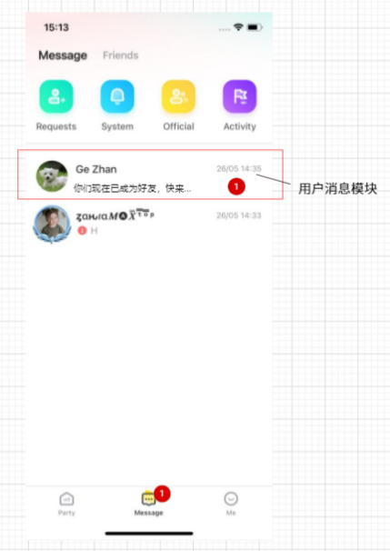

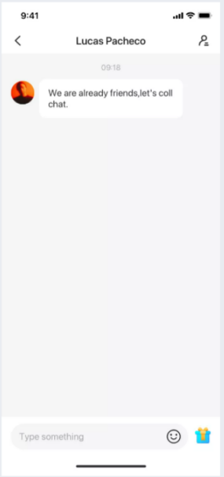

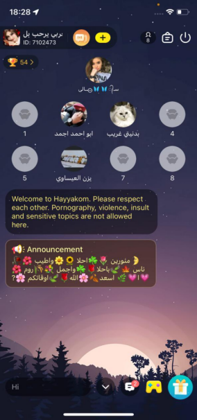
