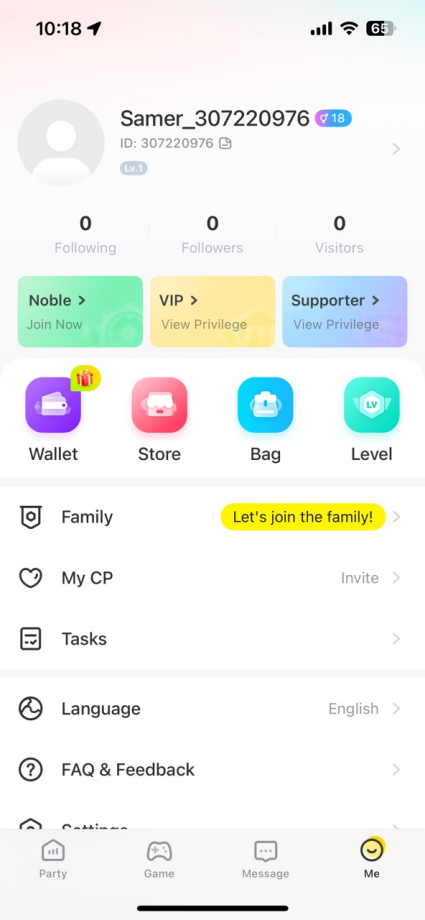
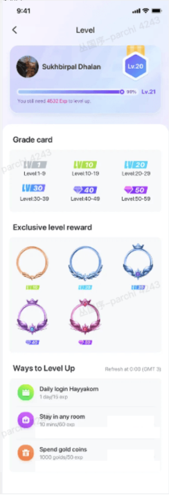
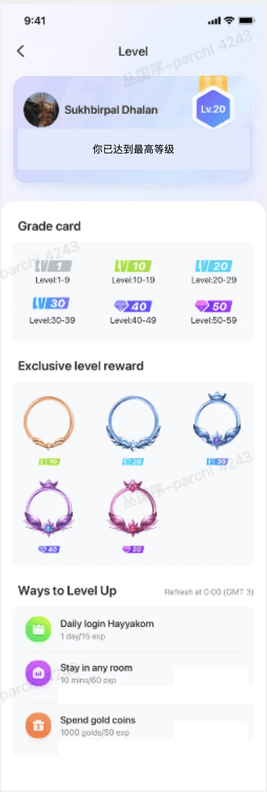
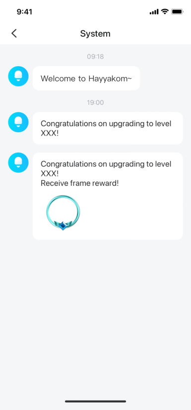

# 用户等级 — V1.0.0 原文切片

> 状态：`history`  · 来源：`demo/V1.0.0/V1.0.0.docx`

## 3.3 第三部分：用户等级（丛国序）

3.3 第三部分：用户等级（丛国序）

3.3.1 用户等级页

| 功能名称 | 用户等级页 |
|---|---|
| 优先级 | 高 |
| 功能描述 | 用户通过活跃、互动、送礼/收礼来提高用户等级。 |
| 输入/前置条件 |  |
| 交互原型 | 「图1」                                「图2」 「图3」 |
| 字段描述 | 「图1」等级入口 我的页面中点击“等级”进入； 「图2」等级页面 显示用户当前等级的等级牌； 当用户等级未满级： 显示“还剩x,xxx,xxx 经验升级”，x,xxx,xxx以千分位显示 升级进度条及对应百分比计算公式：(目前拥有经验-当前等级经验)/(下一级经验-当前等级经验) 当用户等级达到满级： 用户达到满级（59级）后，不再示进度条，且文案改为“你已达到最高等级“，页面高度自适应压缩。 等级牌 展示不同等级段的奖牌样式。每10级区分1个样式； 目前区分等级为Lv10、Lv20、Lv30、Lv40、Lv50； 举例：1-9展示一种，10-19个展示同一种，以此类推，直到50-59； 获得经验（12.31日修改升级任务经验） 升级奖励 显示升级奖励，从10级开始，每隔10级赠送1个头像框。奖品内容见下方表格。（等级牌升级无需展示在升级特权中） 例如第10级获得一个，20获得一个，一次类推到50级； |
| 需求描述 | 升级规则说明 升级规则 每次获得经验，判断是否达到省级要求，若达到则升级； 用户升级后，再次判断当前经验是否满足升级要求； 不降级规则无论经验为多少，用户等级只升不降。 经验规则说明 经验累进制升级后，用户经验不清空，会一直累积。 经验加成若用户有经验加成特权，则每次获得经验均会进行加成。 获得经验=用户行为对应经验*贵族加成（目前暂无其它加成）（12月31·日删除） 注1：仅加成获得经验数值，而不加成经验上限。 注2：不同贵族等级的加成系数均不同。未来会开放加成系数更高的贵族身份。 经验上限：用户获得某笔经验时，判断是否达到该行为上限 若已达上限，则该笔经验值作废。 若获得后将超过上限，则仅获得部分经验（恰好到上限）。 若获得后不会超过上限，则获得全部经验。 注2：计算获得经验上限时，除了基础经验数值外，还包含加成后的经验，例如贵族额外0.1x经验。 不同行为获得经验数值规则说明 呆在房间中 用户连续呆在房间中时，每10分钟发放1次20Exp。 用户退出房间，或进入其它房间时，会累计上个房间呆的时间。 消费金币 用户每次消费金币/获得钻石时，计算本次获得的经验。 获得经验计算步骤： 先计算【消费金币数/4000】，然后取整（1月19日更新） 若有加成系数后，则在计算结果后乘上加成系数，再做一次取整 其余行为：为完成行为后到账 进度（当前经验/今日经验上限） 当前经验定义：用户当天（自然日）在该升级方式获得的经验 获得经验=用户行为获得基础经验*该用户贵族加成 进度条：以进度为准，展示实际进度 刷新文案：Ways to Level Up后增加“每天0点（GMT+3）刷新”； 奖品发放规则： 用户升到对应等级后，若该等级配置了奖品，则自动获得奖品。 不补发说明：用户已错过的等级，若增加奖品，则不补发。例如5级时，增加配置了2级奖品，则该用户不会被补发2级奖品。 |
| 补充说明 |  |

3.3.2 升级通知

| 功能名称 | 升级弹窗&系统通知 |
|---|---|
| 优先级 | 高 |
| 功能描述 | 用户升级时，通过弹窗与系统消息告知用户升级。 |
| 输入/前置条件 | 用户升级 |
| 交互原型 | 「图1」           「图2」 「图3」 |
| 字段描述 | 「图1」升级获奖弹窗 触发条件：当用户所升等级将获得升级奖品时，APP全局弹窗。（目前为升级到Lv10、Lv20、Lv30、Lv40、Lv50.时，弹出升级弹窗。） 升级弹窗「图1」： 2.1 展示所升等级。 2.2 按钮文案：查看奖品。 2.3 交互：点击按钮，展示动效，弹出下一个弹窗。 升级奖励弹窗： 展示获得奖品图片。（每个升级奖品的图片单独配置并展示。） 按钮文案：收下； 交互：点击按钮，关闭弹窗； 多个升级弹窗同时触发时：先展示低等级的升级弹窗，关闭后再展示下一个升级弹窗。 「图3」升级系统提示 用户升级时，发送system消息给用户。文案为：“恭喜你升到xx级。“ 如果升级带有奖励：“恭喜你升到xx级。获得头像框奖品+【升级奖品对应图片】。 |
| 需求描述 |  |
| 补充说明 |  |

