# 基建与其他 — V1.0.0后台 原文切片

> 状态：`history`  · 来源：`demo/V1.0.0/V1.0.0后台.docx`

## 文首

Samer后台v2.0.0

产品需求文档

文件标识：

| Samer后台v2.0.0 |  |  |
|---|---|---|
| 文件状态 [√]草稿 []修改 []正式发布 | 文件标识： |  |
|  | 当前版本： | V1.0.0 |
|  | 作    者： | 产品部 |
|  | 完成日期： | 2025/12/26 |

修订记录：

| 文档版本 | 修订日期 | 修订内容 | 修订人 |
|---|---|---|---|
| 1.0 | 2025/12/26 | 初稿 | 产品部 |

一、 概述1

1.1 目的和范围1

二、 产品概述1

2.1 产品介绍与原型1

2.2 后台规范1

2.2.1 选择项1

2.2.2 折线图3

2.2.3 数据表3

2.2.4 弹窗3

2.2.5 操作规范4

2.2.6 页面批注4

三、 产品功能4

3.1第一部分 登录和后台管理5

3.1.1 登录主页5

3.1.2 修改密码&退出登录6

3.1.3 登录异常8

3.1.4 后台管理8

3.1.4.1页面模块8

3.1.4.2页面菜单9

3.1.4.3角色管理10

3.1.4.4管理员管理11

3.2第二部分 数据统计13

3.2.1 用户统计13

3.2.1.1 「改」新增用户（增加土语筛选和列表土语展示）13

3.2.1.2 「改」活跃用户（增加土语，和和土语筛选）14

3.2.1.3 「改」用户留存（增加土语筛选）15

3.2.1.4 「改」用户平台时长（增加土语筛选）15

3.2.1.5 「改」新用户充值（增加土语筛选）17

3.2.1.6 「改」新用户来源（增加土语，增加来源Google，Tiktok备选后续会接入）18

3.2.1.7 「改」平台日总表（增加土语筛选）19

3.2.1.8 「改」平台消耗日总表（增加土语筛选，去除了钻石相关抽成，去除了钻石兑换金币）20

3.2.1.9 「改」新人行为统计日表（删除当前游戏相关的统计）21

3.2.1.10 用户平台时长详情23

3.2.2 房间统计23

3.2.2.1 「改」房间在线统计（增加土语筛选，删除相关游戏房间）23

3.2.2.2 「改」房间消耗明细（增加土语，和土语筛选）24

3.2.2.3 「改」活动房/运营房统计（增加土语，删除游戏相关）24

3.2.3 消费统计25

3.2.3.1 「改」用户充值得币（增加土语筛选和土语语区）25

3.2.3.2  用户充值日志26

3.2.3.3  用户充值操作日志27

3.2.4 商品统计28

3.2.4.1 「改」金币统计（增加土语筛选和语区）28

3.2.4.2 「改」宝石统计（增加土语和筛选，删除宝石兑换，宝石变更为平台的免费币）30

3.2.4.3 「改」礼物统计（增加土语，货币类型保留金币和宝石）31

3.2.4.4 礼物查询32

3.2.4.5 周星统计32

3.2.4.6「改」商品统计（增加土语，和土语筛选）33

3.2.4.7用户金币流向33

3.2.4.8 「改」幸运礼物数据统计（新增土语和筛选）34

3.2.5礼物计数器数据总览35

3.2.6 渠道报表统计日表36

3.2.7 排行榜后台38

3.2.8 任务统计38

3.2.8.1 新手任务统计38

3.2.8.2 每日任务统计39

3.2.9 客服处理统计40

3.3第三部分 运营管理41

3.3.1 管理房间41

3.3.1.1 【改】房间管理41

3.3.1.2 运营房管理45

3.8.13 运营&官方房考核标准46

3.2.1.1 【改】运营房考核46

3.2.1.2 【改】官方房考核50

3.2.1.3 【改】官方房-管理员工作时间配置54

3.3.1.4 官方账号添加好友56

3.3.1.5 官方管理员配置57

3.3.1.5 【改】房间标签58

3.8.4 房间广播-后台59

3.3.2 用户管理61

3.3.2.1 账号信息 – 列表61

3.3.2.2用户信息 – 用户信息详情62

3.3.2.3 用户列表66

3.3.2.4 用户列表 – 功能操作67

3.8.12 封禁设备号&后台69

3.4.6.2 设备号封禁69

3.8.7 账号封禁-后台72

3.3.3 货币管理73

3.3.2.1 【改】申请加减币73

3.3.2.2 货币审核记录75

3.3.2.3 【改】货币操作查询76

3.3.2.7 退款冻币用户76

3.8.10 自动封号记录-后台78

3.8.15 用户充值日志增加补单功能79

3.8.14 添加手动补单操作82

3.8.15金币流向明细查询83

3.8.14 网络测试结果记录86

3.8.10 【改】其他调整87

3.4第四部分 平台配置87

3.4.1 【改】商品管理87

3.4.1.1 礼物管理87

3.4.1.2 幸运礼物管理89

3.4.1.3 周星礼物管理91

3.4.2 【改】商城管理后台92

3.4.2.1 添加商品、编辑商品操作（保留贵族相关配置）93

3.4.4 【改】商品赠送95

3.4.4.1 创建赠送商品弹窗96

3.4.4.2 确认赠送二次确认弹窗97

3.4.4.3 系统消息98

3.4.4 靓号赠送99

3.4.4 VIP赠送99

3.6.2 打招呼文案模板配置后台100

3.8.2 平台排行榜白名单101

3.4.4 【改】其他调整102

3.5第五部分 币商相关后台103

3.1.5.1 【改】开通充币代理权限103

3.1.5.2 【改】给充币代理加减币105

3.1.5.3 【改】代理转账记录查询107

3.1.5.4 平台给代理自动补币109

3.1.5.5 代理金币操作-申请加/减币支持撤回109

3.1.5.6 代理充值白名单110

3.1.5.7 【增】币商代理灰名单111

3.1.5.1 申请操作查询和审核记录112

3.1.4.2  Agency消息运营后台113

3.1.4.3 官方&Agency消息优化115

3.6 第六部分 管理后台116

3.6.1「改」举报管理（增加图语和筛选）116

3.6.2 反馈处理120

3.6.2.1 「改」登陆问题反馈（增加土语）120

3.6.2.2 「改」应用内问题反馈（增加土语）121

3.6.2.3 「改」回复子分类管理（增加土语配置）123

3.6.2.4 「改」回复模版配置（增加土语）124

3.6.2.4 「改」回复分类管理（增加土语）125

3.6.3 敏感词管理127

3.6.3.1 「改」关键词管理 – 列表（增加土语）127

3.6.3.2 「改」关键词管理 – 新增编辑（增加土语）127

3.6.4 消息管理128

3.6.4.1 「改」惩罚理由文案配置（增加土语内容，注释掉主播惩罚次数）128

3.6.4.2 「改」惩罚消息文案配置（增加土语）129

3.6.4.3 「改」System消息推送（增加土语）130

3.6.4.4 「改」房间广播（增加土语）132

3.6.4.5 「改」打招呼文案模板（增加土语）133

3.6.5 VIP功能后台134

3.6.5.1 靓号赠送134

3.6.5.2「改」运营后台 – VIP功能（去除贵族相关）135

3.6.6 后台操作记录140

3.6.6.1 用户/房间操作记录（Action Record）140

3.6.6.2操作记录142

3.6.6.3 身份修改记录142

3.6.6.4 后台登陆记录143

3.6.7 拉新后台功能144

3.6.7.1分享拉新通用 - 开关144

3.6.7.2拉新分享通用 – 奖励配置145

3.6.7.3拉新后台配置 – 个人拉新后台管理147

3.6.7.4拉新后台配置 – 个人拉新活动周期管理150

3.6.7.5拉新后台配置 – 个人拉新活动统计154

3.6.7.6拉新后台配置 – 个人拉新充值活动统计156

3.6.7.7拉新后台配置 – 币商团队拉新后台管理160

3.6.7.8拉新后台配置 – BD团队拉新后台管理164

3.6.7.9拉新后台配置 – 币商团队拉新活动周期管理169

3.6.7.10拉新后台配置 – BD团队拉新活动周期管理173

3.6.7.11拉新后台配置 – 币商拉新活动统计177

3.6.7.12拉新后台配置 – 币商拉新充值活动统计179

3.6.7.13拉新后台配置 – BD拉新活动统计183

3.6.7.14拉新后台配置 – BD拉新充值活动统计185

3.6.7.15新用户奖励配置 – 奖励配置188

3.6.7.16新用户奖励配置 – 消费190

3.6.7.17新用户奖励配置 – 其他任务192

3.6.7.18新用户奖励配置 – 领取记录194

3.6.7.19新用户奖励配置 – 任务完成度统计194

3.7 第七部分 平台基础配置195

3.7.1 签到管理后台195

3.7.2 活动和Banner管理-后台198

3.7.2.1 「改」活动管理列表（新增土语）198

3.7.2.2 「改」活动管理新增活动（增加土语）198

3.7.2.3 「改」活动管理复制操作（增加土语）199

3.4.5.1 「改」Banner列表（增加土语的筛选和显示）200

3.4.5.2 「改」Banner编辑新增（增加土语的选择，删除多余的banner场景）201

3.8 第八部分 后台配置202

3.8.1 「改」版本配置对比（增加土语）202

3.8.2 域登陆-后台203

【二批新增】3.9 第九部分 其他需求204

3.9.1 个人靓号变动记录204

3.9.2 设备指纹封禁205

3.9.3 设备指纹风控记录205

3.9.4 【改】房间广播205

3.9.5 增加币商账户冻币逻辑205

概述

1.1 目的和范围

Samer运营后台是一个配合Samer客户端提供辅助功能和数据报表的内部支撑工具，后台主要模块为数据统计、运营管理、平台配置、审核后台、后台配置。

产品概述

2.1 产品介绍与原型

Samer后台是为了配合Samer应用中的部分显示以及配合应用运营及数据统计而形成的数据显示及操作集合。

产品原型图请见链接：

https://modao.cc/app/827bbec4eb3a33698e44429b45d2dce1a9a06a6f?simulator_type=device&sticky

密码：Samer2021

2.2 后台规范

2.2.1 选择项

| 命名 | 说明 | 样式 |
|---|---|---|
| 起止日期 | 选择器时间默认为：当前日期减6天~当前日期。 选中的日期区间有颜色显示，头尾两天颜色不同。 若当天日期没有被选中，当天的日期特别显示。 点击两次同一个日期即代表选择单日。 | 正常状态： 选择状态： |
| 单日时间 | 选择器时间默认为当日。 选中的日期有颜色显示。 若当天日期没有被选中，当天的日期特别显示。 | 正常状态： 选择状态： |
| 内容选择器 | 点击下拉后，显示框变色。 鼠标滑过选择项时，该选项有颜色显示。 下拉高度最多显示10项，多于10项上下滑动查看所有。 | 正常状态： 选择状态： |
| 输入框1 | 1、点击输入框，输入框变色 | 文本框正常状态： 文本框输入状态： |
| 输入框2 | 2.点击后获取焦点，选择框高亮，超出字符限制时无法输入； | 文本域输入状态： |
| 具体时间选择器 | 选择器显示的是一天之中的时间点。 可点击小时或分钟数字出现下拉选项。 选中小时或分钟进行选择时，小时或分钟有选中样式，如变色。秒不可选择，固定为“00”. 小时的选择项为0~23，分钟的选择项为0/10/20/30/40/50. | 正常状态： 选择小时： 选择分钟： |
| 选择框 | 1、交互默认选中第一项 |  |

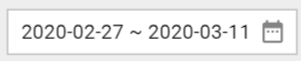

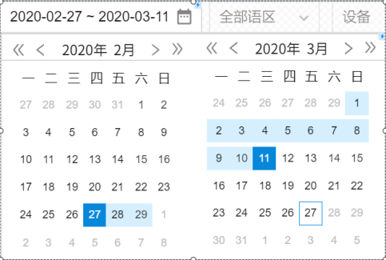

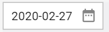

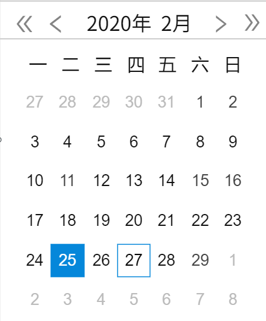

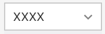

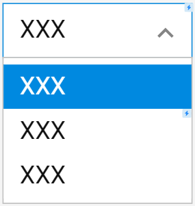

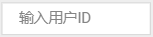

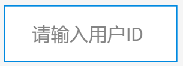

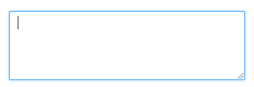

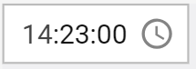

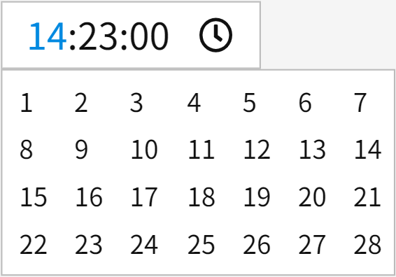

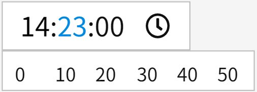

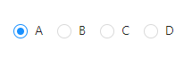

2.2.2 折线图

| 命名 | 说明 | 样式 |
|---|---|---|
| 鼠标悬停 | 1、鼠标悬停在折线图某一节点时，在节点旁边悬浮显示该节点的详细数据。 | 正常状态： 鼠标悬停状态： |

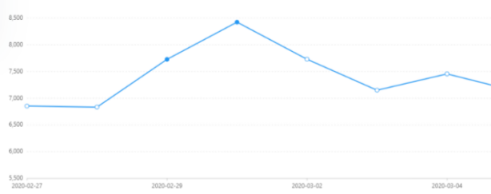

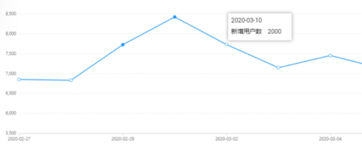

2.2.3 数据表

| 命名 | 说明 | 样式 |
|---|---|---|
| 数据表分页 | 数据表显示内容超过100条时，进行分页显示，数据表最下方显示页数跳转。 页数最多显示10个，超过10页时第8位显示为省略号，第9、第10位显示最后两页。 可手动输入页数进行跳转。 |  |

2.2.4 弹窗

| 命名 | 说明 | 样式 |
|---|---|---|
| 弹窗1 | 1.标题+说明文案+确定/取消按钮 2.页面中部弹出，由小放大式效果弹出效果 3.关闭效果为直接消失 4.没有特殊说明的情况下，标题文案均为“提示” |  |
| 弹窗2 | 1.标题+说明文案+确定按钮 2.页面中部弹出，由小放大式效果弹出效果 3.关闭效果为直接消失 4.没有特殊说明的情况下，标题文案均为“提示” |  |

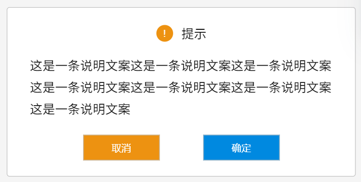

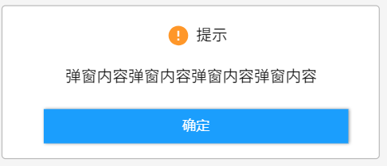

2.2.5 操作规范

| 命名 | 说明 | 样式 |
|---|---|---|
| Toast提示 | 1.在所有最下级操作弹窗中点击确定/确认按钮保存当前弹窗的操作，Toast提示“操作成功”，然后自动关闭弹窗。 |  |

2.2.6 页面批注

| 命名 | 说明 | 样式 |
|---|---|---|
| 浮层 | 部分页面中含有问号图标，鼠标移入“问号图标”出现浮层如右图，鼠标移除“问号图标”浮层消失，浮层大小由内容决定。浮层固定宽度待定。 所有页面的批注内容后续会给出单独文档。 |  |

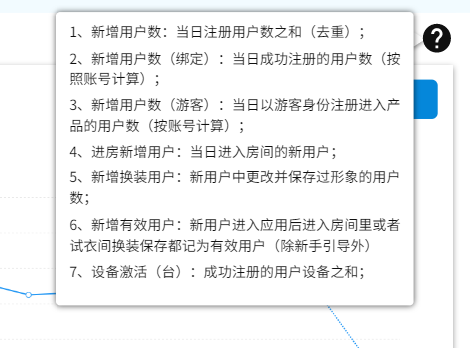

产品功能

基础架构沿用Hayyakom项目运营后台
