# 基建与其他 — V1.1.0 原文切片

> 状态：`history`  · 来源：`demo/V1.1.0/V1.1.0.docx`

## 文首

需求详见链接地址：4

https://365.kdocs.cn/l/ccv8EJpLSbQw4

3.2 第二部分 抽奖活动（许静）4

3.2.1 活动入口4

3.2.2 【H5】活动页面&抽奖规则5

3.2.3 【H5】中奖弹窗&中奖记录15

3.2.4 【H5】成就排行榜17

3.2.5 【H5】兑换商品19

3.2.6 【H5】规则说明24

3.2.7 活动引导25

3.2.8 活动通知26

3.3 第三部分 房间内需求27

3.3.1 爆奖礼物（许静）27

3.3.1.1 新增“爆奖”礼物类型&赠送规则27

3.3.1.2 礼物玩法&中奖规则29

3.3.1.3 【含H5】礼物中奖榜单&我的中奖记录34

3.3.3 房间支持打开半屏水果机（许静）39

3.3.4 【H5】动物机（换皮水果机）39

3.3.6 支持用户关闭房间礼物动效（许静）41

3.4 第四部分 其他优化需求43

3.4.1 新人礼包优化（许静）43

3.4.2 图片审核三方更换自研SDK（许静）44

3.4.3 靓号和VIP场景补充 – 补绑模块（丛国序）44

3.4.4靓号和VIP场景补充 – 个人拉新场景（丛国序）45

3.4.5靓号和VIP场景补充 – 团队拉新场景（丛国序）46

3.4.6 靓号和VIP场景补充 – 团员贡献（丛国序）48

3.4.7 展示规则调整 – 团队管理（丛国序）49

3.4.8 榜单增加轮播展示（丛国序）51

3.4.9新用户玩法展示规则优化（丛国序）52

3.4.10房间内增加麦位置玩家VIP标识（4月23重新补充）53

3.4.11红点提示优化 – me页面（丛国序）54

3.4.12拉新绑定新增– 顶部消息弹出提示和系统消息推送（丛国序）57

3.4.13团长邀请 - 团队邀请限制提示（丛国序）58

3.4.14新手玩法支持多任务阶梯配置（丛国序）59

3.4.15 修改信息的验证码说明页面的文案调整（丛国序）60

3.4.1主动推送（丛国序）61

3.4.17渠道埋点统计（丛国序）63

3.4.19 技术优化@姚泽 64

3.4.20 水果机开关优化（许静）66

3.5第五部分 登录-优化新增（丛国序）67

3.5.1登录新增67

3.5.2 上次登录记忆69

3.5.3 后绑定入口71

3.6 第六部分 新功能 – 福利券体系（丛国序）73

3.6.1消息类型73

3.6.2 券历史获得记录74

3.6.3 获得弹窗提示76

3.6.4 VIP体验券 – 列表78

3.6.5 VIP体验券 – VIP页面83

第七部分 后台需求85

3.7.1  增加“爆奖”礼物类型（许静）85

3.7.2 “爆奖”礼物统计（许静）86

3.7.3 “爆奖”礼物消费统计（许静）87

3.7.4 官方/运营房考核后台（许静）88

3.7.5 后台补单发送系统消息（许静）89

3.7.8工具配置 – 体验券 – 券配置（丛国序）89

3.7.9 工具配置 – 体验券 – 使用记录（丛国序）91

3.7.10发放体系 – 发放配置（丛国序）92

3.7.11发放体系 – 用户群体配置（丛国序）96

3.7.12 拉新后台，要本版本完成（丛国序）97

3.7.14 水果机/动物机统计后台（许静）98

3.7.15平台预警机制（丛国序）98

三、特殊基准参数配置100

四、告警通知功能100

第八部分：版本埋点101

## 3.4 第四部分 其他优化需求

3.4 第四部分 其他优化需求

3.4.1 新人礼包优化（许静）

| 功能描述 | 新人礼包优化 |
|---|---|
| 优先级 | 高 |
| 输入/前置条件 |  |
| 需求描述 | 图1 新人礼包奖励UI展示优化； 弹窗增加展示当前推荐房间的信息，见图1： 当前房间的房主/管理员头像，优先选在房的女性的头像； 展示前三个在房用户的头像；若房间无人不展示头像； 展示房间名称； 点击“加入”按钮或房间卡片区域进入当前推荐的房间； |
| 输出/后置条件 |  |
| 补充说明 |  |

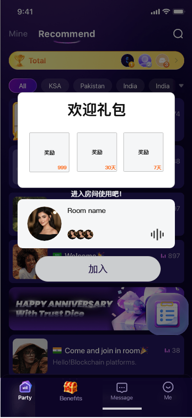

3.4.2 图片审核三方更换自研SDK（许静）

| 功能描述 | 图片审核三方更换自研SDK |
|---|---|
| 优先级 | 高 |
| 输入/前置条件 |  |
| 需求描述 | 图片三方审核由阿里三方更换为公司自研SDK 涉及场景：上传用户头像、上传房间封面、房间内发送图片、私聊发送图片、举报上传图片、问题反馈上传图片； 注：三方审核与自研审核支持配置比例； |
| 输出/后置条件 |  |
| 补充说明 |  |

3.4.3 靓号和VIP场景补充 – 补绑模块（丛国序）

| 功能名称 | 靓号场景补充 |
|---|---|
| 优先级 | 高 |
| 功能描述 | / |
| 输入/前置条件 | / |
| 交互原型 | 「图1」                    「图2」 |
| 字段描述 | / |
| 需求描述 | 「图1」补绑二次确认弹窗 「图2」已绑定状态点击弹出绑定信息 补充如果是VIP用户，昵称带有高亮（那个黄色），以及对应的VIP等级铭牌，靓号场景； 昵称长度做限制，如果昵称过长用“…”展示 当玩家信息状态变更后，重新打开刷新； |
| 补充说明 | / |

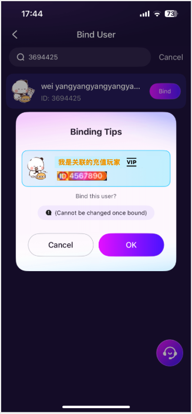

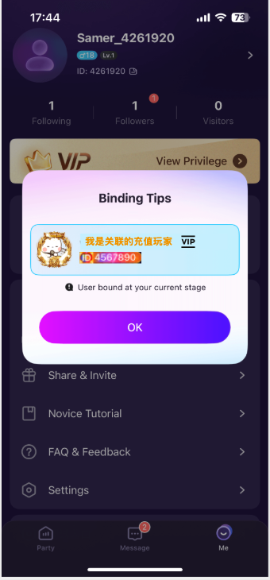

3.4.4靓号和VIP场景补充 – 个人拉新场景（丛国序）

| 功能名称 | 个人拉新 |
|---|---|
| 优先级 | 高 |
| 功能描述 | / |
| 输入/前置条件 | / |
| 交互原型 | 「图1」                    「图2」                    「图2」 |
| 字段描述 | / |
| 需求描述 | 「图1」:个人拉新页中的“团长”模块信息部分 如果玩家信息为VIP和靓号状态下，昵称展示对应高亮“黄色”，VIP勋章不展示； ID展示靓号 「图2」：个人拉新页下的充值玩家榜单，包括1日，7日，30日三个TAB下都支持； VIP昵称高亮“黄色”，VIP等级勋章； ID靓号展示； 「图3」：个人拉新页下的，被拉新玩家列表 VIP昵称高亮“黄色”，VIP等级勋章； ID靓号展示 拉新列表支持靓号/原始XID搜索，用原始ID和靓号都可搜索到同一个人，但是展示靓号ID 通用说明：当玩家信息状态变更后，刷新后展示新状态； |
| 补充说明 | / |

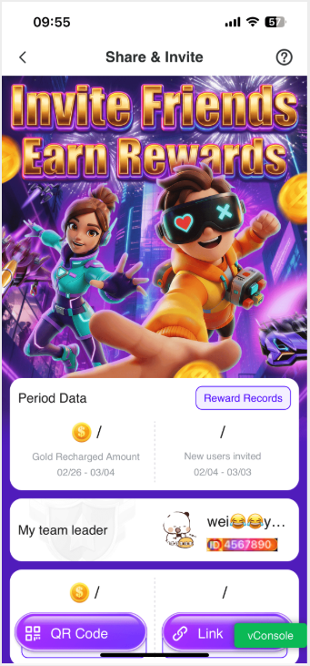

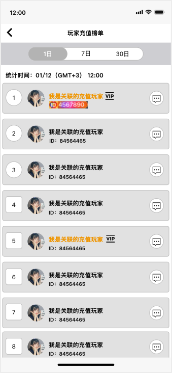

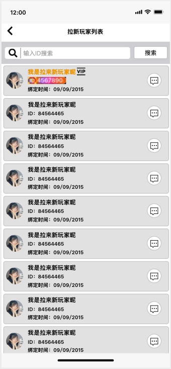

3.4.5靓号和VIP场景补充 – 团队拉新场景（丛国序）

| 功能名称 | 团队拉新场景 |
|---|---|
| 优先级 | 高 |
| 功能描述 | / |
| 输入/前置条件 | / |
| 交互原型 | 「图1」                    「图2」 「图3」                     「图4」 |
| 字段描述 | / |
| 需求描述 | 「图1」：团队拉新页下的充值玩家榜单，包括1日，7日，30日三个TAB下都支持； VIP昵称高亮“黄色”，VIP等级勋章； ID靓号展示 「图2」：团队拉新页下的，被拉新玩家列表 VIP昵称高亮“黄色”，VIP等级勋章； ID靓号展示 拉新列表支持靓号/原始XID搜索，用原始ID和靓号都可搜索到同一个人，但是展示靓号ID 「图3」：团队贡献下，某团员拉新充值玩家周期榜单； VIP昵称高亮“黄色”，VIP等级勋章； ID靓号展示 「图3」：团队贡献下，某团员拉新人数玩家周期榜单 VIP昵称高亮“黄色”，VIP等级勋章； ID靓号展示 通用说明：当玩家信息状态变更后，刷新后展示新状态； |
| 补充说明 | / |

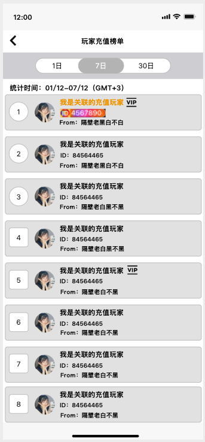

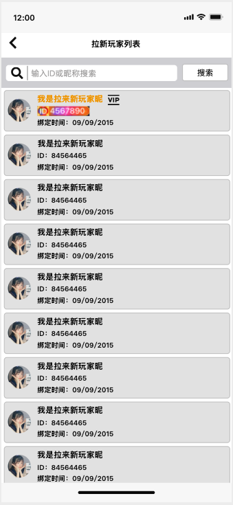

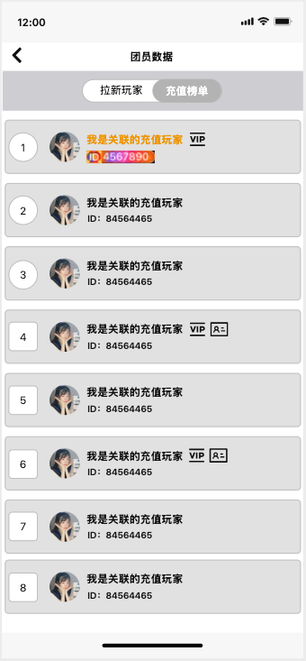

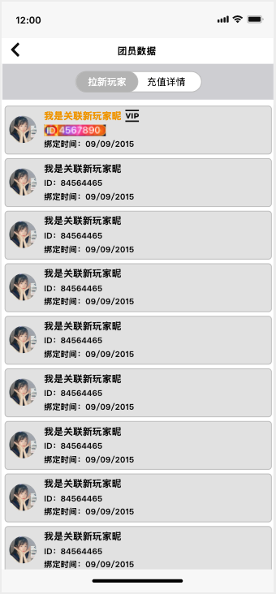

3.4.6 靓号和VIP场景补充 – 团员贡献（丛国序）

| 功能名称 | 团员贡献 |
|---|---|
| 优先级 | 高 |
| 功能描述 | / |
| 输入/前置条件 | / |
| 交互原型 | 「图1」                    「图2」 |
| 字段描述 | / |
| 需求描述 | 「图1」：团队很周期数据，充值相关，团员贡献信息； VIP昵称高亮“黄色”，VIP等级勋章； ID靓号展示； 「图2」：团队很周期数据，拉新相关，团员贡献信息； VIP昵称高亮“黄色”，VIP等级勋章； ID靓号展示； 通用说明：当玩家信息状态变更后，刷新后展示新状态； |
| 补充说明 | / |

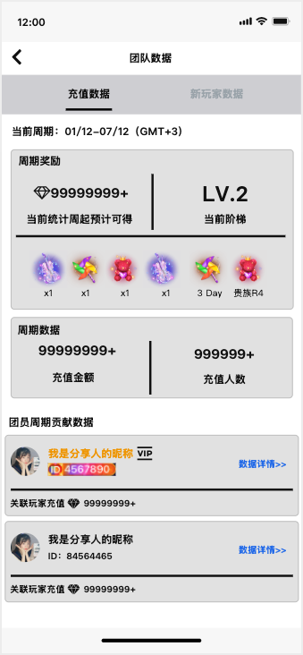

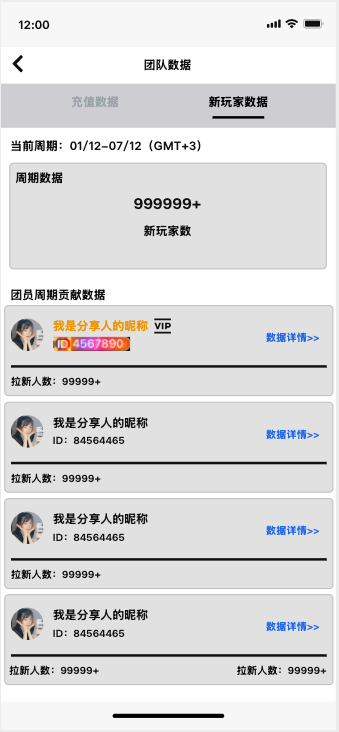

3.4.7 展示规则调整 – 团队管理（丛国序）

| 功能名称 | 团队管理模块功能调整 |
|---|---|
| 优先级 | 高 |
| 功能描述 | / |
| 输入/前置条件 | / |
| 交互原型 | 「图1」               「图2」                「图3」 |
| 字段描述 | / |
| 需求描述 | 「图1」：团队列表； 团长会保持在列表首位展示，当滑动时随列表上下滑动，只作为列表第一个呈现； 展示团长个人标签，只是点击头像，跳转自己的自己资料； VIP昵称高亮“黄色”，VIP等级勋章； ID靓号展示； 「图2」：邀请新成员搜索； 支持靓号/原始XID搜索，用原始ID和靓号都可搜索到同一个人，但是展示靓号ID； VIP昵称高亮“黄色”，VIP等级勋章； ID靓号展示； 「图3」：删除成员 进入删除成员页面后，列表不展示团长自己 VIP昵称高亮“黄色”，VIP等级勋章； ID靓号展示； |
| 补充说明 | / |

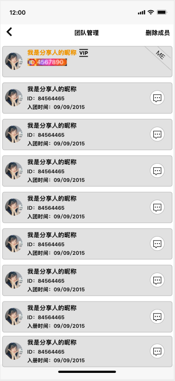

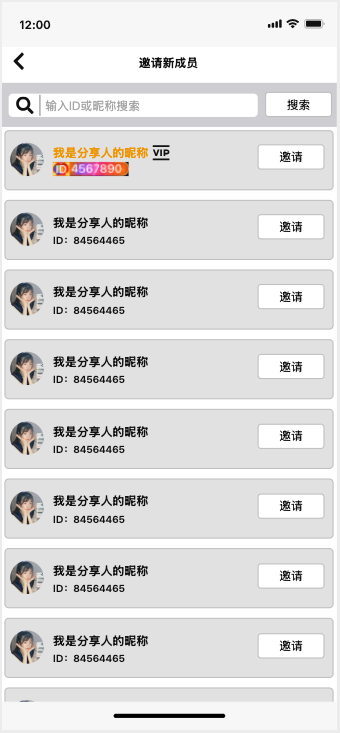

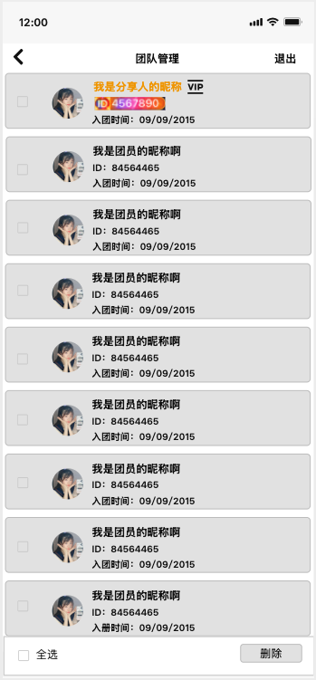

3.4.8 榜单增加轮播展示（丛国序）

| 功能名称 |  |
|---|---|
| 优先级 | 高 |
| 功能描述 | / |
| 输入/前置条件 | / |
| 交互原型 | 「图1」 |
| 字段描述 | / |
| 需求描述 | 团队页面：榜单充值用户排名第一的外显（原逻辑：只展示7天的第一） 展示顺序：按照1、7、30天的榜单第一，轮播展示，依旧只展示头像和昵称； 轮播形式：固定为整个模块（用户信息+所在排榜）向上轮播，不支持手势滑动，每次变动间隔3s，1-7-30为一个循环，一组循环结束后从3s从新循环； 页面整体滑动过程，不影响轮播逻辑，也不会重制循环； 重新进入页面或刷新则重制循环； 如果只有特定的两个类型有，数据，则只轮播2个，时间间隔依旧3s； 如果只有一个类型有数据则只展示1个，无需轮播表现； 如果都没有数据，则“/”展示，无需轮播表现； 点击进入榜单页面的逻辑：根据实际所在的轮播榜单进入； |
| 补充说明 | / |

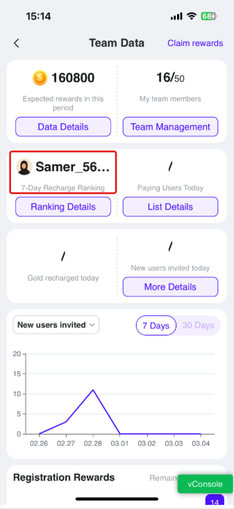

3.4.9新用户玩法展示规则优化（丛国序）

| 功能名称 | 新用户玩法优化 |
|---|---|
| 优先级 | 高 |
| 功能描述 | / |
| 输入/前置条件 | / |
| 交互原型 | 「图1」                    「图2」 「图3」             「图4」 |
| 字段描述 | / |
| 需求描述 | 当玩家在线且在房间 展示「图1」，在线icon和进入房间按钮； 点击房间的按钮，则跟随进入该玩家的房间（至于其他封禁拉黑等问题，为已存在业务逻辑，无额外处理）； 如果玩家在线（不在自己房间，或只在线）： 展示「图2」，仅展示在线； 消息按钮为常驻功能，不会受到用户状态影响，点击消息按钮则跳转app内消息并且直接打开对应用户的消息对话页（至于其他封禁拉黑等问题，为已存在业务逻辑，无额外处理）； 如果玩家不在线：展示「图3」； 当活动结束后，保持展示最终数据，活动时间部分展示“活动已结束，入口将关闭”； |
| 补充说明 | / |

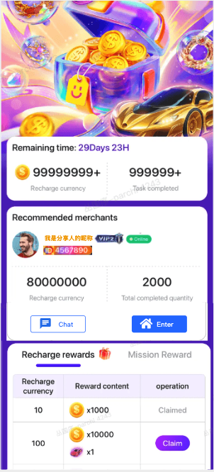

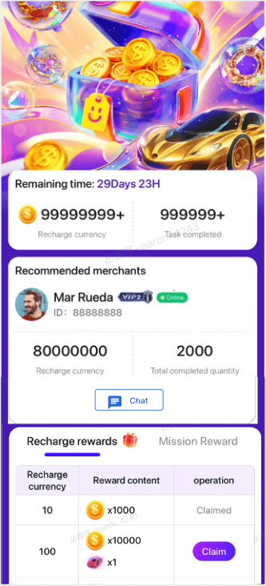

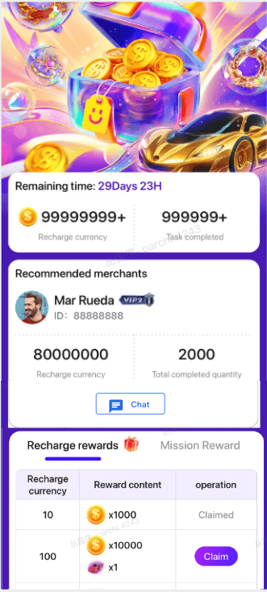

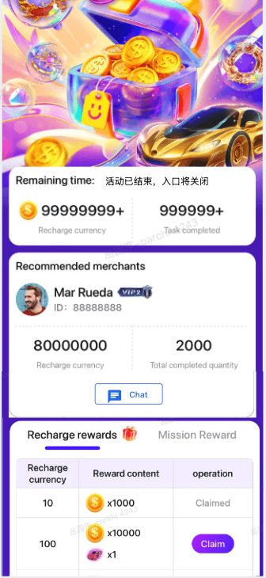

3.4.10房间内增加麦位置玩家VIP标识（4月23重新补充）

| 功能名称 | 间内增加麦位置玩家VIP标识 |
|---|---|
| 优先级 | 高 |
| 功能描述 | / |
| 输入/前置条件 | / |
| 交互原型 | 「图1」 |
| 字段描述 | / |
| 需求描述 | 「图1」 在麦VIP图标：在麦玩家昵称后，增加VIP标识支持动态； |
| 补充说明 | / |

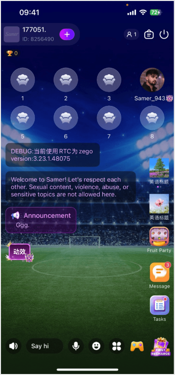

3.4.11红点提示优化 – me页面（丛国序）

| 功能名称 | Me页面的红点和优化 |
|---|---|
| 优先级 | 高 |
| 功能描述 | / |
| 输入/前置条件 | / |
| 交互原型 | 「图1」                    「图2」 「图3」                        「图4」 |
| 字段描述 | / |
| 需求描述 | 底部导航栏，Me增加红点 只增加红点，无数量展示 以下场景，当存在未消除的红点状态都会展示红点； Followers、Visitors（已有逻辑）； Tasks：存在任务奖励没有领取有红点展示（已有逻辑）； Share & Invite：当存在未领取的，拉新奖励或结算后的充值奖励（新增逻辑）； 2.3.1 领取后外部红点消失； Team Management：当存在未领取的，拉新奖励或结算后的充值奖励（新增逻辑）； 领取后外部红点消失； Novice Tutorial：存在未领取的，任务或充值奖励（新增逻辑）； 新手（Novice Tutorial）：红点和常态展示逻辑 只要有可领取的奖励展示红点，最高优先级（活动结束后也有可领取），如「图1」； 如活动已结束：则展示已结束，如「图3」；（入口消失逻辑已有，仅增加已结束提示） 当活动没结束且没可领取奖励的时候：展示活动剩余时间，规则如下： |
| 补充说明 | / |

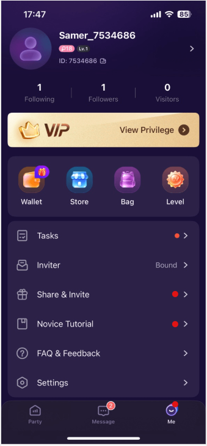

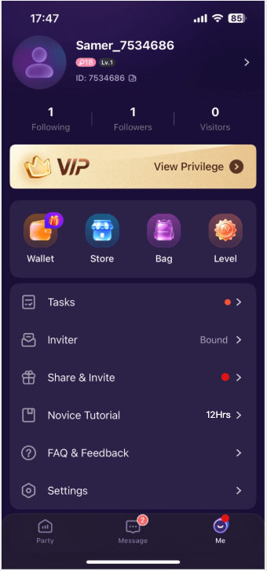

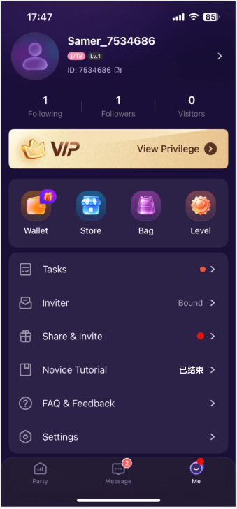

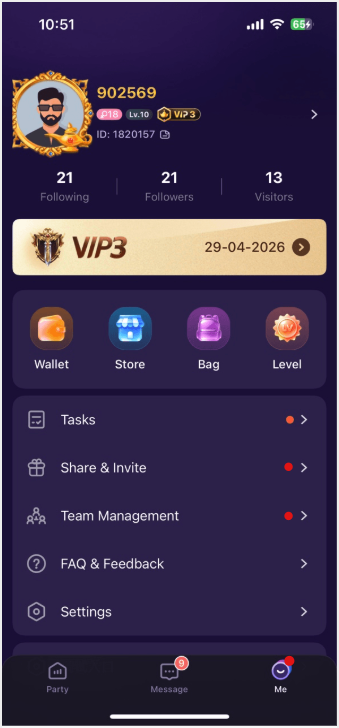

3.4.12拉新绑定新增– 顶部消息弹出提示和系统消息推送（丛国序）

| 功能名称 | 顶部消息提示 |
|---|---|
| 优先级 | 高 |
| 功能描述 | / |
| 输入/前置条件 | / |
| 交互原型 | 「图1」                      「图2」 |
| 字段描述 | / |
| 需求描述 | 通过链接/二维码，或平台内搜索向上绑定，且绑定成功，被邀请者会收到系统消息提示如「图1」所示，消息支持点击“我要参与”跳转到“新手玩法”页面；1.1  如果页面因活动结束等原因关闭不可展示，则toast提示“活动已结束”（5月12日补充）； 当用户仅仅仅仅仅仅通过单人拉新链接进入页面， 新注册或打开APP时，仅仅仅仅绑定失败时会弹出此提示； 出现和消失表现方式和房间内邀请进房间的提示相同，从上不向下弹出（0.5s），停留展示（3s），停留状态无针对性操作则自动向上收回（0.5s）； 弹出和收回过程点击无效果；停留状态支持手势动向上滑动手动关闭（按住向上）； （松手激活）点击弹窗和弹窗上的查看，回收关闭弹窗，弹出说明「图2」下，仅文字说明无其他功能，点击确定关闭； 支持无法绑定的情况： 超过48小时：“您当前已经超时，无法进行绑定”； 向上绑定的玩家状态异常，例如账号不存在，删号，拉新功能被限制：“您当前已经超时，无法进行绑定”； 本玩家已向上绑定其他账号：“您当前已有绑定玩家，不可修改”； 设备达到了绑定上限：“您的设备状态不可绑定更多邀请玩家”； 其他异常统一提示：“绑定失败，请查看说明”； 由于团长二维码附带有拉新功能，如果不满拉新的，不做提示； |
| 补充说明 | / |

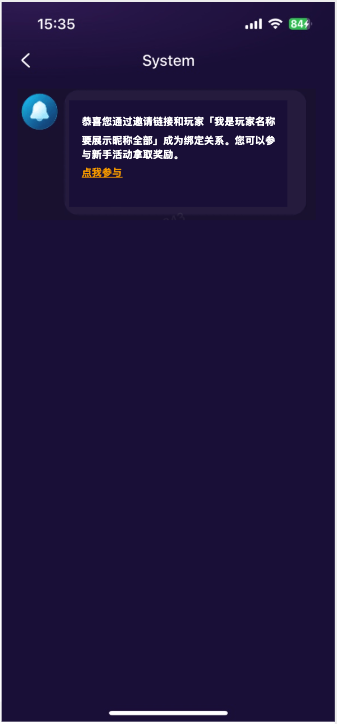

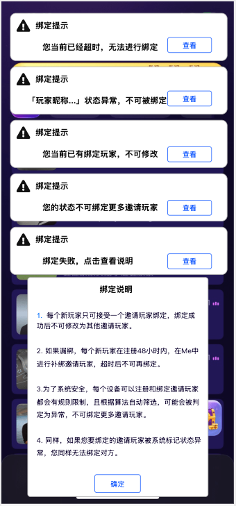

3.4.13团长邀请 - 团队邀请限制提示（丛国序）

| 功能名称 | 团队邀请入团限制 |
|---|---|
| 优先级 | 高 |
| 功能描述 | / |
| 输入/前置条件 | / |
| 交互原型 | 「图1」 |
| 字段描述 | / |
| 需求描述 | 弹出提示功能只针对扫团长二维码进入页面的用户提示； 对于团长手动踢出团的成员，用户再次进入需要有冷静期24小时； 大于24小时则可再次扫码和被邀请进入，24小时为通用规则，任何用户端渠道进团都为24小时（后台功能不在限制内）； 先观察，后续看是否再增加更多限制/例如黑名单，我二维码有效期/开启关闭拉团圆； 作为通用的扫团长码打开app，如果不可进入团队，则弹出本提示； |
| 补充说明 | / |

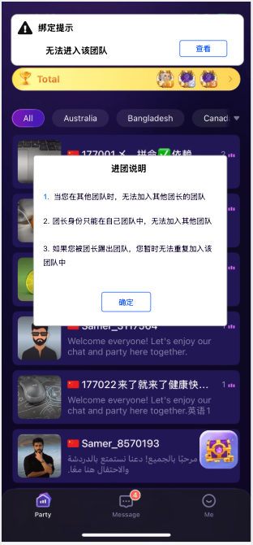

3.4.14新手玩法支持多任务阶梯配置（丛国序）

| 功能名称 | 新手玩法支持多任务阶梯配置 |
|---|---|
| 优先级 | 高 |
| 功能描述 | / |
| 输入/前置条件 | / |
| 交互原型 | / |
| 字段描述 | / |
| 需求描述 | 任务奖励： 排序：默认根据后台配置展示，按照数字从低到高，从上到下展示，多条同类型任务，但是不通阶段的，依旧按照如此展示，如果存在任务“已领取”，则自动降低到最下方； 任务条件：后台配置，为“任务类型+任务目标：组合配置； 支持相同任务配置多个，成为阶梯组合方式任务，共用时间线和任务进度； 例如，配置进房任务：10次、20次、30次，信用户进入房间当前已经12次，则10次的已经完成，12/20，12/30； 奖励内容：后台配置，奖励的货币为充值币，以及其他道具，单位包括数量/天/小时等；窗口高度根据实际内容进行适配； 操作：在没有完成的时候，展示需要达到目标时的进度和总量，“已经完成进度 /目标总量”，例如“20/100”； |
| 补充说明 | / |

3.4.15 修改信息的验证码说明页面的文案调整（丛国序）

| 功能名称 | 修改信息的验证码说明页面的文案调整 |
|---|---|
| 优先级 | 高 |
| 功能描述 | / |
| 输入/前置条件 | / |
| 交互原型 | 「图1」 |
| 字段描述 | / |
| 需求描述 | 在修改账号密码所需的验证码，独立一个说明页面，去掉这个跳转这一行说明； |
| 补充说明 | / |

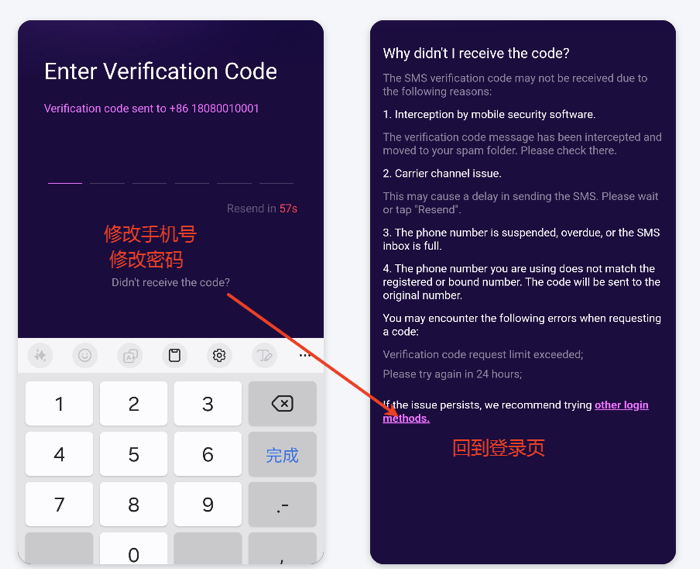

3.4.1主动推送（丛国序）

| 功能名称 | 主动推送 |
|---|---|
| 优先级 | 高 |
| 功能描述 | / |
| 输入/前置条件 | / |
| 交互原型 | 「图1」                             「图2」 |
| 字段描述 | 消息类型： 通用：展示Samer的logo； 个人拉新：对应奖励可以领取的用户「图1」 人数拉新奖励可以领取 标题：尊贵的用户 内容：嘿，{{user_name}}你又有新奖励可以领取了； 跳转：点击跳转到个人拉新页面； 右侧展示：可领取的宝箱； 2.2拉新充值奖励 标题：尊贵的用户 内容：朋友，{{user_name}}又有新的金币到账了； 跳转：点击跳转到个人拉新中的领取页面； 右侧展示：金币icon； 团队拉新 人数拉新奖励可以领取 标题：伟大的团长； 内容：团长，{{user_name}}你的团队有新奖励可以领取了； 跳转：团队拉新面板页面； 右侧展示：可领取的宝箱； 3.2 拉新充值奖励 标题：伟大的团长； 内容：团长，{{user_name}}你的团队又有新的金币到账了； 跳转：点击跳转到团队拉新面板页面中的领取页面； 右侧展示：金币icon； 福利券到账：VIP体验券：即发放后，用户收到一条，不限制是什么券「图2」； 标题：大量福利到账； 内容：{{user_name}}您收到大量免费福利，点击即可领取； 跳转；无特定页面，唤起APP即可； 券即将过期：规则和之前发放体验券和膨胀券过期检测发送系统消息规则同步「图2」； 标题：时间不多了； 内容：{{user_name}}，你即将失去VIP体验机会； 跳转：个人VIP页面； VIP结算倒计时：用户距离VP结算前，没有达到保级的情况下「图2」； 标题：VIP结算倒计时； {{user_name}}，您VIP结算剩最后机会。当前消费已达{{progress}}%，只需再完成少量任务即可保级。 {{progress}}%是保级进度百分比=（当前财富值/保级所需财富值）% 跳转：个人VIP等级页面； 右侧展示：当前VIP等级图，静态； 由于平台的消费分发机制，可能存在平台推送，但是用户延迟的收到的行为，因此延后信息和状态可能存在不同，是可以接受的； 前仅作功能推送，消息综合调控机制等后续做补充，当前版本暂时不做； |
| 需求描述 |  |
| 补充说明 | / |

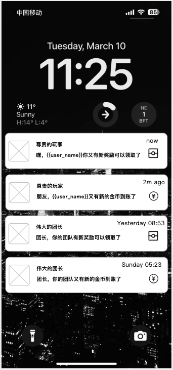

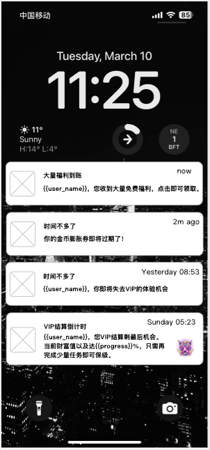

3.4.17渠道埋点统计（丛国序）

| 功能名称 | 渠道埋点统计 |
|---|---|
| 优先级 | 高 |
| 功能描述 | / |
| 输入/前置条件 | / |
| 交互原型 | / |
| 字段描述 | / |
| 需求描述 | 平台：安卓、IOS 支持平台：AF和Firebase，用于投放按照特定指标的优化； 数据口径和所需埋点如下： 注册：渠道注册成功的行为 留存：次日、三日、七日（数据口径以平台定位为准，登录行为） 点击付费：所有点击付费入口； 首充礼包的充值按钮； 充值页面/充值弹窗，点击充值按钮； 完成付费：完成充值行为，按照订单最好； 应用内购充值成功； 渠道充值充值成功，包括币商； 进入房间：进入房间行为； 上麦：上麦行为； 玩水果机：付费玩水果机的行为； 送礼行为：产生金币送礼成功的行为； |
| 补充说明 | / |

3.4.19 技术优化@姚泽

| 功能描述 | 技术优化 |
|---|---|
| 优先级 | 中 |
| 输入/前置条件 |  |
| 需求描述 | ios： 1.  Xcode26+UIScene适配 （苹果政策要求） -  影响范围： App启动，页面跳转，toast，loading等 2. Firebase崩溃日志优化（记录用户，设备，页面等相关信息） -  影响范围： 无 3. NSE进程图片域名切换  - 影响范围： 推送内容携带网络图片域名被封禁时需要能正常访问 andorid: 1.房间内聊天列表重构  影响点：房间聊天列表 2.google 支付框架替换  影响点：谷歌支付以及自动补单 房间：（已开发完成） 1.  房间定时任务优雅启停  影响点：涉及礼物计数器到期正常关闭 H5：（已开发完成） 1、周星代码迁移，需要服务端修改下发链接 影响点：周星页面是否成功访问 2、个人折线图代码优化，领奖进度条优化 影响点：个人/团队折线图渲染是否有误，奖励进度条在全部阶梯都到达时动画是否正常播放 3、团队折线图代码优化，领奖进度条优化 影响点：个人/团队折线图渲染是否有误，奖励进度条在全部阶梯都到达时动画是否正常播放 4、【延期bug】个人拉新榜单tab定位 影响点 ：个人/拉新tab是否定位于有数据的tab下 5、【延期bug】团队拉新榜单tab定位 影响点 ：个人/拉新tab是否定位于有数据的tab下 api：（已开发完成） 1. 修复拉新充值榜单定位问题 影响：榜单数据准确性及用户端展示 2. 新增拉新海报头像框绘制功能 影响：海报生成及头像框展示效果 3. “生成用户 PrettyId”Job 任务迁移 影响：新用户注册及ID生成机制 4. 定时拉取谷歌退款 Job 任务迁移 影响：Google退款数据同步 5. 定时退款处理 Job 任务迁移 影响：退款时效及订单状态更新 |
| 输出/后置条件 |  |
| 补充说明 |  |

3.4.20 水果机开关优化（许静）

| 功能描述 | 水果机开关优化 |
|---|---|
| 优先级 | 中 |
| 输入/前置条件 |  |
| 需求描述 | 现状：风控开关控制隐藏水果机游戏时会把整个游戏中心隐藏 需求：风控开关开启时仅隐藏游戏中心的水果机游戏以及侧边栏水果机游戏，不会隐藏整个游戏中心 |
| 输出/后置条件 |  |
| 补充说明 |  |

3.4.21 waha适配需求（许静）

服务端房间名称&用户昵称，默认前缀改为'player'

老数据初始化：老数据默认用户名和默认房间名中的samer改为'player'，若用户编辑过的不修改

后台重置用户/房间信息逻辑同服务端逻辑，房间名称&用户昵称默认前缀'samer'改为'player'

3.4.22 收礼物支持返币（许静）

收礼者支持立即得到返币，返币金额后台配置；同时最大100人送礼，超过提示“送礼失败”

注：涉及礼物为当前所有类型礼物

后台礼物抽成配置，金币仅能输入整数；且不能大于礼物价值3.4.23:拉新活动时间从7天变更成为30天（丛国序）相关活动配置的变更：参考运营配置文档

3.4.24:链接的更新，新老版本兼容（丛国序）

安卓兼容新老scheme链接，拉新链接需要兼容新老版本

https://doc.yallalive.cn/pages/viewpage.action?pageld=161138798
