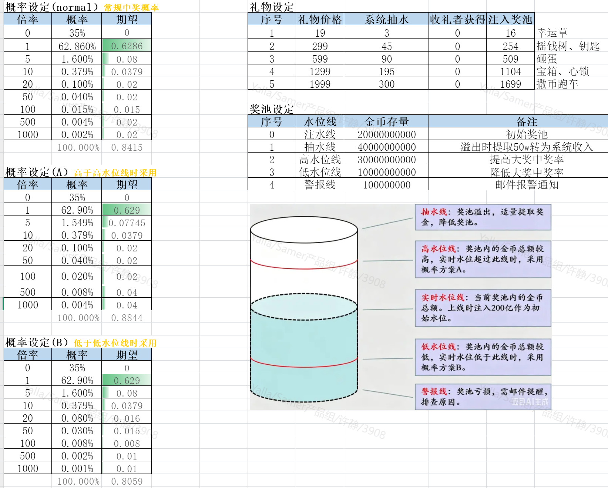
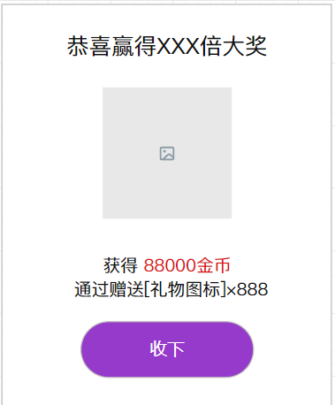
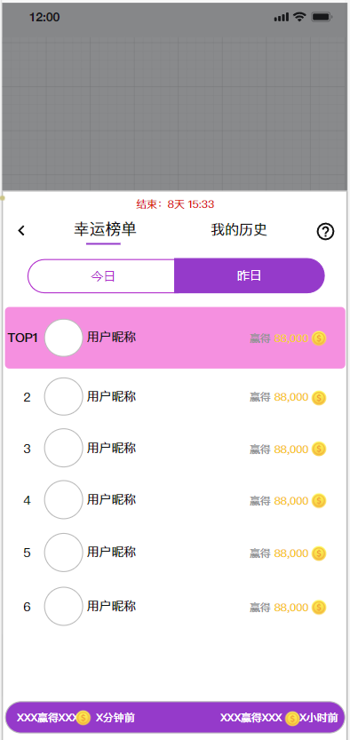
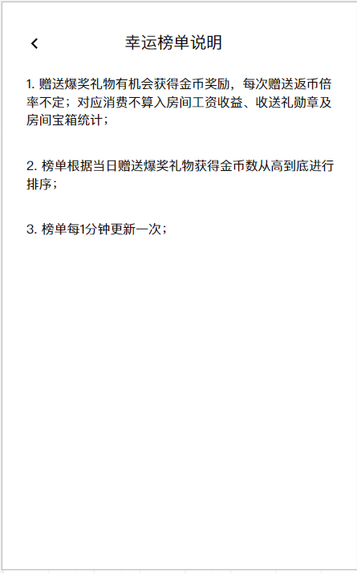
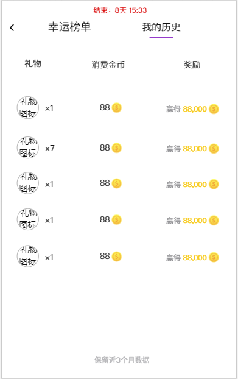
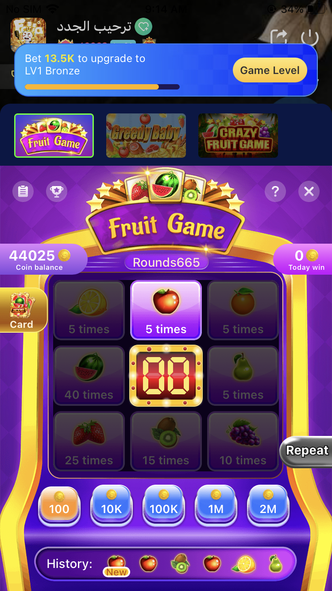
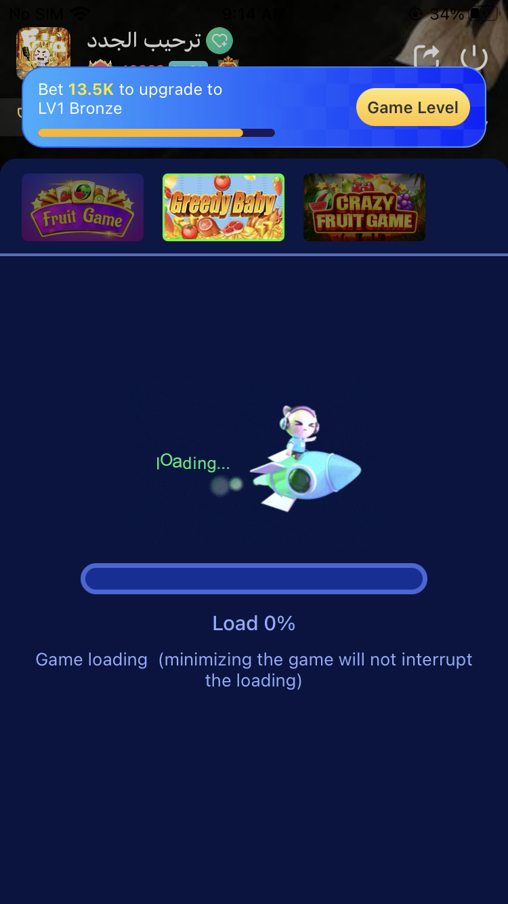

# 房间 — V1.1.0 原文切片

> 状态：`history`  · 来源：`demo/V1.1.0/V1.1.0.docx`

## 3.3 第三部分 房间内需求

3.3 第三部分 房间内需求

3.3.1 爆奖礼物（许静）

3.3.1.1 新增“爆奖”礼物类型&赠送规则

| 功能描述 | 新增“爆奖”礼物类型&赠送规则 |
|---|---|
| 优先级 | 高 |
| 输入/前置条件 |  |
| 需求描述 | 图1 礼物面板类型新增：新增“爆奖礼物”类型，后台配置该类型礼物时，客户端礼物面板增加“爆奖”tab，若未配置任何该类型礼物不展示此tab；该类型礼物tab展示在礼物面板“VIP”tab之后,爆奖礼物需要在礼物图标右上角展示礼物类型专属标识（见图1）； 选中礼物面板的“爆奖”tab按钮进入对应礼物面板，默认不选中任何礼物，礼物面板顶部展示当前礼物类型说明与排行榜/礼物中奖记录入口按钮（点击跳转“幸运榜单”，详见3.3.1.3）； 爆奖礼物支持送全麦人员（每个人支持送1、7、17个）、送全员（每个人支持送1个）； 送单个人支持赠送1、7、17、77、777个； 爆奖礼物支持配置为小礼物、大礼物；不支持设置为幸运礼物、周星礼物（详见后台需求3.6.2）；说明条展示优先级为：爆奖礼物＞动效活动礼物＞普通活动礼物＞国家礼物额外动效触发条件说明＞全站礼物＞VIP专属礼物 选中爆奖礼物时，礼物面板顶部展示当前的礼物说明：“赠送后最高返还金币奖励达1000倍！”，文案一行展示不下时需要轮播展示（同线上逻辑）； 私聊支持赠送爆奖礼物； 私聊、动态、短视频送礼中100倍及以上大奖仍需要展示中奖弹窗（详见3.3.1.2中奖弹窗）； 私聊赠送爆奖礼物，私聊界面送礼消息下放需要展示中奖系统消息，双方视角可见，金币信息需要高亮展示，中奖者点击跳转“钱包-金币明细页面”，非中奖者点击无反应，见下图： 中奖流水与中奖记录仍需要更新在“钱包”与爆奖礼物中奖记录页面（详见3.3.1.3）; |
| 输出/后置条件 |  |
| 补充说明 |  |

3.3.1.2 礼物玩法&中奖规则

| 功能描述 | 礼物玩法与中奖规则 |
|---|---|
| 优先级 | 高 |
| 输入/前置条件 |  |
| 需求描述 | 礼物玩法： 每赠送1个“爆奖”礼物，当前礼物平台抽成15%，收礼者抽成为0%，其余比例金币放入平台“爆奖”礼物奖池（详见下文“数值设置-礼物设定”抽水设置）；同时根据下文“数值设置”对应概率实时计算出当前礼物中奖对应金币数，当前金币数为此用户赠送当前礼物获得的奖励金币数，一次赠送多个礼物时每个礼物需要计算一次中奖概率，若本次送礼金币不足时不进行扣费并弹窗提示进行充值（同线上逻辑）； 若奖池剩余金币小于本次计算中奖金则本次送礼不中奖； 赠送爆奖礼物的金币消费不记在以下业务： 不计算在房间工资统计中；H5功能说明页补充此说明，详见翻译文档“历史文案修改”； 数值设置： 注： 1）邮件预警5分钟1次； 2）Samer爆奖礼物数值文档链接： https://365.kdocs.cn/l/chvSTR9Z66Km 送礼跑道&中奖信息通知： 送礼跑道：赠送爆奖礼物的送礼跑到样式与颜色需要区别与其他送礼跑道（老版本展示普通跑道），赠送1个或多个爆奖礼物对应跑道效果见下图： 中奖跑道：若本次赠送爆奖礼物中奖（赠送1个或多个），立即触发1条中奖跑道（老版本不展示此跑道），中奖跑道出现效果与送礼效果相同，需要和送礼跑道一样在送礼跑道队列中排队展示；未中奖不展示； 中奖跑道展示信息：展示爆奖礼物图标、中奖用户头像、本次赠送爆奖礼物（1个或多个）中奖金币数（金币总数=本次送礼所有中奖礼物中奖金币数之和）、本次赠送的爆奖礼物图标、爆奖礼物榜单名次（详见“中奖跑道展示榜单名次规则”）、送礼本人的中奖跑道自己视角需要展示“Me”标识； 中奖跑道展示今日榜单名次规则（数据为0不上榜）： 图1-他人视角“爆奖”礼物中奖跑道 图2-自己视角“爆奖”礼物中奖跑道 前三名文字颜色1+彩带动效； 2-5名文字颜色2； 6-10名文字颜色3； 中奖系统消息（见下图）： 房间用户本次送“爆奖”礼物中奖时在评论区展示1条系统消息：“恭喜XXX赠送【礼物图标】获得YYY金币奖励【爆奖礼物图标】”（若本次送礼1次赠送多个时，YYY为本次送礼所有礼物中奖金币的总和）； 点击系统消息默认调起送礼面板并自动定位在“爆奖”tab并选中第一个礼物； 中奖弹窗：当本次送礼中奖倍率满100倍时（服务端可调整）当前用户会收到中间弹窗提示： 送单个礼物中奖弹窗（见下图3）： 弹窗标题：恭喜获得XXX倍大奖 内容：奖励占位图、获得奖励金币数、【收下】按钮 关闭弹窗条件：点击【收下】按钮或点击弹窗外区域 图3 送多个礼物中奖弹窗（见下图4）： 弹窗标题：恭喜获得XXX倍大奖（XXX为本次送礼中中奖礼物中最大中奖倍率） 内容：奖励占位图、获得奖励金币数、【收下】按钮、中奖礼物个数、本次送礼获得最大倍率奖励个数、中奖最大倍率 关闭弹窗条件：点击【收下】按钮或点击弹窗外区域 图4 中奖广播（见下图）： 若全平台有用户赠送“爆奖”礼物（房间内或房间外）获得500倍及以上（服务端支持调整）奖励则在全站房间和私聊对话页面展示中奖广播； 广播展示内容：“【中奖用户头像】+XXX1（用户昵称）获得XXX金币奖励通过赠送【本次中奖赠送爆奖礼物图标】【跳转按钮】”，“XXX”金币为本次送礼中奖金币数，若本次送礼送多个“爆奖礼物”则“XXX”为本次送礼所有中奖礼物中奖金币之和； 点击中奖广播“【跳转按钮】”： 若用户在房：页面跳转至对应中奖用户所在房间； 若用户不在房：页面跳转至对应中奖用户的个人主页； 若广播展示文字展示不下时需要轮播展示，详见设计稿效果； 若当前房间用户触发广播则广播不展示“Go”按钮； 点击“GO”按钮相关二次确认弹窗： 若用户点击跳转房间（广播用户在房），且当前用户也在房间则弹窗确认：“你确定要跳转这个用户所在房间吗？【取消】【确认】”（可复用全站广播二次确认弹窗）； 若用户点击跳转房间（广播用户在房），且当前用户不在房间内，则直接跳转对应房间； 若用户点击跳转个人主页（广播用户不在房），不弹二次确认弹窗； Keep状态算在房； 金币奖励流水明细 用户送爆奖礼物中奖获得金币立即产生1条金币流水： 爆奖礼物返币        +XXX金币 用户赠送爆奖礼物中奖获得金币立即产生1条中奖记录，详见3.3.1.3 特殊情况 老版本：房间看到用户送爆奖礼物，看到的是普通送礼跑道、无中奖系统消息、无中奖跑道、无广播、礼物面板不展示此礼物 |
| 输出/后置条件 |  |
| 补充说明 | 需要奖池数据实时监控看板 |

3.3.1.3 【含H5】礼物中奖榜单&我的中奖记录

| 功能描述 | 礼物中奖榜单&我的中奖记录 |
|---|---|
| 优先级 | 高 |
| 输入/前置条件 |  |
| 需求描述 | 中奖榜单入口： 选中礼物面板的“爆奖”tab展示爆奖礼物的排行榜入口，见下图： 排行榜入口轮播展示排行榜图标、排行榜日榜Top1用户头像，头像展示皇冠标识； 中奖榜单（H5）： 图1                         图2 点击礼物面板“爆奖礼物”排行榜入口，页面默认进入当前礼物中奖排行榜，页面默认定位在今日榜单页面，日榜数据统计每日（00：00:00-23:59:59 GMT+2）进行结榜； 列表数据根据送本日赠送爆奖礼物中奖金币数从高到低进行排序； 列表数据展示用户头像、昵称、统计期间中奖获得金币数，数据不超过每5分钟刷新1次；点击头像限制不可跳转对应用户个人主页； 列表展示数据支持分页加载，默认加载50条数据，下拉支持查看所有数据； 榜单底部展示查看者个人榜单信息（名次、头像、昵称、中奖金币数），展示信息区域低吸展示： 若个人榜单数据不为0：名次小于等于100展示名次，大于100展示“100+”（见图1）； 若个人榜单数据为0：展示“我要上榜”按钮（见下图），点击按钮自动关闭当前弹窗并调起送礼面板并自动定位在“爆奖”礼物面板并选中第一个礼物； 点击弹窗“返回”按钮可返回至礼物面板（进入弹窗页面前选中面板礼物不变）；点击弹窗外区域关闭当前页面，礼物面板仍展示，礼物面板之前选中礼物状态不变（同现逻辑）； 榜单页面展示用户送礼中奖广播： 广播展示内容：XXX中奖YYY金币； 广播展示最近50条数据，每隔1分钟刷新； 点击榜单弹窗外区域关闭弹窗； 点击榜单图标，弹窗展示榜单说明，见下图，点击返回按钮返回榜单页面，点击弹窗外区域关闭弹窗； 我的中奖记录（H5） 图3 点击“我的历史”tab或左右滑动弹窗可切换中奖榜单和个人中奖记录页面（即：“幸运榜单”和“我的历史”页面）； 个人中奖记录页面展示数据：本次送礼图标、本次送礼个数、本次送礼消费金币数、本次送礼中奖金币总数（一次送礼多个礼物流水展示一条）； 列表支持分页加载，默认加载50条数据，拉下支持查看所有数据，列表数据根据时间倒序展示； 点击弹窗“返回”按钮可返回至礼物面板（进入弹窗页面前选中面板礼物不变）；点击弹窗外区域关闭弹窗并关闭礼物面板； 记录保留近3个月数据 榜单Top1荣誉展示弹窗： 若昨日榜获得第一名则平台所有用户当天打开榜单展示此弹窗，点击弹窗外区域或点击“知道了”按钮可以关闭当前弹窗，关闭弹窗不关闭榜单页面； 此弹窗限制每人每天最多只弹一次； 系统消息:榜单第一名收到1条系统通知（次日00:05（GMT+3）），见下图： 1）展示榜单第一名的时间、第一名用户头像、头像框装饰（样式固定）、跳转按钮； 2）点击跳转按钮跳转当前语区官方房并自动打开爆奖礼物榜单tab； 3）该系统消息图片样式为服务端上传（考虑后续其他榜单同类消息复用）； |
| 输出/后置条件 |  |
| 补充说明 |  |

3.3.2 房间支持打开半屏水果机（许静）

| 功能描述 | 房间展示的水果机UI样式改为半屏 |
|---|---|
| 优先级 | 高 |
| 输入/前置条件 |  |
| 需求描述 | 房间支持半屏打开水果机游戏，对应页面布局优化； |
| 输出/后置条件 |  |
| 补充说明 |  |

3.3.3 【H5】动物机（换皮水果机）

| 功能描述： | 原水果机换皮，并作一定优化 |
|---|---|
| 优先级： | 高 |
| 输入/前置条件 |  |
| 需求描述： |  |
|  | 概述：在不更改原水果机的界面布局与游戏基础逻辑上进行换皮，并一定的优化。 注：支持房间半屏打开 优化项： 缩短每回合的游戏时间： 缩短下注时间：从40S，缩短为30S，并且将规则页面中的40S页更改为30S。 缩短开奖时间：将开奖时间从10S缩短为5S。 结果展示时间不变更。 整体游戏一轮时间变为从原来的55S变更为40S。 开放下注上限：从原先6个下注上限，开放到8个，也就是一局所有选项都可以下注。 添加未付费用户盈亏上下限：该功能在幸运游戏优化详细说明。（保留此代码，不生效，水果机也保留此代码，不生效） 动物机图标种类： 种类包含： 安卡拉山羊：5倍 猫：5倍 马：5倍 骆驼：5倍 狼：10倍 金雕：15倍 老虎：25倍 亚洲狮：45倍 金币流水 下注：疯狂动物下注 赢钱：疯狂动物赢分 文案调整 参与记录页面： 获胜水果：XXX 修该为 获胜动物：XXX 选择水果：XXX 修改为 选择动物：XXX 规则页面： 选择合适数目的金币与你想要下注动物来参与游戏。 你每回合可以下注所有的动物，并且每种动物都没有下注上限。 每回合你都有30S的时间选择你要下注的动物与下注的额度，倒计时结束后你将无法再下注，并且系统会选择出该回合中奖的动物。 如果你下注到了本回合中奖的动物，会根据你的下注额度发放对应倍率的金币奖励。 最后一条规则不用改。 提示弹窗： 你是否花费XXX金币下注XXX？ |
| 补充 | 后台相关（含水果机后台） 换皮水果机（动物机）后台套用水果机相同模板，但统计的是换皮水果机自身的数据。 其中明细一栏的水果，替换为动物，动物套用图标类别。 |

3.3.4 支持用户关闭房间礼物动效（许静）

| 功能描述 | 支持用户关闭房间礼物动效 |
|---|---|
| 优先级 | 高 |
| 输入/前置条件 |  |
| 需求描述 | 图1              图2                 图3 关闭礼物特效开关： 开启：默认开启，开启后当前用户可以看到房间所有礼物特效 关闭：支持用户关闭礼物特效 开启或关闭后按钮状态更新，见图1、图2； 设置跟随本地保存，更换房间后该设置仍生效，卸载后重置为默认打开状态； 点击开启/关闭按钮二次确认弹窗： 1）关闭： 弹窗正文：关闭后你将收不到房间所有礼物特效。 按钮：取消、关闭 2）开启： 弹窗正文：开启后你将收到房间所有礼物特效。 按钮：取消、开启 关闭/开启成功后toast提示：“操作成功” |
| 输出/后置条件 |  |
| 补充说明 |  |

3.3.5 房间游戏操作交互优化（许静）

| 功能描述 | 房间游戏操作交互优化 |
|---|---|
| 优先级 | 高 |
| 输入/前置条件 |  |
| 需求描述 | 图1                         图2 用户进入房间，房间侧边栏默认展示水果机游戏图标，若用户点击打开图1水果机半屏游戏页面，在当前页面用户可快捷点击其他游戏缩略图进行其他游戏切换，切换时页面增加加载动画；关闭游戏页面，房间侧边栏游戏要更新为关闭时的游戏； 若用户切换游戏后关闭当前游戏半屏页面，房间侧边栏游戏图标展示关闭时停留的游戏，退出当前房间再次进房重置为水果机图标； 游戏中心展示动物机； 审核风控包含动物机； |

