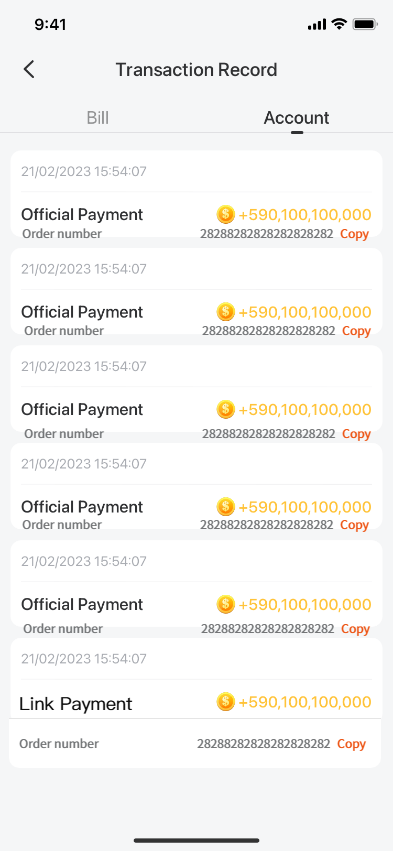
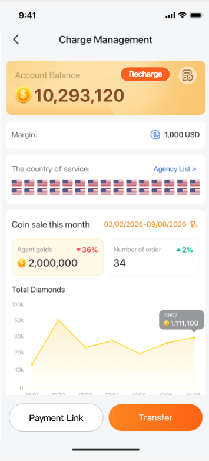

# 基建与其他 — V1.1.1 原文切片

> 状态：`history`  · 来源：`demo/V1.1.0/V1.1.1.docx`

## 3.1.7币商账户金币流水

3.1.7币商账户金币流水

| 功能描述 | 币商账户金币流水 |
|---|---|
| 优先级 | 高 |
| 输入/前置条件 |  |
| 需求描述 | 图1 币商中心交易记录页面需要增加分销链接支付的订单流水： 链接支付                  +XXX金币 订单号        YYYYYYYYYYYYYYYY [复制] 点击[复制]按钮复制当前订单号，复制成功toast提示：“复制成功” 币商通过YallaPay充值的流水也需要展示订单号，且支持复制，操作交互同链接支付方式的订单号； |
| 输出/后置条件 |  |
| 补充说明 |  |

## 3.1.8币商中心数据统计

3.1.8币商中心数据统计

| 功能描述 | 币商中心数据统计增加币商分销支付数据 |
|---|---|
| 优先级 | 高 |
| 输入/前置条件 |  |
| 需求描述 | 币商中心数据看板的销售金币数据统计增加币商通过YallaPay链接分销支付销售的金币数据，即：用户通过YallaPay链接分销支付后平台实际发货的金币总数； |
| 输出/后置条件 |  |
| 补充说明 |  |

## 3.1.9私聊风控

3.1.9私聊风控

| 功能描述 | 私聊页面禁止发送YallaPay分销支付链接 |
|---|---|
| 优先级 | 高 |
| 输入/前置条件 |  |
| 需求描述 | 若币商在Samer应用内通过私聊发送YallaPay币商分销支付链接，服务端进行拦截，接收方无法收到当前消息，同时发送方收到一句系统提示：“当前链接禁止发送”；老版本toast提示此文案； |
| 输出/后置条件 |  |
| 补充说明 |  |

