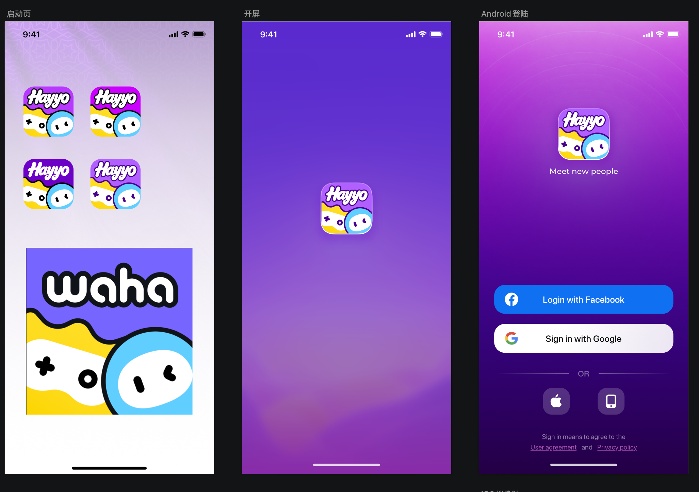

# 应用名称 / 更新 / 品牌 — V1.3.0 原文切片

> 状态：`history`  · 来源：`demo/V1.3.0/V1.3.0.docx`

## 3.3 第三部分 IOS端需补齐功能

3.3 第三部分 IOS端需补齐功能

3.3.1 Waha v1.2.2强制更新提示（许静）

| 功能名称 | 强制更新提示 |
|---|---|
| 优先级 | 高 |
| 输入/前置条件 | / |
| 需求描述 | 背景：Waha ios v 1.2.2未实现强制更新功能； 需求：若后续需要强制更新，服务端操作后，该版本的用户被强制退出，点击苹果登录授权后 或 输入手机号登录点击“Next”时 提示“请更新版本”的弹窗。 |
| 补充说明 | 研发已实现需测试 |

3.3.2 强制更新&版本更新弹窗（许静）

| 功能名称 | 强制更新弹窗、版本更新弹窗 |
|---|---|
| 优先级 | 高 |
| 输入/前置条件 | / |
| 需求描述 | 弹窗展示优先级（逻辑同Hayyo安卓端）： 强制弹窗/版本更新弹窗＞协议弹窗＞业务弹窗（活动弹窗、新人礼包、签到） 注： 1）考虑时间问题，暂时弹窗没有展示先后逻辑； 2）有强制更新弹窗不会有版本更新弹窗（已实现强更弹窗优先级大于版本更新弹窗）； 2. 客户端判断隐私协议版本号是否更新，若更新则弹出隐私协议弹窗，否则不弹 特殊场景重点关注： 1）第一次下载包的新注册用户不会弹隐私协议； 2）更新协议版本号时，当前设备没有卸载APP的情况下，老账号没有点击确认掉新版本的隐私协议，这个时候新注册一个号登录时会弹出隐私协议 |
| 补充说明 |  |
| 补充说明 |  |

3.3.3 iOS端修改应用名（许静）

| 功能名称 | 应用改名涉及改动 |
|---|---|
| 优先级 | 高 |
| 功能描述 | / |
| 输入/前置条件 | / |
| 需求描述 | 注：因安卓已修改名称，以下内容安卓端仅修改Logo、加载图标、占位图标 应用Logo、App启动/登录/官网页面名称&Logo、房间分享页面名称&Logo、离线推送消息图标、官方消息图标、官方账号标识（具体详见UI设计稿）； 刷新加载动效； 拉新分享海报logo图片； 隐私协议及相关协议更换名称（双端共用隐私协议、官网）； 官网增加”儿童安全协议“内容； 官网Logo更换；官网布局调整；隐私协议调整，涉及游戏； 第三方账号修改LOGO； 翻译：1）服务端翻译；2）客户端翻译：app 名 ，优惠券说明文案等；3）H5翻译：拉新说明文案、数值游戏说明文案等； 应用名修改涉及翻译调整（同安卓v1.2.0改名版本）：https://365.kdocs.cn/l/csvSvcsttQ2X 注：研发侧需要检查是否遗漏； 后台运营管理Logo（正式/测试环境）； |
| 补充说明 | 相关美术物料具体详见UI设计稿 |

3.3.4 其他优化（许静）

爆奖礼物消费金币计算用户等级经验值，经验值与消费金币数比例同线上不变（1经验=4000金币）
