# 休闲游戏 — V1.3.0 原文切片

> 状态：`history`  · 来源：`demo/V1.3.0/V1.3.0.docx`

## 3.1 第一部分 双端接入三方休闲游戏

3.1 第一部分 双端接入三方休闲游戏

3.1.1 休闲游戏-房间外模块（丛国序）

3.1.1.1 休闲游戏 – 主页

| 功能名称 | 休闲游戏 |
|---|---|
| 优先级 | 高 |
| 功能描述 | / |
| 输入/前置条件 | / |
| 交互原型 | 「图1」                       「图2」 |
| 字段描述 | 房间外游戏的底层场景（核心）：通过匹配机制，把用户拉到同一个聊天房，进行上麦游戏，并且支持公屏聊天； 但是和当前聊天房列表的房间不是打通的，也不会和房间内游戏打通； 也就是说这些房间当前版本是不可以被房间列表的搜索（后期会做观战，所以可能需要独立搜索）、用户资料页的进入、聊天房列表展示和进入，都不可以作为入口； 也不会展示在用户资料页当前所在房间； 机器人和游戏房间：准备至少700个房间（独立于机器人，业务隔离）； 支持机器人加入组成游戏，因此需要700个机器人，男女大约各300个，剩100中性（之前有素材，我只是在这里陈述一下需求），这些机器人不能和房间账号相同； |
| 需求描述 | 导航增加一个游戏“TAB“，当前版本不做用户分层地页逻辑，也不修改落地页，但是调整App落地页为GAME（7月1日调整）；； 左上角展示账号本人用户头像，头像框，支持点击跳转用户资料页； 左上角展示用户金币数量，支持实时变动，数量单位和主页展示规则相同，支持点击后跳转应用内充值商城主页； 游戏列表当前固定展示5款游戏（如果有缩减，根据实际情况决定数量，当前应该3款）； LUDO、Carrom、Match Blitz 受到后台开关配置影响，是否展示入口和更新判断； 如果用户停留在游戏页，后台游戏下架，点击匹配则toast提示，然后返回游戏大厅（7月22日新增） 独立展示和判断； 游戏加载逻辑为本地打包+热更（7月2日更新）； 5.1 根据最终打包的大小决定，至少打包ludo和Carron，其余可以支持下载app后加载； 5.1.1保留原来加载信息优先5.1.3如果存在多信息加载的情况下，优先加载游戏先carrom 然后加载ludo； 5.1.4三消为手动点击下载不做自动加载； 5.2判断是否更新：后台可以配置链接和MD5，版本号平台维护，自增； 5.3当用户打开App后，开始校验包中版本号是否需要更新/下载，如果需要则执行操作（具体可能会和列表预加载有冲突，具体要看业务体验）； 5.4用户进入游戏TAB，无论游戏是什么状态（可用/下载）不展示进度样式； 5.5用户在游戏列表页面点击对应游戏，点击切换点击游戏TAB（7月15日调整）再次校验3个，如果最新则直接进入游戏界面，如果需要更新或正在下载中，则展示进度条（更新状态），这个状态下点击无效果，不进入游戏「图2」；； 5.6 进度条根据更新大小和已下载大小的比例进行计算，更新完成后，更新状态消失； 5.7 当下载失败后toast提示“游戏加载失败”（7月15日调整），但是依旧支持重新点击发起下载； |
| 补充说明 | 金币缩写规则：（7月1日优化） |

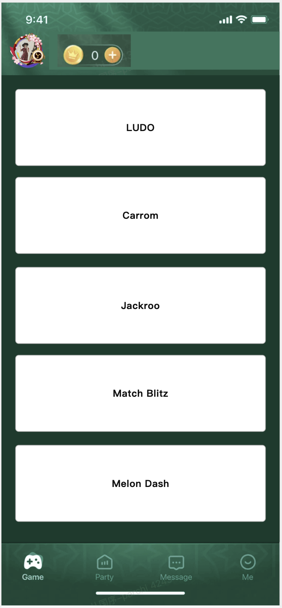

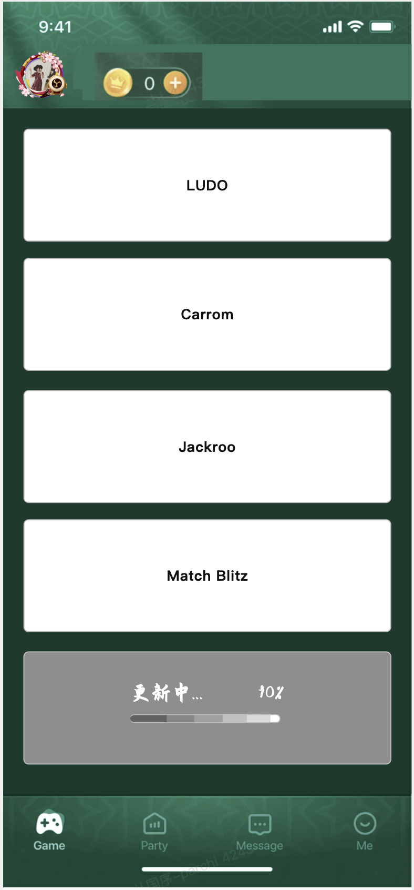

3.1.1.2主页面功能和匹配规则

| 功能名称 | 通用页面规则描述 |
|---|---|
| 优先级 | 高 |
| 功能描述 | / |
| 输入/前置条件 | / |
| 交互原型 | 「图1」                「图2」              「图3」 「图4」                  「图5」               「图6」 「图7」                  「图8」 |
| 字段描述 | 门票和奖励结算机制 门票每个人固定10金币，用户点击游戏的“匹配”按钮，则收取门票金币，未能正常开始（包括匹配成功前主动取消对局），解散对局（例如多次加载失败），双方返还金币（7月3日优化描述，大厅和房间内游戏扣费逻辑相同，详情参考门票资金规则）； 需要先验证房间服务器是否正常且双方进入房间并上麦成功，然后再进行服务器连接成功，然后双方进入游戏； 如果只有游戏正常，聊天房服务器异常，依然按照失败处理，反之亦然； 每次组局成功我们抽门票的20%； 逃跑：主动退出游戏不返还门票； 如果各自为战的游戏类型，只有第一名拿到扣除门票抽成后的所有金币； 组队游戏为生出的队伍均分抽成后的所有金币； 如果存在小树点，整体向上取整，不要小数点后； 门票档位隔离：不同门票档位的玩家 严禁匹配 至同一对局。 临时黑名单（回避池） 触发条件：用户A与用户B完成一场对局后 处理动作：系统将A和B互相加入各自的 30分钟回避池。 生效规则：在接下来的30分钟内，若A与B同时处于匹配队列，系统会强制跳过对方，不会将其匹配至同一局。 分段式倒计时匹配流程 特殊说明：新用户首局保护：适用对象为首次进入不同游戏的真人玩家（每款一次），匹配规则：强制匹配全部Level 1 机器人。（7月23日删除） 异常玩家与门票隔离规则：目的：避免其无限制地赢取普通玩家的收益，破坏游戏平衡； 匹配流程总览（正常用户） 系统读取用户信息：用户 ID、当前门票档位，是否存在回避池关系 门票档位和游戏模式筛选：根据用户门票档位和游戏模式，筛掉所有非同的玩家； 新用户判定 是 → 直接匹配 3个/1个 Level 1 机器人，跳过后续所有真人匹配逻辑； 否 → 进入下一步； 处于 30分钟回避池 中的用户 处于 24小时隔离保护 中的用户 不同门票档位的用户 查找符合条件的真人玩家 倒计时与机器人补位 0 - 3秒：仅尝试匹配真人； 第3秒：若未成功，加入 1个机器人； 之后每隔15秒：检查并补位机器人，直至队伍满员； 三消类游戏，优先匹配真人，无IR匹配规则，如果不满足，按照时间条件匹配中等机器人； |
| 需求描述 | 「图1」主页，此处用ludo做举例1. 从游戏列表页点击点击对应游戏，进入游戏页面（7月1日增补）； 首次进入游戏大厅点击匹配，和房间内上麦请求相同，获取用户麦克风权限； 如果没有，用户依旧可以进行游戏的匹配，并且进入游戏，只是不上麦； 进入房间后，用户依旧可以通过房间内聊天区的麦克风按钮申请麦克权限，如果正常，则上麦发言（没有下麦一说～） 左上角和列表相同，都是用户头像，头像框，金币，都支持对应跳转功能； 3. 右侧退出，点击后退出当前游戏页面，返回游戏列表； 4. 支持拓展功能：点击后弹出下拉菜单，点击任何位置收起； 4.1 点击说明：调用三方有你页面说弹窗； 4.2 支持：点击跳消息office对话页面，页面需要支持点击后返回游戏页 4.3 设置：点击后打开设置弹窗「图2」，功能默认开启，关闭或开启都有toast提示； 4.3.1 麦克风：开启状态为进入游戏后，默认上麦并开麦，关闭为默认上麦关闭麦；     4.3.2 游戏音：开启为进入游戏后开启，关闭为进入游戏后关闭（独立于房间，媒体音）； 4.3.3 匹配过程中设置入口不展示“规则”和“支持”按钮（7月1调整）； 5. 如果当前有正在进行的房间内游戏，点击匹配会给出提示「图1」，用户如果确认，那么则退出房间（退出房间游戏），进行匹配房间外游戏； 「图3」充值弹窗，半屏，支持根据身份展示应用市场或代理充值； 使用现有逻辑，当用户在进行匹配按钮触发的时候扣除用户本局游戏金币数量“10”个，取消后返还10个； 当前房间外游戏，全部都为10金币一局，支持后台调整，不同游戏独立设置； 「图4」游戏匹配1. 当前房间外游戏只支持纯匹配，包括组队模式也是通过匹配达成组队，无邀请好友组队功能；2. 当用户付款成功后进入匹配，上方向下弹出匹配中样式，“匹配中…”时间格式：mm：ss正计时； 匹配中不允许直接退出房间，只有点击取消后，金币数量返还，匹配时间回收然后可退出房间； 匹配过程中，杀程序或崩溃按照退出匹配处理，如果卡最后，那么按照游戏中处理； 自己展示在左侧首位或下位，展示自己和对方的头像，头像框，昵称（过长缩写…比例参考UI），不支持点击查看资料； 匹配中，则展示对方空样式，和等待中效果（应该有动画，要是没资源，那没有就没有吧）； 匹配是有准备的，但是由我们自动帮助用户实现准备，但是也要给到匹配结果展示匹配到的效果，也就是人匹配成功后展示1.5s（当前计划，实际测试期做效果体验）立刻进入到加载页面「图5」，匹配成功后（1.5s展示时间）不可取消匹配，按钮置灰，匹配时间正常计算即可； 我们的目的是用户只要一键开始，就可以进入游戏，避免过多操作； 具体匹配位置用户位置展示，不同游戏不同模式样式会有不同，后续会对不同游戏做具体样式展示，也可以参考UI，会给出所有类型； 具体匹配规则也会后续业务中描述； 「图5」加载中 1.加载中：哪怕时间短于3s，那么最短加载时间也为3s；如果超过根据实际时间决定； 2.超时：单次超时时间为15s，然后重连一次，2次总计时间为30s； 3.展示自己和对方的头像，头像框，昵称（过长缩写…比例参考UI），不支持点击查看资料； 4.在这个过程中，需要将多方拉入同一个聊天房，并且上麦，根据用户设置判断是否开麦； 「图6」加载失败提示：1. 加载失败的提示，具体内容根据实际场景提示； 2. 超时：网络错误，请重试； 4. 本地房间服务器错误：游戏连接异常，请稍后再试； 5. 退出按钮，点击后返回游戏主页，判断是否有正在进行中的游戏，如果没有则结束，判断对局未成功，双方退还游戏金币，如果有正在进行的，按照断连处理（后面有描述）； 6. 重连：为重试连接游戏，依旧遵循单次15s，两次总计30s超时来处理； 7. 游戏成功判断，一方正常进入游戏，需要房间服务器，和游戏服务都正常的情况下； 8. 如果对局组成失败，则加载页直接toast提示：“开局失败，金币返还”；然后回到游戏主页； 「图7」异常退出app等非主动退出游戏重连提示（7月1日新增）1. 进入app如果当玩家存在游戏中的场景，最近一局完结状态； 如果未完结，回到游戏，加载游戏，如果加载过程中完结，那么「图8」； 如果已完结，那么则弹出「图8」弹出提示 这个弹窗层级属于高，而且高于签到，高于新手礼包，优先弹出； |
| 补充说明 | 关于机器人金币变动说明（7月6日补充）： 所有机器人自己有一个总的金币池（概念），并非真正的池子，没有数值只用来记录数据用； 在使用过程中所有参与游戏的机器人从金币池中出和入统一记录 机器人参与「XXX这游戏名」消费金币「X数量」； 机器人赢「XXX」游戏获得「XX数量」； |

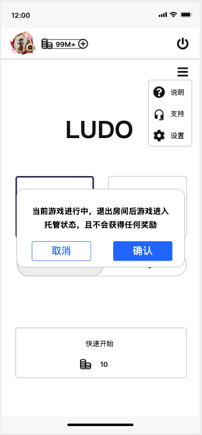

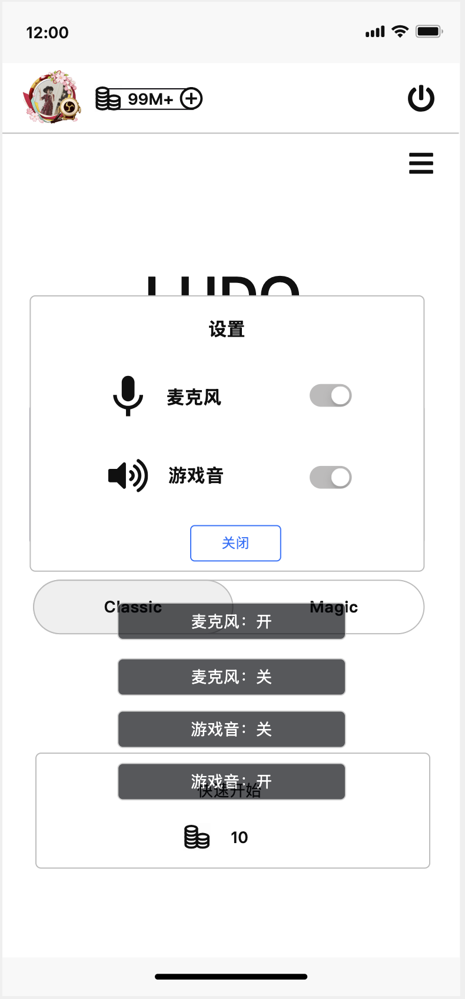

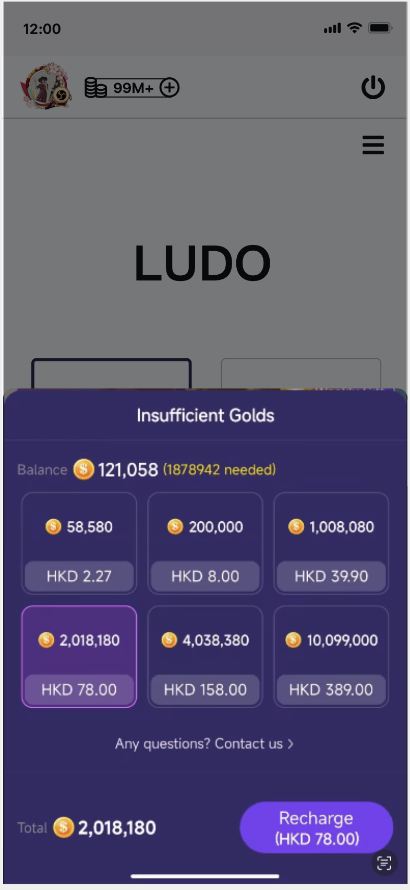

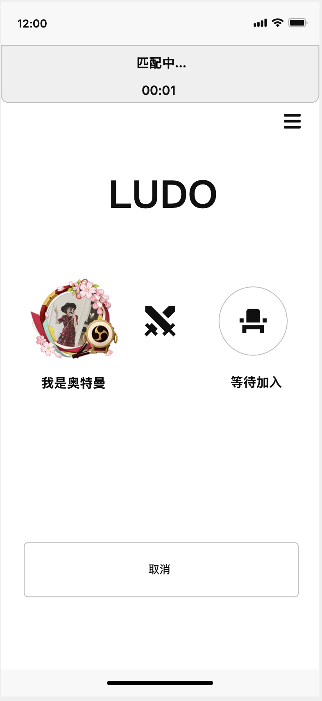

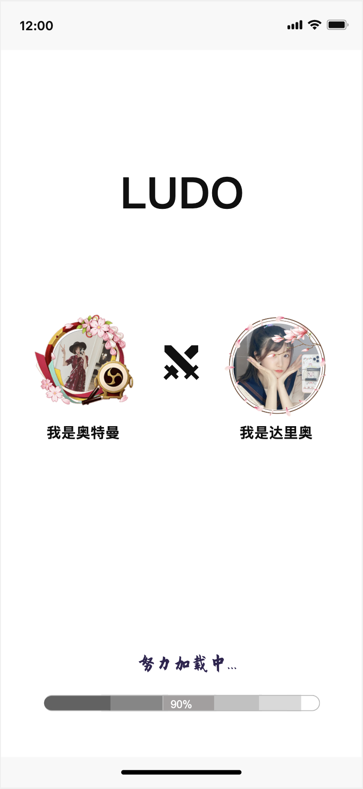

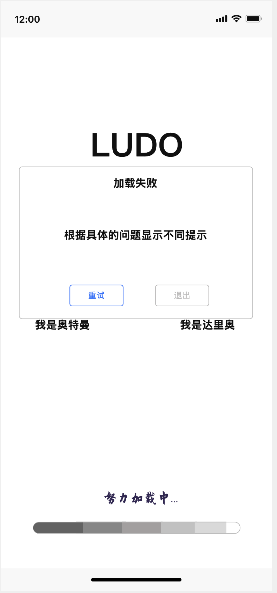

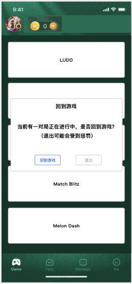

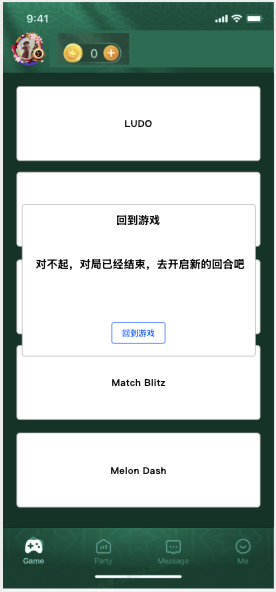

3.1.1.3游戏聊天和基础操作以及结算

| 功能名称 | 游戏中样式 |
|---|---|
| 优先级 | 高 |
| 功能描述 | / |
| 输入/前置条件 | / |
| 交互原型 | 「图1」                       「图2」 「图3」                              「图4」 |
| 字段描述 | 「图1」:此处依旧用Ludo打样；1. 顶部栏： 用户头像，头像框，支持点击打开个人主页和返回； 用户当前金币数量，支持点击半屏充值，和平台统一规则； 对局ID（12位）：日期yyMMdd +大小写字母和数字（加密内容），加密内容可以校验（实际为自增），对局ID唯一不重复（7月9日修改）； 拓展按钮：说明、支持、设置和房间外相同，增加退出按钮，退出游戏； 点击退出二次弹窗「图3」，点击确定后退出游戏 受制于三方限制，有的是退出后托管，有的是托管几个回合后自动判负，这个我们不管； 我们处理的就是确认退出后记录一次退出，不再回到该回合游戏，即使托管赢了，也不给结算，被托管输了的玩家，那就正常结算； 连续3次主动退出逃跑后，在第4次发起时开始倒计时59s后，才可以重新进行匹配； 关闭弹窗不会刷新59s的惩罚时间； 完整完成一场，刷新3次机制； 游戏安全区和结算： 游戏中全部由三方提供内容，当前不进行介入； 游戏结算也是使用三方的； 底部消息和和麦位控制等「图1」 3.1 消息区：房间内1:1复刻内容和资源：头像，头像框，消息，VIP等级，等级、气泡样式等，包括送礼气泡（后面可能增加送礼，所以不用删除功能） 3.2 但是不展示顶部跑道，进房特效 3.2 静音按钮：依旧为房间静音，但是游戏不同音轨，所以游戏音在设置中； 3.2 闭麦：因为用户默认开游戏在房间上麦，因此闭麦就是给自己麦克风闭麦功能，只是外显出来； 3.3 侧边栏只保留消息入口，但属于常驻功能，和房间内的相同，点击后半屏的消息弹窗； 3.4 新增聊天区展开和关闭按钮，默认聊天区缩起； 3.4.1 当用户点击激活输入、滑动消息区（7月7日删除滑动），展开按钮，则展开消息区「图2」，点击回收按钮才会收起； 3.4.2.展开状态下，点击消息按钮，则回收消息区，弹出消息弹窗； 3.4.3 点击消息输入栏，激活输入框，并带有键盘，用户输入消息发出后则直接退出弹窗（7月24日修改）； |
| 需求描述 |  |
| 补充说明 | / |

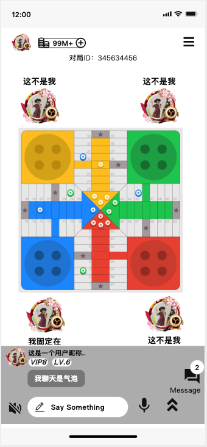

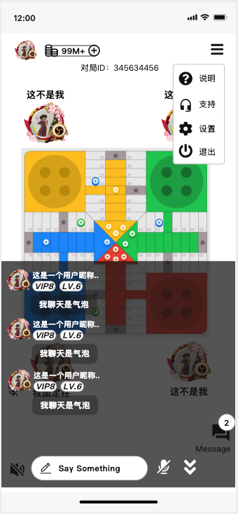

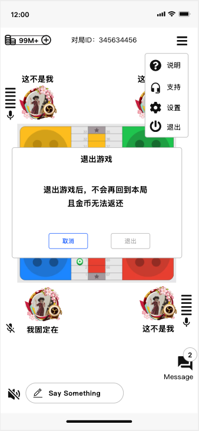

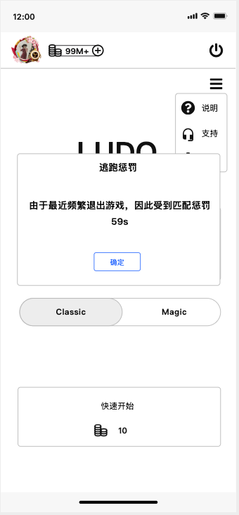

3.1.1.4游戏页面适配 – ludo

| 功能名称 | 适配 – ludo |
|---|---|
| 优先级 | 高 |
| 功能描述 | / |
| 输入/前置条件 | / |
| 交互原型 | 「图1」                「图2」                   「图3」 「图4」                        「图5」 |
| 字段描述 | / |
| 需求描述 | 当前接入ludo的所有模式，包括1V1，4玩家互相对战； 默认为经典模式（非magic），以及1V1模式； 点击后进入匹配页面，不同人数模式下，匹配页面展示不同，以UI为准 |
| 补充说明 | / |

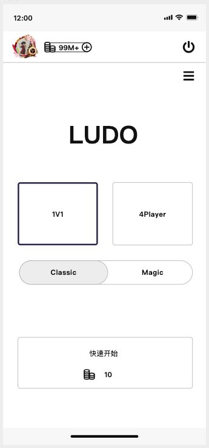

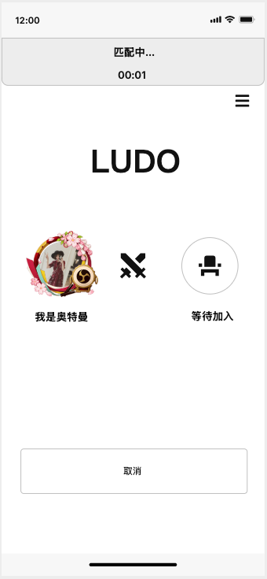

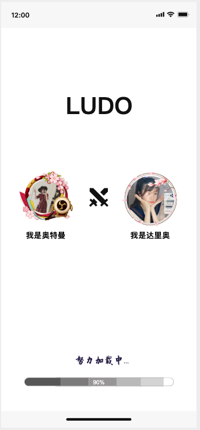

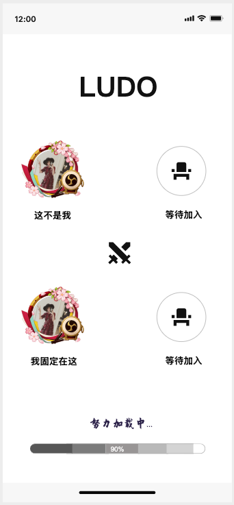

3.1.1.5游戏页面适配 – Carrom

| 功能名称 |  |
|---|---|
| 优先级 | 高 |
| 功能描述 | / |
| 输入/前置条件 | / |
| 交互原型 | 「图1」                 「图2」                 「图3」 「图4」                「图5」 |
| 字段描述 | / |
| 需求描述 | 当前Carrom只有2个模式，一个是2两个玩家对战，也就是1v1，另一个是4个玩家互相对战； 默认为1V1模式； 点击后进入匹配页面，不同人数模式下，匹配页面展示不同，以UI为准； |
| 补充说明 | / |

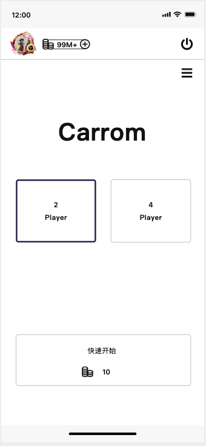

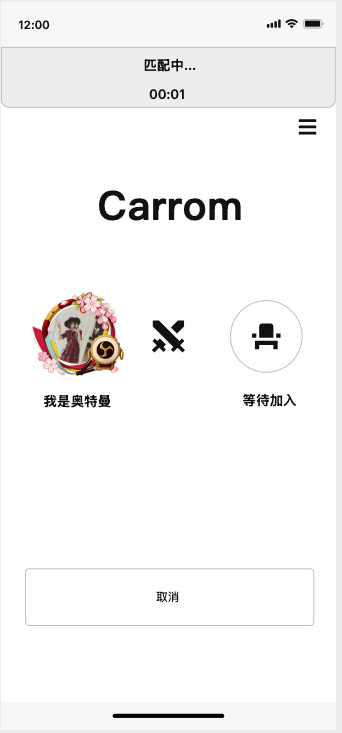

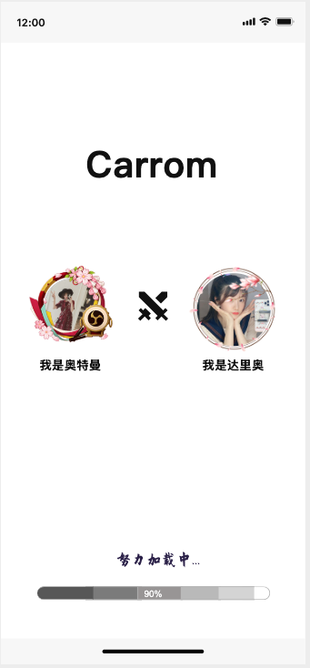

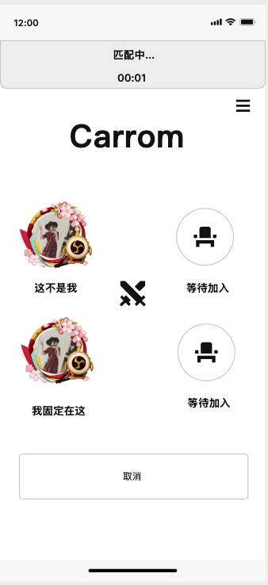

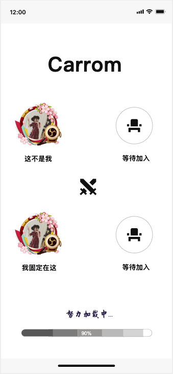

3.1.1.6游戏页面适配 – Block Crush

| 功能名称 |  |
|---|---|
| 优先级 | 高 |
| 功能描述 | / |
| 输入/前置条件 | / |
| 交互原型 | 「图1」                「图2」 「图3」 |
| 字段描述 | / |
| 需求描述 | 当前Block Crush只有2个模式； 一个是4个玩家各自对战（solo），总计4人 另一个是Team玩家互组队，2V2也是4人，然后按照单位时间发车，最高的积分胜出； 默认为Solo模式； 虽然游戏有多个时间和人数选项，但是只选用180s时间，Team为2V2，人满4人就发车； 点击后进入匹配页面，不同人数模式下，匹配页面展示不同，以UI为准； |
| 补充说明 | / |

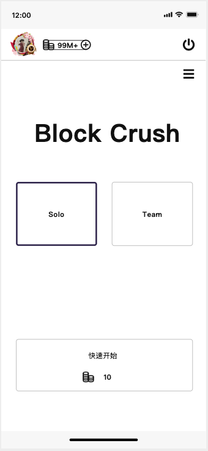

3.1.2 房间内休闲游戏接入（及祥）

3.1.2.1 房间内休闲游戏面板介绍

| 功能描述 | 房间内休闲游戏面板介绍 |
|---|---|
| 优先级 | 高 |
| 输入/前置条件 | 房间内已开启休闲游戏 |
| 需求描述 | 需求描述： 图1                          图2 休闲游戏开启状态后，所有进入房间得用户默认展示休闲游戏展开窗口，游戏窗口不是弹窗，位于房间内通知层得上方，位于弹窗下方 异常状态说明 用户游戏资源未下载完成或者未更新完成（版本不匹配），进入对应游戏房间后，游戏面板默认处于开启状态并进入更新或者资源加载状态如图3所示，该状态支持最小化、充值、设置操作（7.1）。游戏更新完成后，自动同步游戏状态，根据不同身份与游戏不同状态展示不同的信息，如图1图2 图3 游戏面板顶部功能介绍 金币余额：展示账户余额，点击加号打开充值弹窗，余额展示规则同大厅游戏一致（7.2） 观众图标：当前打开游戏面板得用户显示，图标显示观众人数。观众定义：当前在房间内打开游戏面板且未参与游戏得用户数（此版本不做） 通用设置：当前打开游戏面板得用户显示，点击打开游戏设置菜单，游戏声音设置与规则说明入口（详见3.1.2.5） 房间内外游戏声音使用媒体音（7.1） ios有回声问题建议使用游戏方提供的使用RTC播放游戏音方法消除（7.23） 游戏关闭按钮：仅具备房间内游戏管理权限用户且在游戏未开局状态展示，点击需要二次确认可以关闭游戏（详见3.1.2.12） 最小化游戏窗口按钮：当前打开游戏面板得用户显示，点击折叠游戏窗口（详见3.1.2.4） 游戏准备窗口：如图1所示在游戏通用设置菜单栏下方，根据不同权限用户展示不同得状态可设置或者参与游戏，详见游戏准备与发起需求（详见3.1.2.8-3.1.2.10） 游戏对战窗口：如图2所示在游戏通用设置菜单栏下方，展示游戏方提供得游戏对局界面，具体需求见游戏对局描述（3.2.1.3与3.1.2.16） 游戏面板下方为公聊区，右下角菜单处于折叠状态，点击可展开该区域具体需求见公聊区折叠需求（3.1.2.2） |
| 输出/后置条件 |  |
| 补充说明 |  |

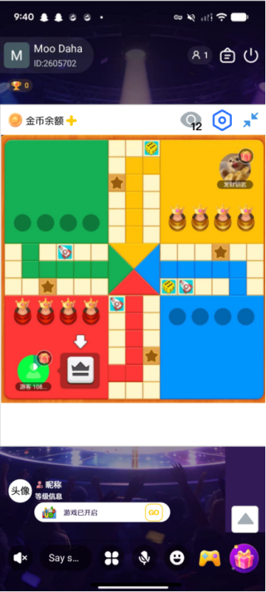

3.1.2.2 房间消息与通知改造

| 功能描述 | 房间内开启休闲游戏通知内容适配 |
|---|---|
| 优先级 | 高 |
| 输入/前置条件 |  |
| 需求描述 | 需求描述： 图1                         图2 游戏窗口开启后公聊区被折叠仅显示部分信息同时右下角功能区菜单隐藏，隐藏处为折叠菜单按钮，如图1所示，礼物跑道在游戏面板下方 公聊区域展开状态 消息界面置于游戏面板上层，公聊区、右下角功能区、全站广播正常展示 展开：滑动公聊区消息、点击公聊输入框、点击折叠菜单按钮 收起：点击折叠菜单按钮，收起公聊区 全站广播点击跳转其他房间，游戏对局中得用户点击广播其他房间提示，使用游戏对局状态玩家离开房间得弹窗文案 |
| 输出/后置条件 |  |
| 补充说明 |  |

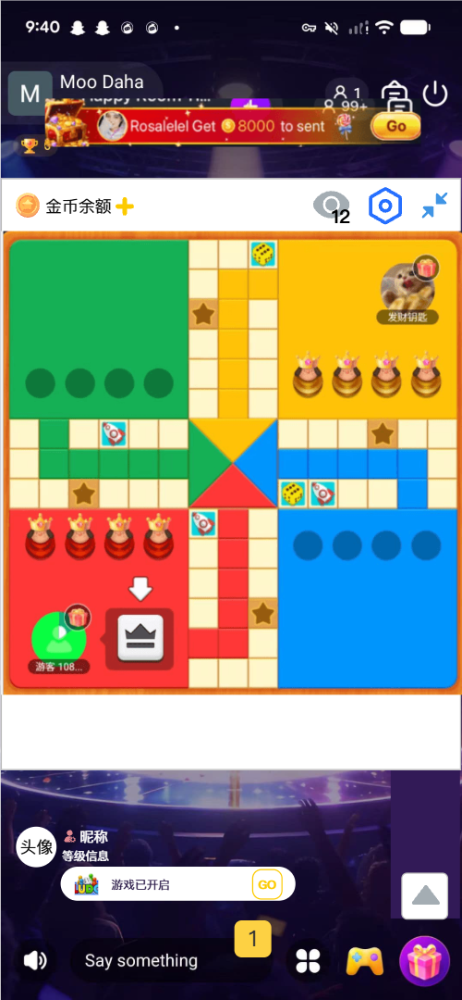

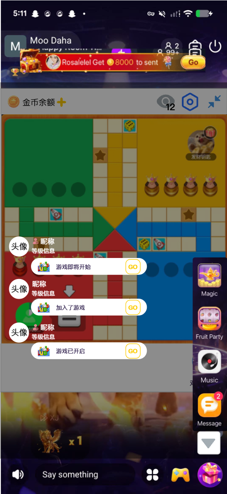

3.1.2.3 动效展示与设置

| 功能描述 | 房间游戏相关通用设置 |
|---|---|
| 优先级 | 高 |
| 输入/前置条件 |  |
| 需求描述 | 需求描述： 图1                          图2 礼物动画效果与座驾动画效果在游戏面板下层如图1所示 礼物动效设置调整：礼物动画与座驾动画设置整合在特效设置入口中，如图2所示，外部不再展示开关状态，点击打开特效设置菜单如图3所示，礼物与入场动画开关默认为开启状态，点击开启或者关闭无需二次确认，结果以toast提示。 注：用户原礼物动画设置继续保留 图3 |
| 输出/后置条件 |  |
| 补充说明 |  |

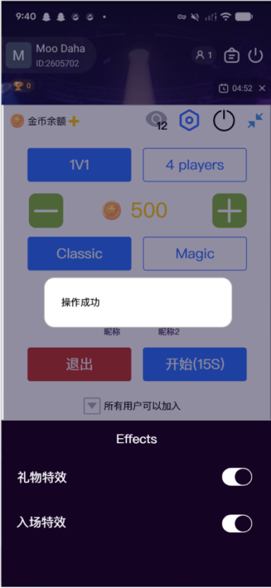

3.1.2.4 游戏窗口最小化状态

| 功能描述 | 房间游戏相关通用设置 |
|---|---|
| 优先级 | 高 |
| 输入/前置条件 |  |
| 需求描述 | 需求描述： 图1                        图2 点击右上角最小化游戏窗口按钮后，最小化游戏窗口，如图2所示，游戏最小化状态时游戏背景音乐与声效处于静音状态 最小化图标展示在音乐播放器与水果机图标中间 图标信息：用户得头像、游戏图标、游戏参与人数、游戏名称、托管状态 图标状态： 参与者默认状态：游戏准备中/游戏进行中未进入托管状态时 显示自己得头像、与游戏图标、参与人数、游戏名称 如图2所示 2.参与者托管状态：游戏处于托管状态时，图标显示自己头像、游戏图标、参与人数、游戏名称，图标最上层展示遮罩与托管图标 如图3所示（游戏方无托管状态交互移除此需求） 3.观看者状态：未参与游戏用户，图标显示游戏图标、参与人数、游戏名称 如图4所示 无论图标处于什么状态点击图标：展开游戏面板 图3                         图4 3）游戏参与人游戏最小化状态时，游戏对局结束时，结束最小化状态并自动展开游戏面板如图5所示（由于双端底层技术实现问题打开游戏面板即可 图5 |
| 输出/后置条件 |  |
| 补充说明 | 7.14移除最小化时图标托管状态标记 |

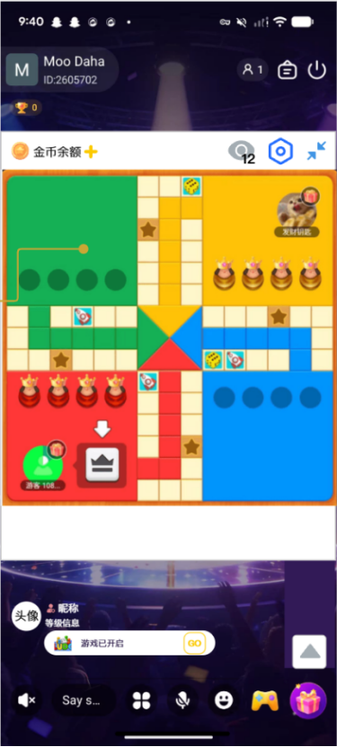

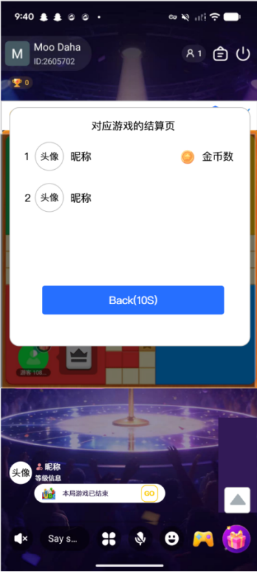

3.1.2.5 游戏通用设置

| 功能描述 | 房间游戏相关通用设置 |
|---|---|
| 优先级 | 高 |
| 输入/前置条件 |  |
| 需求描述 | 需求描述： 图1                        图2 点击游戏面板得设置按钮打开此页面，游戏得声音与音效为默认开启状态 开启与关闭声效或者音效展示toast提示：该操作已成功 操作成功后保存当前设置，下次开启或者进入其他房间打开对应游戏时依然生效 游戏声音得开闭每个游戏为单独控制（7.1） 游戏规则入口：准备阶段隐藏、游戏对局中展示 点击打开对应游戏的规则页面 |
| 输出/后置条件 |  |
| 补充说明 |  |

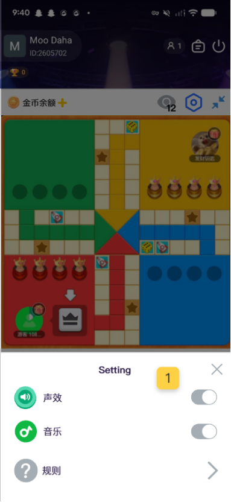

3.1.2.6 房间内原有功能兼容（7月22日更新）

| 功能描述 | 房间游戏开启时原房间功能适配 |
|---|---|
| 优先级 | 高 |
| 输入/前置条件 |  |
| 需求描述 | 需求描述： 图1                        图2 计分器： 开启同原规则一致，显示位置不变，计分器结算弹窗显示在游戏面板上方 图3                          图4 礼物面板：游戏开启状态时，点击礼物图标打开礼物面板，覆盖在游戏窗口上方 麦上表情：用户在麦状态麦上表情窗口正常打开并覆盖在游戏窗口上方 图5                         图6 游戏菜单：休闲游戏展开状态时游戏菜单打开时覆盖在游戏上方，此时点击水果机或者动物转盘，打开对应游戏，并将休闲游戏最小化 图7                          图8 在线用户列表：休闲游戏开启时，点击房间在线用户列表入口时打开在线列表窗口覆盖在休闲游戏上方 房间榜单：休闲游戏开启时，点击房间榜单按钮，打开房间榜单窗口，房间榜单窗口覆盖在休闲游戏上方 图9                          图10 房间信息窗口：休闲游戏开启状态下，点击房间信息打开房间信息窗口，此窗口覆盖在游戏面板上方 房间工具箱：休闲游戏开启状态下，点击房间工具箱打开房间工具箱菜单，如图10 所示，此菜单覆盖在游戏面板上方 图11                        图12 房间公告：休闲游戏开启状态点击房间公告，打开房间公告弹窗，此弹窗覆盖在游戏面板上方 退出房间按钮：休闲游戏开启状态，点击退出房间按钮，打开退出房间选项菜单，支持最小化与退出，游戏参与者点击退出需要二次确认，确认后退出房间 点击金币充值加号或者房间内其他触发充条件时，打开充值面板如图13所示 游戏准备状态用户被踢出房间时，同步踢出游戏席位并返还门票 图13 13.新人引导显示问题，用户安装应用后首次进入游戏房，不展示房间内上麦引导、公聊引导、送礼入口引导组合，且引导标记为已展示状态。（7月22日新增） |
| 输出/后置条件 |  |
| 补充说明 |  |

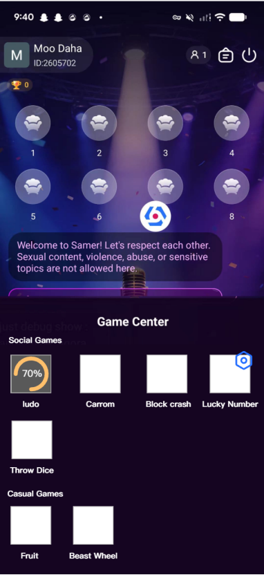

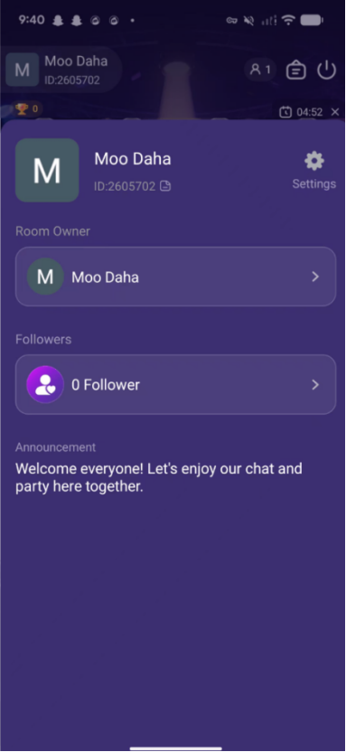

3.1.2.7 游戏开启条件与设置（7.22更新）

| 功能描述 | 房间内休闲游戏开启 无开启权限提示 房间内休闲游戏开启权限设置 休闲游戏更新与预加载 优先级（7.1） 游戏下架逻辑补充（7.22） |
|---|---|
| 优先级 | 高 |
| 输入/前置条件 |  |
| 需求描述 | 需求描述： 图1                         图2 游戏开启： 一个房间内只能同时开启一款休闲游戏 如图1所示游戏列表更改为一行展示四个，同时将游戏分为两类 Social Games：休闲游戏+幸运数字+骰子 Casual Games：数值游戏 所有在房间内的用户点击打开游戏列表打开此页面，具有该房间内半屏游戏开启权限的用户点击对应休闲游戏，且游戏已下载完成或者已更新完成状态。点击后进入二次确认页面如图2所示，是否打开对应游戏名称，确认后房间内开启对应游戏。 若游戏处于未加载完成、需要更新的状态，则对应游戏图标展示下载中状态如图1所示 图3                          图4 无开启权限提示： 若用户无权限开启房间内休闲游戏则根据用户不同的房间身份给与不同的提示 普通用户：请联系房主或者管理员开启游戏 房间管理员：房主未开启管理员开启/关闭游戏功能，请联系房主开启 图5 3.开启权限设置 房间内休闲游戏开启权限默认只有房主可开启，房主可设置允许管理员开启关闭休闲游戏，如图5所示该开关默认处于关闭状态 具体权限表如下图 4.休闲游戏更新与加载（7.2） 同大厅游戏规则一致，详见需求3.1.1.1中5.1.1条 5游戏下架逻辑补充（7.22） 如图6所示游戏下架受后台控制受到后台开关配置影响，是否展示入口和更新判断 游戏未开启时，停留在此页面所有用户，点击已下架游戏图标给与游戏已下架提示 正在进行中的房间游戏不受影响，本局结束后返回准备页时，关闭游戏并提示游戏已下架，请尝试其他游戏 游戏已开启但未开局状态，在此页面变更游戏、手动开局自动开局时触发下架通知并关闭游戏 游戏下架关闭游戏离坐时返还落座用户的门票 图6                         图7 |
| 输出/后置条件 |  |
| 补充说明 |  |

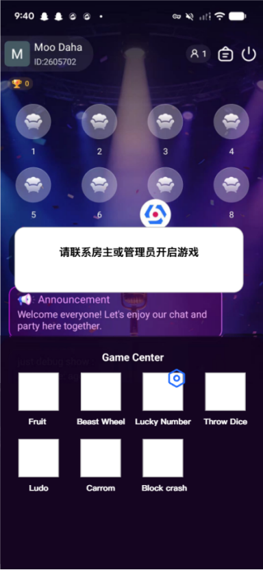

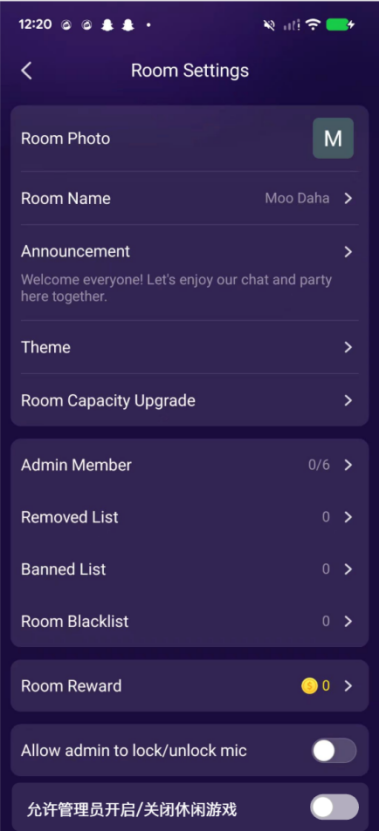

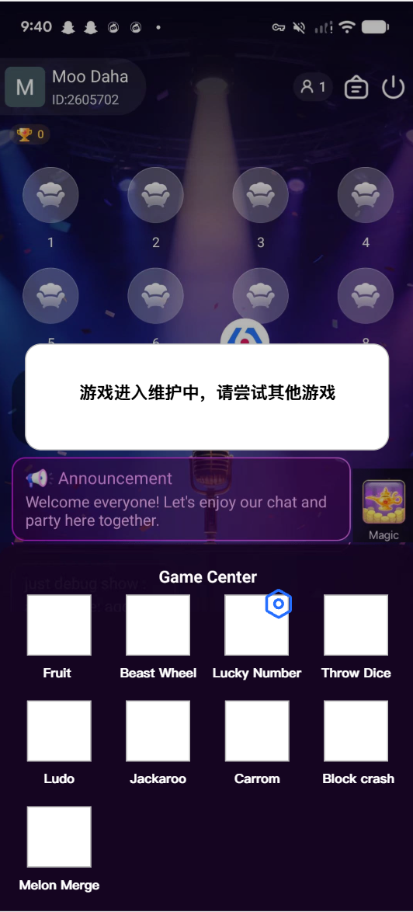

3.1.2.8 游戏开启与准备

| 功能描述 | 休闲游戏开启加入与退出 |
|---|---|
| 优先级 | 高 |
| 输入/前置条件 |  |
| 需求描述 | 需求描述： 图1                        图2 管理视角游戏准备页面 面板介绍：管理在房间内开启对应游戏后打开此面板，管理可以设置对应游戏的模式，门票，管理游戏参与人，加入/退出游戏，开启对局，设置房间加入人员范围 模式设置：ludo默认为1v1模式可选4人对战 门票设置：默认门票为Free，可设置10金币档位。 玩法：默认Classic可选Magic（详情见需求3.1.2.19） 加入与退出：管理发起游戏后默认加入游戏，可点击退出按钮退出游戏，点击空得席位弹出提示选择邀请用户或者加入 参与人员管理： 信息展示内容： 管理标记：具有游戏管理权限的用户显示此标记（可根据房间身份图标来或者统一管理标记） 参与标记：已加入游戏得用户展示加入标记 空状态：显示空位置与虚位以待文字 管理设置： 可管理比自己权限低得用户，房主>管理>用户 不可管理同级用户，具体管理内容见游戏用户管理需求 游戏的开启：游戏人满后，开启按钮变为可点击状态并且展示15秒倒计时，倒计时结束游戏自动开启，或者倒计时结束前手动开启 游戏加入范围设置，有房间内休闲游戏管理权限用户设置，设置完成后房间内显示通知，设置完成后移除所有参与游戏的用户（详见需求3.1.2.10） 图3                          图4 用户视角准备页面 面板介绍：在房间内用户，房间游戏处于开启状态，默认打开此面板。用户端无游戏设置权限，仅展示当前游戏设置内容 对局人数、玩法、门票、加入人数、加入/退出按钮、游戏加入限制提示 用户可点击公聊区得Go（详情见需求3.1.2.14）、点击游戏准备页得加入按钮、点击空得游戏席位，均可加入游戏，加入后默认进入准备状态，点击退出可退出加入游戏状态 管理变更游戏玩法、门票、参与人数已加入游戏得用户会退出当前游戏，并收到提示 通用说明： 点击加入游戏时判断用户是否复合加入条件，不符合给与提示 判断用户钱包余额是否大于门票金额，小于门票金额则给与用户充值提示如图5所示 详细流程见下图 图5 |
| 输出/后置条件 |  |
| 补充说明 |  |

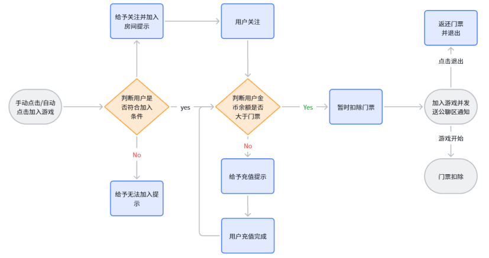

3.1.2.9 游戏参与人员管理

| 功能描述 | 房间内休闲游戏参与人员管理 |
|---|---|
| 优先级 | 高 |
| 输入/前置条件 |  |
| 需求描述 | 需求描述： 图1                        图2 管理权限，如图1所示为管理员视角，无权限移除房主与管理员，具体权限范围见下表 管理移除游戏参与用户时需要二次确认如图2所示，确认后该用户被移除对应游戏，被移除用户给与提示如图3所示 图3 |
| 输出/后置条件 |  |
| 补充说明 |  |

3.1.2.10 游戏准备页信息变更

| 功能描述 | 房间内休闲游戏人员加入范围设置 游戏模式、参与人数、门票变更通知（7.1） |
|---|---|
| 优先级 | 高 |
| 输入/前置条件 |  |
| 需求描述 | 需求描述： 图1                        图2 房间内休闲游戏人员加入范围设置与通知 该设置由游戏管理权限用户设置，设置需要二次确认，设置成功后房间内用户会收到一条公聊区通知，同时已参与游戏得用户会被移除当前游戏，并给与提示。变更为所有人可加入时无需二次确认直接变更成功，同时不做已加入游戏用户的移除处理 图3                          图4 2）未关注房间用户加入休闲游戏流程 房主/管理设置加入游戏用户范围后：面板中显示参与条件文字 房主/管理员设置了仅关注房间用户可参与游戏后，用户点击加入游戏-判断用户是否关注了房间- 用户未关注房间给与用户二次确认弹窗，用户点击确认后关注房间并加入游戏 用户已关注房间，点击直接加入游戏 管理视角不受此条件限制 3）房主/管理设置仅邀请得用户可加入 用户点击后给与提示：房主设置仅关注房间用户可加入，管理视角不受此条件限制可直接加入 图5                          图6 房主/管理改变 游戏模式、参与人数、门票相关流程（7.1） 变更时均需要进行二次确认如图8所示，二次确认后参与游戏的用户会被移出游戏并收到一个toast通知如图9所示，同时房间内公聊区发送一条游戏条件变更的消息（详见3.1.2.14toast提示内容） 图7                       图8 图9 |
| 输出/后置条件 |  |
| 补充说明 |  |

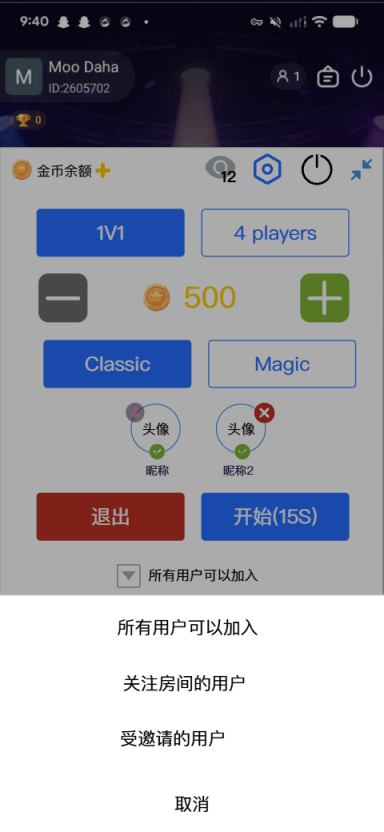

3.1.2.11 邀请用户参与游戏

| 功能描述 | 邀请用户参与游戏 |
|---|---|
| 优先级 | 中 |
| 输入/前置条件 |  |
| 需求描述 | 需求描述： 图1                         图2 1.邀请发起： 房主/获得管理权限得管理员，点击游戏空位时打开游戏位置管理菜单，此菜单覆盖在游戏面板上方 菜单选项：加入、邀请用户、取消 点击效果： 加入：点击后移到此位置，若该位置有用户则提示该位置已有人 邀请用户：点击后打开邀请用户列表 取消：点击关闭此菜单 图3                         图4 2.可邀请用户列表： 显示信息范围：点击时，获取房间内且未加入游戏得用户，该列表信息支持右上角手动刷新 信息明细：用户头像昵称性别等级信息，可邀请状态 点击操作： 点击用户信息区域打开用户资料卡 点击邀请按钮，按钮状态变更为已邀请，并向用户发送一条邀请加入游戏信息，用户未处理则弹窗一直展示,用户弹窗最多展示一个 异常状态： 1）点击邀请该用户时，该用户已加入游戏提示：该用户已加入游戏 2）点击邀请该用户时，该用户已离开房间，提示：该用户已离开房间 3.受邀人弹窗： 用户接受到邀请信息时，显示邀请弹窗，若受邀人此时房间处于最小化状态，则不展示邀请弹窗 此期间用户点击接受则进入游戏加入流程，若此时游戏人数已满或者游戏对局已开始、游戏状态变更则提示该邀请已过期 若被邀请用户成功加入游戏，则给与邀请者提示，XX接受了邀请并加入了游戏 图5                         图6 |
| 输出/后置条件 |  |
| 补充说明 |  |

3.1.2.12 游戏得关闭与切换

| 功能描述 | 房间游戏关闭与切换 |
|---|---|
| 优先级 | 高 |
| 输入/前置条件 |  |
| 需求描述 | 需求描述： 图1                        图2 1.关闭游戏： 游戏处于准备中状态时，房主或者管理员（获得授权得）点击游戏关闭按钮，打开弹窗，点击确认后关闭游戏，所有在房间内得用户会收到一条提示，提示内容  操作人昵称  关闭了游戏，同时公聊区显示关闭游戏得消息 图3                       图4 2.切换游戏 游戏处于准备中状态时，房主或者管理员（获得授权得）点击其他休闲游戏时，打开弹窗如图4所示，点击确认，关闭当前游戏并打开切换游戏，公聊区会有两条消息，关闭游戏A，开启游戏B 对于已经加入游戏A得用户一条提示如图2所示 图5                           图6 3.切换游戏异常状态说明：若游戏处于对局状态，房主/管理员点击其他休闲游戏时给与提示 本局游戏未结束无法切换游戏如图5所示 |
| 输出/后置条件 |  |
| 补充说明 |  |

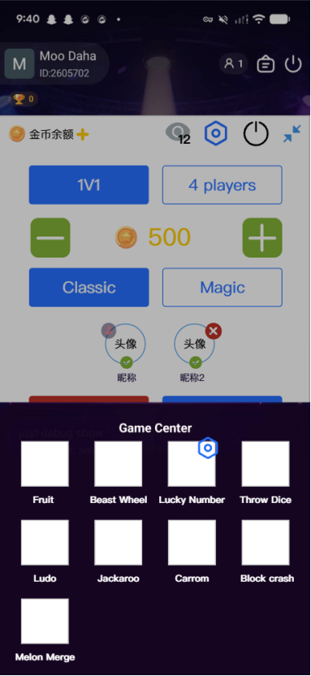

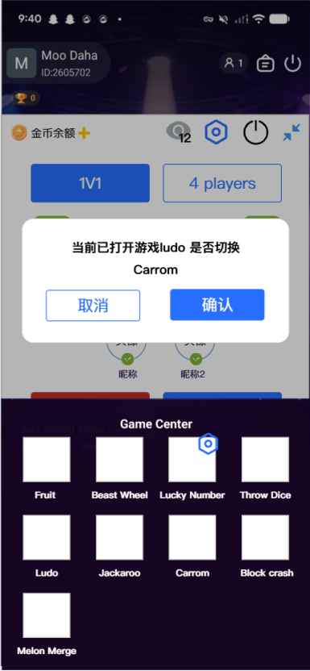

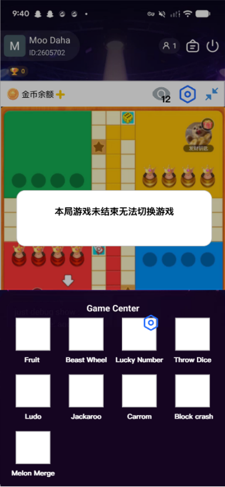

3.1.2.13 游戏开启流程

| 功能描述 | 房间内休闲游戏得开启与结算 |
|---|---|
| 优先级 | 高 |
| 输入/前置条件 |  |
| 需求描述 | 需求描述： 图1                         图2 游戏得开启： 游戏开启有两种方式，由管理手动开启和人满自动开启 管理手动开启：游戏符合最低开局人数要求时，管理视角开始按钮变更为可点击状态，点击开始游戏按钮，游戏开始 游戏参与人数满时 开启条件时，管理视角游戏开始按钮变为倒计时状态，倒计时状态时，公聊区提示游戏即将开启，倒计时结束前游戏自动开启，游戏对局开启时给与房间内用户一条公聊消息 游戏已开启 游戏开启加载状态 1）加载中：时间短于1s，最短加载时间为1s；如果超过根据实际时间决定； 2）超时：单次超时时间为15s，然后重连一次，2次总计时间30s； 3）展示自己和对方的头像，头像框，昵称不支持点击查看资料 图3                        图4 游戏对局与结算 用户正常参与游戏，对局结束时弹出游戏结算页面，根据游戏方得门票返还规则，我们是赢者通吃并获得门票80%得奖励，平台抽取20% 对局结束后参与游戏用户重新落座 |
| 输出/后置条件 |  |
| 补充说明 |  |

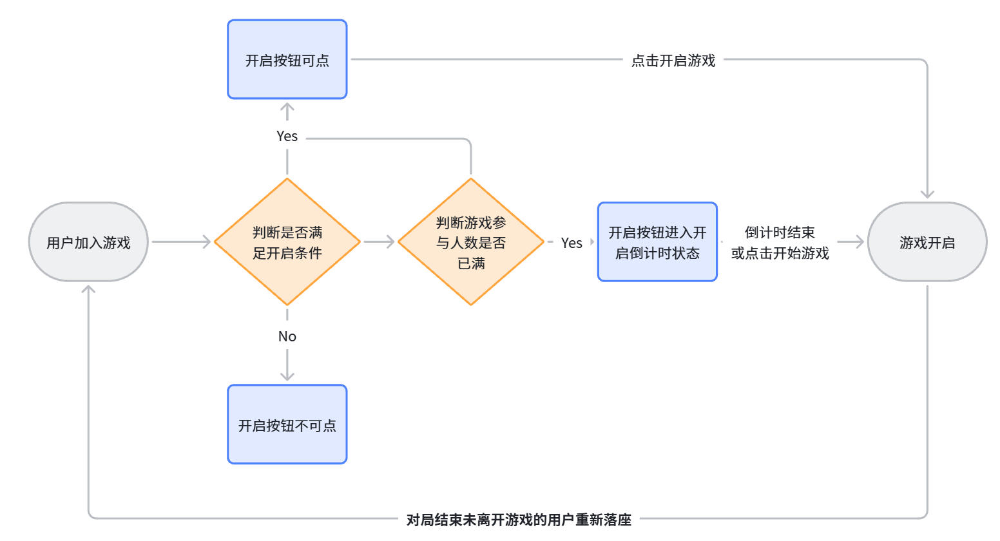

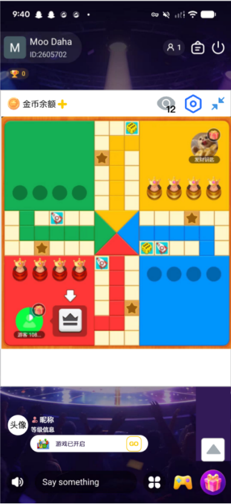

3.1.2.14 游戏相关通知

| 功能描述 | 房间游戏相关房间内通知 |
|---|---|
| 优先级 | 高 |
| 输入/前置条件 |  |
| 需求描述 | 需求描述： 图1                        图2 游戏公聊区消息汇总 游戏Toast通知类型汇总 弹窗 |
| 输出/后置条件 |  |
| 补充说明 |  |

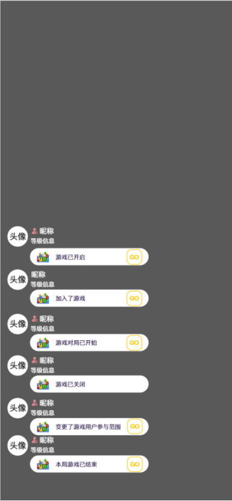

3.1.2.15 门票资金规则表

| 功能描述 | 游戏门票相关资金说明 |
|---|---|
| 优先级 | 高 |
| 输入/前置条件 |  |
| 需求描述 | 需求描述： 相关门票扣除与派奖与对局后台标记说明表 【金山文档 \| WPS云文档】 休闲游戏门票资金规则表 https://365.kdocs.cn/l/csR9X9vEu2sT |
| 输出/后置条件 |  |
| 补充说明 |  |

3.12.16 对局状态（7.13变更）

| 功能描述 | 1.房间游戏对局状态（7.13变更） 2.异常退出应用返回应用对局处理（7.1） |
|---|---|
| 优先级 | 高 |
| 输入/前置条件 |  |
| 需求描述 | 需求描述： 图1                        图2 托管状态：Ludo、carrom4人对战模式、block crush根据游戏方得托管判断规则，展示托管状态 如果用户杀掉进程，重新进入游戏后，进入对应房间游戏未结束可重新加入对局 如图3所示： 用户主动退出房间：统计为逃跑，不会获得该局游戏的任何奖励和门票返还，若本场游戏未结束用户可返回房间继续游戏，若该用户最终赢得本局游戏我们服务端需要做拦截，该用户本局不加币 图3                         图4 2.异常状态处理（7.1） 用户杀进程、或者因为网络原因掉线或者闪退，服务端没有及时更新用户状态导致游戏对局已开启，或者游戏处于对局中状态中异常关闭应用。 用户再次打开应用时且最近开启的游戏对局处于未结算状态，给与1次引导弹窗如图4所示，该弹窗属于用户弹窗层级中（同大厅返回游戏提示弹窗一致业务弹窗逻辑不做调整），点击确认返回对应房间回到对局，点击取消关闭弹窗 3.对局结束数据校验（仅做数据兜底） 服务端查询对局时间超1小时得对局，查询房间内外游戏结算异常得对局，查询后强制结束并更新对应游戏状态 |
| 输出/后置条件 |  |
| 补充说明 |  |

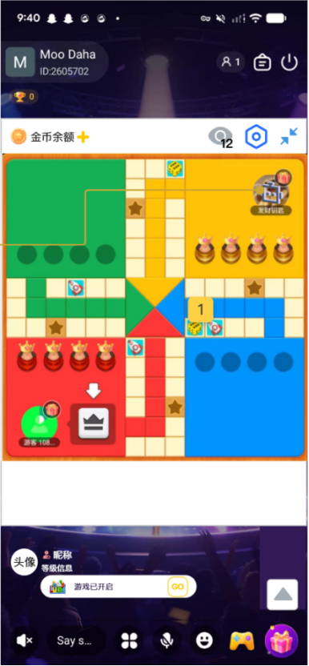

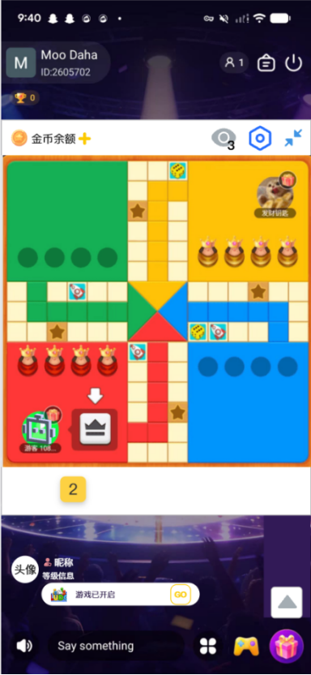

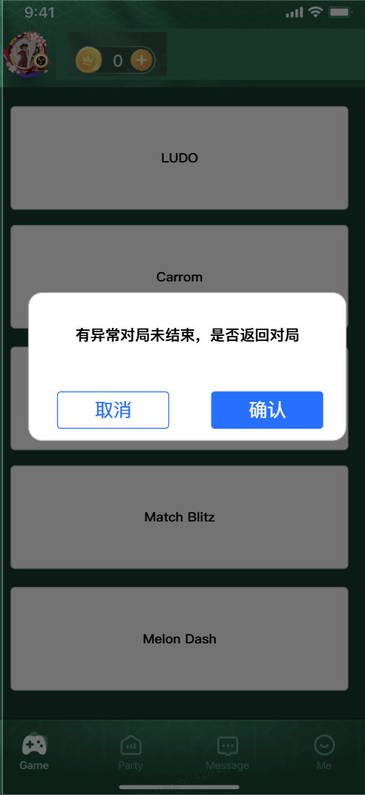

3.1.2.17 游戏中用户被踢操作与提示（7.13变更）

| 功能描述 | 房间内休闲游戏参与用户被踢出处理 |
|---|---|
| 优先级 | 高 |
| 输入/前置条件 |  |
| 需求描述 | 需求描述： 图1 游戏对局状态中，房主或者管理员（有踢人权限）点击踢出游戏中的用户时，需要拦截并给与toast提示：当前用户正在游戏中，请对局结束后再操作 |
| 输出/后置条件 |  |
| 补充说明 |  |

3.1.2.18 列表游戏标记

| 功能描述 | 房间列表游戏标记 |
|---|---|
| 优先级 | 高 |
| 输入/前置条件 |  |
| 需求描述 | 需求描述： 图1                        图2 1）房间内开启游戏后，我的房间、最近进入的房间、我关注的房间、房间列表中显示对应游戏的游戏图标，该标记属于房间内容标记不影响房间排名，如图1图2图3所示 图3 |
| 输出/后置条件 |  |
| 补充说明 |  |

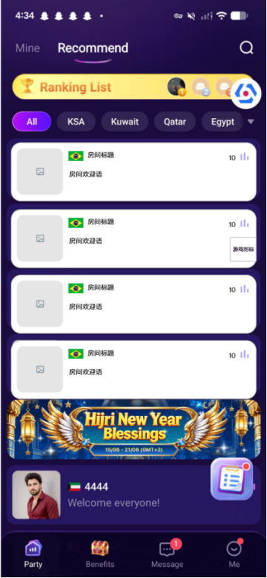

3.1.2.19 游戏说明

| 功能描述 | 房间其他游戏适配 1.Ludo 4人模式 2.Carrom 3.Block crush |
|---|---|
| 优先级 | 高 |
| 输入/前置条件 |  |
| 需求描述 | 需求描述： 图1                       图2 Ludo 默认人数选择为1v1,可选4人模式 默认门票：Free。可选择10金币 默认模式：Classic 胜者：第一名获得本局门票总数的80% 1）管理视角： Ludo4人模式状态 游戏参与人展示4个位置，英文模式下从左到右依次为1234位置，管理或者房主开启此模式默认位置为左2)用户视角 用户视角同管理视角一致，参与人数这里变为4人 开启条件： 1v1模式2人落座后可开启  开启按钮为15S倒计时状态 4人模式4人落座后可开启 开启按钮为15S倒计时状态 图3                           图4 图5                          图6 克郎棋 默认人数选择：1v1可选4人模式 默认门票：Free，可选择10金币 胜者：第一名获得本局门票总数的80% (默认选项目均可配置) 克朗棋同ludo一致，2人模式名称为1v1，4人对战为4player,游戏开启规则一致 游戏托管模式说明 1v1模式无托管功能 用户两轮不操作即为负 4人对战模式，用户两轮不操作进入托管模式 3）游戏结算页面同样使用游戏内页面 开启条件： 1v1模式2人落座后可开启  开启按钮为15S倒计时状态 4人模式4人落座后可开启 开启按钮为15S倒计时状态 图7                         图8 图9                           图10 图11                         图12 3.block crush 默认模式：Solo可选team 默认时间：180秒可选90秒和300秒 默认门票：Free可选10 胜者：SOLO模式：第一名获得本局门票总数的80% team模式：第一组获得本局门票总数的80%，组内用户平分 （默认选项均可配置） 1）该游戏最多支持6人对战，单人模式下满2人即可对战，组队模式需要满2组才可开启游戏，游戏状态下游戏内的计时器需显示在游戏通用菜单栏的中间 2）游戏的托管：托管模式使用游戏中的，根据游戏规则判断返回该状态 3）游戏结算页面同样使用游戏内页面 开启条件： solo模式2、3、4、5人落座后可开启 按钮为开启状态 6人状态 开启按钮为15S倒计时状态 team模式2组人落座（4人）后可开启 开启按钮为15S倒计时状态 按钮为开启状态 3组坐满状态（6人） 开启按钮为15S倒计时状态 有人离开座位不做补位或者移动位置操作 |
| 输出/后置条件 |  |
| 补充说明 |  |

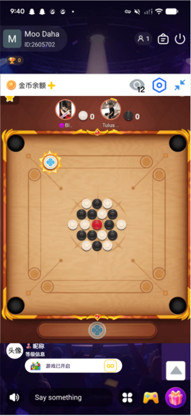

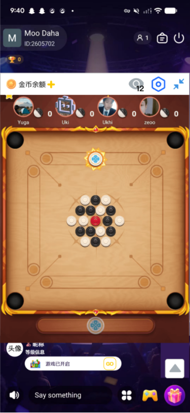

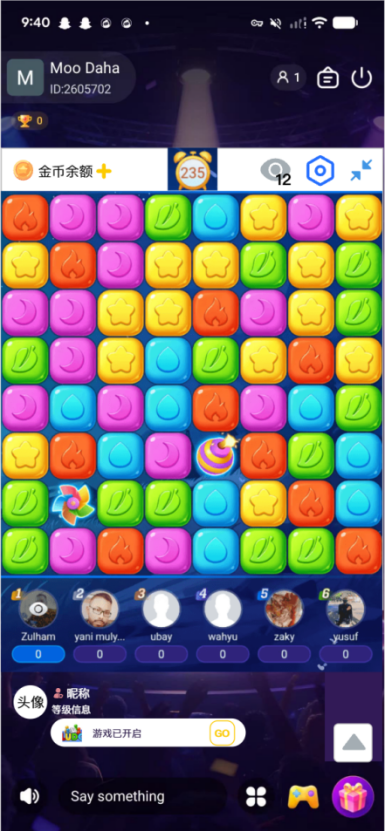

