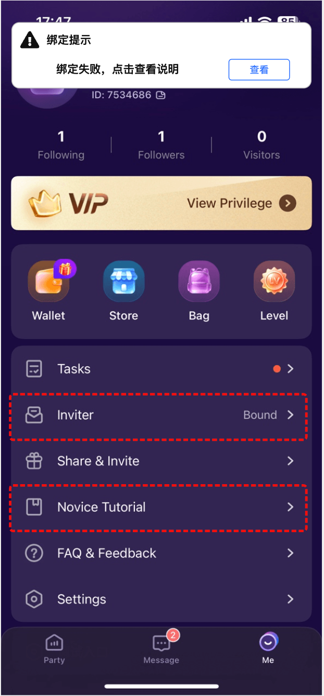

# 拉新 — V1.3.1 原文切片

> 状态：`history`  · 来源：`demo/V1.3.0/V1.3.1.docx`

## 拉新新增限制逻辑(丛)

拉新新增限制逻辑(丛)

| 功能名称 | 拉新限制逻辑 |
|---|---|
| 优先级 | 高 |
| 功能描述 | / |
| 输入/前置条件 | / |
| 需求描述 | 「图1」 |
| 补充说明 | 客户端上报，服务端判断是否为渠道推广来的用户； 具体流程为收集数据，数据清洗，找出相关key作为词库，作为特定渠道（推广量）来的用户； 针对特定渠道来的用户，补绑定入口不展示，也限进行绑定，如果有绕过的，则toast提示“您不可以绑定其他用户”； 同时，通过分享链接进来的，也不可以绑定，过滤弹出提示「图1」； 请注意：团长邀请团员的链接，如果团员是推广渠道来的，那么只会成为团员，不会成为拉新绑定用户； |

