Hayyo 版本外后台需求2.0

文件标识：

| Hayyo 版本外后台需求2.0 |  |  |
|---|---|---|
| 文件状态[]草稿[]修改[√]正式发布 | 文件标识： |  |
|  | 当前版本： | 1.0.0 |
|  | 作 者： | 产品部 |
|  | 完成日期： | 2026/8/31 |

修订记录：

| 文档版本 | 修订日期 | 修订内容 | 修订人 |
|---|---|---|---|
| 1.0 | 2026/8/31 | 创建文档 | 产品部 |

1.0.0用户平台时长功能补充（及祥）

| 功能描述 | 需提供用户平台时长数据源 |
|---|---|
| 优先级 | 高 |
| 输入/前置条件 | 需要有用户平台时长数据源 |
| 需求描述 | 1.需求路径：数据统计-用户统计-新用户平台时长需求描述：统计时间用户使用总时长（分钟）：获取数据并显示2.需求路径：数据统计-用户统计-用户平台时长需求描述：用户使用总时长（分钟）：获取数据并显示人均使用时长（分钟）：获取数据并显示3）单个用户查询，显示用户平台时长数据 |
| 输出/后置条件 |  |
| 补充说明 | 平台时长统计数据由服务端统计，当前统计标准为用户打开应用开始计时，后台期间依旧统计时间 |

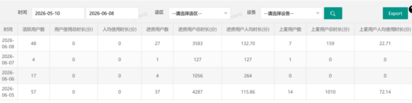

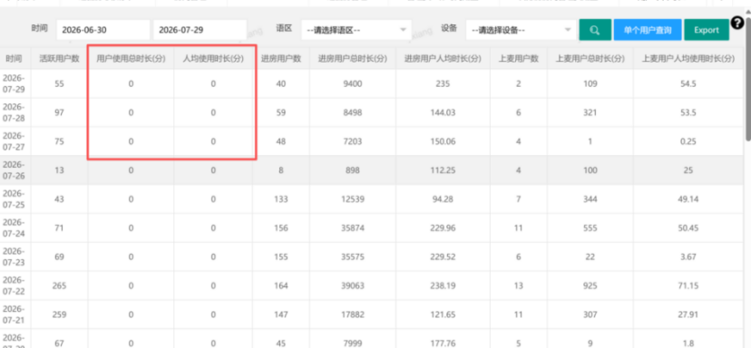

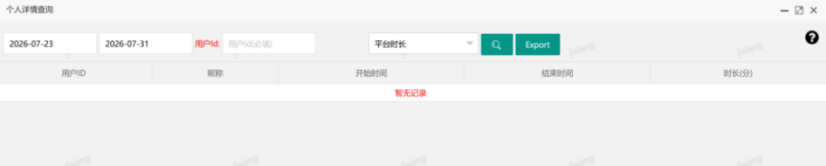

1.0.1管理员工作时间配置（及祥）

| 功能描述 | 补充未开发完成字段 |
|---|---|
| 优先级 | 高 |
| 输入/前置条件 |  |
| 需求描述 | 需求路径：Manage-Manage Room-官方房管理-管理员工作时间配置需求描述：1.列表语区字段生效 筛选项：语区字段生效 2.配置页语区字段生效 |
| 输出/后置条件 |  |
| 补充说明 |  |

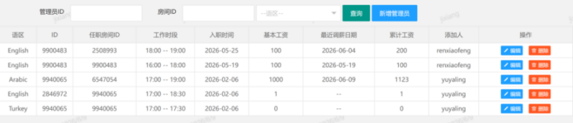

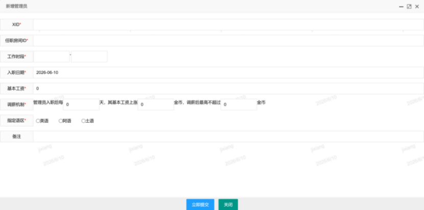

1.0.2官方房考核标准调整（及祥）

| 功能描述 | 1.调整展示内容啊2.调整考核内容文案（详见翻译文档） |
|---|---|
| 优先级 | 高 |
| 输入/前置条件 |  |
| 需求描述 | 官方房考核列表需求路径：Manage-Manage Room-官方房管理-官方房考核标准需求描述：新用户次留率、新用户次留人数显示对应数据、周考核时显示/新用户次留率：新用户次留人数/新用户进房人数*100%（2位小数）新用户次留人数：前日进入房间的新用户昨日有登录平台的人数1.列表考核项目显示数值为对应项设置得工资金币数包含字段以下字段：新用户进房人数：当日注册进入该房间的用户新用户收礼人数：进入该房间新用户（注册时间3天内）收到礼物的人数新用户上麦人数：进入该房间新用户（注册时间3天内）在该房间上麦的人数新用户上麦时长（分钟）：进入该房间新用户（注册时间3天内）在该房间上麦的时间 小于1分钟显示0新用户发言人数：进入该房间新用户（注册时间3天内）在该房间内发送过公聊消息的人数金币总消费：在该房间内金币礼物的总消费数送礼个数：在该房间内礼物送出的总数送礼新用户数：在该房间内送礼的新用户（注册3天内）人数送礼总金币数：在该房间内送出礼物的金币数值调整考核系统消息内容客户端文案（详见翻译文档）官方房考核标准周考核任务配置移除新用户次日留存率配置需求路径-manage-官方房管理-官方房考核标准 勾选周选项时隐藏新用户次日留存率配置4.奖励发放说明，任务周期结束后次日北京时间上午10点发放上周期奖励，同一考核设置多档位先按最高档位奖励发放，若任务完成超过设定标准，取最高档位奖励发放，每一项考核仅发一次奖励 |
| 输出/后置条件 | https://docs.google.com/spreadsheets/d/1xTWi_ENR4TPg3X_wRh6Ptkflf5PxlqbILVt9Jt3UiXo/edit?usp=sharing |
| 补充说明 | 官方房考核配置根据官方房语区配置周任务不会配置日活相关任务3.官方房考核标准列表中，考核条件为周时列表内底薪区域显示为0，配置周考核的前提必须先配置日考核任务4.官方房考核列表中仅展示配置日考核与周考核的用户、若对应房间未配置任何考核任务则不发放底薪同时列表中也不展示对应明细5.历史需求引用：【PRD】Samer后台 v2.0.0https://365.kdocs.cn/l/cmEcpVSwycPp3.2.1.2 【改】官方房考核 |

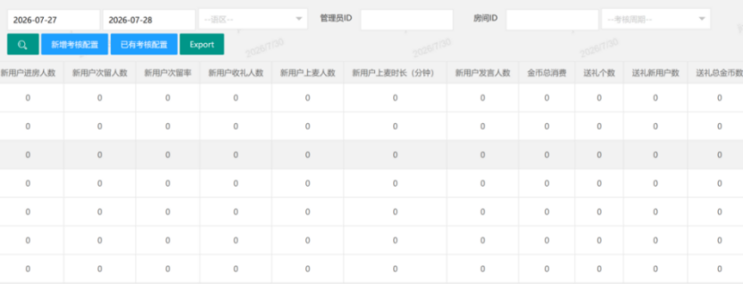

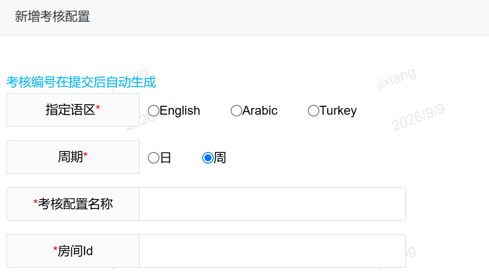

1.0.3官方房统计（及祥）

| 功能描述 | 官方房统计后台 |
|---|---|
| 优先级 | 高 |
| 输入/前置条件 |  |
| 需求描述 | 需求路径：数据统计-房间统计-官方房统计需求描述：考核标准统计：以日为单位统计对应管理员得数据并存入表中，多日查询数据为每日数据得汇总查询字段：1. 日期筛选框：支持根据日期选择进行筛选；2. 语区：支持下拉框选择筛选，选项为：语区、英语、阿语、土语，默认选中“语区”3.房间ID：支持根据房间ID搜索4.考核周期：日、周5.导出：导出当前查询内容列表字段说明：字段名称字段描述时间日期格式 年月日语区所配置语区内容考核标准日/周房间ID房间ID信息名称房间名称新用户进房人数管理员在官方房当班期间，进入官方房新注册用户人数新用户次留率管理员在官方房当班期间，进入官方房新注册用户次留率新用户次留人数管理员在官方房当班期间，进入官方房新注册用户次留人数新用户收礼人数管理员在官方房当班期间，进入官方房新注册用户收礼人数（不算宝石礼物）新用户上麦人数管理员在官方房当班期间，进入官方房新注册用户上麦人数，上麦就算新用户上麦时长管理员在官方房当班期间，进入官方房新注册用户上麦时长，下麦时间-上麦时间，每5分钟刷新一次数据（同现在麦时统计频率）新用户发言人数管理员在官方房当班期间，进入官方房新注册用户发言人数金币总消费管理员在官方房当班期间，官方房金币礼物+头饰卡+掷色子+转盘当天金币总消费送礼个数管理员在官方房当班期间，送出金币礼物个数（不算宝石礼物）送礼新用户数当班管理员在官方房的当班期间，管理员送礼物的新用户数量；（也就是收到当班管理员礼物的新用户人数，不算宝石礼物）送礼总金币数管理员在官方房当班期间，官方房金币礼物当天总消费金币数 |
| 输出/后置条件 |  |
| 补充说明 |  |

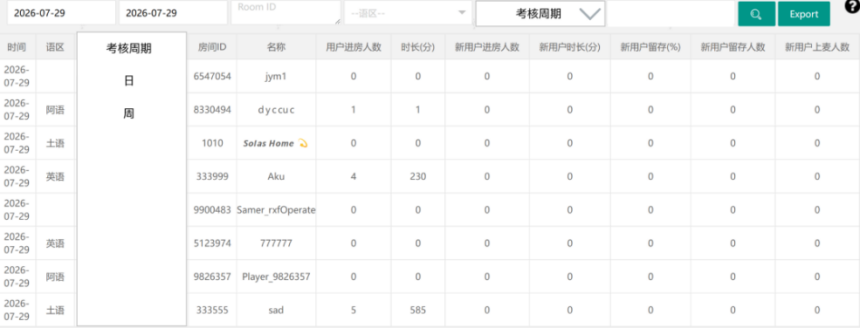

1.0.4后台道具发放优化（及祥）

| 功能描述 | 后台道具奖励发放优化 |
|---|---|
| 优先级 | 高 |
| 输入/前置条件 |  |
| 需求描述 | 图1图2需求路径-Manage-商品赠送管理-商品赠送需求描述1.创建商品赠送时商品分类由原下拉列表方式改为单选框得方式，默认选择为座驾2.创建商品赠送分类选择 座驾 房间背景 头像框 气泡框 房间标签 个人主页装饰时 原有效天数填写方式去除，改为用户信息处填写天数：左侧为用户ID右侧为天数（整数）如图2所示3.创建商品赠送分类选择 包裹礼物时 原个数填写方式去除，改为用户信息处填写个数：左侧为用户ID右侧为个数（整数）如图1所示4.奖励发送时检测用户ID 天数 个数，如有异常显示对应错误提示 |
| 输出/后置条件 |  |
| 补充说明 |  |

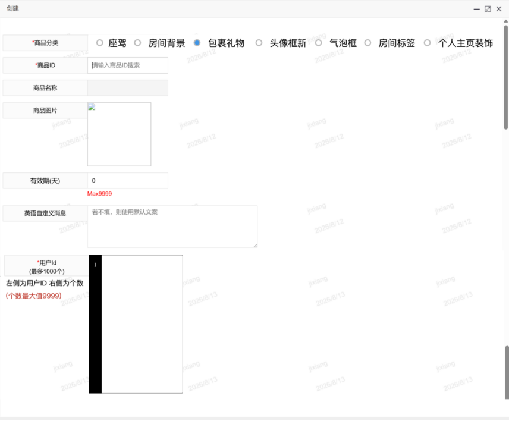

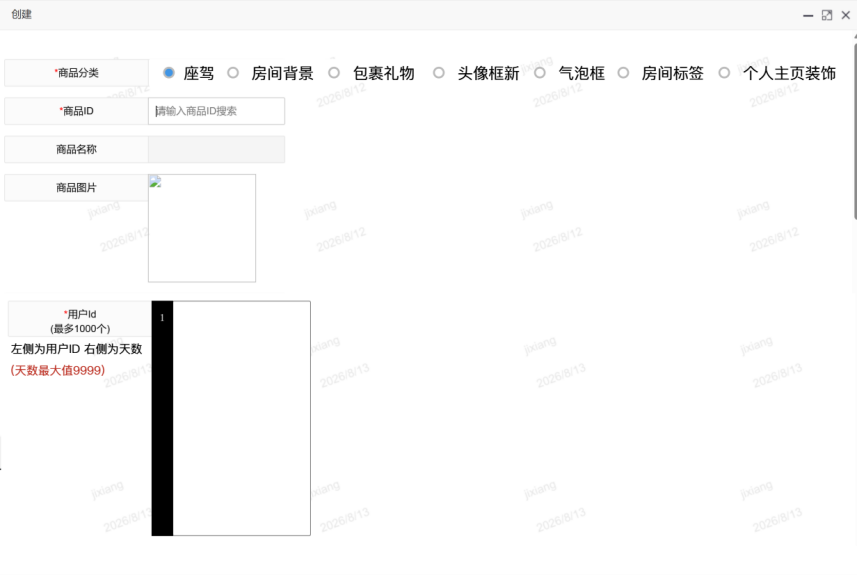

1.0.5新用户平台时长统计时间调整（及祥）

| 功能描述 | 新用户平台时长统计范围由注册7日内调整为注册3日内 |
|---|---|
| 优先级 | 高 |
| 输入/前置条件 |  |
| 需求描述 | 需求路径-数据统计-用户统计-新用户平台时长需求描述新用户平台时长统计范围由注册7日内调整为注册3日内 |
| 输出/后置条件 |  |
| 补充说明 |  |

1.0.6新用户领取奖励明细增加导出（丛国序）

| 功能描述 | 新用户领取奖励明细增加导出 |
|---|---|
| 优先级 | 高 |
| 输入/前置条件 | 新用户配置-新用户奖励领取记录 |
| 需求描述 | 增加导出按钮根据搜索条件，导出条数1000条上限，超过截断（如果存在全局规则条数，则以全局为准）格式为excel和此相同 |
| 输出/后置条件 |  |
| 补充说明 |  |

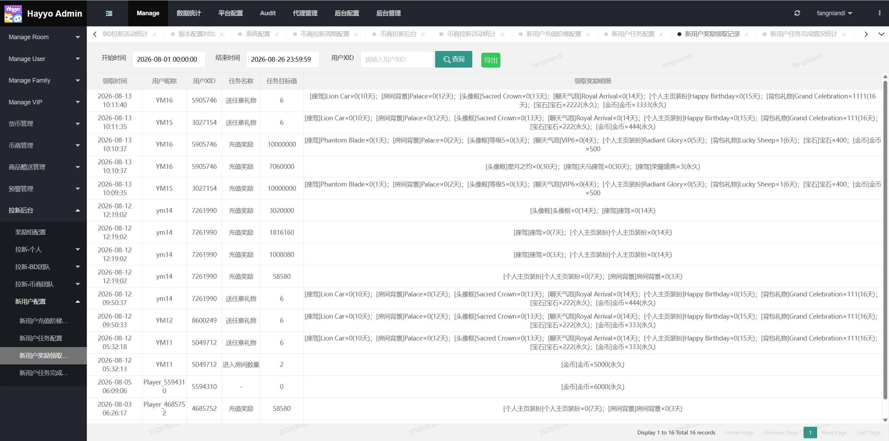

1.0.7增加批量查询、增加一键导出（丛国序）

| 功能描述 | 增加批量查询、增加一键导出 |
|---|---|
| 优先级 | 高 |
| 输入/前置条件 | 拉新-个人-个人拉新后台拉新-BD团队-BD拉新后台拉新-币商团队-币商拉新后台 |
| 需求描述 | 如图所示，增加时间，周期，支持全部条件联查（时间、周期、用户XID）；增加道出按钮，根据搜索条件进行导出根据搜索条件，导出条数1000条上限，超过截断（如果存在全局规则条数，则以全局为准）格式为excel和后台表相同； |
| 输出/后置条件 |  |
| 补充说明 |  |

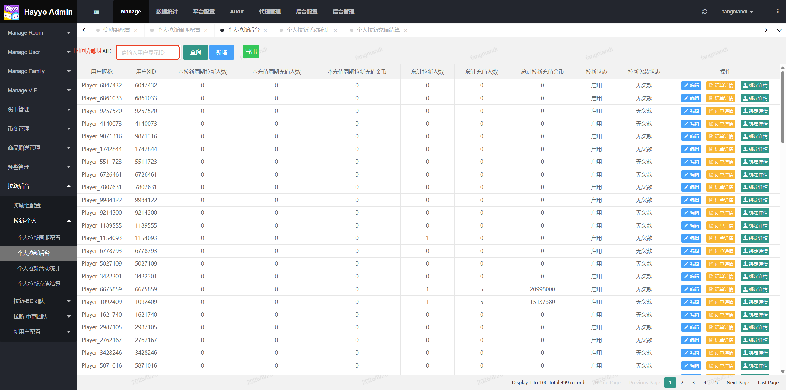

1.0.8礼物统计增加多选、礼物类型筛选项（及祥）

| 功能描述 | 礼物统计增加多选、礼物类型筛选项 |
|---|---|
| 优先级 | 高 |
| 输入/前置条件 |  |
| 需求描述 | 需求路径-数据统计-商品统计-礼物统计需求描述当前礼物统计页-“礼物名称”筛选项增加多选，实现形式如下图；礼物统计页新增“礼物类型”筛选项，礼物配置参照当前礼物面板，一共3种礼物类型：普通礼物、VIP礼物、爆奖礼物“礼物类型”筛选项支持多选，实现形式同上。 |
| 输出/后置条件 |  |
| 补充说明 | 选择礼物类型后，礼物名称列表联动更新显示已选择的礼物类型礼物 |

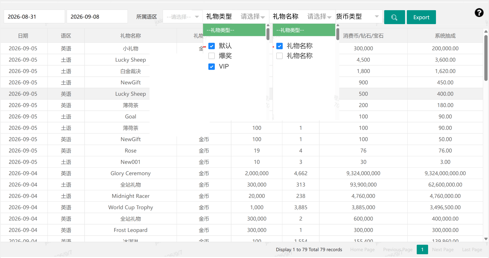

1.0.9礼物查询增加本页合计、查询总计（及祥）

| 功能描述 | 礼物查询增加本页合计、查询总计 |
|---|---|
| 优先级 | 高 |
| 输入/前置条件 |  |
| 需求描述 | 需求路径-数据统计-商品统计-礼物查询需求描述礼物查询页底部增加本页合计、查询总计如图1，实现形式参考“礼物统计”页如图2，显示数据根据具体筛选项变化汇总统计 礼物个数、消费币、系统抽成 货币包含金币与宝石 图1 图2 |
| 输出/后置条件 |  |
| 补充说明 |  |

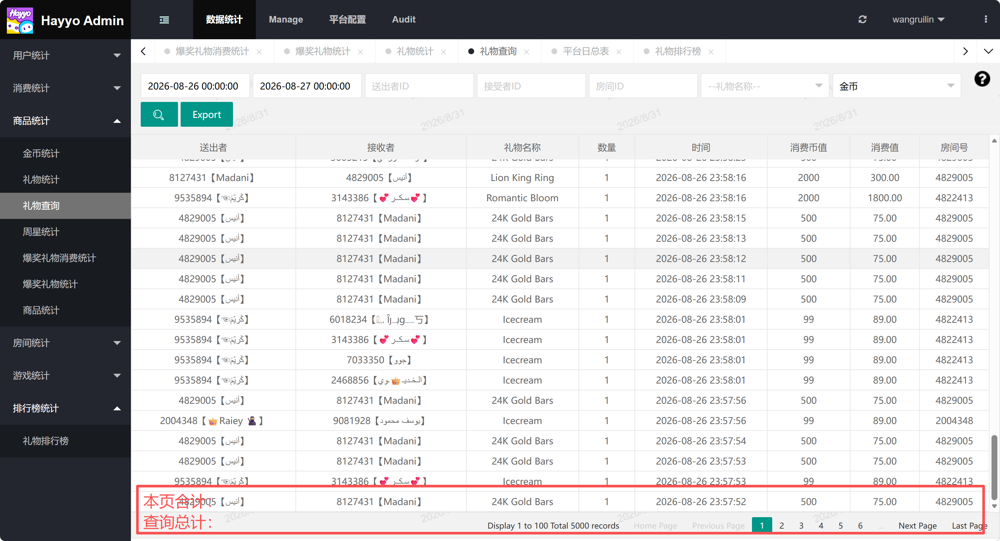

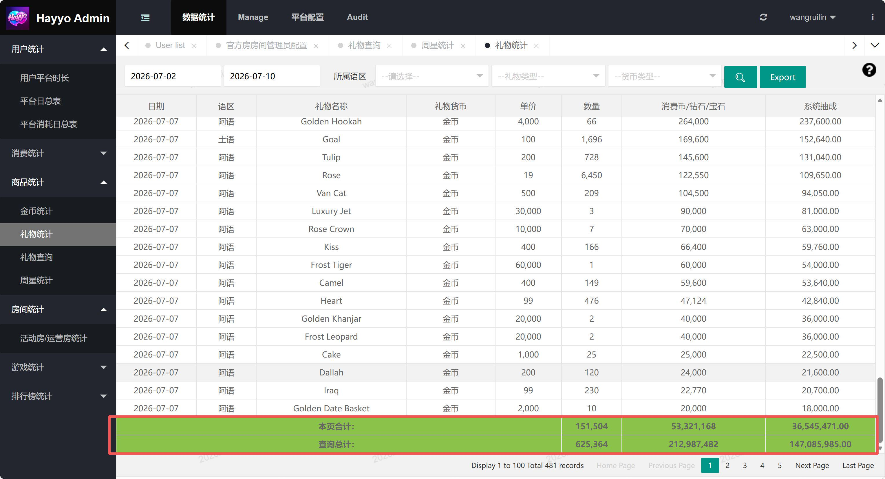

1.1.0后台充值数据统计口径补充以及新增筛选框（及祥）

| 功能描述 | 后台充值数据统计口径补充以及新增筛选框 |
|---|---|
| 优先级 | 中 |
| 输入/前置条件 |  |
| 需求描述 | 需求路径-Manage-Manage User-账号信息需求描述①统计已充值的数据口径需要包含：内购充值、币商充值和代付链接，当前只统计了应用内充值。②新增一个【是否已充值】的筛选条件，默认显示请选择，筛选可选已充值与未充值 |
| 输出/后置条件 |  |
| 补充说明 |  |

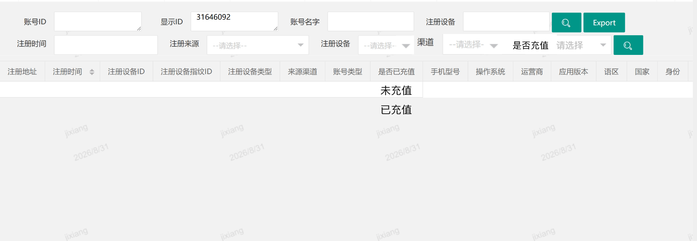

1.1.1 账号信息增加性别字段与个人信息编辑（及祥）

| 功能描述 | 账号信息增加性别字段与个人信息编辑 |
|---|---|
| 优先级 | 中 |
| 输入/前置条件 |  |
| 需求描述 | 需求路径-Manage-Manage User-账号信息需求描述增加用户性别字段，字段内容取前端用户个人主页选择的性别；操作-编辑中增加用户国家与性别的字段以及编辑操作，其中用户国家变更后，对应语区需要一并切换 图1 图2 |
| 输出/后置条件 |  |
| 补充说明 | 相关操作 即时生效 |

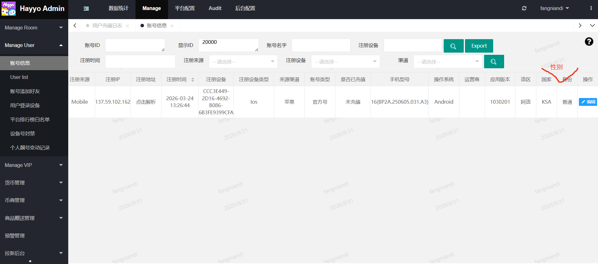

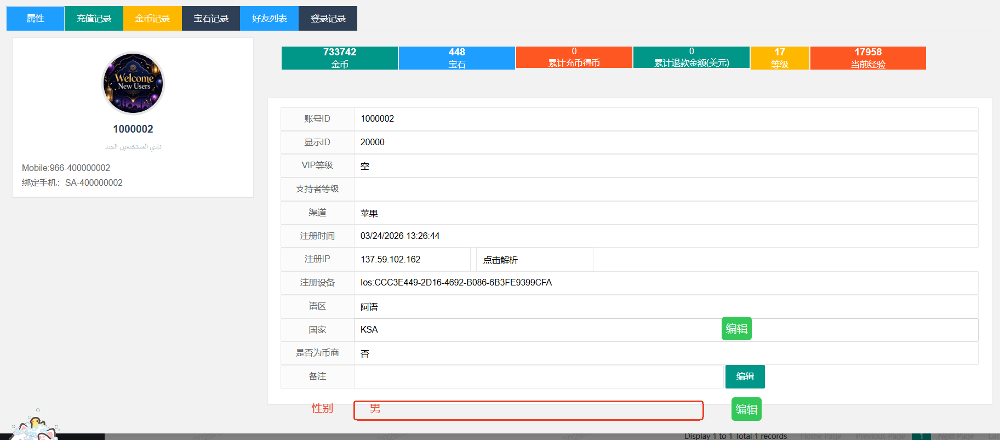

1.1.2 VIP管理增加财富值变动明细（及祥）

| 功能描述 | VIP管理增加财富值变动明细 |
|---|---|
| 优先级 | 中 |
| 输入/前置条件 |  |
| 需求描述 | 需求路径-Manage-Manage VIP-VIP财富值变化需求描述：增加“VIP财富值变化”页面，包含以下字段明细：用户ID：用户XID用户名：用户昵称变动类别：充值增加/后台调整/升级、保级、降级/补单、退款变动积分：增长或减少的VIP财富值VIP积分-前：变动前得财富值VIP积分-后：变动后得财富值时间：积分发生变动的时间点 格式为年月日时分秒查询与筛选字段：支持按照变动时间、用户ID和变动类别进行查询 如下图所示 |
| 输出/后置条件 |  |
| 补充说明 |  |

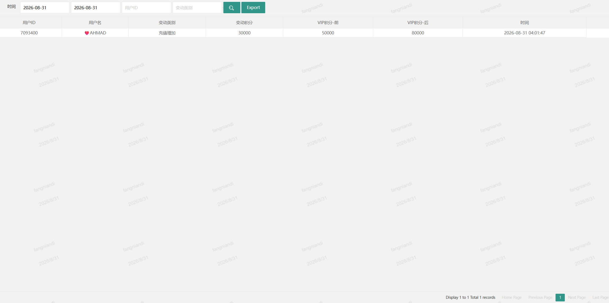

1.1.3 （需客户端参与）活动与Banner支持上传动态SVGA和PAG图片（及祥）

| 功能描述 | Banner支持上传动态SVGA和PAG格式的图片（此功能需要客户端支持） |
|---|---|
| 优先级 | 高 |
| 输入/前置条件 |  |
| 需求描述 | 需求路径-平台配置-Banner列表-Banner图片 如图1 平台配置-活动管理-活动Banner配图 如图2需求描述两个路径的Banner支持上传动态SVGA和PAG格式的图片对应应用内位置为 首页banner图、活动列表图、房间顶部图、房间侧边图 图1 图2 |
| 输出/后置条件 |  |
| 补充说明 | 客户端内需要在首页banner、活动列表、房间顶部、房间侧边、礼物面板活动入口以及后续新增活动位支持新增动画格式得图片显示客户端需求计划在1.5.0版本开发完成 |

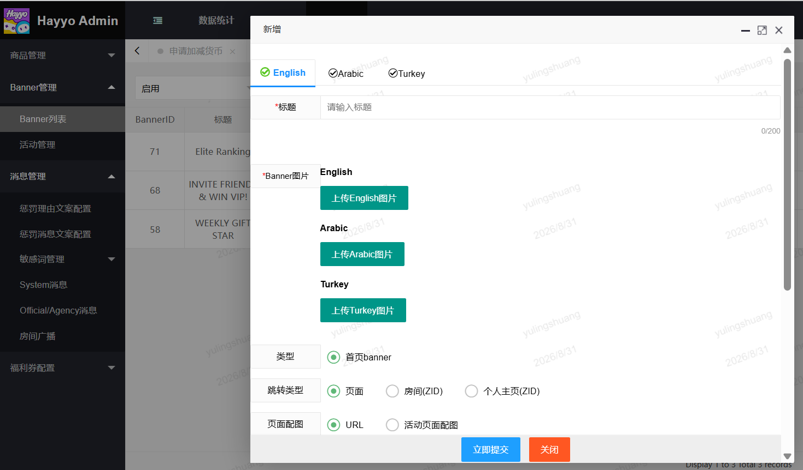

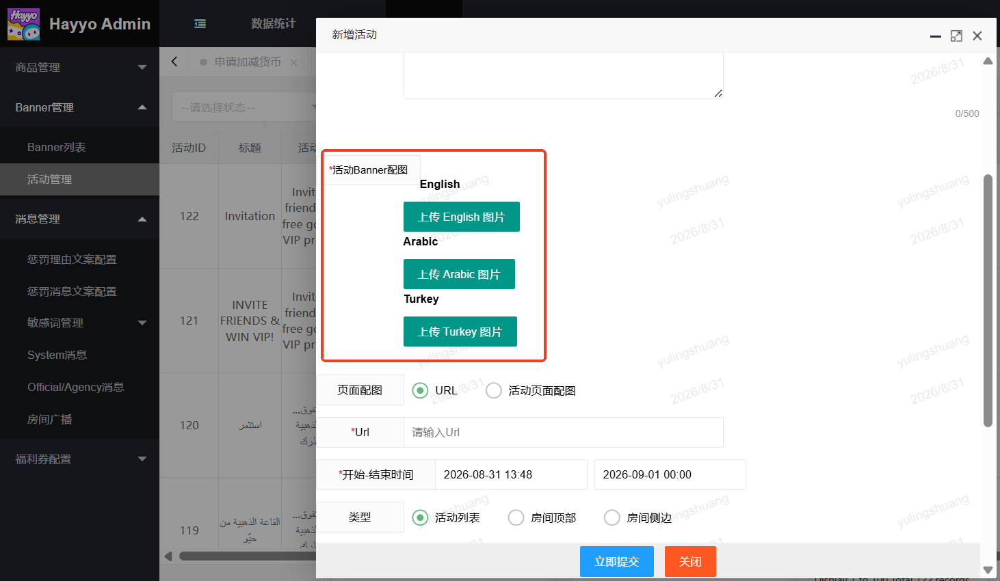

1.1.4发放房间靓号同步下发房间标签（及祥）

| 功能描述 | 后台发放房间靓号同步下发房间标签 |
|---|---|
| 优先级 | 低 |
| 输入/前置条件 |  |
| 需求描述 | 需求路径-Manage-商品赠送管理-靓号赠送需求描述：当赠送靓号类型为“房间靓号”时，同步下发一个对应等级的房间标签道具房间靓号等级与房间标签道具ID对应关系如下靓号等级1、2、3对应房间标签道具ID：10216靓号等级4、5、6、7对应房间标签道具ID：10217靓号等级8对应房间标签道具ID：10218靓号等级99对应房间标签道具ID：10219 |
| 输出/后置条件 |  |
| 补充说明 |  |

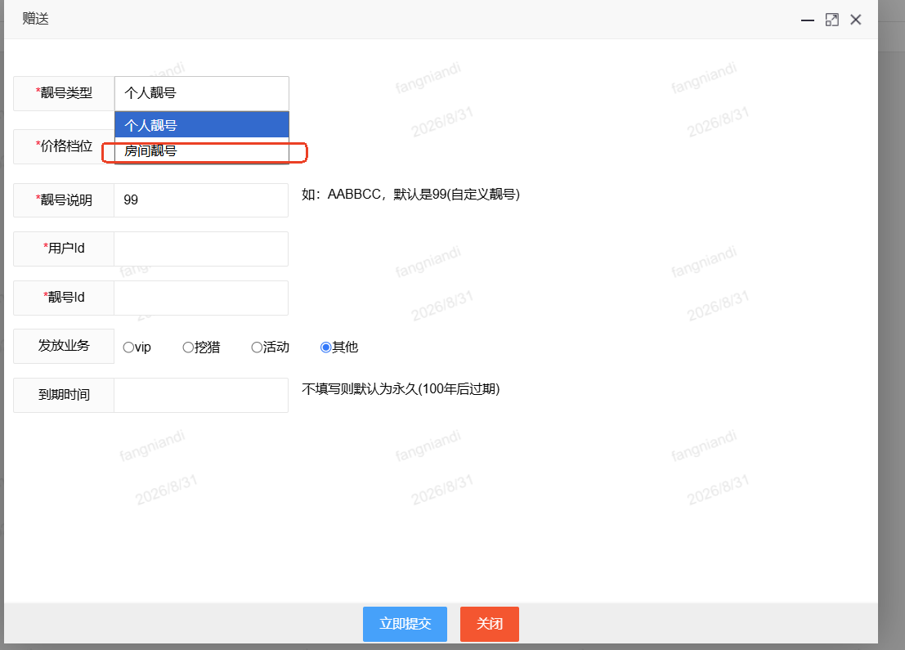

1.1.5VIP体验发放逻辑调整（丛国序）

| 功能描述 | 发放逻辑调整 |
|---|---|
| 优先级 | 高 |
| 输入/前置条件 |  |
| 需求描述 | 原逻辑：发放限制需高于当前VIP等级可以正常发放获得；修改后逻辑：取消发放限制，以后发放体验券不做限制，只要发放，用户就可以获得，但是原来使用逻辑保留； |
| 输出/后置条件 |  |
| 补充说明 |  |
