Hayyo v1.4.0-Payout

产品需求文档

文件标识：

| Hayyo v1.4.0-Payout |  |  |
|---|---|---|
| 文件状态[√]草稿[]修改[]正式发布 | 文件标识： |  |
|  | 当前版本： | V1.0.0 |
|  | 作 者： | 产品部 |
|  | 完成日期： | 2026/7/31 |

修订记录：

| 文档版本 | 修订日期 | 修订内容 | 修订人 |
|---|---|---|---|
| 1.0 | 2026/8/5 | 初稿 | 产品部 |
| 1.1 | 2026/8/7 | 「修改」原固定字段展示，变更为YallaPay动态返回字段「删除」删除原来脱敏规则 | 产品部 |

1.0页面入口

| 功能名称 | 入口 |
|---|---|
| 优先级 | 高 |
| 功能描述 | / |
| 输入/前置条件 | / |
| 交互原型 | 「图1」 「图2」 「图3」 |
| 字段描述 | 业务说明：用户在平台赚积分，然后使用积分通过一定的比例提现法币（法定货币）；影响业务范围：积分管理；拉新奖励结构和发放调整；用户端提现流程+短信验证；管理后台审批流程；Yalla Pay业务耦合；入口当前针对用户：白名单用户入口展示后台功能开启；积分描述作用：当前只用来兑换法币，后续会开放兑换金币和道具等；金币和法币兑换比例：后台可以配置，当前只做积分和美金汇率；默认：200000（积分）=1（美金）；用户正常：正整数，显示“我的积分”；如果用户出现欠款状态，则展示出现负数，显示“积分欠款”；展示详细数字，最大16位，超过16位，9后面展示“+” |
| 需求描述 | 「图1」「图2」:团长位新增两个入口，一个是主页，一个是奖励记录页；「图1」手势滑动时收起入口，悬停展示入口是否展示通过两个判断：后台有开关；判断身份，如果身份消失，则不再展示；两者同时满足展示，不满足不展示；页面停留点击判断：不足展示“功能维护中，暂不对外开放”，然后刷新页面；点击问号：弹出积分说明弹窗；拉新奖优化：后台原支持针对bd发放普通金币，B商发放B商B；现在需要支持在活动周期配置积分发放， |
| 补充说明 | 业务流程简述：业务流程图：安全性说明：如果用户在应用外打开页面，则提示回到应用内打开，复用页面 |

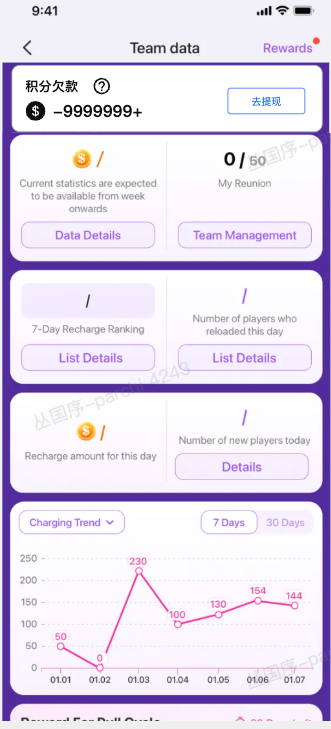

2.0收益页 – 积分模块

| 功能名称 | 积分模块 |
|---|---|
| 优先级 | 高 |
| 功能描述 | / |
| 输入/前置条件 | / |
| 交互原型 | 「图1」 「图2」 「图3」 「图4」 「图5」 |
| 字段描述 | 展示用户当前积分，如果为0和正数那么显示“我的积分”，如果欠款为负数显示“积分欠款”；展示最大16位，超过9后面显示“+”；本月收益：当前自然月的收益，支持负数；累计收益：累计获得的积分，支持负数；三个单位的积分刷新频率：能快最好，操作后刷新，进出页面刷新，下拉刷新；后台行为扣除积分：按照当前时间点计算，扣除当前，扣除本月，扣除累计； |
| 需求描述 | 点击问号弹出说明弹窗「图3」；点击积分记录，进入积分详情页面「图5」；默认展示近60天按照时间倒序排列的全部订单，时间相同，订单id倒序，如果需要分页，50条，支持上滑加载，下拉刷新；积分详情页面为积分获取的记录，按照时间倒序排列；积分订单：积分属性之一，可以复制，点击toast提示“已复制”，订单ID规则：HABBY+yymmdd（日期）+加密6位；积分数量：积分订单的积分变动详情，使用和消费按照负数显示，获得按照正数显示；积分时间：积分变动时间日月年，时分秒（GMT+3）；扣除行为描述：后台扣除时，选择的描述，需要在页面展示（非必须）；订单状态：拉新奖励：拉新业务结算后给到；提现使用：提现订单正常生成后扣除；提现失败返还：订单被驳回后返还；平台奖励：管理后台给用户增加的订单；平台扣除：管理后台对订单操作扣除或直接扣除时展示；订单状态有横向tab和icon点击后支持下下拉筛选联动，点击后只展示积分对应的订单状态；订单列表空状态「图6」 |
| 补充说明 | / |

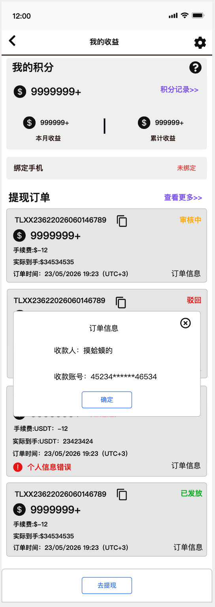

3.0收益页 - 提现绑定和设置修改

| 功能名称 | 提现和绑定设置 |
|---|---|
| 优先级 | 高 |
| 功能描述 | / |
| 输入/前置条件 | / |
| 交互原型 | 「图1」 「图2」 |
| 字段描述 | 用户提现业务有相关限制：只有绑定手机的用户可以进行提现，因为提现流程中需要做短信验证；绑定和改绑手机流程使用平台内已开发完成的业务； |
| 需求描述 | 当用户没有绑定手机时候，用户有三个入口进行绑定；主页展示未绑定，在积分模块下方，并展示未绑定状态；主页面右上角的设置，点击进入“手机绑定”，并展示未绑定状态主页点击底部“去提现”，进行判断；所有的入口在用户未绑定下，都统一都会收束到提示弹窗「图1」；点击弹窗按钮，跳转回app的手机版定页面；当用户已经绑定手机主页不再展示；设置页的“手机绑定”展示“已绑定”；去提现按钮正常进入提现申请流程； |
| 补充说明 |  |

4.0收益页 – 提现订单

| 功能名称 | 提现订单 |
|---|---|
| 优先级 | 高 |
| 功能描述 | / |
| 输入/前置条件 | / |
| 交互原型 | 「图1」 「图2」 「图3」 「图4」 |
| 字段描述 | 主页面为整页滑动；主页提现订单列表：默认展示近60天按照时间倒序排列的全部订单，时间相同，订单id倒序，如果需要分页，50条，支持上滑加载，下拉刷新；提现相关记录，按照订单时间倒序排列；提现订单：订单属性之一，可以复制，点击toast提示“已复制”，订单ID规则：TLXX+yymmdd（日期）+加密6位；提现消耗积分数量：这里只有正整数，也就是说提现的数量展示，不是积分记录那种有增状态；订单时间：积分变动时间日月年，时分秒（GMT+3）；订单驳回行为描述：订单驳回，选择的描述，需要在页面展示（非必须）；如果订单驳回积分返还，则显示（已返还，如果是扣除显示已扣除）；手续费：根据四方/三方（YallaPay）给到的手续费比例显示，实际扣除提现法币的金额，展示对应货币单位（如果有）；实际到手：实际提现的法币金额，展示对应货币单位（如果有）；订单信息：点击后弹出提现用户的订单信息「图1」；提款人信息，真实名称收款账号：账号脱敏展示，中间“*”； 大于8个统一采用“前4位＋后4位”的方式展示，小于等于8位的统一采用“前2位＋后2位”的方式展示；小于等于4位的统一采用全“*“的方式展示；收款账号：如果是银行类型提款，展示的是Acount number，如果是手机号，则展示手机号，展示名称也分别按照Acount number/手机号展示（8月6日）10.1 由于YallaPay关于用户提款资料信息展示为动态存储，因此当前版本，仅根据实际返回字段展示（8月19日修改）订单状态：审核中：递交成功后，发放成功或驳回之前统一展示；已经发放：根据YP提供的订单状态修改；驳回：订单驳回只有通过本本平台后台操作结果显示，关联业务存在驳回后直接扣除本单全部积分，也存在不扣除只驳回订单并返还积分；主页订单空状态：不满足条件展示空状态「图2」，不展示查看更多；点击查看更多进入订单列表状态，「图3」；订单详情页：订单信息和展示规则和主页订单列表展示信息相同，不过支持订单状态筛选，筛选后排序规则也是按照时间倒序排列，时间相同，订单id倒序，支持手势加载刷新，果需要分页，50条，支持上滑加载，下拉刷新；订单详情页空：「图6」，理论上不会进来，除非长期停留； |
| 需求描述 | 统一说明1. 货币单位统一保留小数点后两位； |
| 补充说明 |  |

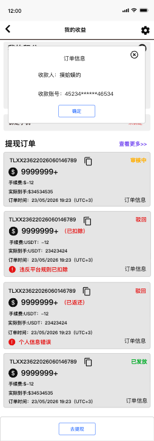

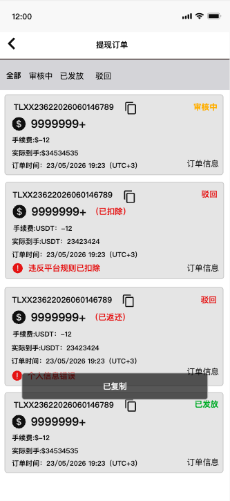

5.0提现流程-提现发起

| 功能名称 | 提现发起 |
|---|---|
| 优先级 | 高 |
| 功能描述 | / |
| 输入/前置条件 | / |
| 交互原型 | 「图1」 |
| 字段描述 | 提现条件，点击判断，也是按下方描述顺序逻辑判断：平台正常开启提现功能，后台控制，如平台功能关闭，提示维护；账号提现功能正常，后台控制；首先用户需要拥有获得积分权限，可以后台添加和自动开通；积分权限不会作为提现判断标准，只有提现功能开关才会判断；自动开通：当前版本只有两种类型团长在得到发放奖励的情况下会自动获得，如果之前团长没有积分账户，在获得奖励的时候会自动开通积分账号，并且获得积分；支持后台手动添加，与2.2同功能进行管理，如果后台手动添加用户当前身份不是团长，只没有提现入口，但是后台调整积分是不影响的；如果提现功能关闭，则提示“提现功能异常，请联系客服”，点击确定，跳转消息区中的office部分；返回即返回此页面；积分不为负；负数提示toast；已绑定手机，提示绑定手机弹窗；如果加上本订单，用户提现，达到后台配置上线（美金为单位），则弹出弹窗提示，用累计判断，如果后台放大了则累计判断是否达标，缩小同理；上限计算标准：审核中+成功+即将申请的本订单，需要小于等于配置金额可以提现；如果都正常，则进入提现流程； |
| 需求描述 |  |
| 补充说明 |  |

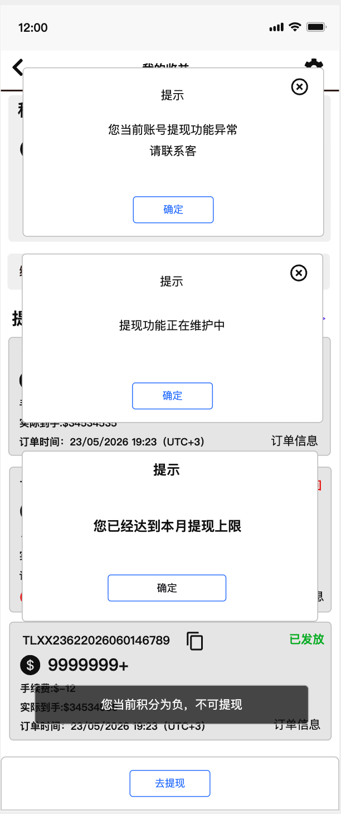

6.0提现流程 – 提现申请

| 功能名称 | 提现申请 |
|---|---|
| 优先级 | 高 |
| 功能描述 | / |
| 输入/前置条件 | / |
| 交互原型 | 「图1」 「图2」 「图3」 「图4」 「图5」 「图6」 「图7」 「图8」 「图9」 「图10」 |
| 字段描述 | 可提现积分模块页面入口拦截了负数和用户，因此进来能看到的就是0和正整数；最多展示16位，超过9后+；进入页面后会获取到YP给到的汇率等信息；手续费、实际到账，为对方给到，当用户选了收款方式，配合用户勾选要提现的金额，则能得到相关的手续费和实际到账；收款货币，对方给到，当前版本只有埃及，我们需要先传给他们该用户的首选货币，才能用（后台给用户开权限的时候会设置）；收款方式，对方给到，大类型分银行提现，和钱包收款，但是钱包会有很多类型，所以也就是银行+一堆钱包名称，现在对方优先会给到钱包中“沃达丰”转账；收款银行、收款人（银行和手机收款都需要，8月6日新增）、ibank、swift：我们上报，对方验证；收款账号acount（随yp需求新增，8月6日）手机号：收款方式为钱包的时候，显示这个手机号，对方验证如果之前用户没有提现，我们会把用户的首选收款货币提供给YP；如果用户之前提现成功过，那么统一按上次提现过的信息打包给YP显示（帮助用户默认选择上次提现的所有信息）；我们只积分和美金的比例，由后台配置，默认20w积分=1美金；可提现积分模块选择：排序和数值均为后台配置，最多9个，排序按照从左到右从上到下；如果用户的积分有满足下方选项，那么我们帮助用户选择可用的最低的提现金额；如果用户积分为0，或低于最低档位，则不做选择，点击toast提示“您当前积分不够”；在未获得YP给到相关信息的时候，只展示积分，无勾选状态和对应收款货币展示（网络问题也是如此）；点击有选中状态，再次点击取消（选中状态和货币单位无关）；当获得YP选项给到汇率信息时候（汇率+收款货币，货币我们已经默认给过去了），才会展示对应积分以及所换货币的兑换比例，金额保留2个小数点，超过截断；业务平台只维护积分和美金之间的汇率，美金和其他货币的汇率由YP来维护，在提现页面，我们会拿到YP给的美金和其他货币之间的汇率，因此只有在SDK选择对应的地区渠道货币后，才会展示积分对应的货币和对应的金额；举例：YP会给我们的美金和各个货币的汇率，再展示当下积分所代表所选的货币金额；同理，对应的手续费比例，和最终实际到账金额也为YP来维护，在拿到结果前，我们不显示（用户选了金额+货币单位+收款方式）；如果YP有回传单笔提现限制，那么对应的超过的档位灰不可点击；积分模块会有一个首次低门槛提现；意思是首次可以降低提现门槛，例如当正常档位是60w积分提现，但是用户首次可以用20w提现，只是降低门槛，不是发钱；一个用户终生只有一次，根据是否有提现订单判断，审核中、已提现成功算，如果变成驳回，那么会返还；低门槛可能存在多个，都为后台配置，而且是替换制，也就是每一个档位只可以绑定一个首提；在用户满足条件，切对应原档位开启，且开启了对应档位的首提，那么用户就会看见对应的首提；比如A没有提现成功过，且没有正在进行的订单，后台开启了对应档位使用，并且开启了关联的首次，那么永辉就会看到这个配置项的首次；提现信息（YP的SDK）收款货币、收款方式、银行、钱包、信息：当前为YP提供SDK，由YP维护；选择类型均为点击进入半弹窗，点击进入选择；信息之间涉及到关联，因此再上层信息选择确认前不可点击下一层，具体交互根据三方给到；收款人、Ibank、swift、手机号输入：也为YP封装SDK；为输入框，点击后激活，输入框和键盘；如果输入框太靠下，页面会被推上去给键盘流出空间，并且保证输入框内容可见，如「图6、7」；平台记录用户最后一次递交信息（收款货币、收款方式、银行、钱包收款人、Ibank、swift、手机号、Acount Number（8月6日新增）等递交YP的信息）点击去提现按钮，进入二次确认状态；当用户在一次提现的时候，默认填写上一次递交的信息（可用）；如果下次进入发现之前的配置已经不可用，或信息产生变更，那么恢复首次进入显示；点击提现按钮，当输入的信息不全时，是不可以点击的，置灰显示；点击时至少也要和平台内校验：积分和美金比例是否变化；真实的体现档位是否变化，比如递交订单前，后台取消该档位或取消首单或积分数量变更；这个订单当前的美金和提现汇率是否和YP维护的相同；上述两个如果产生变化则toast提示：“提现档位已经产生变化请重新选择“；应该也会和YP校验，根据YP返回信息给到相关提示； |
| 需求描述 | 提现信息和积分选择之间的交互：YP会提供每一个渠道相关的最高/最低提现的金额限制，这会回传给我们，如果用户没选中积分的状态，先看提现方式（银行或钱包），那么会根据判断条件，置灰低于或高于的档位，不可选中；当用户先选择积分，然后再选择货币，SDK会支持显示满足条件的渠道银行等信息；YP会给我们美金和所需提币的汇率，由我们来展示在选择提现按钮，并且回传给对方用户提现对应币的金额；重要说明：用户所有提现订单信息，平台都要做信息保存；点击去提现都要去做二次验证：用户端递交的信息是否和当前配置相同；三方的汇率是否变更，地区，渠道，货币是否可用；首提档位、可用性、是否产生变更；积分和美金比例；如产生变更，toast提示“相关信息已经变更，请重新审查资料”，然后按照当前配置刷新页面，但是保留未变化信息；如果积分选项已不可用，则恢未选择状态；后台有提现货币限制问题，也就是提其他货币的开关，如果这个用户不允许提其他货币，那么不展示首选货币外的其他货币； |
| 补充说明 | 提现流程分三个环节：信息申请；信息二次确认；安全验证（验证码）；YPSDK链接【WPS Docs】 【PRD】YallaPay v1.4.1聚合支付网站需求文档https://365.kdocs.cn/l/cgwfR0VwSofl |

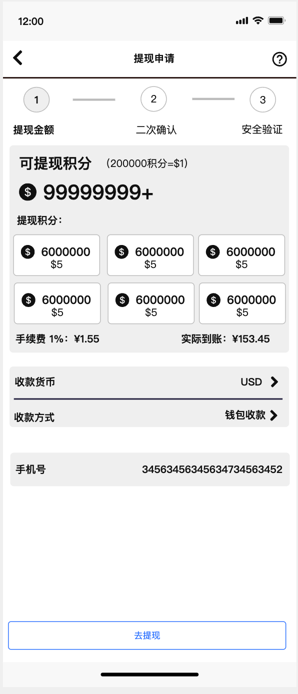

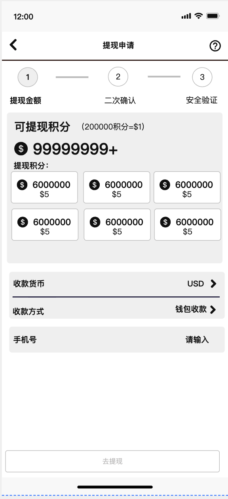

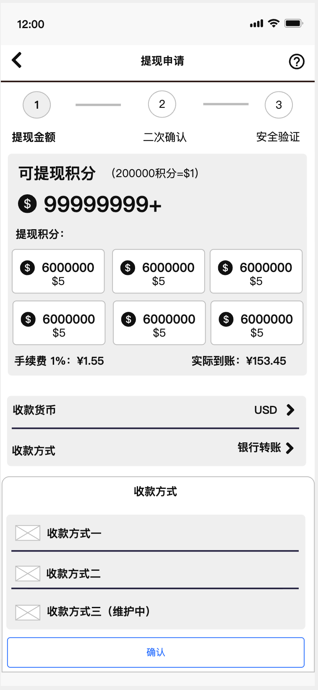

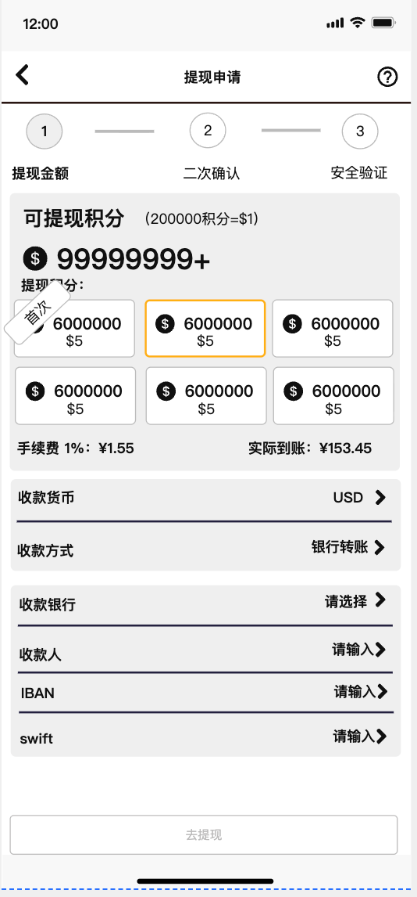

7.0提现流程 – 确认信息

| 功能名称 | 二次确认 |
|---|---|
| 优先级 | 高 |
| 功能描述 | / |
| 输入/前置条件 | / |
| 交互原型 | 「图1」 |
| 字段描述 | 展示当前提现进度，页面负责信息的展示；展示当前实际所提的法币的金额（非到账金额）；下方展示本次需要消费的积分；以及本次手续费：提现货币金额，手续费比例；实际到账金额：提现金额-手续费；收款货币、收款方式、收款银行、收款人、Ibank、Swift、或手机号，Acount Number（8月6日新增）；确认后进入安全验证流程；果是填写内容错误有红字提示，如果递交因为账号本身问题比如金额不足等，用通用提示弹窗通知用户； |
| 需求描述 |  |
| 补充说明 |  |

8.0提现流程 – 安全验证

| 功能名称 | 安全验证 |
|---|---|
| 优先级 | 高 |
| 功能描述 | / |
| 输入/前置条件 | / |
| 交互原型 | 「图1」 「图2」 |
| 字段描述 | 展示流程：安全验证，通过手机验证码进行验证；“账户安全验证，为保障您的资金安全，请完成验证”为固定文案并配图“安全”；展示本次提现的对应货币金额；当前注册的手机号码（不脱敏）；短信验证码，6位：【平台名称】您正在申请积分提现，验证码为：{{code}}，{{expire_minutes}}分钟内有效。请勿向任何人泄露验证码；如非本人操作，请忽略本短信；重新获取验证码：点击后根据限制条件判断，如果可以则可以重新获取验证码；收不到验证码：点击打开的是换绑手机页面的那个“收不到验证码”的说明页（没有跳转回登录的页面）； |
| 需求描述 | 进入到页面后，自动发送短信验证码；在满足条件情况下，且网络正常，验证码已正常发送则toast提示“验证码已发送～”；同时验证码再次获取时间进入60s倒计时（不可点击），每一分钟仅可发送一次；再次获取验证码则原验证码自动失效；如果获取的验证码达到每日获取上限，则「弹窗」提示“很抱歉，您当日获取验证码的次数已达上限，请明日再试”；需要记录当前获取的手机号，如果用户在获取验证码后60s内用同一个手机号进入验证码输入页面，则继续倒计时（应该没有用户提了之后在60s内改了绑定手机再回来再继续发起提现申请的人吧）；点击验证码输入框，并唤起数字键盘；收不到验证码：点击后跳转到“收不到验证码说明页”（已有复用）；正常输入验证码，输入后和输入前有样式的区分，最好可以支持智能填写；当没有验证码和不全时候，确认验证按钮不可点击，全部输入后可点击进行验证；验证码输入错误：-如果验证码超时或者失效显示样式；-验证码失效和验证码输入错误的提示；（失效规则参考补充说明）； |
| 补充说明 | 验证码相关规则整理：位数格式规则6数字（00000-999999）验证码有效期：10分钟后失效。获取新验证码后旧验证码自动失效。次数规则：同一设备和账号一个自然日最多可发起10次验证码。（都需要满足小于等于10）一分钟内只能发送1次。单个验证码使用1次后失效。验证码文案：【Hayyo】验证码为123456，10分钟内有效，请尽快完成验证。若非本人操作，请忽略此消息。（尽量保证一条信息内，如翻译文案过多可删减） |

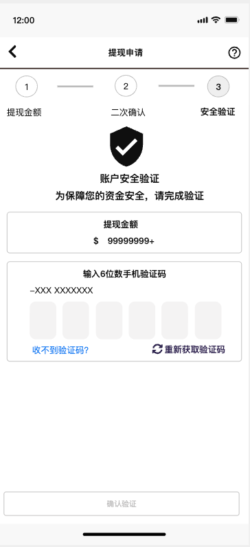

9.0提现流程 – 申请递交成功和说页面

| 功能名称 | 申请递交成功和说明页 |
|---|---|
| 优先级 | 高 |
| 功能描述 | / |
| 输入/前置条件 | / |
| 交互原型 | 「图1」 「图2」 |
| 字段描述 | 递交成功后就展示相关页面「图1」；流程展示只展示用，固定样式；展示提货币数量，手续费比例和数量，实际到账数量；预计到账时间：如果有银行字段存在，那么展示图左，如果是手机号字段，那么展示图右，如果都没有，那么默认展示长的；展示货币、收款方式、银行、收款人、Ibank、Swift、手机号，Acount Number（8月6日新增）；展示收款人、收款账号；展示本订单号，支持点击按钮复制，toast提示“已复制”；展示订单时间：递交成功的GMT+3的时间；日月年，小时/分钟；查看订单，跳转回提现订单列表；再次提现：按钮和提现主页的“去提现”功能相同，需要验证一次流程；说明弹窗：在提现申请路径上的问号点击弹出的弹窗； |
| 需求描述 | / |
| 补充说明 | / |

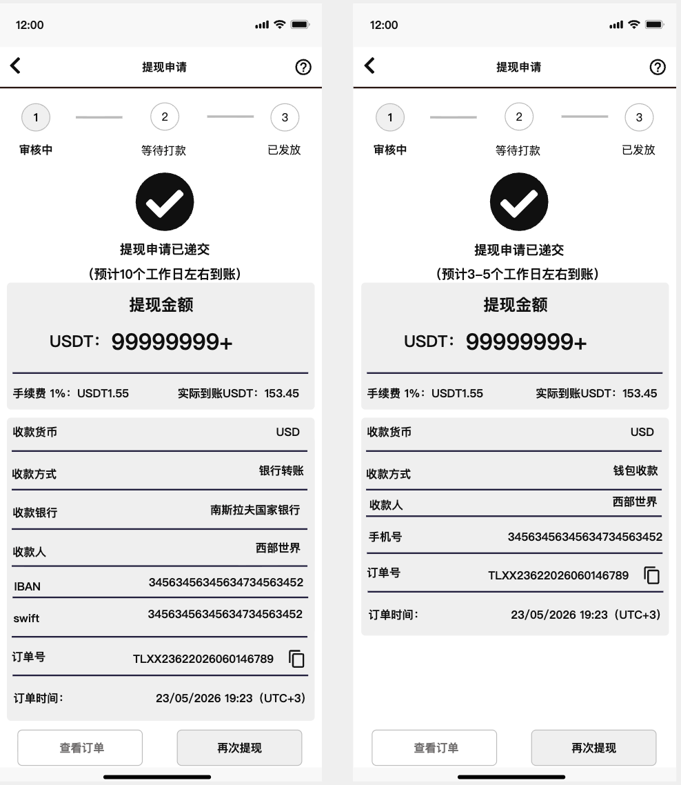

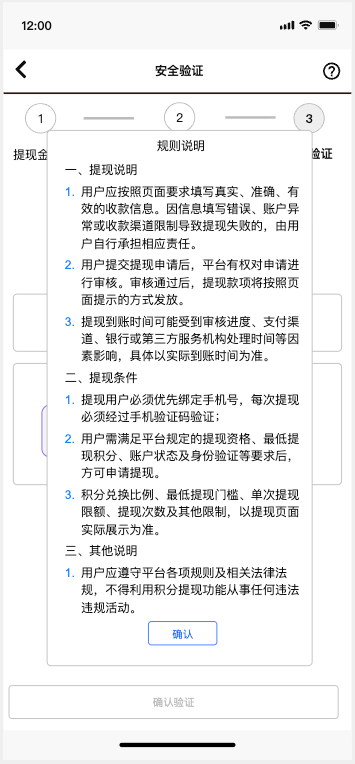

10.0提现管理后台 – 订单审批

| 功能名称 |  |
|---|---|
| 优先级 | 高 |
| 功能描述 | / |
| 输入/前置条件 | / |
| 交互原型 | 「图1」 「图2」 「图3」「图4」「图5」「图6」「图7」 |
| 字段描述 | 页面信息：默认展示全部订单“审核中”的，然后按照时间倒序排列，分页；其余条件支持日期（区间），订单状态，用户xid、订单号联合查询；支持csv导出，按照时间，选择日期，单次1000条最多（不包含图片），导出信息和列表相同即可；平台默认二层审批，和一个订单外部驳回后的复审；每一级完成后，进入到下一级，批完后不可撤回；二审完成后，则可以进行手动操作，点击自动截图保存我们自己的服务器，然后上传三方；自动截图为：审批记录的最终审核、用户的积分变动记录截图、平台审流程弹窗的截图（不需要按钮）；如果订单从YP被驳回，回到平台需要返回平台再次复审处理；复审只有一个层级，操作同其他相同；「图1」:列表信息订单时间：订单生成的时间（递交成功的时间）；订单ID：提现订单的ID消费积分：本次订单，所消耗的积分；XID，昵称：对应用户的XID和昵称；收款方式：钱包或银行卡转账；国家：提现货币国家汇算美金：积分所对应的美金；美金汇率：这个订单，1美金兑多少当地货币；实际货币和金额：实际提的对应货币的金额手续费：本订单的手续费金额和比例；实际动手的金额：扣掉手续费的金额；订单审核状态：用户看到的订单状态：平台流程显示：平台内的审核流程；Yalla pay状态：YP对这个订单的状态；操作：平台内的操作和记录显示，截图：只有当订单全部完成后可以截图，用于递交给YP；操作，平台内的流程操作；递交时判断我们的订单和截图都有的情况下，才可以正常递交否否则弹窗提示“请完成平台信息补充”；审核记录：只展示平台内的审核记录；以及订单详情「图7」；上传：平台审批完成，且平台截图完成，方可上传；平台未完成和已经递交YP、订单在平台完结，不再展示上传按钮；「图2、3」审批环节配置页面右上角点击，弹出弹窗；展示固定二级和复审层级，和复审层级；点击添加弹出图3右侧，显示对应层级和选择的后台用户；确认后添加成功；点击删除暂时「图3」左，可以从已经加入的用户中删除，保存后成功；「图4」平台审批操作按照对应流程，相关角色可以在操作中点击进行审批，相同层级多人同时操作按照先递交的为准；审批展示当前订单所在流程；展示信息和列表相同，但是要展示账号类型：所在团长身份+固定文案（白名单用户）审批弹窗又审批通过和驳回选项（点击关闭为不审批）；点击通过弹出二次确认弹窗；点击驳回也有二次确认弹窗，理由为下拉选（理由有独立配置页，选中文，但是给用户展为对应用户语言文案）；驳回支持一次扣除订单积分，单选，部分扣除不支持；二次确认确认后，进入下级流程，如果流程人为空则自动确认；三个流程确认后，本平台审批完成，可以进行截图；截图凭证截图，支持自动截图（场景上面有描述，不知的可以具体开发过程中确认即可）；也支持自动截图后，删除单张（点击右上角X直接删除），手动上传；截图不保存本地，目的为了可以直接给YP；截图和审批都完成后，可以点击递交，然后弹出「图6」，统一递交给YP；重新审核通常为YP方拒绝了本订单，订单发回平台，状态变更为复审；复审和审核相同，支持增加独立的流程、状态、记录；操作记录默认根据流程展示，如果有复审那么会额外展示复审；审核记录会在对应流程下展示操作的人，点所在流程会展示审批结果、操作人、审批确认的时间； |
| 需求描述 | 订单审核信息银行提现钱包提现订单ID：订单时间：账号类型：账号昵称：账号XID：收款方式：收款银行收款人：Acount Number（8月6日新增）IBANK:SWIFT:国家：汇算美金：提取金额：手续费：实际到账：实时汇率：订单ID：订单时间：账号类型：账号昵称：账号XID：收款方式：收款人（8月6日新增）收款手机：国家：汇算美金：提取金额：手续费：实际到账：实时汇率： |
| 补充说明 | 订单和相关的显示状态用户订单平台流程Yallapay操作凭证截图上传操作审核中一审/一审//审核中二审/二审//审核中平台审核完成等待递交Yallapay递交点击自动截图截图后可以删除重新上传上传驳回平台驳回/审核记录//驳回（没收）平台驳回/审核记录//审核中审核完成Yallapay审批中审核记录图/审核中审核完成等待打款审核记录图/审核中打款中打款中打款中图/审核中驳回，平台复审Yallapay驳回复审点击自动截图截图后可以删除重新上传上传审核中平台复审完成/递交点击自动截图截图后可以删除重新上传上传审核中驳回，平台复审Yallapay终止复审点击自动截图截图后可以删除重新上传上传已打款已打款已打款审核记录图/审核流程图配置页面：下面的功能，全部归属新增大标签；平台配置中新增大标签“积分与提现” |

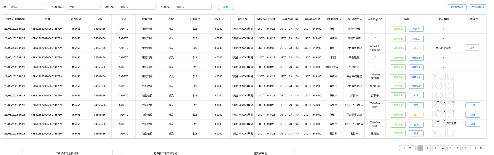

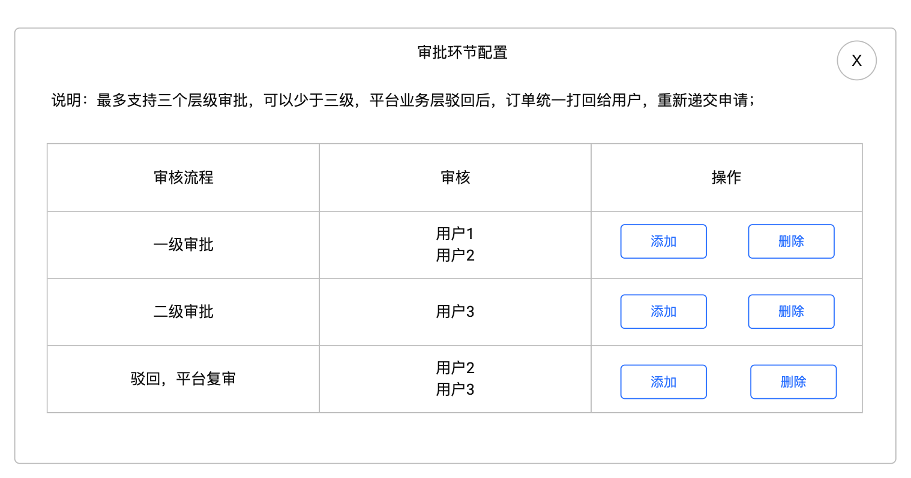

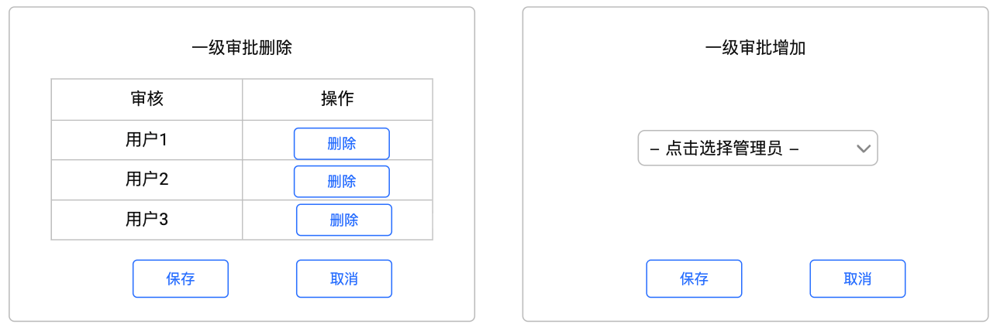

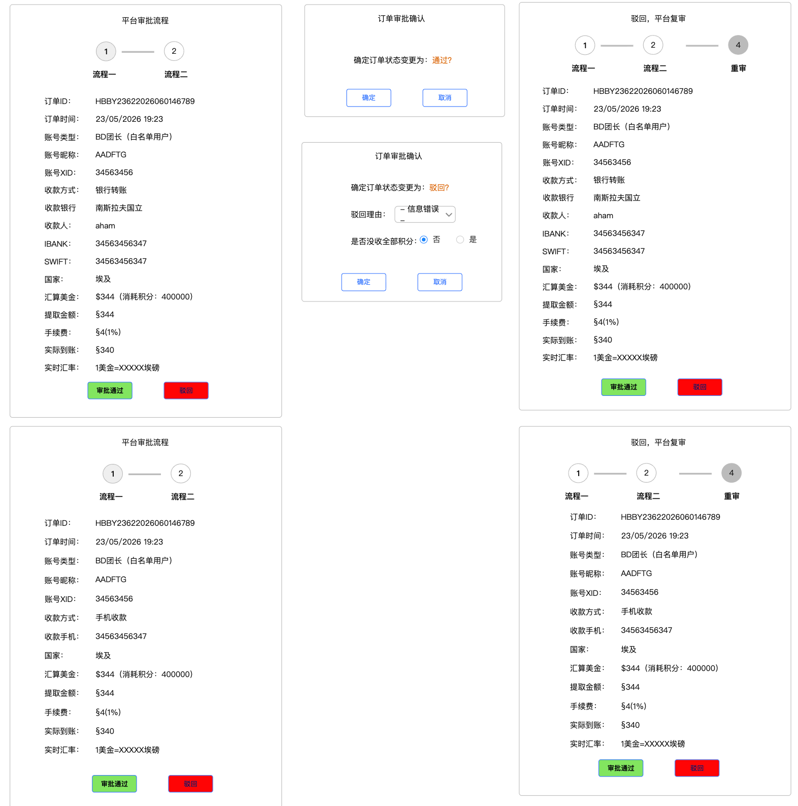

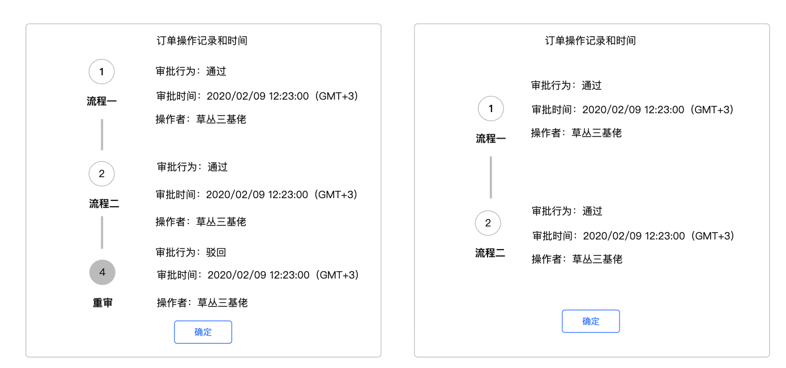

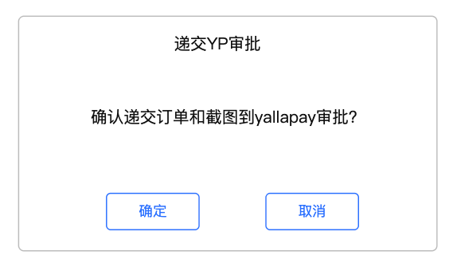

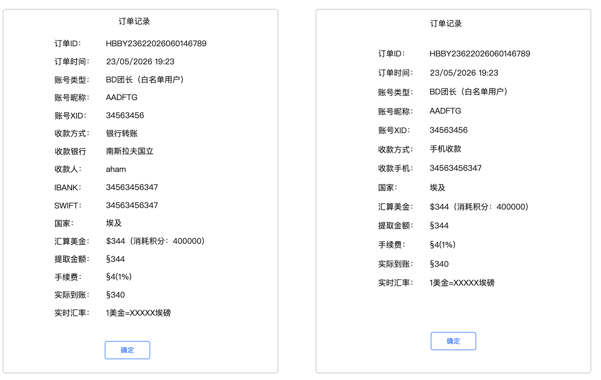

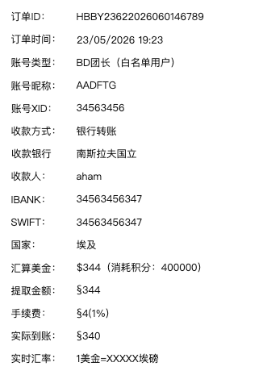

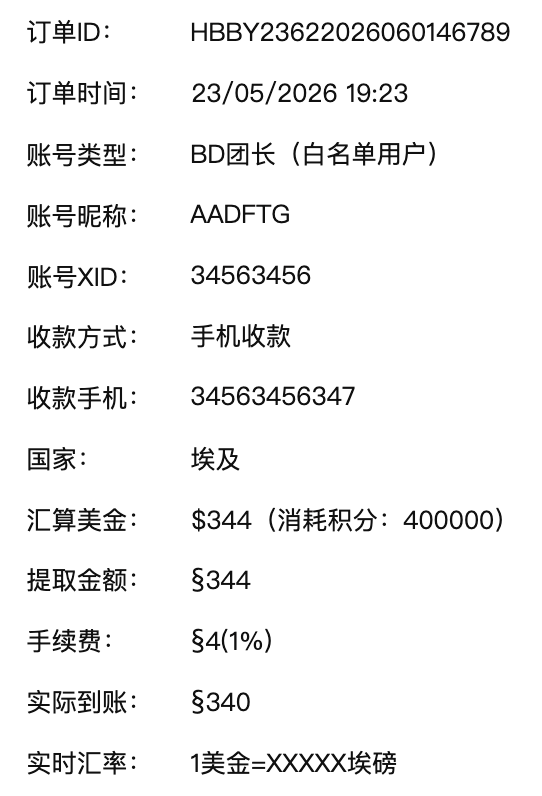

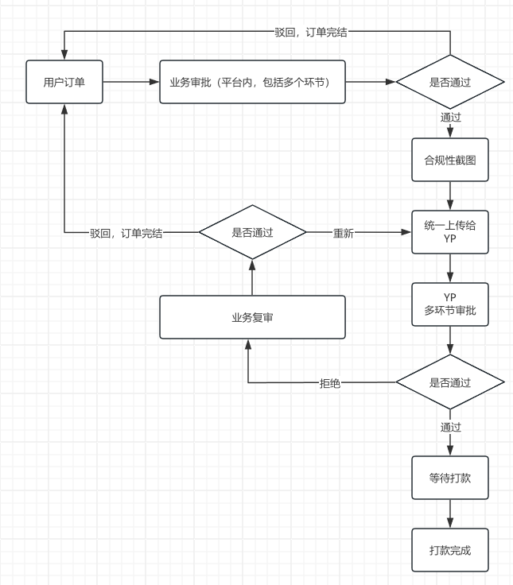

11.0提现管理后台 – 话术理由配置

| 功能名称 | 话术理由配置 |
|---|---|
| 优先级 | 高 |
| 功能描述 | / |
| 输入/前置条件 | / |
| 交互原型 | 「图1」 「图2」 |
| 字段描述 | 支持：四种语言展示，中文只用作选择；点击新增弹出「图2」，保存即新增；点击删除二次确认后删除；新增积分，扣除积分或驳回订单等，都会从这里选； |
| 需求描述 |  |
| 补充说明 |  |

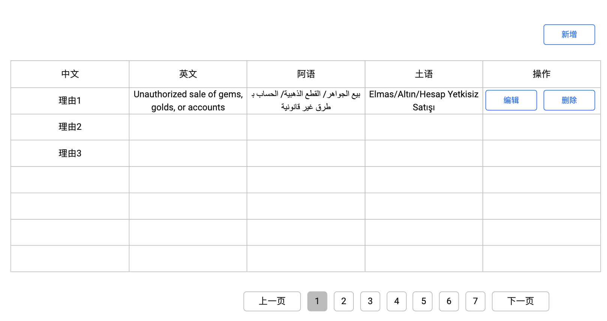

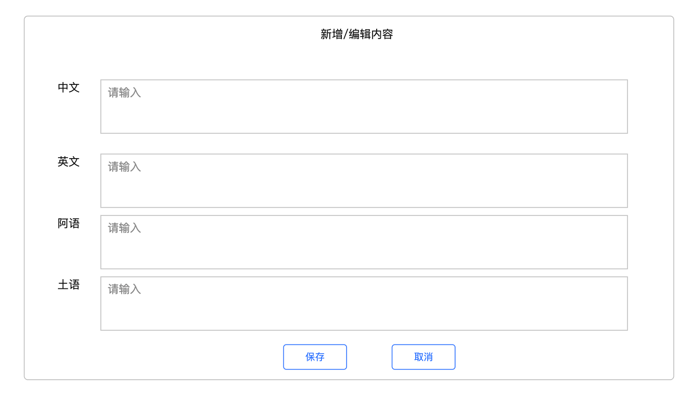

12.0提现管理后台 – 积分和提现配置管理

| 功能名称 | 积分和提现配置管理 |
|---|---|
| 优先级 | 高 |
| 功能描述 | / |
| 输入/前置条件 | / |
| 交互原型 | 「图1」「图2」「图3」「图4」「图5」 |
| 字段描述 | 积分和美金的换算：默认20w积分=1美金，支持后台修改；提现入口：按身份去处理相关业务，默认隐藏；提现功能开关：按身份去处理相关业务，默认隐藏；提现每月每个用户提现申请限制：0和正整数，最大999999； |
| 需求描述 |  |
| 补充说明 |  |

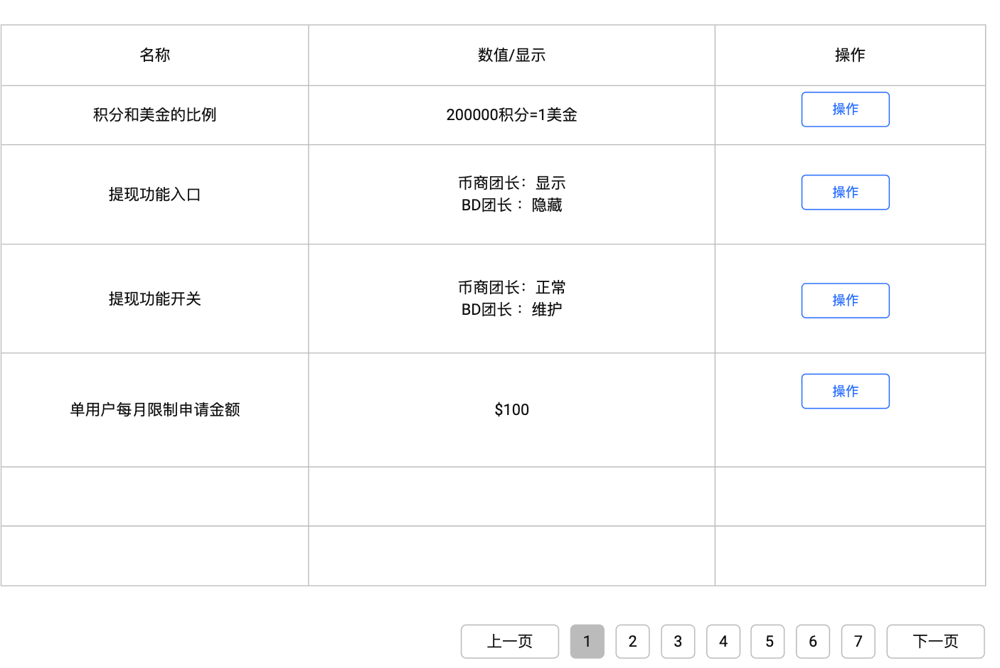

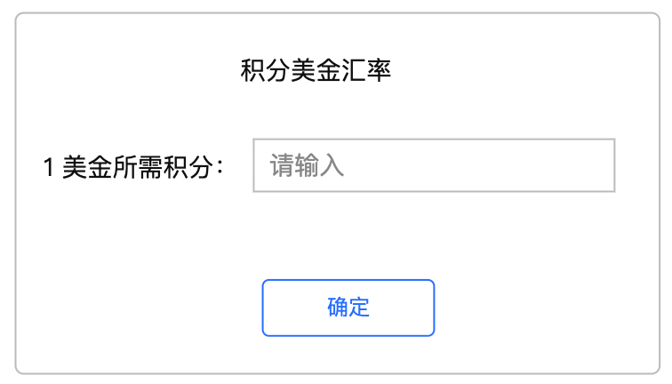

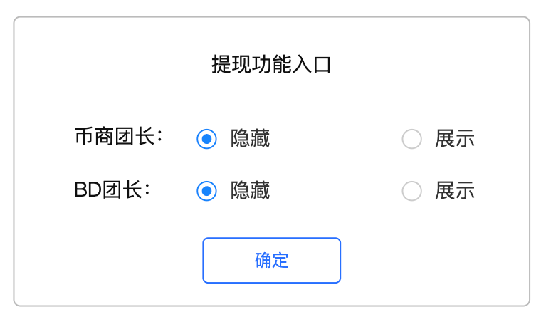

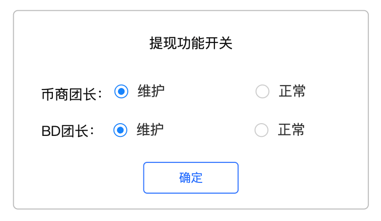

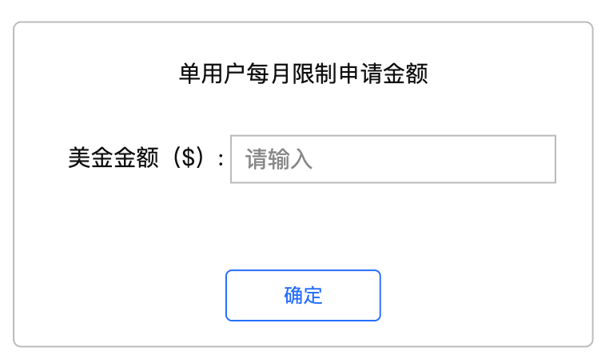

13.0提现管理后台 – 积分档位管理

| 功能名称 | 积分档位管理 |
|---|---|
| 优先级 | 高 |
| 功能描述 | / |
| 输入/前置条件 | / |
| 交互原型 | 「图1」「图2」 |
| 字段描述 | 影响：影响提现的用户提现积分的选择；档位：固定9个；正常积分：列表常规金额状态展示的积分，由积分和美金的汇率以及设置提现美金展示；首次积分：列表首次金额状态展示的积分，由积分和美金的汇率以及设置提现美金展示；只是相同档位，提现的门槛低了，并不是给更多钱；排序：默认按照1-9来；汇算美金：对应正常积分，常规形态下的提现金额；首次金额：对应首次积分，首次形态下的提现金额；操作就是编辑，弹出「图2」；相关提示：首次和常规都是美金单位；0和正整数；开启为档位开启显示；首次状态为激活这个档位的首次状态显示，如果开启档位关闭了，那么首次档位也不会被显示出来； |
| 需求描述 |  |
| 补充说明 |  |

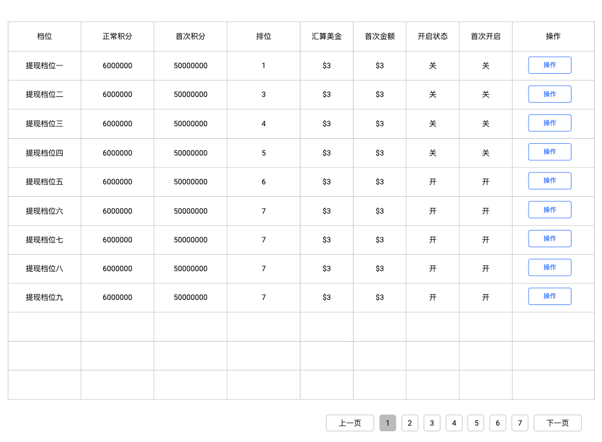

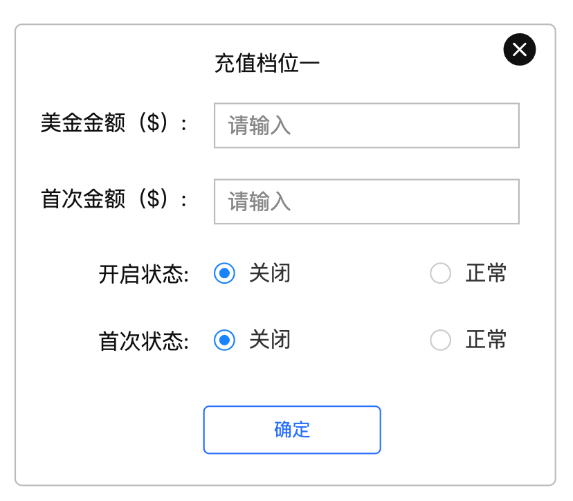

14.0提现管理后台 – 积分统计

| 功能名称 | 积分统计 |
|---|---|
| 优先级 | 高 |
| 功能描述 | / |
| 输入/前置条件 | / |
| 交互原型 | 「图1」 |
| 字段描述 | 列表为统计平GMT+3自然日的：拉新结算：拉新周期结算后发放的积分平台赠送：后台给用户增加的；用户提现消耗：提现成功消耗数量；平台扣除：平台管理后台扣除日期：日期时间倒序排列，日月年，每日都展示，默认展示最近15天，支持日期区间查询；统计周期：T+1，次日统计前一日；获得用正数，扣除用负数，当日没有产生数据0； |
| 需求描述 |  |
| 补充说明 |  |

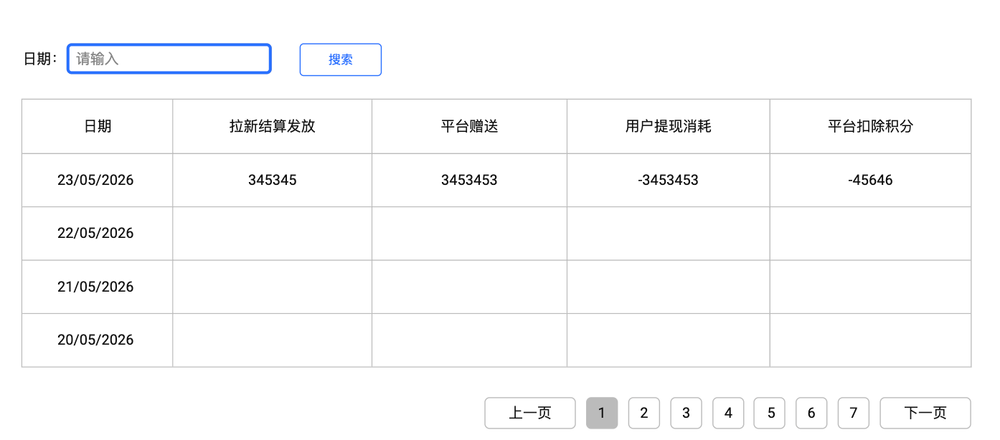

15.0提现管理后台 – 个人积分管理

| 功能名称 | 个人积分管理 |
|---|---|
| 优先级 | 高 |
| 功能描述 | / |
| 输入/前置条件 | / |
| 交互原型 | 「图1」 「图2」 「图3」「图4」「图5」「图6」 |
| 字段描述 |  |
| 需求描述 | 排序：按照用户当前总积分的倒序排序，积分相同，id小的在前面；用户基本信息：xid，昵称；支持人工增加账号，「图2」，通过用户XID增加，相同用户不可重复增加，同时需要选择首选货币，非必填写；首选货币：埃镑、美元、沙特币、USTD可选择（不一定，后续可能增加），这个是可以在后台变更的，创建账户默认根据用户区域选择对应货币，如果未知则按美金显示「图2」；当前积分：身上的积分；总共获得的积分：总计累计获得；累计扣除积分：只统计因违规扣除积分；提现积分：提现成功后（已发放状态），所使用掉的积分；总共提现笔数：总共提现成功笔数（已发放状态）；提现状态：支持个人提现功能开启关闭「图3」（属于分开关，受身份总开关限制）；入口展示：提现入口展示与否「图3」属于分开关，受身份总开关限制）；其他货币提取 |
| 补充说明 |  |

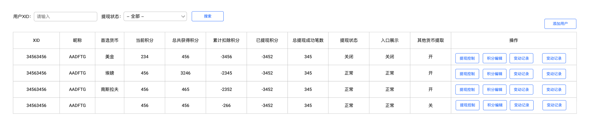

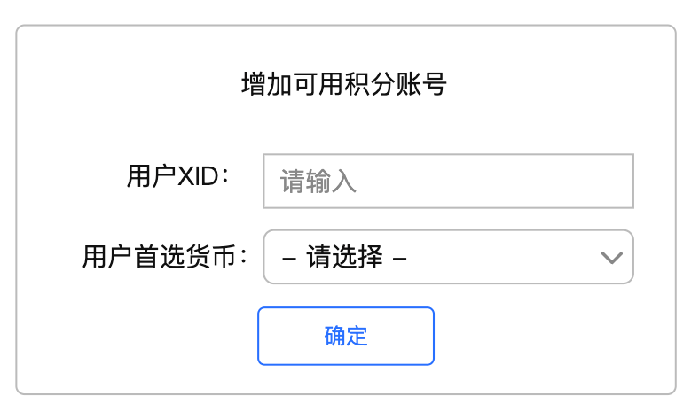

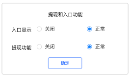

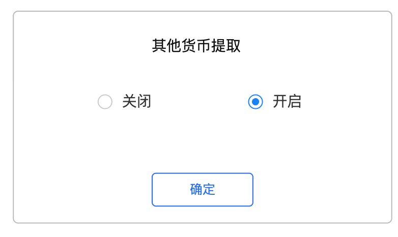

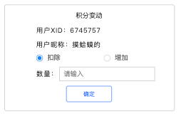

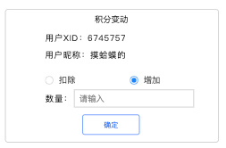

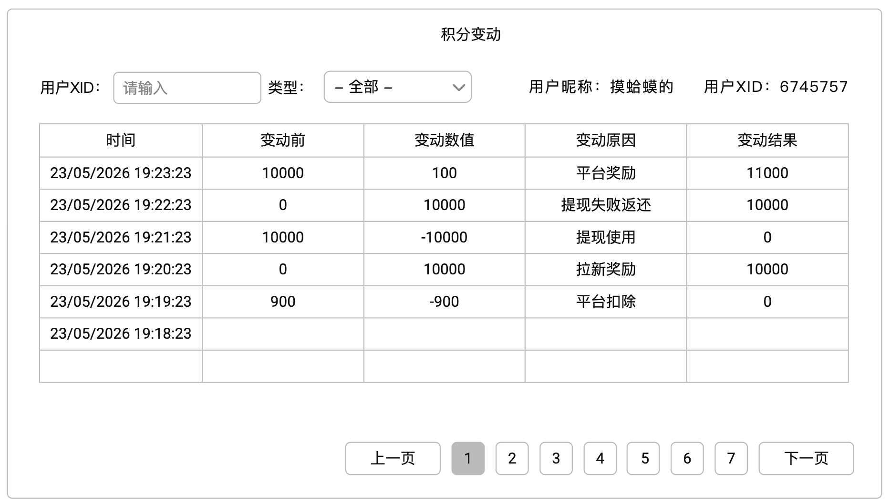

16.0拉新奖池调整

| 功能名称 |  |
|---|---|
| 优先级 | 高 |
| 功能描述 | / |
| 输入/前置条件 | / |
| 交互原型 | 「图1」 |
| 字段描述 | 拉新奖池的团长的拉新充值结算配置，增加积分的选择仅仅仅仅仅仅支持，金币和积分二选一；原来业务：充值结算奖励为根据比例结算对应金币，现在新增根据对应比例结算积分；影响范围：拉新页面奖励展示，原和金币结算相关的，都会有几分出现包括结算的两种团长到的可交易和不可交易金币； |
| 需求描述 | 特别说明：关于金币追溯退款的问题，使用积分也需要追溯；即从本周期结算中追溯相关金额； |
| 补充说明 |  |

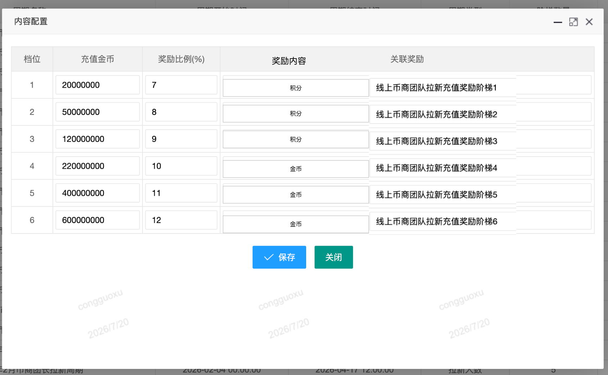

| 功能名称 |  |
|---|---|
| 优先级 | 高 |
| 功能描述 | / |
| 输入/前置条件 | / |
| 交互原型 | 「图1」 「图2」 「图3」 |
| 字段描述 |  |
| 需求描述 |  |
| 补充说明 |  |

| 功能名称 |  |
|---|---|
| 优先级 | 高 |
| 功能描述 | / |
| 输入/前置条件 | / |
| 交互原型 | 「图1」 「图2」 「图3」 |
| 字段描述 |  |
| 需求描述 |  |
| 补充说明 |  |

| 功能名称 |  |
|---|---|
| 优先级 | 高 |
| 功能描述 | / |
| 输入/前置条件 | / |
| 交互原型 | 「图1」 「图2」 「图3」 |
| 字段描述 |  |
| 需求描述 |  |
| 补充说明 |  |
