Hayyo v1.4.1-拉新优化

产品需求文档

文件标识：

| Hayyo v1.4.1-拉新优化 |  |  |
|---|---|---|
| 文件状态[√]草稿[]修改[]正式发布 | 文件标识： |  |
|  | 当前版本： | V1.0.0 |
|  | 作 者： | 产品部 |
|  | 完成日期： | 2026/8/12 |

一、个人拉新页面优化

1.1（一期）个人拉新 - 未开通状态

| 功能名称 | 个人拉新-未开通状态 |
|---|---|
| 优先级 | 高 |
| 功能描述 | / |
| 输入/前置条件 | / |
| 交互原型 | 「图1」 「图2」 |
| 字段描述 | 主要修改相关状态表现交互； |
| 需求描述 | 用户未开通，但是存在周期的情况下表现如图分别展示正在进行中的充值金币和拉新人数所在周期的日期；默认标签定位在“拉新人数周期”；宝箱状态（未开通状态）：拉新达标人数：档位对应可领奖达标人数，比如拉10人达标，则显示拉：10个好友；充值达标显示：首档：参与活动即可享受其余按照充值档位最低达标线显示最高均为16位；额外道具奖励，均展示一行，支持横向滑动；页面整体滑动，滑动时悬浮“参与”按钮下收起不展示，页面静止时向上出现展示；头部新增“绑定入口”，Me页面的绑定状态（补绑）入口相同；如果不支持绑定则不展示icon（比如投放量用户）；如果是可以绑定用户，但是没有绑定用户，展示入口；如果是已经绑定的用户，展示绑定的用户头像； |
| 补充说明 |  |

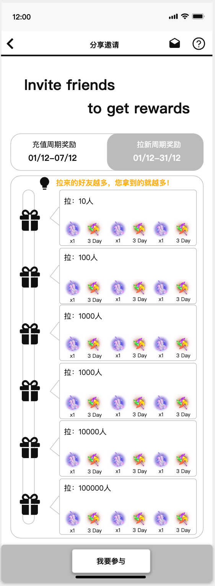

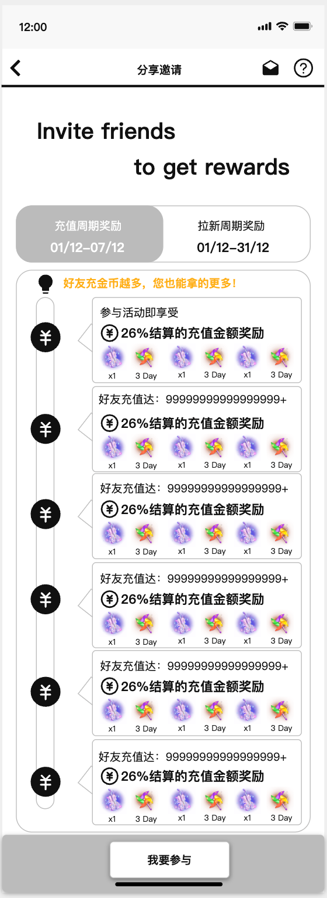

1.2 （一期）个人拉新 – 已开通 – 拉新用户

| 功能名称 | 个人拉新 – 已开通 – 拉人 |
|---|---|
| 优先级 | 高 |
| 功能描述 | / |
| 输入/前置条件 | / |
| 交互原型 | 「图1」「图2」 |
| 字段描述 | 激活后样式如图，原来数据层面折叠进入二级页面（在后面文档）；页面整体滑动，滑动时两个分享入口按钮向下收起不展示，页面静止时向上出现展示；保留当前团长相关功能展示；活动数据：即原来的周期数据（也就是原来的头部第一个数据）；奖励记录独立展示，保留红点规则和跳转页面（原逻辑）；更多数据：点击跳数据二级页面；·默认tab：拉人的周期奖励；进度条调整为竖状进度条，宝箱位置均分，支持宝箱保留溢出和扩展（增加档位），扩展的档位向下延伸；拉新奖励状态：不同状态都会有一个对应icon；已领取：已经领取的宝箱；点击领取：达标了，还没有领取的状态；还差拉X个好友可领取：没有达标的状态，因为档位为递增方式，因此每个档位的“差X个好友”则为=达标人数-当前已完成人数；；不同状态，宝箱会有不一样显示状态，针对可领取的则有动态提示；宝箱定位，如「图2」：当存在可领取，或多个可领取，定位和样式在第一个可领取的宝箱；如当前没有可领取的，那么定位和样式在用户即将完成的那个；进度条根据分的间距结合实际数据做处理；当存在多个可领取宝箱虽然定位按照档位进度定位在第一个，但是实际上用户可以不按顺序领取；定位按钮：用户可以点击定位按钮（屏幕侧边那个ME）； 点击后，则把相关定位拉到屏幕高度中间位置 如果定位档位在最低下那个，则不需要拉到中间，直接页面到底即可；如果第一个无法拉入页面，也如此页面只要划到定即可；底部分享流程为固定文案，第四步有一个跳转说明，点击后跳转H5页面中用户个人拉新列表（已有，只做跳转入口）；宝箱内容：展示相关的商品，类型和当前逻辑相同没有变化，横排展示，数量根据UI实际给出效果，支持横向滑动，当前配置数量不多，暂时不做更多展开逻辑，后续增量再根据实际业务调整交互； |
| 需求描述 |  |
| 补充说明 |  |

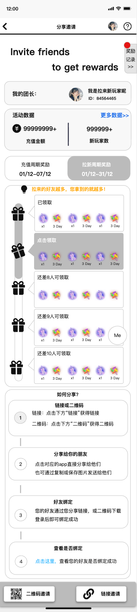

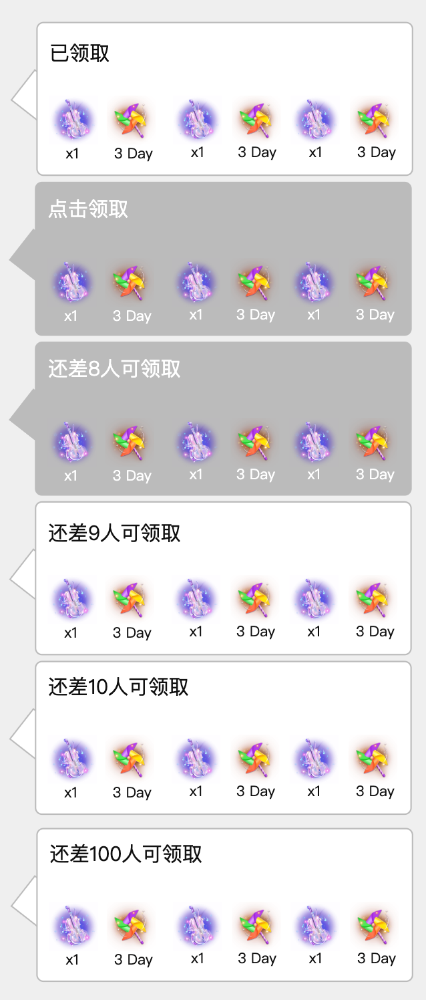

1.3 （一期）个人拉新 – 已开通 – 充值

| 功能名称 | 充值拉新 – 已开通 |
|---|---|
| 优先级 | 高 |
| 功能描述 | / |
| 输入/前置条件 | / |
| 交互原型 | 「图1」「图2」 |
| 字段描述 | 进度条调整为竖状进度条，宝箱位置均分，支持宝箱保留溢出和扩展（增加档位），扩展的档位向下延伸；充值奖励状态：不同状态都会有一个对应icon；我的档位：当前所在的充值结算档位；已经超过的档位：已过的档位；还差金币数量X=达到这个档位的最低门槛-已经产生的金币充值；不同状态，宝箱会有不一样显示状态，已经超过的可以灰色，当前档位一种，未达到的一种；宝箱定位：如「图2」：定为在用户所在的当前档位；进度条根据分的间距结合实际数据做处理；定位按钮：用户可以点击定位按钮（屏幕侧边那个ME）； 点击后，则把相关定位拉到屏幕高度中间位置 如果定位档位在最低下那个，则不需要拉到中间，直接页面到底即可；如果第一个无法拉入页面，也如此页面只要划到定即可；底部分享流程为固定文案，第四步有一个跳转说明，点击后跳转H5页面中用户个人拉新列表（已有，只做跳转入口）；宝箱内容：展示档位结算的百分比；展示相关的商品，类型和当前逻辑相同没有变化；支持横向滑动，当前配置数量不多，暂时不做更多展开逻辑，后续增量再根据实际业务调整交互 |
| 需求描述 |  |
| 补充说明 |  |

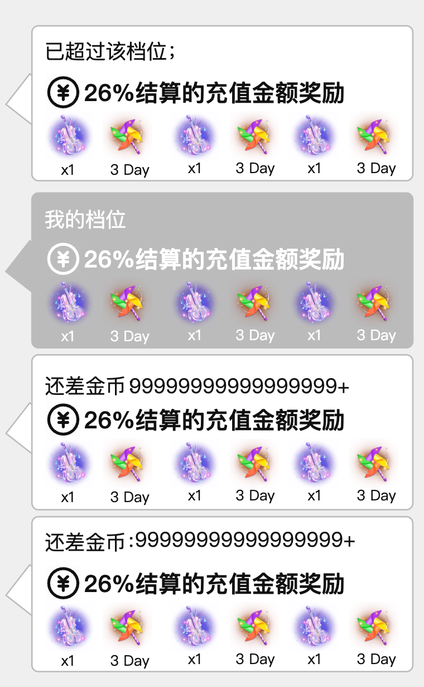

1.4 （一期）个人拉新 - 更多数据

| 功能名称 | 个人拉新 - 更多数据 |
|---|---|
| 优先级 | 高 |
| 功能描述 | / |
| 输入/前置条件 | / |
| 交互原型 | 「图1」 |
| 字段描述 | 数据内容和原个人拉新页面上层相同团长身份不在这页展示；页面整体滑动，滑动时两个分享入口按钮向下收起不展示，页面静止时向上出现展示； |
| 需求描述 |  |
| 补充说明 |  |

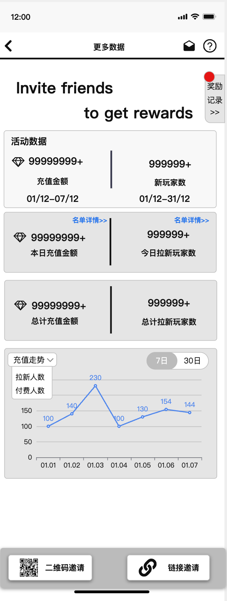

1.5 （二期）新手玩法页面取消绑定限制

| 功能名称 | 新手玩法页面 |
|---|---|
| 优先级 | 高 |
| 功能描述 | / |
| 输入/前置条件 | / |
| 交互原型 | / |
| 字段描述 | 原来逻辑：只有绑定用户绑定后可见；新逻辑：新注册用户可见；其余包括可见的时间长度：保持不变；货币商人推荐展示：只有绑定用户可见B商推荐模块； |
| 需求描述 |  |
| 补充说明 |  |

1.6 （二期）主动推送

| 功能名称 | 主动推送 |
|---|---|
| 优先级 | 高 |
| 功能描述 | / |
| 输入/前置条件 | / |
| 交互原型 | 「图1」 「图2」 |
| 字段描述 | 消息类型：通用：展示hayyo的logo；个人拉新：对应奖励可以领取的用户「图1」2.1拉新充值奖励标题：尊贵的用户内容：朋友，{{user_name}}又有新的奖励到账了；跳转：点击跳转到个人拉新中的奖励记录页面；右侧展示：金币icon/积分；团队拉新3.1 拉新充值奖励标题：伟大的团长；内容：团长，{{user_name}}你的团队又有新的奖励到账了；跳转：点击跳转到团队拉新面板页面中的奖励记录页面；右侧展示：金币icon/积分；由于平台的消费分发机制，可能存在平台推送，但是用户延迟的收到的行为，因此延后信息和状态可能存在不同，是可以接受的；前仅作功能推送，消息综合调控机制等后续做补充，当前版本暂时不做； |
| 需求描述 |  |
| 补充说明 | / |

二、团队拉新页面优化

2.1 （一期）团队拉新 – 页面调整

| 功能名称 | 团队拉新 – 页面调整 |
|---|---|
| 优先级 | 高 |
| 功能描述 | / |
| 输入/前置条件 | / |
| 交互原型 | 「图1」 「图2」「图3」 |
| 字段描述 | 顶部Banner这个版本不做；第二栏的新增积分，在Payout；首页保留原数据一栏，这个不变，其余数据折叠进入二级页面；入口为主页的“预计可得”更多数据；原来页面的入口为二级页面的相同入口，进入后为「图2」；页面整体滑动；和个人拉新不同，团长页面的定位是“充值相关的TAB”；拉新团队数据为数据折叠页面； |
| 需求描述 | （充值）进度条调整为竖状进度条，宝箱位置均分，支持宝箱保留溢出和扩展（增加档位），扩展的档位向下延伸；充值奖励状态：不同状态都会有一个对应icon；我的档位：当前所在的充值结算档位；已经超过的档位：已过的档位；还差金币数量X=达到这个档位的最低门槛-已经产生的金币充值；不同状态，宝箱会有不一样显示状态，已经超过的可以灰色，当前档位一种，未达到的一种；宝箱定位：如「图2」：定为在用户所在的当前档位；进度条根据分的间距结合实际数据做处理；定位按钮：用户可以点击定位按钮（屏幕侧边那个ME）； 点击后，则把相关定位拉到屏幕高度中间位置 如果定位档位在最低下那个，则不需要拉到中间，直接页面到底即可；如果第一个无法拉入页面，也如此页面只要划到定即可；宝箱内容：展示档位结算的百分比；展示相关的商品，类型和当前逻辑相同没有变化；支持横向滑动，当前配置数量不多，暂时不做更多展开逻辑，后续增量再根据实际业务调整交互 |
| 补充说明 | （拉新）进度条调整为竖状进度条，宝箱位置均分，支持宝箱保留溢出和扩展（增加档位），扩展的档位向下延伸；拉新奖励状态：不同状态都会有一个对应icon；已领取：已经领取的宝箱；点击领取：达标了，还没有领取的状态；还差拉X个好友可领取：没有达标的状态，因为档位为递增方式，因此每个档位的“差X个好友”则为=达标人数-当前已完成人数；；不同状态，宝箱会有不一样显示状态，针对可领取的则有动态提示；宝箱定位，如「图2」：当存在可领取，或多个可领取，定位和样式在第一个可领取的宝箱；如当前没有可领取的，那么定位和样式在用户即将完成的那个；进度条根据分的间距结合实际数据做处理；当存在多个可领取宝箱虽然定位按照档位进度定位在第一个，但是实际上用户可以不按顺序领取；定位按钮：用户可以点击定位按钮（屏幕侧边那个ME）； 点击后，则把相关定位拉到屏幕高度中间位置； 如果定位档位在最低下那个，则不需要拉到中间，直接页面到底即可；如果第一个无法拉入页面，也如此页面只要划到定即可；宝箱内容：展示相关的商品，类型和当前逻辑相同没有变化，横排展示，数量根据UI实际给出效果，支持横向滑动，当前配置数量不多，暂时不做更多展开逻辑，后续增量再根据实际业务调整交互 |

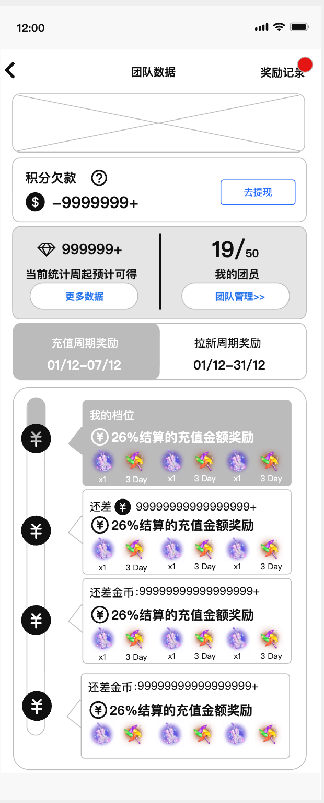

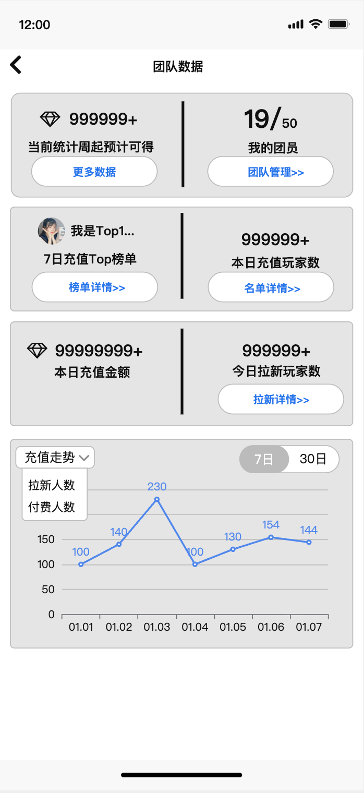

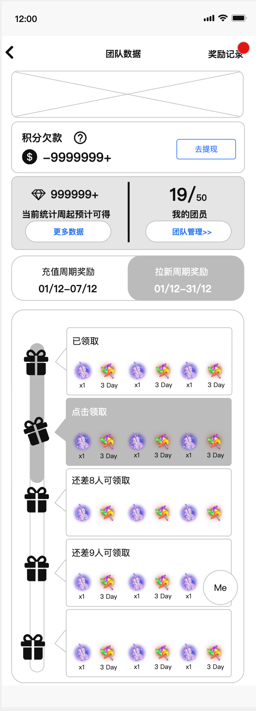

三、（二期）链接分享页面

| 功能名称 | 链接分享页面 |
|---|---|
| 优先级 | 高 |
| 功能描述 | / |
| 输入/前置条件 | / |
| 交互原型 | 「图1」 |
| 字段描述 | 页面为通过链接或二维码扫描页面，打开的H5页面，原来为直接跳转应用市场；页面头部：吸顶栏；应用名称和icon；吸底栏：分享者头像，昵称，显示ID，VIP勋章；固定文案“邀请您来”，打开app按钮；打开按钮跳转应用市场，需要根据设备判断是Google或IOS；ID支持复制，点击后toast提示“已复制”页面整体滑动，滑动时，头部和底悬浮弹窗收起不展示，页面静止时向弹出出现展示；页面内容大部分为静态展示，如何绑定中会有一个“点我”按钮；点击判断：如果未安装app，则直接跳转应用市场；如已经安装app：则打开app，并且跳转到Me页面绑定状态（补绑）；已绑定，则直接弹出绑定弹窗，如果未绑定；则直接点进入补绑页面； |
| 需求描述 |  |
| 补充说明 |  |

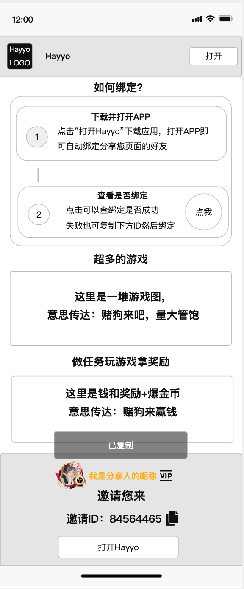

（二期）白名单机制

为了方便线上功能测试，增加相关配置，把绑定发起者/团长等角色账号ID加入配置白名单

用于过滤相关设备信息和账号绑定数量上限的限制问题；

（二期）红点机制

| 功能名称 | 红点机制 |
|---|---|
| 优先级 | 高 |
| 功能描述 | / |
| 输入/前置条件 | / |
| 交互原型 | 「图1」 「图2」 |
| 字段描述 | 影响范围：团队和个人“奖励记录”入口新逻辑：当产生新的记录后，弹出对应红点提示不需要实时刷新，手动刷新页面和重新进入页面请求即可，用户点击进入到“奖励记录”页面，判断为已读，取消本次展示；如果多条，也仅一次展示； |
| 需求描述 |  |
| 补充说明 |  |

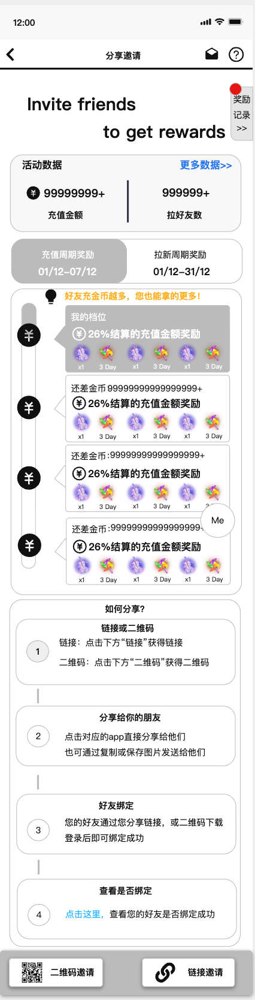

（二期）H5优化”奖励记录“页面中的部分TAB

删除审核中、待领取

修改“已领取”名称变成“已发放”

包括页面：团队、个人中的奖励

（二期）积分机制 - 拉新奖池新增积分

| 功能名称 |  |
|---|---|
| 优先级 | 高 |
| 功能描述 | / |
| 输入/前置条件 | / |
| 交互原型 | 「图1」 |
| 字段描述 | 拉新奖池的团长的拉新充值结算配置，增加积分的选择仅仅仅仅仅仅支持，金币和积分二选一；原来业务：充值结算奖励为根据比例结算对应金币，现在新增根据对应比例结算积分；影响范围：拉新页面奖励展示，原和金币结算相关的，都会有几分出现包括结算的两种团长到的可交易和不可交易金币； |
| 需求描述 | 特别说明：关于金币追溯退款的问题，使用积分也需要追溯；即从本周期结算中追溯相关金额；自动生成账号：发放的时候如果没有积分账号，会自动生成该用户的积分账号； |

（二期）退款逻辑

完成遗漏部分：3.4.7（个人）、3.4.19（团队）退款逻辑问题【金山文档 | WPS云文档】 Samer v2.0.0 产品需求文档

https://365.kdocs.cn/l/cvoLBStKNCgk

（二期）手动结算奖励，如果账号被封禁不要给到奖励的自动发放

| 功能名称 | 手动结算奖励，如果账号被封禁不要给到奖励的自动发放 |
|---|---|
| 优先级 | 高 |
| 功能描述 | / |
| 输入/前置条件 | / |
| 交互原型 | / |
| 字段描述 | / |
| 需求描述 | 原逻辑为手动结算时，如果账号被封禁依旧奖励可以发调整为，如果被封禁，即使订单通过也不会发；也就是发送前需要验证用户状态，如果功能被封，则不发放相关奖励；不生成发放记录（用户端不做展示） |

奖励组配置，调整物品筛选逻辑

| 功能名称 | 奖励组配置，调整物品筛选逻辑 |
|---|---|
| 优先级 | 高 |
| 功能描述 | / |
| 输入/前置条件 | / |
| 交互原型 | 「图1」「图2」 |
| 字段描述 |  |
| 需求描述 | 商品名称优化为输入商品ID，同后台其他奖励申请和配置页面的逻辑「图1」实际物品名称就是在后台配置的固定字段，也就是关联商品ID，词名称展示只为后台展示，非前端展示，这个不要开放编辑「图2」 |

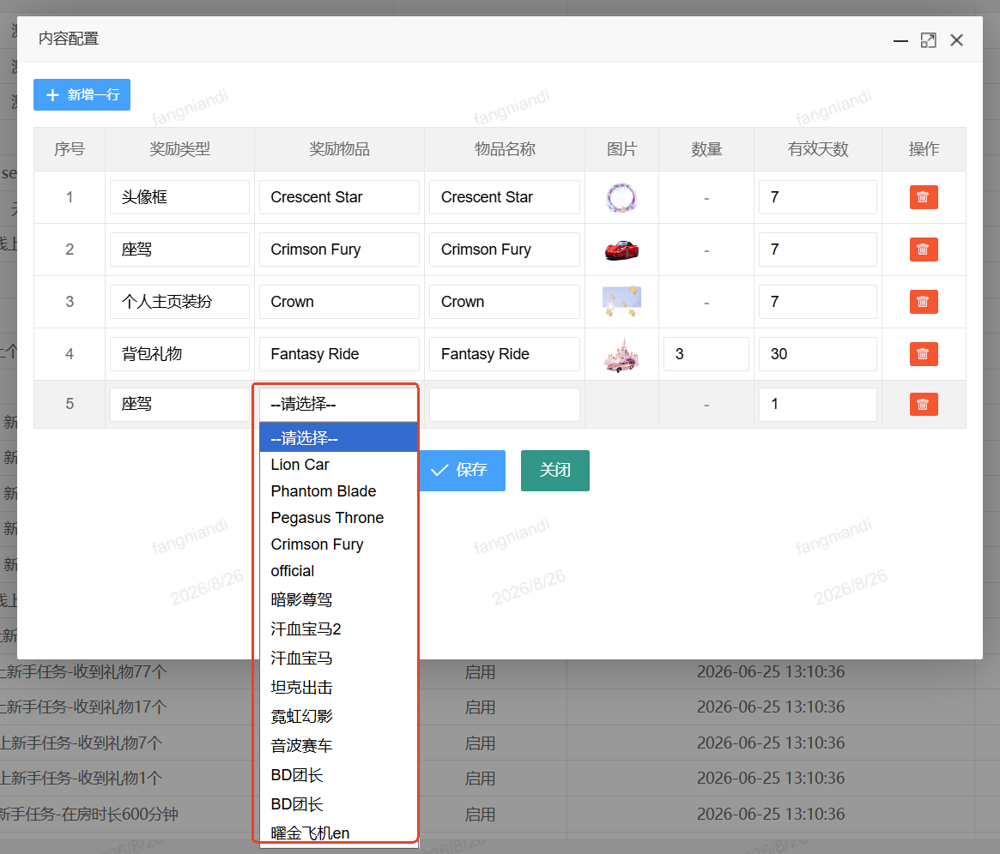

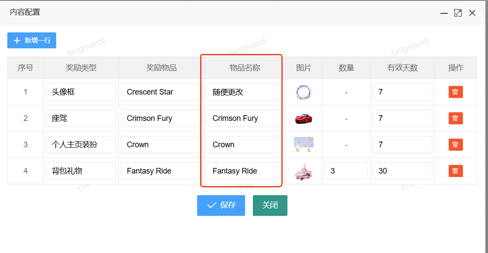

（不需要开发）增加主页banner和房间内侧边栏的活动增加展示图

此为美术素材需求

如涉及到需要在后台以及客户端需要增加独立配置（入口固化），可议；

（一期）二维码分享图片换皮（国庆节前发）

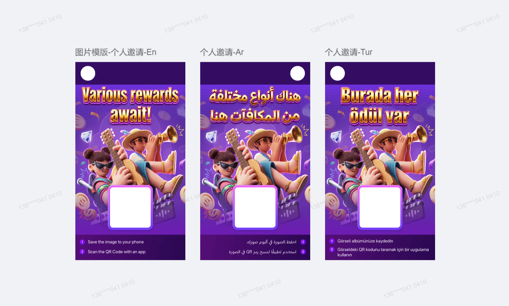
