3.2 第二部分 【含H5】接入三方数值游戏（许静）

3.2.1 游戏接入概述

房间内半屏接入2款三方H5数值游戏：Bounty Racing、Lord of Olympus

提交审核时接入的三方H5数值游戏仍受服务端风控开关控制

Bounty Racing：玩法同线上水果机，但比水果机支持压住更多选项；

Lord of Olympus：slots玩法

Bounty Racing游戏截图：     Lord of Olympus游戏截图：

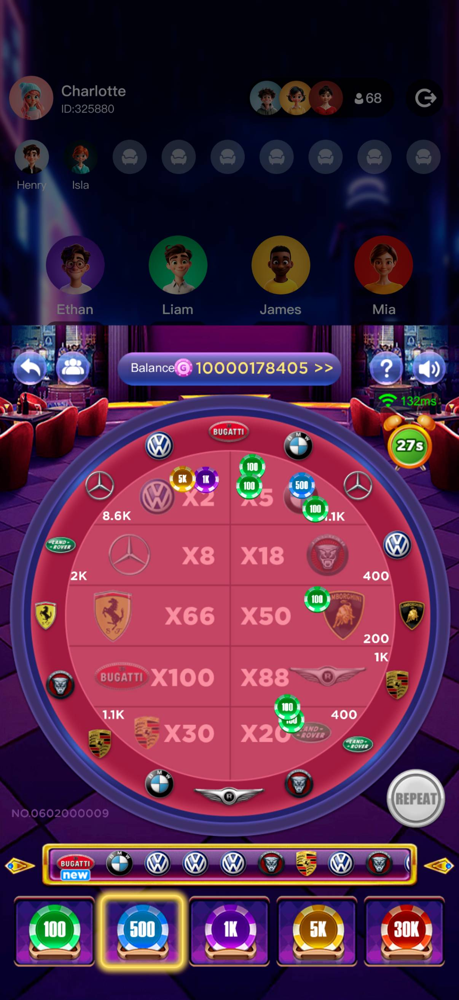

3.2.2 游戏上新引导

| 功能名称 | 游戏上新引导 |
|---|---|
| 优先级 | 高 |
| 功能描述 | / |
| 输入/前置条件 | / |
| 需求描述 | 图1触发条件：版本1.4.0包，所有非新注册用户首次进入房间5秒，一个账号只弹一次，记录在本地即可，卸载重装仍会弹；点击交互：点击气泡打开游戏中心半屏消失条件：点击气泡外任意区域或气泡展示满6秒 |
| 补充说明 |  |

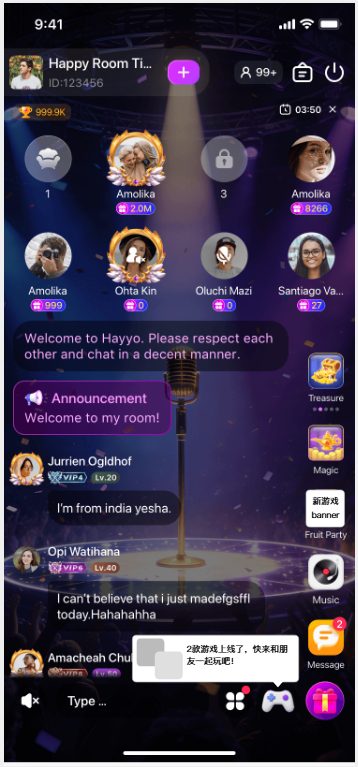

3.2.3 游戏入口&开启游戏

| 功能名称 |  |
|---|---|
| 优先级 | 高 |
| 功能描述 | / |
| 输入/前置条件 | / |
| 需求描述 | 游戏中心入口：接入的两款游戏展示在“Game Center”的个人游戏区域，展示位置见上图；游戏参与限制：Bounty Racing：玩法同水果机，仅面向VIP用户Lord of Olympus：slots玩法，面向所有用户可以参与游戏中心面板交互及展示：面版展示的游戏名称高度需要自适应：如果当前行出现两行文字，当前行所有UI适配2行文字高度图标区，如果当前行都是一行文字，当前行所有UI适配1行文字高度图标区；若面板展示的游戏超过打开半屏看到的内容，上滑查看时需要自动拉高半屏页面以便展示更多游戏；仅VIP可参与的游戏展示“VIP”角标，点击游戏弹窗提示：“成为VIP解锁当前游戏+【游戏图标】 【取消】【成为VIP】”，见下图，点击【成为VIP】页面跳转至VIP页面，返回房间时当前开启的游戏中心半屏页面不自动关闭；游戏侧边栏入口：仍保留线上数值游戏侧边栏展示逻辑，即：进入房间侧边栏默认展示“水果机”游戏，点开进入游戏半屏页面，支持用户快速切换游戏，若用户在关闭游戏面板时停留在X游戏则本次在房期间侧边栏就展示X游戏图标，点开X游戏图标可打开游戏面板立即定位在X游戏页面；其他：若当前用户为非VIP用户，开启游戏面板后不可切换Bounty Racing游戏，且支持切换的游戏选项中不展示Bounty Racing游戏，见下图，若在当前页面未关闭期间用户成为了VIP页面不会立刻刷新展示Bounty Racing游戏切换图标，用户关闭当前页面再次开启时刷新展示Bounty Racing游戏切换图标，可切换参与Bounty Racing游戏；因三方数值游戏房间打开半屏高度不一致，需要适配半屏开启高度和水果机保持一致；游戏中奖房间触发中奖广播：XXX赢得YYY金币+【游戏图标】+【Go】按钮（用户已经在当前房间不展示【Go】按钮，密码房触发的广播不展示【G0】按钮）； 广播触发条件：游戏中奖金币＞N（N由服务端配置，两个游戏分开配置）；在线人数和房间送礼金币限制同水果机逻辑，限频逻辑同水果机，见下图： 注：老版本不展示此广播； |
| 补充说明 |  |

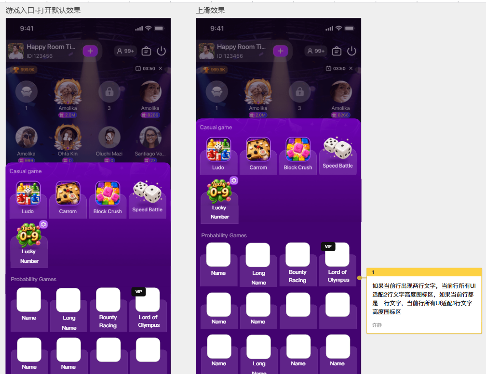

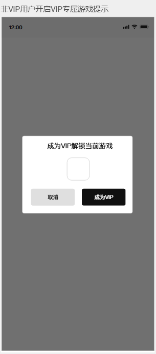

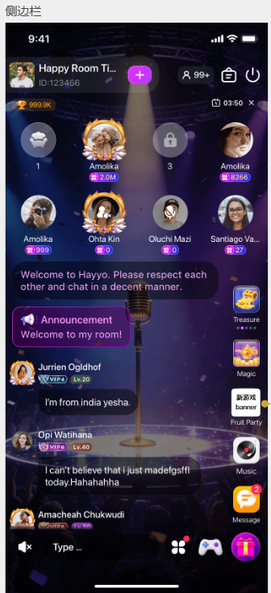

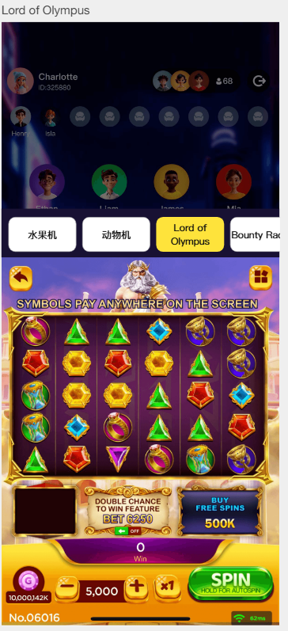

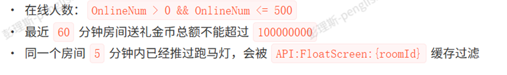

3.2.4 游戏档位及配置

| 功能名称 |  |
|---|---|
| 优先级 | 高 |
| 功能描述 | / |
| 输入/前置条件 | / |
| 需求描述 | 档位配置（待定）：Bounty Racing：2000（0.01$）50000（0.25$）200000（1$）1000000（5$）10000000（10$）Lord of Olympus：51010050020005000 |
| 补充说明 |  |

3.2.5 游戏风控预警

| 功能名称 | 数值游戏风控预警 |
|---|---|
| 优先级 | 高 |
| 功能描述 | / |
| 输入/前置条件 | / |
| 需求描述 | 5分钟实时检测预警，钉钉群+邮件同步（两款游戏分开配置）：触达低水位线预警：水线数值小于等于X（X服务端配置）；累计中奖预警：周期时间范围内（7天内，数值可配）累计中奖金币大于等于Y；单人周期时间范围内（7天内，数值可配）累计中奖金币大于等于Z（Y、Z服务端配置）预警限频：1小时内最多触发50次（两款游戏预警配置分开，数值相同）； |
| 补充说明 |  |

3.3 第三部分 其他优化需求

3.3.1 官方房麦位数量增加-临时处理（许静）

| 功能名称 | 官方房支持15麦位 |
|---|---|
| 优先级 | 高 |
| 功能描述 | / |
| 输入/前置条件 | / |
| 需求描述 | 图1官方房默认展示15麦位，见上图1，不支持房主或管理员切换为其他麦位数量；麦位展示一排支持展示5个麦位，麦位展示内容需要大小自适应，如：麦上表情包、头像框、礼物计数器展示；麦位展示15个需要房间侧边栏高度适配，详见UI设计稿；老版本适配：老版本能听到新版本不可见麦上用户说话；给老版本看不到的麦上用户送礼老版本仍然能触发送礼跑道、对应送礼通知；老版本赠送全麦、全房礼物，仍包括新版本看不到的麦上用户；老版本支持对隐藏麦位静音；（待定：只能静音当下麦位声音）老版本弹窗，待定老版本用户进入房间若当前房间不支持展示新版本内容时提醒老版本用户更新版本弹窗：后续若老版本用户进入房间开启了8麦以上数量进房时弹出弹窗提示：弹弹窗1还是弹窗2由服务端控制：弹窗1：“该版本不支持展示当前房间部分内容，请更新版本。【取消】【去更新】”；点击【去更新】跳转当前手机机型的应用商店（ios跳转AppStore，安卓跳转GooglePlay）;手机没有安装应用商店弹窗提醒：“请下载AppStore更新应用。”或“请下载GooglePlay更新应用。”；点击【取消】仍停留当前房间弹窗2：“该版本不支持展示当前房间内容，请更新版本。【取消】【去更新】”；点击【去更新】跳转当前手机机型的应用商店（ios跳转AppStore，安卓跳转GooglePlay）;手机没有安装应用商店弹窗提醒：“请下载AppStore更新应用。”或“请下载GooglePlay更新应用。”；点击【取消】立即退出当前房间 |
| 补充说明 | 其他涉及影响需研发评估 |

3.3.2 【安卓】UI重构剩余部分（许静）

| 功能名称 | 应用改名涉及改动 |
|---|---|
| 优先级 | 高 |
| 功能描述 | / |
| 输入/前置条件 | / |
| 需求描述 | ios、安卓剩余部分UI重构内容，详见UI设计稿 |
| 补充说明 |  |

3.3.3 抽奖活动奖励领取提醒优化（许静）

| 功能名称 | 抽奖活动奖励领取提醒优化 |
|---|---|
| 优先级 | 高 |
| 功能描述 | / |
| 输入/前置条件 | / |
| 需求描述 | 图1气泡弹出触发条件：有待领取的每日任务奖励（过期不算，跨天清红点）、成就奖励气泡弹出限制：每次进入首页一级页面满3秒时弹，一个账号一天最多弹3次（服务端配置）气泡消失条件：进入房间或进入抽奖活动页或点击页面任意区域面气泡消失；8秒倒计时结束自动消失；点击气泡跳转逻辑：点击气泡或领取按钮跳转抽奖页面；若待领取奖励含任务奖励跳转任务区域，若待领取奖励仅为成就奖励跳转顶部；其他：气泡支持穿透点击；气泡展示层级在首页弹窗层级之下；抽奖领取奖励后返回大厅页面更新抽奖待领取次数 |
| 补充说明 |  |

3.3.4 技术优化@姚泽

| 功能名称 | 技术优化 |
|---|---|
| 优先级 | 高 |
| 功能描述 | / |
| 输入/前置条件 | / |
| 需求描述 | 技术优化文档：https://365.kdocs.cn/l/cuXNSvKCefpq |
| 补充说明 |  |

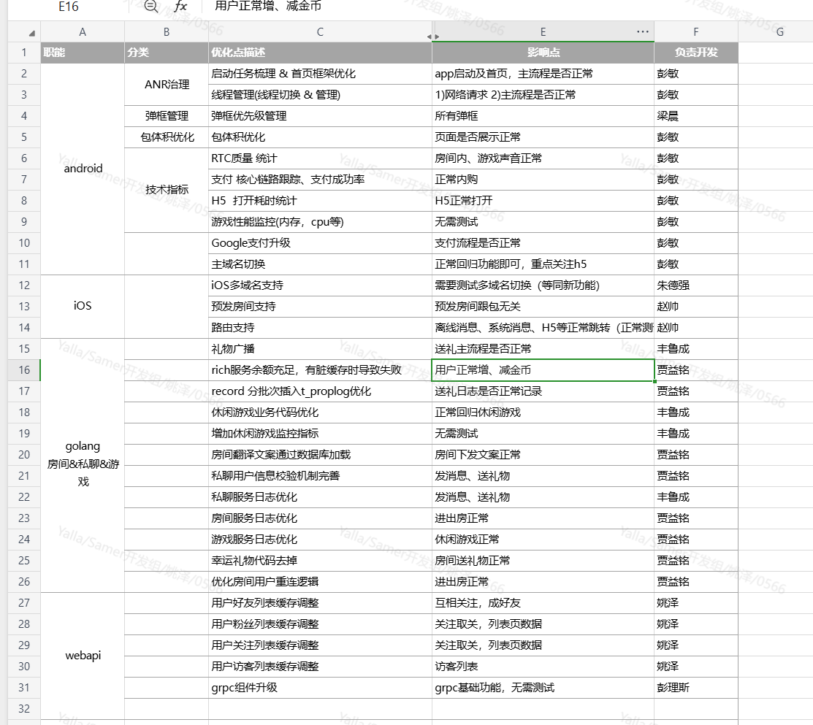

3.3.5活动页面展示优化（及祥）

| 功能描述 | ios版本支持活动配置需求（客户端、后台）活动推送跳转优化（H5页面拦截）新用户历史活动显示优化 |
|---|---|
| 优先级 | 高 |
| 输入/前置条件 |  |
| 需求描述 | 背景描述：ios包同步活动页面与活动消息后需要支持以下功能1.需求路径：平台配置-Banner管理-活动管理需求描述：活动管理：增加“显示设备”选项（IOS、安卓）版本号配置说明：最低版本：输入版本号后大于等于此版本号显示活动 非必填2.活动推送跳转优化（此功能需要后台支持活动消息推送时发送URL信息）ios与安卓新增：点击推送消息进入应用打开对应活动页，进入活动页面进行版本判断，用户在对应版本内正常进入活动页，若用户客户端版本不再范围内，则提示版本过低升级提示，如下图所示点击立即升级，退出活动页面并 打开版本升级链接，点击取消退出活动页面并返回活动列表3.活动消息列表展示信息调整新用户活动消息列表仅展示进行中状态的活动，已过期的活动不展示在活动列表中 |
| 输出/后置条件 |  |
| 补充说明 |  |

3.3.6默认房间背景切换功能（及祥）

| 功能描述 | 道具背包增加默认房间背景与切换 |
|---|---|
| 优先级 | 高 |
| 输入/前置条件 |  |
| 需求描述 | 图1 图2 图3背包增加默认房间背景切换，提供3个默认背景正在使用的背景显示in use标记去除背包页面中已装扮背景的cancel按钮与取消选择功能保留用户切换背景的二次确认弹窗默认房间背景排序在付费的房间背景后排序根据道具配置排序，时间显示为永久 点击使用中的背景Use按钮时。给与该背景正在使用中 toast提示若已使用的付费背景到期后，默认指向使用排序第一的免费背景 |
| 输出/后置条件 |  |
| 补充说明 |  |

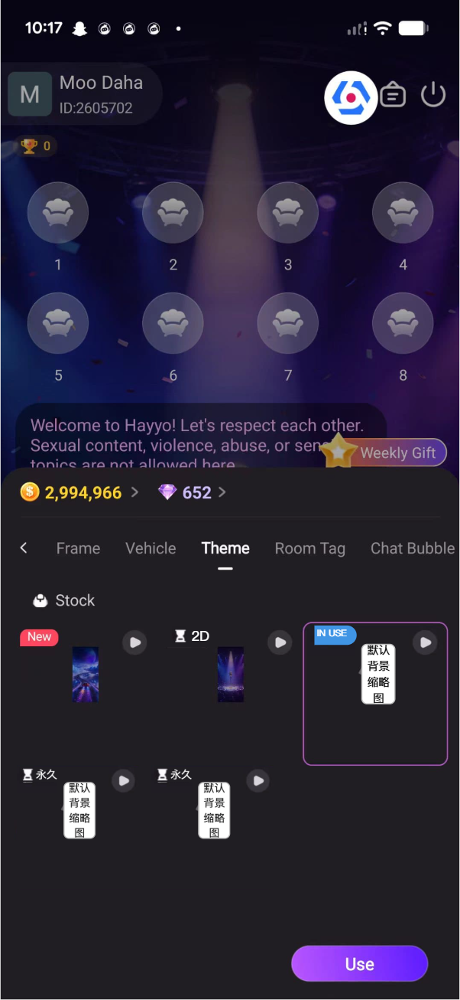

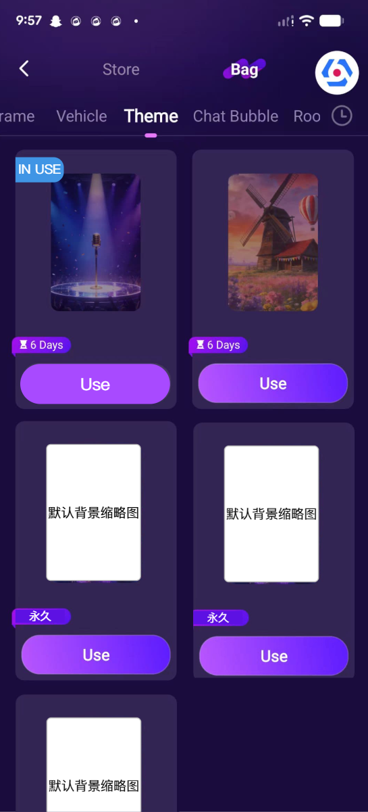

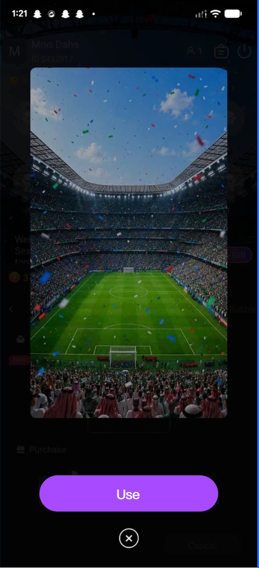

3.3.7（安卓）全局弹窗调整 （及祥）

| 功能描述 | 弹窗显示需求现有弹窗优先级整理、新增房间游戏重连弹窗ios端支持服务端指定首页配置 |
|---|---|
| 优先级 | 高 |
| 输入/前置条件 |  |
| 需求描述 | 弹窗显示需求 同页面多弹窗情况、根据获取成功弹窗优先级：确保一次只展示一个弹窗，切换页面刷新展示条件（业务定时弹窗、业务通知弹窗不受此条件影响，触发显示条件后在当前弹窗关闭后显示）注：强制更新、非强更弹窗不参与弹窗队列，触发后可能会与当前页面显示弹窗重叠展示2.有弹窗位置与优先级已有弹窗做一个优先级排序，未指定页面条件的为一级页面弹窗类型弹窗页面内容队列弹窗显示排序销毁条件弹窗频次系统弹窗首页强制更新/非强更不参与1用户更新每日X次协议弹窗首页协议更新弹窗队列/即时队列2勾选同意设置后1次即时业务弹窗首页大厅/房间游戏重连提示即时队列3点击完成根据业务场景设计 目前是一次业务弹窗首页拉新相关顶部弹窗队列5展示完成销毁仅1次业务通知弹窗首页活动（预留功能）即时队列6进入活动页每日X次业务弹窗房间列表新人礼包队列7领取完成/新人期结束每日X次业务弹窗首页签到队列8签到完成每日X次(主动触发本轮队列中不再展示)业务通知弹窗首页VIP体验券弹窗（福利券）即时队列与队列9次数播完接收人在线为即时队列、接收人不在线为队列业务弹窗消息页消息权限开启弹窗队列10开启消息通知权限每7天1次业务定时弹窗首页（除抽奖活动页）抽奖弹窗即时队列11展示完成销毁/进入抽奖活动页每人1次业务通知弹窗房间列表邀请进房弹窗即时队列12进房/关闭1次3.ios需要支持首页配置功能，根据服务端配置切换进入应用内的首页 |
| 输出/后置条件 |  |
| 补充说明 |  |

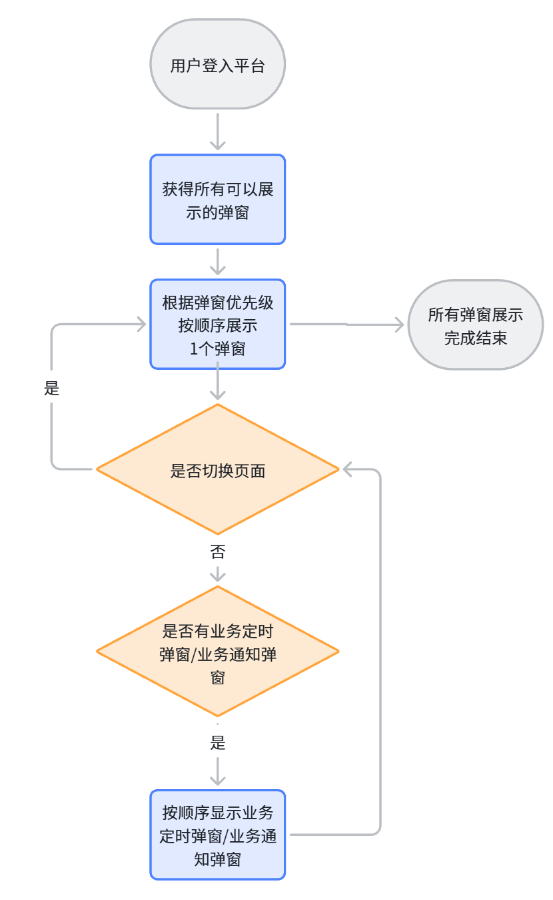

3.3.8房间内游戏服务端优化（及祥）

| 功能描述 | 房间内游戏配置信息缓存 |
|---|---|
| 优先级 | 高 |
| 输入/前置条件 |  |
| 需求描述 | 需求描述：房间内游戏每次开启、对局结束获取最新游戏配置，并缓存在服务端直至下次获取游戏配置时失效，若本地配置同服务端配置相同则不做调整，如果本地信息与服务端信息不相同时，则刷新本地配置并给与参与者信息变更弹窗提示。旧版本用户显示配置变更提示 |
| 输出/后置条件 |  |
| 补充说明 |  |

3.3.9房间内游戏客户端优化（及祥）

| 功能描述 | 返回游戏窗口时展示对局加载页房间内游戏踢人操作说明房间内游戏参与者逃跑场景定义补充休闲游戏与数值游戏兼容问题 |
|---|---|
| 优先级 | 高 |
| 输入/前置条件 |  |
| 需求描述 | 需求描述：1.用户最小化游戏窗口、keep房间、进入正在对局中的房间时打开游戏页面并展示我方的该局游戏的对局加载页 2.踢出游戏座位的用户，与用户所在位置无关，仅与用户是否在游戏座位有关，若二次确认过程用户离开座位，提示该用户已离开座位。若二次确认过程中用户离开再返回座位该踢出操作依然有效3.房间内游戏参与者对局状态下，主动离开/主动切换房间时给与游戏逃跑提示场景包含：keep房间时，点击关闭房间/进入其他房间时给与游戏逃跑提示、参与大厅游戏房间内：在房间内通过全站广播跳转其他房间、通过消息页IM页面跳转其他用户房间时4.场景描述、用户在房间内玩数值游戏时，此时房间内开启了休闲游戏，此时休闲游戏面板不展开为最小化状态，关闭数值游戏弹窗后继续保持数值游戏最小化状态 |
| 输出/后置条件 |  |
| 补充说明 |  |

3.3.10 拉新新增限制逻辑（丛）

| 功能名称 | 拉新限制逻辑 |
|---|---|
| 优先级 | 高 |
| 功能描述 | / |
| 输入/前置条件 | / |
| 需求描述 | 「图1」 |
| 补充说明 | 客户端上报，服务端判断是否为渠道推广来的用户；具体流程为收集数据，数据清洗，找出相关key作为词库，作为特定渠道（推广量）来的用户；针对特定渠道来的用户，补绑定入口不展示，也限进行绑定，如果有绕过的，则toast提示“您不可以绑定其他用户”；同时，通过分享链接进来的，也不可以绑定，过滤弹出提示「图1」； |

3.3.11 official消息格式支持（及祥）（需要客户端参与）

| 功能描述 | 1.official消息中客户端支持图文消息样式 |
|---|---|
| 优先级 | 高 |
| 输入/前置条件 |  |
| 需求描述 | 客户端支持official消息图文样式 消息结构：文字在上图片在下，消息页中显示的图片最大高宽比1：1，低于此高宽比显示实际高宽比的图片，超出后底部显示查看更多文字文字消息同之前一致：最多显示500字符点击对应图片打开图片预览窗口，根据图片宽高与屏幕宽高适配，短图：居中根据图片高度适配显示，顶底为黑色半透明遮罩长图：根据宽度适配，顶部对齐可上下滑动图片预览窗口左上角为返回按钮，点击可返回消息页，图片浏览状态支持手势缩放浏览，同房间封面预览交互一致 |
| 输出/后置条件 |  |
| 补充说明 |  |

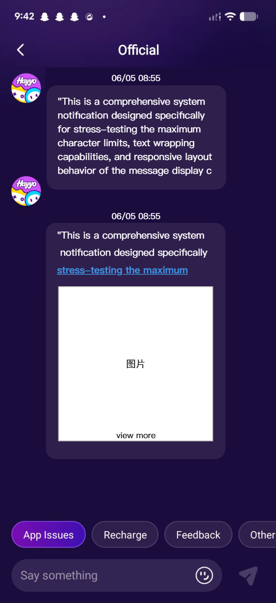

3.4 第四部分 【H5】Payout和拉新功能（丛国序）

参考文档链接：

【WPS Docs】 【PRD】Hayyo v1.4.0Payout需求文档

https://365.kdocs.cn/l/cpPqbwjskwte

3.5 第五部分 后台需求

3.5.1 日报游戏字段测试（上版本已完成开发未测试）

| 功能名称 | 日报游戏字段测试 |
|---|---|
| 优先级 | 高 |
| 功能描述 | / |
| 输入/前置条件 | / |
| 需求描述 | 详见v1.3.0版本需求：https://365.kdocs.cn/l/cu6OXsl03IeR |
| 补充说明 |  |

3.5.2 日报增加三方数值游戏统计（许静）

| 功能名称 | 日报增加本期接入的2款数值游戏的字段统计 |
|---|---|
| 优先级 | 高 |
| 功能描述 | / |
| 输入/前置条件 | / |
| 需求描述 | 日报的“水果机下注人数”、“水果机金币消耗”对应需要统计新接入的2款数值游戏的对应数据，字段名称不改，见下图： |
| 补充说明 |  |

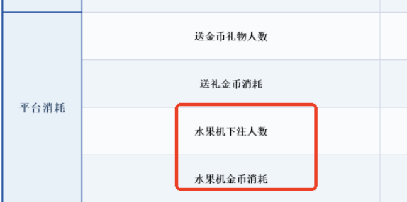

3.5.3 设备指纹封禁（及祥）（需要客户参与）

| 功能描述 | 新增设备指纹ID封禁功能用户登录设备，新增设备指纹ID字段用户信息处增加设备指纹ID字段 |
|---|---|
| 优先级 | 高 |
| 输入/前置条件 | 该功能需要接入数盟的设备指纹识别功能 |
| 需求描述 | 新增设备指纹ID封禁功能需求路径-Manage user-设备指纹封禁操作页新增，备注功能，封禁时填写得备注显示在封禁列表中新增字段：设备指纹ID使用数盟获得得设备指纹ID格式设备类型、操作类型、操作理由、操作人、操作时间、操作复用设备号封禁功能被封禁用户客户端呈现情况，同设备号封禁一致，封禁成功时，即时给与通知你已被禁止登录，强制登出并跳到登录页，提示样式调整为弹窗，弹窗中显示封禁理由若用户此时在后台中，打开应用时给与提示，强制登出并跳转至登录页。若用户杀掉进程时，下次打开应用给与此提示，若登录token到期，重新登陆时，点击任意一种登录方式给与此提示其他后台页面增加设备指纹ID字段路径：Manage-Manage user-账号信息原设备ID更名改为注册设备ID新增注册设备指纹ID |
| 输出/后置条件 |  |
| 补充说明 |  |

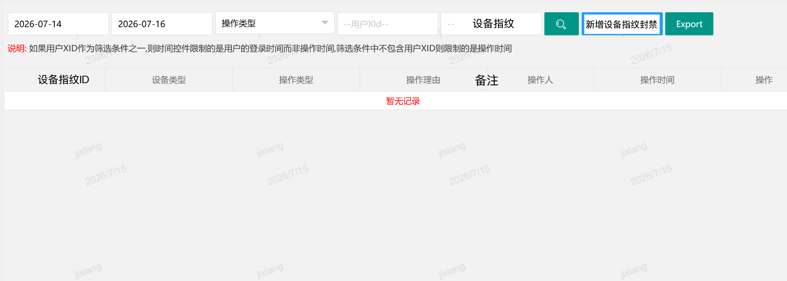

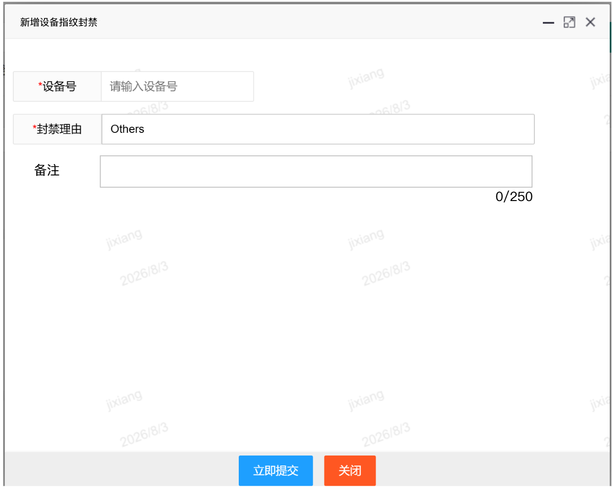

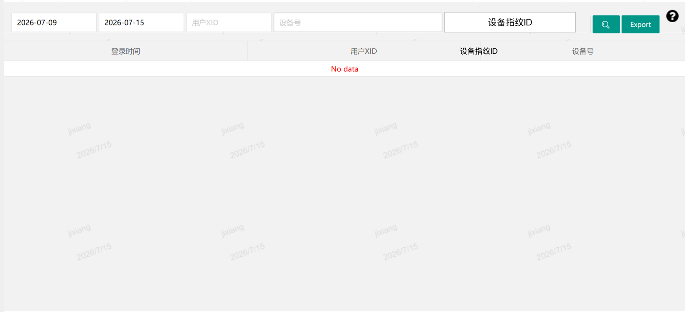

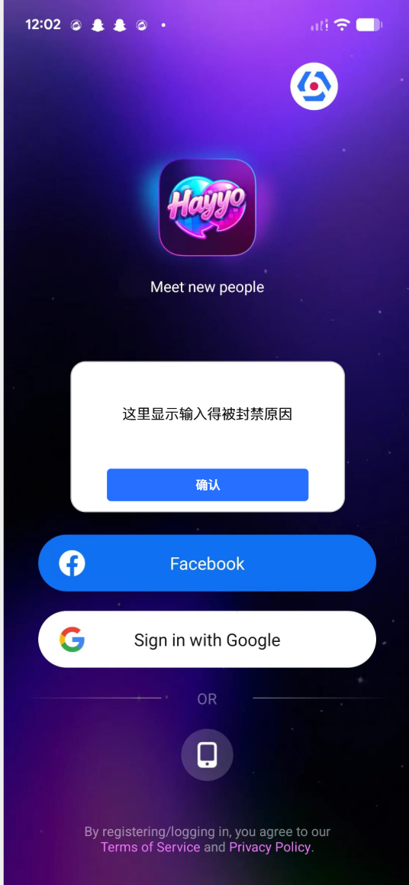

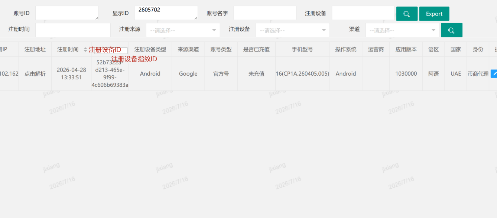

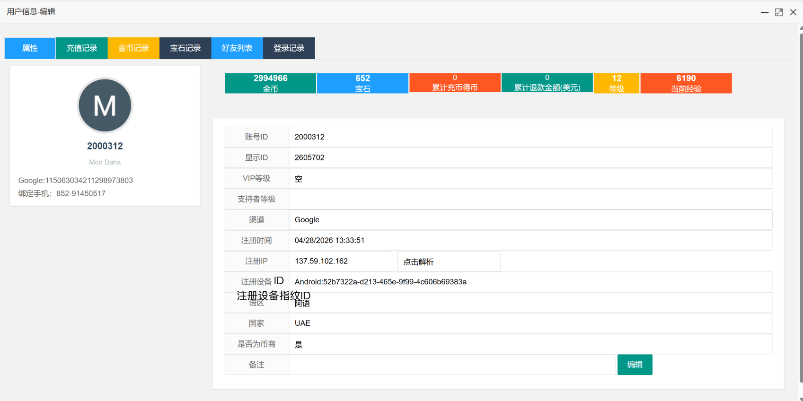

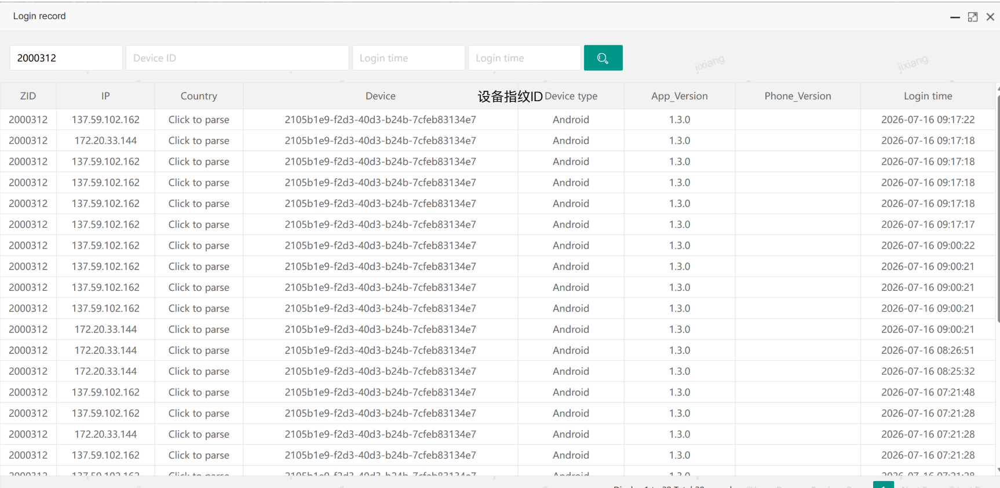

3.5.4 V1.3.0已开发未测试后台需求（及祥）

| 功能名称 | 1.3.0已开发未测试后台需求 |
|---|---|
| 优先级 | 高 |
| 功能描述 | / |
| 输入/前置条件 | / |
| 需求描述 | 3.4.2.1休闲游戏数据3.4.2.4休闲游戏对局明细后台详见：【金山文档 | WPS云文档】 【PRD】Hayyo v1.3.0需求文档定稿https://365.kdocs.cn/l/cu6OXsl03IeR |
| 补充说明 |  |

3.5.5 活动后台增加礼物面板活动配置（及祥）

| 功能描述 | 活动配置新增礼物面板活动配置礼物配置增加活动ID关联功能 |
|---|---|
| 优先级 | 高 |
| 输入/前置条件 |  |
| 需求描述 | 活动配置后台新增礼物面板选项该配置同房间侧边配置相同，仅移除活动时间选项，配置完成礼物面板不显示此活动信息，需要运营配置活动礼物标记时关联活动ID后显示礼物配置面板活动标记配置优化活动标记选择时可选择勾选活动ID，活动ID仅可关联已配置的礼物面板活动ID，其他位置活动ID无效 |
| 输出/后置条件 |  |
| 补充说明 |  |

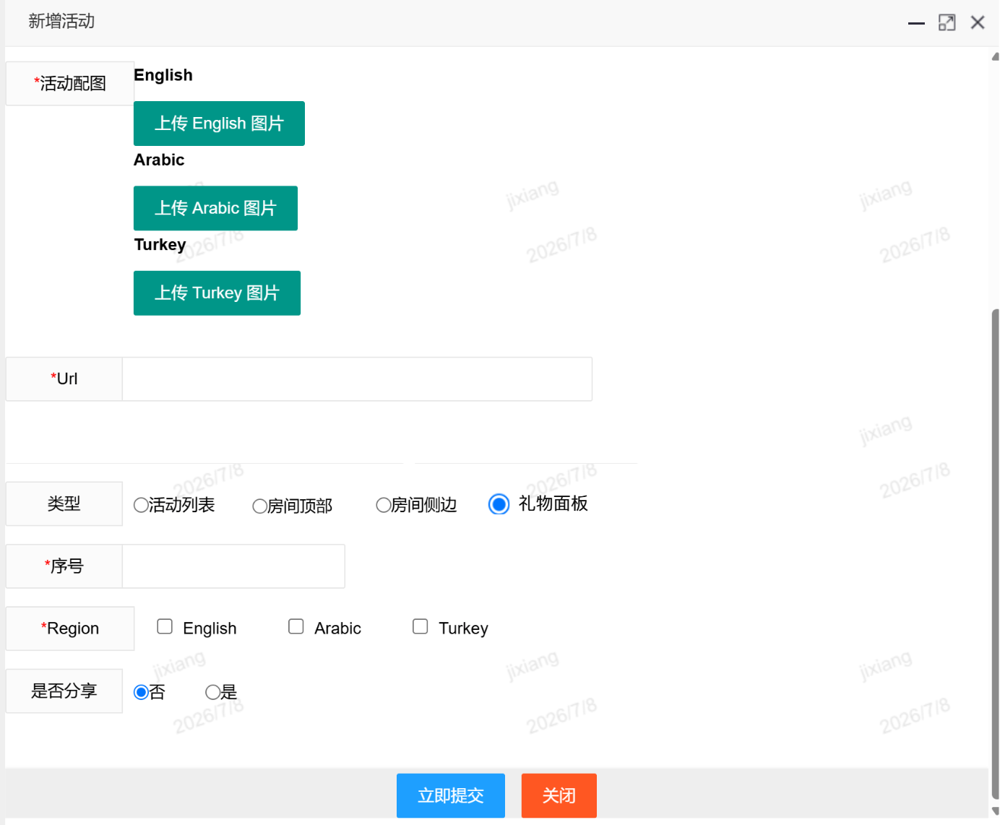

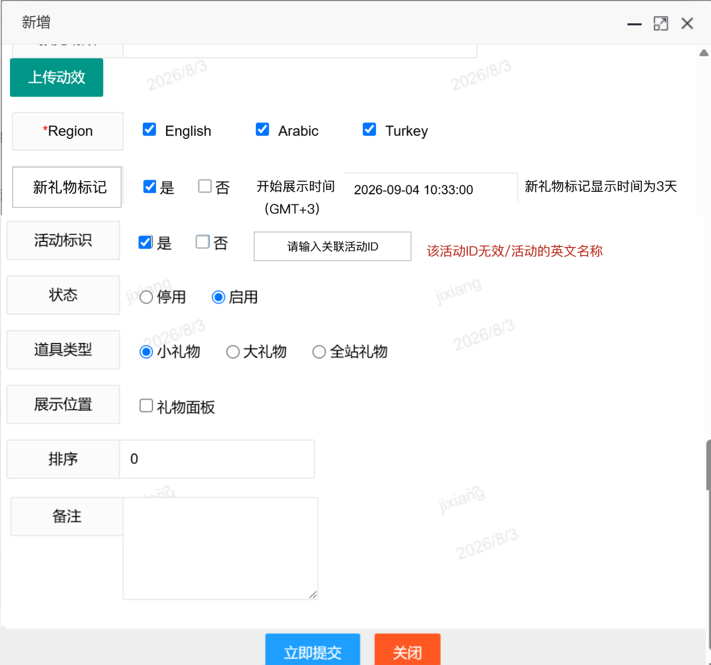

3.5.6 礼物配置面板（及祥）

| 功能描述 | 1.礼物配置面板增加新礼物勾选配置 |
|---|---|
| 优先级 | 高 |
| 输入/前置条件 |  |
| 需求描述 | 礼物配置新增字段1.新礼物标记仅新增礼物时可以设置新礼物标记选择是的时候，需要设置新礼物标记显示时间，设置后时间到了中后设置显示天数编辑模式下，新礼物标记选择不可点 |
| 输出/后置条件 |  |
| 补充说明 |  |

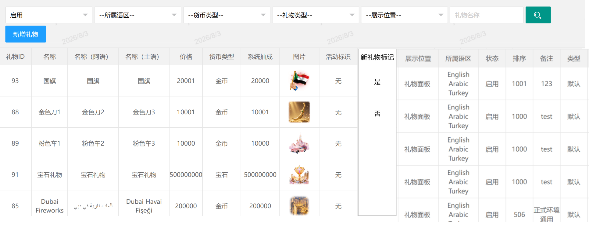

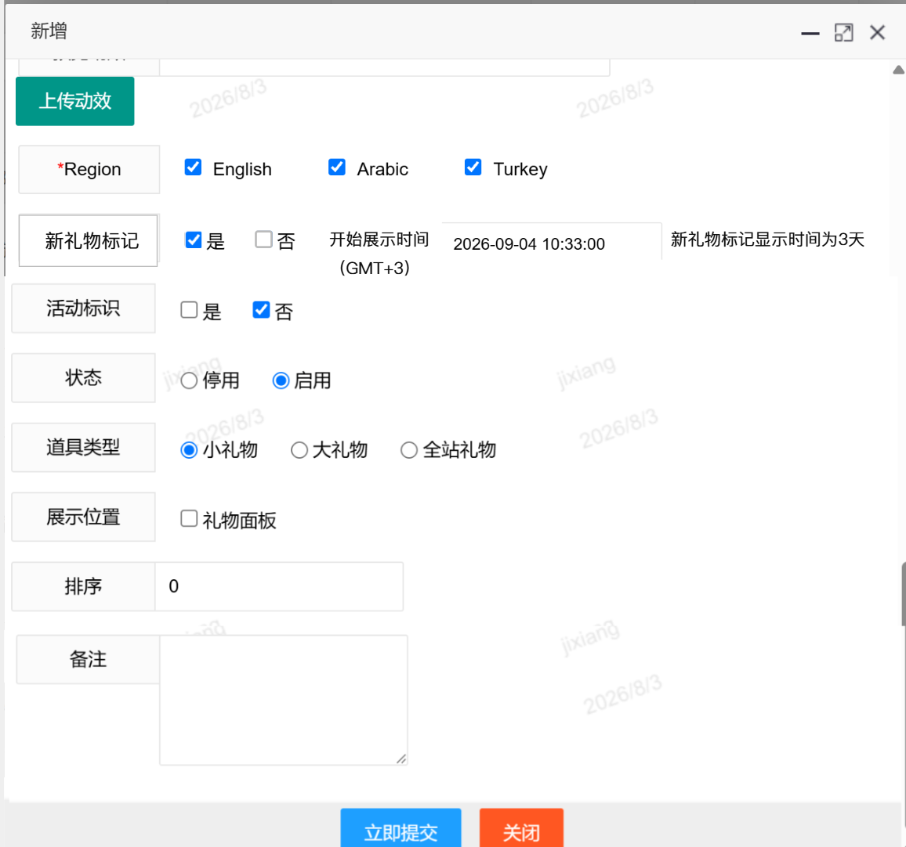

3.5.7 活动banner支持仅预发配置需求（许静）

为配合后续活动上线，banner以及activity配置新增“仅预发环境显示”字段，用于控制banner和activity只在预发环境显示，方便测试（activity不需要对系统消息、离线消息特殊处理）

@姚泽 @周茹

3.5.8 official消息支持图文发送（及祥）

| 功能名称 | official消息支持图文发送 |
|---|---|
| 优先级 | 高 |
| 功能描述 | / |
| 输入/前置条件 | / |
| 需求描述 | 需求路径：需求路径：平台配置-消息管理-official/Agency消息需求描述：公告内容增加图文公告形式新增字段：信息形式：增加在公告内容上方。默认为文本、可选择图文1.文本模式与之前一致最大支持500字符2.图文形式：文字内容编辑上方增加信息形式选择，勾选图文消息后变更为下图样式，支持图文混编，每种语言最多可以配置一张图文本输入上限：保持原500字符得输入上限图片上传限制：单张图小于5M，超出后上传失败图片上传入口旁显示文字提示：图片过大。消息样式：见需求3.3.11official消息格式支持 |
| 补充说明 |  |

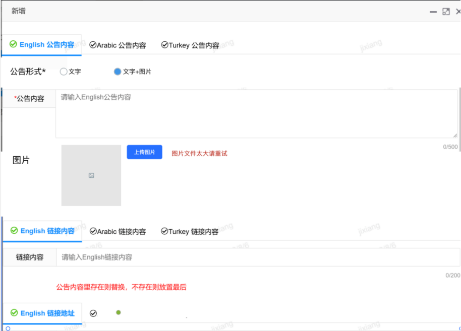

3.6 (安卓)礼物面板调整(及祥)

3.6.1面板介绍与礼物赠送数量选择功能

| 功能描述 | 礼物面板调整 |
|---|---|
| 优先级 | 高 |
| 输入/前置条件 |  |
| 需求描述 | 需求描述：旧版本兼容，需要保证旧版本用户使用不受影响 图1 图2面板介绍1礼物接收对象选择区：在礼物面板最顶端，默认状态为赠送全麦（如图1所示），该区域左侧显示用户信息明细，右侧显示全麦或者全房间赠送按钮，每次选择全房间全麦时会有气泡提示气泡显示时间2秒。2.礼物分类导航：此区域不变，分类展示依次为：经典、VIP、爆奖、背包礼物、道具背包礼物说明交互调整：礼物说明区域保持不变，交互做出以下调整向上滑动礼物列表时 滑动距离超过礼物说明高度后，礼物说明向上跟随滑动出场当滑动礼物面板操作结束时 礼物说明由上滑动入场覆盖在礼物上方向下滑动礼物列表时 滑动距离超过礼物说明高度后，礼物说明向上移动出场当滑动礼物面板操作结束时 礼物说明由上滑动入场覆盖在礼物上方礼物选择交互：切换tab、关闭礼物面板再次打开礼物面板定位关闭礼物面板前的礼物选择与数量选择状态，离开房间后面板销毁并重置礼物选择状态4.礼物标记：New标记：根据后台配置展示礼物角标：礼物角标由之前只显示一个变更为最多支持展示3个如有超过3个角标则只显示前3个，同一个礼物有多个角标时，角标排序为：活动礼物标记、周星礼物标记、爆奖礼物标、全站礼物标记，二次点击展示礼物标记再次点击选中礼物打开礼物说明5.礼物展示区：由左右滑动切换更改为上下滑动切换，滑动展示右侧进度条，滑动移动倍率同手指滑动距离一致左右滑动切换礼物tab财产展示区域：财产展示区默认展示在左上角，若有首充标记则显示在金币余额后点击财产区域打开首充、若无首充入口为向右的箭头点击财产区域打开充值页面，选中宝石礼物后， 财产区域由显示金币信息切换为宝石的余额，点击打开宝石页面如图1所示6.礼物赠送数量选择区：数量选择仅改UI，其他不做调整选则送礼对象、礼物与礼物数量后点击send按钮发送礼物7.礼物面板道具背包弹窗兼容调整调整在礼物面板打开道具背包时，道具背包弹窗继续覆盖在礼物面板上方，礼物面板高出道具背包得部分隐藏，道具背包弹窗小时后显示 |
| 输出/后置条件 |  |
| 补充说明 |  |

3.6.2礼物接收对象面板状态

| 功能描述 | 礼物接收对象面板状态 |
|---|---|
| 优先级 | 高 |
| 输入/前置条件 |  |
| 需求描述 | 礼物接收对象选择入口：点击礼物面板图标打开此页面 图1 图2礼物赠送对象默认选择赠送全麦1）全麦模式说明：采用快照功能以每次打开礼物面板刷新、全房切换全麦模式时获取房间内在麦用户信息（若礼物赠送人在麦则不展示礼物赠送人头像）用户打开礼物面板默认打开此页面如图1所示，礼物接收对象默认选择全麦，礼物接收对象选择面板展示麦上用户头像与所在麦位序号2）点击已选择头像位置取消选中此时模式变为自由选择模式，此状态选中所有麦上用户时变更为全麦模式，若自由选择模式时点击全麦变为赠送全麦、再次点击全麦回到自由选择模式时选择得状态3）全麦模式下，再次点击全麦选择按钮时按钮变为取消选中状态，此时送礼对象选择均为未选中状态4）送礼对象选择区域 麦上用户头像区域支持向左右滑动5）关闭礼物面板再次打开时恢复默认状态6）原礼物送出效果不变，详情见下表自由选择状态时，根据礼物接收对象数量展示不同数量得礼物跑道，若同时赠送7人则按麦位顺序排列显示对应送给7个人得礼物跑道并显示多条礼物公聊区消息若触发礼物全站广播则显示多条礼物送出全站广播礼物送出场景，在满足对应跑道、公聊区信息、全站礼物广播场景下礼物送出形式礼物跑道公聊区全站礼物/指定金额全站广播指定用户显示1条送给指定用户的礼物跑道显示1条送给指定用户的信息显示1条送给指定用户的礼物广播全麦显示1条送给全麦用户的礼物跑道显示1条送给全麦用户的信息显示1条送给全麦用户的礼物广播全房显示1条送给全房用户的礼物跑道显示1条送给全房用户的信息显示1条送给全房用户的礼物广播自由选择(新增)按礼物送出顺序显示多条礼物送出的礼物跑道按礼物送出顺序显示多条礼物送出信息全站礼物按礼物送出顺序显示多条礼物的礼物广播金额需要单人满足条件后按顺序显示多条7）若礼物接收对象离开房间保持原有逻辑 对该用户得送礼失败2.自由选择状态：全麦模式下点击全麦按钮或者取消选中任意对象后解除全麦状态，点击对应麦上用户头像区域选中或者取消选中麦上用户自由选择状态时，礼物数量显示选项同单人选项一致3.指定用户状态：发起入口：用户资料卡资料页、im聊天页、快捷送/回礼按钮选中单一用户时礼物接收对象选择区栏变成图5状态，关闭礼物面板再次 打开恢复至默认状态备注：若礼物接收对象离开房间则给与提示该用户已不再房间并恢复至默认状态 图3 图4无人在麦如图4无人在麦：无礼物接收人在麦时：打开礼物面板、切换回全麦模式。显示无礼物接收人在麦无人在麦时用户点击Send按钮给与送礼者提示，无礼物接收人在麦 图5 图65.全房间状态：当用户点击全房间按钮时，给与一个气泡提示，气泡提示显示2秒，并且显示文字送给全房间用户。点击全麦时也有对应提示显示方式一致。6.空状态房间内无人，且取消选择全麦状态时，礼物选择对象区域显示无礼物接收人在麦文字7.私聊页面礼物接收面板状态私聊页面中礼物面板不展示礼物对象选择区域 |
| 输出/后置条件 |  |
| 补充说明 |  |

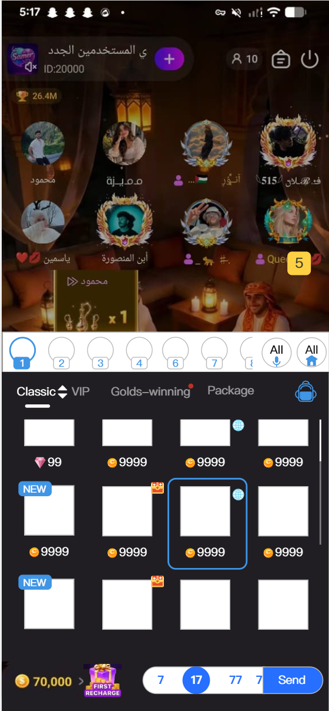

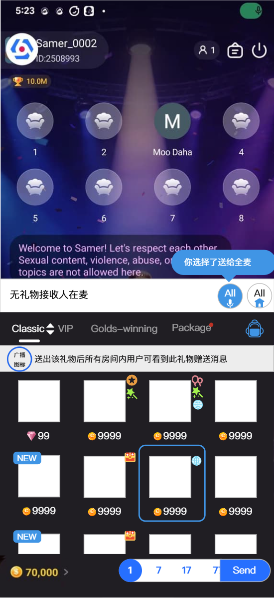

3.6.3活动礼物与周星活动展示

| 功能描述 | 礼物面板活动礼物与周星活动显示调整 |
|---|---|
| 优先级 | 高 |
| 输入/前置条件 |  |
| 需求描述 | 图1 图2活动礼物与周星活动展示1.活动礼物：选中活动礼物后礼物面板顶部新增活动banner入口，banner根据后台配置显示，点击banner打开活动页面2.周星礼物：取消周星礼物的常态化入口，改为选中周星礼物时展示周星礼物活动banner，点击打开周星活动页若该礼物同时为活动礼物与周星礼物，则优先展示活动礼物banner |
| 输出/后置条件 |  |
| 补充说明 |  |

3.6.4经典礼物列表价格筛选功能

| 功能描述 | 礼物价格筛选 |
|---|---|
| 优先级 | 高 |
| 输入/前置条件 |  |
| 需求描述 | 图1 图2图3礼物价格筛选,已选中classic tab时显示默认状态， 再次点击classic tab切换礼物列表价格筛选状态状态显示顺序：默认状态-价格由高到低-价格由低到高 可循环切换选择默认状态无气泡提示、选择价格由高到低与价格由低到高时出现气泡提示，气泡显示2秒礼物价格选择状态关闭礼物面板重置礼物价格选择不区分金币与钻石礼物，按照礼物设定数字进行低到高、高到低排序，礼物价格相同时根据礼物的排序值大小进行排序，越小越靠前 |
| 输出/后置条件 |  |
| 补充说明 |  |

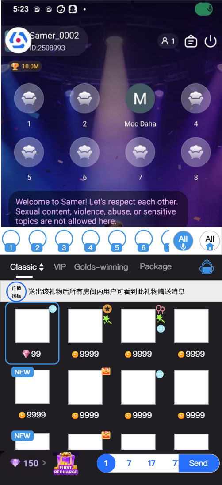

3.6.5VIP礼物说明

| 功能描述 | VIP礼物说明展示调整 |
|---|---|
| 优先级 | 高 |
| 输入/前置条件 |  |
| 需求描述 | 图1 图2VIP礼物说明：1.用户未解锁VIP礼物时：选中对应VIP礼物，礼物说明区显示成为VIP解锁礼物赠送权限，点击更多打开VIP页面。点击赠送与之前一致打开VIP弹窗2.用户解锁VIP礼物时：具有该礼物赠送权限后，选中对应礼物展示新VIP礼物说明礼物说明显示用户当前VIP图标、当前VIP经验、还需要多少经验升级至下一级VIP，当用户VIP为最高级时显示需要保级的经验与经验条，若满足保级经验则需要经验数值为0，点击更多打开VIP页面 VIP弹窗 VIP页面3.VIP体验券使用时礼物说明样式当用户使用VIP体验券时，礼物说明不显示图2信息显示VIP体验券使用信息，内容为：当前使用体验券VIP等级图标与体验券剩余时间，点击礼物说明打开VIP页面VIP体验卡时间显示规则（引用V1.1.0版本需求3.6.11 VIP体验券）剩余时间N剩余时间格式举例0<N<=1分钟1分钟剩59秒内，则显示1分钟1分钟<N<=1小时X分剩20分24秒，则显示20分1小时<N<=1天X小时剩2小时24分20秒，则显示2小时N>1天X天 X时/分剩620天0小时24分20秒，则显示620天剩620天2小时24分20秒，则显示620天则显示620天 |
| 输出/后置条件 |  |
| 补充说明 | 礼物面板VIP信息刷新规则：每次打开礼物面板、充值后、VIP升级/降级时 |

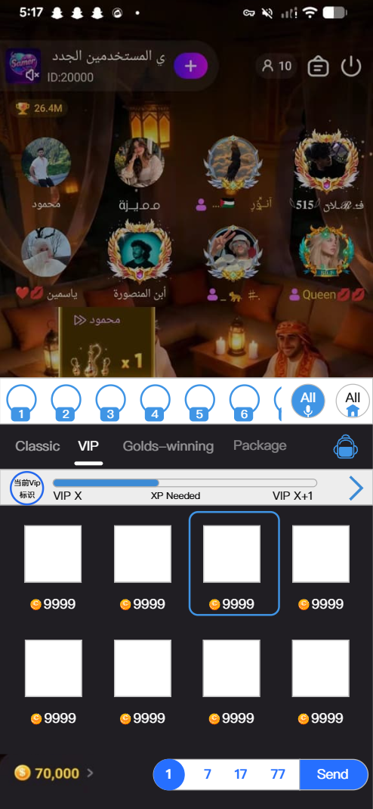

3.6.6背包礼物调整

| 功能描述 | 背包礼物呈现样式调整 |
|---|---|
| 优先级 | 高 |
| 输入/前置条件 |  |
| 需求描述 | 图1背包礼物调整背包礼物新获得礼物标记展示在左上角，礼物过期时间位置保留在左上角显示规则不变，新获得礼物标记展示与消失逻辑不做调整背包礼物增加礼物角标显示，礼物角标在礼物道具右上方，道具数量显示变更至礼物图片中间偏下 |
| 输出/后置条件 |  |
| 补充说明 |  |

3.6.7礼物面板引导调整

| 功能描述 | 礼物上新版本更新礼物面板引导调整 |
|---|---|
| 优先级 | 高 |
| 输入/前置条件 |  |
| 需求描述 | 图1 图2礼物引导1.新上礼物引导：礼物面板中有新礼物时，用户进入任意房间、IM页礼物赠送入口展示New标记，用户打开礼物面板后外部标记消失。新上礼物得分类右上角展示红点标记，点击对应分类标记消失。新礼物礼物面板礼物左上角展示New标记,标记显示时间由后台配置，选中对应礼物后New标记隐藏，切换至其他礼物时New标记重新显示 图3 图4 图52.版本更新与新用户引导：此版本上架用户更新后/或者新用户注册首次进入房间的用户，礼物面板引导调整为此样式礼物引导显示逻辑与旧版本一致，用户首次在房间内打开礼物面板展示3步引导，再次在私聊页打开礼物面板不展示礼物引导。用户首次在私聊页打开礼物面板展示2步引导（无礼物接收对象选择引导步骤），进入房间后首次打开礼物面板时展示3步礼物引导 |
| 输出/后置条件 |  |
| 补充说明 |  |

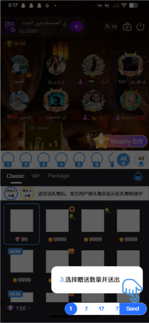

3.7 第七部分 埋点需求@曹敏

详见以下链接：

https://365.kdocs.cn/l/cbSRmBnKkeZh

3.8 第八部分 拉新页面优化需求

【PRD】Hayyo v1.4.0拉新需求文档

https://365.kdocs.cn/l/cvcRxuzO822v
