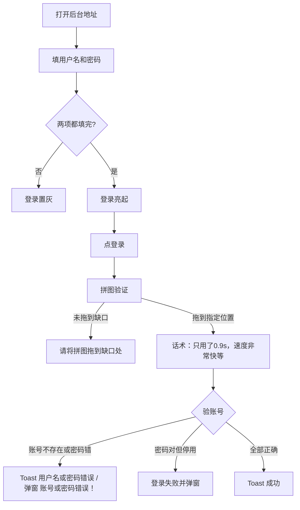

# 运营后台 · 现行说明

> 派生阅读层，不是 Word 原文，也不是权威 [`../PRD.md`](../PRD.md)。  
> 基于已收录主线 **V1.4.0**。改规则仍改 `PRD.md`。本文只给人读「现在后台怎么配」，并按标记切块。  
> 配置项、字段、权限、列表以本文为准。App 交互与业务公式见对应客户端 `brief/current.md`，本文只指针。

## 元信息
<!-- chunk:no -->

| 字段 | 值 |
|---|---|
| 功能 ID | `admin` |
| 截止版本 | 已收录 V1.4.0 |
| 权威 | 派生；冲突以 `PRD.md` 为准，拍板见 [`../../../CONFIRMED.md`](../../../CONFIRMED.md) |
| 状态 | pending-review |

---

## 范围
<!-- chunk:default section=scope id=admin.scope -->

覆盖：`Aold_D` 内 V1.0.0 后台全集、V1.1.0 客户端文档「第七部分后台需求」、V1.3.0 后台专章、V1.4.0 定稿后台章、Payout、拉新奖励组、版本外后台 2.0。

权威分工：后台页面、字段、权限、列表、配置项以 `admin/PRD.md` 为准。App 交互与展示以对应功能 `PRD.md` / `brief/current.md` 为准。同一条业务公式全文只留在定义侧（配置项在本文，客户端效果在功能 brief），另一侧只用链接。

纯后台能力（登录、角色、多数报表、操作审计）不向客户端功能挂指针。未收入版本或原文未写的接口/字段：不编造。工作区 V1.5.0 不是现行。

---

## 关联客户端

改后台菜单读本文对应页面；改 App 功能读对应客户端 brief。对照总表见 [`../../../INDEX.md`](../../../INDEX.md)。

### 关联 · 房间 {#related-room}
<!-- chunk:related-row section=related id=admin.related-room target=room -->

房间管理、礼物、爆奖、房间侧边栏活动。跳转 [`../../room/brief/current.md`](../../room/brief/current.md)。后台页 `{#admin-rooms}` `{#admin-gifts}` `{#admin-gift-burst}` `{#admin-activity}`。

### 关联 · 房间列表 {#related-room-list}
<!-- chunk:related-row section=related id=admin.related-room-list target=room-list -->

官方房 / 运营房配置。跳转 [`../../room-list/brief/current.md`](../../room-list/brief/current.md)。后台页 `{#admin-rooms}`。

### 关联 · 房间游戏 {#related-room-game}
<!-- chunk:related-row section=related id=admin.related-room-game target=room-game -->

水果机 / 动物机统计。跳转 [`../../room-game/brief/current.md`](../../room-game/brief/current.md)。后台页 `{#admin-room-game}`。

### 关联 · 休闲游戏 {#related-casual-game}
<!-- chunk:related-row section=related id=admin.related-casual-game target=casual-game -->

休闲数据 / 配置 / 门票 / 对局明细。跳转 [`../../casual-game/brief/current.md`](../../casual-game/brief/current.md)。后台页 `{#admin-casual-game}`。

### 关联 · 排行榜 {#related-ranking}
<!-- chunk:related-row section=related id=admin.related-ranking target=ranking -->

排行榜后台分类与列表。跳转 [`../../ranking/brief/current.md`](../../ranking/brief/current.md)。后台页 `{#admin-stats-ranking}`。

### 关联 · 商城 {#related-mall}
<!-- chunk:related-row section=related id=admin.related-mall target=mall -->

商城商品 / 分类 / 展示，商品 / 靓号赠送。跳转 [`../../mall/brief/current.md`](../../mall/brief/current.md)。后台页 `{#admin-mall}` `{#admin-grant}`。

### 关联 · VIP {#related-vip}
<!-- chunk:related-row section=related id=admin.related-vip target=vip -->

VIP 功能后台与 VIP 赠送。跳转 [`../../vip/brief/current.md`](../../vip/brief/current.md)。后台页 `{#admin-vip}` `{#admin-grant}`。

### 关联 · 币商 {#related-merchant}
<!-- chunk:related-row section=related id=admin.related-merchant target=merchant -->

币商开通 / 加减币 / 灰白名单 / 冻币。跳转 [`../../merchant/brief/current.md`](../../merchant/brief/current.md)。后台页 `{#admin-merchant}`。

### 关联 · 金币充值 {#related-recharge}
<!-- chunk:related-row section=related id=admin.related-recharge target=recharge -->

货币管理 / 补单，以及补单系统消息。跳转 [`../../recharge/brief/current.md`](../../recharge/brief/current.md)。后台页 `{#admin-currency}` `{#admin-recharge-msg}`。

### 关联 · 消息 {#related-messaging}
<!-- chunk:related-row section=related id=admin.related-messaging target=messaging -->

消息 / 广播 / 文案 / Official 图文，补单触发系统消息。跳转 [`../../messaging/brief/current.md`](../../messaging/brief/current.md)。后台页 `{#admin-msg}` `{#admin-recharge-msg}`。

### 关联 · 拉新 {#related-referral}
<!-- chunk:related-row section=related id=admin.related-referral target=referral -->

拉新开关、周期、阶梯、奖励组、导出。跳转 [`../../referral/brief/current.md`](../../referral/brief/current.md)。后台页 `{#admin-referral}`。

### 关联 · 积分提现 {#related-payout}
<!-- chunk:related-row section=related id=admin.related-payout target=payout -->

积分与提现审批、配置、统计、个人积分。跳转 [`../../payout/brief/current.md`](../../payout/brief/current.md)。后台页 `{#admin-payout}`。

### 关联 · 签到与任务 {#related-checkin-task}
<!-- chunk:related-row section=related id=admin.related-checkin-task target=checkin-task -->

签到奖品配置与任务统计。跳转 [`../../checkin-task/brief/current.md`](../../checkin-task/brief/current.md)。后台页 `{#admin-checkin}` `{#admin-stats-task}`。

### 关联 · 福利券 {#related-coupon}
<!-- chunk:related-row section=related id=admin.related-coupon target=coupon -->

体验券配置 / 使用记录 / 发放体系。跳转 [`../../coupon/brief/current.md`](../../coupon/brief/current.md)。后台页 `{#admin-coupon}`。

### 关联 · 渠道埋点 {#related-channel-tracking}
<!-- chunk:related-row section=related id=admin.related-channel-tracking target=channel-tracking -->

渠道报表。跳转 [`../../channel-tracking/brief/current.md`](../../channel-tracking/brief/current.md)。后台页 `{#admin-stats-channel}`。

### 关联 · 登录注册 {#related-auth-login}
<!-- chunk:related-row section=related id=admin.related-auth-login target=auth-login -->

用户管理 / 封禁弱关联。跳转 [`../../auth-login/brief/current.md`](../../auth-login/brief/current.md)。后台页 `{#admin-users}`。

### 关联 · 个人中心 {#related-profile}
<!-- chunk:related-row section=related id=admin.related-profile target=profile -->

用户管理 / 封禁 / 冻币 / 禁言。跳转 [`../../profile/brief/current.md`](../../profile/brief/current.md)。后台页 `{#admin-users}`。

### 关联 · 品牌更新 {#related-app-branding}
<!-- chunk:related-row section=related id=admin.related-app-branding target=app-branding -->

更新弹窗语区、活动 / Banner。跳转 [`../../app-branding/brief/current.md`](../../app-branding/brief/current.md)。后台页 `{#admin-update-popup}` `{#admin-banner}`。

---

## 废止清单
<!-- chunk:default section=abolished id=admin.abolished -->

检索到下列主题时按废止处理，不把叠稿当现行：

- 主播管理 / 工会 · 家族后台：废止（RQ-07）。叠稿仅删除说明，无独立锚点。
- 贵族商品 / 贵族赠送：废止（RQ-02）。付费身份只走 VIP，见 `{#admin-vip}`。
- Agency 消息 / 币商 WhatsApp / 群发 / 自动回复：废止（RQ-15）。
- Banner 类型：主播中心 / 主播 / 工会 / 游戏删除；跳转删除代理列表页。
- 货币类型删除钻石；宝石兑换删除，宝石按平台免费币。
- 用户列表去掉 Game Ban；加币原因删除「工资抵扣」「公会薪资重置」。
- 原文菜单名「公会管理」不作现行。

---

## 后台页面
<!-- chunk:no -->

按后台页面切块。已有 PRD 锚点（`admin-*`）与本文 `{#…}` 同名。统计报表多数没有独立 PRD 锚，使用 `stats-*`。几行增量并进父页。

### 登录主页 {#admin-login}
<!-- chunk:default section=page id=admin.login -->

打开后台地址进入登录页，复用 ludo 后台登录模块。页标题为「Hayyo 后台管理登录」。填写用户名、密码；两项都填完后 [登录] 亮起可点。点 [登录] 先出拼图验证弹窗（弹窗组件）：把滑块拖到指定位置即完成验证，并提示「只用了0.9s，速度非常快等话术」；未拖到指定位置则提示「请将拼图拖到缺口处」。

验证通过后再验用户名、密码。用户名或密码错误：【Toast】「用户名或密码错误」；点 [登录] 判定账号不存在或密码错误时，另有【弹窗1】「账号或密码错误！」。全部填写正确：【Toast】「成功」。密码正确但账号已停用：登录失败并弹窗提示（弹窗正文原文未写）。密码限制：2 分钟内只能错 2 次（原文：「密码限制2分钟能只能错2次」）；第三次起如何处理原文未写。

账号密码输入规则：用户名不超过 30 位、必填。密码 8–30 位、必填，必须包含特殊的大小写字母和数字字符；以「·」加密输入显示。纯后台，无客户端挂接。

### 修改密码与退出登录 {#login-password}
<!-- chunk:default section=page id=admin.login-password -->

页面右上角显示用户名（账户姓名）。鼠标点开展开「退出登录」，移出折叠。点 [修改密码] 打开弹窗；点 [退出登录] 直接退出并进入登录页。

30 天内未修改密码：登录后弹出强制更新密码弹窗；不改密不能做其他操作。弹窗与主动改密为同一套。

弹窗标题「修改密码」。正文展示用户名、邮箱。填写原密码、新密码、确认新密码；填完后 [确定修改] 亮起。点确定修改后：原密码错误，【Toast】「原密码错误」；新密码与确认密码不一致，【Toast】「新密码与确认密码不一致」。校验通过：【Toast】「修改成功！」，退出登录到登录页。

输入规则（均以「·」加密显示）：

- **原密码**：8–30 位，字符，必填，不限。点 [确认] 密码错误时常驻提示「原密码错误！」。
- **新密码**：8–30 位，字符，必填，必须包含特殊的大小写字母和数字字符。失焦校验格式，错误时常驻「仅允许输入数字、大小写英文字母及常规特殊符号」。须符合安全部弱密码规则，不符则常驻「密码过于简单！」。
- **确认新密码**：8–30 位，字符，必填，必须包含特殊的大小写字母和数字字符。失焦校验是否等于「新密码」，否则常驻「与新密码不一致！」。

### 登录异常 {#login-timeout}
<!-- chunk:default section=page id=admin.login-timeout -->

账户无任何请求 2 小时后登录失效。之后进行任何操作，出【弹窗1】：标题「登录失效」，内容「你已长时间无活动，请重新登录」，按钮「关闭」。点 [关闭] 进入登录页。

### 页面模块 {#login-modules}
<!-- chunk:default section=page id=admin.login-modules -->

后台管理中的页面模块，用于配置后台用户可以增删改查的权限。列表字段：编号（顺序递增）、模块名字、样式名称、后台方法名称、修改时间。点新增 / 编辑弹出弹窗；弹窗中**模块名称**必填。删除则删除该条记录。

### 页面菜单 {#login-menus}
<!-- chunk:default section=page id=admin.login-menus -->

后台管理 / 菜单页面。配置页面所属模块、展示顺序及相关展示模式。列表字段：页面名称；页面类型（菜单单独打开 / 普通页面为标签页内打开）；页面地址；排序（大的排在前面，只针对当前层级）；修改时间。点新增 / 编辑打开弹窗。上级菜单为下拉，可选所在层级或下级层级，支持即时搜索。另有图标；模块列表从「页面模块」多选；描述为备注。删除为整条删除。

### 角色管理 {#login-roles}
<!-- chunk:default section=page id=admin.login-roles -->

给对应角色配置可操作权限和可见页面。列表字段：编号、角色名称、状态（启用 / 禁用；禁用状态用户不可用）、修改时间。点新增 / 编辑可设角色名称和状态。生成角色后点「权限配置」打开权限树：支持多选。当前层级点全选，只全选该层级下的全部下级层级内容和模块。

### 管理员管理 {#login-admins}
<!-- chunk:default section=page id=admin.login-admins -->

设置用户为对应管理员。列表字段：编号、用户名（用于登录后台）、邮箱（此前用于验证，当前只作记录）、昵称、是否本地（只用作本站登录）、状态（启用 / 禁用）、角色、修改时间。搜索支持按用户名。角色为下拉单选，用来显示对应角色下的用户。点新增 / 编辑弹出弹窗。点重置密码弹出弹窗：每次点击默认生成新密码，点确定后保存；同时支持手动输入修改。域登陆见 `{#admin-config}`。

### 数据统计 {#admin-stats}
<!-- chunk:default section=page id=admin.stats -->

3.2 覆盖用户统计、房间统计、消费统计、商品统计、礼物计数器、渠道报表、排行榜后台、任务统计、客服处理统计。多数报表纯后台，不向客户端功能挂指针。共性：列表空值不显示字符；有日期列的表按日期倒序、最近在上。废止：房间在线 / 活动运营房去掉游戏房相关统计；新人行为去掉游戏相关统计；宝石兑换删除，宝石按平台免费币。邮件日报（非独立报表页）增加游戏模块（双端）：游戏人数（当日三方休闲游戏点加入且开始、去重）、游戏局数、新用户参与游戏率、新用户参与游戏次留率、活跃用户参与游戏率（参与均须开始游戏、人数去重）。「水果机下注人数」「水果机金币消耗」兼统计 Bounty Racing、Lord of Olympus，字段名不改。

### 新增用户 {#stats-new-users}
<!-- chunk:default section=page id=admin.stats-new-users -->

列表按日期倒序；空值不显字符。默认最近 7 天（不含当天）；时间筛选默认昨日及往前 7 个自然日（含昨日），可自定义起止。语区默认全部，可选阿语、英语、土语。设备默认全部，可选 iOS、安卓（原文亦称「系统」筛选）。渠道按实际推广注册渠道加字段。右上角问号浮层展示字段释义。字段：注册时间、语区、新增注册量（当日注册用户去重、按账号）、进房新增用户、渠道。列表展示土语。

### 活跃用户 {#stats-active-users}
<!-- chunk:default section=page id=admin.stats-active-users -->

默认昨日及往前 30 个自然日（含昨日），可自定义起止。列表按日期倒序。语区默认全部，可选阿语、英语、土语。设备默认全部，可选 iOS、安卓。折线图随勾选字段与筛选变化；进入页默认只勾选第一个业务字段（不含时间、语区、设备）。字段：时间、活跃用户数（当日进过应用的账号去重）、活跃用户_男 / 活跃用户_女（以资料性别为基准）、进房总人数、有效进房人数（当日进任意房间满 3 分钟或有过上麦、房间发言，需埋点，去重）。

### 用户留存 {#stats-retention}
<!-- chunk:default section=page id=admin.stats-retention -->

列表按日期倒序。默认最近 30 天（不含当天）；时间筛选默认昨日及往前 30 个自然日（含昨日）。另有不同留存选择框。语区默认全部；筛选项正文为阿语、英语（标题写增加土语筛选，正文未列土语）。设备默认全部，可选 iOS、安卓。字段：注册时间、新增注册量、X 日后（注册后第 X 天留存率）。

### 用户平台时长 {#stats-platform-duration}
<!-- chunk:default section=page id=admin.stats-platform-duration -->

默认最近 30 天（不含当天）；时间筛选默认昨日及往前 30 个自然日（含昨日）。语区默认全部，可选阿语、英语、土语。设备默认全部，可选 iOS、安卓。右上角「查询单个用户时长」进弹窗，见时长详情。字段：日期、活跃用户数、总使用时长（当日活跃用户使用 App 时长之和，用户去重）、人均使用时长、进房用户数 / 总时长 / 人均时长、上麦用户数 / 总时长 / 人均时长。口径（覆盖同主题）：打开 App 开始计时，进后台仍累计；新用户平台时长与用户平台时长须能显示总时长（分钟），后者另显示人均；新用户窗口由注册 7 日改为注册 3 日内。

### 新用户充值 {#stats-new-user-recharge}
<!-- chunk:default section=page id=admin.stats-new-user-recharge -->

新页面。默认近 30 天（含昨日）。语区默认全部，可选阿语、英语、土语。设备默认全部，可选 iOS、安卓。另有按钮组（原文未写按钮含义）。字段：时间、新增用户数、新用户充值人数、新人首充（当天注册成功用户第一笔充值金额之和）、3 天（注册第二天到第三天之间首次充值的用户数）、X 天、语区、设备。

### 新用户来源 {#stats-new-user-source}
<!-- chunk:default section=page id=admin.stats-new-user-source -->

默认展示昨日。语区 / 设备筛选项同新增用户。字段：日期、语区、来源（手机号、Facebook、Apple、TikTok、Google）、用户数量。标题注明增加来源 Google，TikTok 备选后续会接入。

### 平台日总表 {#stats-platform-daily}
<!-- chunk:default section=page id=admin.stats-platform-daily -->

默认最近 7 天（含昨日）。语区默认全部；筛选项正文为阿语、英语（标题写增加土语筛选，正文未列土语）。设备默认全部。字段：日期、语区、新增注册人数、活跃人数、金币消费人数、首充人数、首充收入（美金）、充值人数、充值收入、进房人数、人均在房时长、进房总次数、活跃房间数、送礼人数（金币+宝石礼物，去重）。

### 平台消耗日总表 {#stats-consume-daily}
<!-- chunk:default section=page id=admin.stats-consume-daily -->

默认最近 7 天（不含当天）。语区默认全部，可选阿语、英语、土语。字段：日期、语区、充值得币、消费总人数、金币总消费、金币礼物消耗人数、礼物总消耗、签到奖励、房主奖励、宝石礼物送礼人数 / 个数、送礼人数 / 送礼个数（金币+宝石礼物）。

### 新人行为统计 {#stats-newcomer-behavior}
<!-- chunk:default section=page id=admin.stats-newcomer-behavior -->

删除当前游戏相关统计。列表按登陆时间倒序，最多 30 条，超出分页；默认当天。字段：日期、新用户、新用户次留%、进房用户及进房次留%、送礼 / 收礼 / 上麦 / 发言用户及对应次留%。次留均为对应人群中第二天登录 App 的人数比；向上取整，最低 0.01%。

### 用户平台时长详情 {#stats-duration-detail}
<!-- chunk:default section=page id=admin.stats-duration-detail -->

用户平台时长页「查询单个用户时长」弹窗。筛选项：起止时间、用户 ID。时间默认昨日及往前 7 个自然日（含昨日）。用户 ID 支持一次多个、最多 10 个，逗号分隔。字段：用户 ID、昵称、该次登录时间、该次登陆总时长 / 进房时长 / 上麦时长。用户每进入一次应用计一次时长。表末行为筛选时间内总时长统计。

### 房间在线统计 {#stats-room-online}
<!-- chunk:default section=page id=admin.stats-room-online -->

删除相关游戏房间。默认当天，每一小时统计一次。时间可自定义起止，跨度无限制。语区默认全部；筛选项正文为阿语、英语（标题写增加土语筛选，正文未列土语）。字段：时间、在线人数、在线房间数据。

### 房间消耗明细 {#stats-room-consume}
<!-- chunk:default section=page id=admin.stats-room-consume -->

默认昨日。语区默认全部；筛选项正文为阿语、英语。字段：日期、语区、房间名称（原文释义为「当天当前时间实时在房房间数」）、房间消费（金币）、房间抽成、房间在线人数、房间消费人数、房间工资。

### 活动房/运营房统计 {#stats-activity-ops-room}
<!-- chunk:default section=page id=admin.stats-activity-ops-room -->

删除游戏相关。默认昨日。房间 ID 精确搜索。房间类型默认全部，可选活动房、运营房、活动且运营房。字段含用户 / 新用户进房人数与时长、上麦、礼物总消费、金币总消费（原文：目前只有礼物消费）。

### 用户充值得币 {#stats-recharge-coins}
<!-- chunk:default section=page id=admin.stats-recharge-coins -->

默认最近 7 天（含当天）。可按用户 ID 查。语区默认全部，可选阿语、英语、土语。支持按当前筛选导出。字段：用户 ID、昵称、注册时间、语区、充值得币（美金充值所得金币）。

### 用户充值日志 {#stats-recharge-log}
<!-- chunk:default section=page id=admin.stats-recharge-log -->

原文功能名误贴「每日任务统计」，以本节标题为准。字段：订单号、三方订单号、第三方商品 ID、商品名称、商品类型（原文：当前目测只有金币）、数量、消费金额（美金）、订单状态（待支付、已支付、支付失败、取消、己完成）、支付类型（Google、iOS、代理、yallapay）、下单 / 支付时间、用户 ID、昵称、是否沙盒、设备号、IP、国家、退单状态。待支付可掉单补单，见 `{#admin-currency}`。

### 用户充值操作日志 {#stats-operation-log}
<!-- chunk:default section=page id=admin.stats-operation-log -->

原文功能名误贴「每日任务统计」，以本节标题为准。筛选 / 字段：日期、用户 ID 搜索、操作内容、设备记录、操作时间。

### 金币统计 {#stats-gold}
<!-- chunk:default section=page id=admin.stats-gold -->

默认最近 7 天（不含当天）。语区默认全部；筛选项正文为阿语、英语。日表字段：日期、语区、当日剩余 / 用户获得 / 系统所得 / 手动加币 / 手动减币（万）。个人详情：用户 ID 必填，未填 toast「请输入用户ID」；时间默认今日；类型默认全部。金币交易类型：活动奖励、后台内部加币、后台减币、掉单补单、房间送礼、房间收礼、领取房间工资。分类明细默认不展示数据。

### 宝石统计 {#stats-gem}
<!-- chunk:default section=page id=admin.stats-gem -->

删除宝石兑换；宝石变更为平台免费币。默认最近 7 天（不含当天）。语区默认全部，可选阿语、英语、土语。日表：当日剩余 / 用户获得 / 用户消耗、详情。详情类型含后台内部加币、后台减币、收礼（无兑换）。

### 礼物统计 {#stats-gift}
<!-- chunk:default section=page id=admin.stats-gift -->

按销量高在前。默认近 7 天（不含当天）。货币类型保留金币和宝石。列表有本页合计与查询合计。字段：礼物名称、单价、送出用户数、送出数量、消费金币（无钻石礼物）、系统抽成。增量：礼物名称多选；礼物类型多选（普通 / VIP / 爆奖），类型与名称联动。

### 礼物查询 {#stats-gift-query}
<!-- chunk:default section=page id=admin.stats-gift-query -->

默认不展示数据。送出者 ID、接受者 ID、房间 ID 精确查询。字段：送出者、接受者、礼物名称、数量、时间、消费币值、房间号。增量：底部本页合计、查询总计（个数、消费币、系统抽成；金币+宝石）。

### 周星统计 {#stats-week-star}
<!-- chunk:default section=page id=admin.stats-week-star -->

日期：开始与结束。字段：低 / 中 / 高（对应等级的礼物名称）、总计（数量）。原文未另写筛选项细则。

### 商品统计 {#stats-goods}
<!-- chunk:default section=page id=admin.stats-goods -->

标题写增加土语与土语筛选。原文未写字段表，仅标注「筛选」。

### 用户金币流向 {#stats-gold-flow}
<!-- chunk:default section=page id=admin.stats-gold-flow -->

原文功能名误贴「每日任务统计」。原文未写字段表。查询页见 `{#admin-currency}` 金币流向明细。

### 幸运礼物数据统计 {#stats-lucky-gift}
<!-- chunk:default section=page id=admin.stats-lucky-gift -->

列表按创建时间倒序，最多 100 条，超出分页。筛选项：时间、年份段、周期（按幸运礼物场次）、语区（阿语、英语；标题写新增土语，正文未列土语）、初始化。原文未写列表字段释义。

### 礼物计数器数据总览 {#stats-gift-counter}
<!-- chunk:default section=page id=admin.stats-gift-counter -->

路径：数据统计-房间统计-礼物计数器。日期筛选。支持导出。原文未写字段释义。优先级低。

### 客服处理统计 {#stats-customer-service}
<!-- chunk:default section=page id=admin.stats-customer-service -->

筛选项：feedback 或 report 单选，默认 feedback；时间段。列表：日期、账号（仅客服权限后台账号）、处理数（不含 no handle）、no handle 数、超时数（处理时间-创建时间 >20 分钟）、平均处理时间。底部合计。日期+客服账号为一条；数量全 0 也要展示。排序：先日期倒序，再按账号。

### 渠道报表统计日表 {#admin-stats-channel}
<!-- chunk:default section=page id=admin.stats-channel -->

列表按登陆时间倒序，最多 30 条，超出分页；默认昨天。筛选项含用户 ID 精确筛选。原文未写列表字段释义。口径与埋点见 [`../../channel-tracking/brief/current.md`](../../channel-tracking/brief/current.md)，本文不抄 App 公式。

### 排行榜后台 {#admin-stats-ranking}
<!-- chunk:default section=page id=admin.stats-ranking -->

点分类切换列表，字段随榜变化。房间送礼：排名、房间名称、房间 ID、房间金币数（房内送礼金币总和，含房主与用户送礼）。用户送礼：排名、用户昵称、用户 ID、送出金币数。用户充值：排名、用户昵称、用户 ID、充值金币数。每榜最多 200 条；金币数为 0 不展示。筛选固定时间段，默认今天；可选今天/本周/本月（相对实时，误差 1 小时内）与昨天/上周/上月。今日、本周、本月按 GMT+3；统计维度与平台排行榜相同（T+1）。可导出。App 展示见 [`../../ranking/brief/current.md`](../../ranking/brief/current.md)。

### 任务统计 {#admin-stats-task}
<!-- chunk:default section=page id=admin.stats-task -->

含新手任务统计、每日任务统计。日期均为开始–结束筛选。新手任务完成数量：进入一个房间、关注一个房间、房间发言、上麦、关注一个用户、购买金币、绑定手机号、创建自己的房间、修改个人资料。每日任务完成数量：在房间发言 5 条、在麦 5 分钟、在麦 15 分钟、在房间 30 分钟、赠送金币礼物、购买金币。任务规则见 [`../../checkin-task/brief/current.md`](../../checkin-task/brief/current.md)。

### 运营管理 {#admin-ops}
<!-- chunk:default section=page id=admin.ops -->

覆盖后台房间、用户、货币三条运营线。房间类型只有官方房、运营房、币商房。客户端进房、麦位、礼物公式不在此展开，见 [`../../room/brief/current.md`](../../room/brief/current.md)、[`../../room-list/brief/current.md`](../../room-list/brief/current.md)。

### 房间管理 {#admin-rooms}
<!-- chunk:default section=page id=admin.rooms -->

复用 Hayyakom `Manage User/Room - Room List`；另复制一份纯英文页（Hayyakom Audit Room）。空值不显示字符；默认不展示数据；支持分页。图中未写字段不要。

**列表字段：** 房间 ID、房间名称、房主 ZID、房主 XID、房间图片、房间公告、语区（英语 / 阿语 / 土语）、国家、在线人数、热度 & 加值、活动房、是否密码房、房间标签、房间类型（官方房、运营房、币商房）、操作（修改、隐藏房间）。

**筛选：** 语言；房间 ID；房主 ZID；房主 XID；房间类型（全部 / 官方房 / 运营房 / 币商房）。

**修改：** 弹窗改房间信息，含公告。增量：标签图分阿语 / 英语 / 土语三槽，只在对应语区封面展示（原文：土语槽上传后写「只在英语区展示」——按原文，待校对）；展示时间限时或永久。

**密码房：** 点「是 / 否」出设置。有效期：限时（开始时间默认当前、不可改，精确到秒 GMT；范围内房主端出密码房设置入口）或永久。客户端密码房交互见 [`../../room/brief/current.md`](../../room/brief/current.md)。

**隐藏房间：** 隐藏后推荐列表对所有人不可见，关注列表仍可见。弹窗：显示时间（单日 + 时分，默认当前 +6 小时）、选填图、理由下拉、手写原因。隐藏标签下列被藏房间。取消隐藏后房间重新参与推荐排序。

**重置房间：** 可重置房间 ID、昵称、公告、封面。重置类型：封面 / 昵称 / 公告。可设限制再改房间信息的时间范围；须选原因类型。

### 运营房管理 {#rooms-ops}
<!-- chunk:default section=page id=admin.rooms-ops -->

路径：Manage – Manage Room – 运营房管理。按添加时间倒序；每页 50。列表：房间 ID、语区、分类（运营房）、日考核编号、周考核编号、执行人、添加时间、操作（删除）。日考核周期：每日 00:00:00 至周日 23:59:59（GMT+3）。周考核：周一 00:00:00 至周日 23:59:59（GMT+3）。无编号则「配置考核」。筛选：房间 ID；所属语区（默认全部，可选全部 / 英语 / 阿语）。添加弹窗加房间。删除二次确认，可批量。推荐标准设置：配推荐列表运营房数量上限、运营房人数上限 / 下限；文案不用「主播」；增加土语类型。

### 房间考核标准 {#admin-room-kpi}
<!-- chunk:default section=page id=admin.room-kpi -->

路径：运营房管理下「运营房考核标准」「官方房考核标准」。复用 yalla「房间工资」。外链金山 / Google 文档不入库。考核文案「详见翻译文档」→ `needs-input`。每个语区（英语、阿语、土语）可配多套考核，各有唯一编码。

**运营房考核：** 满足条件后，次日定时给**房主**发金币。只对运营房 **A / B** 档生效，**C 档不发**。次日北京时间 10:00 发前一日工资，并带系统消息。文案：`运营房房主xxx，以下为你Y月Y日的房间数据及奖励，请查收！` 字段含进房 / 上麦 / 新用户指标、礼物总消费、Ludo 局数、Donimo 局数、累计获得奖励 Y 金币。Ludo / Donimo 为旧字段名残留，本轮不改映射（`needs-input`）。

**官方房考核：** 满足条件后，次日定时给该房**管理员**发金币。工资 = 官方管理员基本工资 + 官方房考核工资；次日北京时间 10:00 入账并系统消息。增量：列表展示次留率与次留人数；新用户进房人数 = 当日注册且进该房；其余新用户指标 = 注册 3 日内。勾选周考核时隐藏次日留存率配置。多档取最高；每项只发一次。周考核底薪显示 0；配周必须先有日考核。只展示已配日 / 周考核的用户。系统消息见 [`../../messaging/brief/current.md`](../../messaging/brief/current.md)。

### 官方房统计 {#rooms-official-stats}
<!-- chunk:default section=page id=admin.rooms-official-stats -->

路径：数据统计 – 房间统计 – 官方房统计。按日存管理员数据。筛选：日期；语区；房间 ID；日 / 周；导出。字段按当班期间。收礼 / 送礼个数不算宝石礼物。上麦时长 = 下麦 − 上麦，5 分钟刷新。金币总消费含金币礼物 + 掷色子 + 转盘。不抄 App 礼物公式。

### 官方房管理员工作时间 {#rooms-official-hours}
<!-- chunk:default section=page id=admin.rooms-official-hours -->

路径：Manage – Manage Room – 官方房管理 – 管理员配置。筛选项：管理员 ID 模糊搜；语区（语区 / 阿语 / 英语，默认语区）。增量：列表、筛选项、配置页的语区字段生效。新增管理员字段以原型为准（PRD 未逐字段落表）。

### 官方账号添加好友 {#rooms-official-friends}
<!-- chunk:default section=page id=admin.rooms-official-friends -->

复用 yalla「账号添加好友」。按操作时间倒序；每页 50。字段：操作时间、官方 ID、关联好友 ID、操作人。筛选：时间范围；官方 ID。批量添加好友跳转批量页。客户端互关即好友，见 [`../../relationship/brief/current.md`](../../relationship/brief/current.md)。

### 官方管理员配置 {#rooms-official-admins}
<!-- chunk:default section=page id=admin.rooms-official-admins -->

新增：用户 ID（错则 toast「当前用户不存在」）；房间 ID（错则 toast「当前房间不存在」）。列表：用户 ID、房间 ID、用户昵称、添加时间。操作：删除，二次确认。官方账号设语区后须选该语区一个国家；若该账号房间有人，待无人再生效。

### 房间广播 {#rooms-broadcast}
<!-- chunk:default section=page id=admin.rooms-broadcast -->

挂在房间管理目录。复用运营后台「房间广播」。每页 100。筛选：时间段；语区（阿语、英语）。创建：原逻辑上增加土语消息发送。客户端展示见 [`../../room/brief/current.md`](../../room/brief/current.md)。消息管理下房间广播字段见 `{#admin-msg}`。

### 账号信息 {#admin-users}
<!-- chunk:default section=page id=admin.users -->

路径：账号信息列表。来自 ludo「账号信息」。点编辑进详情。列表字段：账号 ID（ZID）、显示 ID（XID）、名字、语言、语区、国家、金币、宝石、等级、身份（普通用户 / 币商代理）、注册来源（PhoneNumber / Facebook / AppleID / Google）、注册 IP、注册地址、注册时间、注册设备 ID、注册设备指纹 ID、设备类型、渠道来源、账户类型（当前仅正常用户）、是否已充值、手机（最近一次机型）、操作系统、运营商、应用版本。是否已充值口径含内购、币商充值、代付链接；新增筛选默认「请选择」。增加性别（取个人主页所选）。编辑可改国家与性别；改国家同步切语区；即时生效。用户端资料见 [`../../profile/brief/current.md`](../../profile/brief/current.md)。后台用户列表「没等级」不当现行。

### 用户信息详情 {#users-detail}
<!-- chunk:default section=page id=admin.users-detail -->

属性：ZID、XID、渠道、注册时间、注册 IP、注册设备、国家、语区、是否为币商、来源。官方账号可指定语区并选该语区国家。充值记录、金币 / 宝石记录、好友列表、登录记录字段见 PRD；好友互关即记，无好友验证、无申请箱。

### 用户列表 {#users-list}
<!-- chunk:default section=page id=admin.users-list -->

用于封禁 / 冻结 / 修改 / 重置。来自 ludo User List。去掉 Endtime of GameBan 与 Action 里的 Game Ban。所有操作写 Action Record。

**Current State：** Unblock（正常）；block（不能登录）；banned（禁私聊、上麦、公屏）；Frozen（冻金币和宝石，不可消费送礼）。

**Action：** block（账号封禁、禁止登录，时长日:时:分、图、理由）；ban（禁言 + 禁上麦 + 禁公屏 + 禁私聊，用户 ID 为 ZID 不可改）；modify（身份与冻币；「修改后 XID」只数字最长 19 位；昵称最长 24 字符；User Type：Normal / Official；Currency Status：Normal / Frozen）；Reset（重置头像为系统头像、昵称为 `player`+{XID}、个签置空；须选重置理由）。

### 设备号封禁 {#users-device-ban}
<!-- chunk:default section=page id=admin.users-device-ban -->

路径：Manage – Manage User – 设备号封禁。封禁及解封须进 Audit 平台操作记录。筛选：设备号（仅精确）；操作者；操作时间；操作类型（解封 / 新增）；关联 ID。可导出。新增：手填设备号；理由必选（与惩罚理由文案配置类型一致）。设备号不存在则不能提交，旁注「该设备号不存在。」每次操作一条新记录，不覆盖。关联 ID 次级页：封禁期间该设备登录过的账号 ID。客户端：封禁期间该设备不能登录；登录态会被踢回首页。Toast 固定「您目前无法进行登录。」见 [`../../auth-login/brief/current.md`](../../auth-login/brief/current.md)。

### 账号封禁查询 {#users-account-ban}
<!-- chunk:default section=page id=admin.users-account-ban -->

复用 Hayyakom「账号封禁」。按创建时间倒序；最多 100 条后自动分页；默认不展示数据。筛选：日期；用户 ID（查出该 ID 30 天内登录过的设备号）；设备号（查出该设备 30 天内登录过的用户 ID）。

### 个人靓号变动记录 {#users-pretty-id}
<!-- chunk:default section=page id=admin.users-pretty-id -->

复用 Hayyakom，放在用户管理目录。字段以原型为准。靓号只后台发放、无头饰卡，见 [`../../mall/brief/current.md`](../../mall/brief/current.md)。

### 设备指纹封禁 {#users-fingerprint}
<!-- chunk:default section=page id=admin.users-fingerprint -->

路径：Manage User – 设备指纹封禁。字段：数盟指纹 ID、设备类型、操作类型、理由、操作人、时间。操作复用设备号封禁。另有「设备指纹风控记录」页。客户端：指纹封禁弹窗加理由（与设备号 toast 不同），见 [`../../auth-login/brief/current.md`](../../auth-login/brief/current.md)。

### 用户网络测试数据 {#users-network}
<!-- chunk:default section=page id=admin.users-network -->

路径：Manage – Manage User – 用户网络测试数据。列表字段以原型为准。时间插件筛选；可按当前筛选导出。

### 申请加减币 {#admin-currency}
<!-- chunk:default section=page id=admin.currency -->

复用 Hayyakom `Recharge golds`。标星必填。货币类型删除钻石。加币原因删除「工资抵扣」「公会薪资重置」。查询币记录弹窗：用户 ID、金币数（扣币为负）、操作人、操作时间。筛选：时间；类型（内部加币 / 对用户的掉单补单 / 对用户币扣除）。批量加水晶：复用批量加金币页。钱包口径见 [`../../recharge/brief/current.md`](../../recharge/brief/current.md)。

### 货币审核记录 {#currency-audit}
<!-- chunk:default section=page id=admin.currency-audit -->

按日期倒序；默认近 7 天（含当天）。字段：货币类型（金币、宝石）；操作类型（加币 / 减币）；操作原因；提交时间 / 人；加 / 减币用户 ID；货币数；处理状态；备注；审批人；审核状态；操作（通过 / 拒绝，按权限）。

### 货币操作查询 {#currency-query}
<!-- chunk:default section=page id=admin.currency-query -->

同审核记录但不含通过 / 拒绝操作列。默认近 7 天（含当天）。

### 退款冻币用户 {#currency-refund}
<!-- chunk:default section=page id=admin.currency-refund -->

默认近 7 天（含当天）。列表：用户 ID、总退款、已扣除、当前欠款金币、VIP 退款金币、退款清币记录入口。筛选含审核状态（审核中 / 已通过 / 未通过 / 已撤回）。清币记录按时间倒序，最多 10 条后分页。

### 自动封号记录 {#currency-auto-ban}
<!-- chunk:default section=page id=admin.currency-auto-ban -->

两个 tab：退款封号列表、解封后 48 小时封号列表。均按登录时间倒序；最多 30 条后分页；默认不展示数据。可按当前筛选导出。

### 用户充值日志补单 {#currency-recharge-log}
<!-- chunk:default section=page id=admin.currency-recharge-log -->

路径：数据统计 – 消费统计 – 用户充值日志。对「待支付」增加掉单补单。点补单 toast「已发起补单」。成功则订单变为「已完成」。失败 toast「补单失败」，按钮保留可再补。

### 金币流向明细 {#currency-gold-flow}
<!-- chunk:default section=page id=admin.currency-gold-flow -->

路径：数据 – 商品统计 – 用户金币流向查询。日期最小单位为日；用户 ID 支持多个；查询与导出。主表及次页：礼物消费、商品消费、游戏消费、其它消费（预留）。字段以原型为准。

### 补单系统消息 {#admin-recharge-msg}
<!-- chunk:default section=page id=admin.recharge-msg -->

后台手动补单成功后，自动给用户 1 条系统消息：`平台已为你的重置进行补单XXX金币。【查看】`。点【查看】跳转金币页。见 [`../../messaging/brief/current.md`](../../messaging/brief/current.md)、[`../../recharge/brief/current.md`](../../recharge/brief/current.md)。

### 平台配置 {#admin-platform}
<!-- chunk:default section=page id=admin.platform -->

3.4 平台配置。后台页：礼物管理、幸运礼物、周星礼物、商城管理、商品/靓号/VIP 赠送；礼物类型含普通、VIP、爆奖。打招呼模板归 `{#admin-msg}`。贵族商品 / 贵族赠送不作现行；Supporter 赠送后台删除。

### 礼物管理 {#admin-gifts}
<!-- chunk:default section=page id=admin.gifts -->

复用 hayyakom「Manage-商品配置-礼物管理」。列表按排序字段从小到大，默认展示全部。字段：名称（英 / 阿 / 土）、价格（金币）、系统抽成（释义：每个礼物抽成比例，默认 100%，可配；新增弹窗默认「70%」，原文两处不一致，待校对）、图片、活动标识、所属语区（公共、英语、阿语、土语）、状态（启用 / 停用，默认启用）、排序（数字越小客户端越靠前）、备注、操作。筛选：启用；语区；货币类型（全部、金币、宝石）；展示位置（礼物面板、不展示）；礼物名称模糊搜索。新增：活动标识、备注选填，其余必填。所属语区默认「公共礼物」。未填完确定 → toast「您还有未填的信息」。提交后自动生成礼物编号。新礼物标记仅新增可设，编辑不可点；选「是」须设显示天数（时长原文不清 → `needs-input`）。编辑：货币类型、礼物类型不可改。VIP 礼物：新增时「礼物类型」增加「VIP礼物」。未勾选展示位置「礼物面板」则该 VIP 礼物不出现在面板。客户端面板见 [`../../room/brief/current.md`](../../room/brief/current.md)。

### 幸运礼物管理 {#gifts-lucky}
<!-- chunk:default section=page id=admin.gifts-lucky -->

列表按添加时间倒序。字段：礼物名称、图片、类型、一级 / 二级 / 三级奖励、操作。新增：礼物从礼物管理全部礼物中选。类型：下下周、下周、本周。奖励：三等奖概率 1～90%、赔率 0–100000；二等奖概率 0～9%；一等奖即全站通知，概率 0～1%。不可修改金币数。

### 周星礼物管理 {#gifts-weekstar}
<!-- chunk:default section=page id=admin.gifts-weekstar -->

字段：礼物名称、图片、类型、操作（删除）。新增：礼物从礼物管理选取；类型：下下周、下周、本周。删除二次确认，确定后 toast「已成功删除」。周星 / 幸运共用筛选：类型默认全部，可选下下周、下周、本周、上周。

### 爆奖礼物 {#admin-gift-burst}
<!-- chunk:default section=page id=admin.gift-burst -->

新增礼物增加类型「爆奖」。该类型销量计入礼物统计。爆奖礼物统计 / 消费统计：分页每页 50；筛语区、礼物名称、日期（统计页跨度 1 年）；可导出。列表字段释义原文未转写。客户端爆奖 tab / 奖池 / 跑道见 [`../../room/brief/current.md`](../../room/brief/current.md)。

### 商城管理 {#admin-mall}
<!-- chunk:default section=page id=admin.mall -->

分类顺序：头像框、座驾、房间背景。无头饰卡。贵族专属商品不在后台配置与展示。筛选：商品名称模糊（英、阿）；商城展示下拉默认全部。列表：商品名称（英文名）；排序（越大越前，最低 0）；图片；价格（第一规格）；规格（第一规格时长，-1 显示「永久」）；商城展示；操作。商城展示只决定是否在商城露出，不影响签到奖品后台、商品赠送后台、用户已获得商品的使用。展示中的商品点编辑不打开弹窗，toast「不支持编辑展示中的商品」。添加 / 编辑：分类写死不可改。名称英 / 阿 / 土最长 30 字符。货币写死「金币」。规格一必填，规格二～四选填；同一规格须都填或都不填，否则「规格配置错误」。添加成功默认不展示。按钮状态：所有人可购买 → Purchase；仅活动可获得 → Obtain；仅展示 → 置灰 Obtain；VIP 专用 → **VIP Exclusive**。客户端见 [`../../mall/brief/current.md`](../../mall/brief/current.md)、[`../../vip/brief/current.md`](../../vip/brief/current.md)。

### 商品赠送 {#admin-grant}
<!-- chunk:default section=page id=admin.grant -->

列表分类切：头像框、座驾、房间背景。筛选：商品名称模糊；日期默认 7 天前～今天。导出当前筛选表数据（不导出图片）。用户 id 最多 10 个，英文逗号分隔。座驾/房间背景/头像框填时长，须正整数，**不可 -1（不赠送永久）**。赠送类型：平台活动奖励、KOL 奖励、代理活动奖励、商务活动奖励。系统消息：「恭喜你获赠奖品{商品名称}」。创建增量：分类改单选，默认座驾；另含气泡框 / 房间标签 / 个人主页装饰 / 包裹礼物。

**靓号赠送：** 发放成功自动系统消息。必填单选「发放业务」：VIP、挖猎、活动、其他。「回收类型」增加「VIP到期回收」。系统消息：发放「平台发放给你一个XXX的靓号，可前往个人主页查看自己的用户ID。」；回收「你的XXX靓号已被平台回收。」；有效期到期「你的靓号XXX已到期，已被自动回收。」房间靓号同步房间标签：1～3→10216；4～7→10217；8→10218；99→10219。

**VIP 赠送入口** 见 `{#admin-vip}`。贵族赠送不作现行。删除 Supporter 赠送后台。

### 平台排行榜白名单 {#platform-rank-whitelist}
<!-- chunk:default section=page id=admin.platform-rank-whitelist -->

路径：manage — manage user — 平台排行榜白名单。新增弹窗增加「备注」（非必填），列表展示备注；新增「操作人」列。

### 币商代理管理 {#admin-merchant}
<!-- chunk:default section=page id=admin.merchant -->

路径：运营后台-币商管理。取消币商代理挂在公会下。WhatsApp / 群发 / 自动回复 / Agency 不作现行。新增代理：输入正确用户 ID 自动带昵称、绑定手机号（未绑定则必填）。服务国家点 + 输入国家英文缩写，多个用 `,`；最多 10 个国家，填写顺序=客户端展示顺序。已是代理 →「当前用户已被设置为币商代理，不可重复设置。[好的]」。用户不存在 →「用户不存在」。保证金必填，允许 ≥0 整数，未填 toast「请填写保证金」。列表：代理 ID、昵称、代理手机号、账号密码（***）、是否在客户端币商代理列表展示（默认勾选）、金币汇率（1 金币=XXX 美金）。删除代理二次确认；确认后历史转账不删，客户端回收「充值代理」权限；有余额则余额清零，仍可删。冻币：冻结后可在币商账户充值，但不能给用户转账（只进不出）。无自动冻币。客户端见 [`../../merchant/brief/current.md`](../../merchant/brief/current.md)。

### 代理金币操作 {#merchant-coin}
<!-- chunk:default section=page id=admin.merchant-coin -->

路径：货币管理-代理金币操作。须已开通代理。操作选项增加「代理加币」。提交时若 ID 不是代理 → toast「该用户不是代理不能进行转账」。审核记录可撤回：撤回后从待审核移除，状态「已撤回」。删除公会 ID。

### 代理转账记录查询 {#merchant-transfer}
<!-- chunk:default section=page id=admin.merchant-transfer -->

筛：转账时间精确到秒；代理 XID 精确；转账用户 XID 精确。可导出。DBA 保存全部；后台可查近 6 个月。

### 平台给代理自动补币 {#merchant-autobuy}
<!-- chunk:default section=page id=admin.merchant-autobuy -->

代理设置增加档位下拉（必填）：87 / 86 / 85 / 84 档。原文标注自动补币仍待定，本页保留不升格 → `needs-input`。

### 代理充值白名单 {#merchant-whitelist}
<!-- chunk:default section=page id=admin.merchant-whitelist -->

默认 30 条，超则分页。白名单用户在客户端充值页或快捷充值弹窗可见「代理充值 Banner」。Excel 导入：第一列用户 XID（必填）、备注（非必填）。

### 币商代理灰名单 {#merchant-greylist}
<!-- chunk:default section=page id=admin.merchant-greylist -->

默认 30 条。灰名单代理在客户端充值页或快捷充值弹窗的代理列表中不可见。导入结构同白名单。

### 管理后台 {#admin-manage}
<!-- chunk:default section=page id=admin.manage -->

3.6 管理后台（不含拉新）。本块纯后台：举报、反馈、敏感词、操作审计。消息见 `{#admin-msg}`；VIP 见 `{#admin-vip}`。

### 举报管理 {#manage-report}
<!-- chunk:default section=page id=admin.manage-report -->

处理客户端举报的用户与房间。列表含 Report Content、Report type（用户 / 房间）、Reported Room/User、操作 result / report history / punished history。被举报房间可 Hide room。被举报用户 Action：no handle / block / ban / reset。Ban：禁止主动上麦、被邀上麦、房内公屏、私聊。Block：踢下线。

### 登陆问题反馈 {#manage-feedback-login}
<!-- chunk:default section=page id=admin.manage-feedback-login -->

操作逻辑不变，增加土语筛选。Language：英语 / 阿语 / 土语。含 Contact Information、Feedback、Feedback image、Other information（软件版本、手机型号、系统版本、网络；取不到不展示）。用手机号登陆出问题从首页提交则带手机号，否则空。

### 应用内问题反馈 {#manage-feedback-app}
<!-- chunk:default section=page id=admin.manage-feedback-app -->

增加土语筛选与回复土语选择。点输入 icon 出回复弹窗，可选回复模板。Adopt 后变为 adopted，完结工单。

### 回复分类与模板 {#manage-feedback-tpl}
<!-- chunk:default section=page id=admin.manage-feedback-tpl -->

三套配置页均增加土语。功能菜单当前只用于 Feedback。列表按排序降序。编辑不可改功能菜单和语区。

### 敏感词管理 {#manage-keyword}
<!-- chunk:default section=page id=admin.manage-keyword -->

关键词管理（增土语）。针对用户：资料名称、个人简介等屏蔽。针对聊天房：房内文字、私聊、房间、用户、相关配置等屏蔽。IsEscape 原文无释义，不编。

### 消息管理 {#admin-msg}
<!-- chunk:default section=page id=admin.msg -->

客户端会话 / 系统消息样式见 [`../../messaging/brief/current.md`](../../messaging/brief/current.md)，本文不抄。

**惩罚理由文案：** 类型仅惩罚。理由类型导入固定、不可编辑。英 / 阿 / 土内容可编辑。主播惩罚次数注释掉。

**惩罚消息文案：** 类型固定不可编辑。类型含：用户头像/昵称/签名修改限制；重置用户签名、头像、用户名；重置房间名、房间头像、房间公告；隐藏房间；封号。

**System 消息推送：** 类型批量 / 全部。批量须导入账号 ID，英文逗号分隔。英语 / 阿语内容改为非必填；列表另有土语内容。过期时间：超过该时间登录不再发。只填某语种则只推给该语种用户。只输入某一语言点发送 →「是否只发送给该单一语区用户群体？」官方消息另支持一次编辑多条图文及跳转；可配 2 组「连接内容」+「连接地址」。

**Official 图文：** 默认文本、可选图文。文本仍 500 字。图文每种语言最多 1 张，单张小于 5M，失败旁提示「图片过大」。不改已有 2 组超链接。

**房间广播：** 字段含 contact、Add time、Timer Time、Total Number of times、Each Number of times、Interval Time（min）、Region（需增土语）、State、Action。删除须二次确认。

**打招呼文案模板：** 客户端点打招呼随机取一条。列表按创建时间倒序，最多 30 条后分页。筛：日期、语区。新增/编辑：对应语区内容；确认立即保存。

### 用户/房间操作记录 {#manage-action-record}
<!-- chunk:default section=page id=admin.manage-action-record -->

记录封禁/解封/冻结/隐藏等。字段：ZID、XID、User Name、Region、Action Type、RoomID、Operator、Operating time、Image、End time of punishment（解封不显示到期）、Reason。Action Type 含 Block/Unblock、Ban/Unban、Frozen/UnFrozen、Reset User Photo/Nickname/Bio、Modify Room Information、Hide/Unhide Room、Reset Room Photo/Notice/Name。

### 平台操作记录 {#manage-plat-record}
<!-- chunk:default section=page id=admin.manage-plat-record -->

默认按操作时间倒序。字段：顺序编号、业务ID、模块类型、变更项、变更前、变更后、操作人ID、操作人、操作时间。无原值或删除未保存则空不显示。

### 身份修改记录 {#manage-identity-record}
<!-- chunk:default section=page id=admin.manage-identity-record -->

记录官方/普通、权限（无/巡管，当前版本暂无巡管）、显示 ID 变更。字段：原XID、修改后ID、姓名、用户身份、账号权限、操作人、操作时间。

### 后台登陆与 DBA 封号记录 {#manage-login-record}
<!-- chunk:default section=page id=admin.manage-login-record -->

后台登陆：按登陆时间倒序，最多 100 条后分页，默认不展示数据。日期筛选。可导出。DBA 封号记录：自动、手动处罚。用户 ID 精确筛选。

### VIP 功能后台 {#admin-vip}
<!-- chunk:default section=page id=admin.vip -->

Manage 下「Manage VIP」：VIP Pool、VIP 升降级记录、VIP 消费数据。去贵族相关。商城按钮状态见 `{#admin-mall}`；VIP 礼物类型见 `{#admin-gifts}`。客户端保级/权益见 [`../../vip/brief/current.md`](../../vip/brief/current.md)，本文不抄财富档数字（原文无表）。

**VIP 赠送：** 创建选赠送等级 1–11，用户 ID 只单个输入。若当前 VIP ≥ 要赠送等级 →「用户VIP等级高于当前要赠送的等级，无法提交」。赠送成功：财富值重置到该级初始，赋予该级，开 30 天新周期，文字消息「你已获赠VIP权益，请前往ME-VIP进行查看」。回收二次确认后结束当前周期，降 VIP0，特权全回收，系统消息「你的VIP权益已被取消」。后台赠送 / 调财富不触发全服飘屏。

**调整 VIP 财富值（单独权限）：** 弹窗输 UID → 展示当前财富值 → 填 0 或正整数 → 二次确认后设定为该值，系统消息「你的VIP财富值已被校正，请前往ME-VIP进行查看」。周期时间不变；若因此升级/降级/保级，走对应逻辑但不发相关通知。填入值大于最高等级保级值：后台可提交，服务端只加到当前最高等级保级线。

**VIP Pool：** 用户第一次成为 VIP 时加入原 KA 计算池。搜索可搜到曾经是 VIP、现在非 VIP 的用户。筛：用户ID（可多 ID）、VIP 等级 1–11、最近充值时间，同时满足才展示。另增列：靓号权益累计充币数；通过 VIP 体系获得的个人靓号、房间靓号（当前拥有且发放业务=VIP）。

**VIP 消费数据：** UID 与 VIP 等级不可同时筛，否则弹「UID搜索与VIP等级不能同时筛选」。须本页合计与查询总计。

**VIP 财富值变化：** 变动类别（充值增加 / 后台调整 / 升级保级降级 / 补单退款）。筛：时间、用户 ID、类别。

### 拉新后台 {#admin-referral}
<!-- chunk:default section=page id=admin.referral -->

C 端与后台订单终态均为「已发放」，不再用「已领取」。后台可保留审核中等内部态。V1.3.0 / V1.4.0 同主题增量已合入本章；旧锚 `#admin-referral-v130` 与本章同文。App 人数奖、绑定窗口等客户端算法见 [`../../referral/brief/current.md`](../../referral/brief/current.md)，本章不抄。本章原文未写绑定白名单配置页，不编。删除绑定后「注册 48 小时内依旧可以重新绑定」写在后台删除流程里，算法细节仍以客户端 brief 为准。

**开关（功能配置 · 拉新奖励通用配置）**  
功能名称目前仅「个人分享入口」「分享团队入口」；页面状态开/关，默认开；只控制客户端入口是否展示。周期另有显示开关（默认开）：只控制对应页是否展示，不影响业务与进度。人数类活动另有领取开关（默认开）：关则不可领取。充值类订单处理模式默认自动。

**奖励组**  
通用奖励组、新用户奖励组各一套。列表按生成时间倒序；配置组名称支持连贯字符搜索。有进行中活动占用则不可删。组内类型：礼物、VIP、道具（头像框、座驾、房间背景）、宝石。V1.4.0：改为填商品 ID，名称只读（后台展示，非前端、不开放编辑）。

**个人 / 币商 / BD 活动周期（三套页面，规则同文）**  
列表：开始–结束；先进行中、未开始、已结束。活动类型：拉新人数 / 充值金额。阶梯数 1–20 正整数。开始日不可为当天、至少次日。同配置类型时间不可重叠。拉新人数 / 充值金额档位正整数 1–9999999、不可重复。仅「充值金额」有奖励比例：保留两位小数，范围 0%–100%。提前结束：充值金额可选不结算 / 结算；拉新人数无此项。自动续期：有进行中则在结束前 48 小时验一次后续是否已有同类型活动；没有则按相同间隔生成；只验这一次。

**个人拉新管理**  
按 XID 开通个人渠道。空为 `\`。拉新状态正常/停用。绑定详情：最近 60 天；支持手动绑定、手动删除（二次确认）；删除后已生成信息不改。页均支持 XID 搜索。

**币商 / BD 团队管理**  
新团队默认上限 50。按 ID 加团，重复提示「不可重复添加」。按团长 ID 删团：非团长提示「该玩家不是团长」。

**人数类 / 充值类活动统计与审批**  
个人/币商订单态：审核中、通过、驳回、已发放。已审不可再改态，只能备注。BD 另有「审核通过等待打款」。批处理展示订单数、玩家数（去重）、总计要发放金币。无满足条件提示「无满足条件的订单」。

**新用户奖励配置**  
消费阶梯：充值金额目标保存后不可改。其他任务类型保存后不可改。领取记录按领奖时间倒序。任务完成度按日倒序；全空展示 `0000`，日期不跳空。

**导出**  
新用户奖励领取记录导出，上限 1000（有全局规则跟全局）。个人/BD/币商拉新：时间 + 周期 + XID 联查。

### 拉新后台（旧锚） {#admin-referral-v130}
<!-- chunk:no -->

别名锚。正文见上一节 `{#admin-referral}`。

### 平台基础配置 {#admin-base}
<!-- chunk:default section=page id=admin.base -->

3.7 平台基础配置。签到、活动 / Banner 见以下各锚。体验券、水果机统计、平台预警各有独立锚，不在本节重复。

### 签到管理后台 {#admin-checkin}
<!-- chunk:default section=page id=admin.checkin -->

7 日签到奖品列表：第几天（1–7）、奖品图片、奖品类型（宝石、充值币、座驾、头像框、房间背景、礼物）、商品名称（英语名；货币类型不展示）、规格（货币为个数；房间背景/座驾为天数；不支持「永久」）、概率、操作。改完 7 天奖品须「保存生效」才发布上线。时长正整数、不可填 `-1`。概率（%）正整数，当天总和须为 100，否则提示「概率总和须为100」。发放：用户签到时在当天奖品中按概率随机获得一个。App 签到交互见 [`../../checkin-task/brief/current.md`](../../checkin-task/brief/current.md)。

### 活动和 Banner 管理 {#admin-banner}
<!-- chunk:default section=page id=admin.banner -->

活动管理筛选项：状态（未发布、已发布、停止）；语区（阿语、英语、土语）。新增活动：房间侧边 Banner 基线只能配 1 个，房间顶部最多 5 个（侧边改为多个见 `{#admin-activity}`）。复制需增加土语。

Banner 列表字段：标题（用户端不显示）、图片、跳转（页面或房间）、地址、有效时间、显示设备、语区、排序（数字小的在前）、状态。须启用且在时间区间内才在用户端展示。新增/编辑：图片上传限制 5MB 以下。类型只保留首页 Banner，主播中心 / 主播 / 工会 / 游戏删除。跳转类型单选，默认页面，删除代理列表页。App 展示见 [`../../app-branding/brief/current.md`](../../app-branding/brief/current.md)。

### 活动管理增量 {#admin-activity}
<!-- chunk:default section=page id=admin.activity -->

配置房间侧边栏活动时可同时配多个（基线只能 1 个，需更包）。应用内按序号越小越靠前，5 秒轮播无限循环；老版本默认展示排序第一。活动标题须支持应用内多语言展示。新增「显示设备」（iOS、安卓）。最低版本非必填：大于等于该版本才显示。活动消息推送须带 URL。礼物面板活动位：活动配置新增礼物面板选项（同房间侧边，**无活动时间**）；配完后礼物面板不显示，须礼物勾活动并关联该活动 ID。Banner 与 activity 新增「仅预发环境显示」。Banner / 活动图可上传 SVGA、PAG；**客户端如何播放本次不收录**。房间侧边展示见 [`../../room/brief/current.md`](../../room/brief/current.md)。

### 后台配置 {#admin-config}
<!-- chunk:default section=page id=admin.config -->

**版本配置（优先级低）**  
用于非苹果、谷歌市场安装包用户做版本检测。字段：序号、版本号、Build、更新标题、更新说明、下载地址、渠道（IOS / GOOGLE；华为不确定、应该没有）、更新类型（普更/强更）、状态（默认停用）。用户端「版本检测」对比后台**启用中且最新**的配置。

**域登陆**  
管理员新增页「是否本地」增加「域登陆」，默认选中域登陆。选域登陆后，输入账号，初始密码为空且非必填；选本地登陆则初始密码必填。创建成功后可用 Yalla 内部网络账号和密码登录运营后台。本地账号与域登陆账号为两个独立账号，用户名不能相同。

### 版本更新弹窗语区 {#admin-update-popup}
<!-- chunk:default section=page id=admin.update-popup -->

后台版本更新弹窗按语区配置；每个语区需要上传 3 种语言文案。App 强更/普更展示见 [`../../app-branding/brief/current.md`](../../app-branding/brief/current.md)。

### Sailfish 埋点后台 {#admin-sailfish}
<!-- chunk:default section=page id=admin.sailfish -->

为方便测试部门测埋点，运营后台接入 sailfish 埋点后台。**仅测试使用。**

### 体验券 / 发放体系 {#admin-coupon}
<!-- chunk:default section=page id=admin.coupon -->

券使用、弹窗、过期消息等客户端规则见 [`../../coupon/brief/current.md`](../../coupon/brief/current.md)，本章不抄。

**券配置：** 列表默认全部、按生成时间倒序。搜索按 VIP 等级，VIP1–VIP8。体验券名称仅后台展示。体验等级唯一、必填。体验时长单位天、正整数。结束日期 GMT+3，不可配当前 2 小时内。已生成可编辑或删除。

**使用记录：** 按时间倒序，默认最近 15 天。使用详情含用户 XID、ZID，体验券等级，使用时间。支持按用户 ZID 搜索。

**发放配置：** 发放状态：未发放、未生效、已发放。发放时间距保存须 ≥5 分钟。内容最多 30 条：类型膨胀券或 VIP 体验券二选一；每人可获得数量正整数 1–50。内容或用户群体为空的计划，即使生效也不发放。发放不按用户当前 VIP 等级拦截。

**用户群体配置：** 可按 ZID 英文逗号分隔新增，或 CSV 纯 ZID 导入。同一表同一用户只能导入一次。

### 水果机 / 动物机统计 {#admin-room-game}
<!-- chunk:default section=page id=admin.room-game -->

换皮水果机（动物机）后台套用水果机相同模板，统计换皮水果机自身数据。明细一栏的「水果」替换为「动物」。玩法公式见 [`../../room-game/brief/current.md`](../../room-game/brief/current.md)。

### 平台预警 {#admin-alert}
<!-- chunk:default section=page id=admin.alert -->

所有预警项按 30 分钟窗口统计。小于 / 大于后台阈值即推送。每类可独立启用或禁用。配置方式为绝对值阈值。当前不按人分组分层，统一打包。九类：新增注册、在线（PCU；原文 2.1、2.2 均为「在线人数小于 X」）、房间人数、送礼、在麦、水果机（含盈利比例与奖池重置、兜底）、币流水、应用内充值、渠道充值。通知渠道：钉钉机器人、邮件、电话。同一预警项 30 分钟内只触发一次。相同报警连续 4 次则加发一次邮件；连续 6 次则电话通知。

### 休闲游戏后台 {#admin-casual-game}
<!-- chunk:default section=page id=admin.casual-game -->

入口：后台平台 tab 下「休闲游戏」。客户端规则见 [`../../casual-game/brief/current.md`](../../casual-game/brief/current.md)。

**休闲游戏数据（只开发不测）**  
默认最近 30 天、全部游戏。统计日 T+1。房间外=大厅游戏，房间内=房间游戏。字段：对局数、人数、流水、抽成。无数据的日期仍展示 0，不跳日。

**休闲游戏配置**  
K1 / K2：只可正整数，默认 K1=30、K2=25。游戏更新验证：MD5 + URL。门票抽成各场景独立，默认 20%，正整数 1%–99%。游戏管理入口默认关闭。

**门票配置**  
大厅、房间内门票各最少 1 档、最多 10 档。检索不到提示「请检查ID并重新输入」。

**对局明细（只开发不测）**  
字段以原型为准。7 月 13 日移除「被踢出」字段描述。

### 积分与提现 {#admin-payout}
<!-- chunk:default section=page id=admin.payout -->

平台配置新增大标签「积分与提现」。App 账户、拦截、申请、短信等见 [`../../payout/brief/current.md`](../../payout/brief/current.md)，本章不抄。

**订单审批**  
默认审核中按时间倒序。日期、状态、XID、订单号联查。CSV 导出单次最多 1000 条（不含图；有全局规则跟全局）。平台二审 + YallaPay 驳回一层复审；批完不可撤回。流程人为空则自动过。驳回可扣光本单积分，不支持部分扣。话术四语，中文只用来选。

**配置**  
默认 20 万积分 = 1 美金。按身份的入口/提现开关默认隐藏。每月申请上限 0～999999。档位固定 9，常规 + 可选首提（只降低门槛）。

**统计**  
T+1，GMT+3 自然日。获得为正、扣除为负，无数据为 0。

**个人积分管理**  
按当前总积分倒序，同分 id 小在前。支持按 XID 加户（不可重复）并选首选货币。积分可负，**后台须能显示负数**。「其他货币提取」原文截断 → `needs-input`。

---

## 相对变化
<!-- chunk:changelog section=changelog id=admin.changelog -->

相对叠稿清洗后的现行 PRD：C 端奖励终态为已发放；贵族 / 工会家族 / WhatsApp 群发不作现行；钻石删除、宝石为免费币；拉新奖励组改填商品 ID；积分提现后台独立成章；体验券发放体系、休闲游戏配置、平台预警按已收录正文保留。未改登录拼图、2 小时失效、30 天强制改密。

---

## 原文
<!-- chunk:no -->

- 权威正文：[`../PRD.md`](../PRD.md)
- 变更摘要：[`../changelog.md`](../changelog.md)
- 分版切片与叠稿回退：[`../history/`](../history/)

---

## 计划预览
<!-- chunk:no -->

V1.5.0 工作区不是现行。升格为已收录后，先判定覆盖或增量，再重读或补充本文。

---

## 待校对
<!-- chunk:no -->

- 礼物系统抽成：列表释义默认 100%，新增弹窗默认 70%。
- 房间标签土语槽原文写「只在英语区展示」。
- 部分报表标题写增加土语筛选，筛选项正文只列阿语、英语。
- 充值日志 / 操作日志 / 金币流向原文功能名误贴「每日任务统计」。
- 运营房考核 Ludo / Donimo 字段名残留。
- 自动补币原文仍待定。
- 平台预警 2.1 / 2.2 原文均为「在线人数小于 X」。
- 商品统计、金币流向、礼物计数器、爆奖统计列表字段原文未转写。
- 拉新绑定白名单只在客户端 brief，后台 PRD 无独立配置页。
- 停用账号登录弹窗正文、第三次错密后果原文未写。

