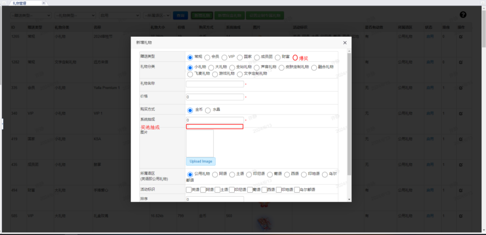
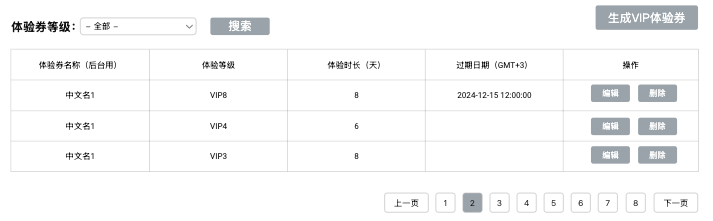
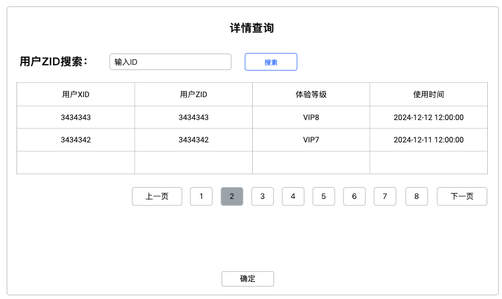
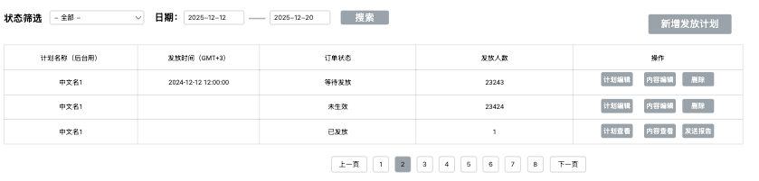
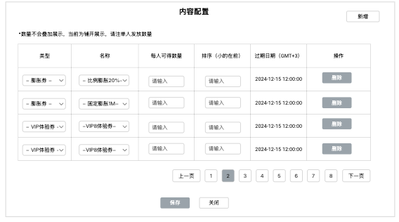
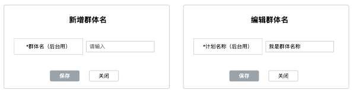
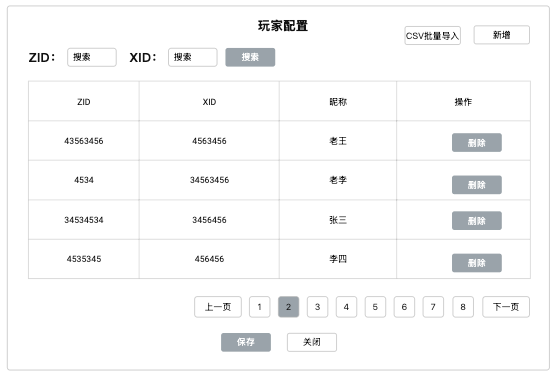
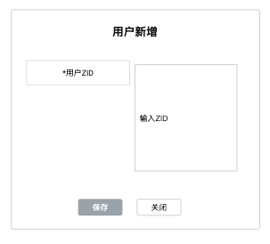
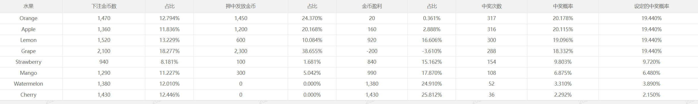

# 运营后台 — V1.1.0 原文切片

> 状态：`history`（非权威） · 来源：`demo/V1.1.0/V1.1.0.docx` 第七部分后台需求（原误跟在福利券后）

3.7.1  增加“爆奖”礼物类型（许静）

| 功能描述 | 后台增加“爆奖”礼物类型 |
|---|---|
| 优先级 | 高 |
| 输入/前置条件 |  |
| 需求描述 | 图1 【位置】运营后台—Manage-礼物管理 新增礼物-新增字段释义： |
| 输支持出/后置条件 |  |
| 补充说明 | 新增礼物类型对应礼物销量数据需要统计在“运营后台-Statistics-商品统计-礼物统计”中 |

3.7.2 “爆奖”礼物统计（许静）

| 功能描述 | “爆奖”礼物统计 |
|---|---|
| 优先级 | 高 |
| 输入/前置条件 |  |
| 需求描述 | 【位置】运营后台—数据统计-爆奖礼物统计 列表：支持分页，每页展示50条数据 字段释义： 筛选: 支持根据语区进行筛选； 支持根据礼物名称进行筛选； 支持根据日期进行筛选，精确到日（时间跨度1年）； 导出：支持导出当前筛选条件下所有数据 |
| 输支持出/后置条件 |  |
| 补充说明 |  |

3.7.3 “爆奖”礼物消费统计（许静）

| 功能描述 | “爆奖”礼物消费统计 |
|---|---|
| 优先级 | 高 |
| 输入/前置条件 |  |
| 需求描述 | 【位置】运营后台—数据统计-爆奖礼物消费统计 列表：支持分页，每页展示50条数据 字段释义： 筛选: 支持根据语区进行筛选； 支持根据礼物名称进行筛选； 支持根据日期进行筛选，精确到日； 导出：支持导出当前筛选条件下所有数据 |
| 输支持出/后置条件 |  |
| 补充说明 |  |

3.7.4 官方/运营房考核后台（许静）

| 功能描述 | 官方/运营房考核后台 |
|---|---|
| 优先级 | 高 |
| 输入/前置条件 |  |
| 需求描述 | 需求详见：【金山文档 \| WPS云文档】 【PRD】Samer后台v2.0.0 https://365.kdocs.cn/l/cmEcpVSwycPp |
| 输支持出/后置条件 |  |
| 补充说明 |  |

3.7.5 后台补单发送系统消息（许静）

| 功能描述 | 后台手动补单后自动触发1条系统消息 |
|---|---|
| 优先级 | 高 |
| 输入/前置条件 |  |
| 需求描述 | 后台手动完成补单后，用户收到1条系统消息：平台已为你的重置进行补单XXX金币。【查看】 点击【查看】跳转金币页面； |
| 输支持出/后置条件 |  |
| 补充说明 |  |

3.7.8工具配置 – 体验券 – 券配置（丛国序）

| 功能名称 | VIP体验券 |
|---|---|
| 优先级 | 高 |
| 功能描述 | / |
| 输入/前置条件 | / |
| 交互原型 | 「图1」 「图2」                                  「图3」 |
| 字段描述 | 搜索支持按照VIP等级筛选，当前VIP1 -VIP8； 体验券名称（后台用）：仅用后台展示记录用，方便操作，业务不使用； 体验等级：唯一等级，必填； 体验时间：使用后，用户可以获得多长时间（天）的体验； 结束日期：券的结束使用日期，GMT+3为准的日期，年/月/日 时/分/秒； |
| 需求描述 | 页面默认展示全部配置的券，按照生成时间到倒叙排列，优先展示最近生成的； 点击“生成VIP体验券”弹出「图2」的新券配置方案； 中文名：必填，仅后台用和其他列表选择用； 体验等级：唯一等级，必填，单选VIP1-8； 体验时长：必填，单位天，正整数 结束日期：必填，不可配置当前2小时内； 保存时验证，弹出错误提示用通用格式即可； 对已配置的券可以进行上述数值编辑，点击编辑弹出已经配置的数值； 对于已生成的，也可以进行删除 |
| 补充说明 | / |

3.7.9 工具配置 – 体验券 – 使用记录（丛国序）

| 功能名称 | 体验券使用记录 |
|---|---|
| 优先级 | 高 |
| 功能描述 | / |
| 输入/前置条件 | / |
| 交互原型 | 「图1」 「图2」 |
| 字段描述 | / |
| 需求描述 | 页面按照时间倒序，默认展示最近15天日期，支持时间区间搜索查看； 使用数量：当日使用体验卡的总数量； 使用详情，点击打开「图2」； 「图2」默认只展示当日的使用情况，展示全部，分页加载； 展示用户XID、ZID； 使用体验券的等级：对应的VIP几； 使用这张券的时间； 用户ZID搜索：支持直接搜索某用户的使用情况，可以直接跨过今日； |
| 补充说明 | / |

3.7.10发放体系 – 发放配置（丛国序）

| 功能名称 | 发放配置 |
|---|---|
| 优先级 | 高 |
| 功能描述 | / |
| 输入/前置条件 | / |
| 交互原型 | 「图1」 「图2」                      「图3」 「图4」 「图5」 |
| 字段描述 | 计划名称：仅后台计划名称用； 筛选：筛选订单状态发放状态： 未发放：生效，但是没有到发送时间，有配置； 未生效：仅为配置，不进入发送流程，有配置； 已发放：已经完成发放的订单； 发放时间：设置的计划发放时间，GMT+3，年月日，时分秒； 发放人数，本轮计划的发放人数； |
| 需求描述 | 搜索：支持订单状态筛选和时间区间多条件搜索； 列表默认按照生成计划的时间倒叙进行排列； 点击新增发放计划打新增计划「图2」； 计划名称（后台用）：必填，无实际功能，仅选择等功能使用； 发放时间：必填，设置的计划发放时间，GMT+3，年月日，时分秒，保存时需要验证，发放时间距离保存时间，必须大于等于5分钟=300秒； 订单状态：必填，发放之前可以修改状态 未生效：发放计划不生效，草稿； 生效：发放计划生效，到点发放； 用户群体名：从用户群体设定中选取，非必填； 用户ZID：独立用户ZID，非必填，但是需要和上面必须有一个不为空；保存时需要验证；（4月30日划掉） 操作 编辑计划：对于未发放的，都可以进行发放计划编辑，「图3」； 内容编辑：对于发放内容的配置，如「图4」； 删除：对于未发放都可以进行删除； 查看计划：对于发放过后的，则展示发放的计划，「图3」相同只是不能再进行编辑； 查看内容：对于发放过的，展示如「图4」相同，只是不能再进行编辑； 发送报告：对于发放过的，显示发放成功或失败人数，如「图5」； 内容编辑「图4」 新增，新增一条配置内容，最多配置30条； 类型：膨胀券或者VIP体验券，二选一，之前已经添加的，不要再进行重复配置； 名称：膨胀券或VIP体验券的名称，上文有提到的后台中文名称； 每人可获得数量：正整数，最小1最大50； 排序：在客户端发放后，在收到弹窗的展示顺序，数字小的在前0和正整数；本弹窗页可按照此规则进行排序； 过期日期：选择的券关联的有效使用日期： 删除：删除这条记录； 特殊处理： 对于内容/用户群体为空的发放计划，即使设置了生效，也不会进行发放； 对于关联的发放内容，人物组，已发放时的配置数据为准； 对于VIP体验券的发放，需要增加过滤，如果发放的VIP体验券的VIP等级小于等于接受用户，则不给改用户进行发放（按发放失败）； |
| 补充说明 | 消息类型：新获得： 每次收到同类型新券，不论数量，日期，只要收到新券都会收到消息，都会触发对应券的消息类型，消息支持点击跳转到应用内me中过的背包中对应的tab类型； 由于单次发放，支持同步发放两种类型，那么将会收到两条类型消息； 金币膨胀券：“恭喜，您获得了“膨胀券”！购买金币买的越多，膨胀后得到金币越多！点击查看“ VIP体验券：“恭喜，您获得了“VIP体验券”！点击查看” 2  即将过期提示： 2.1 每日的11点21点定时两次检测有券的用户券过期时间是否小于等于24小时；如图，消息支持点击跳转到应用内me中过的背包中对应的tab类型； 2.2只要同类型，存在24小时过期的就会发消息，不同类型不同消息同时间发送； VIP体验券：“您还有X张“VIP体验券”即将过期，请抓紧使用！点击查看” X= 24（包括24）小时内即将过期的对应类型的券的数量； 3 通用说明： 如单次发放消息人/消息数量过多，可以支持系统消息队列，进行分段发放，具体根据性能调整，尽快发放即可； 例如每1分钟只发放500人等，具体问题具体分析； |

3.7.11发放体系 – 用户群体配置（丛国序）

| 功能名称 | 用户群体配置 |
|---|---|
| 优先级 | 高 |
| 功能描述 | / |
| 输入/前置条件 | / |
| 交互原型 | 「图1」 「图2」                       「图3」 「图4」 「图5」                           「图6」 |
| 字段描述 | 为用户合集； 点击新增群体，弹出「图2」，设置中文名称，对于已经生成的，点击编辑名称弹出「图3」； 用户人数：该组内的用户ID独立个体，靓号/XID/ZID为同一人规则过滤； 群体编辑，弹出「图4」 支持列表内XID或ZID搜索，不支持联合搜索； 支持点击新增，弹出「图5」，支持ZID导入，用英文逗号分隔； 也支持CSV导入；纯ZID导入即可 同一个表，相同的用户只可以导入一次，多次会失败， 新增和导入，都会弹出「图6」； 显示成功多少人，失败的人数，并展示失败的ID； |
| 需求描述 |  |
| 补充说明 | / |

3.7.12 拉新后台，要本版本完成（丛国序）

【金山文档 | WPS云文档】 【PRD】Samer v2.0.0需求文档

https://365.kdocs.cn/l/cvoLBStKNCgk【金山文档 | WPS云文档】 【PRD】Samer后台v2.0.0

https://365.kdocs.cn/l/cmEcpVSwycPp

3.7.14 水果机/动物机统计后台（许静）

| 功能描述 | 水果机、动物机统计后台 |
|---|---|
| 优先级 | 中 |
| 输入/前置条件 |  |
| 需求描述 | 换皮水果机（动物机）后台套用水果机相同模板，但统计的是换皮水果机自身的数据。 其中明细一栏的水果，替换为动物，动物套用图标类别。 |
| 输支持出/后置条件 |  |
| 补充说明 |  |

3.7.15平台预警机制（丛国序）

| 功能名称 | 平台预警机制 |
|---|---|
| 优先级 | 高 |
| 功能描述 | / |
| 输入/前置条件 | / |
| 交互原型 | / |
| 字段描述 | / |
| 需求描述 | 一：概念 系统所有预警项采用30 分钟的统计时间，也就是30分钟内产生的数据进行判断； 逻辑：小于多少后台配置，大于多少后台配置，高于或低于设定阀值即推送消息； 举例： 新增注册预警：设定新注册大于100人预警，时间1.00-1.30注册人数为101人则触发预警； 预警消息：时间+内容；今日1.00-1.30注册人数大于100人； 二：系统支持以下 9 类预警项，每类预警项均可独立启用或禁用： 新增注册量预警：监控平台新增注册用户数量， 注册人数小于X； 注册人数大于X； 在线预警（PCU）：监控平台同时在线用户峰值数量 2.1在线人数小于X； 2.2 在线人数小于X； 房间人数预警：监控平台语音房在线总人数； 在房人数小于X； 在房人数大于X； 送礼人数预警：监控平台内送礼操作的用户数量及送礼总金币数 送礼人数小于X； 送礼人数大于X； 送礼金币数小于X； 送礼金币数大于X； 在麦人数预警：监控平台内正在上麦的用户数量 5.1 在麦人数小于X 5.2 在麦人数大于X 水果机预警：监控水果机游戏的用户消费总额、盈利比例及上报清空次数 水果机参与人数小于X； 水果机金币消费少于X； 盈利比例小于X =（流水-反奖）/流水； 水果机奖池重置通知：重置奖池中X金币，奖池剩余X金币，重置次数； 水果机本次触发兜底机制； 币流水波动预警：监控平台虚拟货币的整体流入流出情况； 金币消费小于X； 金币消费大于X； 平台发放超过X金币； 应用内充值预警：监控用户通过应用内渠道的充值行为 充值人数小于X 充值人数大于X 单用户充值大于X金币数量X笔 单用户5分钟连续充值X笔 渠道充值预警：监控用户通过第三方渠道的充值行为 充值人数小于X 充值人数大于X 单用户充值大于X金币数量X笔 单用户30分钟连续充值X笔 所有预警项均支持配置方式，满足任意一种条件即触发告警，消息内容为类目+具体数值： 绝对值阈值：设置具体的数值上下限或上限 三、特殊基准参数配置 充值类预警：可自定义 "大额充值" 的单笔金额阈值和 "多笔充值" 的 30 分钟内次数阈值 水果机预警：可自定义盈利比例阈值 盈利比例：百分比； 四、告警通知功能 系统支持钉钉、邮件、电话三种告警通知渠道，可针对每条预警规则单独配置接收人： 钉钉通知：通过钉钉机器人发送告警消息 邮件通知：向指定邮箱发送详细的告警邮件 电话通知：向指定号码拨打语音电话进行告警 告警规则如下： 同一预警项在30 分钟内只触发一次告警； 相同报警连续4次触发，比如新注册1-3点，连续出现4次，则发送一次邮件告警； 相同报警连续6次触发，比如新注册1-4点，连续出现6次，则电话通知； 当前不需要分组分层不同报警不同人，为统一打包即可； |
| 补充说明 | / |

3.7.16接入sailfish埋点后台

背景：为方便测试部门测试埋点需求，接入sailfish埋点后台

需求：运营后台接入sailfish埋点后台（仅测试使用）
