# 运营后台 — V1.3.0 原文切片

> 状态：`history`（非权威） · 来源见正文

## 3.4 第四部分 后台功能

3.4 第四部分 后台功能

3.4.1 拉新后台功能（已开发，测试不跟版本）

3.4.1.1分享拉新通用 - 开关

| 功能名称 | 开关 |
|---|---|
| 优先级 | 高 |
| 功能描述 | 开关 |
| 输入/前置条件 | 后台功能配置模块新增 – 拉新奖励通用配置 |
| 交互原型 | 「图1」 「图2」 「图3」 |
| 字段描述 | 功能名称：当前只有“个人分享入口”和“分享团队入口”； 页面状态：也就是对应的“开启”或“关闭”； 点击后弹出对应的操作弹窗「图2」「图3」，默认为开启； 这个能功能仅用来控制客户端的入口展示与否； |
| 需求描述 | / |
| 补充说明 | / |

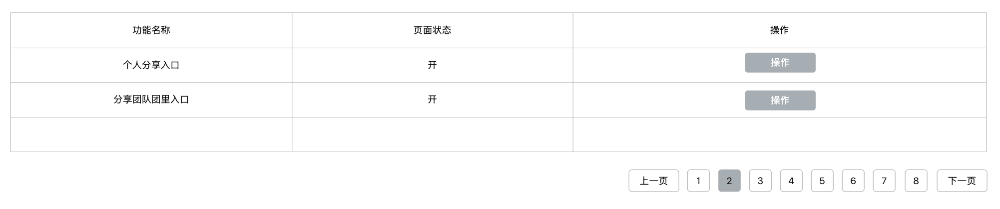

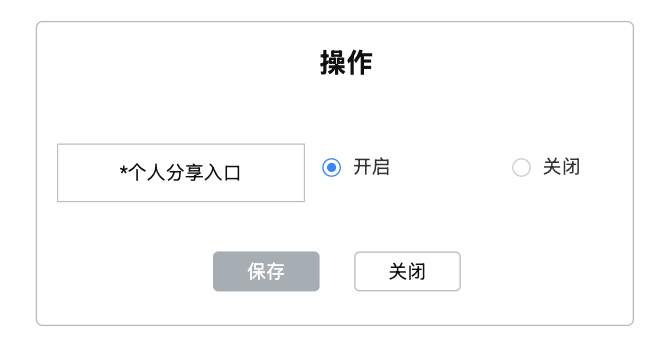

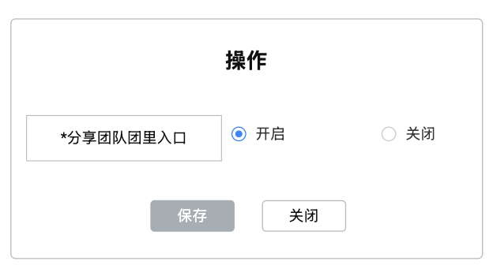

3.4.1.2拉新分享通用 – 奖励配置

| 功能名称 | 奖励配置 |
|---|---|
| 优先级 | 高 |
| 功能描述 | 奖励配置 |
| 输入/前置条件 | 后台功能配置模块新增 |
| 交互原型 | 「图1」 「图2」 「图3」 |
| 字段描述 | 「图1」列表信息 配置组名称：配置的名称，支持连贯字符搜索； 操作： 2.1 内容配置：「图3」，进行组的内容配置； 2.2 删除：删除该配置和相关记录，删除需要判断是否有关联活动正在使用该条目；如果有不可删除； 3. 排序按照配置生成时间倒叙排列，新生成的，保存在上面； 「图2」奖励组名称 新增和编辑如图，对已经生成的，则为展示名称和编辑保存； 「图3」奖励内容配置 包括类型：礼物，VIP，道具（头像框、座驾、房间背景）、宝石； 名称：具体的名称： 物品详情：如果所有物品没有三级菜单，则按照“/”展示； 图片：如果有展示，没有“/” 数量：按照最小单位配置，个数，天数，小时，分钟，具体按照物品的属性关联； |
| 需求描述 | / |
| 补充说明 | / |

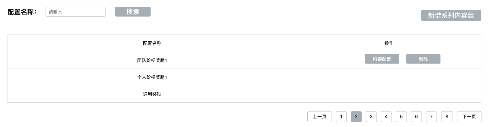

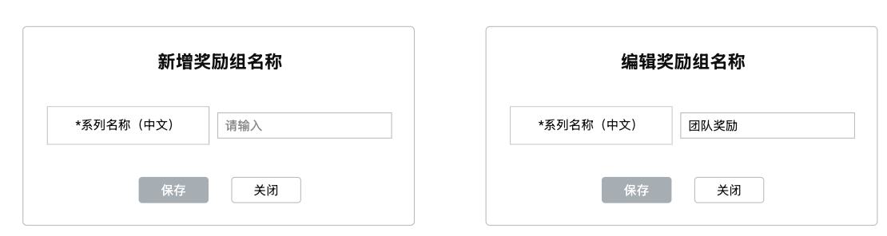

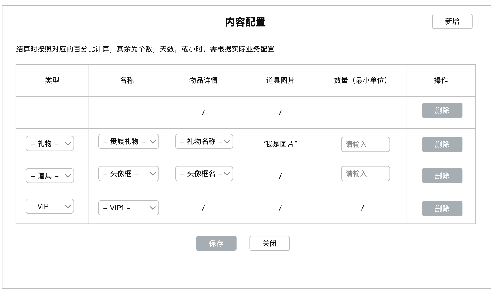

3.4.1.3拉新后台配置 – 个人拉新后台管理

| 功能名称 | 个人分享者配置 |
|---|---|
| 优先级 | 高 |
| 功能描述 | 个人分享者配置 |
| 输入/前置条件 | 后台功能配置模块新增 -个人拉新后台管理 |
| 交互原型 | 「图1」 「图2」 「图3」 「图4」 「图5」 「图6」 「图7」 |
| 字段描述 | 「图1」个人拉新管理和数据 用户昵称：用户的完整昵称； 用户XID：用户的外显ID； 本周起拉新人数，充值人数，本周拉新充值货币：根据周期统计的数字，如果没有则显示“\”； 总计拉新人数、总计充值人数、总计拉新充值货币数：从用户开启功能后的统计数值；如果没有则是“\”； 拉新状态：“正常”“停用”通过编辑可以调整，停用会影响用户领奖入团等功能； 拉新欠款状态：也就是在每次结算时，如果本周期不够扣，会下周期继续追缴的金额； 编辑：点击进入「图3」，只可修改拉新功能开启或停用，默认为开启； 订单详情：点击以后进入「图7」; 绑定详情：和用户端查看的绑定用户相同，最近60天的绑定用户「图4」； 页面默认按照当前周期数据拉新充值金币数量倒叙进行排列； 相同按照周期拉新人数进行排列； 没有周期数据按照先充值总量，再拉新总量； 都没有按照用户id小的在前面； 「图2」新增个人渠道的流程 通过「图1」的新增个人渠道打开；通过输入用户的XID进行开通； 判断该用户是否已经开启，则提示已经在列表； 如果没有在，则二次确认； 如果确定开通，并且成功，则提示添加成功； 「图4」绑定用户 绑定玩家的昵称，ID，以及绑定的日期； 绑定后，到当前日期的充值； 支持手动绑定，流程如「图5」； 支持手动删除，删除后，并且二次确认，如「图6」； 删除后，已经生成的信息不做变更，后续数据不再统计到个人，注册48小时内依旧可以重新绑定； 「图7」订单查询 查询绑定用户的充值订单； 玩家信息，id，充值订单信息，金币数量，订单时间，充值的货币类型； 通用规则： 页面都支持XID搜索； |
| 需求描述 | / |
| 补充说明 | / |

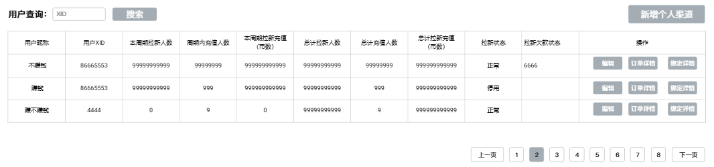

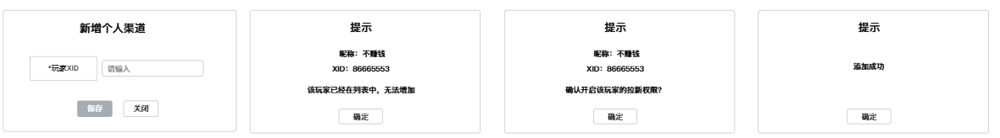

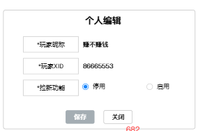

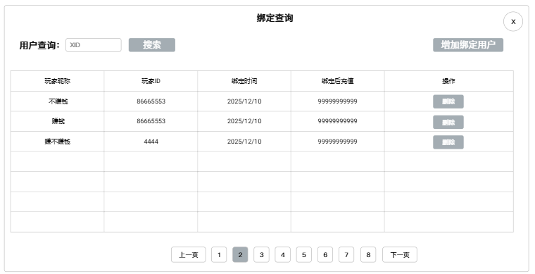

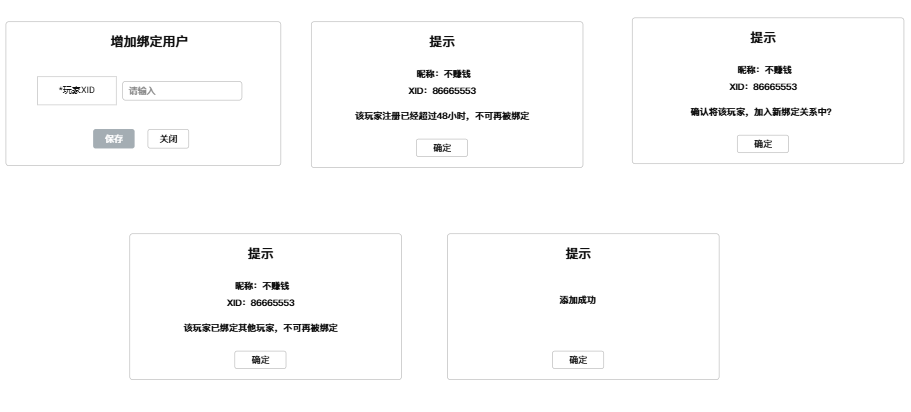

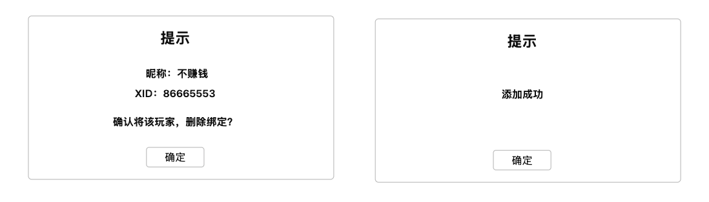

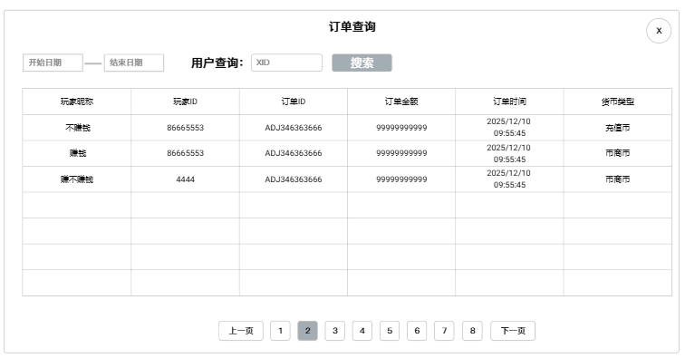

3.4.1.4拉新后台配置 – 个人拉新活动周期管理

| 功能名称 | 拉新活动周期管理 |
|---|---|
| 优先级 | 高 |
| 功能描述 | 拉新活动周期管理 |
| 输入/前置条件 | 后台功能配置模块新增 |
| 交互原型 | 「图1」 「图2」 「图3」 「图4」 「图5」 「图6」 |
| 字段描述 | 「图1」活动配置列表 开始时间-结束时间：年月日； 优先按照正在进行的，没有开始的，已经结束的进行排列，其次排序按照结束时间，距离当前时间最近的进行排列； 活动类型：拉新人数/充值金额；支持页面筛选； 包含阶梯数量：每一个活动周期内的阶梯数量； 操作 4.1 内容配置：对于一斤生成的，可以查看内容配置，也就是档位配置； 4.2 提前结束：正在进行中的周期活动可以进行提前结束，点击后弹出「图5」弹窗； 4.3 周期配置：对于没有进行开启的活动周期，可以进行重新编辑「图3」； 4.4 删除：对于没有开启的，周期，可以进行删除； 「图2」显示开关配置； 周期开关点击弹出； 默认为开启； 主要控制页面对应功能是否进行展示，不影响其他业务，展示与否不影响相关进度； 「图3」周期配置 页面新周期配置，和已经生成的周期但是没开启的，可以点击进入进行编辑，对于已经生成的，点击进入编辑带入之前保存的信息 选择开始时间和结束时间： 开始时间不可以被设置为当前自然日，至少要次日； 年月日；开启时间为默认为选择日期的0点，结束时间，默认为选择日期的24点； 对于生成或修改的开启结束时间，分别在对应的配置类型中，不可以和其他已经保存的时间产生重叠；否则弹出「图4」； 配置阶梯数：最小为1，最大为20，正整数； 配置类型：下拉选择“充值货币”和“拉新人数”；新生成后保存不可编辑修改； 「图5」提前结束弹窗提示： 展示开启-结束时间的年月日； 展示提前结束活动的类型； 如果类型是“充值金额”则有是否要进行结算的提示：单选，不结算/结算；拉新新用户没有相关展示； 不结算则，直接结束活动，所有玩家按照“无贡献”处理当前活动周期的结束记录； 如果为结算：则根据当前已产生的数据和周期进行结算和审核以及发放； 活动提前结束，用户领奖记录中的周期日期，不做变更； 「图6」阶梯配置和奖励选择 档位数量根据输入的数量进行展示； 拉新人数：正整数，最小为1，最大9999999，数字不可重复； 充值金额：正整数，最小为1，最大9999999，数字不可重复； 奖励比例：只有“充值金额”活动有相关配置，保留小数点后2位，输入为2或者2.00都为则为2%，输入为2.1和2.10都为2.1%；最大100%，最少0%； 关联奖励：每一个人数/金额都会下拉筛选奖励，则为同通用奖励配置中，的组名称，作为关联，新用户为必选，拉新为可选； 如果输入的“拉新人数”和“充值金额”不是按照从小到大排列，则在保存时需要按照最小为1档位，升序进行排列，并且关联的“奖励比例”和“关联奖励”一起进行调整； 如果出现没有输入的信息，则丢在后面，按照已经输入的进行保存； 自动规则： 如果当前没有正在进行的活动，则不回自动复制活动； 如果有正在进行的活动，则在结束前48小时验证一次后续是否有已经配置的同类型相关活动，如果没有，则自动生成一个相同时间间隔的连续活动； 例如1.1-1.10有一个充值活动，那么在结束前验证后续是否有晚于10日结束后的活动（无论连续与否只要有就行），如果没有，则按照10天，生成相同阶梯和奖励的连续活动从1.11-1.20，以此循环； 只在48小时前验证一次，后续无论如何成后，删除，修改都不在验证； 如果生成时出现时间冲突，则生成失败； |
| 需求描述 | / |
| 补充说明 | / |

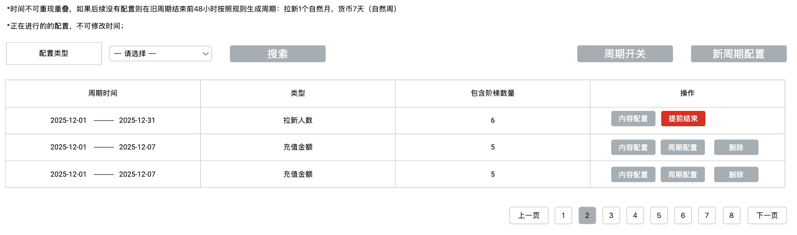

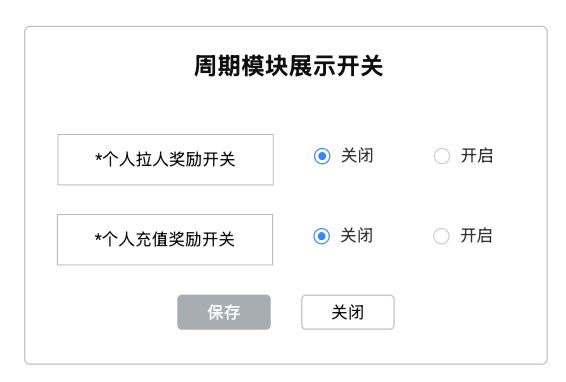

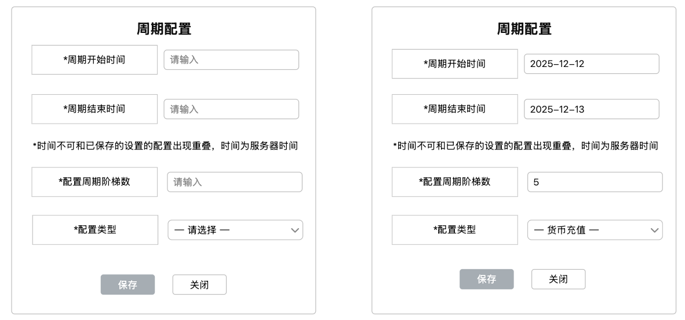

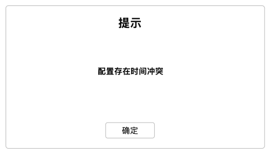

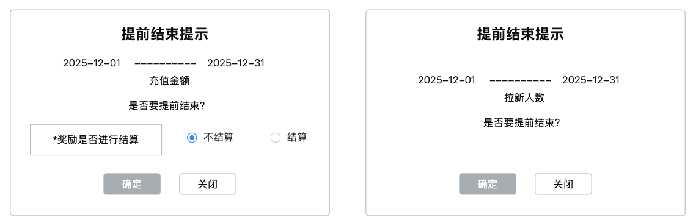

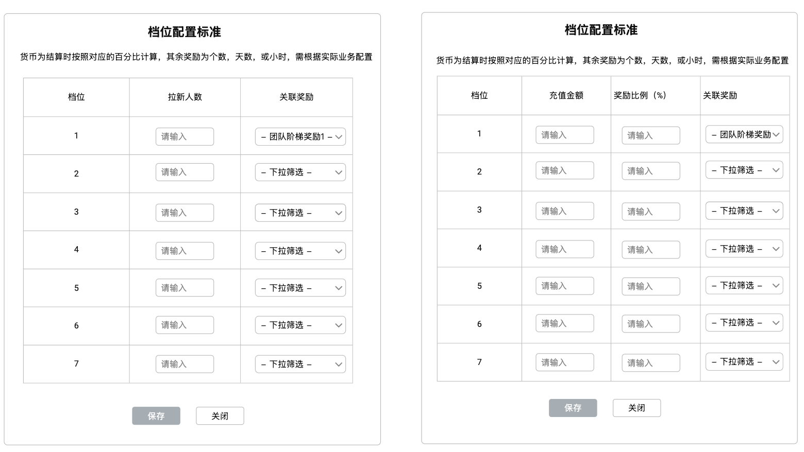

3.4.1.5拉新后台配置 – 个人拉新活动统计

| 功能名称 | 个人拉新活动管理 |
|---|---|
| 优先级 | 高 |
| 功能描述 | 个人拉新活动管理 |
| 输入/前置条件 | 后台功能配置模块新增 |
| 交互原型 | 「图1」 「图2」 「图3」 |
| 字段描述 | 「图1」 活动时间，开始时间到结束的周期时间，年月日； 用户昵称，用户的昵称； 用户XID：用户的XID； 已领取阶梯，在当前活动周期内，用户已经领取到的礼包所在的阶梯； 列表只统计在周期活动内已领取到礼包的用户，没有领取到的不展示； 排序按照领取阶梯的数量从高到低进行排列，相同阶梯按照ID小的在前面； 默认只展示当前阶梯，可以通过搜索展示历史活动周期的记录； 「图2」领取开关 默认开启，关闭后，只为不可领取； 「图3」数据汇总 默认按照时间倒叙每一日进行排列，展示当日礼包的领取人数（不区分第几阶梯，去重）和当是总计拉新人数； 次日统计前一日，如果没有完成显示为0； 默认展示当前周期的日期，也可以通过设置区间进行查看历史数据； |
| 需求描述 | / |
| 补充说明 | / |

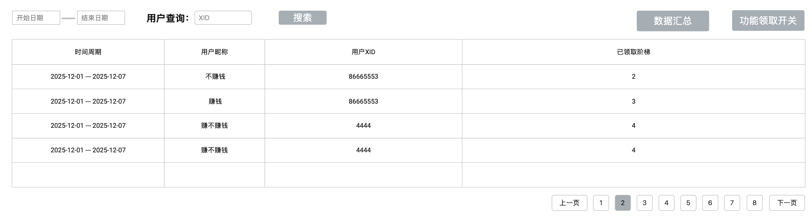

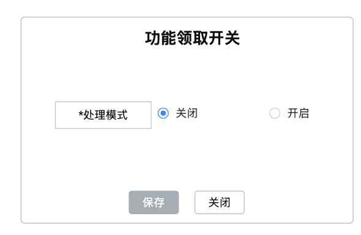

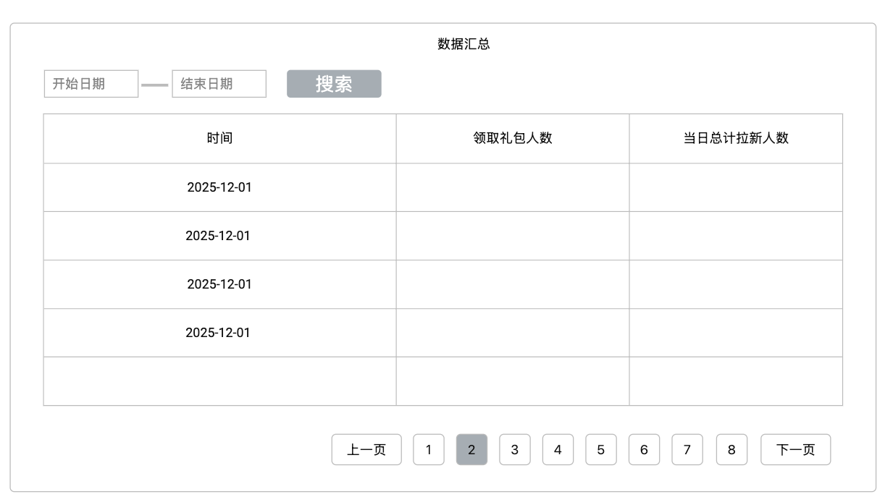

3.4.1.6拉新后台配置 – 个人拉新充值活动统计

| 功能名称 | 个人拉新充值活动统计 |
|---|---|
| 优先级 | 高 |
| 功能描述 | 个人拉新充值活动统计 |
| 输入/前置条件 | 后台功能配置模块新增 |
| 交互原型 | 「图1」 「图2」 「图3」 「图4」 「图5」 |
| 字段描述 | 「图1」 活动开启和结束时间，年月日； 用户昵称：用户的昵称； 用户XID：用户的XID； 周期内充值人数：当前活动周期，拉来的用户充值的人数； 本周期拉新充值（币数）：当前活动周期，充值的货币数量； 结算所在阶梯：当前达到的阶梯； 结算货币（币数）：结算后发给用户的数量，结算前为预估（和客户端预测相同功能）； 订单状态：周期结算前，“/”展示，结算后按照状态展示，审核中，通过，驳回，已领取（用户领取后变更）； 退款和欠款追溯：本周期统计中扣除的金额（实际扣除金额，不够扣的积累到下一周期）； 备注：手动输入； 操作：结算结束前不展示，结束之后订单为“审核中”展示处理按钮，当前处理过后（非审核中）的也展示，但是只能进行备注操作，弹出如「图3」； 默认按照： 如果有有么有处理的订单，则展示在最前面； 其次按最新活动周期拉新充值额度从高到低进行展示，没有充值的不展示，充值相同的； 相同充值按照ID小的在前面； 订单支持日期，id，等单状态的联合搜索； 「图2」处理模式，默认为自动处理； 「图3」手动单一订单处理； 昵称，ID，结算所在阶梯，应该获得的金币数量，为基础信息； 订单处理：通过选择修改订单状态，可修改为，通过，驳回； 备注：手动输入信息被展示； 审核过后的订单状态，当前不可再修改状态，但是只能进行备注输入操作； 订单处理为通过以及驳回，需要进行二次确认「图5」 「图4」手动订单批量处理 仅支持批量将“审核中”的订单，全部统一修改为，通过，驳回； 不满足批量处理条件的，提示“无满足条件的订单”； 展示处理的订单数量； 展示处理的玩家数量（去重）； 总计要发放的金币数量； |
| 需求描述 | / |
| 补充说明 | / |

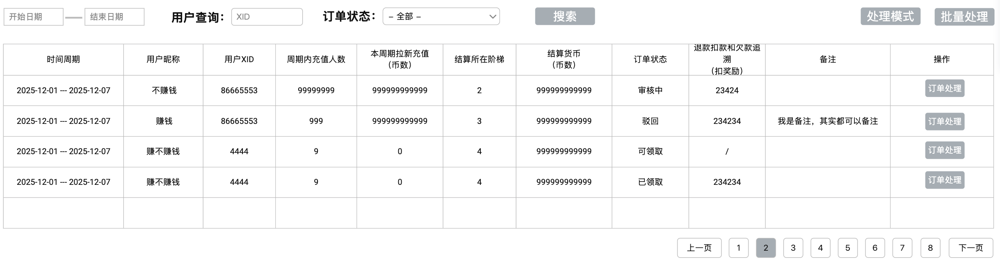

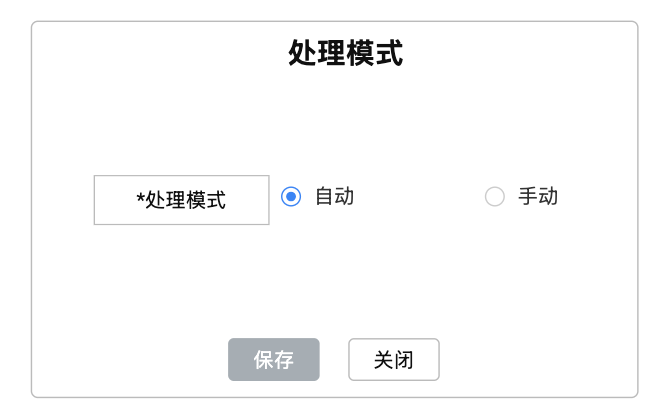

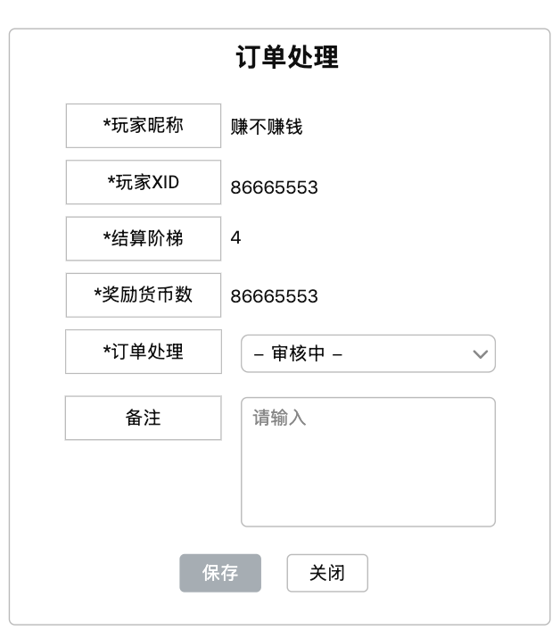

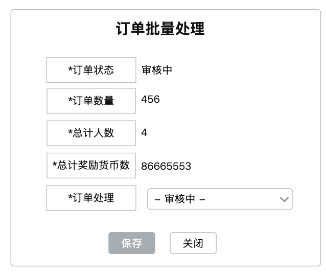

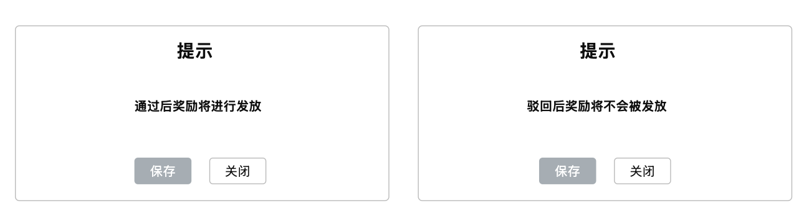

3.4.1.7拉新后台配置 – 币商团队拉新后台管理

| 功能名称 | 币商拉新后台管理 |
|---|---|
| 优先级 | 高 |
| 功能描述 | 币商拉新后台管理 |
| 输入/前置条件 | 后台功能配置模块新增 |
| 交互原型 | 「图1」 「图2」 「图3」 「图4」 「图5」 「图6」 「图7」 「图8」 「图9」 |
| 字段描述 | 「图1」团队列表 团长昵称、XID； 团员配置数量：当前数量/设置上限，新团队默认50人； 周期拉新人数：只展示当前周期，0或数字； 周期充值人数：只展示当前周期，0或数字； 周期拉新充值（币数）：货币数量，0或数字更多； 总计拉新人数：只展示当前周期，0或数字； 总计充值人数：只展示当前周期，0或数字； 总计拉新充值（币数）：货币数量，0或数字更多； 团队状态：正常/停用，“正常”“停用”通过编辑可以调整，停用会影响用户领奖等功能； 操作 信息编辑：「图2」； 团队管理：「图5」； 订单详情：「图9」； 半丁查询：「图7」； 默认规则 当前活动周期充值金额高的排序在前，相同的id小的在前面； 支持用户ID，精准搜索； 「图2」新增和团队编辑 点击新增，和已经生成的团队的信息编辑，打开弹窗； 可以通过ID新增团队，对于已经添加的团队，弹窗提示“不可重复添加” 对于应生成的，只可以编辑团队人数，新生成默认为50人； 团队状态默尔恩为启用； 「图3」删除团队 通过输入团长ID删除团队； 如果ID不是团长，则弹窗提示“该玩家不是团长”； 如果存在，则需要二次确认； 确认后，分别在参与的两个周期结束后不进入新周期，然后删除团长信息； 「图4」团队转化 页面右上角按钮点击弹出； 通过输入ID搜索相关团长进行变更，如果ID不是团长，则弹窗提示“么有搜到该团长信息”； 如过存在，需要二次确认，变更后，根据变更后的身份进行流程，客户端有相关描述； 「图5」为团队成员管理； 显示团长昵称和ID； 团员昵称，ID，入团时间，支持显示ID精准查询； 当前活动周期的拉新人数和拉新充值货币数量； 总计的拉新人数和拉新充值货币数量； 用户当前的拉新可用状态； 操作：删除团员，点击后弹出「图6」，二次确认后删除团员，删除后处理逻辑和客户端删除相同； 「图7」团队绑定新用户玩家 显示团长昵称和ID； 玩家的昵称，ID； 拉来用户的团员昵称； 绑定的时间； 绑定后充值的金额； 排序按照充值金额由高到低，然后按照绑定时间近的在前面； 删除：「图8」，需要二次确认，删除后，后续数据不统计在内，已产生的，不做删除； 「图9」团队关联的订单查询 显示团长昵称和ID 充值玩家昵称、玩家ID； 单比充值订单ID，充值金币数量，订单时间，货币类型； 是谁拉来的这个玩家； 时间近的展示在前面； |
| 需求描述 | / |
| 补充说明 | / |

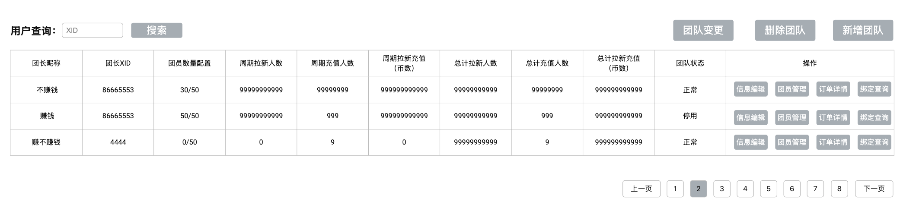

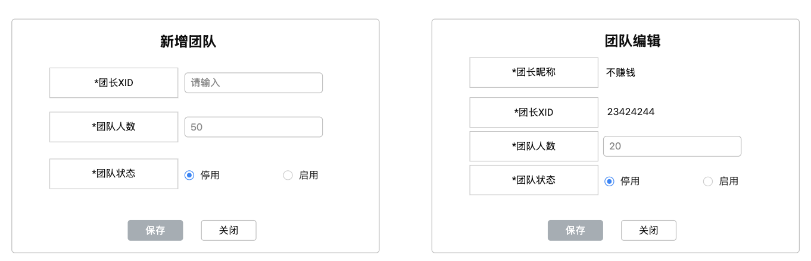

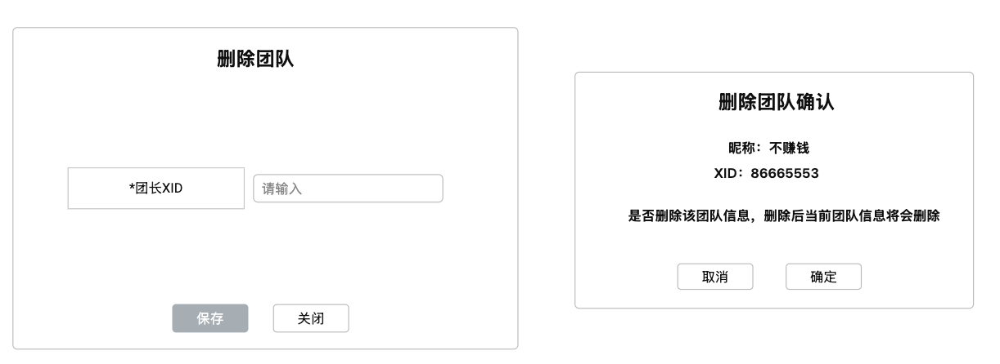

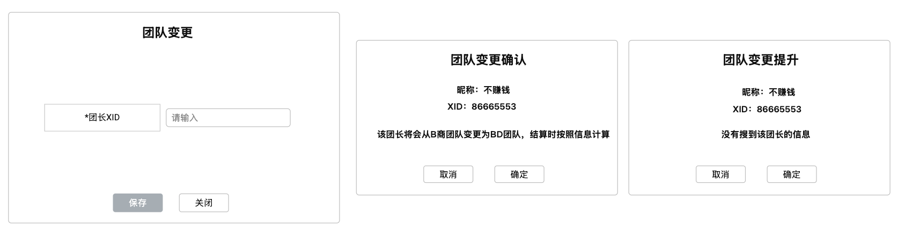

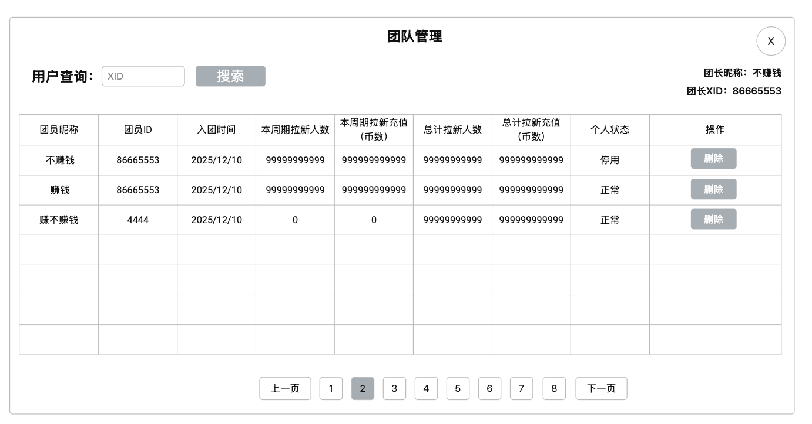

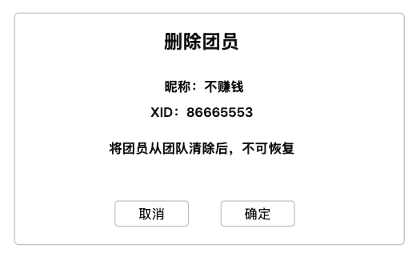

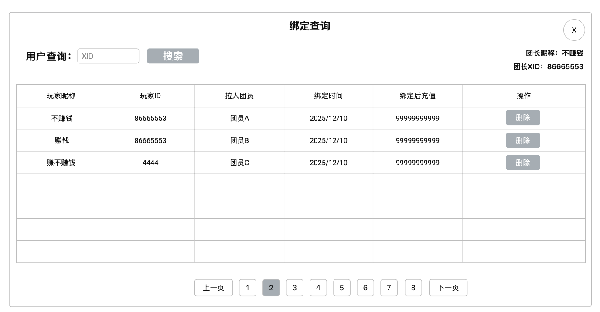

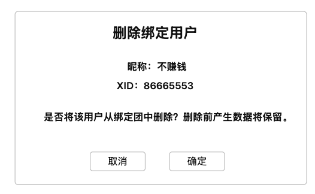

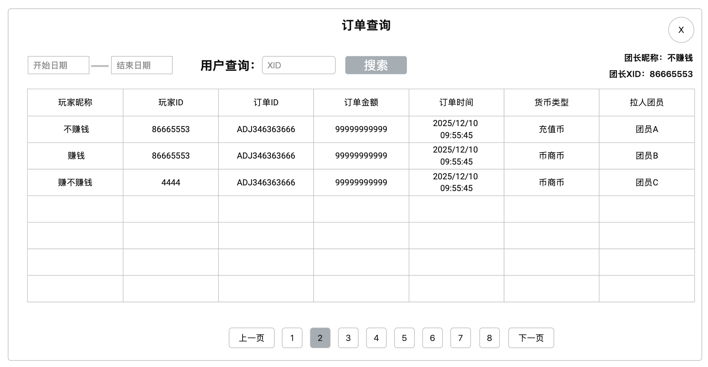

3.4.1.8拉新后台配置 – BD团队拉新后台管理

| 功能名称 | BD拉新后台管理 |
|---|---|
| 优先级 | 高 |
| 功能描述 | BD拉新后台管理 |
| 输入/前置条件 | 后台功能配置模块新增 |
| 交互原型 | 「图1」 「图2」 「图3」 「图4」（这里和币商不同） 「图5」 「图6」 「图7」 「图8」 「图9」 |
| 字段描述 | 「图1」团队列表 团长昵称、XID； 团员配置数量：当前数量/设置上限，新团队默认50人； 周期拉新人数：只展示当前周期，0或数字； 周期充值人数：只展示当前周期，0或数字； 周期拉新充值（币数）：货币数量，0或数字更多； 总计拉新人数：只展示当前周期，0或数字； 总计充值人数：只展示当前周期，0或数字； 总计拉新充值（币数）：货币数量，0或数字更多； 团队状态：正常/停用，“正常”“停用”通过编辑可以调整，停用会影响用户领奖等功能； 操作 信息编辑：「图2」； 团队管理：「图5」； 订单详情：「图9」； 半丁查询：「图7」； 默认规则 当前活动周期充值金额高的排序在前，相同的id小的在前面； 支持用户ID，精准搜索； 「图2」新增和团队编辑 点击新增，和已经生成的团队的信息编辑，打开弹窗； 可以通过ID新增团队，对于已经添加的团队，弹窗提示“不可重复添加” 对于应生成的，只可以编辑团队人数，新生成默认为50人； 团队状态默尔恩为启用； 「图3」删除团队 通过输入团长ID删除团队； 如果ID不是团长，则弹窗提示“该玩家不是团长”； 如果存在，则需要二次确认； 确认后，分别在参与的两个周期结束后不进入新周期，然后删除团长信息； 「图4」团队转化 页面右上角按钮点击弹出； 通过输入ID搜索相关团长进行变更，如果ID不是团长，则弹窗提示“么有搜到该团长信息”； 如过存在，需要二次确认，变更后，根据变更后的身份进行流程，客户端有相关描述； 「图5」为团队成员管理； 显示团长昵称和ID； 团员昵称，ID，入团时间，支持显示ID精准查询； 当前活动周期的拉新人数和拉新充值货币数量； 总计的拉新人数和拉新充值货币数量； 用户当前的拉新可用状态； 操作：删除团员，点击后弹出「图6」，二次确认后删除团员，删除后处理逻辑和客户端删除相同； 「图7」团队绑定新用户玩家 显示团长昵称和ID； 玩家的昵称，ID； 拉来用户的团员昵称； 绑定的时间； 绑定后充值的金额； 排序按照充值金额由高到低，然后按照绑定时间近的在前面； 删除：「图8」，需要二次确认，删除后，后续数据不统计在内，已产生的，不做删除； 「图9」团队关联的订单查询 显示团长昵称和ID 充值玩家昵称、玩家ID； 单比充值订单ID，充值金币数量，订单时间，货币类型； 是谁拉来的这个玩家； 时间近的展示在前面； |
| 需求描述 | / |
| 补充说明 | / |

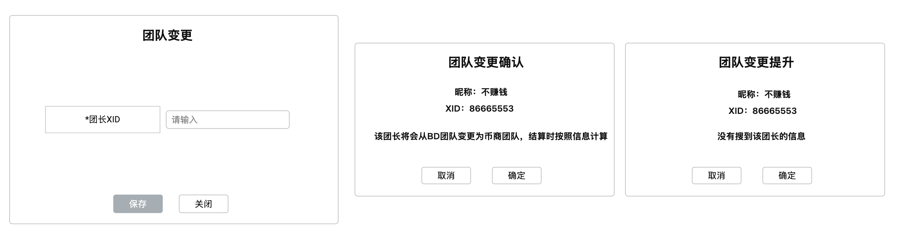

3.4.1.9拉新后台配置 – 币商团队拉新活动周期管理

| 功能名称 | 币商团队拉新活动周期管理 |
|---|---|
| 优先级 | 高 |
| 功能描述 | 币商团队拉新活动周期管理 |
| 输入/前置条件 | / |
| 交互原型 | 「图1」 「图2」 「图3」 「图4」 「图5」 「图6」 |
| 字段描述 | 「图1」活动配置列表 开始时间-结束时间：年月日； 优先按照正在进行的，没有开始的，已经结束的进行排列，其次排序按照结束时间，距离当前时间最近的进行排列； 活动类型：拉新人数/充值金额；支持页面筛选； 包含阶梯数量：每一个活动周期内的阶梯数量； 操作 4.1 内容配置：对于一斤生成的，可以查看内容配置，也就是档位配置； 4.2 提前结束：正在进行中的周期活动可以进行提前结束，点击后弹出「图5」弹窗； 4.3 周期配置：对于没有进行开启的活动周期，可以进行重新编辑「图3」； 4.4 删除：对于没有开启的，周期，可以进行删除； 「图2」显示开关配置； 周期开关点击弹出； 默认为开启； 主要控制页面对应功能是否进行展示，不影响其他业务，展示与否不影响相关进度； 「图3」周期配置 页面新周期配置，和已经生成的周期但是没开启的，可以点击进入进行编辑，对于已经生成的，点击进入编辑带入之前保存的信息 选择开始时间和结束时间： 开始时间不可以被设置为当前自然日，至少要次日； 年月日；开启时间为默认为选择日期的0点，结束时间，默认为选择日期的24点； 对于生成或修改的开启结束时间，分别在对应的配置类型中，不可以和其他已经保存的时间产生重叠；否则弹出「图4」； 配置阶梯数：最小为1，最大为20，正整数； 配置类型：下拉选择“充值货币”和“拉新人数”；新生成后保存不可编辑修改； 「图5」提前结束弹窗提示： 展示开启-结束时间的年月日； 展示提前结束活动的类型； 如果类型是“充值金额”则有是否要进行结算的提示：单选，不结算/结算；拉新新用户没有相关展示； 不结算则，直接结束活动，所有玩家按照“无贡献”处理当前活动周期的结束记录； 如果为结算：则根据当前已产生的数据和周期进行结算和审核以及发放； 活动提前结束，用户领奖记录中的周期日期，不做变更； 「图6」阶梯配置和奖励选择 档位数量根据输入的数量进行展示； 拉新人数：正整数，最小为1，最大9999999，数字不可重复； 充值金额：正整数，最小为1，最大9999999，数字不可重复； 奖励比例：只有“充值金额”活动有相关配置，保留小数点后2位，输入为2或者2.00都为则为2%，输入为2.1和2.10都为2.1%；最大100%，最少0%； 关联奖励：每一个人数/金额都会下拉筛选奖励，则为同通用奖励配置中，的组名称，作为关联，新用户为必选，拉新为可选； 如果输入的“拉新人数”和“充值金额”不是按照从小到大排列，则在保存时需要按照最小为1档位，升序进行排列，并且关联的“奖励比例”和“关联奖励”一起进行调整； 如果出现没有输入的信息，则丢在后面，按照已经输入的进行保存； 自动规则： 如果当前没有正在进行的活动，则不回自动复制活动； 如果有正在进行的活动，则在结束前48小时验证一次后续是否有已经配置的同类型相关活动，如果没有，则自动生成一个相同时间间隔的连续活动； 例如1.1-1.10有一个充值活动，那么在结束前验证后续是否有晚于10日结束后的活动（无论连续与否只要有就行），如果没有，则按照10天，生成相同阶梯和奖励的连续活动从1.11-1.20，以此循环； 只在48小时前验证一次，后续无论如何成后，删除，修改都不在验证； 如果生成时出现时间冲突，则生成失败； |
| 需求描述 | / |
| 补充说明 | / |

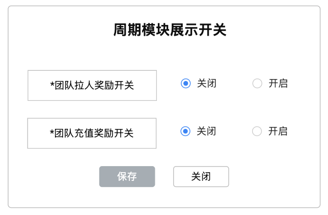

3.4.1.10拉新后台配置 – BD团队拉新活动周期管理

| 功能名称 | 币商团队拉新活动周期管理 |
|---|---|
| 优先级 | 高 |
| 功能描述 | 币商团队拉新活动周期管理 |
| 输入/前置条件 | / |
| 交互原型 | 「图1」 「图2」 「图3」 「图4」 「图5」 「图6」 |
| 字段描述 | 「图1」活动配置列表 开始时间-结束时间：年月日； 优先按照正在进行的，没有开始的，已经结束的进行排列，其次排序按照结束时间，距离当前时间最近的进行排列； 活动类型：拉新人数/充值金额；支持页面筛选； 包含阶梯数量：每一个活动周期内的阶梯数量； 操作 4.1 内容配置：对于一斤生成的，可以查看内容配置，也就是档位配置； 4.2 提前结束：正在进行中的周期活动可以进行提前结束，点击后弹出「图5」弹窗； 4.3 周期配置：对于没有进行开启的活动周期，可以进行重新编辑「图3」； 4.4 删除：对于没有开启的，周期，可以进行删除； 「图2」显示开关配置； 周期开关点击弹出； 默认为开启； 主要控制页面对应功能是否进行展示，不影响其他业务，展示与否不影响相关进度； 「图3」周期配置 页面新周期配置，和已经生成的周期但是没开启的，可以点击进入进行编辑，对于已经生成的，点击进入编辑带入之前保存的信息 选择开始时间和结束时间： 开始时间不可以被设置为当前自然日，至少要次日； 年月日；开启时间为默认为选择日期的0点，结束时间，默认为选择日期的24点； 对于生成或修改的开启结束时间，分别在对应的配置类型中，不可以和其他已经保存的时间产生重叠；否则弹出「图4」； 配置阶梯数：最小为1，最大为20，正整数； 配置类型：下拉选择“充值货币”和“拉新人数”；新生成后保存不可编辑修改； 「图5」提前结束弹窗提示： 展示开启-结束时间的年月日； 展示提前结束活动的类型； 如果类型是“充值金额”则有是否要进行结算的提示：单选，不结算/结算；拉新新用户没有相关展示； 不结算则，直接结束活动，所有玩家按照“无贡献”处理当前活动周期的结束记录； 如果为结算：则根据当前已产生的数据和周期进行结算和审核以及发放； 活动提前结束，用户领奖记录中的周期日期，不做变更； 「图6」阶梯配置和奖励选择 档位数量根据输入的数量进行展示； 拉新人数：正整数，最小为1，最大9999999，数字不可重复； 充值金额：正整数，最小为1，最大9999999，数字不可重复； 奖励比例：只有“充值金额”活动有相关配置，保留小数点后2位，输入为2或者2.00都为则为2%，输入为2.1和2.10都为2.1%；最大100%，最少0%； 关联奖励：每一个人数/金额都会下拉筛选奖励，则为同通用奖励配置中，的组名称，作为关联，新用户为必选，拉新为可选； 如果输入的“拉新人数”和“充值金额”不是按照从小到大排列，则在保存时需要按照最小为1档位，升序进行排列，并且关联的“奖励比例”和“关联奖励”一起进行调整； 如果出现没有输入的信息，则丢在后面，按照已经输入的进行保存； 自动规则： 如果当前没有正在进行的活动，则不回自动复制活动； 如果有正在进行的活动，则在结束前48小时验证一次后续是否有已经配置的同类型相关活动，如果没有，则自动生成一个相同时间间隔的连续活动； 例如1.1-1.10有一个充值活动，那么在结束前验证后续是否有晚于10日结束后的活动（无论连续与否只要有就行），如果没有，则按照10天，生成相同阶梯和奖励的连续活动从1.11-1.20，以此循环； 只在48小时前验证一次，后续无论如何成后，删除，修改都不在验证； 如果生成时出现时间冲突，则生成失败； |
| 需求描述 | / |
| 补充说明 | / |

3.4.1.11拉新后台配置 – 币商拉新活动统计

| 功能名称 | 拉新活动管理 |
|---|---|
| 优先级 | 高 |
| 功能描述 | 拉新活动管理 |
| 输入/前置条件 | 后台功能配置模块新增 |
| 交互原型 | 「图1」 「图2」 「图3」 |
| 字段描述 | 「图1」 活动时间，开始时间到结束的周期时间，年月日； 用户昵称，用户的昵称； 用户XID：用户的XID； 已领取阶梯，在当前活动周期内，用户已经领取到的礼包所在的阶梯； 列表只统计在周期活动内已领取到礼包的用户，没有领取到的不展示； 排序按照领取阶梯的数量从高到低进行排列，相同阶梯按照ID小的在前面； 默认只展示当前阶梯，可以通过搜索展示历史活动周期的记录； 「图2」领取开关 默认开启，关闭后，只为不可领取； 「图3」数据汇总 默认按照时间倒叙每一日进行排列，展示当日礼包的领取人数（不区分第几阶梯，去重）和当是总计拉新人数； 次日统计前一日，如果没有完成显示为0； 默认展示当前周期的日期，也可以通过设置区间进行查看历史数据； |
| 需求描述 | / |
| 补充说明 | / |

3.4.1.12拉新后台配置 – 币商拉新充值活动统计

| 功能名称 | 拉新充值活动统计 |
|---|---|
| 优先级 | 高 |
| 功能描述 | 拉新充值活动统计 |
| 输入/前置条件 | 后台功能配置模块新增 |
| 交互原型 | 「图1」 「图2」 「图3」 「图4」 「图5」 |
| 字段描述 | 「图1」 活动开启和结束时间，年月日； 用户昵称：用户的昵称； 用户XID：用户的XID； 周期内充值人数：当前活动周期，拉来的用户充值的人数； 本周期拉新充值（币数）：当前活动周期，充值的货币数量； 结算所在阶梯：当前达到的阶梯； 结算货币（币数）：结算后发给用户的数量，结算前为预估（和客户端预测相同功能）； 订单状态：周期结算前，“/”展示，结算后按照状态展示，审核中，通过，驳回，已领取（用户领取后变更）； 退款和欠款追溯：本周期统计中扣除的金额（实际扣除金额，不够扣的积累到下一周期）； 备注：手动输入； 操作：结算结束前不展示，结束之后订单为“审核中”展示处理按钮，当前处理过后（非审核中）的也展示，但是只能进行备注操作，弹出如「图3」； 默认按照： 如果有有么有处理的订单，则展示在最前面； 其次按最新活动周期拉新充值额度从高到低进行展示，没有充值的不展示，充值相同的； 相同充值按照ID小的在前面； 订单支持日期，id，等单状态的联合搜索； 「图2」处理模式，默认为自动处理； 「图3」手动单一订单处理； 昵称，ID，结算所在阶梯，应该获得的金币数量，为基础信息； 订单处理：通过选择修改订单状态，可修改为，通过，驳回； 备注：手动输入信息被展示； 审核过后的订单状态，当前不可再修改状态，但是只能进行备注输入操作； 订单处理为通过以及驳回，需要进行二次确认「图5」 「图4」手动订单批量处理 仅支持批量将“审核中”的订单，全部统一修改为，通过，驳回； 不满足批量处理条件的，提示“无满足条件的订单”； 展示处理的订单数量； 展示处理的玩家数量（去重）； 总计要发放的金币数量； |
| 需求描述 | / |
| 补充说明 | / |

3.4.1.13拉新后台配置 – BD拉新活动统计

| 功能名称 | 拉新活动管理 |
|---|---|
| 优先级 | 高 |
| 功能描述 | 拉新活动管理 |
| 输入/前置条件 | 后台功能配置模块新增 |
| 交互原型 | 「图1」 「图2」 「图3」 |
| 字段描述 | 「图1」 活动时间，开始时间到结束的周期时间，年月日； 用户昵称，用户的昵称； 用户XID：用户的XID； 已领取阶梯，在当前活动周期内，用户已经领取到的礼包所在的阶梯； 列表只统计在周期活动内已领取到礼包的用户，没有领取到的不展示； 排序按照领取阶梯的数量从高到低进行排列，相同阶梯按照ID小的在前面； 默认只展示当前阶梯，可以通过搜索展示历史活动周期的记录； 「图2」领取开关 默认开启，关闭后，只为不可领取； 「图3」数据汇总 默认按照时间倒叙每一日进行排列，展示当日礼包的领取人数（不区分第几阶梯，去重）和当是总计拉新人数； 次日统计前一日，如果没有完成显示为0； 默认展示当前周期的日期，也可以通过设置区间进行查看历史数据； |
| 需求描述 | / |
| 补充说明 | / |

3.4.1.14拉新后台配置 – BD拉新充值活动统计

| 功能名称 | 拉新充值活动统计 |
|---|---|
| 优先级 | 高 |
| 功能描述 | 拉新充值活动统计 |
| 输入/前置条件 | 后台功能配置模块新增 |
| 交互原型 | 「图1」 「图2」 「图3」 「图4」 「图5」 |
| 字段描述 | 「图1」 活动开启和结束时间，年月日； 用户昵称：用户的昵称； 用户XID：用户的XID； 周期内充值人数：当前活动周期，拉来的用户充值的人数； 本周期拉新充值（币数）：当前活动周期，充值的货币数量； 结算所在阶梯：当前达到的阶梯； 结算货币（币数）：结算后发给用户的数量，结算前为预估（和客户端预测相同功能）； 订单状态：周期结算前，“/”展示，结算后按照状态展示，审核中，审核通过等待打款，已发放，驳回； 退款和欠款追溯：本周期统计中扣除的金额（实际扣除金额，不够扣的积累到下一周期）； 备注：手动输入； 操作：结算结束前不展示，结束之后订单为“审核中”展示处理按钮，当前处理过后（非审核中）的也展示，但是只能进行备注操作，弹出如「图3」； 默认按照： 如果有有么有处理的订单，则展示在最前面； 其次按最新活动周期拉新充值额度从高到低进行展示，没有充值的不展示，充值相同的； 相同充值按照ID小的在前面； 订单支持日期，id，等单状态的联合搜索； 「图2」处理模式，默认为自动处理； 「图3」手动单一订单处理； 昵称，ID，结算所在阶梯，应该获得的金币数量，为基础信息； 订单处理：通过选择修改订单状态，可修改为，审核中，审核通过等待打款，已发放，驳回； “审核通过等待打款”的订单，可以修改为，已发放； 备注：手动输入信息被展示； 已发放，驳回，的订单状态，当前不可再修改状态，但是只能进行备注输入操作； 订单处理为通过以及驳回，需要进行二次确认「图5」 「图4」手动订单批量处理 支持批量将“审核中”的订单，全部统一修改为，通过，驳回； 支持批量将“审核通过等待打款”的订单，全部统一修改为，已发放； 不满足批量处理条件的，提示“无满足条件的订单”； 展示处理的订单数量； 展示处理的玩家数量（去重）； 总计要发放的金币数量； |
| 需求描述 | / |
| 补充说明 | / |

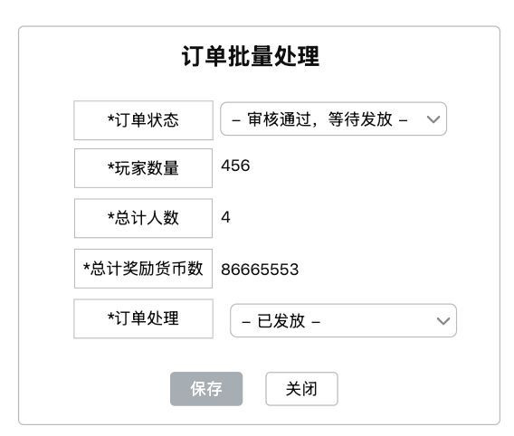

3.4.1.15新用户奖励配置 – 奖励配置

| 功能名称 | 奖励配置 |
|---|---|
| 优先级 | 高 |
| 功能描述 | 奖励配置 |
| 输入/前置条件 | 后台功能配置模块新增 |
| 交互原型 | 「图1」 「图2」 「图3」 |
| 字段描述 | 「图1」列表信息 配置组名称：配置的名称，支持连贯字符搜索； 操作： 2.1 内容配置：「图3」，进行组的内容配置； 2.2 删除：删除该配置和相关记录，删除需要判断是否有关联活动正在使用该条目；如果有不可删除； 3. 排序按照配置生成时间倒叙排列，新生成的，保存在上面； 「图2」奖励组名称 新增和编辑如图，对已经生成的，则为展示名称和编辑保存； 「图3」奖励内容配置 包括类型：礼物，VIP，道具（头像框、座驾、房间背景）、宝石； 名称：具体的名称： 物品详情：如果所有物品没有三级菜单，则按照“/”展示； 图片：如果有展示，没有“/“； 数量：按照最小单位配置，个数，天数，小时，分钟，具体按照物品的属性关联； |
| 需求描述 | / |
| 补充说明 | / |

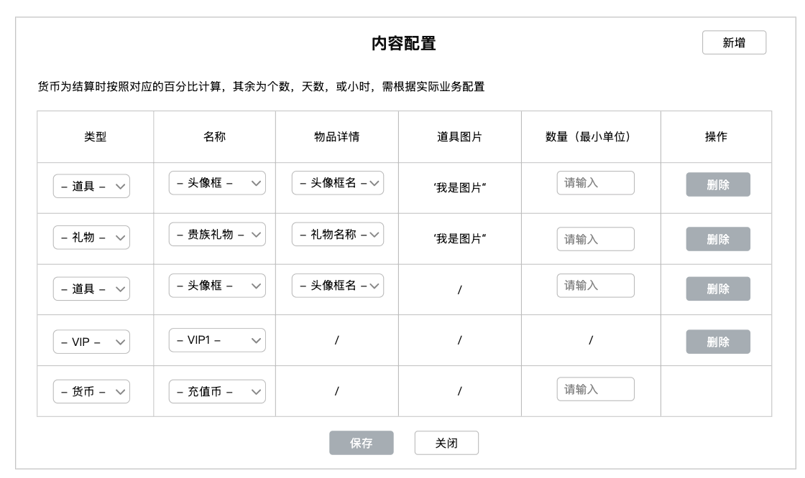

3.4.1.16新用户奖励配置 – 消费

| 功能名称 | 新用户奖励配置 – 消费 |
|---|---|
| 优先级 | 高 |
| 功能描述 | 新用户奖励配置 – 消费 |
| 输入/前置条件 | 后台配置功能新增 |
| 交互原型 | 「图1」 「图2」 「图3」 |
| 字段描述 | 「图1」新玩家消费阶梯奖励配置 充值金额：配置的充值金额目标； 排序：只限制在后台的排序； 状态：启用/停用，这个等级的启用和停用状态，支持这个搜索，页面默认展示全部； 金币奖励数量：奖励金币的数量，正整数； 操作：内容配置和删除； 「图2」功能开关 显示模块开关：开/关，默认开； 领取开关：开/关，默认开； 「图3」奖励配置和编辑 条件金币充值金额：正整数，新的生成后保存，不可再修改； 金币奖励数量：奖励金币的数量 奖励选择，下拉筛选，可以修改，属于额外奖励，为可选； 排序：权重影响展示排序； 保存后即刻生效； |
| 需求描述 | / |
| 补充说明 | / |

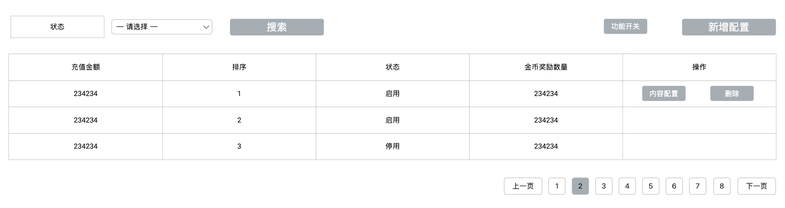

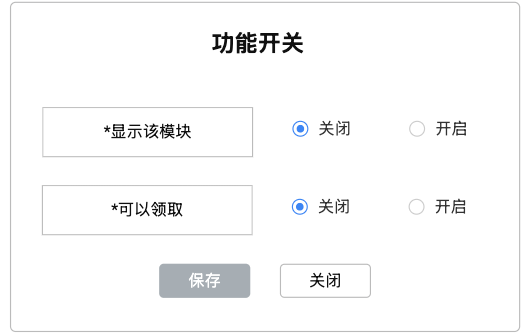

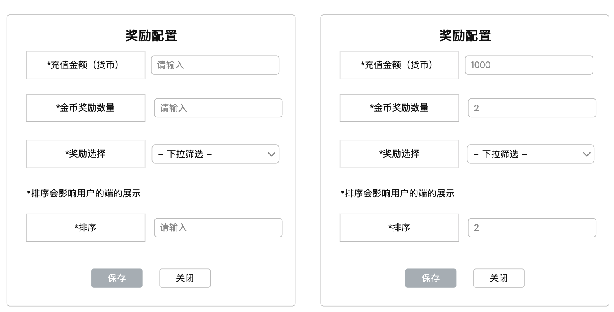

3.4.1.17新用户奖励配置 – 其他任务

| 功能名称 | 新用户奖励配置 – 其他任务 |
|---|---|
| 优先级 | 高 |
| 功能描述 | 新用户奖励配置 – 其他任务 |
| 输入/前置条件 | 后台新增配置 |
| 交互原型 | 「图1」 「图2」 「图3」 |
| 字段描述 | 「图1」新玩家任务励配置 任务类型：任务类型，比如“登陆天数”； 任务标准：对应的任务需达到的标准数量，登陆天数任务为“30”天 排序：影响前后端的排序展示； 状态：启用/停用，这个等级的启用和停用状态，支持这个搜索，页面默认展示全部； 操作：内容配置和删除； 「图2」功能开关 显示模块开关：开/关，默认开； 领取开关：开/关，默认开； 「图3」奖励配置和编辑 任务类型：必选，下拉筛选，配置后不可修改； 任务标准：参考下方表格； 奖励选择，下拉筛选，可以修改，为必选； 排序：权重影响展示排序； 保存后即刻生效 任务类型和标准单位： 登陆天数：天； 进入房间数量：个数； 上麦时长：分钟； 在房时长：分钟； 添加好友：人数； 送任意礼物个数：个数； 收到任意礼物：个数； |
| 需求描述 | / |
| 补充说明 | / |

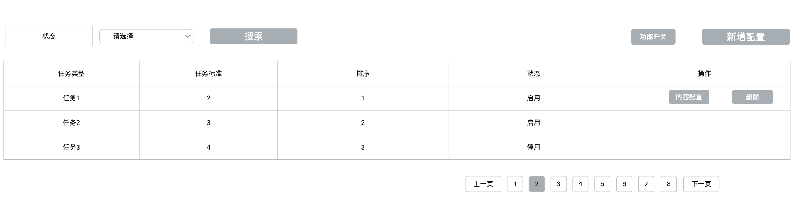

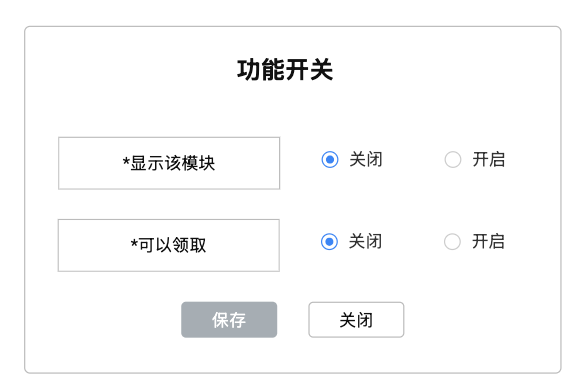

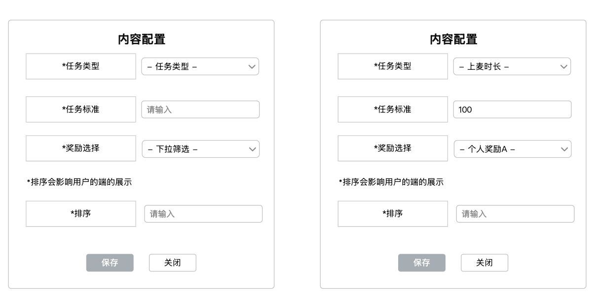

3.4.1.18新用户奖励配置 – 领取记录

| 功能名称 | 领取记录 |
|---|---|
| 优先级 | 高 |
| 功能描述 | 领取记录 |
| 输入/前置条件 | 数据统计 |
| 交互原型 |  |
| 字段描述 | 领奖时间：年月日，时分秒，支持时间区间查询，页面时间倒叙排列； 用户昵称：领奖用户的昵称； 用户XID：领奖用户的XID，支持查询； 两件任务+标准：完成任务的名称和标准的拼接，比如登陆30天，充值1000金币； 领奖+数量：对应的物品的名称和（数量档位）；比如：充值币（1000）；VIP（3天），如果存在多个用+拼接； |
| 需求描述 | / |
| 补充说明 | / |

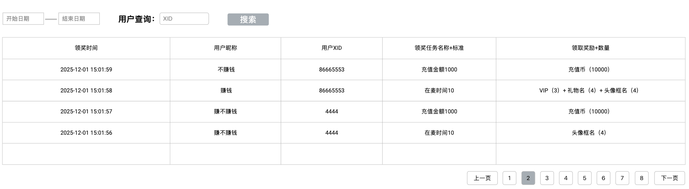

3.4.1.19新用户奖励配置 – 任务完成度统计

| 功能名称 | 任务完成统计 |
|---|---|
| 优先级 | 高 |
| 功能描述 | 任务完成统计 |
| 输入/前置条件 | 数据统计 |
| 交互原型 |  |
| 字段描述 | 页面按照时间倒叙排列；时间格式，年月日，支持时间查询； 消费完成任务数量：按照日期完成的消费类型任务数量； 消费完成任务人数：按照日期完成的消费类型任务的人数，去重； 非消费完成任务数量：按照日期完成的非消费类型任务数量； 非消费完成任务人数：按照日期完成的非消费类型任务的人数，去重 次日统计前一日，服务器时间，1点前完成最好； 如果都为空，则展示0000，不出现时间不连贯问题； |
| 需求描述 | / |
| 补充说明 | / |

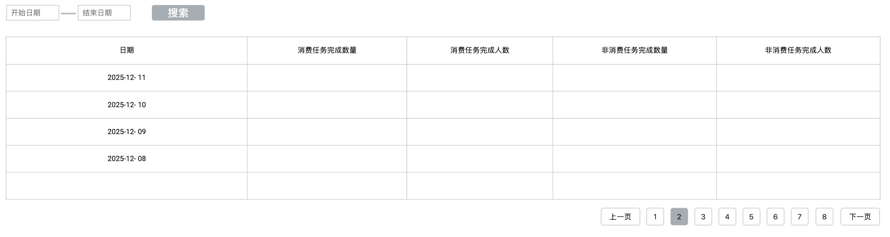

3.4.2 休闲游戏后台

3.4.2.1休闲游戏数据(只开发不测)

| 功能名称 | 休闲游戏 |
|---|---|
| 优先级 | 高 |
| 功能描述 | / |
| 输入/前置条件 | / |
| 交互原型 | 「图1」 |
| 字段描述 | 入口：后台平台tab下新增“休闲游戏”模块，本页面名称“休闲游戏数据”新增对应内容；（7月1日变更） 默认展示：最近30天全部游戏类型的数据； 支持顶部日期区间和游戏条件进行搜索，默认展示全部游戏，下拉； 默认排序：按照时间倒序； 统计和展示日期：T+1； 数据维度：按照房间内，和房间外分开统计； 大厅游戏：房间外 房间游戏：房间内 对局数：有效成功的，游戏局数； 人数：成功的游戏，去重 流水：成功对局的金币流水 抽成：按照成功对局的金币门票抽成的金额； 数字均为正整数，如果空为0； 如果统计日期没有数据，那么就展示0，不会因为都为0而跳过某个日期 |
| 需求描述 |  |
| 补充说明 | / |

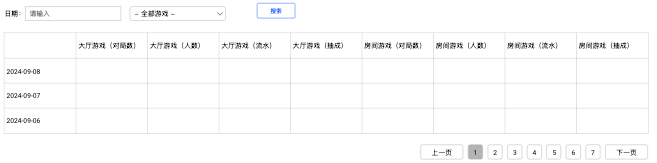

3.4.2.2休闲游戏配置项

| 功能名称 | 休闲游戏 |
|---|---|
| 优先级 | 高 |
| 功能描述 | / |
| 输入/前置条件 | / |
| 交互原型 | 「图1」 「图2」 「图3」 「图4」 「图5」 |
| 字段描述 | 入口：后台平台tab下新增“休闲游戏”模块，名称“休闲游戏配置“新增对应内容（7月1日变更））； K1/K2:点击后可以进行操作，分别展示对应数值，如「图2」； 只能输入正整数，默认数值K1=30，K2=25； 游戏更新验证：MD5+URL配置，版本ID显示； .3.1 显示当前的版本ID，和连接和MD5  3.2 点击操作，弹出弹窗，可以输入新增的URL和MD5，以及新的版本ID（不可修改） 3.3 保存成功后，根据新保存信息进行校验 门票抽成：展示对应场景独立抽水数值，默认20%，只能输入正整数，最小1%，最大99%，独立配置互不干扰； 后台有游戏管理入口：控制客户端展示问题，单选开关，默认展示关闭 |
| 需求描述 |  |
| 补充说明 | / |

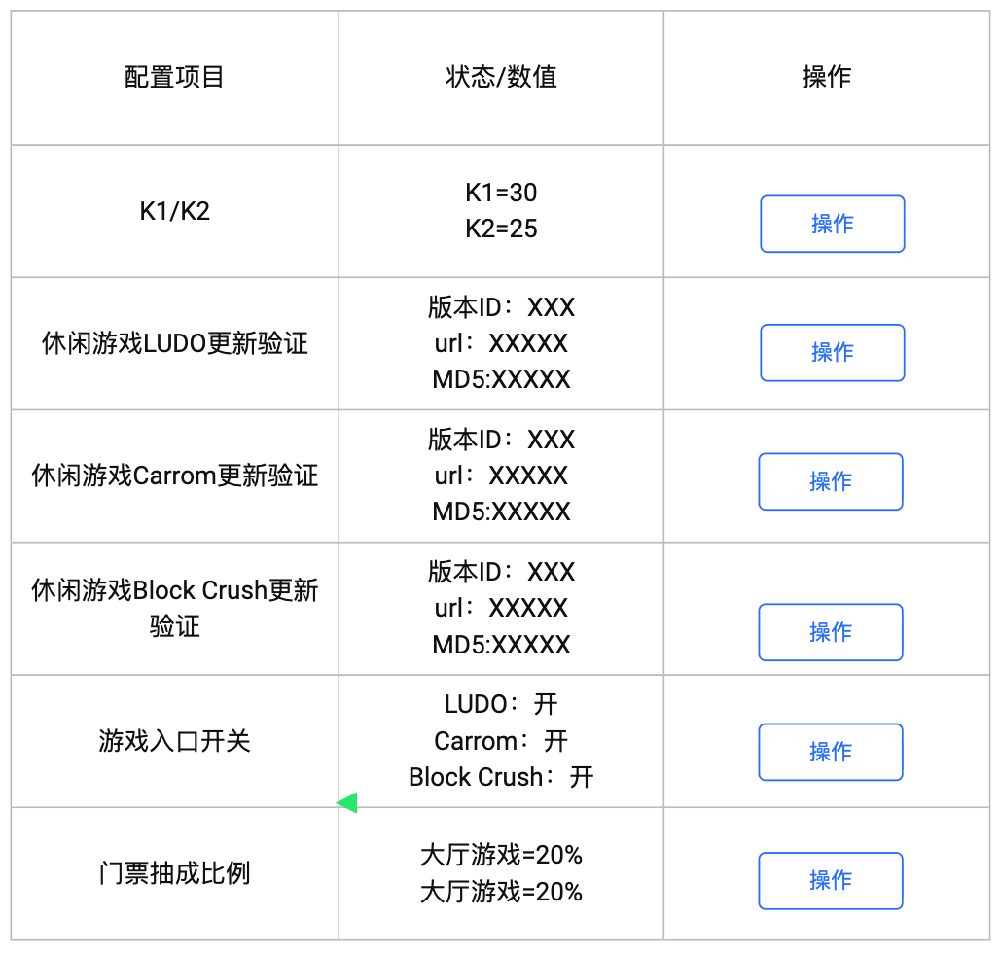

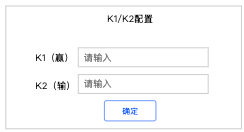

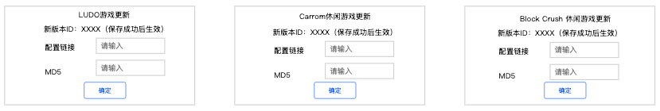

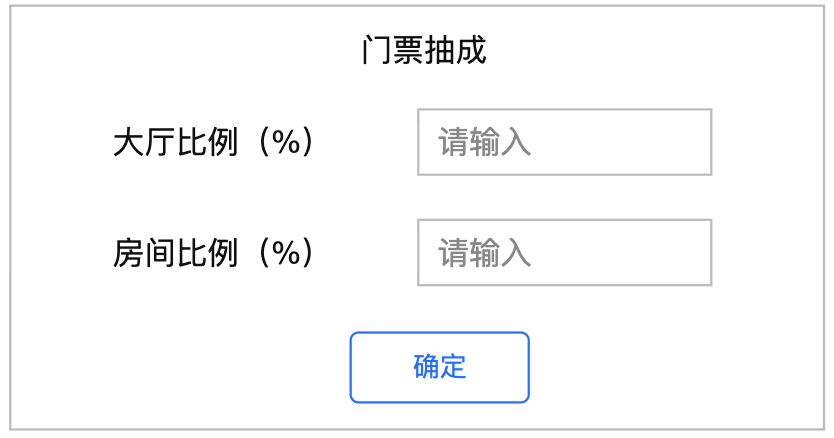

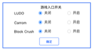

3.4.2.3休闲游戏门票配置管理后台

| 功能描述 | 门票配置管理后台 |
|---|---|
| 优先级 | 高 |
| 输入/前置条件 |  |
| 需求描述 | 需求描述： 入口：后台平台tab下新增“休闲游戏”模块，新增对应内容； 门票管理 筛选字段（移除） 游戏名称选择 字段描述 游戏ID：对应游戏得ID 游戏名称：对应游戏得名称 游戏厂商：添加游戏时得厂商标记 大厅门票配置：游戏大厅对应游戏得门票配置 房间内门票配置：房间内游戏门票配置 操作项目： 新增/编辑如下图（仅保留编辑） 操作说明 游戏ID：必填，输入检索出对应游戏显示对应游戏得名称图标与厂商，若检索不到对应游戏ID则提示：请检查ID并重新输入 大厅门票配置：最少配置1档最多支持10档 房间内门票配置：最少配置1档最多支持10档 |
| 输出/后置条件 |  |
| 补充说明 |  |

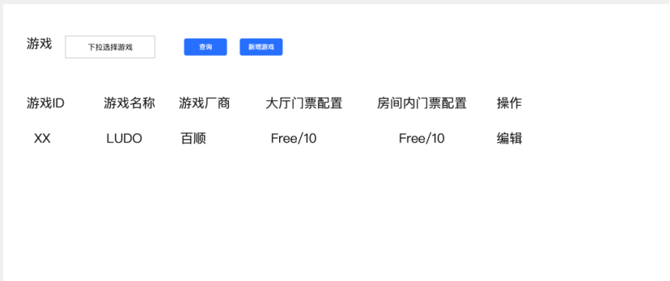

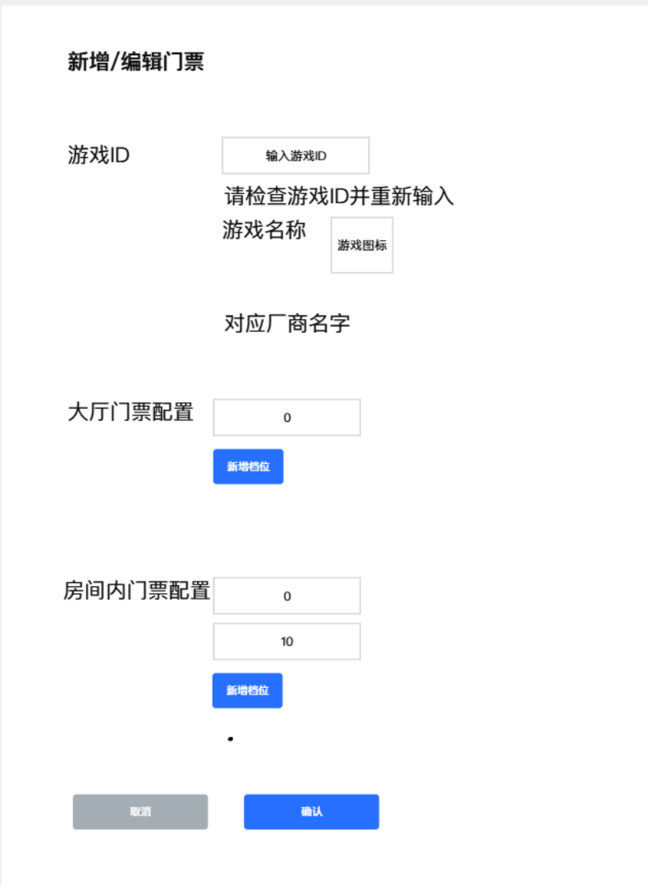

3.4.2.4休闲游戏对局明细后台（只开发不测）

| 功能描述 | 休闲游戏对局明细 |
|---|---|
| 优先级 | 高 |
| 输入/前置条件 |  |
| 需求描述 | 需求描述： 入口：后台平台tab下新增“休闲游戏”模块，新增对应内容； 对局明细 筛选字段 字段说明： 点击参与用户、获胜用户 打开用户对局明细表，详情如下 字段说明 |
| 输出/后置条件 |  |
| 补充说明 | 7.13移除被踢出字段描述 |

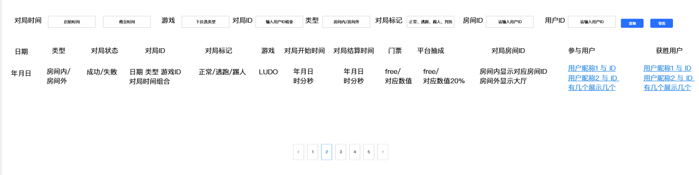

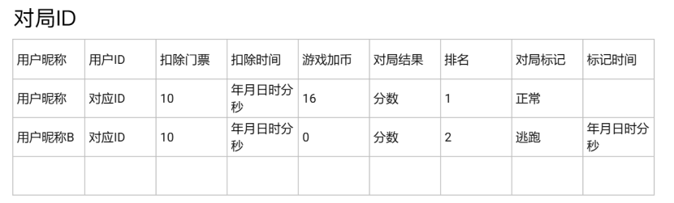

3.4.4需更包的运营后台需求（及祥）

3.4.4.1活动管理优化

| 功能描述 | 配置房间侧边栏活动时，可同时配置多个活动 |
|---|---|
| 优先级 | 高 |
| 输入/前置条件 |  |
| 需求描述 | 需求路径：平台配置-Banner管理-活动管理 需求描述： 配置房间侧边栏活动时，可同时配置多个活动（当前只能配置1个活动）多活动应用内轮播展示5秒切换下一个活动无限循环，活动排序根据序号展示，序号越小越靠前（需要更包） 应用内展示效果 |
| 输出/后置条件 |  |
| 补充说明 | 老版本默认展示排序第一得活动 |

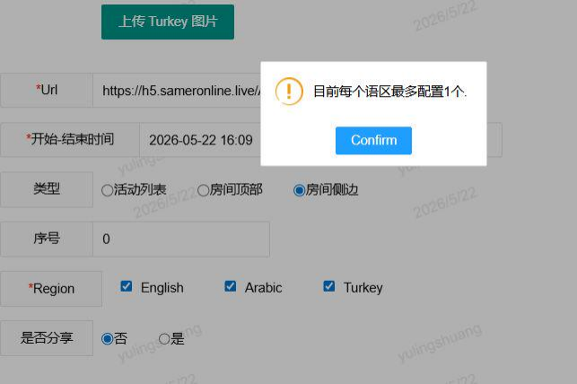

3.4.4.2活动页面展示优化

| 功能描述 | 前端页面展示活动标题 优化Banner列表和活动管理支持多语言配置标题 支持版本号“版本号”配置7.9日更新 |
|---|---|
| 优先级 | 高 |
| 输入/前置条件 |  |
| 需求描述 | 1.活动管理后台设置活动标题：需要支持在应用内前端展示当前配置的活动的多语言标题 2.需求路径：平台配置-Banner管理-Banner列表和活动管理 需求描述： Banner列表：配置H5时增加多语言标题，并于前端展示 3.Banner列表：“版本号”配置选项，显示版本范围 版本号配置说明： 最低版本：输入版本号后大于等于此版本号显示banner 非必填 活动管理：新增“显示设备”选项（IOS、安卓） 版本号配置说明： 最低版本：输入版本号后大于等于此版本号显示活动 非必填 |
| 输出/后置条件 |  |
| 补充说明 |  |

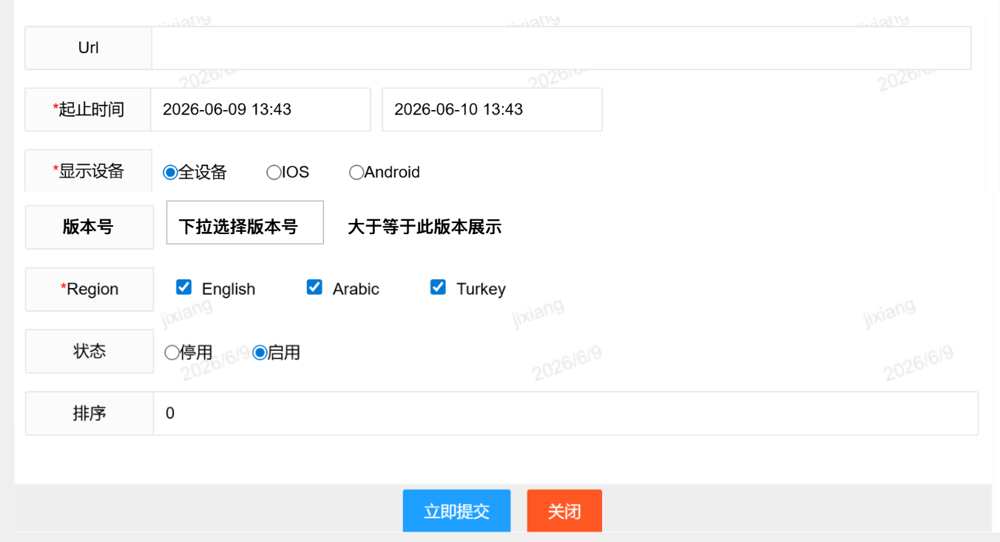

3.4.5 日报增加游戏字段（许静）（当前版本仅开发不发布，不测试）

| 功能名称 | 邮件日报增加游戏字段 |
|---|---|
| 优先级 | 高 |
| 功能描述 | / |
| 输入/前置条件 | / |
| 需求描述 | 日报数据增加【游戏】数据模块（双端） 统计字段： 游戏人数：当日所有三方休闲游戏点击加入游戏且开始游戏的人数（去重） 游戏局数：当日所有三方休闲游戏开启游戏的对局数 新用户参与游戏率（%）：今日新注册用户参与人数/今日新注册人数，开始游戏才算参与，人数去重 新用户参与游戏次留率（%）：昨日新注册用户在今日参与人数/昨日新注册用户参与人数，开始游戏才算参与，人数去重 活跃用户参与游戏率（%）：今日参与游戏用户人数/今日活跃用户人数，开始游戏才算参与，人数去重 |
| 补充说明 | / |

3.4.6 版本更新弹窗支持后台根据语区配置（许静）

| 功能名称 | 版本更新弹窗支持后台根据语区配置 |
|---|---|
| 优先级 | 高 |
| 功能描述 | / |
| 输入/前置条件 | / |
| 需求描述 | 后台版本更新弹窗支持后台根据语区配置；每个语区需要上传3种语言文案 |
| 补充说明 | / |

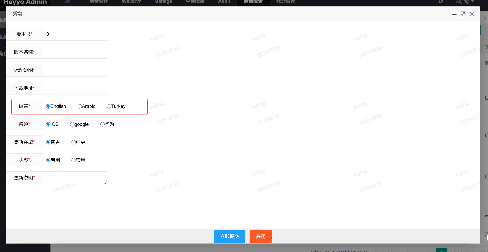
