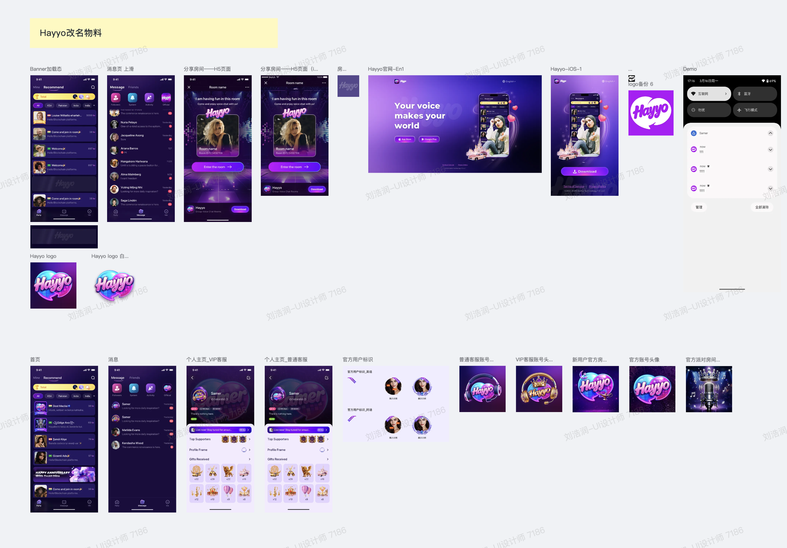

# 应用名称 / 更新 / 品牌
> 功能 ID：`app-branding` · 权威：`current` · 产品：Hayyo · 更新：2026-09-16  
> 现行规则收到 V1.4.0。旧版原文见 [`history/`](history/)。叠稿回退见 [`history/PRD.stacked-2026-09-16.md`](history/PRD.stacked-2026-09-16.md)。  
> 拍板记录见 [`../../CONFIRMED.md`](../../CONFIRMED.md)。未收入版本或原文未写的接口/字段：不编造。

## 范围
- 对外品牌 **Hayyo**。默认昵称 / 房间名 / 后台重置前缀 = `player`（昵称规则权威在 [`../infra/PRD.md`](../infra/PRD.md)）。
- scheme `samer` / `parchisw` 本轮不改名。
- 应用改名物料、强制更新 / 版本更新弹窗、iOS 首页配置。

## 关联后台
- 后台页面与配置以 [`../admin/PRD.md`](../admin/PRD.md) 为准；本文只写 App 侧规则。
- 版本更新弹窗语区配置：[`../admin/PRD.md#admin-update-popup`](../admin/PRD.md#admin-update-popup)
- 活动 / Banner：[`../admin/PRD.md#admin-banner`](../admin/PRD.md#admin-banner)

## 规则

图相对路径为 `images/`。

### 应用改名

| 功能名称 | 应用改名涉及改动 |
|---|---|
| 优先级 | 高 |
| 功能描述 | / |
| 输入/前置条件 | / |
| 需求描述 | 应用Logo、App启动/登录/官网页面名称&Logo、房间分享页面名称&Logo、离线推送消息图标、官方消息图标、官方账号标识（具体详见UI设计稿）； 刷新加载动效； 拉新海报图片； 隐私协议及相关协议更换名称、邮箱； 第三方账号修改应用名、LOGO； 短信发送文案模板调整； 翻译：1）服务端翻译；2）客户端翻译：app 名 ，优惠券说明文案等；3）H5翻译：拉新说明文案、数值游戏说明文案等； 应用名修改涉及翻译调整：https://365.kdocs.cn/l/csvSvcsttQ2X 注：研发侧需要检查是否遗漏； 【后台】日报邮件名称、后台运营管理Logo&名称（正式/测试环境）； 改名涉及技术参数调整： 背景：为了将waha项目与samer项目隔离的更彻底，避免在iOS客户端使用"samer" scheme。 修改内容：android 客户端 需提前预埋外部浏览器唤醒app的逻辑，同时支持 "samer" 和 "parchisw" scheme。h5将在后续版本统一将 scheme 从 "samer" 改为 "parchisw" 影响范围：yalla pay 支付页面登录token过期后唤醒app iOS：因安卓已修改名称，以下内容安卓端仅修改Logo、加载图标、占位图标。 隐私协议及相关协议更换名称（双端共用隐私协议、官网）； 官网增加”儿童安全协议“内容； 官网Logo更换；官网布局调整；隐私协议调整，涉及游戏； 拉新分享海报logo图片。 |
| 补充说明 | 相关美术物料具体详见UI设计稿 |

### 强制更新提示（iOS 补齐）

| 功能名称 | 强制更新提示 |
|---|---|
| 优先级 | 高 |
| 输入/前置条件 | / |
| 需求描述 | 背景：Waha ios v 1.2.2未实现强制更新功能； 需求：若后续需要强制更新，服务端操作后，该版本的用户被强制退出，点击苹果登录授权后 或 输入手机号登录点击“Next”时 提示“请更新版本”的弹窗。 |
| 补充说明 | 研发已实现需测试 |

### 强制更新与版本更新弹窗

| 功能名称 | 强制更新弹窗、版本更新弹窗 |
|---|---|
| 优先级 | 高 |
| 输入/前置条件 | / |
| 需求描述 | 弹窗展示优先级（逻辑同Hayyo安卓端）： 强制弹窗/版本更新弹窗＞协议弹窗＞业务弹窗（活动弹窗、新人礼包、签到） 注： 1）强更/普更不进弹窗队列，队列权威见 [`../infra/PRD.md`](../infra/PRD.md)； 2）有强制更新弹窗不会有版本更新弹窗（已实现强更弹窗优先级大于版本更新弹窗）； 3. 客户端判断隐私协议版本号是否更新，若更新则弹出隐私协议弹窗，否则不弹 特殊场景重点关注： 1）第一次下载包的新注册用户不会弹隐私协议； 2）更新协议版本号时，当前设备没有卸载APP的情况下，老账号没有点击确认掉新版本的隐私协议，这个时候新注册一个号登录时会弹出隐私协议 |
| 补充说明 |  |

### 爆奖礼物与等级经验

爆奖礼物消费金币计算用户等级经验值，经验值与消费金币数比例同线上不变（1经验=4000金币）。

### iOS 服务端指定首页

| 功能名称 | iOS 服务端指定首页 |
|---|---|
| 优先级 | 高 |
| 需求描述 | iOS 需要支持首页配置：根据服务端配置，切换进入应用内的首页。 |
| 补充说明 | 强更/普更不进弹窗队列，见 infra。 |

## 版本

明细见 [`changelog.md`](changelog.md)。原文切片与叠稿在 [`history/`](history/)。
