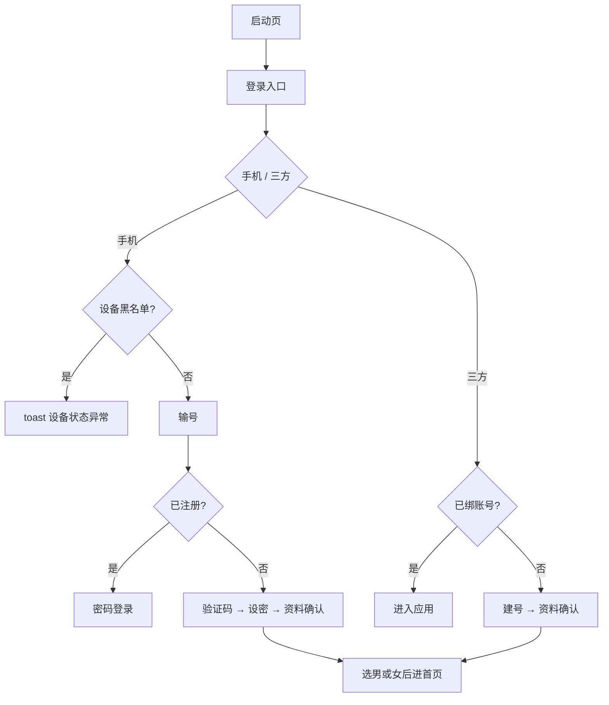

# 登录注册 · 现行说明

> 派生阅读层。改规则仍改 [`../PRD.md`](../PRD.md)。基于已收录主线 **V1.4.0**。拍板 RQ-04、RQ-05、RQ-06、RQ-07。

## 元信息
<!-- chunk:no -->

| 字段 | 值 |
|---|---|
| 功能 ID | `auth-login` |
| 截止版本 | 已收录 V1.4.0 |
| 权威 | 派生；冲突以 `PRD.md` 为准，拍板见 [`../../../CONFIRMED.md`](../../../CONFIRMED.md) |
| 状态 | pending-review |

---

## 范围
<!-- chunk:default section=scope id=auth-login.scope -->

覆盖启动 / 登录注册、手机号、验证码、密码、三方登录、后绑定入口、问题反馈、设备指纹封禁。登录注册、绑 / 换绑、改密、注销、提现短信共用配额：同设备 + 同号，GMT+3 自然日 ≤10。币商自充短信不与本配额合并。infra 按场景 2～3 条、9 个 TBD 不当现行。新用户必须在资料确认选男或女才能进首页，选后不可改。Not Specified 不是线上默认。默认昵称前缀 `player`。产品名 Hayyo。注销拦截见个人中心：封禁 / 冻币、未绑定、30 天冷却；无主播 / 工会 / 家族拦截，无贵族订阅拦截。「查看取消订阅步骤」只说明商店订阅。当前版本不支持游客。不覆盖后台用户字段表。

---

## 总流程
<!-- chunk:default section=flow id=auth-login.flow-main -->

启动页后进登录入口。点手机登录先判设备黑名单，再选国家输号：已注册走密码登录，未注册判设备注册数和验证码配额后发码、设密、资料确认。三方登录未绑则建号再资料确认。指纹封禁弹窗强制登出。

---

## 业务逻辑

### 入口与语言 {#logic-entry}
<!-- chunk:default section=logic id=auth-login.logic-entry -->

不支持游客，必须先登录。入口：手机登录注册；三方 Facebook / Google / 苹果（苹果仅 iOS 且系统 ≥13）。另有 TikTok、Snapchat。协议：服务条款 / 隐私政策。应用语言跟系统：非英 / 阿 / 土则默认英语。点手机登录若设备在黑名单，toast「设备状态异常，请尝试更换其他设备登录。」

### 国家与手机号 {#logic-phone}
<!-- chunk:default section=logic id=auth-login.logic-phone -->

默认区号跟系统国家，不在列表则沙特。列表：英语按国名 A–Z；阿语按阿语字母；土语按 A B C Ç … Z。只可输入数字；首位 0 不计入长度；换区号超长从末尾删。下一步在位数达标后亮起。已注册走登录，未注册走注册。设备已注册账号数超过 10：弹窗「很抱歉，当前设备注册已达上限，请更换其他设备后再次尝试。」

### 验证码配额 {#logic-sms}
<!-- chunk:default section=logic id=auth-login.logic-sms -->

登录注册、绑 / 换绑、改密、注销、提现短信共用：同设备 + 同号，GMT+3 自然日 ≤10。达上限弹窗「很抱歉，您当日获取验证码的次数已达上限，请明日再试」。刷新当地 0 点（GMT+3）。币商自充短信不合并。验证码 6 位数字；发送成功 toast「验证码已发送～」；60 秒倒计时，每分钟一次，重发旧码失效。同一号 60 秒内再进继续倒计时。提现验证码不另开规则，见积分提现。

### 设密与建号 {#logic-password}
<!-- chunk:default section=logic id=auth-login.logic-password -->

密码 8–16 位，数字、英文（区分大小写）和 ASCII 可见字符，不允许空格。默认脱敏。不满 8 位「进入 Hayyo」置灰；超 16 退格。格式错 toast「密码不可使用特殊字符」；成功 toast「设置成功！」并建号。默认昵称 `player_{用户ID}`；默认头像系统第一个；国籍取注册手机号国家；生日默认注册日减 18 年；简介空。用户 ID：默认 6 位起步首位不为 0，扣除特殊 ID；显示 ID = 自增 ID + 2 位随机。性别必须在资料确认选男或女，选后不可改。Not Specified 不是线上默认。

### 密码登录与找回 {#logic-login}
<!-- chunk:default section=logic id=auth-login.logic-login -->

自然日内连续错 10 次后第 11 次提示「错误次数过多，请 {60s} 后再试」，1 分钟内不得再验。10 次内错误 toast「账号或密码错误」并短震。正确后错误数重置。再判封禁：封禁年数小于 100 年弹窗带解禁时间（GMT+3）；大于 100 年「永久封禁」。从注册 / 登录返回时顶部可出问题反馈条，停留 5 秒。找回密码：先验手机再设新密，规则同注册，标题「密码找回」。

### 三方与后绑定 {#logic-third}
<!-- chunk:default section=logic id=auth-login.logic-third -->

未绑则建号（昵称取三方名；国家取手机国家，不在列表显示 word / 默认国家；生日注册日减 18 年），再资料确认。已绑直接进。未装 Facebook / TikTok 走内置浏览器；仅支持已装 App 授权时 toast「请先安装 “XXX” 后再尝试登录」。Snapchat 登录用 Play Age Signals：低于 18（不含 18）或返回空，toast「限制 18 岁及以上用户使用」；本轮不做开关。退出后强化展示上次成功登录方式（本地缓存；清缓存回默认）。TikTok / Snapchat 也可后绑定；已绑其它 ID toast「对不起，该账号已绑定其他 ID！」；解绑须先绑手机。注销三方验证阶段同样增加这两项。

### 设备封禁 {#logic-ban}
<!-- chunk:default section=logic id=auth-login.logic-ban -->

指纹封禁：即时「你已被禁止登录」，强制登出到登录页，**弹窗**展示理由。后台打开、杀进程后再开、token 到期后再点登录同样提示。设备号封禁仍用原 toast，不改弹窗。

---

## 客户端页面

### 启动与入口 {#page-entry}
<!-- chunk:default section=page id=auth-login.page-entry -->

启动页：产品 logo / 名称 / 背景。登录入口页：手机按钮、三方按钮、协议。上次登录记忆改变除 Google / 苹果外的排布。

### 手机号与验证码 {#page-phone}
<!-- chunk:default section=page id=auth-login.page-phone -->

欢迎文案、区号、手机号框、下一步。验证码页展示未脱敏手机号、6 格、收不到验证码、重发倒计时。

### 问题反馈 {#page-feedback}
<!-- chunk:default section=page id=auth-login.page-feedback -->

从密登返回条进入。反馈内容必填 10–200 字；联系方式必填最多 50 字；图片最多 4 张、选填，压到 1M 以内。少于 10 字 toast「反馈内容填写过少！」；全空格 toast「反馈内容不能为空！」。有编辑内容时返回须确认放弃。

### 资料确认 {#page-profile}
<!-- chunk:default section=page id=auth-login.page-profile -->

必选男或女才能进首页，选后不可改。Not Specified 不是线上默认。默认头像改本地存储；选性别时头像走本地缓存。三方等待响应需加载图标。国家 / 语区预选见基建。

---

## 后台影响
<!-- chunk:default section=admin id=auth-login.admin-impact -->

用户管理 / 封禁（弱关联）。本文不复制后台字段。跳转 [`../../admin/PRD.md#admin-users`](../../admin/PRD.md#admin-users)。提现验证码不另开配额。

---

## 关联影响

### 关联 · 个人中心 {#related-profile}
<!-- chunk:related-row section=related id=auth-login.related-profile target=profile -->

注销拦截、绑 / 换绑、改密入口在个人中心。跳转 [`../../profile/brief/current.md`](../../profile/brief/current.md)。

### 关联 · 积分提现 {#related-payout}
<!-- chunk:related-row section=related id=auth-login.related-payout target=payout -->

提现短信共用本配额，不另开规则。跳转 [`../../payout/brief/current.md`](../../payout/brief/current.md)。

### 关联 · 基建 {#related-infra}
<!-- chunk:related-row section=related id=auth-login.related-infra target=infra -->

资料确认、国家语区分配、默认昵称前缀 `player`。跳转 [`../../infra/brief/current.md`](../../infra/brief/current.md)。

### 关联 · 币商 {#related-merchant}
<!-- chunk:related-row section=related id=auth-login.related-merchant target=merchant -->

币商自充短信单独计数，不与登录绑换绑改密注销提现配额合并。跳转 [`../../merchant/brief/current.md`](../../merchant/brief/current.md)。

### 关联 · 运营后台 {#related-admin}
<!-- chunk:related-row section=related id=auth-login.related-admin target=admin -->

用户管理 / 封禁弱关联。跳转 [`../../admin/brief/current.md#admin-users`](../../admin/brief/current.md#admin-users)。

---

## 相对变化
<!-- chunk:changelog section=changelog id=auth-login.changelog -->

相对原文：对外品牌 Hayyo，按钮为「进入Hayyo」；默认昵称前缀 `player`。短信改为同设备 + 同号 GMT+3 自然日 ≤10 的共用配额，币商自充不合并。新用户资料确认必须选男或女，Not Specified 不是线上默认。注销无主播 / 工会 / 家族 / 贵族订阅拦截。设备指纹封禁改为弹窗加理由；设备号封禁仍 toast。

---

## 原文
<!-- chunk:no -->

[`../PRD.md`](../PRD.md) · [`../changelog.md`](../changelog.md) · [`../history/`](../history/)

---

## 计划预览
<!-- chunk:no -->

V1.5.0 工作区不是现行。无已收录之后的版本计划进入本文。

---

## 待校对
<!-- chunk:no -->

- Apple / Facebook / Google 国家不在列表时原文写默认显示「word」，个人中心三方国家写「未知」，未在本功能拍板合并。
- 设密生成「系统头像第一个」，个人中心头像编辑写按性别各 12 个随机分配，两处并存。
- TikTok 国家不在列表的句子原文残缺，本文不补全。
