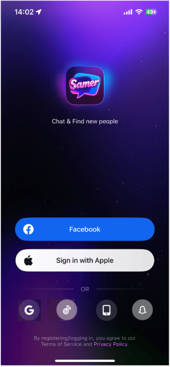
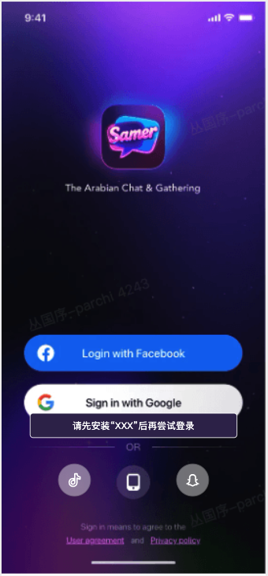
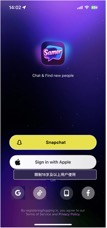
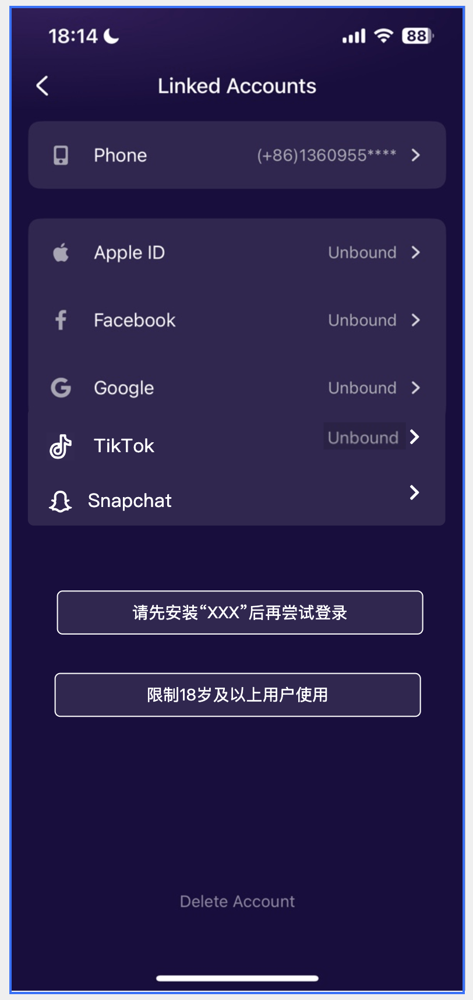
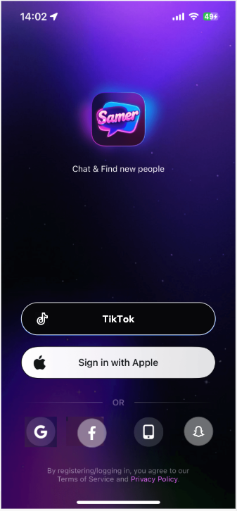
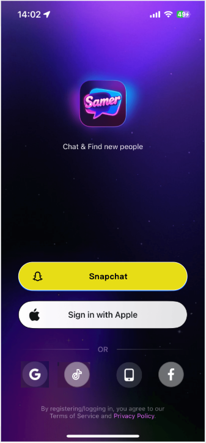
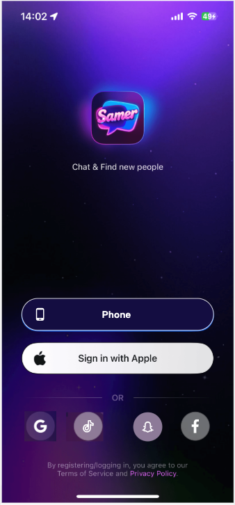
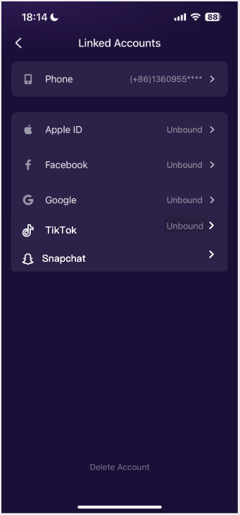
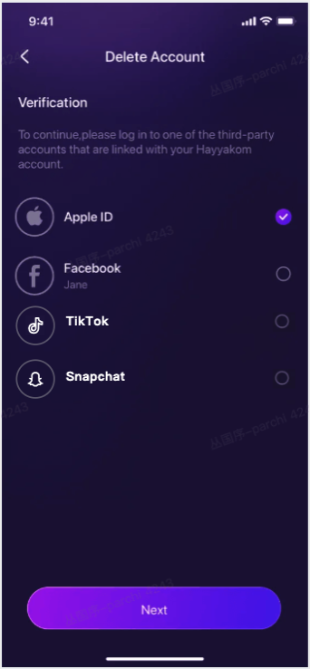

# 登录注册 — V1.1.0 原文切片

> 状态：`history`（非权威） · 来源见正文

## 3.5第五部分 登录-优化新增（丛国序）

3.5第五部分 登录-优化新增（丛国序）

3.5.1登录新增

| 功能名称 | 新增登录方式 |
|---|---|
| 优先级 | 高 |
| 功能描述 |  |
| 输入/前置条件 | / |
| 交互原型 | 「图1」                             「图2」 |
| 字段描述 | 增加Tiktok和snapchat登录； 苹果如「图1」所示； Google「图2」所示； |
| 需求描述 | TikTok登录 点击TikTok登录入口，即可发起TikTok的授权登录请求。请求成功后： 若当前TikTok账号未绑定账号，则生成一个新的账号（昵称取TikTok账号的用户名），进入应用。国家取手机国家，取到的手机国家不在应用提供的国家列表中，则显示默认3. 尝试拿到这些社媒的头像（如果有，并且接入鉴黄），如果拿不到或违规，则在最后的性别选择页面用默认（已有逻辑）； 国家； 生日取注册年月日减去18年的日期； 新生成账号要经过最终性别选择和国籍选择相关页面后正式进入应用； 若当前的TikTok账号已绑定账号，则直接进入应用； 若手机没有安装TikTok软件，则通过内部浏览器打开TikTok网站登录入口； SnapChat登录 点击Snapchat登录入口，即可发起Snapchat的授权登录请求，请求成功后： 如果手机已经登陆Snapchat账号则进行Snapchat账号选择，如果没有登录则通过Snapchat登录流程先登录Snapchat账号； 若当前Snapchat账号未绑定账号，则生成一个新的账号（昵称取Snapchat账号的用户名），进入应用。国家取手机国家，取到的手机国家不在应用提供的国家列表中，则显示默认国家； 生日取注册年月日减去18年的日期； 新生成账号要经过最终性别选择和国籍选择相关页面后正式进入应用； 若当前的Snapchat账号已绑定账号，则直接进入应用； 尝试拿到这些社媒的头像（如果有，并且接入鉴黄），如果拿不到或违规，则在最后的性别选择页面用默认（已有逻辑）； 通用说明（建议方案）： 如果三方支持，移动端在已经安装对应App（TikTok和Snapchat）则直接调用开启用户已经安装的App，进行登录授权； 如果三方支持，移动端在未安装对应App的情况下（Snapchat），则在应用内打开三放的登录的H5页面，进行登录授权； 如果三方仅支持，移动端打开已经安装对应App，才可进行授权登录，不支持H5授权，那么则toast提示“请先安装“XXX”后再尝试登录“； 尝试拿到这些社媒的头像（如果有，并且接入鉴黄）； |
| 补充说明 | 版本新增：Play Age Signals API，和Snapchat登录限制(6月9日新增)： 获取时间：当前版本：用户点击 Snapchat（登录或绑定），然后通过，Play Age Signals API吊起获取年龄，根据年龄提示判断； 当前仅在此做调用判断，当前暂时不针对这个年龄判断的登录功能做开关限制； 仅针对：用户点击使用Snapchat 进行登录时判断用户年龄，如果用户年龄低于18（小于18，不包含18）时，toast提示：“限制18岁及以上用户使用”； 如果返回为空，则按照小于18处理； 「图1」 |

3.5.2 上次登录记忆

| 功能名称 | 退出登录后记忆上次登录的方式 |
|---|---|
| 优先级 | 高 |
| 功能描述 | / |
| 输入/前置条件 | / |
| 交互原型 | 「图1」                    「图2」 「图3」                     「图4」 |
| 字段描述 |  |
| 需求描述 | 当用户主动退出登录或被动下线后，则强化展示上次登录成功的登录方式，如图所示； Google和苹果登录位置保持不变； 其余登录方式变化如图所示，为本地缓存，如果过删除app清理缓存，则重制默认展示规则； 登录记录仅跟上次登录成功的方式有关，与账号无关； 默认展示规则为「图4」类型（根据G和A系统自动选）； |
| 补充说明 | / |

3.5.3 后绑定入口

| 功能名称 | 后绑定解绑入口 |
|---|---|
| 优先级 | 高 |
| 功能描述 | / |
| 输入/前置条件 | / |
| 交互原型 | 「图1」            「图2」 |
| 字段描述 | / |
| 需求描述 | 绑定增加两个方式：TikTok和Snapchat 如果没有绑定则展示Unbound，绑定后则不展示（已有逻辑）； 未绑定状态下，点击后直接走绑定逻辑（已有和其他三方绑定方式相同）； 绑定状态下，点击后走解绑逻辑（已有和其他三方绑定方式相同）； 绑定方式和登录请求三方授权逻辑相同； 通用说明（建议方案）： 如果三方支持，移动端在已经安装对应App（TikTok和Snapchat）则直接调用开启用户已经安装的App，进行登录授权； 如果三方支持，移动端在未安装对应App的情况下（Snapchat），则在应用内打开三放的登录的H5页面，进行登录授权； 如果三方仅支持，移动端打开已经安装对应App，才可进行授权登录，不支持H5授权，那么则toast提示“请先安装“XXX”后再尝试登录“； 绑定和解除绑定（已有逻辑通用） 如果未绑定相关账号，点击后进入三方账号绑定流程，但是需判断该三方账号是否已经绑定过其他ID，如果绑定则提示“对不起，该账号已绑定其他ID！” 如果该ID已绑定三方账号；点击后则进入解绑流程，解绑三方账号，需要优先绑定手机后可解绑； 账号删除（4月9日增补），「图2」 在删除账号的三方验证阶段，也增补TikTok和Snapchat两个选项； 仅绑定了三方的可以被展示； 和Facebook验证相同，在选择验证时，需要三方再次授权，且账号和绑定账号相同，方可进入下一个阶段； 即：逻辑都和原业务相同，仅增加相关的验证方式； 如果验证账号和绑定不同，则提示和当前三方验证错误提示相同“The account is not linked to this Samer account, please try again.”； |
| 补充说明 | / |

