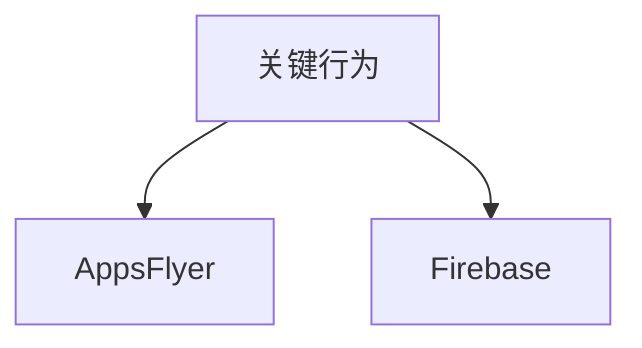

# 渠道埋点 · 现行说明

> 派生阅读层。改规则仍改 [`../PRD.md`](../PRD.md)。基于已收录主线 **V1.4.0**。

## 元信息
<!-- chunk:no -->

| 字段 | 值 |
|---|---|
| 功能 ID | `channel-tracking` |
| 截止版本 | 已收录 V1.4.0（正文来自更早版本，未被后文覆盖） |
| 权威 | 派生；冲突以 `PRD.md` 为准 |
| 状态 | pending-review |

---

## 范围
<!-- chunk:default section=scope id=channel-tracking.scope -->

覆盖 App 投放埋点口径（AppsFlyer / Firebase）。明细表外链不在本文展开。

---

## 总流程
<!-- chunk:default section=flow id=channel-tracking.flow-main -->

Android 与 iOS 在注册、留存、付费点击、完成付费（含金额）、进房、上麦、玩水果机、送礼等节点向 AF 和 Firebase 上报，供投放按指标优化。

---

## 业务逻辑

### 埋点口径 {#logic-events}
<!-- chunk:default section=logic id=channel-tracking.logic-events -->

| 指标 | 口径 |
|---|---|
| 注册 | 渠道注册成功 |
| 留存 | 次日、三日、七日；登录行为，口径以平台定义为准 |
| 点击付费 | 所有点击付费入口；首充礼包的充值按钮；充值页面 / 充值弹窗点击充值按钮 |
| 完成付费 | 完成充值，按订单；应用内购成功；渠道充值成功（含币商）；**完成充值的金额也要上报** |
| 进入房间 | 进入房间行为 |
| 上麦 | 上麦行为 |
| 玩水果机 | 付费玩水果机的行为 |
| 送礼 | 产生金币送礼成功的行为 |

版本埋点明细见原文外链，本文不展开。

---

## 客户端页面

### 无独立页面 {#page-none}
<!-- chunk:default section=page id=channel-tracking.page-none -->

本功能不另做独立页面。埋点挂在既有注册、充值、房间、水果机、送礼流程上。

---

## 后台影响
<!-- chunk:default section=admin id=channel-tracking.admin-impact -->

渠道报表以后台为准。跳转 [`../../admin/PRD.md#admin-stats-channel`](../../admin/PRD.md#admin-stats-channel)。本文不复制报表字段。

---

## 关联影响

### 关联 · 运营后台 {#related-admin}
<!-- chunk:related-row section=related id=channel-tracking.related-admin target=admin -->

渠道报表。跳转 [`../../admin/brief/current.md#admin-stats-channel`](../../admin/brief/current.md#admin-stats-channel)。

### 关联 · 房间游戏 {#related-room-game}
<!-- chunk:related-row section=related id=channel-tracking.related-room-game target=room-game -->

「玩水果机」统计付费玩水果机。跳转 [`../../room-game/brief/current.md`](../../room-game/brief/current.md)。

---

## 相对变化
<!-- chunk:changelog section=changelog id=channel-tracking.changelog -->

相对原文：只保留 AF / Firebase 口径表；明细表外链不展开。完成付费须带金额。

---

## 原文
<!-- chunk:no -->

[`../PRD.md`](../PRD.md) · [`../changelog.md`](../changelog.md) · [`../history/`](../history/)

---

## 计划预览
<!-- chunk:no -->

V1.5.0 工作区不是现行，不进入正文。升格为已收录后再判定覆盖或增量。

---

## 待校对
<!-- chunk:no -->

- 原文「完成充值行为，按照订单最好」未改写为新口径，金额仍按充值成功订单上报。
- 埋点字段级明细只在外链，本文无事件名表。
