# 签到与任务
> 功能 ID：`checkin-task` · 权威：`current` · 产品：Hayyo · 更新：2026-09-16  
> 现行规则收到 V1.4.0。旧版原文见 [`history/`](history/)。叠稿回退见 [`history/PRD.stacked-2026-09-16.md`](history/PRD.stacked-2026-09-16.md)。  
> 拍板记录见 [`../../CONFIRMED.md`](../../CONFIRMED.md)。未收入版本或原文未写的接口/字段：不编造。

## 范围
- App 签到弹窗、任务页、签到结果。
- 签到奖品可发现行货币/道具：金币、宝石、头像框、座驾、房间背景、礼物。不发头饰卡、钻石。
- 原文「充值币」按金币来源标签理解，不是第三钱包。任务奖励到账为金币或宝石（以后台配置为准）。
- 签到配置页字段以后台为准，见关联后台。

## 关联后台
- 后台页面与配置以 [`../admin/PRD.md`](../admin/PRD.md) 为准；本文只写 App 侧规则。
- 签到管理：[`../admin/PRD.md#admin-checkin`](../admin/PRD.md#admin-checkin)
- 任务统计：[`../admin/PRD.md#admin-stats-task`](../admin/PRD.md#admin-stats-task)

## 规则

图相对路径为 `images/`。

### 签到和任务入口

| 功能名称 | 任务入口 |
|---|---|
| 优先级 | 高 |
| 功能描述 |  |
| 前置条件 | 在主页或ME页点击进入任务页 |
| 交互原型 | 「图1」                 「图2」 「图3」 「图4」               「图5」 |
| 字段描述 | 首页入口「图1」「图2」「图3」 状态一：未签到 0交互：点击后，打开签到弹窗； 状态二：未领取任务奖励 定义：当天已签到，且存在未领取的任务奖励时，展示该状态 展示：增加红点，吸引用户点击领取奖励 交互：点击后，进入任务页 状态三：静态入口 定义：当天已签到，且无未领取的任务奖励时，展示该状态 展示：静态展示 点击后，进入任务详情页； ME页任务入口：「图4」「图5」 点击Task，进入任务详情页 领奖提醒，若有待领取奖励的任务，则： 在task上增加红点 在底部tab增加红点 |
| 需求描述 | / |
| 补充说明 | / |

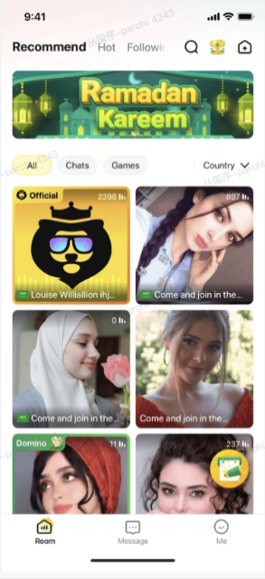

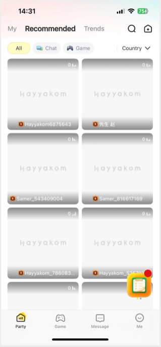

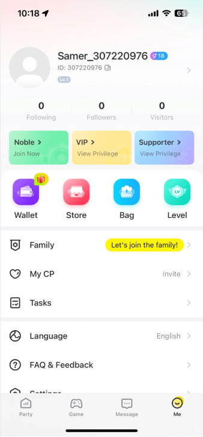

### 任务详情页

| 功能名称 | 任务详情页 |
|---|---|
| 优先级 | 高 |
| 功能描述 | 展示用户任务列表，可查看或领取奖励 |
| 前置条件 | 点击任务入口进入 |
| 交互原型 | 「图1」 「图2」                「图3」 |
| 字段描述 | 签到模块 展示：每一天签到可以获得的物品，为后台配置； 图片状态： 当天未签到，「图1」 进入页面后，签到模块展开； 展示动效，引导用户点击； 点击即签到，签到成功后展示签到结果弹窗 签到通用结果弹窗，自动关闭为2秒； 并且相关签到内容变更为已签到状态； 当天已签到，「图2」「图3」 进入页面默认不展开，如「图2」； 显示已经签到天数； 点击后可以展开，如「图3」； 新手任务模块 模块展示规则：在任务时间段内，展示该任务模块； 任务时间段：注册之日起，至第3个自然日24点（T+2的24点）； 说明：新用户注册后，获得新手任务；在任务结束前，新用户均可做任务并领取奖励。 模块标题：新手任务+(hh:mm:ss后结束) 时间格式：hh:mm:ss，时分秒倒计时 任务结束逻辑： 任务倒计时结束，结束所有任务（含未领取奖励的新手任务） 用户做完所有任务，并领取完所有新手任务奖励时，提前结束所有任务。 任务列表 排序 优先按任务状态排序：【Get】>【Go】>【Done】 再按任务自带序号顺序排序（见任务配置表） 变更说明：排序根据任务状态实时变更 任务内容：icon、任务说明、货币奖励 任务状态及交互 【Go】：该任务未完成，点击按钮跳转到对应页面 【Get】：任务已完成但未领取奖励，点击后获得宝石奖励，并toast提示“领取成功”；任务状态实时变更为【Done】 【Done】：任务奖励已领取，置灰，无交互 每日任务模块 任务列表 排序 优先按任务状态排序：【Get】>【Go】>【Done】 再按任务自带序号顺序排序（见任务配置表） 变更说明：排序根据任务状态实时变更 任务内容：icon、任务说明+任务进度、货币奖励 任务状态及交互 【Go】：该任务未完成，点击按钮跳转到对应页面 【Get】：任务已完成但未领取奖励，点击后获得宝石奖励，并toast提示“领取成功”；任务状态实时变更为【Done】 注：领取失败toast提示：“领取失败” 【Done】：任务奖励已领取，置灰，无交互 |
| 需求描述 | 新手任务（1月19修正数值） 每日任务（1月19修正数值） 说明： 任务完成后，不会因为任何规则变回未完成状态。 任务刷新机制： 新手任务：不刷新，到期后自动结束。 每日任务：每天24点（GMT+3）重置所有任务状态及进度。 货币奖励说明： 用户领取奖励，实时获得货币（金币或宝石，以后台配置为准；原文「充值币」不是独立钱包） 获得奖励明细文案：【任务奖励】 |
| 补充说明 | 推荐房： 随机进入任意一个运营推荐房。随机逻辑同进房引导。 若无，则跳转到官方房。 |

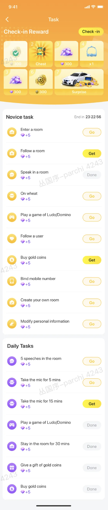

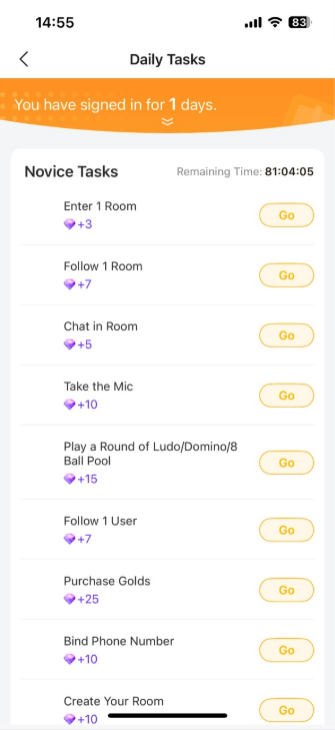

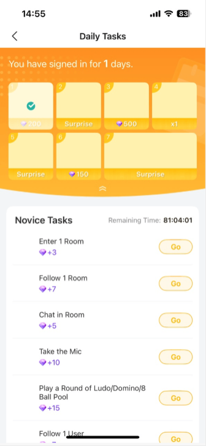

### 签到模块

| 功能名称 | 签到优化 |
|---|---|
| 优先级 | 高 |
| 功能描述 | 签到弹窗优化，签到后展示任务弹窗 |
| 前置条件 |  |
| 交互原型 | 「图1」                   「图2」 「图3」               「图4」 「图5」            「图6」 |
| 字段描述 | 签到弹窗「图1」 签到弹窗和交互 展示标题、7天的奖励缩略图，奖品图片与奖品，由后台配置； 展示规则：当天未签到时，在当天签到图上显示手指动效，引导用户点击（每天都展示） 签到操作：未签到时，点击当天未签到图即为“签到” 若用户当天未签到，每次重新启动APP，都弹签到弹窗； 已签到状态，展示对勾； 新人礼包：>签到弹窗：新注册用户，若需弹新人礼包，则不弹签到弹窗，以新人礼包为准； 签到结果弹窗 座驾/房间背景/头像框（显示商品图片与名称）+时长（时长展示逻辑同商城），如「图2」； 货币：显示货币图片+金币/宝石数量，如「图3」； 礼物：如果是礼物，则展示礼物个数和礼物图片； 弹窗自动关闭或转换 在任务详情，签到弹窗展示2s后，自动关闭； 非任务详情，签到弹窗展示2s后，转换为任务弹窗「图5」「图6」 任务弹窗「图5」「图6」 新手任务弹窗 说明：新手任务未结束的用户，展示新手任务弹窗； 主标题：“新手任务” 副标题：“hh:mm:ss后结束”（任务结束倒计时）； 任务列表：展示新手任务列表中，前3个任务 任务展示内容，展示顺序，交互方式与任务详情页一致 其它交互： 点击右上角关闭按钮，或蒙层：关闭弹窗 点击底部【更多任务】，进入任务页 每日任务弹窗 说明：无新手任务的用户，展示每日任务弹窗； 主标题：“每日任务” 副标题：“去你喜欢的房间做任务吧”； 任务列表：展示每日任务列表中，前3个任务； 任务展示内容，展示顺序，交互方式与任务页一致 其它交互： 点击右上角关闭按钮，或蒙层：关闭弹窗 点击底部【更多任务】，进入任务页 |
| 需求描述 | 签到逻辑： 用户每次签到，赠送对应奖励。（奖励缩略图、奖励由后台配置） 断签：若当天未签到，则清空累计签到次数，从新开始计算（1月23日）。。 连续7天：签到满7天后，当天24点后，重新开始计算签到次数。 刷新：每天0点（GMT+3）刷新签到。； 风控限制：同一设备号，每天仅限签到2次。若超过2次，则签到失败，并toast提示“当前设备今日签到次数已满”。 签到动效用户点击签到时，展示收到礼物的动效； 签到弹窗与新手引导优先级说明签到弹窗优先级>新手引导。新用户首次登录app，在关闭签到弹窗后，再展示首页新手引导。 异常处理：用户签到后，卸载重装不会再次弹签到弹窗。 |
| 补充说明 |  |

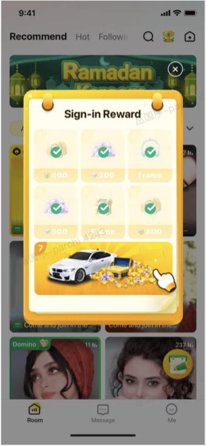

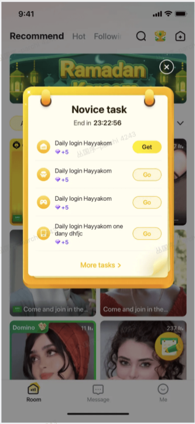

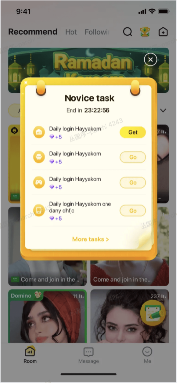

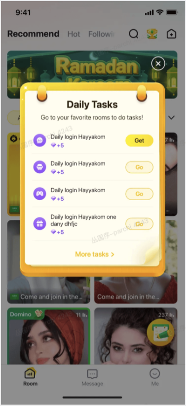

### 签到奖品口径（客户端）

奖品类型现行：金币、宝石、座驾、头像框、房间背景、礼物。不发头饰卡、钻石。签到奖品不支持赠送“永久”商品。

发放规则：用户签到，在当天的奖品中，按概率随机获得一个奖品。若是商品，则发放到背包中；若是货币，则发放到对应钱包（金币或宝石），对应记录为：“签到奖品”；若是头像框，则发放给用户，并在头像框页展示。

配置页字段、保存生效、概率总和须为 100 等以后台 [`../admin/PRD.md#admin-checkin`](../admin/PRD.md#admin-checkin) 为准。

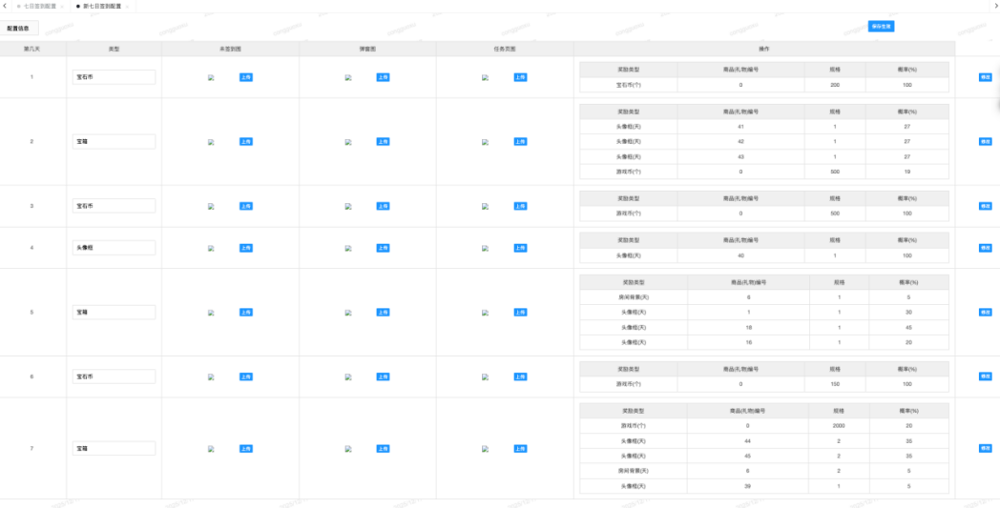

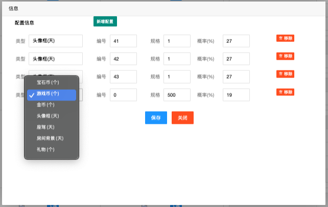

## 版本

明细见 [`changelog.md`](changelog.md)。原文切片与叠稿在 [`history/`](history/)。
