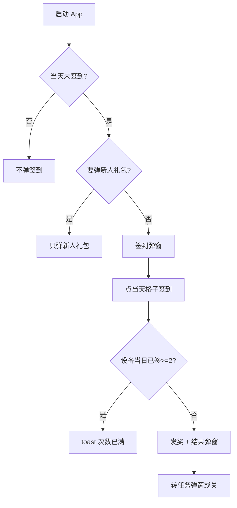

# 签到与任务 · 现行说明

> 派生阅读层。改规则仍改 [`../PRD.md`](../PRD.md)。基于已收录主线 **V1.4.0**。

## 元信息
<!-- chunk:no -->

| 字段 | 值 |
|---|---|
| 功能 ID | `checkin-task` |
| 截止版本 | 已收录 V1.4.0（正文来自 V1.0.0，未再被后文覆盖） |
| 权威 | 派生；冲突以 `PRD.md` 为准 |
| 状态 | pending-review |

---

## 范围
<!-- chunk:default section=scope id=checkin-task.scope -->

覆盖 App 签到弹窗、任务页、签到结果。奖品可为金币、宝石、头像框、座驾、房间背景、礼物。不发头饰卡、钻石。原文「充值币」按金币来源标签理解。不覆盖后台签到配置字段表。

---

## 总流程
<!-- chunk:default section=flow id=checkin-task.flow-main -->

未签到用户启动 App 弹出签到弹窗（新人礼包优先于签到弹窗；签到弹窗优先于首页新手引导）。点当天格子完成签到后出结果弹窗；在任务详情里 2 秒关闭，在非任务详情里 2 秒后转成任务弹窗。也可从首页或 Me 进任务页，展开签到模块或做新手 / 每日任务。

---

## 业务逻辑

### 签到规则 {#logic-checkin}
<!-- chunk:default section=logic id=checkin-task.logic-checkin -->

用户每次签到发放当天配置奖品。若当天未签到则清空累计签到次数，重新开始。连续满 7 天后，当天 24 点后重新计算。每天 0 点（GMT+3）刷新签到。同一设备号每天仅限签到 2 次；超过则签到失败，toast「当前设备今日签到次数已满」。用户签到后卸载重装不会再次弹签到弹窗。签到奖品不支持「永久」商品。发放：商品进背包；货币进金币或宝石钱包，流水「签到奖品」；头像框发放后在头像框页展示。当天奖品按概率随机一个，概率总和以后台为准。

### 任务规则 {#logic-task}
<!-- chunk:default section=logic id=checkin-task.logic-task -->

新手任务：注册之日起至第 3 个自然日 24 点（T+2 的 24 点）。倒计时结束则结束全部新手任务（含未领奖）；做完并领完也可提前结束。新手任务不刷新。每日任务：每天 24 点（GMT+3）重置状态和进度。任务完成后不会变回未完成。领取奖励实时到账为金币或宝石（以后台配置为准），明细文案【任务奖励】。领取失败 toast「领取失败」。推荐房：随机进运营推荐房，没有则官方房，随机逻辑同进房引导。

---

## 客户端页面

### 入口 {#page-entry}
<!-- chunk:default section=page id=checkin-task.page-entry -->

首页入口三态：未签到 → 打开签到弹窗；当天已签到且有未领任务奖励 → 红点，点击进任务页；当天已签到且无未领任务 → 静态入口，点击进任务详情。Me 页 Task：进任务详情；有待领任务则 Task 和底部 tab 出红点。

### 任务详情页 {#page-task}
<!-- chunk:default section=page id=checkin-task.page-task -->

签到模块：当天未签到则进入后展开并带动效；点击即签到，成功出结果弹窗（任务详情内 2 秒自动关），格子变已签到。当天已签到则默认不展开，显示已签天数，点击可展开。新手任务模块仅在任务时间段内展示，标题带倒计时。任务列表状态优先 Get > Go > Done，再按配置序号；Get 领宝石或后台配置货币后变 Done；Go 跳对应页；Done 置灰。每日任务同套状态机，列表带进度。

### 签到弹窗 {#page-popup}
<!-- chunk:default section=page id=checkin-task.page-popup -->

弹窗展示标题和 7 天奖励缩略图。未签到时当天格子有手指动效。未签到每次重新启动 App 都弹。已签到展示对勾。结果弹窗：座驾/房间背景/头像框显示商品图、名称和时长（同商城）；货币显示金币/宝石数量；礼物显示个数和图片。非任务详情下 2 秒后转任务弹窗：有未结束新手任务则出新手任务弹窗（前 3 条 + 更多任务）；否则出每日任务弹窗。关闭按钮或蒙层可关。

---

## 后台影响
<!-- chunk:default section=admin id=checkin-task.admin-impact -->

签到奖品、7 日格子、任务配置、概率以后台为准。跳转 [`../../admin/PRD.md#admin-checkin`](../../admin/PRD.md#admin-checkin)、[`../../admin/PRD.md#admin-stats-task`](../../admin/PRD.md#admin-stats-task)。

---

## 关联影响

### 关联 · 运营后台 {#related-admin}
<!-- chunk:related-row section=related id=checkin-task.related-admin target=admin -->

签到管理、任务统计。跳转 [`../../admin/brief/current.md#admin-checkin`](../../admin/brief/current.md#admin-checkin)、[`../../admin/brief/current.md#admin-stats-task`](../../admin/brief/current.md#admin-stats-task)。

### 关联 · 基建 {#related-infra}
<!-- chunk:related-row section=related id=checkin-task.related-infra target=infra -->

新人礼包优先于签到弹窗；签到弹窗优先于首页新手引导。跳转 [`../../infra/brief/current.md`](../../infra/brief/current.md)。

### 关联 · 商城 {#related-mall}
<!-- chunk:related-row section=related id=checkin-task.related-mall target=mall -->

签到发出的头像框、座驾、房间背景按商城商品时长和背包规则展示。跳转 [`../../mall/brief/current.md`](../../mall/brief/current.md)。

---

## 相对变化
<!-- chunk:changelog section=changelog id=checkin-task.changelog -->

相对原文：奖品口径去掉头饰卡和钻石；任务领取货币为金币或宝石，不再把「充值币」「游戏币」当现行币种。

---

## 原文
<!-- chunk:no -->

[`../PRD.md`](../PRD.md) · [`../changelog.md`](../changelog.md) · [`../history/`](../history/)

---

## 计划预览
<!-- chunk:no -->

无已收录之后的版本计划进入本文。

---

## 待校对
<!-- chunk:no -->

无。
