# 福利券 — V1.1.0 原文切片

> 状态：`history`（非权威） · 来源见正文  
> 说明：本切片后半「后台需求 / 3.7」权威已迁入 [`../../admin/PRD.md`](../../admin/PRD.md)；本文件保留 V1.1.0 Word 原文位置。

## 3.6 第六部分 新功能 – 福利券体系（丛国序）

3.6 第六部分 新功能 – 福利券体系（丛国序）

3.6.1消息类型

| 功能名称 | 消息类型 |
|---|---|
| 优先级 | 高 |
| 功能描述 | / |
| 输入/前置条件 | / |
| 交互原型 | 「图1」 |
| 字段描述 | / |
| 需求描述 | 券体系在支持系统消息： 消息类型：新获得： 每次收到同类型新券，不论数量，日期，只要收到新券都会收到消息如上图，都会触发对应券的消息类型，如图，消息支持点击跳转到应用内me中过的背包中对应的tab类型； 由于单次发放，支持同步发放两种类型，那么将会收到两条类型消息； 金币膨胀券：“恭喜，您获得了“膨胀券”！购买金币买的越多，膨胀后得到金币越多！点击查看“ VIP体验券：“恭喜，您获得了“VIP体验券”！点击查看” 即将过期提示： 每日的11点21点定时两次检测有券的用户券过期时间是否小于等于24小时；如图，消息支持点击跳转到应用内me中过的背包中对应的tab类型； 只要同类型，存在24小时过期的就会发消息，不同类型不同消息同时间发送； 金币膨胀券：“您还有X张“膨胀券”即将过期，请抓紧使用！购买金币买的越多，膨胀后得到金币越多！点击查看“ VIP体验券：“您还有X张“VIP体验券”即将过期，请抓紧使用！点击查看” X= 24（包括24）小时内即将过期的对应类型的券的数量； 通用说明： 如单次发放消息人/消息数量过多，可以支持系统消息队列，进行分段发放，具体根据性能调整，尽快发放即可； 例如每1分钟只发放500人等，具体问题具体分析； |
| 补充说明 | / |

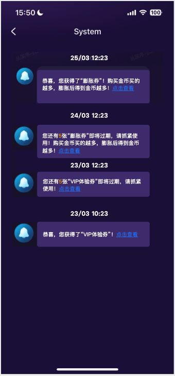

3.6.2 券历史获得记录

| 功能名称 | 券历史获得记录 |
|---|---|
| 优先级 | 高 |
| 功能描述 | / |
| 输入/前置条件 | / |
| 交互原型 | 「图1」                             「图2」 |
| 字段描述 | / |
| 需求描述 | 背包中，获得的历史记录中，下拉筛选，增加分类筛选的两个类型：膨胀券、VIP体验券 属性一：券类型：金币icon+充值膨胀比例、充值膨胀数量，VIP等级体验券 属性二：左侧展示属性，充值膨胀比例或固定数量（缩写规则参考后续文档），VIP勋章 属性三：获取时间，获取日期：dd/MM HH:mm(GMT+3)； 属性四：券状态 未使用（未开始）、获得未过期：如图，只展示对应的获取日期，不做其他展示； 未使用，获得后过了使用期限：展示“已过期”； 已经使用：展示“使用时间：dd/MM HH:mm(GMT+3)”； 排序规则「图2」： 优先按照：获得时间倒叙排列； 相同时间：按照类型，膨胀券优先，然后是VIP体验券； 相同类型：充值膨胀券按比例大的优先，然后照固定数量大的优先，VIP体验券按照VIP体验等级高的优先展示； 真存在上面全部相同的，随机先后或按照key先后都可； |
| 补充说明 | / |

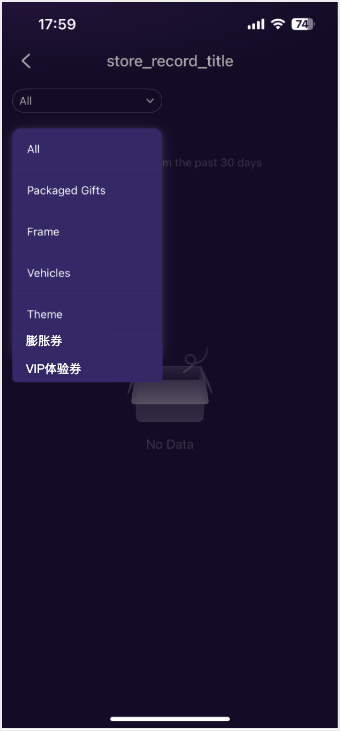

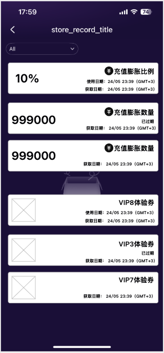

3.6.3 获得弹窗提示

| 功能名称 | 获得弹窗提示 |
|---|---|
| 优先级 | 高 |
| 功能描述 | / |
| 输入/前置条件 | / |
| 交互原型 | 「图1」 |
| 字段描述 | / |
| 需求描述 | 本获得弹窗归属于发放框架内容，本弹窗当前版本，仅支持VIP体验券或充值膨胀券的发放后用户获得展示，也支持同步两种类型一起的展示； 发放内容为后台配置，发放内容，每人获得数量，弹窗内容的排序均为后台配置； 如果同一张券收到多张，则铺开展示，不折叠展示（同张的标准：后台配置，参考后序文档）； 服务端发放后用户即已经获得，用户端仅做消息展示用； 弹出规则： 全局弹窗，每次发放仅展示一次，只要展示无需是否点击跳转或关闭（比如杀进程等行为），不再二次展示； 发放时如果用户在线直接弹出，如果不在线，则下次登录时弹出： 下次登录后弹出场景：优先，最高层级为本发放弹窗、新手礼包，最后签到； 发放时用户在线，则用户只在停留下述特定页或返回特定特定页时按照优先级展示 Party -Recommend/Mine一级菜单展示； Message -message/Friends一级菜单展示； Me 一级菜单展示； 弹出时受到站内消息弹窗（头部弹出或底部弹出的消息样式）影响且层级高于 下述场景不弹出：水果机、聊天房内，消息详情，平台独立游戏内（后续存在）、H5页面状态下（拉新、当前VIP等）； 消息发放后有效期48小时，如果48小时后没有弹出，就不再弹出； 如果用户在房间内收到券后直接在房间使消费掉，不影响上述弹出规则； 关闭按钮为关闭弹窗不做跳转； 跳转：如果包含两种类型，跳转膨胀券，如果只有唯一属性，则只跳转对应属性； 券实际场景为：单次发放数量预计1-3/4张单次，因此需要不同数量适配（具体参考UI）； 膨胀券、VIP体验券在弹窗中的展示属性： 属性一：券类型：金币icon+充值膨胀比例、充值膨胀数量，VIP等级体验券 属性二：左侧展示属性，充值膨胀比例或固定数量（缩写规则参考后续文档），VIP勋章 属性三：发放的时间，为判断券的生效期和结束日期展示规则的判断： 券有效期未开始：“dd/MM HH:mm(GMT+3)后可用”； 券有效期已开始：“dd/MM HH:mm(GMT+3)前可用”； 建议先看各种券的属性，在再开发放功能； |
| 补充说明 | / |

3.6.4 VIP体验券 – 列表

| 功能名称 | 体验券列表 |
|---|---|
| 优先级 | 高 |
| 功能描述 | / |
| 输入/前置条件 | / |
| 交互原型 | 「图1」                 「图2」                  「图3」 「图4」                 「图5」                  「图6」 |
| 字段描述 | VIP体验券：在满足券使用条件情况，用户会获得体验卡对应的VIP等级和对应福利的天数，体验结束后，会自动回收； 使用规则说明： 用户只可以使用，比自己当前VIP等级高的体验卡，等于和小于不可用体验； 发放时要验证，如果配置中的用户当前有和体验等级相同的，则不发放（发放业务逻辑，参考后续文档，在后台发放配置模块有同步描述）； 但是在使用的时候，也要做验证，因为存在后升级超过体验卡的情况； 用户使用体验卡后，会获得和对应VIP等级相同时间的体验卡； 用户一次只能用一张卡，不能在体验未结束前使用另一张体验卡，也不支持叠加； 使用体验卡，不会收到相关的升级提示，使用成功，直接跳转到VIP页面； 体验用过程中原财富值和刷新时间的的处理逻辑： 在体验过程中，原始的财富等级依旧会根据逻辑进行记录，不会中断，但是结算周期会做顺延；比如用户VIP3等级10天后结算，使用VIP7体验卡7天，则用户结算时间为10+7天后进行，即体验7天，结束后继续10天； 用户在体验过程中，如果用户的财富值积累，没有达到当前体验等级，即使升级（对比的是体验卡激活时的等级）、保级均不会给出相关的“消息提示”，“弹窗提示”，“飘条公告提示”；比如用户体验VIP7，原始等级VIP3，财富值积累到了VIP4，则不会给出上述提示； 用户在体验过程中，如果用户的财富值积累，大于等于体验的等级，则体验卡无论是否体验结束都立即结束，用户进入到达到的等级中，然后开始等级周期统计；比如用户体验VIP7，原始等级VIP3，财富值积累到了VIP7，立即结束体验，仅给出VIP7的升级提示； 体验过程中，上述这种状态被定义为“冻结”，延长周期时间、然后除了财富值持续积累和特定的升级判断，其余均不做提示处理； 体验结束后，如果没有达到大于等于体验等级，则立即按照实际财富数值进行判断， 财富值不足以升级，且不足保级（对比原始等级），则继续进行原周期； 财富值不足升级，满足保级（对比原始等级）则继续进行原周期，推送保级内容； 如果达到升级标准（比体验等级低，但是比原始高），则仅提示达到的最高的VIP等级（如果存在连续升级的情况），并推送升级内容； 回收规则说明：体验结束不满足体验等级则回收已发放权益； 体验结束如果等级不足体验等级，则回收发放出的权益和道具内容，可体验的时间=体验卡的时间是相同的； 不用考虑体验卡权益是否超过原等级，比如VIP3的座驾只能体验7天的对比性问题； 建议：体验卡部分业务逻辑可独立于原来VIP逻辑只调用原来的部分功能； 体验券属性： 和膨胀券不同，发放后即可使用，不会存在时间限制和设置； 结束有效期：后台设置，不可为空，即什么时候之前可可用； 体验VIP等级：后台配置，不可为空，单选，一张券只能设置一个； 体验时长：后台配置，不可为空，单位天，正整数，限制1-999天，不会额外兼容，所以实际为天数*24小时； |
| 需求描述 | 背包中后面新增tab标签，体验券，并展示当前拥有数量如「图1」，为空时展示0如「图4」，最大展示99，超过展示99+； 右上角问号仅为选中体验券这个tab的时候展示，点击后弹出使用说明，如「图5」； 排序： 按照结束的时间倒序进行排列，过期卡不展示； 相同结束时间，优先按可体验的VIP等级从大到小的排列； 时间、等级完全相同，随机先后，或券的唯一ID展示； 展示规则：多张完全相同类型的券不叠加展示，即铺开展示； 展示属性： 时间属性： 可用时间：展示剩余时间，格式如下： 当券可用时间小于等于24小时，增加“临期”角标； 券类型和数值： VIP体验券对应的等级ICON，使用动态效果； VIP不同等级颜色不同，因此使用背景颜色要有区分，具体参考UI效果； 展示赌赢体验的VIP等级 使用按钮： 如果当前券不可用，则展示“不可用”， 点击打开详情； 不可用：包括：拥有VIP大于等于体验卡/以及正在体验其他等级； 可用状态显示为“使用”； 查看详情：固定文案 页面交互 支持手势下滑刷新，上滑加载，一页20个； 每一张券所在空间都可点击，点击后弹出膨胀券详情「图2」「图3」； 体验券详情和列表券展示的属性相同，但是没有“查看详情”的固定文案； 膨胀券详情展示两行行独立属性，每一行为独立属性 第一行为体验天数（后台配置），天数高亮标出； 第二行为限制使用的时间：显示为：dd/MM/yyyy HH:mm(GMT+3)前可用，如「图2」； 第三行只有当卡片不满足当前用户使用时显示： “不可用原因：是可以体验高于自己的等级”； “不可用原因：当前正在体VIP中”； 点击使用判断： 点击使用二次判断，如果可用则二次确认展示体验的VIP的徽章，和文案“您即将使用VIPX体验券”，如「图6」，点击确定，使用成功后并跳转VIP等级页面并定位体验的VIP等级； 如果等级不满足则弹出：“只可用体验高于您自身的VIP等级的权益”，关闭返回或停留列表页面，并刷新； 如果有正在体验的VIP弹出：“丹铅有正在体验的VIP，请在结束后尝试”，关闭返回或停留列表页面，并刷新； 如果券过期，则toast提示“体验券过期已不可用，请在记录中查看”，然后刷新页面；（4月21日新增）； |
| 补充说明 | / |

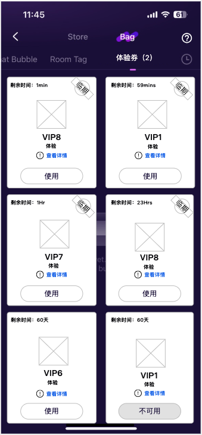

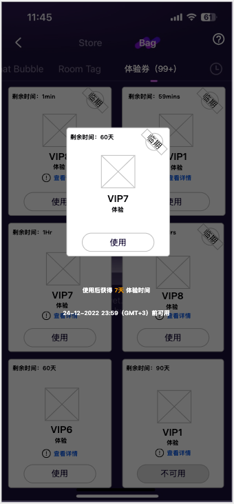

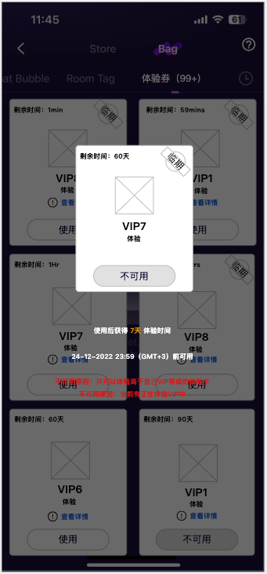

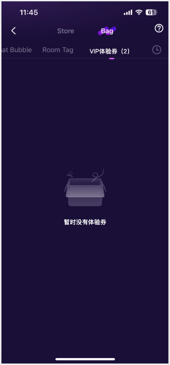

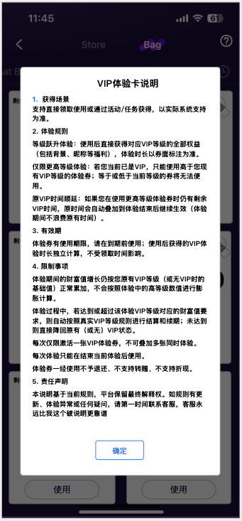

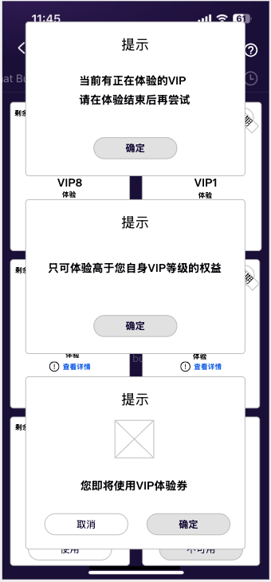

3.6.5 VIP体验券 – VIP页面

| 功能名称 | VIP页面状态 |
|---|---|
| 优先级 | 高 |
| 功能描述 | / |
| 输入/前置条件 | / |
| 交互原型 | 「图1」                          「图2」 |
| 字段描述 | / |
| 需求描述 | 「图1」:右上角提示入口 只有当用户有可使用的VIP体验卡的时候，会给出提示，为双端原生处理，点击跳转VIP体验券背包对应TAB，有动画效果，参考UI； 「图2」:用户已经在使用体验卡中 展示体验卡剩余时间：体验卡剩余时间：格式如下 结束后当前会返回的VIP等级，对应用户当前积累的财富值对应的VIP等级； 如果用户升级到体验的VIP，需要多少财富值：当前财富值XXX升级到XXX还需要XXX； 比如VIP7需要1000，用户当前100，所以升级好需要1000-100=900； |
| 补充说明 | / |

后台需求

3.7.1  增加“爆奖”礼物类型（许静）

| 功能描述 | 后台增加“爆奖”礼物类型 |
|---|---|
| 优先级 | 高 |
| 输入/前置条件 |  |
| 需求描述 | 图1 【位置】运营后台—Manage-礼物管理 新增礼物-新增字段释义： |
| 输支持出/后置条件 |  |
| 补充说明 | 新增礼物类型对应礼物销量数据需要统计在“运营后台-Statistics-商品统计-礼物统计”中 |

3.7.2 “爆奖”礼物统计（许静）

| 功能描述 | “爆奖”礼物统计 |
|---|---|
| 优先级 | 高 |
| 输入/前置条件 |  |
| 需求描述 | 【位置】运营后台—数据统计-爆奖礼物统计 列表：支持分页，每页展示50条数据 字段释义： 筛选: 支持根据语区进行筛选； 支持根据礼物名称进行筛选； 支持根据日期进行筛选，精确到日（时间跨度1年）； 导出：支持导出当前筛选条件下所有数据 |
| 输支持出/后置条件 |  |
| 补充说明 |  |

3.7.3 “爆奖”礼物消费统计（许静）

| 功能描述 | “爆奖”礼物消费统计 |
|---|---|
| 优先级 | 高 |
| 输入/前置条件 |  |
| 需求描述 | 【位置】运营后台—数据统计-爆奖礼物消费统计 列表：支持分页，每页展示50条数据 字段释义： 筛选: 支持根据语区进行筛选； 支持根据礼物名称进行筛选； 支持根据日期进行筛选，精确到日； 导出：支持导出当前筛选条件下所有数据 |
| 输支持出/后置条件 |  |
| 补充说明 |  |

3.7.4 官方/运营房考核后台（许静）

| 功能描述 | 官方/运营房考核后台 |
|---|---|
| 优先级 | 高 |
| 输入/前置条件 |  |
| 需求描述 | 需求详见：【金山文档 \| WPS云文档】 【PRD】Samer后台v2.0.0 https://365.kdocs.cn/l/cmEcpVSwycPp |
| 输支持出/后置条件 |  |
| 补充说明 |  |

3.7.5 后台补单发送系统消息（许静）

| 功能描述 | 后台手动补单后自动触发1条系统消息 |
|---|---|
| 优先级 | 高 |
| 输入/前置条件 |  |
| 需求描述 | 后台手动完成补单后，用户收到1条系统消息：平台已为你的重置进行补单XXX金币。【查看】 点击【查看】跳转金币页面； |
| 输支持出/后置条件 |  |
| 补充说明 |  |

3.7.8工具配置 – 体验券 – 券配置（丛国序）

| 功能名称 | VIP体验券 |
|---|---|
| 优先级 | 高 |
| 功能描述 | / |
| 输入/前置条件 | / |
| 交互原型 | 「图1」 「图2」                                  「图3」 |
| 字段描述 | 搜索支持按照VIP等级筛选，当前VIP1 -VIP8； 体验券名称（后台用）：仅用后台展示记录用，方便操作，业务不使用； 体验等级：唯一等级，必填； 体验时间：使用后，用户可以获得多长时间（天）的体验； 结束日期：券的结束使用日期，GMT+3为准的日期，年/月/日 时/分/秒； |
| 需求描述 | 页面默认展示全部配置的券，按照生成时间到倒叙排列，优先展示最近生成的； 点击“生成VIP体验券”弹出「图2」的新券配置方案； 中文名：必填，仅后台用和其他列表选择用； 体验等级：唯一等级，必填，单选VIP1-8； 体验时长：必填，单位天，正整数 结束日期：必填，不可配置当前2小时内； 保存时验证，弹出错误提示用通用格式即可； 对已配置的券可以进行上述数值编辑，点击编辑弹出已经配置的数值； 对于已生成的，也可以进行删除 |
| 补充说明 | / |

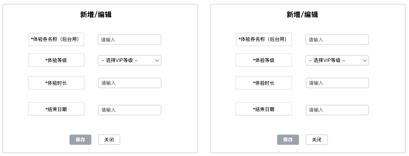

3.7.9 工具配置 – 体验券 – 使用记录（丛国序）

| 功能名称 | 体验券使用记录 |
|---|---|
| 优先级 | 高 |
| 功能描述 | / |
| 输入/前置条件 | / |
| 交互原型 | 「图1」 「图2」 |
| 字段描述 | / |
| 需求描述 | 页面按照时间倒序，默认展示最近15天日期，支持时间区间搜索查看； 使用数量：当日使用体验卡的总数量； 使用详情，点击打开「图2」； 「图2」默认只展示当日的使用情况，展示全部，分页加载； 展示用户XID、ZID； 使用体验券的等级：对应的VIP几； 使用这张券的时间； 用户ZID搜索：支持直接搜索某用户的使用情况，可以直接跨过今日； |
| 补充说明 | / |

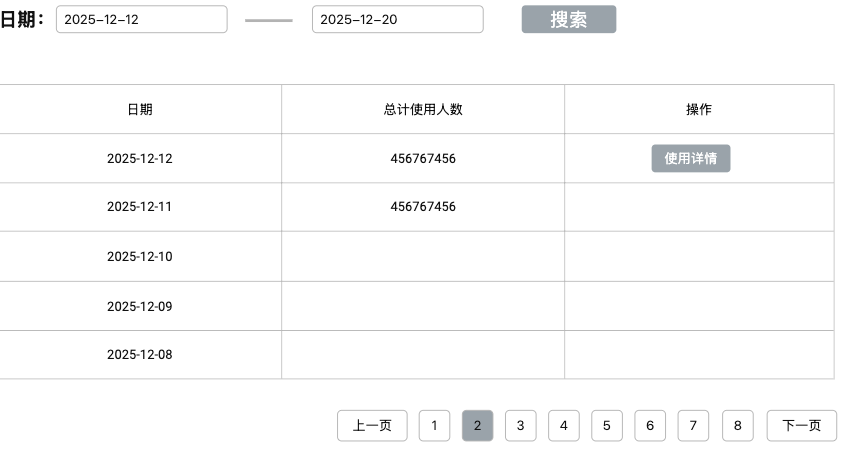

3.7.10发放体系 – 发放配置（丛国序）

| 功能名称 | 发放配置 |
|---|---|
| 优先级 | 高 |
| 功能描述 | / |
| 输入/前置条件 | / |
| 交互原型 | 「图1」 「图2」                      「图3」 「图4」 「图5」 |
| 字段描述 | 计划名称：仅后台计划名称用； 筛选：筛选订单状态发放状态： 未发放：生效，但是没有到发送时间，有配置； 未生效：仅为配置，不进入发送流程，有配置； 已发放：已经完成发放的订单； 发放时间：设置的计划发放时间，GMT+3，年月日，时分秒； 发放人数，本轮计划的发放人数； |
| 需求描述 | 搜索：支持订单状态筛选和时间区间多条件搜索； 列表默认按照生成计划的时间倒叙进行排列； 点击新增发放计划打新增计划「图2」； 计划名称（后台用）：必填，无实际功能，仅选择等功能使用； 发放时间：必填，设置的计划发放时间，GMT+3，年月日，时分秒，保存时需要验证，发放时间距离保存时间，必须大于等于5分钟=300秒； 订单状态：必填，发放之前可以修改状态 未生效：发放计划不生效，草稿； 生效：发放计划生效，到点发放； 用户群体名：从用户群体设定中选取，非必填； 用户ZID：独立用户ZID，非必填，但是需要和上面必须有一个不为空；保存时需要验证；（4月30日划掉） 操作 编辑计划：对于未发放的，都可以进行发放计划编辑，「图3」； 内容编辑：对于发放内容的配置，如「图4」； 删除：对于未发放都可以进行删除； 查看计划：对于发放过后的，则展示发放的计划，「图3」相同只是不能再进行编辑； 查看内容：对于发放过的，展示如「图4」相同，只是不能再进行编辑； 发送报告：对于发放过的，显示发放成功或失败人数，如「图5」； 内容编辑「图4」 新增，新增一条配置内容，最多配置30条； 类型：膨胀券或者VIP体验券，二选一，之前已经添加的，不要再进行重复配置； 名称：膨胀券或VIP体验券的名称，上文有提到的后台中文名称； 每人可获得数量：正整数，最小1最大50； 排序：在客户端发放后，在收到弹窗的展示顺序，数字小的在前0和正整数；本弹窗页可按照此规则进行排序； 过期日期：选择的券关联的有效使用日期： 删除：删除这条记录； 特殊处理： 对于内容/用户群体为空的发放计划，即使设置了生效，也不会进行发放； 对于关联的发放内容，人物组，已发放时的配置数据为准； 对于VIP体验券的发放，需要增加过滤，如果发放的VIP体验券的VIP等级小于等于接受用户，则不给改用户进行发放（按发放失败）； |
| 补充说明 | 消息类型：新获得： 每次收到同类型新券，不论数量，日期，只要收到新券都会收到消息，都会触发对应券的消息类型，消息支持点击跳转到应用内me中过的背包中对应的tab类型； 由于单次发放，支持同步发放两种类型，那么将会收到两条类型消息； 金币膨胀券：“恭喜，您获得了“膨胀券”！购买金币买的越多，膨胀后得到金币越多！点击查看“ VIP体验券：“恭喜，您获得了“VIP体验券”！点击查看” 2  即将过期提示： 2.1 每日的11点21点定时两次检测有券的用户券过期时间是否小于等于24小时；如图，消息支持点击跳转到应用内me中过的背包中对应的tab类型； 2.2只要同类型，存在24小时过期的就会发消息，不同类型不同消息同时间发送； VIP体验券：“您还有X张“VIP体验券”即将过期，请抓紧使用！点击查看” X= 24（包括24）小时内即将过期的对应类型的券的数量； 3 通用说明： 如单次发放消息人/消息数量过多，可以支持系统消息队列，进行分段发放，具体根据性能调整，尽快发放即可； 例如每1分钟只发放500人等，具体问题具体分析； |

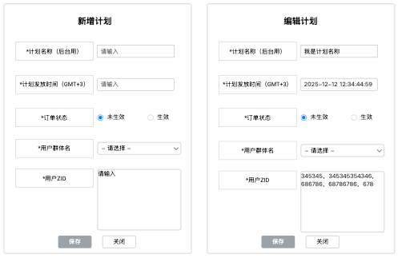

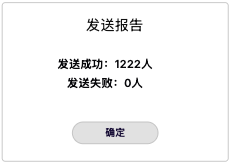

3.7.11发放体系 – 用户群体配置（丛国序）

| 功能名称 | 用户群体配置 |
|---|---|
| 优先级 | 高 |
| 功能描述 | / |
| 输入/前置条件 | / |
| 交互原型 | 「图1」 「图2」                       「图3」 「图4」 「图5」                           「图6」 |
| 字段描述 | 为用户合集； 点击新增群体，弹出「图2」，设置中文名称，对于已经生成的，点击编辑名称弹出「图3」； 用户人数：该组内的用户ID独立个体，靓号/XID/ZID为同一人规则过滤； 群体编辑，弹出「图4」 支持列表内XID或ZID搜索，不支持联合搜索； 支持点击新增，弹出「图5」，支持ZID导入，用英文逗号分隔； 也支持CSV导入；纯ZID导入即可 同一个表，相同的用户只可以导入一次，多次会失败， 新增和导入，都会弹出「图6」； 显示成功多少人，失败的人数，并展示失败的ID； |
| 需求描述 |  |
| 补充说明 | / |

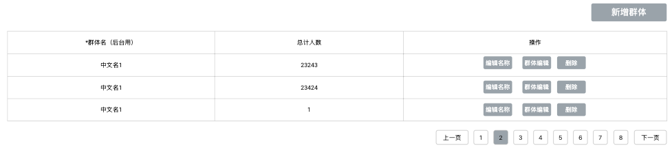

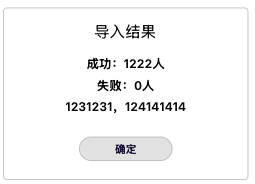

3.7.12 拉新后台，要本版本完成（丛国序）

【金山文档 | WPS云文档】 【PRD】Samer v2.0.0需求文档

https://365.kdocs.cn/l/cvoLBStKNCgk【金山文档 | WPS云文档】 【PRD】Samer后台v2.0.0

https://365.kdocs.cn/l/cmEcpVSwycPp

3.7.14 水果机/动物机统计后台（许静）

| 功能描述 | 水果机、动物机统计后台 |
|---|---|
| 优先级 | 中 |
| 输入/前置条件 |  |
| 需求描述 | 换皮水果机（动物机）后台套用水果机相同模板，但统计的是换皮水果机自身的数据。 其中明细一栏的水果，替换为动物，动物套用图标类别。 |
| 输支持出/后置条件 |  |
| 补充说明 |  |

3.7.15平台预警机制（丛国序）

| 功能名称 | 平台预警机制 |
|---|---|
| 优先级 | 高 |
| 功能描述 | / |
| 输入/前置条件 | / |
| 交互原型 | / |
| 字段描述 | / |
| 需求描述 | 一：概念 系统所有预警项采用30 分钟的统计时间，也就是30分钟内产生的数据进行判断； 逻辑：小于多少后台配置，大于多少后台配置，高于或低于设定阀值即推送消息； 举例： 新增注册预警：设定新注册大于100人预警，时间1.00-1.30注册人数为101人则触发预警； 预警消息：时间+内容；今日1.00-1.30注册人数大于100人； 二：系统支持以下 9 类预警项，每类预警项均可独立启用或禁用： 新增注册量预警：监控平台新增注册用户数量， 注册人数小于X； 注册人数大于X； 在线预警（PCU）：监控平台同时在线用户峰值数量 2.1在线人数小于X； 2.2 在线人数小于X； 房间人数预警：监控平台语音房在线总人数； 在房人数小于X； 在房人数大于X； 送礼人数预警：监控平台内送礼操作的用户数量及送礼总金币数 送礼人数小于X； 送礼人数大于X； 送礼金币数小于X； 送礼金币数大于X； 在麦人数预警：监控平台内正在上麦的用户数量 5.1 在麦人数小于X 5.2 在麦人数大于X 水果机预警：监控水果机游戏的用户消费总额、盈利比例及上报清空次数 水果机参与人数小于X； 水果机金币消费少于X； 盈利比例小于X =（流水-反奖）/流水； 水果机奖池重置通知：重置奖池中X金币，奖池剩余X金币，重置次数； 水果机本次触发兜底机制； 币流水波动预警：监控平台虚拟货币的整体流入流出情况； 金币消费小于X； 金币消费大于X； 平台发放超过X金币； 应用内充值预警：监控用户通过应用内渠道的充值行为 充值人数小于X 充值人数大于X 单用户充值大于X金币数量X笔 单用户5分钟连续充值X笔 渠道充值预警：监控用户通过第三方渠道的充值行为 充值人数小于X 充值人数大于X 单用户充值大于X金币数量X笔 单用户30分钟连续充值X笔 所有预警项均支持配置方式，满足任意一种条件即触发告警，消息内容为类目+具体数值： 绝对值阈值：设置具体的数值上下限或上限 三、特殊基准参数配置 充值类预警：可自定义 "大额充值" 的单笔金额阈值和 "多笔充值" 的 30 分钟内次数阈值 水果机预警：可自定义盈利比例阈值 盈利比例：百分比； 四、告警通知功能 系统支持钉钉、邮件、电话三种告警通知渠道，可针对每条预警规则单独配置接收人： 钉钉通知：通过钉钉机器人发送告警消息 邮件通知：向指定邮箱发送详细的告警邮件 电话通知：向指定号码拨打语音电话进行告警 告警规则如下： 同一预警项在30 分钟内只触发一次告警； 相同报警连续4次触发，比如新注册1-3点，连续出现4次，则发送一次邮件告警； 相同报警连续6次触发，比如新注册1-4点，连续出现6次，则电话通知； 当前不需要分组分层不同报警不同人，为统一打包即可； |
| 补充说明 | / |

3.7.16接入sailfish埋点后台

背景：为方便测试部门测试埋点需求，接入sailfish埋点后台

需求：运营后台接入sailfish埋点后台（仅测试使用）
