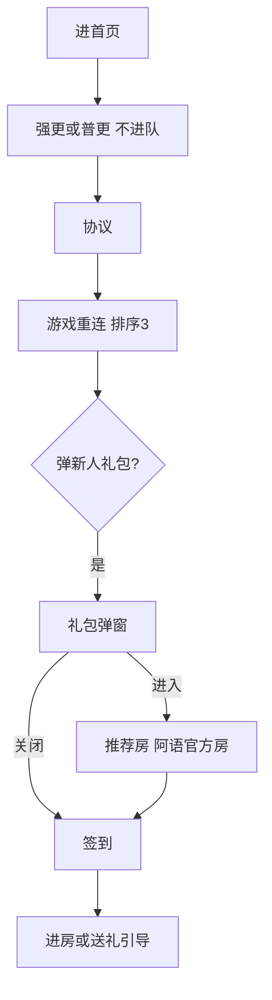

# 基建与跨模块优化 · 现行说明

> 派生阅读层。改规则仍改 [`../PRD.md`](../PRD.md)。基于已收录主线 **V1.4.0**。拍板 RQ-04、RQ-05、RQ-10、RQ-18。

## 元信息
<!-- chunk:no -->

| 字段 | 值 |
|---|---|
| 功能 ID | `infra` |
| 截止版本 | 已收录 V1.4.0 |
| 权威 | 派生；冲突以 `PRD.md` 为准 |
| 状态 | pending-review |

---

## 范围
<!-- chunk:default section=scope id=infra.scope -->

覆盖在房状态、短信风控接入（配额见登录注册）、新人礼包与进房 / 送礼引导、国家与语区、组件规范、退款封号、网页删号、屏蔽词、弹窗队列，以及本目录未拆出的跨模块补丁。默认昵称 / 房间名 / 后台重置前缀 = `player`。渠道埋点、品牌改名与更新弹窗文案、休闲 / 房间游戏玩法、拉新主流程不整章抄回。登录短信按场景 2～3 条、同一手机号 9 次 / 天（TBD）不当现行。

---

## 总流程
<!-- chunk:default section=flow id=infra.flow-main -->

进首页按弹窗队列逐个展示。强更 / 普更不进队。新注册且开关打开时出新人礼包（只弹一次）；关弹窗后出签到，再走首页进房 / 创建房引导。点「进入」则进推荐房（拍板推荐阿语官方房），退房后再出签到，不再走那两项首页引导。

---

## 业务逻辑

### 弹窗队列 {#logic-queue}
<!-- chunk:default section=logic id=infra.logic-queue -->

同页一次只展示一个弹窗；切页刷新展示条件。业务定时弹窗、业务通知弹窗不受「同页只弹一个」限制：当前关闭后再显示。强制更新、非强更（普更）不参与队列，触发后可能与当前页弹窗重叠。原文排序 1～12（缺 4）：

| 排序 | 类型 | 页面 | 内容 | 队列 |
|---|---|---|---|---|
| 1 | 系统 | 首页 | 强制更新 / 非强更 | 不参与 |
| 2 | 系统 | 首页 | 协议更新 | 队列 / 即时 |
| 3 | 即时业务 | 首页 | 大厅 / 房间游戏重连 | 即时队列 |
| 5 | 业务 | 首页 | 拉新相关顶部弹窗 | 队列 |
| 6 | 业务通知 | 首页 | 活动（预留） | 即时队列 |
| 7 | 业务 | 房间列表 | 新人礼包 | 队列 |
| 8 | 业务 | 首页 | 签到 | 队列 |
| 9 | 业务通知 | 首页 | VIP 体验券 | 即时 + 队列 |
| 10 | 业务 | 消息页 | 消息权限 | 队列 |
| 11 | 业务定时 | 首页（除抽奖页） | 抽奖弹窗 | 即时队列 |
| 12 | 业务通知 | 房间列表 | 邀请进房 | 即时队列 |

各业务自己的触发 / 次数规则不在这里重写。游戏重连弹窗归属房间游戏。iOS 指定首页归属品牌 / 更新。

### 新人礼包 {#logic-gift}
<!-- chunk:default section=logic id=infra.logic-gift -->

服务端可配是否开启。新注册进入 Hayyo 自动弹新人奖励；点关闭可关，点弹窗外不可关。弹出过一次后，即使没点「进入」或「关闭」，再进也不弹。卸载重装但不是新注册不弹。同设备最多发三次。

可配发当前仍存在的虚拟商品、道具、金币、宝石；**不发头饰卡、钻石**。具体发哪几件由服务端配置，**不写死默认 SKU**。注册登录后自动发放：金币 / 宝石进钱包，流水「新人礼包 +XXX」；道具 / 虚拟商品进背包对应分类，有效期与数量服务端可配。系统消息通知去钱包 / 背包查看，点击跳转推荐房间。弹窗文案「恭喜获得为你准备的专属礼包」「去房间享用它们吧」（以翻译为准）。奖励区按实际配置展示图标与 ×AAA / AAA 天；「进入」带呼吸动效。

V1.1.0 起弹窗带推荐房间卡片：优先在房女性房主 / 管理员头像；展示前三个在房用户头像，无人则不展示头像；展示房间名称；点「加入」或卡片进入该推荐房。

进房数据来自运营房管理。优先级：1）用户所在语区房间；2）分级 A/B 且麦上人数 ≥1；3）1 与 2 均为 0 则进官方房 XID 10000；若 1 有房则按推荐标准区间内优先、A＞B 随机抽取。拍板与房间列表配套：新人礼包推荐进目前唯一的阿语官方房（英语 / 土语没有自己的官方房）。

### 进房与送礼引导 {#logic-guide}
<!-- chunk:default section=logic id=infra.logic-guide -->

关新人礼包后出签到，再展示首页进房引导、创建房间引导。点「进入」进指定房，退房后出签到，不再展示那两项首页引导。新安装但非新注册，首页引导走原逻辑。一个账号仅展示一次礼包引导。

邀请进房浮层：只在 Party / Message / Me 一级页。注册 14 天内（服务端可配）且当天没进过任何房间。本次登录按 30s、120s、300s 间隔，触发成功才开始下一次；触发时不在一级页则回到一级页立即触发。一账号一天最多三次。本登录弹过新人礼包：关闭礼包后才开始 30s。浮层满 10s、点进入、进二级页或点拒绝则消失；位置固定不可拖。匹配房间逻辑同礼包「进入」。当天没进过房、退出 App 后立刻推邀请进房消息，一天最多 3 次。

送礼：注册后房间从未送过礼。关上麦引导和发言引导后出送礼入口指示，一账号一次。进房满 2 分钟（服务端可调，换房或断线重计）出互动引导，每天最多 1 次；进二级页不展示，返回可见。点浮层打开送礼面板，自动选中面板第一个礼物和收礼者（麦上优先房主 / 管理员 / 普通用户，多个随机；麦上无人取送礼列表第一人；麦上无人且房主不在则选房主）。房主自己房间不展示该引导。现行房间均为语聊房，按语聊房引导。老版本上线后注册 3 天内用户第一次进房满 2 分钟触发 1 次。

### 在房状态 {#logic-inroom}
<!-- chunk:default section=logic id=infra.logic-inroom -->

个人主页在房模块展示房间名和当前人数；已在该房则直进，否则先关当前房再进；进房逻辑复用（含黑名单）。可见性跟隐私设置：好友 / 关注者 / 所有人 / 不展示；自己永久可见。初始权限「所有人」；改失败 toast「修改失败」且不关浮层。

消息页（含房间消息浮层）在权限可见时展示麦波，点头像进私聊。消息好友页展示在房 icon，点击跳房；点头像、昵称进个人主页（原为私聊）；取消原「聊天」icon。进消息页或好友页更新前 50 位在房状态，每次更新后 1 分钟内不再更；两页不共享 1 分钟限制。私聊页进页时更新；Me 的 followed / Friends / Followers / Visitors 同样展示可点在房 icon。

### 短信风控与国家语区 {#logic-sms-region}
<!-- chunk:default section=logic id=infra.logic-sms-region -->

登录注册、绑 / 换绑、改密、注销、提现短信共用配额见登录注册：同设备 + 同号，GMT+3 自然日 ≤10。币商自充短信单独（设备 10、号 50），不与登录配额合并。命中手机号黑名单库则不发短信，toast「验证码发送失败」。设备指纹限制：历史累计登录账号数 ≥X 且 IP 数 ≥Y；或昨日 / 今日累计登录账号 ≥5 或 IP ≥15，则不发并同样 toast。验证码使用率落库；忘记密码与修改密码统计拆开。

国家判定优先级：SIM 卡网络识别国家（优先国家，没有则用网络信息）→ 服务端 IP → 设备地区 / 语言；都没有则为未知。注册归属国家影响语区；不在对照表则默认英语语区，个人中心国家展示「未知」。对照表原文称「下表」，现行 PRD 未贴表，不编造。资料确认页国家可改到平台全部国家；改国家保存时二次确认「30 天内仅支持修改 1 次，后续仅能修改同语区国家」。确认后性别不可改；国家 30 天后仅能改同语区，且 30 天内只能改 1 次。性别必选男或女才能进首页，权威在个人中心。默认昵称前缀 `player`。未完成资料确认则下次登录仍停该页；杀进程再启动进登录，登同账号仍要完成确认。手机号可注册国家按英文首字母排序展示（列表在效果图，不编造国名）。新注册匹配国家要埋点。

### 退款、屏蔽与网页删号 {#logic-risk}
<!-- chunk:default section=logic id=infra.logic-risk -->

退款后自动扣款、冻币、封号（未欠款不封不冻）。扣款流水「退款扣币 -XXX 金币」。冻币后不能金币消费（送礼、参与游戏、买商城礼物），只能充值。欠款解封后仍冻币，须 48 小时内还清否则再封。无钻石兑换。原文「删除小号充值限制」那套设备充值黑名单逻辑不当现行。

房间公屏含屏蔽词可发送，屏蔽词显示为 `*`，其他用户看不到。编辑用户名 / 简介 / 房间名 / 简介含屏蔽词则不可提交，toast「内容中含有敏感词」。录入与识别都去大小写、去空格，多语言都要检。

每个账号创建时生成 PIN code，设置页默认 `***`，可查看和复制（toast「复制成功」）。官网「网页账号删除」输入用户 ID + PIN 校验；错误提示联系 support@samer.com；正确则二次确认后删除。图片审核由阿里改为自研 SDK（头像、房间封面、房间图、私聊图、举报图、反馈图），三方与自研支持配比例。

### 组件规范 {#logic-ui}
<!-- chunk:default section=logic id=infra.logic-ui -->

弹窗 1～6、Toast（中部渐隐 3 秒）、占位页、页面加载 / 下拉刷新 / 上拉加载 / 底部「已全部加载」、时间戳（系统 12h/24h，今天 / 昨天 / 一周内 / 更早 / 跨年）为全局样式。Message 底栏提示改为数字：0 不展示，1～99 原数，＞99 为 99+；含 friends / system / 官方号 / activity 及私聊，实时更新。

### 未拆出的跨模块补丁 {#logic-patches}
<!-- chunk:default section=logic id=infra.logic-patches -->

默认房间名与用户昵称、后台重置前缀改为 `player`；老数据未编辑过的默认名中 samer 改为 `player`，用户编辑过的不改。scheme `samer` / `parchisw` 本轮不改名；Android 兼容新老 scheme。

风控开关开时只隐藏游戏中心和侧边栏的水果机，不隐藏整个游戏中心。收礼立即返币（后台配），单次最多 100 人否则「送礼失败」；礼物抽成只能整数且不能大于礼物价值。本轮房间推荐列表、全站广播、平台 / 周星 / 爆奖 / 数值游戏排行榜不按语区切数据；国家与语区关联逻辑不变。

其它仍留在本文、不整章抄回已拆功能的补丁：补绑 / 拉新页 VIP 高亮与靓号展示、麦上 VIP 标识、Me 红点（Tasks / Share & Invite / Team / Novice Tutorial）、拉新绑定失败顶部条（绑定成功系统消息见拉新）、主动推送文案、Snapchat 登录加年龄确认、拉新活动时间由 7 天改为 30 天、H5 / 官网标题由「Hayyo: Online Chat Party」改为「Hayyo: Games & Party」、本版 UI 只发大厅 My/Recommend + Me + 消息一级页、iOS 更新弹窗删除跳转官网入口且是否展示可配、技术优化与技术需求（含数值游戏走网关加密、Android 16、审核版本号控制等）。渠道埋点口径见渠道埋点；更新弹窗优先级见品牌 / 更新；拉新开通结算算法见拉新。

---

## 客户端页面

### 新人礼包弹窗 {#page-gift}
<!-- chunk:default section=page id=infra.page-gift -->

展示配置奖励、呼吸「进入」、V1.1.0 推荐房间卡片。规则见 `{#logic-gift}`。

### 引导浮层 {#page-guide}
<!-- chunk:default section=page id=infra.page-guide -->

邀请进房浮层固定在一级页顶栏下，含在房用户头像（女性房主 / 女管理优先）麦波、房间封面 / 名称 / ID / 人数、「邀请你进入房间」和「进入」。送礼引导跟发言区上推 3 秒。规则见 `{#logic-guide}`。

### 在房与隐私 {#page-inroom}
<!-- chunk:default section=page id=infra.page-inroom -->

个人主页在房模块、消息 / 好友 / 私聊 / Me 四列表在房 icon、隐私设置浮层。规则见 `{#logic-inroom}`。

---

## 后台影响
<!-- chunk:default section=admin id=infra.admin-impact -->

新人礼包进房取运营房管理与推荐标准；官方房 / 运营房见 [`../../admin/PRD.md#admin-rooms`](../../admin/PRD.md#admin-rooms)。礼包开关、同设备三次、奖励内容由服务端配置，不在本文抄字段。短信配额权威在登录注册。INDEX 未给基建单独后台锚点。

---

## 关联影响

### 关联 · 运营后台 {#related-admin}
<!-- chunk:related-row section=related id=infra.related-admin target=admin -->

INDEX 未给基建单独后台锚点。官方房 / 运营房见 [`../../admin/brief/current.md#admin-rooms`](../../admin/brief/current.md#admin-rooms)。

### 关联 · 登录注册 {#related-auth-login}
<!-- chunk:related-row section=related id=infra.related-auth-login target=auth-login -->

短信共用配额、币商自充单独配额以登录注册为准。跳转 [`../../auth-login/brief/current.md`](../../auth-login/brief/current.md)。

### 关联 · 个人中心 {#related-profile}
<!-- chunk:related-row section=related id=infra.related-profile target=profile -->

性别必选男 / 女才能进首页，选后不可改。跳转 [`../../profile/brief/current.md`](../../profile/brief/current.md)。

### 关联 · 签到与任务 {#related-checkin-task}
<!-- chunk:related-row section=related id=infra.related-checkin-task target=checkin-task -->

新人礼包优先于签到弹窗；签到优先于首页新手引导。跳转 [`../../checkin-task/brief/current.md`](../../checkin-task/brief/current.md)。

### 关联 · 房间列表 {#related-room-list}
<!-- chunk:related-row section=related id=infra.related-room-list target=room-list -->

新人礼包推荐进阿语官方房，与 AR / EN / TR 列表置顶配套。跳转 [`../../room-list/brief/current.md`](../../room-list/brief/current.md)。

### 关联 · 品牌/更新 {#related-app-branding}
<!-- chunk:related-row section=related id=infra.related-app-branding target=app-branding -->

强更 / 普更不进队；iOS 指定首页不在本文。跳转 [`../../app-branding/brief/current.md`](../../app-branding/brief/current.md)。

### 关联 · 房间游戏 {#related-room-game}
<!-- chunk:related-row section=related id=infra.related-room-game target=room-game -->

排序 3 的重连弹窗归房间游戏；水果机开关只藏水果机。跳转 [`../../room-game/brief/current.md`](../../room-game/brief/current.md)。

### 关联 · 商城 {#related-mall}
<!-- chunk:related-row section=related id=infra.related-mall target=mall -->

礼包道具 / 虚拟商品进背包对应分类，不发头饰卡。跳转 [`../../mall/brief/current.md`](../../mall/brief/current.md)。

---

## 相对变化
<!-- chunk:changelog section=changelog id=infra.changelog -->

相对原文：短信配额按同设备 + 同号每天 10 条，按场景 2～3 条和 9 个 TBD 不当现行。默认前缀 `player`。新人礼包不发头饰卡 / 钻石、不写死 SKU；推荐进阿语官方房。不把已拆走的渠道埋点、改名物料、拉新主流程、休闲 / 房间游戏玩法整章抄回。不写「还差 XXX 金币」。

---

## 原文
<!-- chunk:no -->

[`../PRD.md`](../PRD.md) · [`../changelog.md`](../changelog.md) · [`../history/`](../history/)

---

## 计划预览
<!-- chunk:no -->

V1.5.0 工作区不是现行，不进入正文。升格为已收录后再判定覆盖或增量。绑定成功顶部条若只在该工作区，不是现行。

---

## 待校对
<!-- chunk:no -->

- 国家—语区对照表原文称「下表」，现行 PRD 未贴表。
- 短信设备限制中历史账号数 X、IP 数 Y 未给数字。
- 语区数据分区写数值游戏榜本轮不按语区切，与房间游戏日榜按所在语区并存，未在单一功能 PRD 内消解。
- 设备指纹限制的 X/Y 与「昨日或今日任意天触发则限制」的组合条件，原文句子并列，未再形式化。
