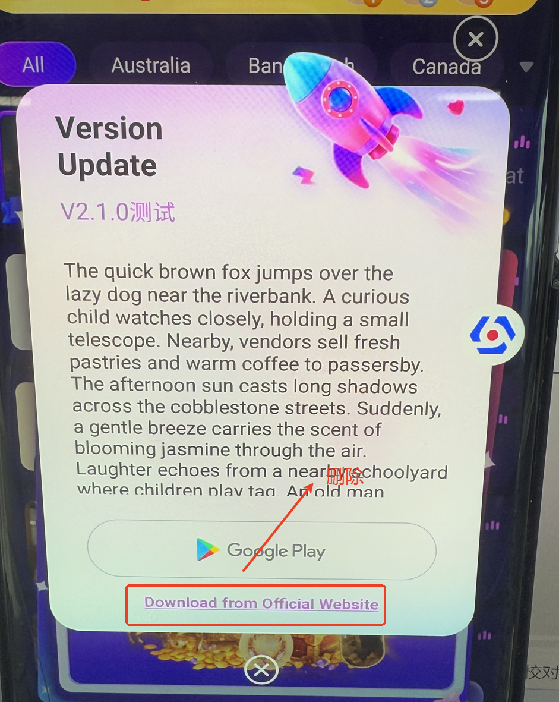
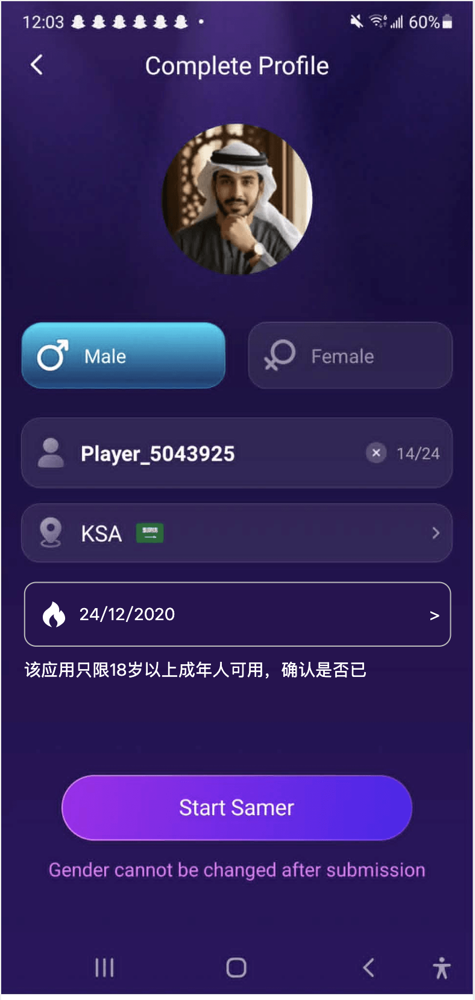
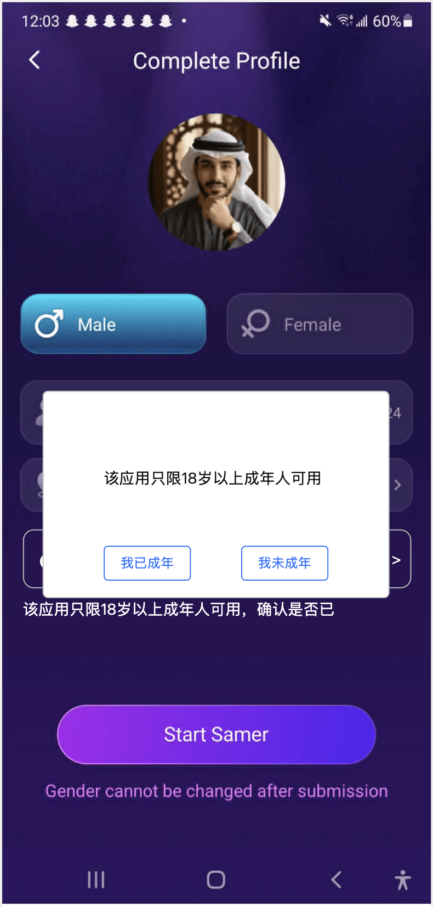

# 基建与其他 — V1.3.0 原文切片

> 状态：`history`（非权威） · 来源见正文

## 3.2 第二部分 其他功能

3.2 第二部分 其他功能

3.2.1 技术需求@姚泽

| 功能名称 | 技术相关需求 |
|---|---|
| 优先级 | 高 |
| 输入/前置条件 | / |
| 需求描述 | 数值游戏安全加密 背景：水果机动物机的加密方式比较老旧，不符合现在的安全要求，需要改进 方案：与其他H5统一加密方式，走网关 影响：水果机动物机下注，各个接口正常返回 2、用户及房间rpc查询优化 影响：用户及房间的缓存信息 回归：用户，房间信息编辑，检查更新情况（包括后台重置） 3、redis大key优化（国家列表，商城列表）。可以考虑本地缓存方案 影响：商城，国家列表缓存调整 回归：后台编辑，检查国家列表数据，商城列表数据更新情况 4、LogService服务，登录事件消费迁移到apikafka，停掉LogService服务 业务无影响 开发自测 5、rpc针对慢操作增加Response日志 业务无影响 开发自测 6、优化日志输出，有些err级别调整。关闭etcd等三方组件输出的日志 业务无影响 开发自测 7、api服务端修改审核版本号控制逻辑（后台无需开发） 影响： 1、代充TAB入口 2、我的关注推荐列表、Recommend列表、搜索房间 过滤币商房 3、房间内是否显示幸运游戏、游戏飘屏 4、过滤币商标识 5、抽奖活动里的水果机任务（单独配置） 回归：同影响点 8、Android 16适配 根据 Google Play 对应用目标 API 版本的要求，应用需要持续升级 targetSdkVersion 以适配 Android 最新系统版本。目前 Google Play 已要求应用更新需满足对应目标 API 版本要求。 升级说明：本次将应用 targetSdkVersion 从 35 升级至 36（Android 16），用于提前适配 Android 新版本系统要求。 |
| 补充说明 |  |

3.2.2 【ios】版本更新弹窗优化（许静）

| 功能名称 | 版本更新弹窗优化 |
|---|---|
| 优先级 | 高 |
| 输入/前置条件 | / |
| 需求描述 | 版本更新弹窗底部的“跳转官网链接”入口删除；是否展示支持服务端配置，且支持配置哪个版本展示（默认不展示）； |
| 补充说明 |  |

3.2.3 UI改造（仅发布部分）

| 功能名称 | 双端改名一致对应的UI重构改造 |
|---|---|
| 优先级 | 高 |
| 输入/前置条件 | / |
| 需求描述 | 双端改名一致对应的UI重构改造，详见蓝湖 注： 双端以下页面UI重构IOS跟当前版本发布： 房间大厅（My、Recommend）、Me、消息对应一级页面； 其余页面UI重构均不跟随当前版本发布 |
| 补充说明 |  |

3.2.4 语区数据分区改造（许静）

| 功能名称 | 语区数据分区改造 |
|---|---|
| 优先级 | 高 |
| 输入/前置条件 | / |
| 需求描述 | 背景：目前项目无精力分区域运营，暂不考虑数据分区 需求： 房间推荐列表数据展示不根据语区区分数据，列表排序逻辑不变，即：数据根据热度从高到底排序；例：阿语用户和英语用户看到的数据相同； 全站礼物广播、送礼超过XXX金币触发的广播、数值游戏中奖广播； 平台排行榜、周星排行榜不区分语区排行、爆奖礼物榜单（含昨日第一名公示弹窗及相关语区逻辑均不区分语区）、数值游戏排行榜（含本轮结果公示弹窗及相关语区逻辑均不区分语区）； 国家设置与语区关联逻辑不变； 注：后续版本根据业务需要仍会调整为根据语区区分数据 |
| 补充说明 |  |

3.2.5 【安卓】Snapchat登录申请方案（丛国序）

| 功能名称 | Snapchat授权修改方案 |
|---|---|
| 优先级 | 高 |
| 功能描述 | / |
| 输入/前置条件 | / |
| 交互原型 | 「图1」                       「图2」 |
| 字段描述 | / |
| 需求描述 | 取消原来针对Snapchat的Google年龄接入逻辑； 点击Snapchat后正常进入资料确认页面「图1」，但是增加年龄选择，这个选择只针对这个登录方式才有，其他都不显示； 年龄选择插件和限制和平台相同； 在原来逻辑的基础上，点击Start Samer后，弹出确认弹窗「图2」； 点击我已成年，直接进入APP，如果我未成年，则停留在当前页面； |
| t补充说明 | / |

3.2.6 【H5】应用名称更新（许静）

| 功能名称 | 应用名称更新 |
|---|---|
| 优先级 | 高 |
| 功能描述 | / |
| 输入/前置条件 | / |
| 需求描述 | 原应用名：Hayyo: Online Chat Party 修改为：Hayyo: Games & Party 涉及调整范围： APP首页、官网首页的“Meet new people”改为“Games & Party”（见下图）： 官网标题修改为：Hayyo:Games & Party（原文案见下图）： 隐私及相关协议内涉及应用名修改； |
| t补充说明 | / |

