# 抽奖活动 — V1.1.0 原文切片

> 状态：`history`（非权威） · 来源见正文

## 3.2 第二部分 抽奖活动（许静）

3.2 第二部分 抽奖活动（许静）

3.2.1 活动入口

| 功能描述 | 活动入口相关规则 |
|---|---|
| 优先级 | 高 |
| 输入/前置条件 |  |
| 需求描述 | 图1 入口：应用一级tab入口（位置放在第二位），见图1 操作交互：点击按钮与非点击状态图标样式区分（有动效） 展示入口条件：服务端设置入口展示开关，默认关闭状态，若开启开关则用户进入应用内可见（不需要退出登录或杀掉程序）；若开关关闭则不展示“福利”tab页面（不需要退出登录或杀掉程序）； |
| 输出/后置条件 |  |
| 补充说明 |  |

3.2.2 【H5】活动页面&抽奖规则

| 功能描述 | 活动页面&抽奖规则 |
|---|---|
| 优先级 | 高 |
| 输入/前置条件 |  |
| 需求描述 | 图1                     图2 抽奖规则： 每个账号每天可以获得免费5次抽奖机会（服务端配置）；按钮展示当天剩余可抽奖次数，见图1； 每个设备指纹每天最多可以获得免费5次抽奖机会（服务端配置） 完成对应任务可以获得对应任务奖励及免费抽奖机会； 若免费抽奖机会用完按钮展示“赚取机会”，见图2； 若成功领取任务奖励的“免费抽奖”奖励，抽奖按钮自动更新免费抽奖次数； 点击“赚取机会”按钮展示推荐任务，见下图： 1）若当前弹窗展示任务未完成则弹出优先级： 抽奖任务>进房任务>开启权限任务>赠送爆奖礼物任务>邀请好友任务 2）若所有可以赚取抽奖机会的任务当天已完成，则抽奖按钮状态改为【50金币/次】，按钮下方展示“今日免费机会已用完”，见下图； 3）点击按钮【50金币/次】弹出扣款二次确认弹窗：“你确定要花费XXX金币抽奖吗？【取消】【确定】”，点击确定按钮立即扣款，点击弹窗的“今日不再提示”操作，今日（自然日）抽奖扣款不再展示此弹窗；若余额金币不足抽奖所需金币，立刻弹出半屏快捷充值弹窗； 抽奖滚动交互效果： 第一个滚筒先停，再第二个，最后第三个，每个滚筒滚动时间逐渐缩短，最终停留在概率跑出的结果； 每个滚动对应出现的中奖结果样本元素分别打乱随机展示5个； 例：如果所有抽奖结果样本种类为【碎片】、【礼物】、【空白】这3种；则在每个滚筒出现这三种样本的总个数为15个，每种样本出现的个数为5个，当前滚筒出现的这15个样本的顺序随机； 滚筒滚动时，跑马灯动效加速； 每日任务&奖励（每天可以完成以下任务获得对应奖励）： 注：以下每日任务每天每个设备指纹最多可以领取1次奖励，若在设备A已经完成则在设备B展示当前任务为“已完成”状态 限时抽奖： 抽奖时间限制： 每日上限：第6次领取后，当天不再可领取；系统应在每天0点重置计数。 点击限时抽奖根据以下奖励配置表弹出中奖弹窗： 点击“限时抽奖”中奖弹窗 查看抽奖奖励：点击页面“查看奖励”弹窗展示当前抽奖可获得的所有奖品，展示奖励图片、数量、时效；点击关闭按钮或弹窗外区域关闭弹窗； 用户成就信息： 页面顶部展示当前用户头像（支持展示动图）、昵称、本次活动期间获得的金币奖励、碎片奖励、礼物奖励个数；点击金币跳转钱包-金币页面，点击礼物跳转背包-礼物页面，点击碎片跳转商城兑换页面； 点击头像跳转当前用户个人主页； 展示本期活动成就进度与数值，可获得对应成就勋章进度位置展示对应勋章缩略图标；若有待领取的成就奖励时，宝箱图标展示“待领取”气泡提示，直到领取奖励提示消失； 展示当前已获得的对应等级成就勋章； 获得成就值方式： 成就奖励：点击成就进度条旁边的宝箱图标弹出成就奖励弹窗 展示当前用户的成就数值（每次打开弹窗展示当前统计的最新数据）、每个可领取奖励的成就数值要求与可获得的奖励与奖励个数/期限； 若当前已达成领取奖励条件，对应成就奖励领取按钮状态展示为“领取”并高亮展示；领取后按钮和已领取奖励状态变为“已领取”状态； 未满足领取条件的奖励按钮展示“还差XXX成就之解锁”（每次打开弹窗需要展示当前最新统计数据）； 弹窗支持下拉展示更多信息，点击关闭按钮或弹窗外区域关闭当前弹窗； 展示当前已完成的成就进度； 成就勋章等级&奖励： 查看成就值说明：点击成就值旁边的说明图标气泡展示当前成就值获得来源，点击气泡外区域或点击4秒后气泡自动消失，见下图； 抽奖广播： 展示最近50条中奖广播，每3分钟更新1次数据，广播从左到右滚动循环展示； 广播文案：XXX获得YYY金币/XXX获得YYY*Z/XXX获得YYY*Z天 注：XXX为中奖用户昵称、YYY为金币或商品、Z为个数或有效期 页面核心交互： 页面展示排行榜入口与兑换商城入口；排行榜入口轮播展示排行榜周榜TOP1、总榜TOP1头像（支持展示动态效果）；点击排行榜跳转对应头像归属榜单页面，点击兑换商城入口跳转兑换商城页面； 点击“更多奖励”弹窗半屏展示当前页面的所有每日任务，交互效果见下图： 滑动页面底部展示拉新活动和水果机快捷入口（见下图）： 点击拉新banner跳转值个人拉新活动页面，点击水果机banner跳转官方房并自动打开水果机页面，审核账号或设备下账号看不到水果机banner； 若用户在抽奖页面点击跳转至应用内其他页面，返回需要保留离开页面； 若用户点击一级tab离开抽奖tab页面到应用其他页面，再次回到抽奖页面，抽奖页面不需要保留离开时页面，页面重置的抽奖活动首页； |
| 输出/后置条件 |  |
| 补充说明 |  |

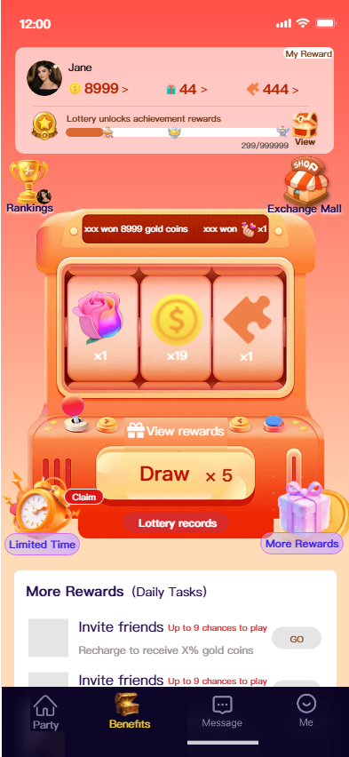

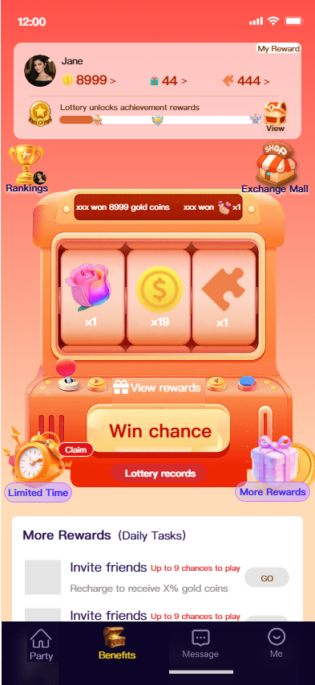

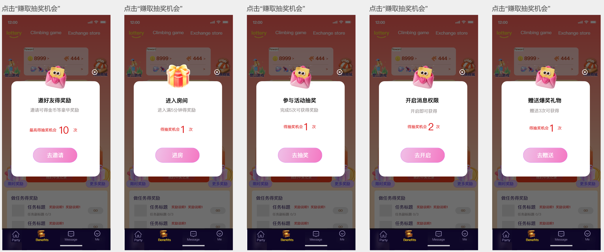

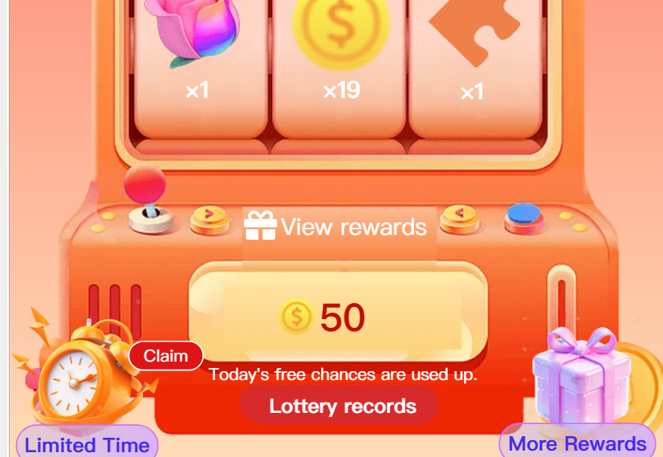

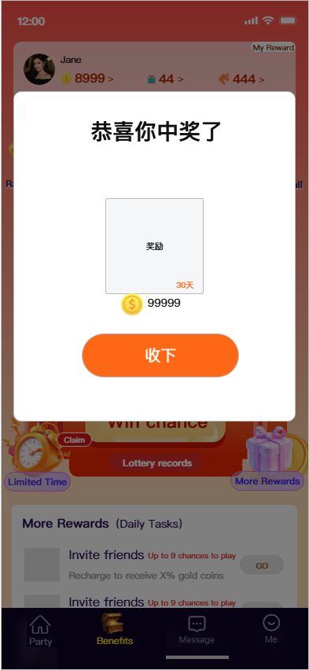

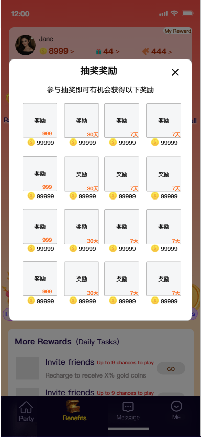

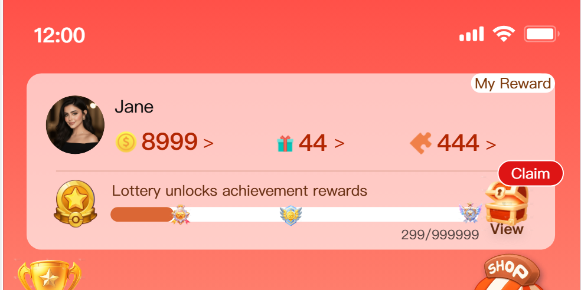

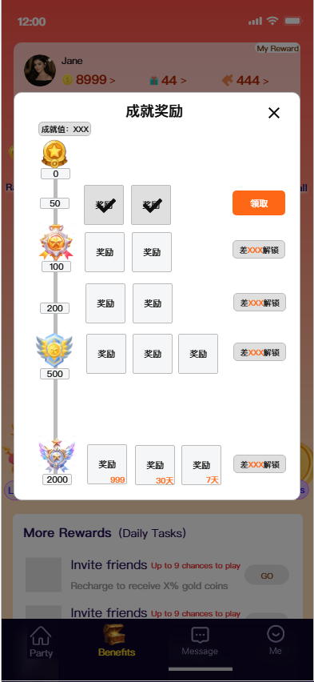

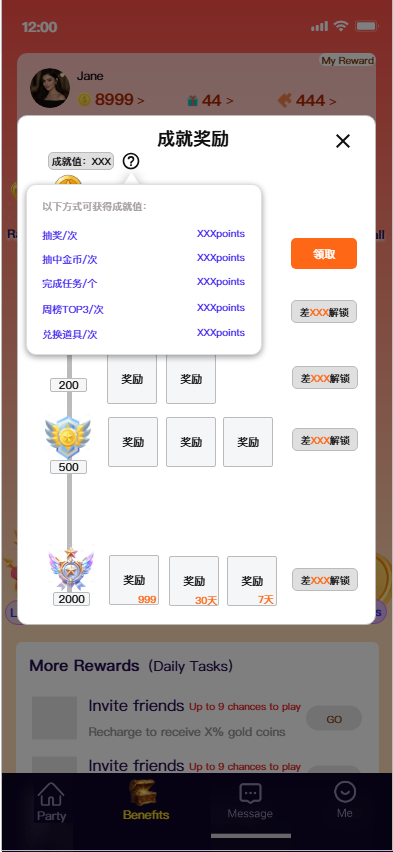

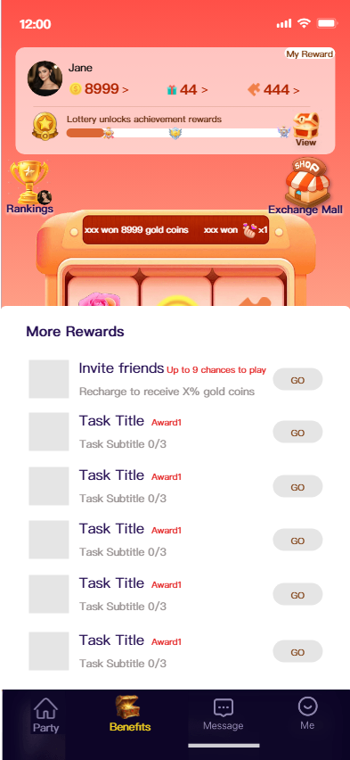

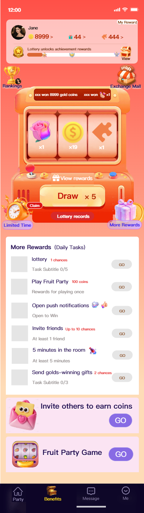

3.2.3 【H5】中奖弹窗&中奖记录

| 功能描述 | 中奖弹窗&中奖记录 |
|---|---|
| 优先级 | 高 |
| 输入/前置条件 |  |
| 需求描述 | 图1 抽奖中奖时弹出中奖弹窗，弹窗展示当前获得的奖励，弹窗奖励适配中1-3种奖励样式，见图1-图3；点击“收下”或弹窗外区域关闭当前中奖弹窗，弹出弹窗时展示氛围动画； 图2                      图3 中奖记录： 图4 点击“中奖记录”入口弹窗展示本期活动的中奖记录； 中奖记录弹窗页面展示所有本期中奖金币、礼物、碎片数量； 根据每次中奖展示记录，记录展示中奖图标、获得奖励有效期/数量、获得奖励时间（精确到秒），记录根据时间倒序展示，展示本期活动所有中奖记录；页面支持分页查看，每页展示20条数据； |
| 输出/后置条件 |  |
| 补充说明 |  |

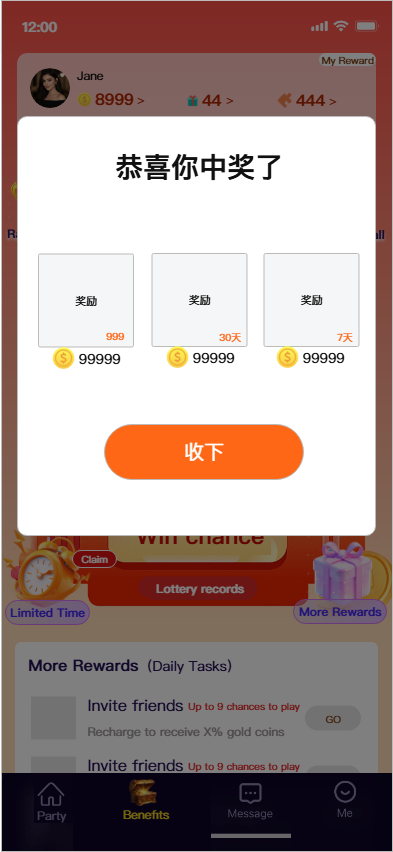

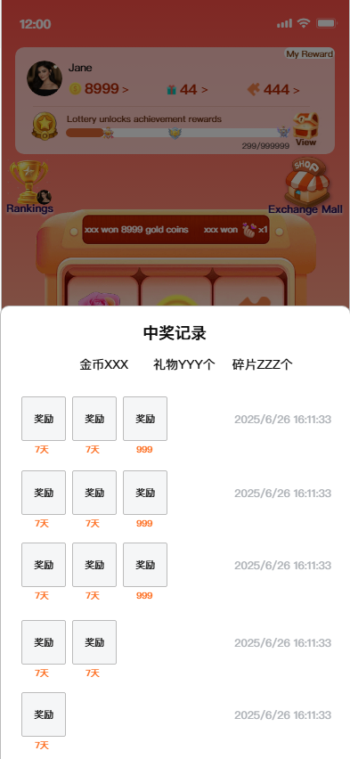

3.2.4 【H5】成就排行榜

| 功能描述 | 成就排行榜 |
|---|---|
| 优先级 | 高 |
| 输入/前置条件 |  |
| 需求描述 | 图1                      图2 周榜：根据成就值从高到底排序，结算周期为周日00:00:00至周六23:59:59（GMT+3），数值相同时先到达数值的排名靠前；数据每分钟刷新1次； 总榜：根据活动开启至活动结束成就值从高到低排序，数值相同时先到达数值的排名靠前；数据每分钟刷新1次； 无人上榜时，页面前三名头像展示“虚位以待”占位头像，底部数据展示“暂无数据”占位； 点击顶部按钮或左右滑动可切换周榜、总榜页面； 榜单入口当前轮播展示的为总榜TOP1头像，点击跳转总榜页面，若当前入口轮播为周榜TOP1头像，则点击跳转周榜页面； 点击头像不可跳转用户个人主页； 排行榜仅展示前50名用户数据，无需分页加载； 榜单用户头像支持展示动图； 页面顶部展示周榜、总榜前几名奖励； 周榜奖励： 总榜奖励： 点击榜单页面“问号”图标展示榜单说明，见下图3，点击弹窗外区域关闭弹窗； 图3 周榜、总榜页面用户信息区域展示当前用户获得的活动成就勋章的最高等级勋章，若没有不展示；每次刷新榜单页面时刷新； |
| 输出/后置条件 |  |
| 补充说明 |  |

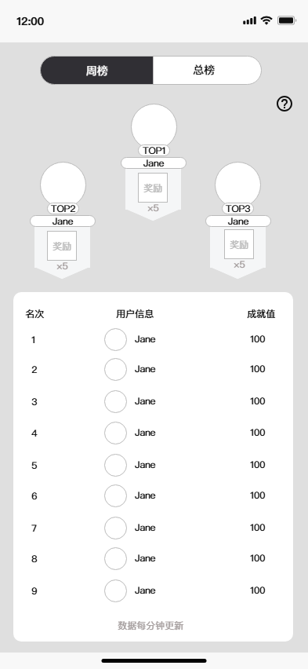

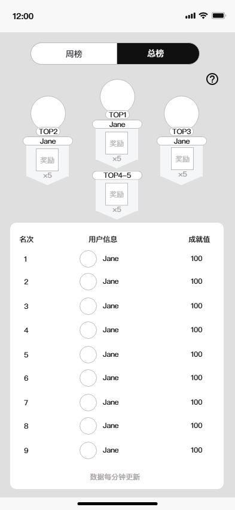

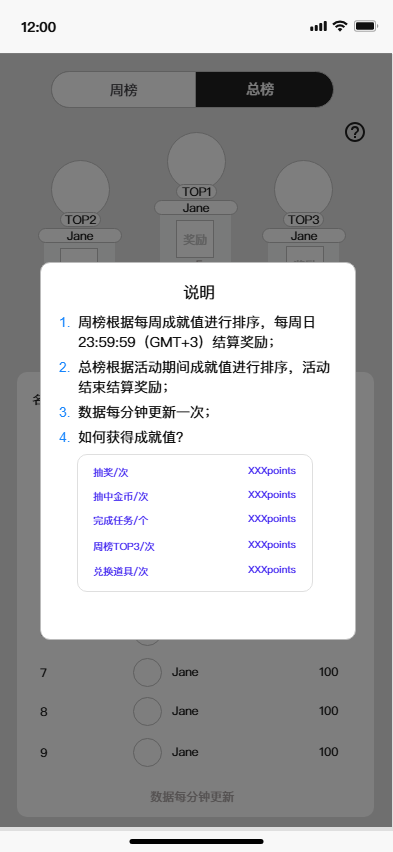

3.2.5 【H5】兑换商品

| 功能描述 | 兑换商品限制、兑换记录 |
|---|---|
| 优先级 | 高 |
| 输入/前置条件 |  |
| 需求描述 | 图1 点击背包页面定位在背包第一个tab页面，点击记录打开兑换记录面板 兑换商城（见图1）： 注：具体商品待定 兑换二次确认弹窗： 兑换成功弹窗展示：“兑换成功，可前往背包查看。【好的】【查看】”，点击【好的】或弹窗外区域关闭弹窗，点击【查看】跳转背包对应商品页面； 商品兑换碎片不足弹窗提示：“当前XXX碎片余额不足，参与每日抽奖可获得更多碎片。【去抽奖】【好的】”，点击【去抽奖】页关闭当前弹窗，页面返回抽奖页面并定位在抽奖位置，点击【好的】或弹窗外区域关闭当前弹窗； 兑换已达上限弹窗提示：“今日兑换已达上限。【知道了】”，点击【知道了】或弹窗外区域关闭弹窗； 兑换其他特殊情况toast提示：网络失败、兑换失败 兑换记录：展示活动期间所有商品兑换记录，见下图； 数据根据兑换时间倒序展示数据；默认展示20条数据，下拉支持分页加载； 活动剩余X天结束时(服务端可配置，X=7)，活动页面展示活动结束倒计时，见下图； 倒计时展示规则： 大于1天：XX天； 小于1天：XX:XX:XX; 活动结束兑换&奖励领取宽限期：活动结束后若用户活动碎片还有未使用的碎片且至少可以兑换一个商品时（碎片数≥兑换商城兑换所需最低碎片数）或有待领取成就任务未领取时，用户可以获得X天（服务端配置）的兑换宽限期； 活动结束后，活动页面顶部展示“活动已结束”；进入当前页面的所有用户可以进行以下操作： 点击查看排行榜； 可以进入兑换中心页面，若其碎片余额足以兑换商品则支持继续兑换； 点击查看成就进度，若有待领取的成就奖励支持点击领取； 注：因每日任务当日0点清零待领取奖励，则活动过期不支持领取； 页面底部跳转水果机和个人拉新banner支持跳转； 支持查看活动规则； 支持点击查看抽奖奖品； 支持查看抽奖记录； 活动结束进入待领取奖励宽限期时，自动给平台所有有待领取成就奖励或有待兑换碎片（碎片数量能兑换最便宜的兑换商品）的用户发送1条系统消息：抽奖活动已结束，你还有待领取奖励，请前往活动及时领取或兑换。【前往】；点击【前往】跳转活动页面； 活动结束用户进入活动页面不可以进行以下操作： 抽奖按钮展示“抽奖*0次”，按钮置灰； 每日任务按钮展示“GO”，按钮置灰； 限时奖励按钮展示“限时奖励”，无“待领取”红色气泡提示，按钮置灰； 活动结束兑换&奖励领取宽限期结束：首页活动一级tab入口立即移除；若当前用户正在兑换，点击兑换操作toast提示：“兑换时间已结束。” |
| 输出/后置条件 |  |
| 补充说明 |  |

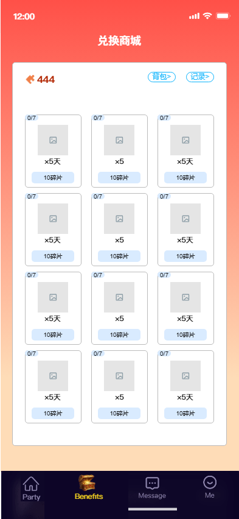

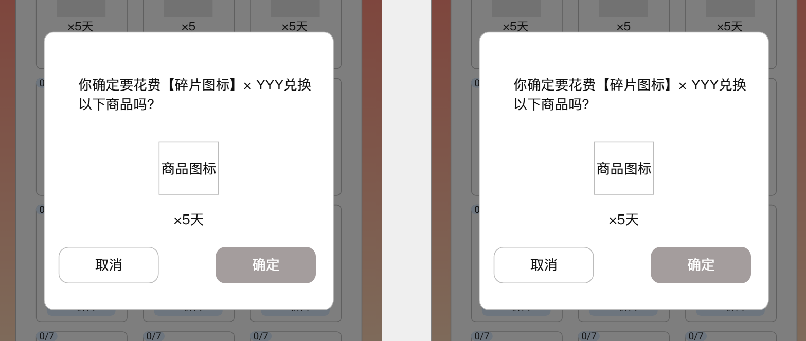

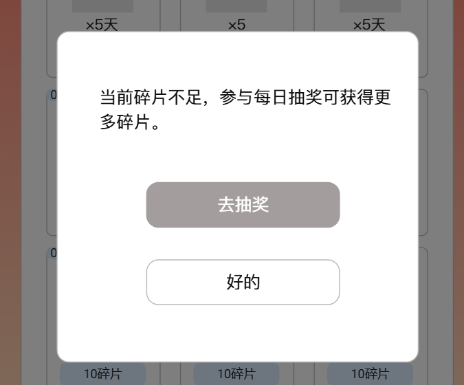

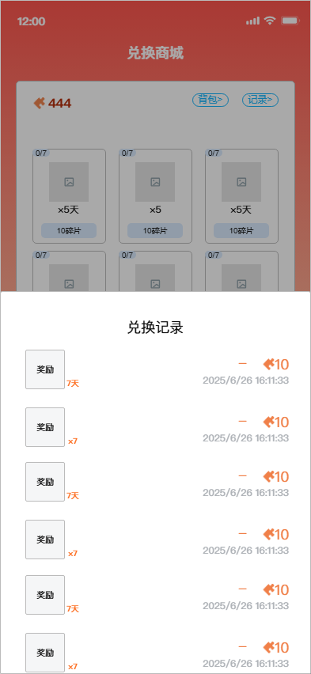

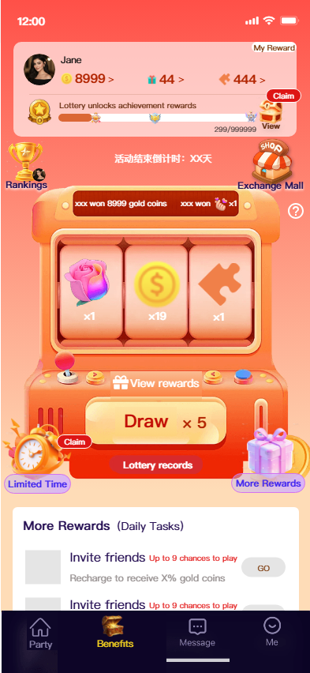

3.2.6 【H5】规则说明

| 功能描述 | 活动规则说明 |
|---|---|
| 优先级 | 高 |
| 输入/前置条件 |  |
| 需求描述 | 点击抽奖页面的说明图标弹窗展示当前活动说明弹窗，点击弹窗外区域关闭弹窗； |
| 输出/后置条件 |  |
| 补充说明 |  |

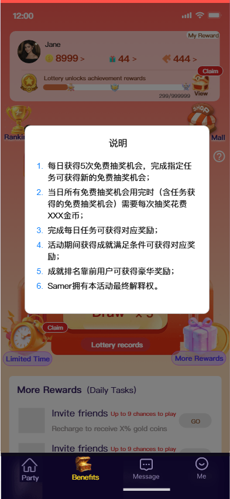

3.2.7 活动引导

| 功能描述 | 活动曝光引导 |
|---|---|
| 优先级 | 高 |
| 输入/前置条件 |  |
| 需求描述 | 如果没有进入过抽奖页面，退出房间后应用一级页面停留6秒秒自动弹出，若进入过抽奖页面则不再弹此弹窗，每个账号最多弹一次； 点击“去看看”页面跳转抽奖活动页面； 若抽奖活动入口未开启，当前弹窗不会弹出； 点击弹窗外区域可关闭当前弹窗； |
| 输出/后置条件 |  |
| 补充说明 |  |

3.2.8 活动通知

| 功能描述 | 活动通知 |
|---|---|
| 优先级 | 高 |
| 输入/前置条件 |  |
| 需求描述 | 参与活动提醒： 活动开关开启后自动触发1条活动通知，点击跳转抽奖页面； 若抽奖入口开关关闭不推送此消息； 每个账号最多推送1次该消息； 离线推送消息： 有待领取任务奖励/成就奖励/有待兑换碎片时（碎片数量≥兑换商城最便宜的商品）：22:00:00-日次00:00:00（GMT+3)触发1次 时间范围：截至活动兑换期结束 标题：速来领奖 消息：你有奖励未领取/兑换 跳转：抽奖活动页面 获得周榜/总榜奖励时：奖励到账立即发送离线推送，触发1次 时间范围：截至活动结束 标题：领取奖励 消息：恭喜你活的抽奖获得周榜/总榜第X名 跳转：奖励发放系统消息页面 活动期间参与过抽奖，但当天未参与抽奖：12:00:00-14:00:00(GMT+3)触发1次； 时间范围：截至活动结束 标题：领取今日奖励 消息：免费抽奖得豪华大奖 跳转：抽奖活动页面 用户范围：近7天活跃 |
| 输出/后置条件 |  |
| 补充说明 |  |

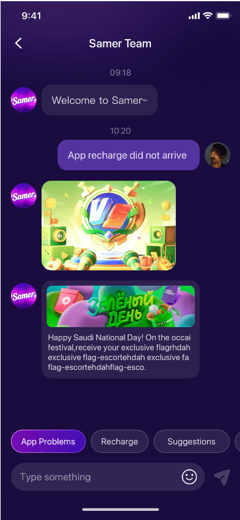
