# 商城 / 背包 / 靓号 — V1.0.0 原文切片

> 状态：`history`（非权威） · 来源见正文

## 3.12第十二部分 商城、背包、靓号（许静）

3.12第十二部分 商城、背包、靓号（许静）

3.12.1 靓号

3.12.1.1 个人靓号

| 功能描述 | 个人靓号功能 |
|---|---|
| 优先级 | 高 |
| 前置条件 |  |
| 需求描述 | 靓号仅支持后台发放，商城不支持购买； 支持运营提供具体靓号及靓号类型（个人靓号或房间靓号），服务端发放运营提供具体靓号ID给用户；客户端支持根据该需求展示场景展示靓号，展示的靓号需要根据“价格档位及特权”表格进行展示靓号勋章样式（可详见UI）； 业务需要记录发放出去的当前靓号、获得靓号的用户/房间ID、发放时间； 靓号及靓号标识显示（UI相关）： 在应用中所有展示用户ID的位置，需同步展示靓号标识（展示在ID前面，例如图6，有靓号标识展示的地方不需要展示“ID”；例如：“ID：348847893”展示靓号标识后只展示“靓号标识+348847893”），且靓号ID展示对应颜色；除在显示用户 ID 的位置外，在用户进房提示、在房发言消息区（展示在贵族标识后面）、在线列表（展示在贵族标识后面）同样显示靓号标识、搜索支持搜索靓号，搜索结果展示靓号；。 展示靓号ID的场景：我的、个人主页、个人资料卡、用户/房间搜索列表、消息页面的好友列表、靓号页面等（需要核查下其他涉及展示ID的场景都需要展示） 注：上述靓号ID展示场景需要在当前用户购买靓号后实时更新靓号 靓号专属头像框： 购买靓号后自动获得对应专属头像框，详见3.1.1.1价格档位及特权，对应头像页面显示头像框获得条件“获得个人靓号ID”、“获得个人靓号ID（价值>XXX金币）”、“获得房间靓号ID”、“获得房间靓号ID（价值>XXX金币）”，见图13； 若不满足获得头像框条件，选中头像框时显示“上锁”图标，若满足获得头像框条件时，不显示“上锁”图标，点击头像框可预览佩戴效果； 靓号分类： 注：A、B 为任意自然数，ID 首位不为 0，所有靓号放出 对子类 重复类 顺子类（数字相邻，包含正反两种情况） 自定义字母靓号（暂时仅支持后台发放） 注：预留10位 价格档位及特权 |
| 补充说明 |  |

3.12.1.2 房间靓号

| 功能描述 | 房间靓号功能 |
|---|---|
| 优先级 | 高 |
| 前置条件 |  |
| 需求描述 | 靓号仅支持后台发放，商城不支持购买； 支持运营提供具体靓号及靓号类型（个人靓号或房间靓号），服务端发放运营提供具体靓号ID给用户；客户端支持根据该需求展示场景展示靓号，展示的靓号需要根据“价格档位及特权”表格进行展示靓号勋章样式（可详见UI）； 业务需要记录发放出去的当前靓号、获得靓号的用户/房间ID、发放时间； [图1] 房间靓号价格：与同号的个人靓号价格完全一致； 靓号分类：与个人靓号完全相同； 房间靓号权益：发放靓号后自动替换原有房间ID，ID附带靓号标识，获得专属头像框，搜索支持搜索靓号，搜索结果展示靓号； 展示房间ID的场景：房间顶部（见图1）、全站广播、三方房间分享H5页面、私聊房间分享出去的卡片等（需要核查下其他涉及展示ID的场景都需要展示） |
| 补充说明 |  |

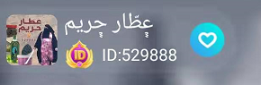

3.12.2 商城&背包

3.12.2.1 商品&标识展示

| 功能名称 | 商品与标识展示 |
|---|---|
| 优先级 | 高 |
| 功能描述 | APP各处展示不同的道具与标识 |
| 输入/前置条件 | 用户使用对应商品，或获得了对应的奖品。 |
| 交互原型 | 「图1」                                        「图2」 「图3」                                       图4」 「图5」                               「图6」 「图7」                                        「图8」 「图9」                                     「图10」 |
| 字段描述 | 头饰卡用户在麦位上、或房间聊天时，显示头饰卡。 头像框用户头像的装饰商品。（不可用于麦位） 彩色昵称昵称变为彩色效果。 VIP标识 在房间列表、好友列表、关注列表、粉丝列表、个人主页、个人资料页、私聊页面、房间消息、房间资料卡、排行榜展示此标识 用户等级牌显示用户等级牌，不同等级牌图案不同。 进房特效 进房特效=[贵族标识]+[昵称]+固定文案[entered the room]； 若用户未使用进房特效，则显示默认效果； 座驾使用座驾后，进房展示座驾特效。 |
| 需求描述 | 「图1」房间页 麦位：显示彩色昵称、头饰卡、VIP标识。 进房特效：VIP标识+特效。 聊天区域：显示彩色昵称，头饰卡，用户等级，VIP标识，排行榜标识。 座驾：有座驾的用户加入房间时，显示座驾动效。 「图3」房间内用户信息卡片 显示头像框，VIP标识，用户等级，排行榜标识，座驾、彩色昵称。 「图4」房间排行榜 显示头像框，VIP标识，用户等级。 「图5」平台排行榜 显示头像框，VIP标识，用户等级、彩色昵称。 「图6」ME页 显示头像框，VIP标识，用户等级。 「图7」个人主页 显示头像框，VIP标识，用户等级、彩色昵称。 「图8」信息页 头像框、VIP标识、彩色昵称。 「图9」好友列表 头像框、VIP标识、彩色昵称。 「图10」私聊页 头像框（双方）、VIP标识（对方）、彩色昵称（对方）。 |
| 补充说明 |  |

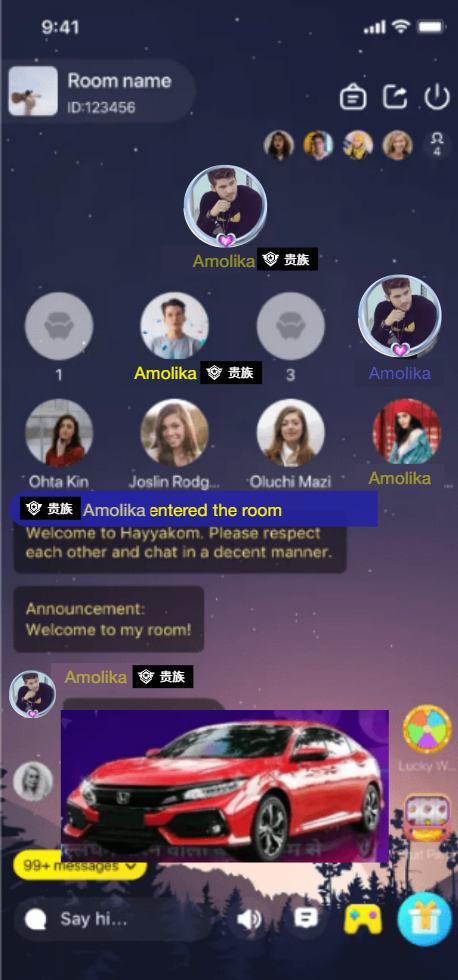

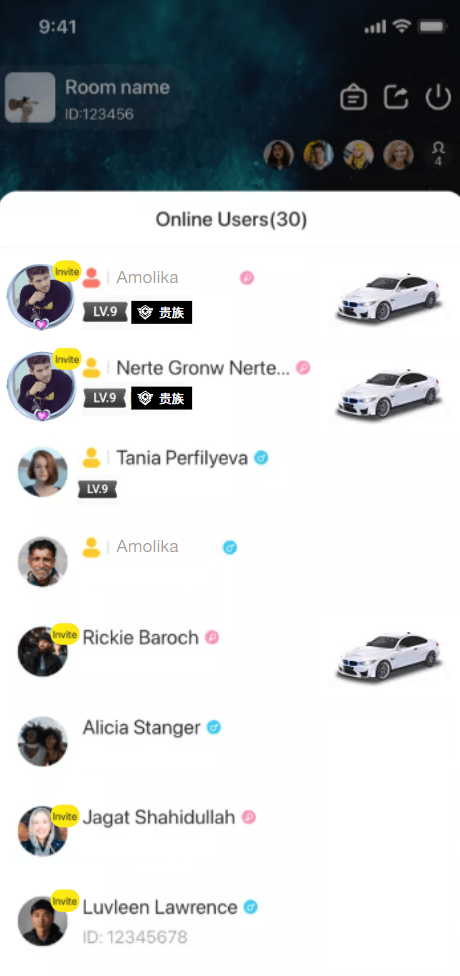

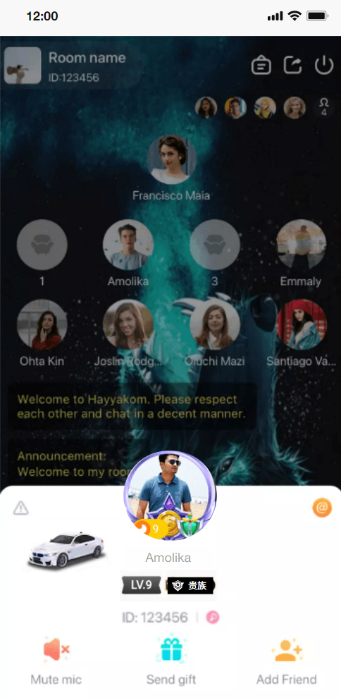

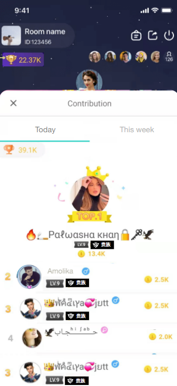

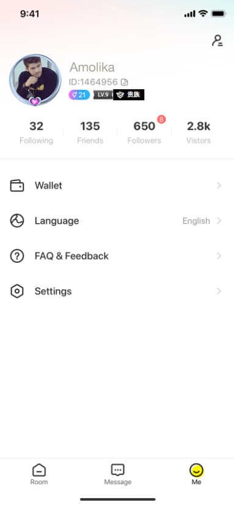

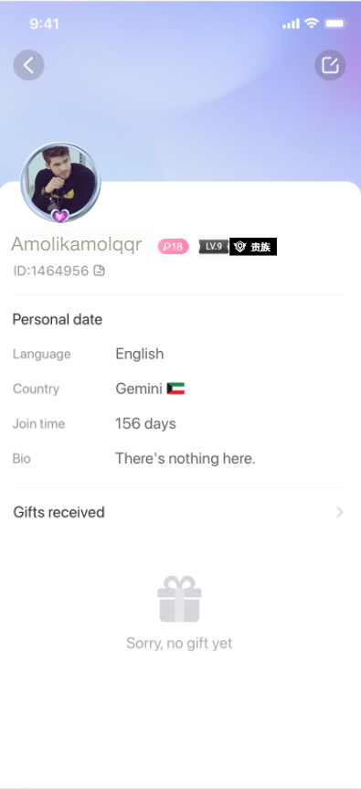

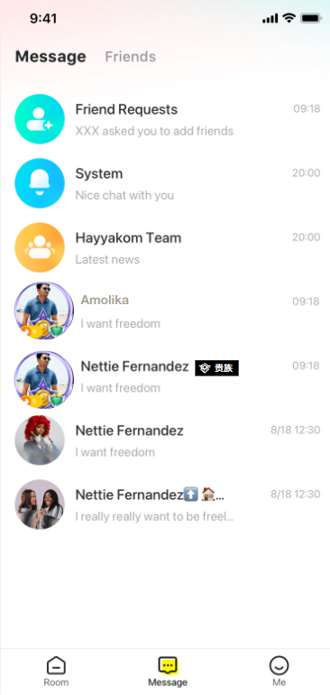

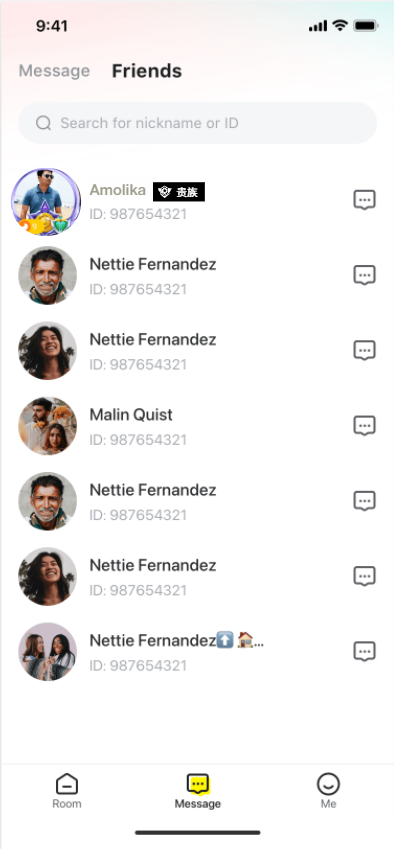

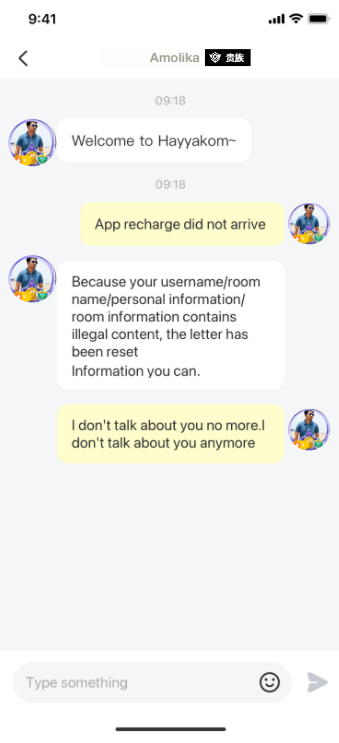

3.12.2.2 商品-房间背景

| 功能名称 | 房间背景 |
|---|---|
| 功能描述 |  |
| 输入/前置条件 | 房主使用房间背景 |
| 交互原型 | 「图1」                              「图2」 |
| 字段描述 | 「图1」房间背景入口一 房间设置页-Theme，点击跳转到【背包页】，并自动定位【房间背景】分类。 在1的前提下，用户从【背包页】进行返回上一页操作时，回到房间设置页。 「图2」房间背景入口二 房间页-更多浮层中，增加房间背景入口（Theme）。点击跳转到【背包页】，并自动定位到【房间背景】分类。 该入口仅限该房间房主可见。 该入口仅限语聊房展示，游戏房需隐藏。 |
| 需求描述 | 语聊房房间背景规则 语聊房：更换或使用房间背景后，其房间内所有用户实时更换对应的房间背景。 游戏房房间背景规则 在游戏房使用游戏默认背景。更换或使用房间背景后，并不会改变游戏房的背景。 在游戏房内，更换房间背景后，再切换回语聊房时，将使用更换后的房间背景。 |
| 补充说明 | 使用中的房间背景倒计时结束后，恢复默认房间背景。但在房间中的用户有1小时的延迟。 |

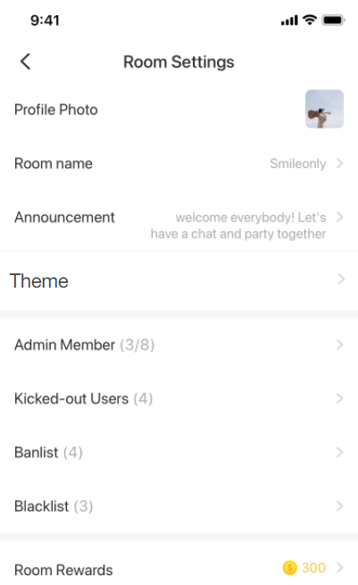

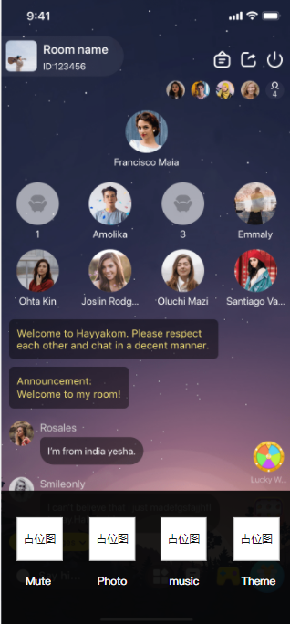

3.12.2.3 商品-头像框

| 需求描述 | 头像框并入商城&背包体系，支持在后台配置、赠送头像框（无头饰卡）； |
|---|---|
| 优先级 |  |
| 输入/前置条件 |  |
| 需求描述 | [图1]-商城-头像框&商城预览 商城新增头像框展示、预览、购买逻辑： - 展示商品管理后台，状态正常且勾选为“展示”的头像框 - 头像框具有商品原有的各项逻辑，包含：活动商品标识&跳转、仅VIP可购买、仅活动获得，均与原需求保持一致；购买逻辑、跳转逻辑、货币不足等逻辑，均与原需求保持一致； - 头像框排序按照后台配置的排序值倒序排列 - 头像框的单位为天，最低配置1天，单位展示为“Day/Days” - 商品（包括但不限于头像框）在预览页面增加“商品说明”展示，根据后台配置的文字展示，未配置则不展示说明 - 右上角的问号按钮，仅在头像框tab展示，文案替换为头像框的描述文案 [图2]-商城-新增两种商品状态 商城商品新增两种状态： - 置灰的Obtain：后台配置VIP商品要求配置为“无要求”且未勾选“商品可通过商城获得”，则商城页与预览页的按钮展示为该状态；点击toast提示，“商品无法通过购买获得” [图4]-背包-头像框&使用&预览&空页面 背包去除头饰卡展示，用户仍有库存的头饰卡处理，见需求第六部分 背包增加头像框展示、使用、预览逻辑 - 背包展示用户已获得的、未过期的头像框 - 展示元素：贵族标识、倒计时，与现有商品的展示逻辑保持一致 - 排序：正在使用的头像框置顶，其余头像框按照后台配置的优先级排序 - 使用、取消使用的逻辑，同已有商品 - 商品（包括但不限于头像框）在预览页面增加“商品说明”展示，根据后台配置的文字展示，未配置则不展示说明 [图5]-背包-获得记录 增加商品获得记录 - 入口：背包页面右上角按钮；展示用户购买或发放的所有商品 - 展示元素：商品icon、商品名称、获得时间、获得有效期 - 分页加载，仅展示最近30天的获取记录 |
| 补充说明 |  |

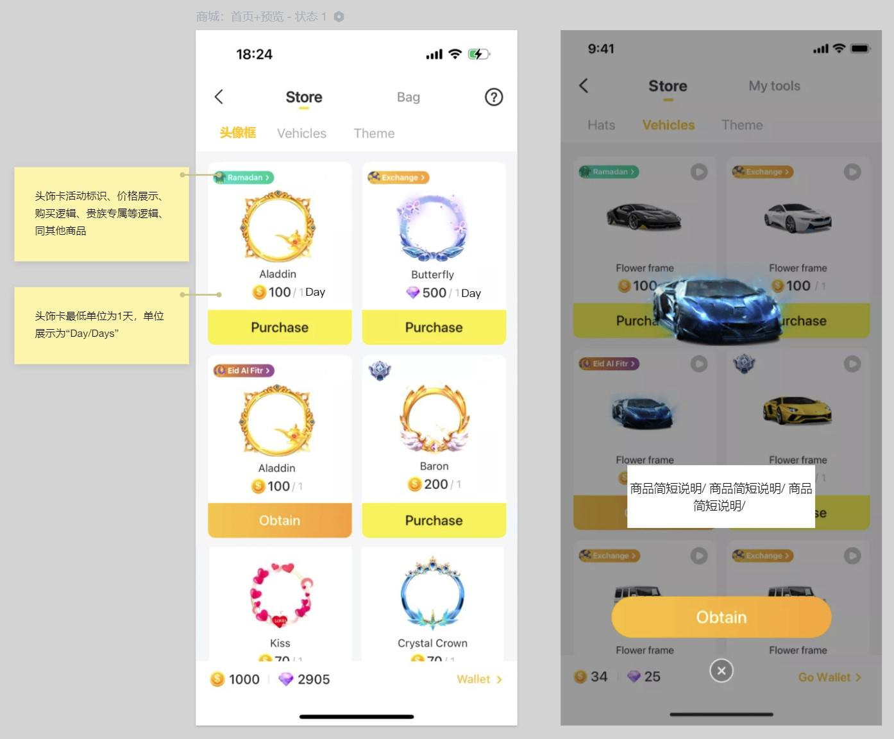

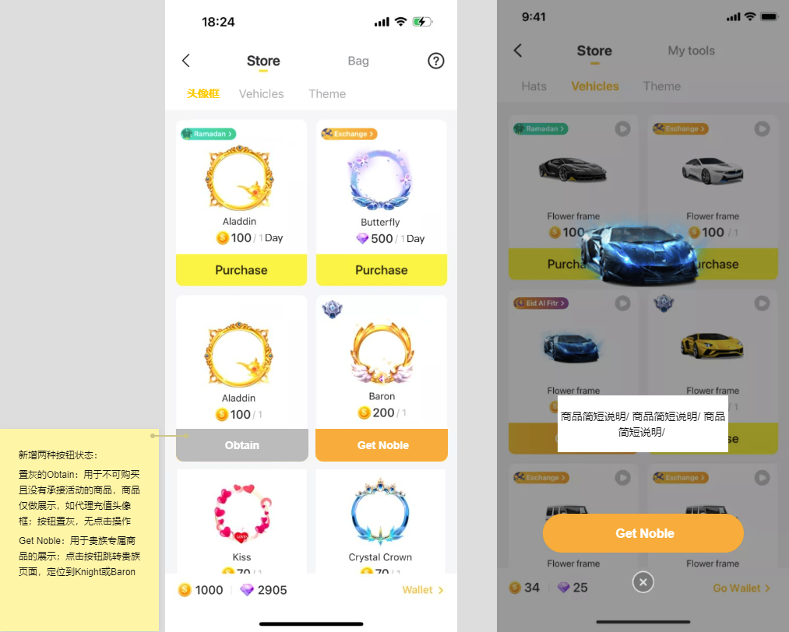

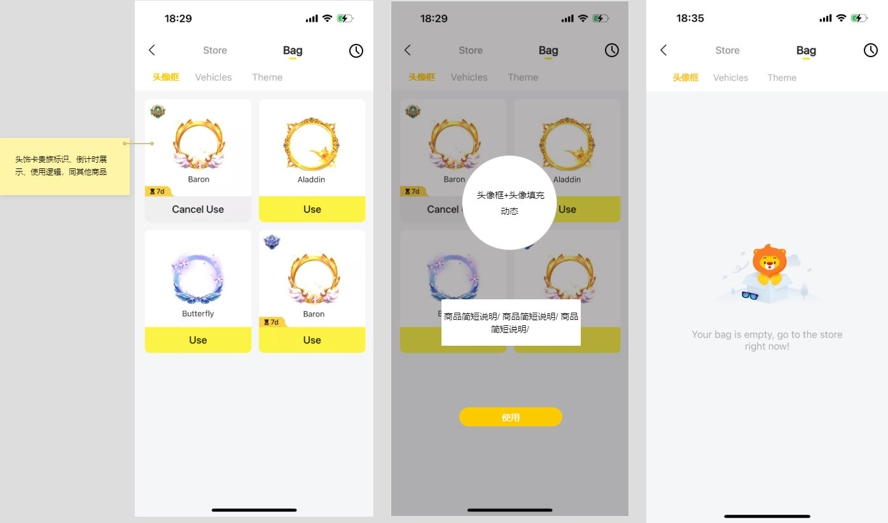

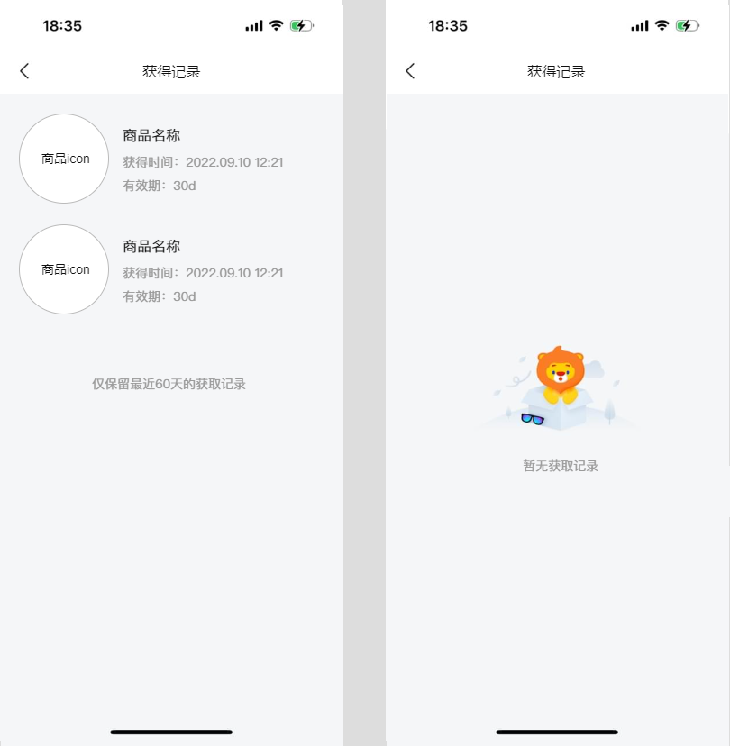

3.12.2.4 商城

| 功能名称 | 商城 |
|---|---|
| 优先级 | 高 |
| 功能描述 | 用户使用金币购买各类商品，并至背包使用。 |
| 输入/前置条件 | 入口：ME页-商城icon。 |
| 交互原型 | 「图1」                                       「图2」-头像框 「图3」                                      「图4」 「图5」                                    「图6」 「图7」                                     「图8」 「图9」                                     「图10」 「图11」 |
| 字段描述 | 「图1」ME页-商城入口 在ME页展示商城icon，点击跳转到商城页。 「图2，图5，图7」商城页 注：UI稿头部新增【商城 背包】tab。头部设计以蓝湖为准。 商品分类栏 排序依次为：头像框、座驾、房间背景。 默认：默认定位到第一个分类。 交互： 点击分类栏中其它类目时，左右滑动到对应类目页面。 在商品列表区域左右划动时，页面滑动到上一个/下一个分类。 若分类栏过长，左右滑动查看更多分类。 商品列表 一列展示2个商品。 展示后台配置的，该商品分类下的在商城展示的商品。 占位图：若无商品，则显示占位图。见「图10」。 商品 商品图片（含预览） 图片由后台配置。 动效展示说明： 在商品列表上，仅头饰卡商品会在商品列表展示动效（若有）。 在预览浮层上，所有商品均会展示动效（若有）。 交互：点击图片打开预览浮层。 播放按钮 在房间背景、座驾页上，若商品非静态的，则在商品右上角展示播放按钮。 播放按钮仅做展示。实际交互区域仍然为整个商品图。 商品名称根据不同语区，显示对应的商品名称。 VIP要求若该商品有VIP才能购买的要求，则显示最低的VIP身份要求。 库存（如「图2」）仅在头饰卡分类中展示。展示用户拥有该头饰卡的数量。 价格展示&购买按钮（以蓝湖为准） 在购买按钮上，显示商品第一个规格的价格+规格，如「图2，图6，图7」。 点击购买按钮，弹出选择规格浮层。 右上角“？”icon：仅限头饰卡分类出现，点击跳转到头饰卡说明页，如「图3」。文案为：【A hat is effective for 15 mins once put on. When being used, a hat can be replaced by another. Timing will restart right after the replacement.】（以翻译文档为准） 吸底栏：显示金币数+充值入口（点击跳转到金币-充值）。 「图4，图6，图8」预览浮层 预览头像框时，显示用户头像。如「图4」 预览有动效的商品时，展示对应动效。 关闭操作：点击图片/动画区域&购买按钮区域以外的所有地方，均会关闭改浮层。 购买按钮：点击后，预览图缩小并向上移动，且上拉出商品规格。（以UI说明为准） 「图9」选择规格浮层说明 上方显示商品预览，有动效的需要展示动效，头像框需要展示用户个人头像。 左上角显示商品名称。 默认选择规格：默认选择第一个规格。注：头饰卡显示个数，其它商品显示时长。 规格排序：根据后台配置，依次排序。最多可展示4个规格。 左下角：展示金币数+充值按钮。点击充值按钮，跳转到钱包-金币页。若再返回，回到当前浮层并刷新金币数。 关闭操作： 点击规格浮层右上角x按钮，关闭整个浮层。 上方预览区域，点击图片/动效以外的蒙层区域，关闭整个浮层。 购买操作：用户点击购买按钮时， 若有足够的金币，且有权限购买该商品，则为用户购买该商品，并关闭浮层，弹出购买成功弹窗，见「图11」。 点击【去背包】按钮时，跳转到该商品类型对应的背包页。 购买VIP要求的商品，但条件不足：弹出提醒弹窗（根据用户身份展示不同文案），见「图11」。 点击取消，则关闭该弹窗及规格浮层； 点击成为VIP，则进入VIP页；若再返回，回到规格浮层并刷新用户身份。 若用户余额不足，弹出余额不足弹窗，引导跳转到金币页。若从钱包页返回，则回到浮层，并刷新金币数。 若用户已拥有该商品的永久时长，则toast提示“已拥有该商品”。 「图9」无商品占位图 当前分类无商品时，显示占位图及文案”暂无商品出售“。 |
| 需求描述 | 使用时长数值展示规则 流水记录 消耗金币购买商品时，金币流水摘要统一为，最终文案见翻译文档： 【商城消费】 |
| 补充说明 |  |

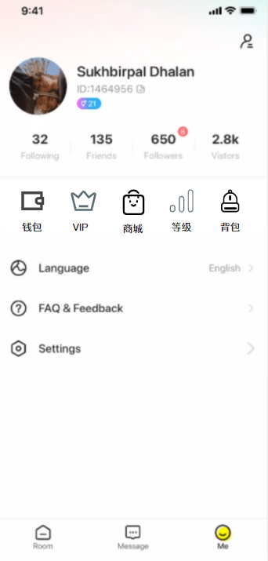

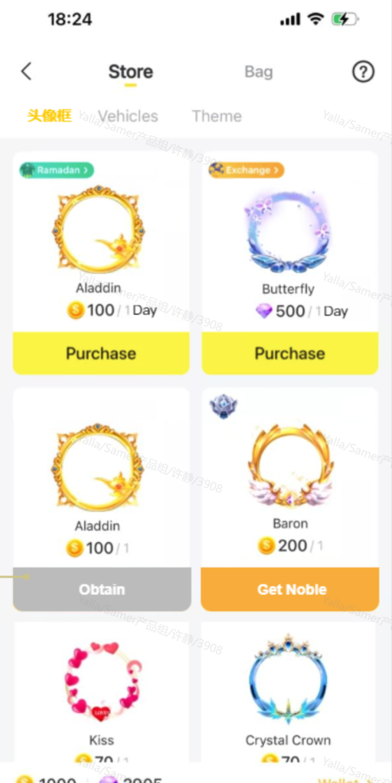

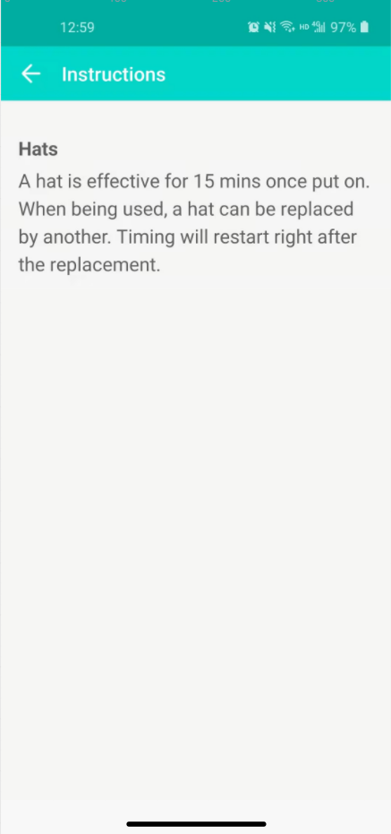

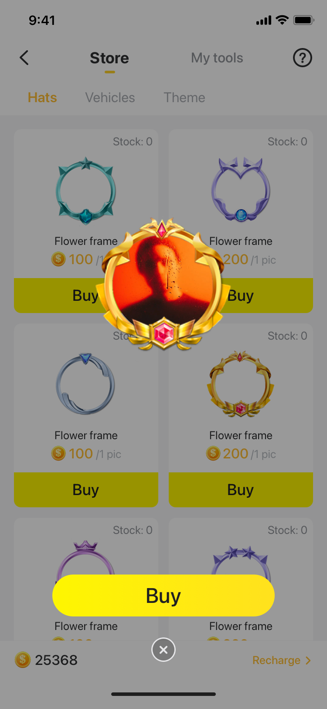

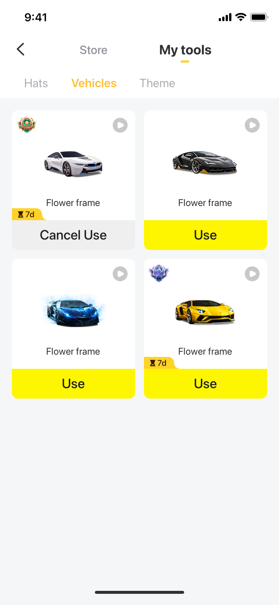

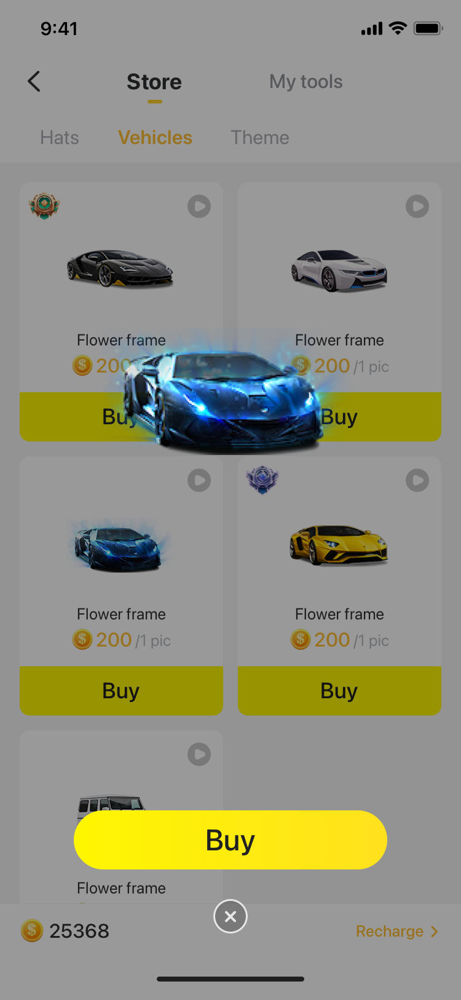

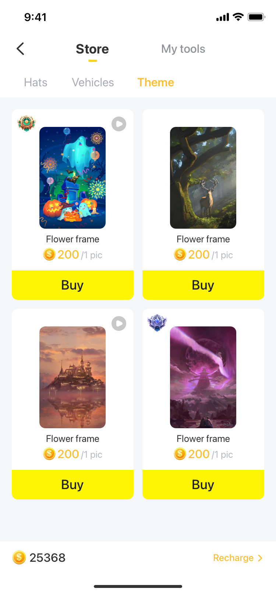

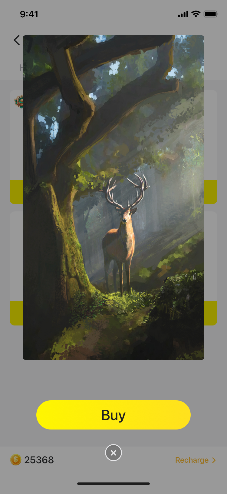

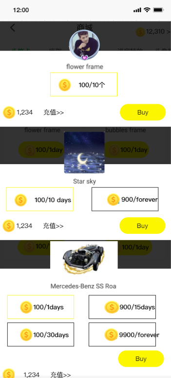

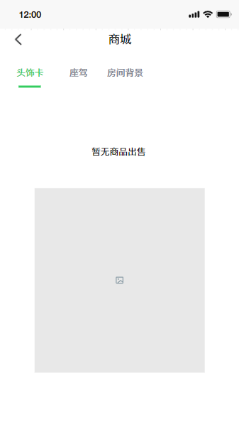

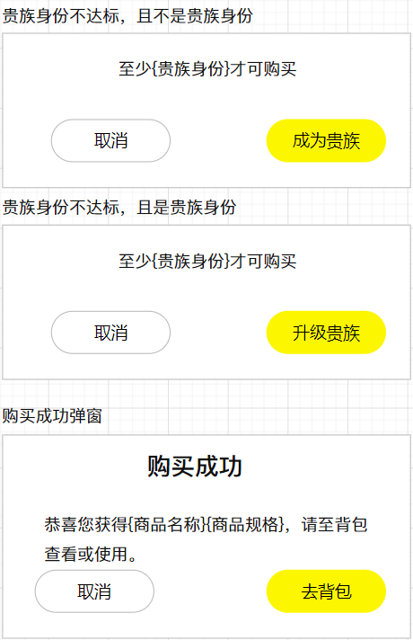

3.12.2.5 背包

| 功能名称 | 背包 |
|---|---|
| 优先级 | 高 |
| 功能描述 | 展示用户持有的头像框、座驾、房间背景 |
| 输入/前置条件 |  |
| 交互原型 | 头像框头像框 「图1」                                  「图2」 w 「图3」                                     「图4」 「图5」                                    「图6」 「图7」                                      「图8」 「图9」 |
| 字段描述 | 「图1」ME页-背包入口 ME页，点击背包icon。 「图2~图4」背包页 注：UI稿头部新增【商城 背包】tab。头部设计以蓝湖为准。 商品分类栏 排序依次为：头像框、座驾、房间背景。 默认展示：默认定位到第一个分类。 交互： 点击分类栏中其它类目时，左右滑动到对应类目页面。 在商品列表区域左右划动时，页面滑动到上一个/下一个分类。 若分类栏过长，左右滑动查看更多分类。 商品列表 一列展示2个商品，展示用户拥有的该分类的商品，包含商城购买商品、贵族身份获赠商品等。 占位图：若无商品，则显示占位图。见「图6」。 商品 商品图片 动效展示说明： 在商品列表上，仅头饰卡商品会在商品列表展示动效（若有）。 在预览浮层上，所有商品均会展示动效（若有）。 交互：点击图片打开预览浮层。 播放按钮 在房间背景、座驾页上，若商品非静态的，则在商品右上角展示播放按钮。 播放按钮仅做展示。实际交互区域仍然为整个商品图。 商品名称根据不同语区，显示对应的商品名称。 VIP要求若该商品有VIP购买要求，则显示最低的VIP身份要求。 使用时长使用时长展示逻辑同商城。不作用于头饰卡商品。 若数量为0，则不展示改头饰卡。 商品排序：展示用户拥有的所有商品（含VIP商品） 先按使用状态排序：优先展示使用中的商品。 再按商品排序倒序。注：成为VIP时，自动获得的商品排序默认为9999。 按钮： 使用：点击后弹出二次确认弹窗，再次确认即使用该商品。 取消使用：正在使用中的商品，显示【取消使用】按钮。点击后不佩戴该商品。 替换：点击后弹出二次确认弹窗，再次确认即取消正在使用中的商品，并改为使用该商品。 头像框右上角【？】：点击进入头像框规则说明页。页面同商城-头像框说明页。 「图5~图7」商品预览 与商城预览相似，但不显示购买规格。 显示该商品在背包的操作按钮。如【使用】/【取消使用】。点击操作按钮后的业务逻辑不变。 头像框商品，不显示操作按钮。 关闭操作：点击下方x按钮，或点击图片/动效与操作按钮以外的蒙层区域。 「图8」无商品占位图 当前分类无商品时，显示占位图、文案。 「图9」使用/取消使用/替换二次弹窗 取消使用弹窗 取消使用{商品名称} 【取消】【确认】 确认使用弹窗 使用{商品名称} 【取消】【确认】 确认替换使用弹窗 使用{商品名称}来替换使用中的商品 【取消】【确认】 |
| 需求描述 | 使用时长业务规则（仅限有时长的商品） 叠加规则多次购买或获得同一商品，将叠加该商品的使用时长。注1：一旦已拥有或获得永久时长商品，该商品不再叠加使用时长，用户可永久使用。 获得即开始倒计时用户通过任何方式获得有市场的商品（商城购买、运营赠送、签到奖励等），则立即倒计时，实时扣减时长，精确到秒。 倒计时归零该商品取消使用状态，并从背包中移出，且不会自动使用其它商品。 |

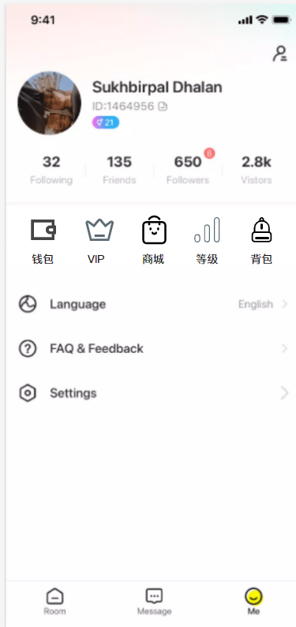

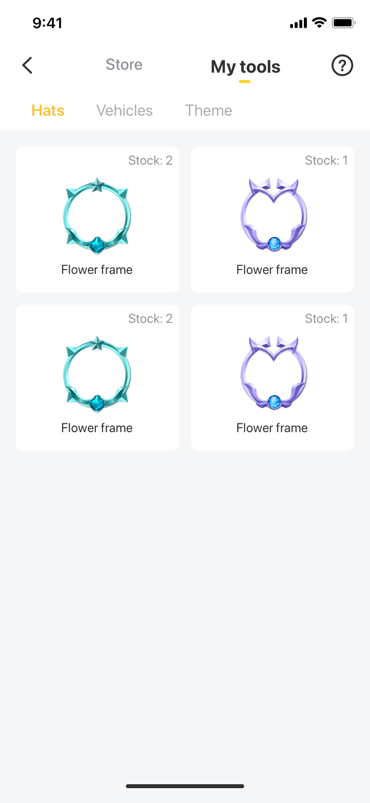

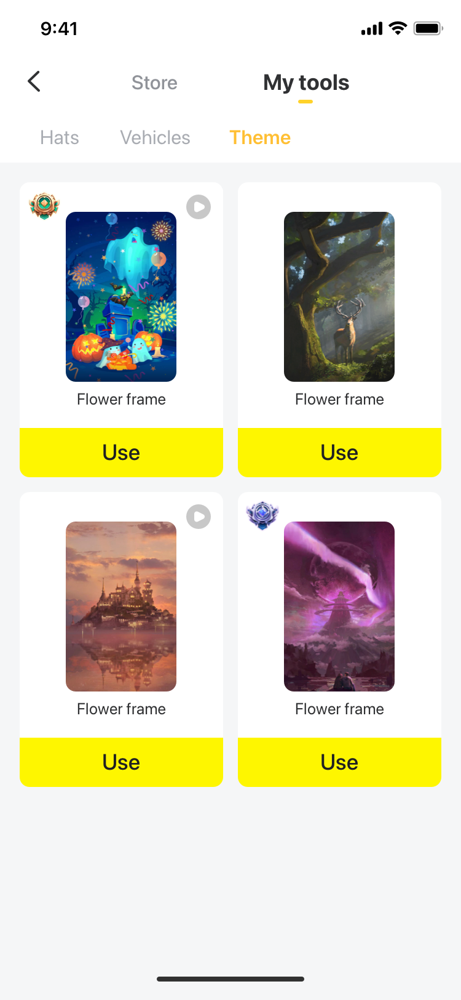

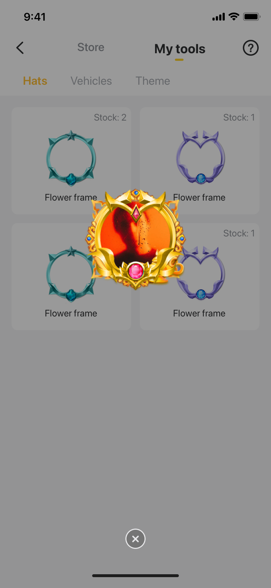

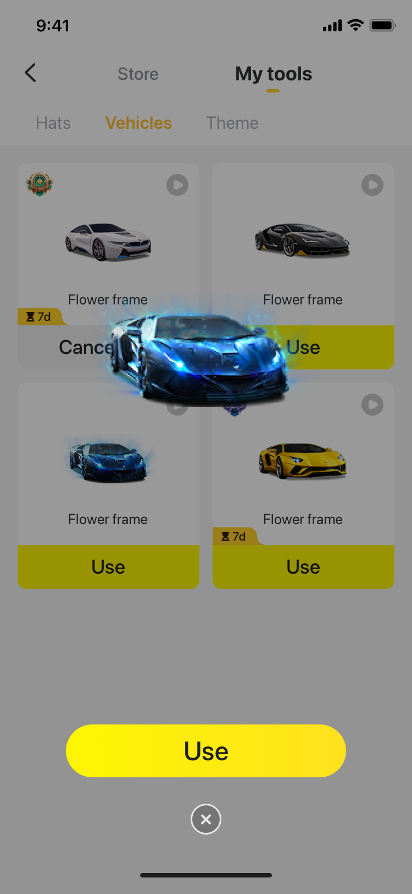

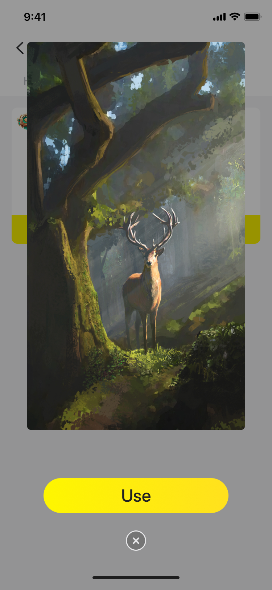

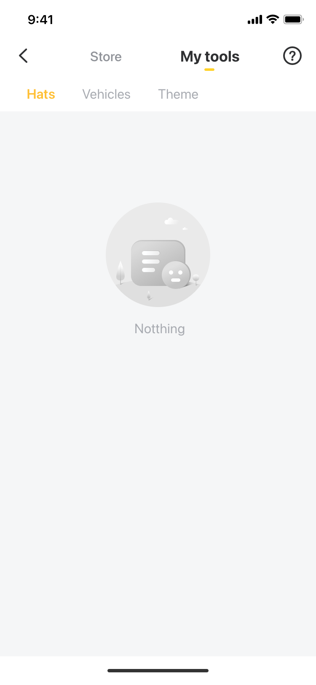

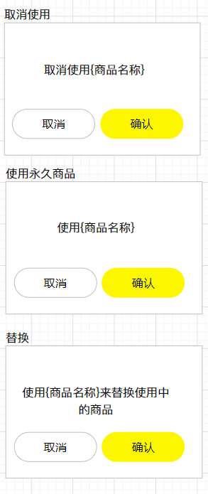
