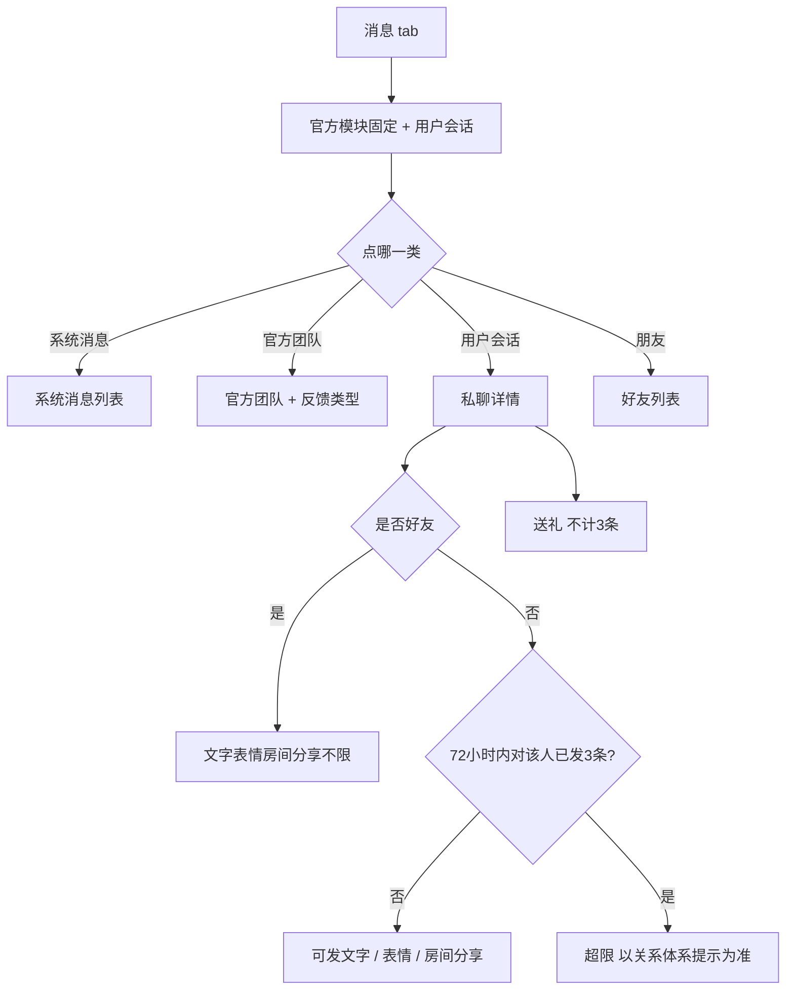

# 消息 · 现行说明

> 派生阅读层。改规则仍改 [`../PRD.md`](../PRD.md)。基于已收录主线 **V1.4.0**。拍板 RQ-08。

## 元信息
<!-- chunk:no -->

| 字段 | 值 |
|---|---|
| 功能 ID | `messaging` |
| 截止版本 | 已收录 V1.4.0 |
| 权威 | 派生；冲突以 `PRD.md` 为准，拍板见 [`../../../CONFIRMED.md`](../../../CONFIRMED.md) RQ-08 |
| 状态 | pending-review |

---

## 范围
<!-- chunk:default section=scope id=messaging.scope -->

覆盖消息列表、系统消息、官方团队、私聊、私聊送礼、好友列表、Official 图文消息。互关即好友；无好友验证、无申请箱。陌生人 IM 以关系体系为准：72 小时内对同一人最多 3 条（文字 / 表情 / 房间分享，不含礼物）。本文「每天 20 条」不当现行。Agency 分类不作现行。礼物面板私聊无对象区、IM 入口 New、引导 2 步见房间，本文不重写送礼玩法。

不覆盖后台消息模板字段表。

---

## 总流程
<!-- chunk:default section=flow id=messaging.flow-main -->

消息 tab 落地为列表：顶部官方模块固定，下方用户会话按未读优先、再按最后一条时间倒序。点会话进私聊。陌生人发文字 / 表情 / 房间分享受 72 小时 3 条限制；礼物不计条。成为好友后不限制。官方团队可提交与设置共用的问题反馈。

---

## 业务逻辑

### 列表与时间 {#logic-list}
<!-- chunk:default section=logic id=messaging.logic-list -->

官方模块静止，滑动只滚用户消息。用户消息：权重一未读，权重二最后一条距现在最近倒序。发送失败的消息不因失败而提前，仍按权重二。未读为正整数，最小 1，超过 99 显示 99+。导航「消息」右上角同步未读。会话预览：文字超一行省略；表情显示「表情」；文字+表情为「文字内容「表情」」；礼物为「礼物」；失败带叹号。时间：当天 hh:mm；前一自然日 Yesterday hh:mm；其它 dd/MM hh:mm。

私聊详情同样套这套时间；距上一条（含送礼、文字）超过 5 分钟才出时间戳。点头像进他人主页。

### 陌生人条数 {#logic-stranger}
<!-- chunk:default section=logic id=messaging.logic-stranger -->

陌生人之间聊天限制以关系体系为准：72 小时内对同一人最多 3 条（文字 / 表情 / 房间分享，不含礼物）。成为好友不限制。本文「每个自然日 20 条」及申请箱 / 添加好友流程不当现行。无好友验证。超限提示以关系体系为准。礼物不计入 3 条。

### 成为好友消息 {#logic-friend-msg}
<!-- chunk:default section=logic id=messaging.logic-friend-msg -->

现行无好友验证，互关即好友。双方成为好友后，以接受关注 / 回关方的名义发送【成为好友消息】：「我们现在已经是好友，发送消息开始聊天吧。」仅在发起关注方的用户消息模块展示该预览，且仅发起关注方会话未读和底部 tab 消息未读 +1（超过 99 为 99+）。私聊详情里该提示双方均可见，会随消息增多滑走。若提示未读，房间底部消息按钮未读同样 +1。一方移除后再互关，仍按上述规则再发。关系体系另有一套成为好友私聊文案，见待校对。

### 输入、黑名单与失败 {#logic-send}
<!-- chunk:default section=logic id=messaging.logic-send -->

输入窗空时占位「说些什么」。最多 300 字符，最多 5 行，超出截断。表情可与文字同发；原文另写「表情也算在 60 个字符内」，与 300 上限并存，见待校对。无内容或全空格不可发；前导空格+内容可发。屏蔽词检测见基建屏蔽词，本文不编规则。返回上级则丢未发送内容。

发送前：先判对方是否在自己黑名单，是则 toast「您已将对方拉黑！」再判自己是否在对方黑名单，是则 toast「对方将您拉黑，无法发送消息！」

发送中样式；30s 仍失败变叹号，toast「发送失败，请稍后再试！」点叹号可重新发送或取消。

### 私聊送礼 {#logic-gift}
<!-- chunk:default section=logic id=messaging.logic-gift -->

输入框无内容时右下角为送礼；有内容为发送。送礼对象写死为聊天对象，无选择用户菜单。面板逻辑同房间，UI 浅色。列表预览一律「[礼物]」。气泡：礼物图 + 个数；对方送「给您送礼物「礼物名称」」；自己送「您送出礼物「礼物名称」」；名称跟当前语言。图加载失败用占位图。私聊不展示礼物特效；送全站礼物不在其它房间广播。可展示幸运 / 活动 / 周星说明，不展示全站礼物说明。第一次打开私聊送礼面板展示 2 步引导，只一次；优先级低于房间送礼引导——房间已展示过则私聊不再展示；私聊展示过仍须在第一次打开房间面板时再展示房间引导。

非好友送礼仍不计 3 条。拉黑则不能送：自己拉黑对方 toast「您已拉黑对方」；被拉黑 toast「送礼失败，您已被拉黑」。幸运礼物获奖出弹窗。含特效的大礼物：对方送时若自己不在该会话，之后进入该会话需自动展示对应效果；同时正文规定私聊送礼不展示礼物特效，见待校对。

### Official 图文 {#logic-official}
<!-- chunk:default section=logic id=messaging.logic-official -->

不改已有 Official「2 组超链接」规则。文上图下。列表图最大高宽比 1:1，更扁按原比例；超出底部「查看更多」。正文仍最多 500 字。点图预览：短图居中、顶底半透明黑；长图顶对齐可上下滑。左上返回。手势缩放同房间封面预览。后台每种语言最多 1 张、单张 <5M，失败旁提示「图片过大」，见 admin。

---

## 客户端页面

### 消息列表 {#page-list}
<!-- chunk:default section=page id=messaging.page-list -->

导航：消息列表为落地；朋友列表为好友。官方消息带官方标识：官方团队（问题引导和回复）、系统消息。左滑删除：安卓和苹果统一为长按出「删除」弹窗，删除后下方会话上移。

### 系统消息与官方团队 {#page-official}
<!-- chunk:default section=page id=messaging.page-official -->

系统消息按时间倒序，时间 dd/MM hh:mm，展示全文。空态有独立样式。类型以后台为准。

官方团队：图标不可点，带官方标识。时间戳与输入窗同私聊。新用户注册成功自动收到欢迎：「欢迎来到Hayyo，如果您有什么问题和意见，可以在这里告诉我们哦～。」底部可横滑四类反馈：APP问题、充值、建议、其它，必选单选，默认 APP问题。占位「Say something」。发出后气泡只展示用户输入、不展示类型；系统自动回「感谢你的反馈！我们会尽快给您回复，请在“我的反馈”中查看」，「我的反馈」高亮可点。每发一条即在「我的反馈」生成一条。被回复时再通知「你的反馈已被回复，请在“我的反馈”查看。」与设置中问题反馈共用后台。

### 私聊详情 {#page-chat}
<!-- chunk:default section=page id=messaging.page-chat -->

头像、昵称、气泡、礼物样式见 `{#logic-list}` `{#logic-gift}`。点表情切表情面板，右下角退格。退出输入或点消息列表可收起键盘；未发送内容保留，多行收成单行用省略。陌生人条数、黑名单、失败重发见逻辑节。

### 好友列表 {#page-friends}
<!-- chunk:default section=page id=messaging.page-friends -->

消息里的朋友标签。按成为好友时间倒序。点头像进他人主页；点行或聊天按钮进私聊。空态文案同个人中心好友列表，按钮去房间列表。搜索占位「点击搜索ID或昵称」；最多 30 字符；实时连续字符匹配昵称或 ID，命中段高亮；结果仍按好友时间倒序；无匹配空态。取消清空并回列表。

---

## 后台影响
<!-- chunk:default section=admin id=messaging.admin-impact -->

系统消息、惩罚文案、房间广播、打招呼模板、Official 图文配置以后台为准。补单触发的系统消息见补单章。本文不复制字段。跳转 [`../../admin/PRD.md#admin-msg`](../../admin/PRD.md#admin-msg)、[`../../admin/PRD.md#admin-recharge-msg`](../../admin/PRD.md#admin-recharge-msg)。Official 图文配置在消息管理下，客户端样式以本文为准。

---

## 关联影响

### 关联 · 关系体系 {#related-relationship}
<!-- chunk:related-row section=related id=messaging.related-relationship target=relationship -->

陌生人 72 小时 3 条、互关即好友、超限提示以关系体系为准。本文每天 20 条不当现行。跳转 [`../../relationship/brief/current.md`](../../relationship/brief/current.md)。

### 关联 · 个人中心 {#related-profile}
<!-- chunk:related-row section=related id=messaging.related-profile target=profile -->

官方团队反馈与设置中问题反馈共用后台；「我的反馈」在个人中心。拉黑后不能互发消息。跳转 [`../../profile/brief/current.md`](../../profile/brief/current.md)。

### 关联 · 房间 {#related-room}
<!-- chunk:related-row section=related id=messaging.related-room target=room -->

私聊送礼面板、幸运 / 活动 / 周星说明、2 步引导相对房间引导的优先级见房间。本文不重写送礼玩法。跳转 [`../../room/brief/current.md`](../../room/brief/current.md)。

### 关联 · 币商 {#related-merchant}
<!-- chunk:related-row section=related id=messaging.related-merchant target=merchant -->

Agency 分类不作现行。跳转 [`../../merchant/brief/current.md`](../../merchant/brief/current.md)。

### 关联 · 运营后台 {#related-admin}
<!-- chunk:related-row section=related id=messaging.related-admin target=admin -->

系统消息 / 惩罚文案 / 广播 / 打招呼 / Official 图文、补单系统消息。跳转 [`../../admin/brief/current.md#admin-msg`](../../admin/brief/current.md#admin-msg)、[`../../admin/brief/current.md#admin-recharge-msg`](../../admin/brief/current.md#admin-recharge-msg)。

---

## 相对变化
<!-- chunk:changelog section=changelog id=messaging.changelog -->

相对原文：互关即好友，去掉好友验证和申请箱。陌生人 IM 改为 72 小时内对同一人最多 3 条（文字 / 表情 / 房间分享，不含礼物）；「每天 20 条」不当现行。Agency 分类不作现行。成为好友消息按现行段：回关方名义发送，列表预览和未读 +1 仅发起关注方。

---

## 原文
<!-- chunk:no -->

[`../PRD.md`](../PRD.md) · [`../changelog.md`](../changelog.md) · [`../history/`](../history/)

---

## 计划预览
<!-- chunk:no -->

V1.5.0 工作区不是现行。升格为已收录后，先判定覆盖或增量，再重读或补充本文。

---

## 待校对
<!-- chunk:no -->

- 成为好友列表展示：同章前段写双方模块都展示且发起方未读 +1，后段「现行」写仅发起方模块展示；本文以后段为准，前段不另执行。
- 成为好友文案与关系体系「我们已经成为好友了，请我们一起尽情的玩吧~」不一致，未拍板合并。
- 输入上限 300 与「表情算在 60 个字符内」原文并存。
- 私聊「含特效大礼物进入会话需展示效果」与「私聊送礼不展示礼物特效」原文并存。
