# 积分提现（Payout）
> 功能 ID：`payout` · 权威：`current` · 产品：Hayyo · 更新：2026-09-16  
> 现行规则收到 V1.4.0。旧版原文见 [`history/`](history/)。叠稿回退见 [`history/PRD.stacked-2026-09-16.md`](history/PRD.stacked-2026-09-16.md)。  
> 拍板记录见 [`../../CONFIRMED.md`](../../CONFIRMED.md)。未收入版本或原文未写的接口/字段：不编造。

## 范围
- 用户用积分按汇率兑法币并提现（YallaPay 打款）。**不是**币商分销充值。
- 积分只用于提现，只兑 USD。积分可以扣成负数，用户端和管理后台都要能显示负数；余额为负不能发起提现，申请页只出现 0 和正数。
- 展示最多 **16** 位，超出加 `+`。订单号前缀 **HABBY**、**TLXX** 保留。
- 提现短信与 [`../auth-login/PRD.md`](../auth-login/PRD.md) 共用配额：同设备 + 同号，GMT+3 自然日 ≤10。
- 「其他货币提取」原文 `needs-input`，保留标记、不编造。
- YallaPay 分销支付仍在 [`../yallapay/PRD.md`](../yallapay/PRD.md)。拉新充值结算金币/积分二选一见 [`../referral/PRD.md`](../referral/PRD.md)。

## 关联后台
- 后台页面与配置以 [`../admin/PRD.md`](../admin/PRD.md) 为准；本文只写 App 侧规则。
- 积分与提现（订单审批 / 话术 / 配置 / 档位 / 统计 / 个人积分）：[`../admin/PRD.md#admin-payout`](../admin/PRD.md#admin-payout)
- 绑手机 / 改绑流程：[`../profile/PRD.md`](../profile/PRD.md)（本文不抄流程）
- 验证码位数、倒计时、失效、每日条数：[`../auth-login/PRD.md`](../auth-login/PRD.md)（提现不另开配额）

## 规则

图相对路径为 `images/`。

### 页面入口

| 功能名称 | 入口 |
|---|---|
| 优先级 | 高 |
| 功能描述 | 团长主页与奖励记录增加积分/提现入口。 |
| 输入/前置条件 | 后台功能开关开启，且用户仍是团长。 |
| 交互原型 | 「图1」「图2」「图3」 |
| 字段描述 | 业务：用户在平台赚积分，按比例提现法币。当前积分只用来兑换法币。 金币和法币兑换比例后台可配；本版只做积分和美金。默认 **200000 积分 = 1 美金**。 正数或 0：显示「我的积分」；欠款为负：显示「积分欠款」。展示详细数字，最多 16 位，超出加「+」。 |
| 需求描述 | 团长位两个入口：主页、奖励记录页。手势滑动时收起入口，悬停再展示。 是否展示：后台开关 **且** 仍是团长，同时满足才展示；不满足 toast「功能维护中，暂不对外开放」，然后刷新页面。 点击问号：积分说明弹窗。 应用外打开页面：提示回到应用内打开（复用已有页面）。 |
| 补充说明 | 拉新周期配置积分发放见 [`../referral/PRD.md`](../referral/PRD.md)，不在本条展开。 |

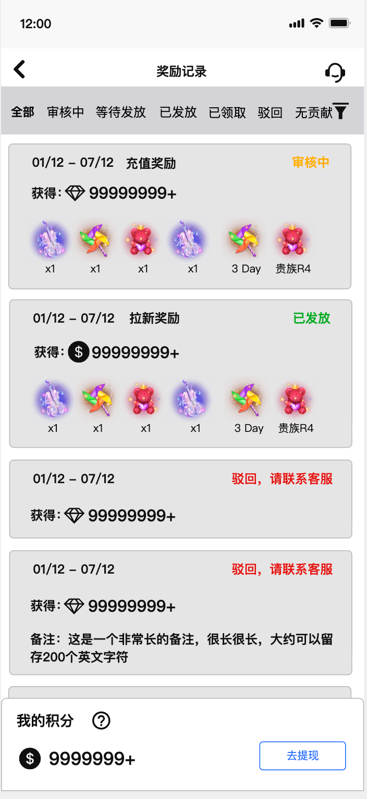

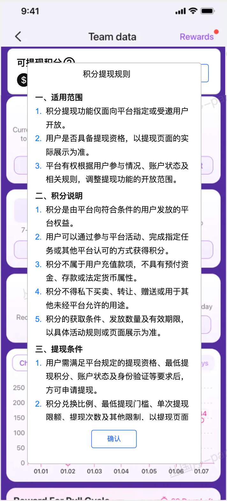

### 收益页积分模块

| 功能名称 | 积分模块 |
|---|---|
| 优先级 | 高 |
| 功能描述 | 当前积分、本月/累计收益、近 60 天积分明细。 |
| 输入/前置条件 | 已能进入收益页。 |
| 交互原型 | 「图1」～「图5」 |
| 字段描述 | 当前积分为 0 或正数显示「我的积分」，负数为「积分欠款」。最多 16 位，超出加「+」。 本月收益、累计收益均支持负数。 三个数值：能快最好；操作后刷新、进出页刷新、下拉刷新。 后台扣除：按当前时间点扣当前、本月、累计。 |
| 需求描述 | 问号弹出说明。「积分记录」进明细：默认近 60 天时间倒序，时间相同按订单 id 倒序；分页 50 条，上滑加载、下拉刷新。 订单号可复制，toast「已复制」；规则 `HABBY` + `yymmdd` + 加密 6 位。 变动：使用/消费为负，获得为正。时间 GMT+3，日月年时分秒。 后台扣除描述非必须，有则展示。 状态：拉新奖励、提现使用、提现失败返还、平台奖励、平台扣除。横向 tab 与下拉筛选联动。 空状态见图。 |
| 补充说明 | 不并进拉新奖励记录列表。 |

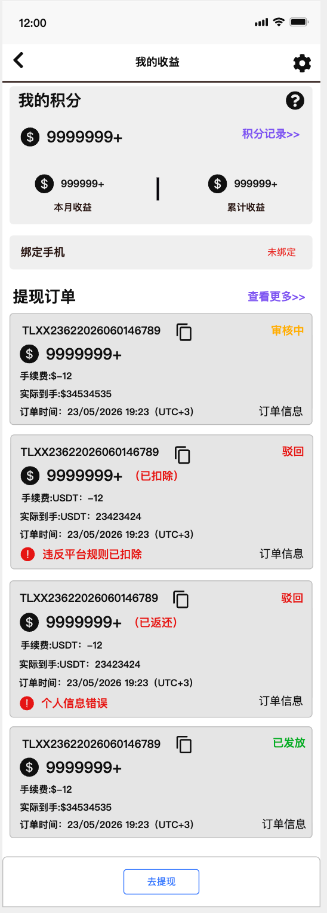

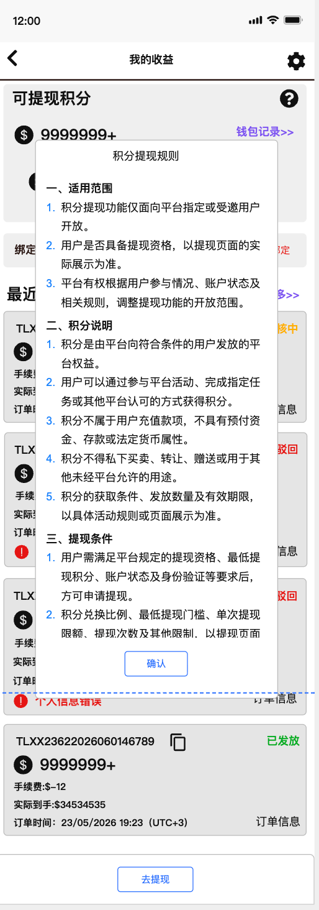

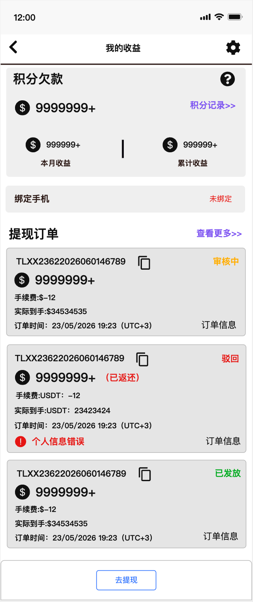

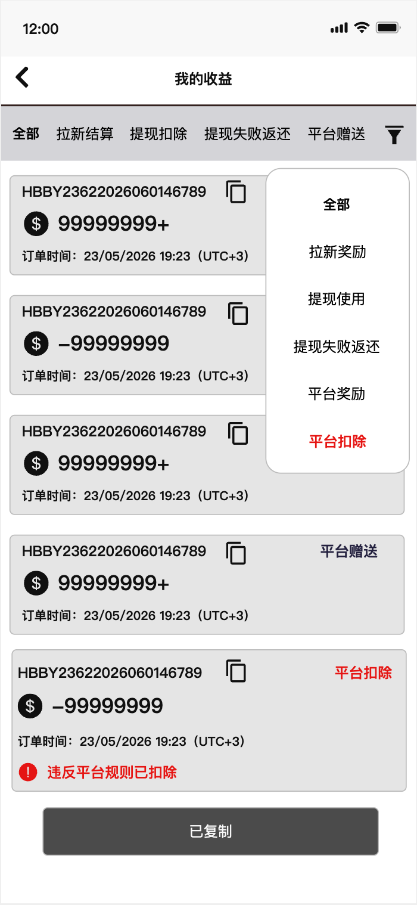

### 提现绑定手机

| 功能名称 | 提现和绑定设置 |
|---|---|
| 优先级 | 高 |
| 功能描述 | 未绑手机不能提现；三入口收束到同一弹窗后再进已有绑手机。 |
| 输入/前置条件 | / |
| 交互原型 | 「图1」「图2」 |
| 字段描述 | 提现流程需要短信验证，必须已绑手机。绑/改绑使用平台已有业务，本文不抄流程。 |
| 需求描述 | 未绑定：主页积分模块下方展示未绑定；设置里「手机绑定」为未绑定；点「去提现」也判断。三入口都先到提示弹窗，再跳转 App 内绑手机页。 已绑定：主页不再展示未绑定条；设置显示已绑定；「去提现」进入申请流程。 |
| 补充说明 | 绑手机权威见 [`../profile/PRD.md`](../profile/PRD.md)。 |

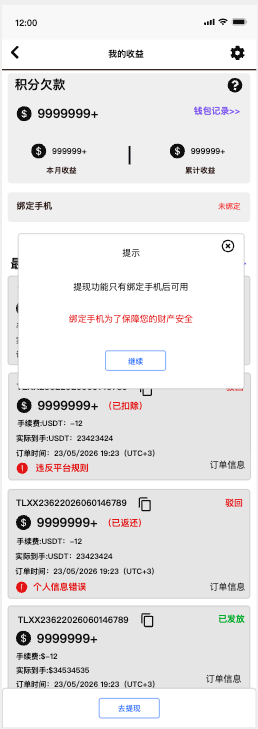

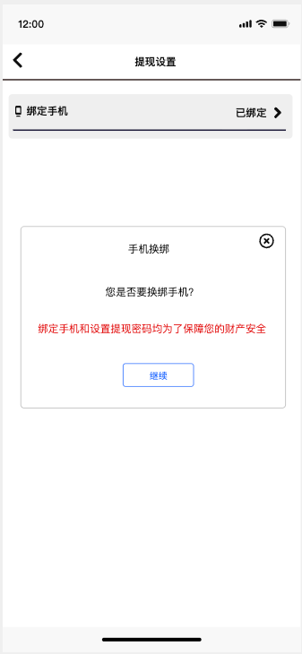

### 提现订单

| 功能名称 | 提现订单 |
|---|---|
| 优先级 | 高 |
| 功能描述 | 主页与详情的提现订单列表。 |
| 输入/前置条件 | / |
| 交互原型 | 「图1」～「图4」 |
| 字段描述 | 默认近 60 天时间倒序，时间相同订单 id 倒序；分页 50。 订单号 `TLXX` + `yymmdd` + 加密 6 位，可复制。 本页消耗积分只展示正整数。 YP 动态返回字段才展示。账号有返回时脱敏：>8 位前 4 后 4；≤8 前 2 后 2；≤4 全 `*`。银行展示 Account number，钱包展示手机号。 状态：审核中；已经发放（跟 YP）；驳回（可已返还或已扣除）。 货币保留两位小数。 |
| 需求描述 | 空状态不展示「查看更多」。详情页支持状态筛选，排序规则同主页。 |
| 补充说明 | 不并进拉新奖励记录。 |

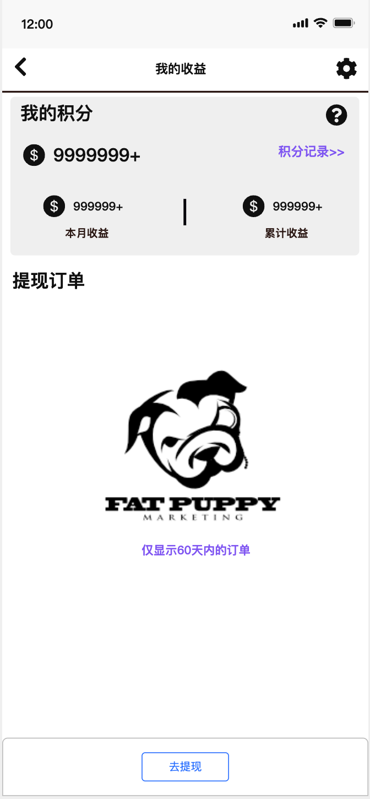

### 提现发起拦截

点击「去提现」按下列顺序判断：

1. 平台提现开关。关闭则维护提示。
2. 账号提现开关。关闭则「提现功能异常，请联系客服」，确定进 Official，返回仍回本页。
3. 积分权限**不作为**提现判断，只看提现开关。两种团长在得到发放奖励时可自动开户；非团长后台开户可无入口但仍可加减积分。
4. 积分不能为负；负则 toast，不能进入申请页。
5. 已绑手机；未绑则绑定弹窗。
6. 月上限（美金）：审核中 + 已成功 + 本单 ≤ 后台配置。

都通过后进入申请。

### 提现申请

| 功能名称 | 提现申请 |
|---|---|
| 优先级 | 高 |
| 输入/前置条件 | 已通过提现发起拦截；本页只出现 0 和正数积分。 |
| 交互原型 | 「图1」～「图10」 |
| 字段描述 | 最多 9 档，排序后台配置。默认 20 万积分 = 1 美金（只维护积分↔美金；当地汇率、手续费、到账由 YP）。 成功过提现则默认上次资料。首选货币本版现埃及。 **首提**：终身一次，只降低门槛不送积分。审核中/成功算用过；驳回退回资格。每档最多绑一个首提；原档关闭则首提也不展示。 YP 字段未返回前不展示对应手续费/到账。有单笔限额则超限档位置灰。 |
| 需求描述 | 积分不够最低档 toast「您当前积分不够」。 点去提现前二次校验：积分美金比例、档位/首提、YP 汇率与渠道。变更则 toast「相关信息已经变更，请重新审查资料」，刷新并尽量保留未变信息；档位不可用则恢复未选。 后台关「其他货币」则不展示首选货币以外的货币。 |
| 补充说明 | YallaPay v1.4.1 聚合支付外链不入库。 |

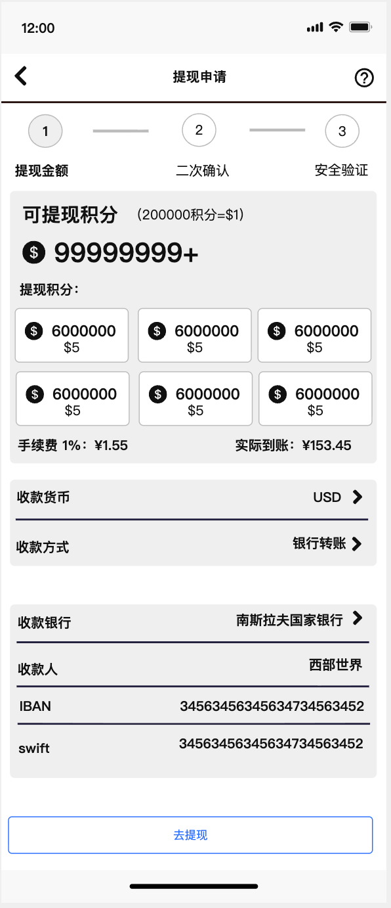

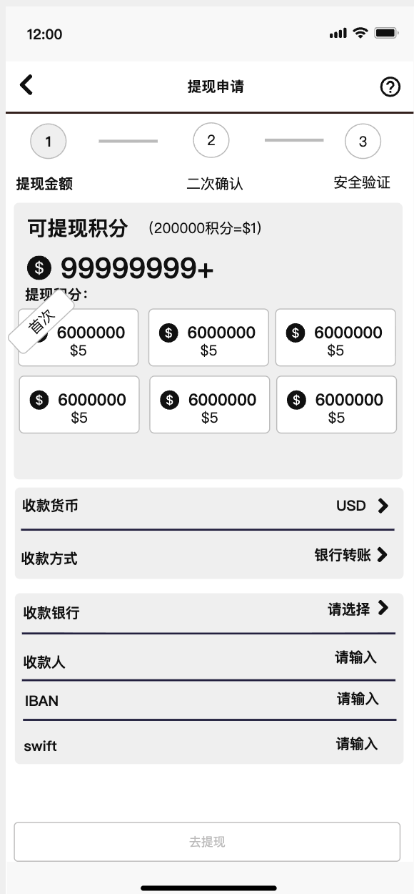

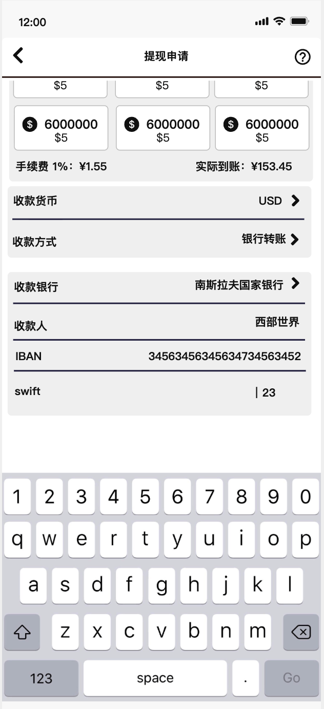

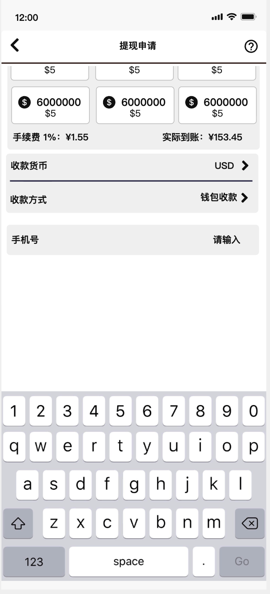

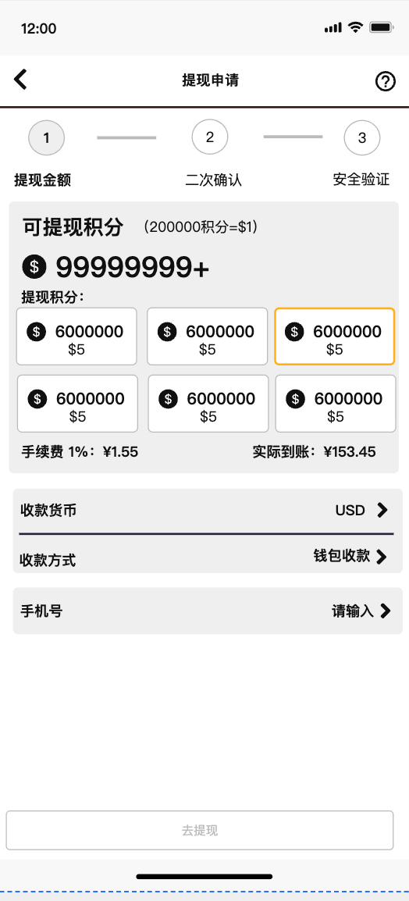

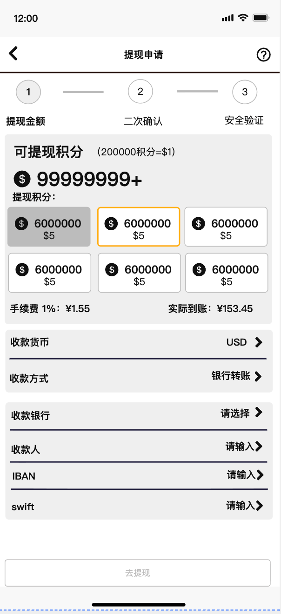

### 确认信息

展示本次法币金额（非到账）、消费积分、手续费与比例、实际到账、收款资料。确认后进安全验证。填写错误红字；金额不足等用通用弹窗。

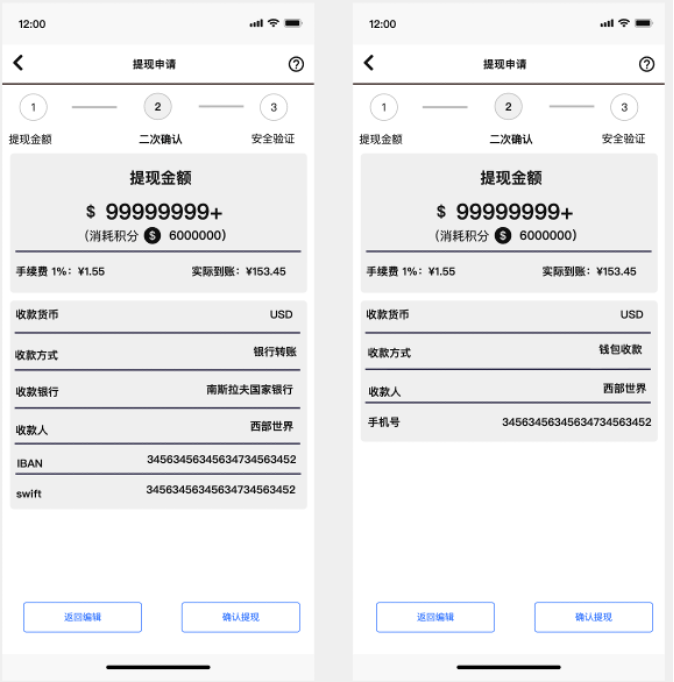

### 安全验证

| 功能名称 | 安全验证 |
|---|---|
| 优先级 | 高 |
| 交互原型 | 「图1」「图2」 |
| 字段描述 | 固定文案「账户安全验证，为保障您的资金安全，请完成验证」。展示提现金额、当前注册手机号（不脱敏）。 |
| 需求描述 | 进入页自动发短信。toast「验证码已发送～」。60 秒倒计时内不可重发；重发则旧码失效。 **位数、倒计时、失效、每日条数与平台已有验证码相同**（[`../auth-login/PRD.md`](../auth-login/PRD.md)）：同一设备 + 同一手机号每个 GMT+3 自然日最多 10 次，提现不另开配额。达上限弹窗「很抱歉，您当日获取验证码的次数已达上限，请明日再试」。 「收不到验证码」打开换绑说明页，**不回登录**。 短信业务文案：【平台名称】您正在申请积分提现，验证码为：{{code}}，{{expire_minutes}}分钟内有效。请勿向任何人泄露验证码；如非本人操作，请忽略本短信。 |
| 补充说明 | 不在此重写登录注册验证码全文。 |

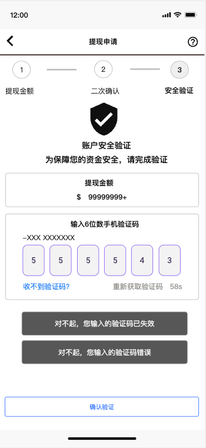

### 申请成功

递交成功页展示货币数量、手续费、实际到账、预计到账（有银行字段用短说明，有手机号用对应说明，都没有用长说明）、收款资料、订单号（可复制）、GMT+3 订单时间。「查看订单」回提现订单列表。「再次提现」等同主页去提现，需再走拦截。

### 后台指针

后台新标签「积分与提现」的订单审批、话术、配置、档位、统计、个人积分管理见 [`../admin/PRD.md#admin-payout`](../admin/PRD.md#admin-payout)。个人积分管理「其他货币提取」原文截断 → `needs-input`；负数显示按本功能确认口径，后台列表也要能显示负积分。

### 拉新奖池指针

拉新充值结算金币/积分二选一、积分同样退款追溯、发放时无户自动开户：见 [`../referral/PRD.md`](../referral/PRD.md)。

## 版本

明细见 [`changelog.md`](changelog.md)。原文切片与叠稿在 [`history/`](history/)。
