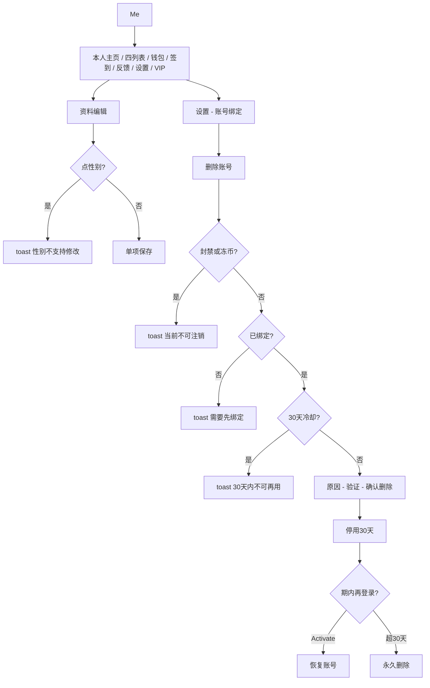

# 个人中心 · 现行说明

> 派生阅读层。改规则仍改 [`../PRD.md`](../PRD.md)。基于已收录主线 **V1.4.0**。拍板 RQ-02、RQ-04、RQ-06、RQ-07、RQ-08、RQ-17。

## 元信息
<!-- chunk:no -->

| 字段 | 值 |
|---|---|
| 功能 ID | `profile` |
| 截止版本 | 已收录 V1.4.0 |
| 权威 | 派生；冲突以 `PRD.md` 为准，拍板见 [`../../../CONFIRMED.md`](../../../CONFIRMED.md) |
| 状态 | pending-review |

---

## 范围
<!-- chunk:default section=scope id=profile.scope -->

覆盖 App 侧：Me、个人主页、资料编辑、关注 / 好友 / 粉丝 / 访客、头像框、反馈、设置（绑定、隐私、语言、黑名单、关于）、注销 / 激活、版本与协议更新、查看原图、iOS 相册「选中的照片」权限。

新用户必须在资料确认页选男或女才能进首页，选后不可改。Not Specified 不是线上默认。默认昵称前缀 `player`。无好友验证开关；互关即好友。Me 背包无头饰卡；头饰卡 ≠ 头像框。无主播、工会 / 公会、家族入口。无贵族。付费身份只有 VIP。

不覆盖钱包入账公式、签到奖品配置、绑 / 改绑步骤的重复抄写（提现绑手机收束到已有绑手机页）。

---

## 总流程
<!-- chunk:default section=flow id=profile.flow-main -->

已登录从底部 Me 进个人中心。点头像 / 昵称 / 主页 icon 进本人主页，再进编辑。四份互动列表从 Me 进出。设置里做绑定、隐私、语言、黑名单、关于、退出。删除账号在账号绑定页底部：先过封禁 / 冻币、未绑定、30 天冷却，再选原因、验证、倒计时确认；成功后停用 30 天，期内再登录可激活。

---

## 业务逻辑

### 性别与资料 {#logic-gender}
<!-- chunk:default section=logic id=profile.logic-gender -->

新用户必须在资料确认选男或女后才能进首页，选后不可改。Not Specified 不是线上默认。资料确认见登录注册、基建。编辑页点性别 toast「性别不支持修改」。编辑页性别只展示男 / 女，不支持第三性别。

默认昵称前缀 `player`，最长 24 字符。新手机注册国籍取区号国家；三方取手机国家，不在列表或没有则显示「未知」。简介默认留空，最多 60 字符。生日可选范围 1920.01.01 到（当前日期 −12 年）；未改过生日默认显示注册日 −18 年。生日编辑限制 X 天只能改一次（X 服务端配置）；保存二次确认「你确定要保存吗？X天内限制只能修改1次。」限制期内再点编辑：「X天内限制只能修改次，Y天后支持修改。」

用户名、国家、头像、简介打开二级页单项保存。昵称 / 简介：空或全空格 toast「输入的信息不能为空」；敏感词 toast「不可使用敏感词！」；无敏感词 toast「资料保存成功！」并返回。未变更则保存置灰。返回时有变更弹「是否保存所有编辑？」

国家：注册确认后 30 天内只能改 1 次，且之后只能改同语区国家。保存二次确认说明仅能改为相同语区、30 天内 1 次；未满 30 天则提示 X 天后才能改。原文写：当前选择与已设国家**相同**则保存可点、**不同**则置灰——疑似写反，见待校对。语言设置同结构，只改 App 展示语言（英 / 阿 / 土），不影响归属语区；保存按钮相同 / 不同规则同样按原文，见待校对。

### 关注、好友与拉黑 {#logic-relation}
<!-- chunk:default section=logic id=profile.logic-relation -->

最大可关注 1000，超限 toast「您可关注的好友数已达上限」（粉丝列表超限文案为「对不起，您可关注的用户数已达到上限～！」）。最大好友 1000，超限 toast「您的好友数已达上限」。互关即好友，无好友验证、无申请箱；隐私设置无添加好友验证开关。按钮与关注 / 好友状态见关系体系。

拉黑后：双方不可互加好友、不可互相关注；同时解除双方好友和关注；无法给对方发消息、也无法收到对方消息。关注对方时：被对方拉黑 toast「您被对方拉黑，无法关注该用户～」；已拉黑对方 toast「对方被您拉黑，无法关注该用户～」。最大可拉黑 300，超限 toast「对不起，您可以拉黑的用户数量已达到上限！」且不拉黑。

数量展示：1000 以下直接数字；1000 及以上 10000 以下用 K；10000 及以上用 w；保留一位小数，小数为 0 不显示，不四舍五入直接抹掉。粉丝、访客相对上次查看的新增提示：0 不显示，超过 99 显示 99+，进列表返回后清掉。

### 头像框 {#logic-frame}
<!-- chunk:default section=logic id=profile.logic-frame -->

Me 背包无头饰卡。头饰卡 ≠ 头像框。背包分类见商城。头像框三类：运营头像框（签到、运营赠送，有时长，同商城使用时长，不支持永久，不自动佩戴）；等级头像框（仅用户等级发放，永久，不因业务取消，不自动佩戴）；空白头像框（人人都有，不佩戴任何框时默认选空白，用空白可取消其它框）。配置由服务端、跟随版本。时长显示在框下方。

### 绑定、改密 {#logic-bind}
<!-- chunk:default section=logic id=profile.logic-bind -->

未绑手机显示「未绑定」，点击进绑定（规则同登录注册绑手机）。已绑显示脱敏号（隐藏最后 4 位），点击问是否改绑。改绑：先验旧号验证码，再输新号；新号已绑其他 ID 或与旧号相同，均提示「该手机号已被绑定，请更换手机号尝试」；可用则验新号验证码，成功 toast「修改成功！」验证码走登录注册共用配额。

苹果 / Facebook / Google / 以及登录注册增补的 TikTok、Snapchat：未绑点击走绑定，若该三方已绑其他 ID toast「对不起，该账号已绑定其他ID！」已绑则走解绑；解绑必须已绑手机，否则弹窗「很抱歉，只有绑定手机才可以进行解绑账号相关操作。」解绑成功 toast「解除成功！」

改密：未绑手机弹窗「很抱歉，只有绑定手机才可以进行修改密码的操作。」已绑则短信验证（规则同注册）再设新密（规则同注册设密）。提现必须绑手机；三入口收束到同一弹窗后再进**已有**绑手机页，不另写步骤。

### 注销拦截与停用 {#logic-delete}
<!-- chunk:default section=logic id=profile.logic-delete -->

入口：我的 > 设置 > 绑定账号 > 删除账号。现行拦截只有三条：

1. 封号、冻币：toast「你当前不可进行账号注销」。禁言允许删除。
2. 未绑定过：toast「You need to bind before you can delete the account.」
3. 走完删除并确认后，同一账号 30 天内不可再用；再点提示「You used the account deletion feature on November 11th and cannot use it again within 30 days」（日期为实际时间）。激活成功后 30 天冷却从恢复当日另起算。

无主播 / 工会 / 家族拦截。无贵族订阅拦截。「查看取消订阅步骤」只说明商店订阅，区分 iOS / 安卓，不是 VIP 门闩。被封账号无法登录，须解封后自行删除。被禁言可删；激活后原功能禁用仍有效。

通过拦截后：二次确认永久删除不可恢复 → 单选 10 个原因（未选 Continue 置灰）→ 安全验证弹窗 → 验证页。手机优先短信（6 位输完即判，对则「Verification succeeded」，错则「Verification failed」）；Facebook / 苹果 / 登录注册增补的 TikTok、Snapchat 须授权且与绑定账号相同，不同则「This account is not tied to your Hayyo account, please try again.」或登录注册英条文案。确认页 15 秒倒计时结束后才能点 Delete Account。按顺序展示当前非 0 项：Friends、User level、Backpack props、Profile frame、Golds、宝石，表达为「当前值 -> 0」。点 Delete 成功 toast「The current account has been deleted.」并退出到登录页进入停用；失败 toast 连不上服务器并回 Setting。

停用 30 天：个人信息匿名化（随机默认头像、「账号已停用」标记、头像框 / 座驾 / 房间背景取消佩戴且激活不强制恢复、昵称变默认、签名清空）；搜索不到并 toast「该用户账号已停用」；房间封面 / 名称随默认昵称头像重置，签名和公告不展示；期内激活可恢复这些信息，超 30 天不恢复。关系保留但列表 / 榜单展示默认昵称头像。不推送（激活后恢复、历史不补发）。私聊列表不清除，发消息或送礼 toast「该用户账号已停用」。日 / 周 / 总榜实时下榜（允许 1 小时内更新）。有时效商品在停用期内继续消耗。后台不可改该用户资料。停止自动发放金币 / 宝石。关注房间列表移除其房间；激活后列表恢复但点击 toast「该房间不存在」。分享该用户房间的 H5 展示官方房。设备注册数量限制不因删除 −1。ID 不回收。永久删除时清注册 IP，头像 / 框 / 昵称 / 签名 / 房间封面变默认，金币和宝石清零，切断关联。若该用户曾用苹果登录，30 天后删除时服务端用 Sign in with Apple REST API 撤销令牌。

期内登录弹出激活询问。Activate 成功 toast「Welcome back, it may take a moment to restore your account.」进 Loading。Cancel 回登录。停用期不可重置密码，点 Obtain 提示「无法使用」且不发验证短信。老版本登录停用号提示「登录失败」。若尚未点激活时后台已删，再点激活弹「该账号已删除，请重新注册。」

个人贡献月榜 / 周星礼物榜不下榜：原文标待确认，见待校对。

### 版本与协议 {#logic-update}
<!-- chunk:default section=logic id=profile.logic-update -->

普通更新弹在首页 Room tab，每条配置每个 App 只弹一次，杀进程再进已弹过不再弹。Android：Google Play / 官网下载 / 叉号或蒙层可关。iOS：取消 / 更新去 App Store，蒙层可关。强制更新在一级页（Party 各页、Me）及部分二级页（个人资料、他人资料、进自己房间）；点按钮或蒙层都不关；优先级高于其他弹窗；支付类接口不弹强更。iOS 和 Google 渠道关于我们里的检查更新须按原文区分；其它安卓用后台版本号对比。协议更新可配换行自适应文案，英阿语；未配则不显示；优先级看服务返回时机。

---

## 客户端页面

### Me 与个人主页 {#page-me}
<!-- chunk:default section=page id=profile.page-me -->

Me：头像、昵称、用户 ID、性别、年龄；关注 / 好友 / 粉丝 / 访客数量（格式见 `{#logic-relation}`）。点头像 / 昵称 / 右上主页 icon 进本人主页。钱包进钱包页。签到区分未签 / 已签，点进签到。意见反馈、设置。语言入口在设置，不在 Me。背景为系统默认，暂不可改。无 CP、贵族订阅、支持者、勋章入口；无加入公会。VIP 入口保留（未获 VIP 为 Get VIP，已获为等级）。无头饰卡入口。

本人主页：头像、昵称、ID、性别年龄、简介；国家、注册日期；礼物墙两排（按收礼时单价降序，同价比数量，再同则随机）；无礼物不显示详情按钮，文案「当前没有收到礼物哦～」。无语言展示。无勋章、CP、游戏对战数据。Trace 与 Profile 合成一块。增加 VIP 大图标。右上角进编辑。

在自己主页点头像：查看头像 / 更改头像 / 选择头像框。他人主页点头像进原图。房间信息卡点房间头像也可看原图。原图：单击关、双击放大、双指缩放；长按下载（须权限）；无右下角下载按钮。

### 资料编辑 {#page-edit}
<!-- chunk:default section=page id=profile.page-edit -->

头像页：当前头像；系统头像 12 个可勾选；新注册未改头像默认第一个。自定义须相册 / 相机权限，失败引导去系统设置。选图或拍照后裁剪，自定义上传尽量压到 1M，鉴黄违规 toast「很抱歉，您上传的照片违规，请重新上传！」成功「保存成功！」VIP2 及以上可走动态 GIF（见用户 VIP），本页不重写权益判断。

昵称页最多 24 字、不换行。简介最多 60 字可换行。国家列表与基建语区表相同。保存 / 返回规则见 `{#logic-gender}`。

iOS 14+ 相册为「选中的照片」时：发图或上传顶部提示仅授权部分照片 + Manage。Manage：选择更多照片 / 更改设置 / 取消。范围含房间发图、房间头像、个人头像、举报个人 / 房间加图。

### 互动列表 {#page-lists}
<!-- chunk:default section=page id=profile.page-lists -->

关注：按关注时间倒序，每页 50，上滑加载下拉刷新。右侧心形为已关注；点出「是否要取消关注这个用户？」确定后刷新。空态「很抱歉，您当前还没有关注任何人～」，按钮去房间列表。

好友：按成为好友时间倒序，每页 50，底文「我是有底线的～」。点消息 icon 进私聊。空态「很抱歉，您当前还为添加好友～」，按钮去房间列表。

粉丝：按成为粉丝时间倒序，最多 1000 人，每页 50。已关注亮心，可取消关注；未关注可关注（先判 1000 上限）。双方是好友则不显示添加好友按钮；不是好友可点添加——互关即好友，无验证无申请箱，状态机以关系体系为准。空态「很抱歉，您还没有收获粉丝哦～」。

访客：按来访时间倒序，最多近 3 个月且最近 200 条，时间 dd/MM hh:mm。空态「很抱歉，您还没有被卡人发现哦！」

### 他人主页与拉黑举报 {#page-other}
<!-- chunk:default section=page id=profile.page-other -->

他人主页字段同资料卡，无语言。好友 icon：已是好友 / 非好友。解除好友弹「您是否要解除好友？（解除好友后双方发送消息将受到限制）」，确定 toast「双方好友关系已经解除」。关注成功 toast「关注成功～」。拉黑与关注互斥见 `{#logic-relation}`。添加好友 / 关注按钮以关系体系「关注 / 回关 / 已关注 / 好友」为准。

右上拉黑 / 举报。拉黑确认：「拉黑后，双方将会解除好友和关注关系，并且无法互相添加好友，互相关注，以及发送消息和送礼」。确定前先判人数上限，已达 300 则 toast「对不起，您可以拉黑的用户数量已达到上限！」且不拉黑；未达上限确定 toast「已拉黑对方，您可以去设置中解除」。已拉黑显示「解除拉黑」，成功 toast「成功解除拉黑！」上限见 `{#logic-relation}`。

举报：类型单选；原因必填 10–200 字；图片选填最多 4 张。原因未填递交置灰。少于 10 字 toast「举报内容填写过少」；全空格「举报内容不可为空！」成功「感谢您的反馈，我们已经收到会尽快核实回复！」返回有编辑则放弃确认。原文「达到 3 个不再显示上传入口」与「最多 4 张」并存，见待校对。

### 头像框页 {#page-frame}
<!-- chunk:default section=page id=profile.page-frame -->

预览自己头像 + 选中框。锁 icon 表示是否可用。已解锁（含运营框、空白框）与未解锁分块，排序服务端。默认选中正在使用的。点已解锁未使用的出吸底「使用」；换成空白即不使用框。运营框下方显示时长。

### 反馈 {#page-feedback}
<!-- chunk:default section=page id=profile.page-feedback -->

入口页：常见问题分类，默认左上第一个；问题反馈入口进递交页。账号设置 FAQ 含账号注销。递交页默认 Feedback 标签。类型固定四项：App问题、建议、充值、其他，单选默认第一个。内容 10–200 字；图最多 4 张压到 1M。成功 toast「问题递交成功～很感谢您的反馈！」返回直接丢编辑。App Problem 提交时自动网络测试，半小时同一 XID 最多一次；Login Feedback 不测。

我的反馈：按生成时间倒序，每页 20，只显示往前 240 天。空态「期待您提出宝贵意见哦！」状态已回复 / 待回复。列表超一行省略。详情展示全文；有官方回复则展示。后台再次回复后展示回复时间（Reply Time：年/月/日 时:分），二次回复在首次回复之下；My Feedback tab 和该条出红点，进详情后消失。

### 设置 {#page-settings}
<!-- chunk:default section=page id=profile.page-settings -->

账号绑定、隐私设置、黑名单、清除缓存（正整数大小，结束后 toast「缓存清理完成！」）、关于我们、退出账号回登录。无加入公会。语言在设置内。隐私：改密、消息提示音（默认开，toast「消息提示音：开/关」）、消息震动（默认开，toast「消息震动：开/关」）。无好友验证开关。VIP9 榜单匿名项见用户 VIP，本页只提供入口。

黑名单：按拉黑时间倒序，每页 15。空态「您的名单很干净哦！」且无编辑按钮。编辑支持多选、全选；未选点删除 toast「请选择用户～」；有选 toast「解除成功！」

关于我们：logo、产品名、版本。检查更新见 `{#logic-update}`。隐私协议、服务条款跳转对应页。

### 注销与激活 {#page-delete}
<!-- chunk:default section=page id=profile.page-delete -->

绑定页底部 Delete Account。拦截与确认流程见 `{#logic-delete}`。确认页文案按翻译文档；最后一句「You are about to delete your account XXX.」昵称高亮。有过苹果登录时确认页含「查看取消订阅步骤」。停用期登录出 Activate / Cancel。

---

## 后台影响
<!-- chunk:default section=admin id=profile.admin-impact -->

封禁、冻币、禁言、停用期内不可改资料、网络测试结果以后台用户管理为准。版本号对比、协议文案、强更 / 普更配置以后台为准。本文不复制字段。跳转 [`../../admin/PRD.md#admin-users`](../../admin/PRD.md#admin-users)。生日修改间隔 X、头像框排序与时长配置不在本文展开。

---

## 关联影响

### 关联 · 登录注册 {#related-auth-login}
<!-- chunk:related-row section=related id=profile.related-auth-login target=auth-login -->

资料确认、验证码配额、三方绑定 / 注销验证、默认昵称前缀与设密生成规则在登录注册。跳转 [`../../auth-login/brief/current.md`](../../auth-login/brief/current.md)。

### 关联 · 基建 {#related-infra}
<!-- chunk:related-row section=related id=profile.related-infra target=infra -->

资料确认国家 / 语区、默认昵称、在房状态展示见基建。性别必选以本文为准。跳转 [`../../infra/brief/current.md`](../../infra/brief/current.md)。

### 关联 · 关系体系 {#related-relationship}
<!-- chunk:related-row section=related id=profile.related-relationship target=relationship -->

互关即好友；无好友验证、无申请箱。关注 / 回关 / 好友按钮以关系体系为准。跳转 [`../../relationship/brief/current.md`](../../relationship/brief/current.md)。

### 关联 · 商城 {#related-mall}
<!-- chunk:related-row section=related id=profile.related-mall target=mall -->

Me 背包无头饰卡；头像框时长与背包分类按商城。跳转 [`../../mall/brief/current.md`](../../mall/brief/current.md)。

### 关联 · 用户 VIP {#related-vip}
<!-- chunk:related-row section=related id=profile.related-vip target=vip -->

Me 与个人主页展示 VIP；贵族入口删除。GIF 头像、榜单匿名在 VIP 权益里判断。跳转 [`../../vip/brief/current.md`](../../vip/brief/current.md)。

### 关联 · 积分提现 {#related-payout}
<!-- chunk:related-row section=related id=profile.related-payout target=payout -->

提现绑手机三入口收束到已有绑手机页，不重写绑 / 改绑。跳转 [`../../payout/brief/current.md`](../../payout/brief/current.md)。

### 关联 · 签到与任务 {#related-checkin-task}
<!-- chunk:related-row section=related id=profile.related-checkin-task target=checkin-task -->

Me 签到入口区分未签 / 已签，点进签到 / 任务。跳转 [`../../checkin-task/brief/current.md`](../../checkin-task/brief/current.md)。

### 关联 · 运营后台 {#related-admin}
<!-- chunk:related-row section=related id=profile.related-admin target=admin -->

用户管理 / 封禁。跳转 [`../../admin/brief/current.md#admin-users`](../../admin/brief/current.md#admin-users)。

---

## 相对变化
<!-- chunk:changelog section=changelog id=profile.changelog -->

相对原文：性别必选男或女且不可改，Not Specified 不是默认；默认昵称 `player`。去掉好友验证开关。Me / 主页去掉贵族、CP、支持者、勋章、公会、主播 / 家族入口；付费身份只留 VIP。背包无头饰卡。注销拦截只留封禁 / 冻币、未绑定、30 天冷却；确认页货币为金币和宝石。语言入口在设置，主页不展示语言。

---

## 原文
<!-- chunk:no -->

[`../PRD.md`](../PRD.md) · [`../changelog.md`](../changelog.md) · [`../history/`](../history/)

---

## 计划预览
<!-- chunk:no -->

V1.5.0 工作区不是现行。无已收录之后的版本计划进入本文。

---

## 待校对
<!-- chunk:no -->

- 国籍 / 语言保存按钮：原文「与当前相同可点、不同置灰」，与常见「有变更才可保存」相反，未拍板纠偏。
- 粉丝列表仍写「添加好友按钮」，关系体系已改为关注 / 回关 / 好友；本文两者都保留指针，不自行改按钮名。
- 举报图「满 3 张隐藏入口」与「最多 4 张」原文并存。
- 注销「个人贡献月榜 / 周星礼物榜不下榜」原文待确认，不编造。
- 默认头像「第一个」与「按性别随机 12+12」见登录注册待校对。
