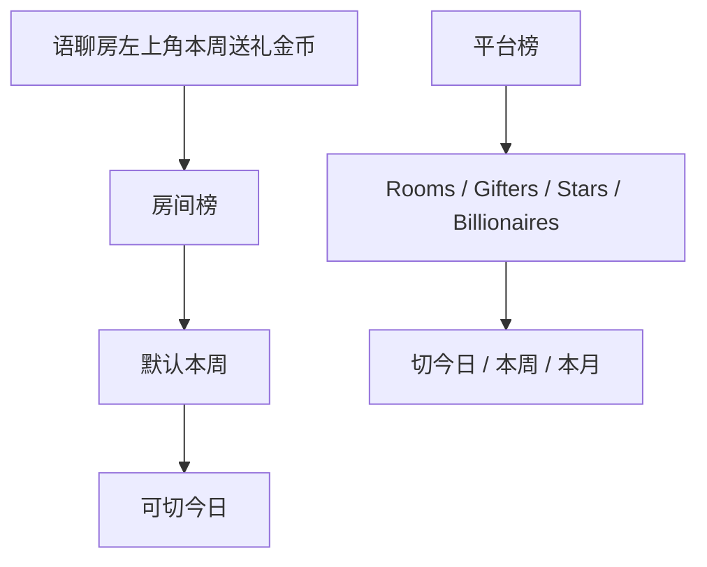

# 排行榜 · 现行说明

> 派生阅读层。改规则仍改 [`../PRD.md`](../PRD.md)。基于已收录主线 **V1.4.0**。拍板 RQ-02、RQ-21、RQ-17、RQ-01。

## 元信息
<!-- chunk:no -->

| 字段 | 值 |
|---|---|
| 功能 ID | `ranking` |
| 截止版本 | 已收录 V1.4.0（模块正文来自 V1.0.0） |
| 权威 | 派生；冲突以 `PRD.md` 为准 |
| 状态 | pending-review |

---

## 范围
<!-- chunk:default section=scope id=ranking.scope -->

覆盖房间内榜单与平台榜单。只保留语聊房入口。无游戏房榜单入口。展示 VIP 标识，不展示贵族。统计为金币礼物流水，不含房间内游戏金币消耗，不含头饰卡流水。不覆盖后台字段表。

---

## 总流程
<!-- chunk:default section=flow id=ranking.flow-main -->

语聊房左上角展示本周送礼金币总数，点开默认进本周房间榜。平台榜按当前语区展示 Rooms / Gifters / Stars / Billionaires，可切今日 / 本周 / 本月。

---

## 业务逻辑

### 房间内榜 {#logic-room}
<!-- chunk:default section=logic id=ranking.logic-room -->

本周送礼数 = 房间内所有礼物流水（不含游戏金币流水），不包含房间内游戏金币消耗。今日从 0 点（GMT+3）起算；本周从本周日 0 点起算。数据更新时间显示 `hh:mm(GMT+3)`，更新频率约 5～10 分钟。列表展示排名、头像、头像框、昵称、VIP 标识、用户等级牌、本房间送礼金币数。点头像进个人主页。默认前 20 名；1～20 有多少显示多少；0 人则静态占位并隐藏收礼金币数。吸底为本人：20 名以后排名显示「-」。聊天区与成员列表卡片展示周榜前 9、日榜前 9 的排行榜标识。无贵族勋章。

### 平台榜 {#logic-platform}
<!-- chunk:default section=logic id=ranking.logic-platform -->

榜单分阿语 / 土语 / 英语；用户只看当前语区，切语区则榜单跟着切。今日 / 本周 / 本月均 GMT+3：今日 0 点、本周日 0 点、本月 1 日 0 点。本版数据统计更新固定为前一天 23:59:59（GMT+3）；页面上的数据更新时间通常为当日 0 点。原文「下版本实时」未收录，不当现行。

Rooms：时间段内房间送礼金币总数，最多前 30；不足则有多少显示多少；前 3 无人显示「虚位以待」。点前 3 头像或 3+ 名整行进该房间（不含吸底行）。吸底：自己有房且排名 ≤99 展示排名与金币；有房但 >99 或无排名则「99+」且不展示金币；未创建房间不展示吸底。

Gifters：用户送礼金币总数，字段含头像框、等级牌、VIP 标识；点行进个人资料。Stars：收礼金币，交互同送礼榜。Billionaires：充值金币排名；充值金币数 = app 充值金币数 + 代理充值金币数。排名 ≤30 展示所有人充值数；>30 或无排名则所有人充值数用 `***`。领奖台人数/房间数少于 3 则占位头像、点击无交互。右上角「?」进排行榜 H5 说明（纯文字，以翻译文档为准）。

### 数值缩写 {#logic-number}
<!-- chunk:default section=logic id=ranking.logic-number -->

小于 10,000 以「个」为单位（房间榜例 `9,999`，平台榜例 `9999`）。大于等于 10,000 且小于 1,000,000 用 K，1 位小数向下取整。大于等于 1,000,000 且小于 1,000,000,000 用 M，1 位小数向下取整。大于等于 1,000,000,000 显示 `999+M`。

---

## 客户端页面

### 房间榜入口 {#page-room}
<!-- chunk:default section=page id=ranking.page-room -->

仅语聊房左上角。无游戏房专属榜单入口。默认进本周。无人送礼时列表改静态图。

### 平台榜页 {#page-platform}
<!-- chunk:default section=page id=ranking.page-platform -->

四类榜 + 今日/本周/本月切换 + 吸底本人行 + H5 说明。前 3 名无人或少于 3 用占位。

---

## 后台影响
<!-- chunk:default section=admin id=ranking.admin-impact -->

排行榜分类与列表字段以后台为准，本文不复制字段。跳转 [`../../admin/PRD.md#admin-stats-ranking`](../../admin/PRD.md#admin-stats-ranking)。

---

## 关联影响

### 关联 · 运营后台 {#related-admin}
<!-- chunk:related-row section=related id=ranking.related-admin target=admin -->

排行榜后台分类与列表。跳转 [`../../admin/brief/current.md#admin-stats-ranking`](../../admin/brief/current.md#admin-stats-ranking)。

### 关联 · 房间 {#related-room}
<!-- chunk:related-row section=related id=ranking.related-room target=room -->

入口只在语聊房。跳转 [`../../room/brief/current.md`](../../room/brief/current.md)。

### 关联 · VIP {#related-vip}
<!-- chunk:related-row section=related id=ranking.related-vip target=vip -->

榜单身份标识为 VIP，不是贵族。跳转 [`../../vip/brief/current.md`](../../vip/brief/current.md)。

### 关联 · 用户等级 {#related-user-level}
<!-- chunk:related-row section=related id=ranking.related-user-level target=user-level -->

房间榜与平台送礼/收礼榜展示用户等级牌。跳转 [`../../user-level/brief/current.md`](../../user-level/brief/current.md)。

---

## 相对变化
<!-- chunk:changelog section=changelog id=ranking.changelog -->

相对原文：贵族勋章改 VIP；去掉游戏房榜单入口；统计不含房间内游戏金币消耗、不含头饰卡流水；币种为金币，不写钻石。

---

## 原文
<!-- chunk:no -->

[`../PRD.md`](../PRD.md) · [`../changelog.md`](../changelog.md) · [`../history/`](../history/)

---

## 计划预览
<!-- chunk:no -->

V1.5.0 工作区不是现行。原文「下版本实时数据」未升格，不写入现行规则。本功能 changelog 无已收录之后的版本计划进入本文。

---

## 待校对
<!-- chunk:no -->

房间榜更新约 5～10 分钟，平台榜统计时点为前一天 23:59:59（GMT+3），两套刷新口径并存。房间榜与平台榜「个」位千分位写法原文不一致。
