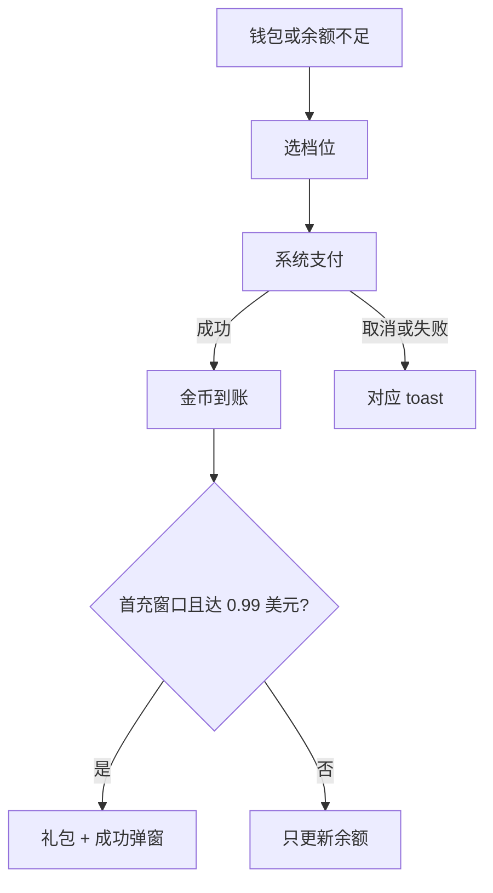

# 金币充值 · 现行说明

> 派生阅读层。改规则仍改 [`../PRD.md`](../PRD.md)。基于已收录主线 **V1.4.0**。拍板 RQ-01、RQ-16。

## 元信息
<!-- chunk:no -->

| 字段 | 值 |
|---|---|
| 功能 ID | `recharge` |
| 截止版本 | 已收录 V1.4.0（模块正文来自 V1.0.0） |
| 权威 | 派生；冲突以 `PRD.md` 为准 |
| 状态 | pending-review |

---

## 范围
<!-- chunk:default section=scope id=recharge.scope -->

覆盖 App 钱包金币充值、快捷充值、货币变动记录、首充得礼。钱包只有金币（付费，可交易 / 不可交易）和宝石（免费）。充值币不是独立钱包（金币来源标签）。无钻石、游戏币充值路径，无钻石兑换页。用户侧从 IAP / 币商转入的金币为不可交易。「还差 XXX 金币」非现行，弹窗不展示、服务端不返回。IAP 档位表原文殊缺 → `needs-input`。后台加减币 / 补单不在本文复制。

---

## 总流程
<!-- chunk:default section=flow id=recharge.flow-main -->

从 Me-钱包选档位走系统支付；房间 / 私聊送礼或商城购买金币不足时出快捷充值（不展示还差金币）。成功则金币实时到账；落在首充窗口内且单次达 0.99 美元则发礼包。代理充值、链接支付不算首充。

---

## 业务逻辑

### 钱包与档位 {#logic-wallet}
<!-- chunk:default section=logic id=recharge.logic-wallet -->

金币用于送礼、买商品、订阅等。用户收到金币礼物后无收益，平台礼物抽成 100%。充值页展示当前可用金币完整数量。档位支持安卓 / iOS、推广渠道区分配置；档位表 `needs-input`，不编造。价格单位按苹果 / 谷歌返回的本地货币展示（如 SAR 3.99）。无钻石、游戏币 tab，无对应流水。

### 余额不足与取消 {#logic-quick}
<!-- chunk:default section=logic id=recharge.logic-quick -->

礼物面板点金币图标或余额、房间 / 私聊送金币礼物不足、商城买金币商品不足：出快捷充值。展示赠送金币数；实际到账 = 档位金币 + 赠送金币（赠送服务端可配）。可配热门档「推荐」，默认选中档位 1。金币不足标题为「当前金币不足」。**不展示「还差 XXX 金币」**。充值完成后回到原礼物面板 / 商城并保持选中项。点商城或私聊金币余额（含「>」）进钱包-金币，返回保留原操作。宝石礼物不足：确认按钮「获得宝石」，进我的-钱包-宝石。取消第三方支付 toast「您已取消支付」，展示 2 秒。其他支付失败改为 toast（iOS / 安卓原文键值见 PRD）。

### 首充 {#logic-first}
<!-- chunk:default section=logic id=recharge.logic-first -->

首次单次充值达到 0.99 美元可获礼包。窗口：注册起 72 小时（服务端可配）。超时未首充或窗口内已首充则入口 / 字样 / 礼包消失。房间内「首充得礼」须在房间送礼引导消失后才显示。可配发背景、座驾、礼物、宝石、头像框等现行商品；**不发头饰卡、游戏币、钻石**。具体 SKU `needs-input`。成功后背景 / 座驾 / 礼物进背包，房间背包同步礼物，自动佩戴座驾。代理充值不算首充。成功弹窗场景含房间跳转商城 / Wallet / 私聊 / 快捷充值 / 首充礼包，以及房间外 wallet / 私聊 / 商城。

---

## 客户端页面

### 金币充值与流水 {#page-wallet}
<!-- chunk:default section=page id=recharge.page-wallet -->

入口：我的-钱包。点档位价格出系统付款弹窗，过程中加载。成功 toast「充值成功」并刷新金币；失败 toast「支付失败，请重试」。右上角 Detail / 明细进流水并定位金币 tab。底部「联系客服」进反馈。流水含金币与宝石，无钻石。金币类目：购买金币、签到奖励、领取房间奖励、房间奖励-系统领取、商店消费、官方赠送、官方扣除。宝石类目：任务奖励、新人礼包、首充礼包、活动奖励。收入「+」支出「-」。近 30 天，每页 20，可下拉刷新；点 tab 或左右滑切换。宝石余额页明细定位宝石 tab。

### 快捷充值 {#page-quick}
<!-- chunk:default section=page id=recharge.page-quick -->

半屏弹窗。点关闭或蒙层关闭。房间送礼不足关闭后停留礼物面板。私聊 / 商城逻辑同房间。房间消费余额不足另有原型图，细则未单独成文，交互按本快捷弹窗。充值页与快捷弹窗均展示赠送金币与推荐标。

### 首充入口与弹窗 {#page-first}
<!-- chunk:default section=page id=recharge.page-first -->

房间：礼物图标下「首充得礼」；宝石余额右侧跳动「首充得礼」图标，点击出首充弹窗。弹窗：倒计时到秒、充值可得金币文案、0.99 美元（按语区货币）、礼包区（图标顺序背景 → 礼物 → 新人座驾，服务端可配）、立即充值调支付、叉号关闭。支付弹窗上方同步礼品包。房间外：Party 与签到图标轮播；Me-Wallet 下方「首充有礼」；Wallet 金币下方礼包。成功弹窗：「知道啦」关闭；房间外可「去看看」定位商城背包。

---

## 后台影响
<!-- chunk:default section=admin id=recharge.admin-impact -->

加减币 / 补单见 [`../../admin/PRD.md#admin-currency`](../../admin/PRD.md#admin-currency)。补单系统消息见 [`../../admin/PRD.md#admin-recharge-msg`](../../admin/PRD.md#admin-recharge-msg)。档位、赠送金币、推荐档、首充开关与奖励以后台 / 服务端配置为准，本文不抄字段表。

---

## 关联影响

### 关联 · 运营后台 {#related-admin}
<!-- chunk:related-row section=related id=recharge.related-admin target=admin -->

货币管理 / 补单、补单系统消息。跳转 [`../../admin/brief/current.md#admin-currency`](../../admin/brief/current.md#admin-currency)、[`../../admin/brief/current.md#admin-recharge-msg`](../../admin/brief/current.md#admin-recharge-msg)。

### 关联 · 币商 {#related-merchant}
<!-- chunk:related-row section=related id=recharge.related-merchant target=merchant -->

充值页 / 快捷弹窗可展示代理充值入口；代理转入不算首充。跳转 [`../../merchant/brief/current.md`](../../merchant/brief/current.md)。

### 关联 · 商城 {#related-mall}
<!-- chunk:related-row section=related id=recharge.related-mall target=mall -->

商城金币不足走本快捷充值；首充座驾 / 背景 / 头像框按商城背包规则。跳转 [`../../mall/brief/current.md`](../../mall/brief/current.md)。

---

## 相对变化
<!-- chunk:changelog section=changelog id=recharge.changelog -->

相对原文：钻石 / 游戏币充值与兑换删除；充值币改为金币来源标签；「还差 XXX 金币」非现行。

---

## 原文
<!-- chunk:no -->

[`../PRD.md`](../PRD.md) · [`../changelog.md`](../changelog.md) · [`../history/`](../history/)

---

## 计划预览
<!-- chunk:no -->

V1.5.0 工作区不是现行。「还差 XXX 金币」已确认非现行；若后续 V1.5.0 升格再收入，不作为本文现行。

---

## 待校对
<!-- chunk:no -->

- IAP 档位表原文殊缺，`needs-input`。
- 首充奖励具体 SKU `needs-input`（原文示例含 1020 金币等，不当已确认档位）。
- 「房间消费余额不足」仅有标题与图，无独立字段说明。
