# 拉新 — V1.0.0 原文切片

> 状态：`history`（非权威） · 来源见正文

## 3.4 第四部分：个人拉新（丛国序）

3.4 第四部分：个人拉新（丛国序）

3.4.1 个人拉新 – 入口和规则说明

| 功能名称 | 个人拉新入口和规则说明 |
|---|---|
| 优先级 | 高 |
| 功能描述 | 入口规则 |
| 输入/前置条件 | H5页面 |
| 交互原型 | 「图1」                              「图2」 |
| 字段描述 | 「图1」个人分享入口：入口会根据后台配置的开关展示或隐藏，不受审核状态影响； 普通玩家：不在团队、以及不是团长的玩家； 团长：后台加入了邀请团队权限的玩家，在被标记为团长前或删除团长后，为普通玩家； 团员：加入邀请团队的玩家，加入邀请团队前或退出邀请团队后，为普通玩家； 「图2」个人邀请页面的活动说明： 2.1 点击弹出个人分享邀请的弹窗； |
| 需求描述 | / |
| 补充说明 | / |

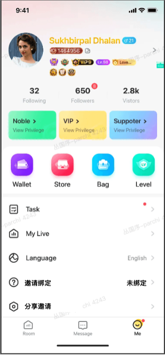

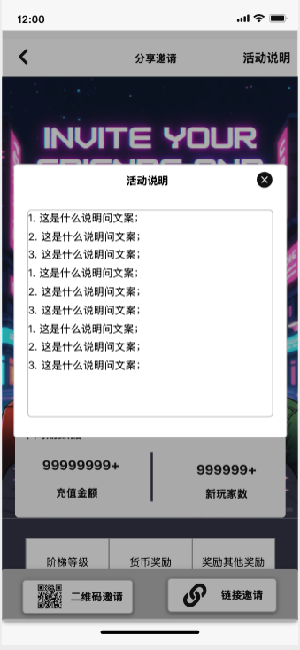

3.4.2 个人拉新 – 未开通

| 功能名称 | 个人拉新未开启展示 |
|---|---|
| 优先级 | 高 |
| 功能描述 | 未开启状态 |
| 输入/前置条件 | 用户没有开启拉新 |
| 交互原型 | 「图1」                     「图2」 |
| 字段描述 | 玩家不会自动开启邀请新用户玩法，开启有以下几种种方式：默认用户没有开启个人拉新状态； 一个是玩家从分享页面进入后，点击我要参与如「图1」刷新页面状态，然后开通邀请业务； 另一种是用户在没有开启的状态下，通过后台添加到个人拉新数据管理中，然后自动开通，用户再次进入页面，刷新状态； 后台将用户添加设置为团长（任意一种类型的团长），然后自动开通，用户再次进入页面，刷新状态； 用户没有账号，通过团长分享，二维码或链接下载注册加入团队，自动开通（特殊说明：被邀请加入团队的新用户，也会绑定在团长的新用户绑定关系下，即被统计充值和拉新人头）； 用户已经下载app，通过团长在平台内邀请成为团员的，自动开通； |
| 需求描述 | 当前对于已经开通的，不会撤销开通，但是可以后台将用户设置为“停用”； 针对停用的状态，用户不可在页面进行任何操作 分享保存链接二维码、领取奖励； 不可加入团队，具体到“团队邀请”逻辑功能处进行描述； 但是对于已经产生关系的数据可以正常统计在内，保存的链接和二维码依旧有效； 未开通状态下，不展示个人的数据信息 如果有拉新和充值周期配置，则只展示这两个模块，如「图2」； 如果没有配置，那么则只有空页面，通常不会出现这个问题； 拉新当前数据按照0显示，充值档位按照所在最低展示； 该吸底栏底部相对页面静止，点击我要参与激活拉新，变更为二维码和链接入口； |
| 补充说明 | / |

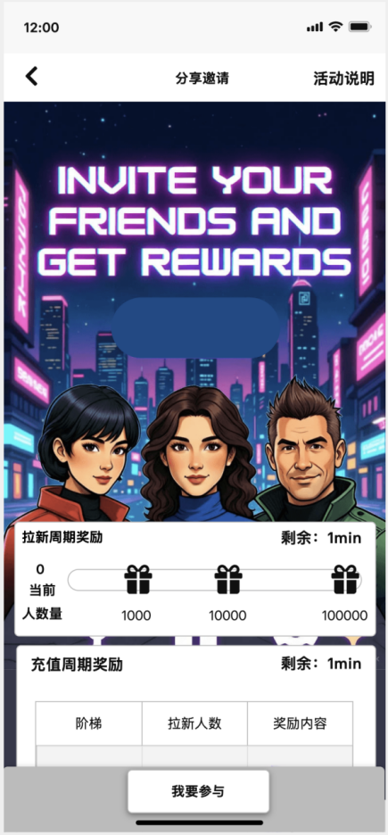

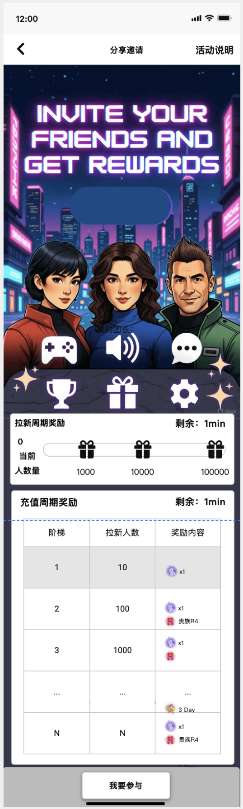

3.4.3 1.个人拉新 – 团员团长页面

| 功能名称 | 团队团长页面拉新和数据 |
|---|---|
| 优先级 | 高 |
| 功能描述 | 数据和分享入口 |
| 输入/前置条件 | 身份设定，已开通 |
| 交互原型 | 「图1」 「图2」                       「图3」 「图4」 |
| 字段描述 | 周期数据：充值金额 充值活动周期：由后台配置，以被拉来（有绑定关系）玩家充值的金币作为分阶梯的标准（包括充值币的充值和币商币的充值），在周期结束后，按照实际到达的标准进行奖励发放结算； 正在进行中的周期、阶梯等级，货币奖励百分比，不可变更和删除，但是可以提前结束； 周期时间：新增配置时间，开启最早为T+1（服务器时间为准）； 充值阶梯等级：充值模块以被拉用户在周期内购买金币数量为准，包括购买币商币、应用市场购买充值币和YallaPay购买充值币（后统一叫做充值币）； 提前结束：正在进行中的周期提前结束为后台控制，同时可以选择是否对提前结束的周期进行结算，如果结算，则根据周期配置进行结算，如果不结算，则直接结束，结束后不可再恢复； 阶梯奖励： 为后台配置，每一个阶梯都会配置对应奖励； 奖励为在周期结束后，用户按照对应的阶梯按照阶梯奖励进行计算和发放； 由于业务特性，正在进行的周期奖励可以进行变更，会影响到页面的展示，但业务层通常不会这么做； 该模块显示开始和结束周期：dd/MM – dd/MM； 货币数值： 在活动周期内，拉来的用户充值的货币数量，如果没没充值参考「图4」显示“/”， 如果当前没有进行的活动周期：不展示时间，数量“/” 如果有充值，则按照金币icon+金币数量显示，正整数，超过最大值99999999显示99999999+； 当前展示数量不考虑玩家退款； 周期充值金额统计方式： 从来来的用户绑定那一刻开始计算往后总计30个自然日（T+29）内； 充值的日期只要在统计周期周期内； 充值的币商币（从币商那购买），充值币（从应用市场充值，YallaPay充值）都计算在内； 这些可以被统计的条件的货币总和； 当前只计算这两类货币，其余充值等行为都不计算在内； 举例：A拉来绑定用户a，时间为1.15日，活动统计周期为2.10-2.20日，用户2.9日充值100货币，2.10日充值1000，2.18日充值2000，那么在活动周期，只计算1000；，因为1.9日充值不在活动周期，1.18日的充值超过30个自然日（12月31日修正描述时间） ； 周期数据：新玩家数量 新玩家数量：由后台配置，以被拉来玩家数量作为分阶梯的标准，在周期进行中，按照实际到达的标准进行奖励发放/领取结算； 正在进行中的周期、阶梯等级，不可变更和删除，但是可以提前结束； 周期时间：新增配置时间，开启最早为T+1（服务器时间为准）； 人数阶梯等级：人数模块以被拉用户数量为准； 提前结束：正在进行中的周期提前结束为后台控制，由于人数奖励为用户即刻领取，在后台确认提前结束后，则直接结束，结束后不可再恢复； 阶梯奖励： 为后台配置，每一个阶梯都会配置对应奖励； 奖励为在周期内完成人数后，即刻领取当前阶梯的奖励； 由于业务特性，正在进行的周期奖励可以进行变更，会影响到页面的展示，但业务层通常不会这么做 显示开始和结束周期：dd/MM – dd/MM； 玩家数量： 在活动周期内，拉来的新用户数量，如果没没充值参考「图4」显示“/”， 如果当前没有进行的活动周期：不展示时间，数量“/”； 如果新用户，则按数量显示，正整数，超过最大值99999999显示99999999+； 周期玩家统计方式： 用户新注册后，绑定该用户的日期，只要在统计周期周期内； 一个新注册玩家48小时内，可以绑定唯一个邀请者，且不可在用户端变更； 由于注册限制，一个设备最多10个账号，为防刷，新账号设备最多在新用户绑定业务中，可以绑定10次，超过即使通过链接二维码和用户端补绑，则都不回自动绑定邀请者； 举例：X设备注册了10个新账号，都绑定过邀请者，如果通过某种手段注册了第11个账号，那么即使邀请，也不会再用户端自动绑定某一个用户； 但是后台可以进行特定条件下的绑定，后台绑定的用户，按照绑定时间计算，满足条件是可以被计算在内的； 时间刷新周期：5分钟左右更新一次，可商定，能高频最好； 奖励记录：点击后进入奖励记录页面，当存在可以领取（货币周期结算）的结算奖励后，会有红点提示； 团长信息： 1. 当进入页面用户为团长时：显示“我是团长”+头像+用户昵称+用户XID（外显ID）； 2. 当进入页面的用户为团员时：显示“我的团长” +头像+用户昵称+用户XID（外显ID）； 3. 如果用户退出团队，则不再展示和非团玩家相同； 当日数据： 本日充值金额： 今天自然日0点到24点的用户充值货币数量（统计标准参考上方，仅划定为今日），时间按照GMT+3进行刷新； 展示货币图，数据规则为99999999，超过99999999+，数据为空展示“/”「图4」； 点击进入榜单“个人拉新玩家充值榜单”； 不考虑玩家退款数据； 本日拉新玩家数： 今天自然日0点到24点获取的新用户数量（统计标准参考上方，仅划定为今日），时间按照GMT+3进行刷新； 数据规则为99999999，超过99999999+，数据为空展示“/”「图4」； 点击进入“拉新玩家列表详情”； 时间刷新周期：5分钟左右更新一次，可商定，能高频最好； 汇总数据： 总计充值金额： 从本玩家开通拉新功能，后开始进行统计； 展示货币图，数据规则为99999999，超过99999999+，数据为空展示“/”「图4」； 如果玩家退款，总计金额进行减少； 总计拉新玩家数： 从玩家开通拉新功能，后进行统计； 据规则为99999999，超过99999999+，数据为空展示“/”「图4」； 时间刷新周期：5分钟左右更新一次，可商定，能高频最好； 走势图：折线图 横坐标为时间：当前只有7日和30日可以进行选择； 统计时间：不包括当天，例如，前一日往前7日； 数据更新时间：非实时数据，次日一点前生成前一日数据； 下拉可选择类型： 充值走势：被拉的用户统计周期内，充值货币数量； 拉新人数：被拉新的用户数量； 付费人数：被拉的用户统计周期内，充值用户的数量； 纵坐标：根据实际选择项目进行调整，数值区间和最高值可以根据框架调整等分，折线不可超过最高数值； 折线图： 展示具体的数值； 不同的类型，用不同的颜色，参考UI； 每一次只展示一种数据； |
| 需求描述 | 底部分享栏，开通后，生成该玩家专属的分享二维码和分享链接，如上图； 该吸底栏底部相对页面静止，点击后可进入的相关模块； |
| 补充说明 |  |

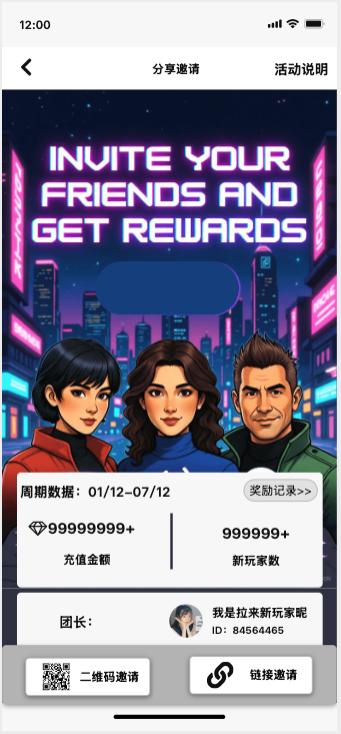

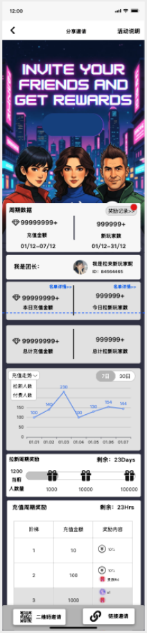

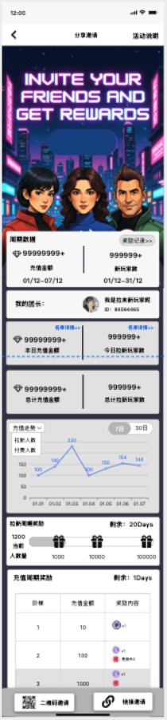

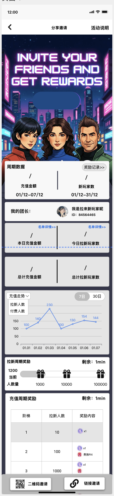

3.4.4个人拉新 – 非团玩家

| 功能名称 |  |
|---|---|
| 优先级 | 高 |
| 功能描述 | 非团玩家， |
| 输入/前置条件 | / |
| 交互原型 | 「图1」 「图2」                          「图3」 |
| 字段描述 | 展示页面结构内容信息和统计，与团队内玩家相同； 仅在团长部分，与团长和团员玩家有区别，非团玩家不展示该模块； 同理，当玩家退出团队后，回归非团队展示页面； 总结：团队玩家和非团队玩家数值计算周期、奖励，等都相同，仅为身份不同； |
| 需求描述 | / |
| 补充说明 | / |

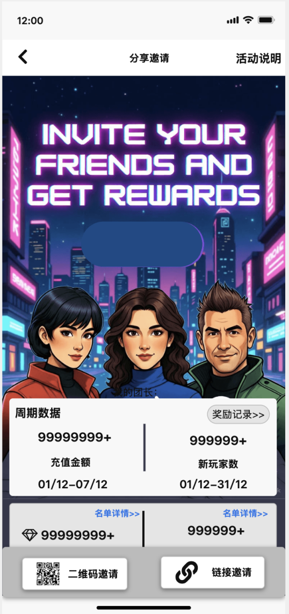

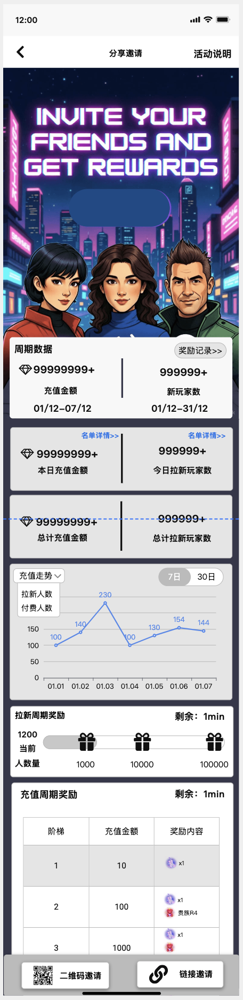

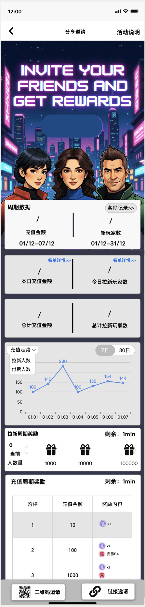

3.4.5个人拉新 – 拉新周期和领取

| 功能名称 | 拉新周期的领取 |
|---|---|
| 优先级 | 高 |
| 功能描述 | 针对拉新功能 |
| 输入/前置条件 | / |
| 交互原型 | 「图1」                 「图2」 「图3」                       「图4」 |
| 字段描述 | 拉新周期奖励模块： 模块名称：拉新周期奖励（具体参考翻译）； 当前周期任务进度拉新人数量：该用户在周期内拉新的玩家数，与上方数值显示周期相同； 如果用户没有开启拉人功能，以及没有则展示数字为“0”； 最大数字为9999，超过则展示9999+； 进度条：按照后台配置的奖励阶梯，最高的一个标准（人数）为进度条总长度； 最高一个达标任务，为进度条结尾位置，对应礼包展示在结尾； 进度条进度为=当前实际完拉新成人数/当前周期内最高任务拉新人数； 当完成人数超过最后一个达标任务后，进度条依旧为满，不会溢出； 可领取奖励的礼包：为后台阶梯配置下、达到目标人数后的奖励； 目标完成数值：人数，后台配置，正整数，不会出现重复目标数值，显示下方； 奖励内容：为后台配置，理论上平台可发放道具、货币、权益权限都为可配置内容； 礼包排序：按照任务目标阶梯的排序，从左到右，依次为低目标到高目标，最高一个达标任务，为进度条最后位置； 排序间隔，除了右侧最后一个位置留给阶梯最后一个，其余按照进度条长度等分，如果就一个阶梯，那么就只在最右侧； 不同周期可能会存在不同配置，灵活适配； 举例说明：后台配置三个阶梯，10人、200人、1000人，1000人为右侧进度条结束，剩下为10在左侧第一个，200为第二个，根据进度展示； 该模块展示逻辑： 后台显示开关控制，如果关闭，则不展示该模块； 如果后后台为空配置，则不展示该模块； 如果周期结束后，没有新的周期，则停留当前周期，直道有新周期开始； 剩余时间：按时间格式显示，和拉新周期相同，当前时间点到周期结束时间剩余时间； |
| 需求描述 | 礼包内容为后台配置，当用户在未完成任务和完成任务后，点击礼包，可以气泡展示礼包内容如「图2」； 展示方式参考UI，一排3-4个，根据实际数量调整气泡高度； 展示对应的奖励图片，数量，如果是天数类型展示天数，如果是小时，分钟类型，展示时间单位，具体参考平台通用规则； 礼包内容展示3s后自动消失，或用户点击，滑动页面都可以让气泡消失； 当用户完成任务后，达到对应标准，礼包有跳动或其他效果（具体参考UI），意为可以点击领取，如「图3」； 奖励必须在当前周期结束前领取，超过后不可领取； 先判断，当前是否满足活动周期，如果不在周期内则toast提示“当前领取未开启”； 然后判断后台领取开关是否开启，如果不可领取，则toast提示“当前领取未开启”； 最后再判断用户自身状态，是否异常（后台个人限制不可用），不可用toast提示“账号异常，无法领取，请联系客服”； 判断不分先后； 如果都满足条件，用户则点击礼包即领取发放，并且弹出恭喜弹窗，展示物品和获得对应单位，物品直接到账，如「图3」，确定关闭弹窗； 如特殊问题，物品当前逻辑中，不做回收处理； 物品领取成功后，已经领取过的礼包则展示被领取后的样式，如「图4」； 领取成功后会在奖励记录中生成领取记录，具体参考相关模块内容； |
| 补充说明 | / |

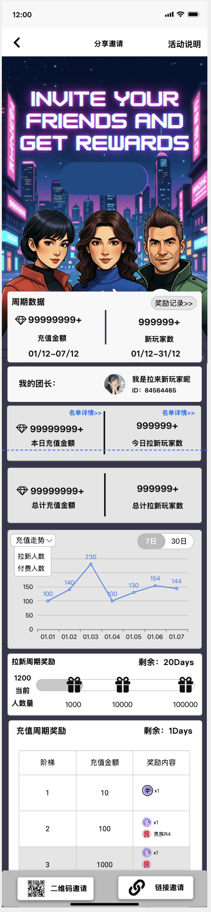

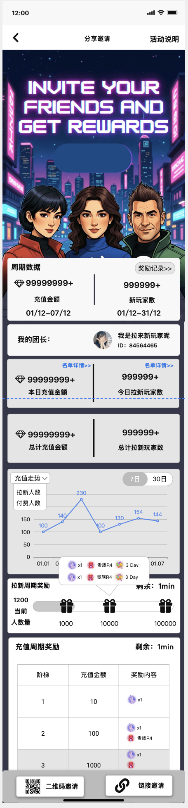

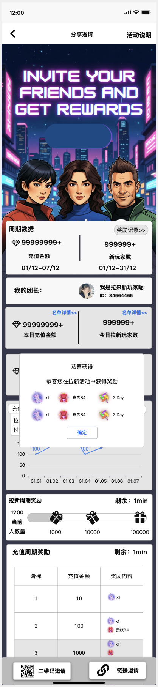

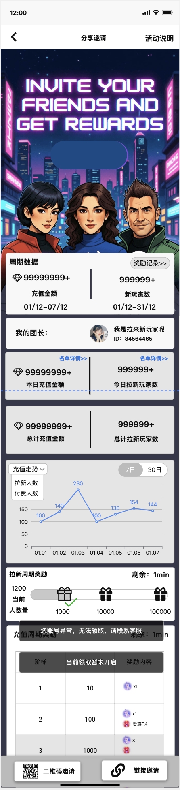

3.4.6个人拉新 – 充值周期

| 功能名称 | 周期充值奖励 |
|---|---|
| 优先级 | 高 |
| 功能描述 | 周期的充值奖励 |
| 输入/前置条件 | / |
| 交互原型 | 「图1」 |
| 字段描述 | 充值周期奖励模块： 展示模块名称：充值周期奖励（具体参考翻译）； 剩余时间：按时间格式显示，和拉新周期相同，当前时间点到周期结束时间剩余时间 阶梯：后台设置，根据后台配置充值达标档位，升序排列，最低的为阶梯1，展示在上面； 充值金额：为配置的充值达标档位，显示后台配置的数字，为达标标准； 奖励内容；为后台配置，展示对应图片，和相关单位，如包含奖励金币（充值币），则展示百分比，百分比为后台配置，具体发放哪个类型，为配置； 个人拉新为奖充值币； 展示格子根据配置内容进行拉长； 到达档位：根据用户在周期内拉到的充值统计金币金额，展示用户当前所在档位，如图，具体表现效果参考UI； 如果用户没有开通，则不展示到达档位； 举例：后台配置充值金额A为100奖励充值币10%，奖励配置的金币，B为200奖励充值币20%，那么当前档位为0-100，和101-200；以此类推 继续举例：算时拉到充值金额为90，那么结算按照A阶梯，90*10%=9进行结算； 异常等问题参奖励记录中的领取部分； |
| 需求描述 | / |
| 补充说明 | / |

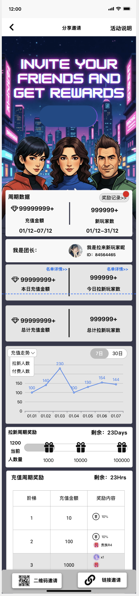

3.4.7个人拉新 – 奖励记录和领取

| 功能名称 |  |
|---|---|
| 优先级 | 高 |
| 功能描述 |  |
| 输入/前置条件 | / |
| 交互原型 | 「图1」                           「图2」 「图3」                             「图4」 |
| 字段描述 | 「图1」:页面信息 展示拉新用户周期周期的领奖记录和充值周期记录以及领取，如「图1」； 显示开始和结束周期：dd/MM – dd/MM； 显示周期类型：拉新周期奖励、拉新充值周期奖励（具体参考翻译，可能过长调整）； 获得的物品展示： 实际发放的充值币数量，最大99999999超过99999999+，都用相同icon； 其余奖励展示奖励图片，相关单位天/时间/分钟等； 上述可能只有单一类型存在，如果没有相关类型，则只展示单一类型；如「图1」； 下方奖励，超过一排，横向滑动（12月31日修改） 备注：为何后台对订单进行备注保存，当前由于拉新奖励为领取，无后台订单处理，所以只用在“拉新充值奖励”订单； 扣除订单退款：“拉新充值奖励”周期在结算时，需过滤之前相关绑定用户是否产生退款行为，如果产生退款，则需要展示统计到的之前的退款金额，如「图1」； 特殊情况：无状态，为拉充值订单在周期统计后，拉到金额为0的时候展示，不展示货币和奖励信息，展示“当前周期无贡献”，如果存在退款记录导致拉到金额为0，则按照上述条件，展示“扣除订单退款”信息；该类型不可领取奖励； 订单状态： 审核中：当前业务针对“拉新充值奖励”上个周期结束，在手动结算时，订单后台没有处理的时候的状态； 可领取：当前业务针对“拉新充值奖励”上个周期结束，自动或手动结算通过时，玩家可以领取的状态； 驳回，联系客服：当前业务针对“拉新充值奖励”上个周期结束，手动结算未通过时，玩家不可以领取的状态，通过点击右上角按钮联系客服（1.15修正不可领取文案）； 已领取：拉新周期奖励、拉新充值周期奖励，领取后的展示； 无贡献：仅为拉充值订单在周期统计后，拉到金额为0的时候展示； 订单排序规则 页面默认展示全部订单； 最多展示180天内的500条记录； 一页20条，上滑加载后续订单； 优先按照订单状态，从上到下先后：可领取、审核中、已领取、驳回、无贡献； 然后按照周期结束时间进行倒叙，最近结束的展示在上面； 相同时间按照充值奖励在前，拉新在后； 「图2」筛选 页面默认为展示全部，横向按照全部、可领取、审核中、已领取、驳回、无贡献排序tab单选，(12月31日修改交互逻辑) 根据订单状态点后，下方弹出筛选，全部、可领取、审核中，已领取，驳回，无贡献； 点击内容则过滤出订单； 其他操作关闭弹窗； 退出页面重制筛选，并刷新页面； 「图3」领取弹窗 当用户领取，并完成发放时弹出该弹窗，物品为直接到账； 从上到下分别为有货币和物品； 仅有物品； 仅有货币； 展示对应icon或图片，以及相关的获得的单位，数量/天/小时/分钟等； 点击确定关闭弹窗，并刷新页面； 多个物品，排序规则为从左到右，从上到下；4个及以下为一排，5-8个为另一排，居中显示（1月20日新增描述）； 「图4」数据为空提示页面如图，文案提示“无更多数据” 个人拉新充值结算方式： 基础统计方式：为本周期后拉新统计到的充值金币数（包括充值币和币商币）为基准，达到对应的等级；然后按照对应的等级按照金额的百分比作为奖励，获得充值币； 额外扣除： 2.1 汇总当前周期拉新充值金额的时候扣除掉往期退款金额，然后根据所在等级进行结算； 2.2如果本期不够扣除，则在下个周期继续追溯，直道全部追溯； 2.3 这种扣除后再在发放的方式，会产生金额偏差，是可以接受的； 2.4举例1：用户在上一个周期，达到20%进行结算，但是当前周期扣除后依旧为10%的周期，20%发放的多，10%发的少，这个偏差是可以接受的； 2.5 举例2：用户本周期A拉充值200，往周期退款300，则本周期按照0计算，剩余100延后到下一个周期B继续追溯扣除； 例如：玩家在当前周期内拉新为2000金币，达到要求B档位20%标准，那么用户可以获得400个金币（充值币）； 如果用户当前周期拉到的为0，结算则展示一个“无状态”的订单； 如果有额外奖励配置为物品+数量（根据物品属性决定单位，有天数，小时等，）统一展示在结算订单上，如上「图1」； 统计节点：周期结束后就开始统计，如果时间冲突等问题，可以先把订单统一处理为“审核中”，然后延后15-60分钟后处理； 订单状态处理：后台可以调整统计后的订单处理方式，为手动和自动，根据结算时的配置状态决定，已经手动的订单，不能修改为自动，只可以手动批量处理； 手动结算：为手动调整订单当状态，状态如上面模块提到的全部状态，除了无状态； 手动状态下，订单的统计中，和统计结束后，均为“审核中”状态在C端展示； 自动结算：根据上述的统计方式，统计后自动进行用户档位和可发放奖励确认为通过； 自动结算也可以理解为自动批量处理为通过； 无状态订单直接自动处理为“无状态”不参与手动处理，也不可发放奖励； 领取说明：无论配置什么奖励，但是当前周期，用户在结算时，拉到金额不能为0，否则无发领取奖励，（避免在阶梯1状态下获得其他非货币配置奖励）； 领取成功出弹窗，直接发放到对应钱包和位置； |
| 需求描述 | / |
| 补充说明 |  |

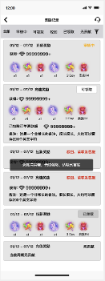

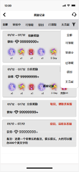

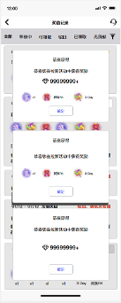

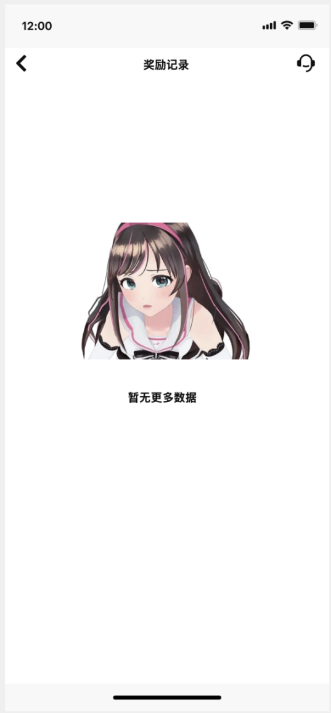

3.4.8个人拉新 – 拉充值数据榜单

| 功能名称 | 拉新充值榜单 |
|---|---|
| 优先级 | 高 |
| 功能描述 | 拉来的用户绑定的充值榜单 |
| 输入/前置条件 | / |
| 交互原型 | 「图1」                            「图2」 「图3」                       「图4」 |
| 字段描述 | 玩家充值榜单：统计时间内，满足统计条件的，只有本玩家拉来的绑定新玩家充值玩家充值金币（充值币+币商币）数量榜单； 统计时间区间： 一日：当前自然日的拉新充值，跨日统计，在新自然日数据统计结束之前，展示上一个自然日最后一次统计； 七日：包括上一个自然日在内的前7个自然日的数据； 三十日：包括上一个自然日在内的前30个自然日的数据； 作为tab，可以点击切换； 统计周期： 3.1 一日：15分钟，可议，因为每个人的榜单都不同，展示dd/MM（GMT+3）HH：mm； 3.2 七日：次日0-1点内完成即可，展示dd/MM - dd/MM（GMT+3），为统计日期区间； 3.3 三十日：次日0-1点内完成即可，展示dd/MM - dd/MM（GMT+3），为统计日期区间； 统计标准和排名： 人拉新用户在绑定统计周期内的用户的充值金币数量， 排名高的高的在上，降序； 前三数字有特殊样式，突出表示，参考UI； 如果当日没有数据则参考「图4」，提示文案“无更多数据”； 展示信息： 对应玩家的排名 仅头像，用户昵称（超过UI长度则用…）,玩家XID，VIP身份（如果有）； 不展示拉新绑定玩家的金币充值数量，不展示，不展示、不展示； 支持H5页面的榜单，点击“消息icon”跳转到应用内私聊该玩家； 支持点击头像，展开应用内用户资料（可商议，支持最好）； 私聊跳转需要客户端和业务支持（拉新绑定后自动成为双方好友关系）； 榜单统一最多展示前50排名，一页最多50个，一次性完成； 页面入口为，“本日充值金额”，的排名详情； 进入默认展示“1日”、如1日为空，则展示7日，以此类推，如果都为空，默认回到1日； |
| 需求描述 | / |
| 补充说明 | / |

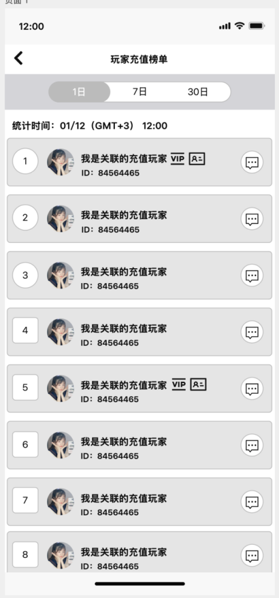

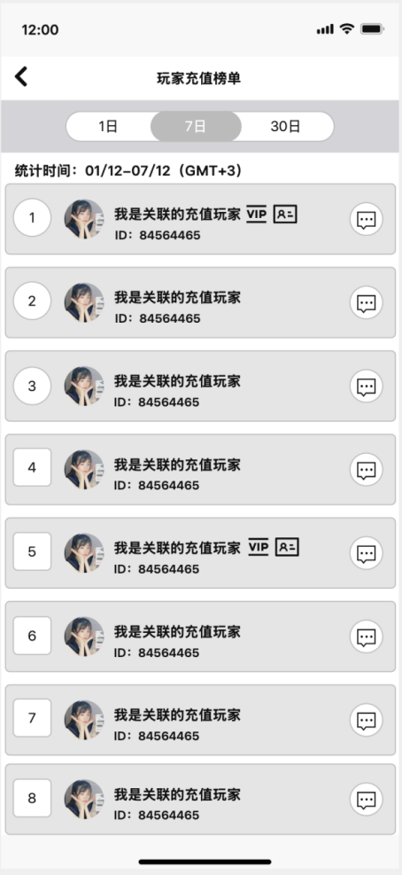

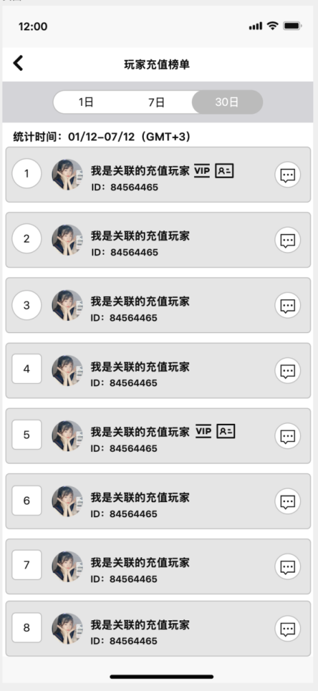

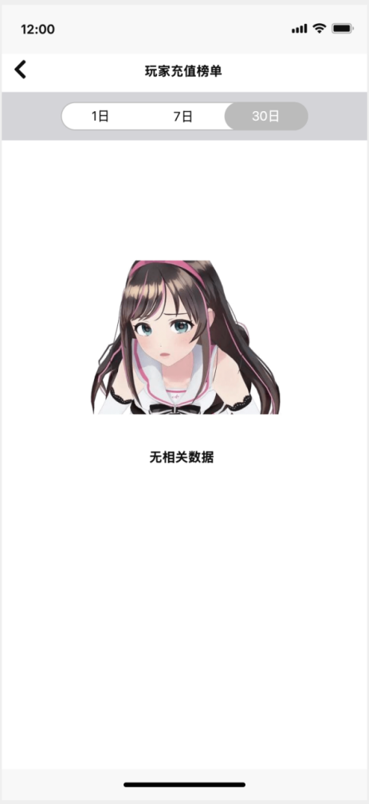

3.4.9个人拉新 – 拉新用户列表

| 功能名称 | 拉新用户列表 |
|---|---|
| 优先级 | 高 |
| 功能描述 | 展示拉来的用户 |
| 输入/前置条件 | 拉新绑定 |
| 交互原型 | 「图1」                           「图2」 「图3」 |
| 字段描述 | 拉新玩家列表：通过邀请绑定的新用户的列表信息； 列表展示从绑定开始日在内，60自然日最多500条数据（关联统计只算30天，这个有区别记住分辨）； 按照绑定时间倒叙排列； 一页50个，上滑加载（也接受一次500条都展示，具体看性能，或者第一次下载缓存，后续进入页面对比服务端更新信息，各种方案都可接受）； 展示信息包括头像、昵称（过长…展示），显示ID，绑定时间dd/MM/yyyy； 支持点击头像，展开应用内用户资料（可商议，支持最好）； 私聊跳转需要客户端和业务支持（拉新绑定后自动成为双方好友关系）； |
| 需求描述 | 支持列表用户信息用户id精确搜索，支持粘贴进ID； 输入框激活前展示提示文案“输入ID搜索”； 单击输入框激活输入框，提示信息消失，激活输入光标，输入框内容清空‘X’「图2」，并激活数字键盘，下方展示列表信息不清空； 「图2」输入框清空按钮“x”点击后清空输入框信息，并退出搜索结果； 输入ID最长限制20是个数字，空格自动清空，超过20个数字自动退格超长信息； 点击搜索进行绑定列表的精确显示ID匹配； 如有，则展示「图2」，用户显示内容与列表信息相同； 如果不存在该ID，则展示「图3」，给出滞空样式，对不起您的搜索结果不存在； |
| 补充说明 | / |

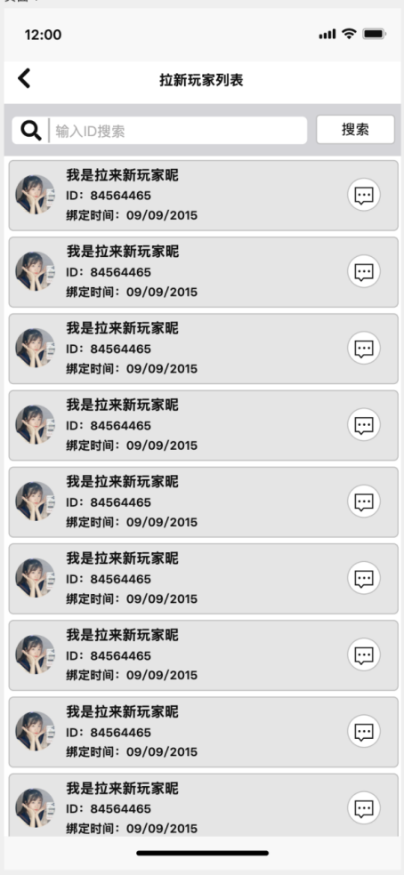

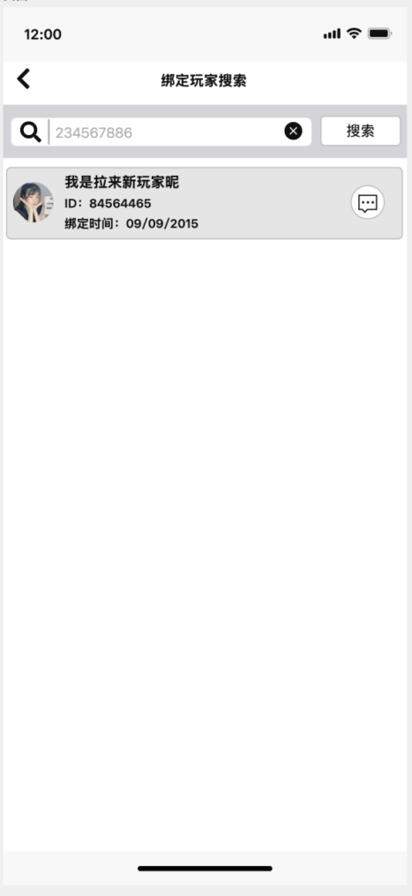

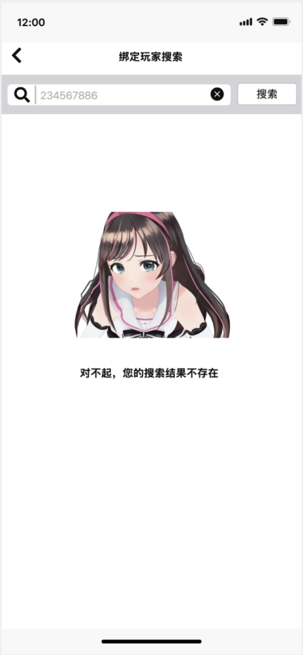

3.4.10个人拉新 – 二维码和链接拉新分享

| 功能名称 | 二维码和链接拉新 |
|---|---|
| 优先级 | 高 |
| 功能描述 | 通过分享二维码和链接获取新用户 |
| 输入/前置条件 | / |
| 交互原型 | 「图1」                           「图2」 「图3」                        「图4」 |
| 字段描述 | 二维码分享：「图1」 用户通过分享主页下吸底栏的二维码邀请进入； 图片展示信息： 2.1 邀请人的头像、头像框、VIP身份（如果有）、分享者ID； 2.2 分享邀请的图片信息元素（当前通用一个，不做定制选择），游戏、社交，偏赚钱风格； 2.3 图片的使用说明“1. 保存图片到相册”，“2. 使用软件扫描保存图片中的二维码”； 2.4 二维码：专属该用户的分享二维码； 3. 支持图片分享方式：（可以根据具体情况商议） 3.1 保存到本地：如果需要获取相册权限，弹出系统权限弹窗，弹窗和头像获取发送图片选择弹窗相同，保存成功toast提示“已保存”； 3.2 Facebook，需要支持直接分享到常规动态或帖子（也可能叫快照），当前可以二选一，常规动态最好，例如下方补充说明「图1」； 3.2 Whatsapp：跳转打开列表支持到whatsapp动态最好，补充说明「图2」； 3.3 Message：列表等分享位置，补充说明「图3」； 3.4 唤起APP需要确认弹窗如「图4」，如果有责唤起App，没有唤起对应系统应用市场； 3.4 点击取消退出页面，回到主页； 邀请链接分享：「图2」「图3」 吸顶部栏：分享着用户头像，头像框，VIP，昵称（过长缩略展示），显示ID； 中间为页面图片，可以和分享图片元素相同，偏赚钱风格； 直接唤起半屏链接弹窗（2月5日修改） 支持分享方式：（可以根据具体情况商议） 3.1 复制链接：点击后，复制到剪贴板，按钮变更为「图3」“已复制”icon也产生变更，不可点击并且无效，保持3s后，还原为原icon和可点击状态，可以循环点击； 3.2 Facebook，需要支持直接分享到常规动态或帖子（也可能叫快照），当前可以二选一，常规动态最好，例如下方补充说明「图1」； 3.2 Whatsapp：跳转打开列表支持到whatsapp动态最好，补充说明「图2」； 3.3 Message：列表等分享位置，补充说明「图3」； 3.4 唤起APP需要确认弹窗如「图4」，如果有责唤起App，没有唤起对应系统应用市场； 3.4 点击取消退出页面，回到主页； 3.5 如果分享为链接的话，为：「我是分享玩家名」+打开链接+「这里是该分享用户分享用的专属链接」+我在这里等你，与Samer一起动手收获快乐！；（具体文案参考翻译） |
| 需求描述 | / |
| 补充说明 | 「图1」                 「图2」               「图3」 |

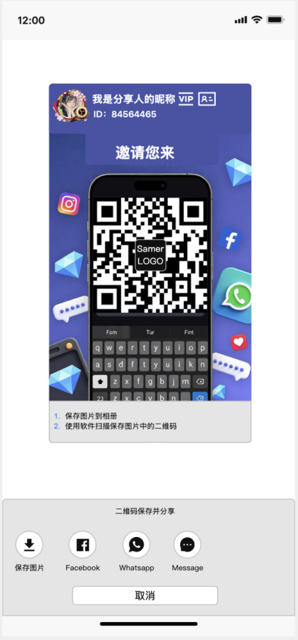

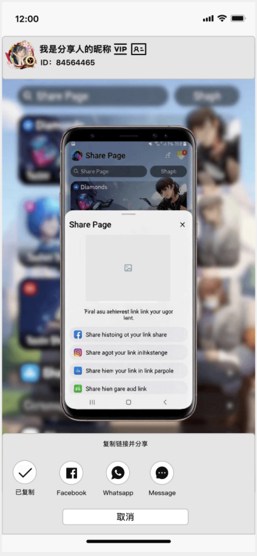

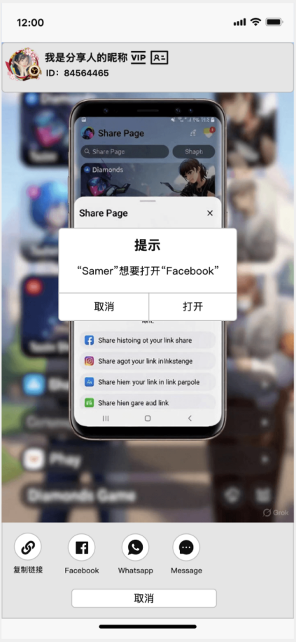

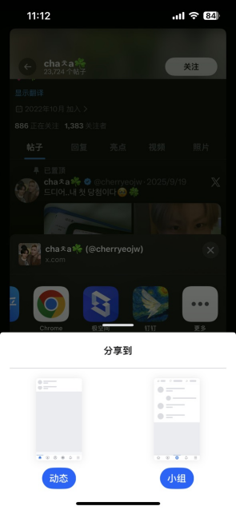

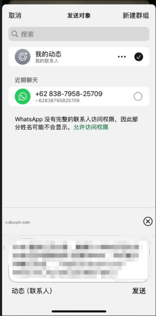

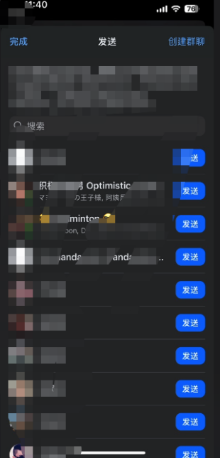

3.4.11被邀请者 – 链接或二维码打开内容

| 功能名称 | 被邀请者的内容 |
|---|---|
| 优先级 | 高 |
| 功能描述 | 通过二维码下载或注册 |
| 输入/前置条件 | / |
| 交互原型 | 「图1」 |
| 字段描述 | 新用户通过扫描二维码或分享链接，不再打开中间页面（12.31日调整） ； 吸顶栏：app 图标，打开按钮； 页面信息：主要为应用内游戏元素，社交元素，礼物元素为主，也可参考应用市场图 吸底栏：分享者头像，昵称，显示ID，VIP信息，固定文案“邀请您来”，打开app按钮； 顶部和底部打开按钮功能相同，点击后判断该手机是否有安装app； 如果有安装app，则直接唤起app； 如果没有，则根据用户手机系统判断，苹果打开应用市场定位到对应的app，安卓则定位到Google应用市场； 如果出现其他的市场，后续再补充； |
| 需求描述 | 说明： 关于绑定用户的判断，如果用户有多个不同用户的邀请，则最后一个打开到此页面下载app或打开app后注册的账号作为绑定关联； 已注册的账号，在注册后的48小时内，如果没有绑定，可以再通过链接或二维码打开app，以及手动补充绑定成为绑定关系； 绑定、补绑后，将二者自动成为好友，需要相关业务支持，不可突破好友数量上限，超过不可再自动增加好友（12月31日修改） ； |
| 补充说明 | / |

3.4.12被邀请者 – 补绑兜低逻辑

| 功能名称 | 补充绑兜低逻辑 |
|---|---|
| 优先级 | 高 |
| 功能描述 | 手动绑定关联用户 |
| 输入/前置条件 | / |
| 交互原型 | 「图1」                     「图2」 「图3」                     「图4」 「图5」                     「图6」 |
| 字段描述 | 手动补绑，用于分享链接或特殊情况状态下未能绑定成功的状态的一个遗漏补救方式； 对于绑定成功的，展示如「图2」，显示“已绑定”；点击弹出关联的绑定信息（邀请者）「图3」，头像，昵称，头像框，VIP，显示ID，固定文案，点击确定关闭弹窗； 绑定成功的状态，不可在用户端进行修改绑定； 当用户注册后，48小时内可以进行补绑，超过则不可再进行补充绑定； 3.1 超过48小时没有绑定，则入口消失； 3.2 新注册48内都可进行绑定，展示入口，显示“未绑定”，点击后进入绑定页「图4」； 4. 绑定页面可以通过输入ID精准搜索进行绑定「图4」； 4.1 支持列表用户信息用户id精确搜索，支持粘贴进ID； 4.2输入框激活前展示提示文案“输入ID搜索”； 4.3 单击输入框激活输入框，提示信息消失，激活输入光标，输入框内容清空‘X’，并激活数字键盘，下方展示列表信息不清空； 4.4输入框清空按钮“x”点击后清空输入框信息，并退出搜索结果； 4.5 输入ID最长限制20是个数字，空格自动清空，超过20个数字自动退格超长信息； 4.6 点击搜索进行绑定列表的精确显示ID匹配； 4.7 如有，则展示「图2」，用户显示内容与列表信息相同； 4.8 如果不存在该ID，以及没有开通邀请功能的话，则展示「图6」，给出滞空样式，对不起您的搜索结果不存在； 5. 搜索结果如「图5」，展示用户头像，头像框，昵称，显示ID，VIP，支持点击头像查看资料； 6. 点击绑定按钮，弹出二次确认弹窗，二次确认弹窗显示要绑定的用户信息，并且告知用户绑定后不再修改，确定则绑定，流程，取消的关闭弹窗； 7. 点击确定需要判断 7.1 当前绑定行为知否超过48小时注册时间，超过则显示toast提示“超时，不可被绑定”； 7.3 判断即将绑定的玩家，是否有后台被限制，关闭绑定，则展示“该玩家不可被绑定”； 7.4 服务端验证，本用户是否有已经帮定的玩家，如果有则toast提示“您当前有绑定玩家，不可修改“； 7.5 服务端验证，这个设备生成的账号，绑定行为，是不是已经超过10个（大于10），如果超过则toast提示“您的设备已经到绑定上限“； 8. 因功能操作问题，当前页面提供一个“联系客服“的入口，点击后跳转联系客服的功能模块； 9. 用户绑定关系因为统计为30日，因此超过后，解除绑定关系，并在客户端不再展示“已绑定”的入口，和相关信息； 10. 到期或解除绑定关系，但是设备绑已定过的数量不删减，只有增量； |
| 需求描述 | / |
| 补充说明 | / |

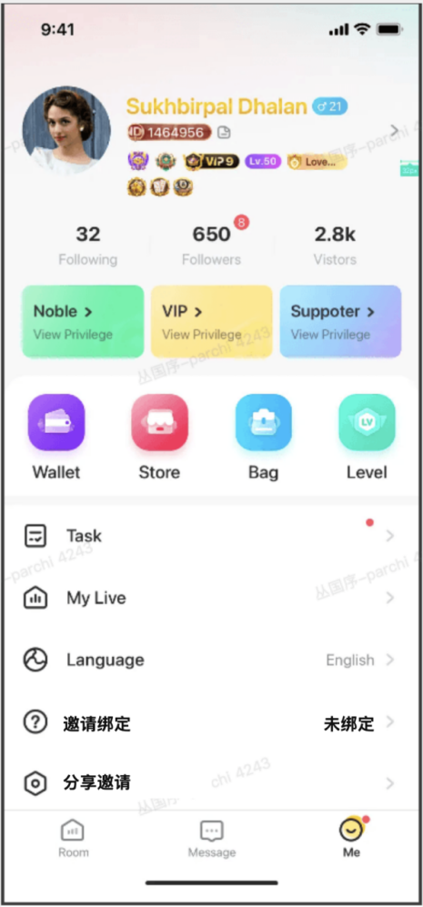

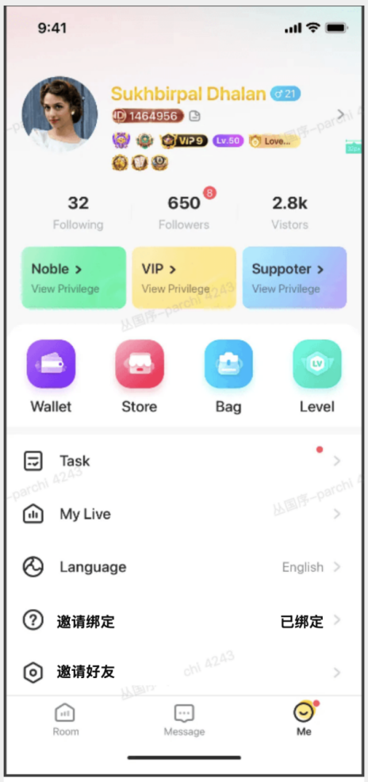

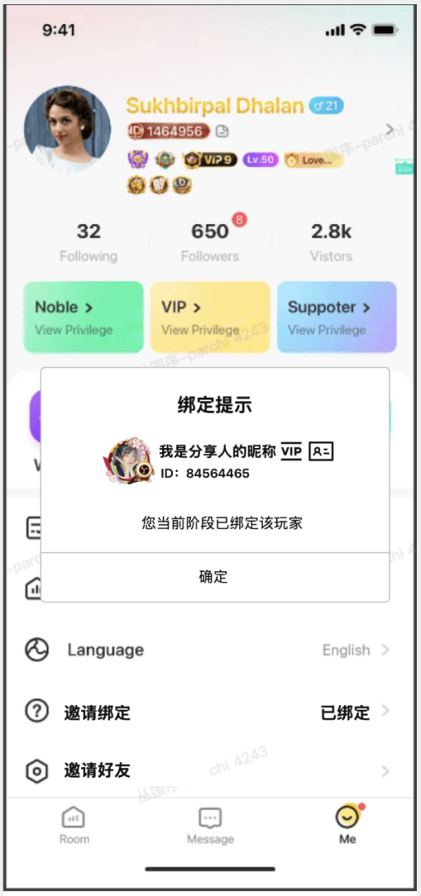

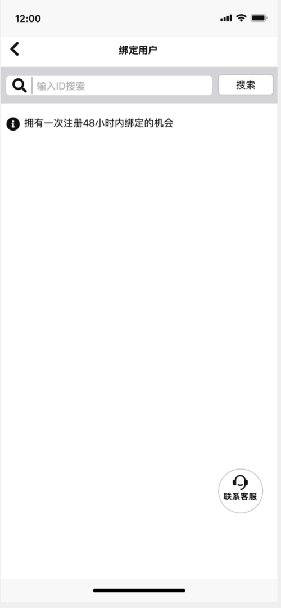

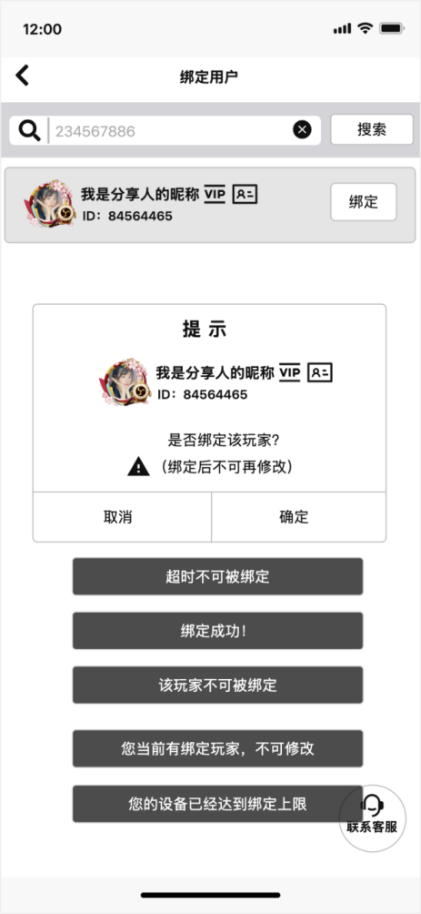

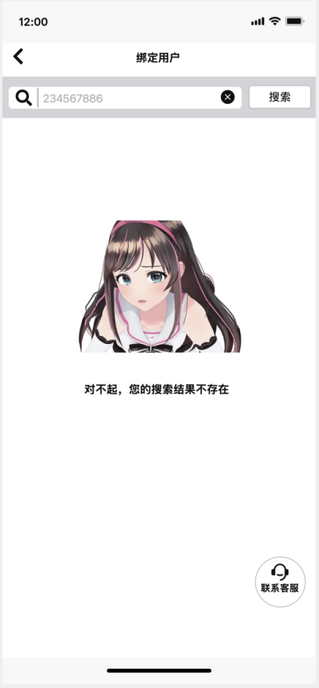

3.4.13 被邀请者 – 新手玩法

| 功能名称 | 新手玩法 |
|---|---|
| 优先级 | 高 |
| 功能描述 | 针对拉来的用户的新手玩法 |
| 输入/前置条件 | / |
| 交互原型 | 「图1」                         「图2」 「图3」                         「图4」 「图5」                        「图6」 |
| 字段描述 | 页面入口：“新手玩法”根据用户身份和逻辑判断： 通过邀请绑定来的用户可见，通过链接注册或补绑后可见； 金币任务和活跃任务时间都为（T+7），（T+8）天绑定有效期内可见入口，超过时间入口隐藏，奖励领取超过（T+8）天不可领取；任务统计结束后，多给一天停留时长可领取奖励（3月13日修改活动时间）； 剩余时间：参考下面时间规则：为时间完成的周期； 充值货币：从注册绑定（改成绑定：2月2日修改）开始到现在总计充值的货币数量，包括币商币+充值币，单位为99999999，超过则显示99999999+； 已完成任务数量：当前页面，非充值任务数量，仅为任务奖励里的人物数量，999999，超过为999999+； 推荐商人： 当邀请者，在邀请时，邀请身份为B商类型团长，及币商团员的时候，被邀请者可见； 基础信息：展示币商用户头像，昵称，显示ID，VIP身份； 关联信息：在房状态，在线状态，货币数量，总计完成订单数，支持聊天和进入房间，这个和充值部分和用户找币商列表的信息相同； 充值奖励： 排序：默认根据后台配置展示，按照数字从低到高，从上到下展示，如果存在任务“已领取”，则自动降低到最下方； 充值金额：为充值任务需要得到的金额，后台配置，包括充值币，和币商币；由于任务特殊性，充值金额的奖励，多任务是同时进行的，例如：A任务为完成10个，B认为为20个，玩家总计充值11，个A任务完成，B任务进度为11/20； 奖励内容：后台配置，奖励的货币为充值币，以及其他道具，单位包括数量/天/小时等；窗口高度根据实际内容进行适配； 操作：在没有完成的时候，展示需要达到目标时的充值货币数量，“已充值数量/目标数量”，例如“20/100”； 当完成到档位的时候，则变更为“领取“按钮，点击领取弹出领取弹窗「图5」； 弹窗内容，根据奖励配置显示不同内容如「图5」； 领取成功后刷新页面信息，对于已领取的，操作部分变更状态为“已领取“； 任务奖励： 排序：默认根据后台配置展示，按照数字从低到高，从上到下展示，如果存在任务“已领取”，则自动降低到最下方； 任务条件：后台配置，为“任务类型+任务目标：组合配置； 奖励内容：后台配置，奖励的货币为充值币，以及其他道具，单位包括数量/天/小时等；窗口高度根据实际内容进行适配； 操作：在没有完成的时候，展示需要达到目标时的进度和总量，“已经完成进度 /目标总量”，例如“20/100”； 当完成到档位的时候，则变更为“领取“按钮，点击领取弹出领取弹窗「图5」； 弹窗内容，根据奖励配置显示不同内容如「图5」； 领取成功后刷新页面信息，对于已领取的，操作部分变更状态为“已领取“； 通用规则提示： 进入页面，初始默认tab为“充值奖励”，如果“充值奖励”都完成了，则默认任务为“任务奖励”；如果两者都完成了，那么回到初始默认； 当未展示tab内存在任务有完成的状态，即可以领取状态，则展示红点，直到用户领取后取消红点展示，如「图2」； 每个人的任务为绑定成功生成时后台配置和奖励，后台进行调整，不影响当已生成在进行中的玩家的任务和奖励； 活动说明为右上角点击后弹出弹窗，如「图6」； |
| 需求描述 | / |
| 补充说明 | / |

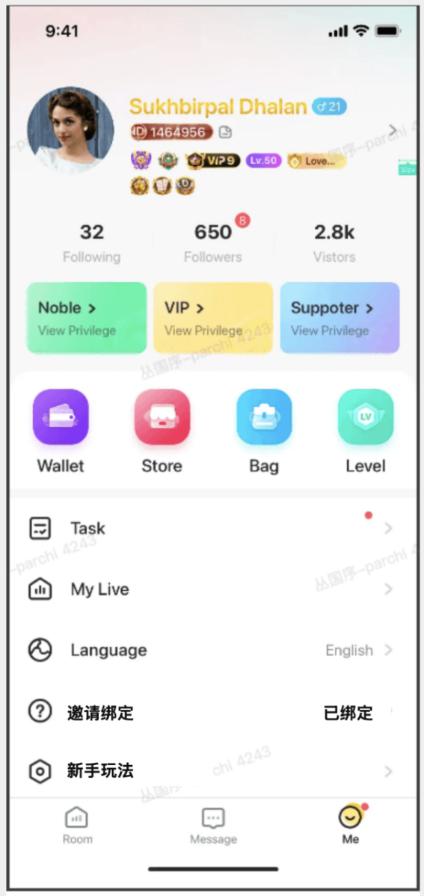

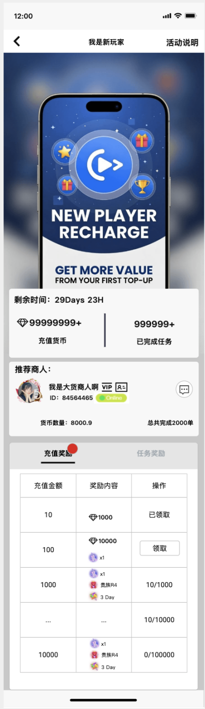

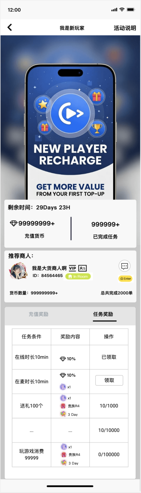

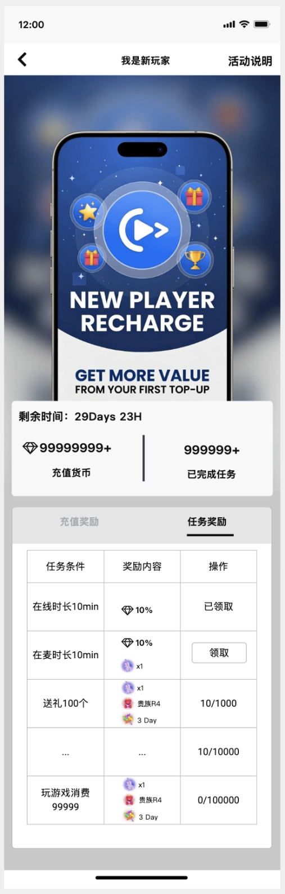

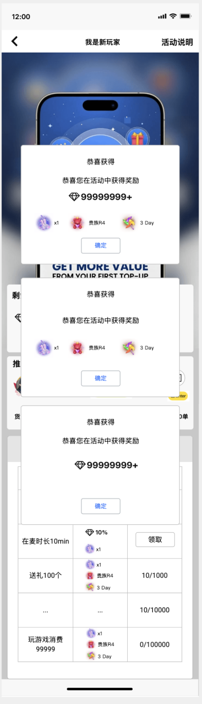

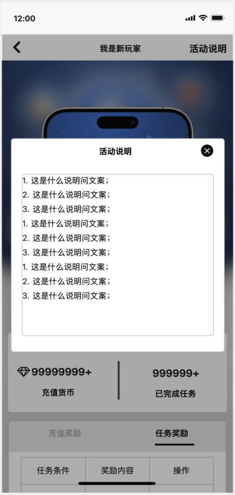

3.4.14 团队拉新 – 团队管理入口和团长身份

| 功能名称 | 团队管理入口 |
|---|---|
| 优先级 | 高 |
| 功能描述 | 团队管理入口 |
| 输入/前置条件 | 被设置为团队团长 |
| 交互原型 |  |
| 字段描述 | 团队管理入口：只有用户身份被定义为“BD团长”和“币商团长”的时候，会展示团队管理； “币商团长”和“BD团长”均为后台设置，两者身份可以互相转化，但是因为都为周期结束后结算后结算，因此按照结算时身份为准； 团长身份可以被后台删除，删除后直到当前活动周期依旧继续统计保留，直道本周期结束，下个周期不再开始统计，结束后订单直接按照“无贡献”处理； 当身份转化时，按照变化后的新日期开始统计，旧的数据不再带入； “BD和币商团长”的展示和逻辑功能基本相同，但是结算和奖励内容不同，后续团队功能描述只有在奖励结算部分单独描述，其余不在重复描述，但是配置为两套配置； 业务上活动周期配置奖励结算和发放方式，都为独立后台配置，详情参考后续； 团长管理部分为当前仅团长有，团队数据内容包括团长个人数据+团员个人数据； |
| 需求描述 | / |
| 补充说明 | / |

3.4.15 团队拉新 – 团队数据页

| 功能名称 | 团队数据页 |
|---|---|
| 优先级 | 高 |
| 功能描述 | 团队数据页 |
| 输入/前置条件 | 用户被设置为团长 |
| 交互原型 | 想·想·想· 「图1」                             「图2」 |
| 字段描述 | 当前周期可得： 团队在当前拉充值周期内，根据所有成员拉新玩家的充值金额总和，并根据这个金额当前所在的档位进行一个预期可得的判数值； 统计方式：即团队包括团长团队在内，从拉新绑定新用户那一刻开始，这个被拉来的新玩家计算到团队内，有效周期也为包括当前自然日在内的总计30个自然日（T+29），按照这个新绑定玩家的充值日，的充值货币（充值币+币商币）数量，统计到对应的周期和数量内；（和个人统计方式相同，只是扩大到团队层面）； 预计算方式=（周期统计的数量-往期退款数量追溯）*「X」%； 异常处理：如果团队成员退出，那么已经绑定的新玩家，依旧会计算到团队内，不会根成员退出解除关系，同时也不会被记录到新团队内； 举例：如成员A拉a用户在1月10日进入团队，活动周期为2月1日-3月1日，那么a在2月2日充值的计算在团队内，2月15日不计算在团队内，A在1月30日离开团队，不影响相关统计； 货币数量：金币icon+数量，数值99999999，超过为99999999+；空状态参考「图2」； 刷新周期：一小时刷新一次即可（可商议）； 支持点击进入“团队统计详情”页面； 我的团队： 生成新团队默认数量为50人，包括团长自己；团队上限数量可以； 展示数为“团员数量/团队上限”，包括团长自己，那么当团队存在时，最低为1/50； 支持点击后进入团队管理页； 充值榜单 仅展示为七日充值榜单的top1，展示玩家头像和昵称，昵称过长部分缩略“…”； 如果没有数据则展示空状态，如「图2」； 支持点击后进入榜单“7日充值榜”； 刷新周期和榜单相同； 本日充值玩家数 团员关联的拉人充值人数数量：99999999，超过为99999999+；空状态参考「图2」； 展示数据为当前自然日（GMT+3），过了24点后，回复默认空展示； 支持点击后进入榜单“1日充值榜”； 每小时整点左右刷新一次即可（可商议）； 本日充值金额 团员关联的拉人充值货币数量：金币icon+数量，数值99999999，超过为99999999+；空状态参考「图2」； 展示为当前自然日（GMT+3），过了24点后，回复默认空展示； 每小时整点左右刷新一次即可（可商议）； 今日拉新玩家人数 团员关联的拉人数量：99999999，超过为99999999+；空状态参考「图2」； 展示数据为当前自然日（GMT+3），过了24点后，回复默认空展示； 支持点击后进入“拉新列表详情”； 每小时整点左右刷新一次即可（可商议）； 停留页面不会自动刷新数据，只有在每次进入页面后，刷新页面数据； 右上角领取奖励：当存在“可领取“状态， 走势图：折线图 横坐标为时间：当前只有7日和30日可以进行选择； 统计时间：不包括当天，例如，前一日往前7日； 数据更新时间：非实时数据，次日一点前生成前一日数据； 下拉可选择类型： 充值走势：团队被拉的用户统计周期内，充值货币数量； 拉新人数：团队被拉新的用户数量； 付费人数：团队被拉的用户统计周期内，充值用户的数量； 纵坐标：根据实际选择项目进行调整，数值区间和最高值可以根据框架调整等分，折线不可超过最高数值； 折线图： 展示具体的数值； 不同的类型，用不同的颜色，参考UI； 每一次只展示一种数据； |
| 需求描述 | / |
| 补充说明 | / |

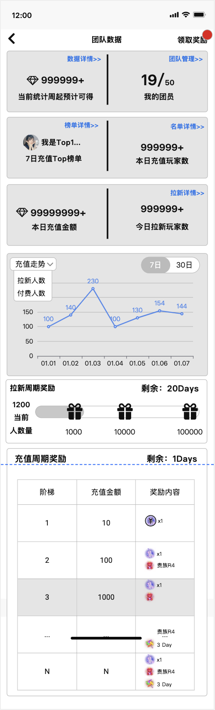

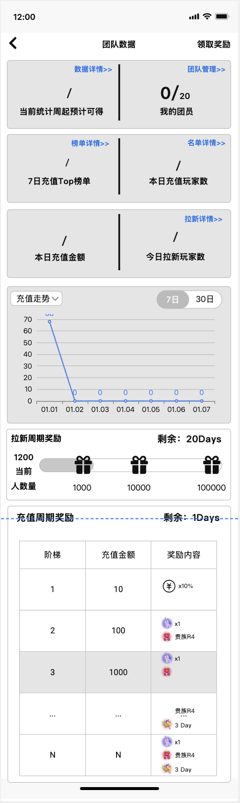

3.4.16 团队拉新 – 拉新周期和领取

| 功能名称 | 拉新周期的领取 |
|---|---|
| 优先级 | 高 |
| 功能描述 | 针对个人拉新功能 |
| 输入/前置条件 | 成为团队团长 |
| 交互原型 | 「图1」              「图2」 「图3」 |
| 字段描述 | 拉新周期奖励模块：BD团队配置和币商团队配置分不同配置 模块名称：拉新周期奖励（具体参考翻译）； 当前周期任务进度团队拉新人数量：该团队在周期内拉新的玩家数； 如果用户没有开启拉人功能，以及没有则展示数字为“0”； 最大数字为9999，超过则展示9999+； 团员退出，已经产生的数据不会被扣除； 进度条：按照后台配置的奖励阶梯，最高的一个标准（人数）为进度条总长度； 最高一个达标任务，为进度条结尾位置，对应礼包展示在结尾； 进度条进度为=当前实际完拉新成人数/当前周期内最高任务拉新人数； 当完成人数超过最后一个达标任务后，进度条依旧为满，不会溢出； 可领取奖励的礼包：为后台阶梯配置下、达到目标人数后的奖励； 目标完成数值：人数，后台配置，正整数，不会出现重复目标数值，显示下方； 奖励内容：为后台配置，理论上平台可发放道具、货币、权益权限都为可配置内容；因为该模块为仅团长可有，因此只能团长领取； 礼包排序：按照任务目标阶梯的排序，从左到右，依次为低目标到高目标，最高一个达标任务，为进度条最后位置； 排序间隔，除了右侧最后一个位置留给阶梯最后一个，其余按照进度条长度等分，如果就一个阶梯，那么就只在最右侧； 不同周期可能会存在不同配置，灵活适配； 举例说明：后台配置三个阶梯，10人、200人、1000人，1000人为右侧进度条结束，剩下为10在左侧第一个，200为第二个，根据进度展示； 该模块展示逻辑： 后台显示开关控制，如果关闭，则不展示该模块； 如果后后台为空配置，则不展示该模块； 如果周期结束后，没有新的周期，则停留当前周期，直道有新周期开始； 剩余时间：按时间格式显示，和拉新周期相同，当前时间点到周期结束时间剩余时间； |
| 需求描述 | 礼包内容为后台配置，当用户在未完成任务和完成任务后，点击礼包，可以气泡展示礼包内容如「图1」； 展示方式参考UI，一排3-4个，根据实际数量调整气泡高度； 展示对应的奖励图片，数量，如果是天数类型展示天数，如果是小时，分钟类型，展示时间单位，具体参考平台通用规则； 礼包内容展示3s后自动消失，或用户点击，滑动页面都可以让气泡消失； 当用团队完成任务后，达到对应标准，礼包有跳动或其他效果（具体参考UI），意为可以点击领取，如「图2」； 奖励必须在当前周期结束前领取，超过后不可领取； 先判断，当前是否满足活动周期，如果不在周期内则toast提示“当前领取未开启”； 然后判断后台领取开关是否开启，如果不可领取，则toast提示“当前领取未开启”； 最后再判断用户自身状态，是否异常（后台个人限制不可用），不可用toast提示“账号异常，无法领取，请联系客服”； 判断不分先后； 如果都满足条件，用户则点击礼包即领取发放，并且弹出恭喜弹窗，展示物品和获得对应单位，物品直接到账，如「图2」，确定关闭弹窗； 如特殊问题，物品当前逻辑中，不做回收处理； 物品领取成功后，已经领取过的礼包则展示被领取后的样式，如「图3」； 领取成功后会在奖励记录中生成领取记录，具体参考相关模块内容； |
| 补充说明 | / |

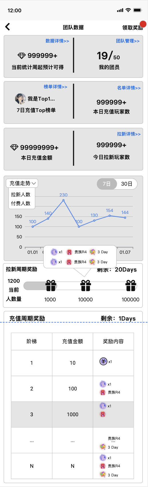

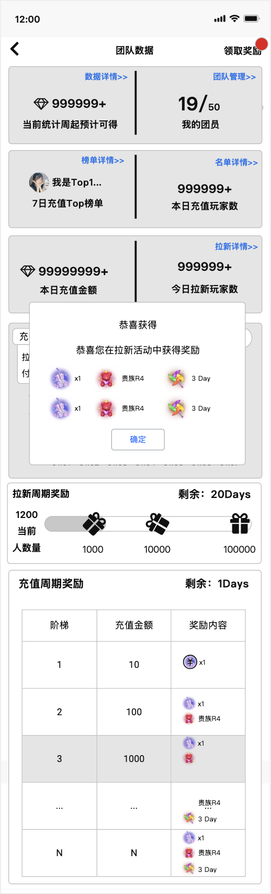

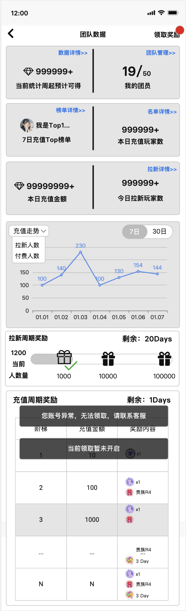

3.4.17 团队拉新 – 充值周期

| 功能名称 | 周期充值奖励 |
|---|---|
| 优先级 | 高 |
| 功能描述 | 周期的充值奖励 |
| 输入/前置条件 | 成为团长 |
| 交互原型 | 「图1」 |
| 字段描述 | 充值周期奖励模块：BD团队配置和币商团队配置分不同配置 展示模块名称：充值周期奖励（具体参考翻译）； 剩余时间：按时间格式显示，和拉新周期相同，当前时间点到周期结束时间剩余时间 阶梯：后台设置，根据后台配置充值达标档位，升序排列，最低的为阶梯1，展示在上面； 充值金额：为配置的充值达标档位，显示后台配置的数字，为达标标准； 奖励内容；为后台配置，展示对应图片，和相关单位，如包含奖励金币，则展示百分比，百分比为后台配置，具体发放哪个类型，为配置； 通常：币商团长拉新充值奖励为奖币商币； 通常：BD团长长拉新充值奖励为奖充值币，但是BD货币不进行发放； 展示格子根据配置内容进行拉长； 到达档位：根据团队在周期内拉到的充值统计金币金额，展示用户当前所在档位，如图，具体表现效果参考UI； 举例：后台配置充值金额A为100奖励充值币10%，奖励配置的金币，B为200奖励充值币20%，那么当前档位为0-100，和101-200；以此类推 继续举例：算时拉到充值金额为90，那么结算按照A阶梯，90*10%=9进行结算； 异常等问题参奖励记录中的领取部分； |
| 需求描述 | / |
| 补充说明 | / |

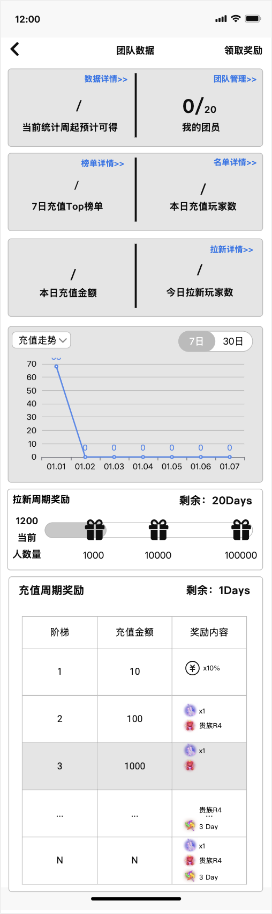

3.4.18 团队拉新 – 奖励记录和领取（币商团长）

| 功能名称 | 币商团长结算和领取记录 |
|---|---|
| 优先级 | 高 |
| 功能描述 | 币商团长结算和领取记录 |
| 输入/前置条件 | / |
| 交互原型 | 「图1」                     「图2」 「图3」                           「图4」 |
| 字段描述 | 「图1」:页面信息 展示拉新用户周期周期的领奖记录和充值周期记录以及领取，如「图1」； 显示开始和结束周期：dd/MM – dd/MM； 显示周期类型：拉新周期奖励、拉新充值周期奖励（具体参考翻译，可能过长调整）； 获得的物品展示： 实际发放的充值币数量，最大99999999超过99999999+，都用相同icon； 其余奖励展示奖励图片，相关单位天/时间/分钟等； 上述可能只有单一类型存在，如果没有相关类型，则只展示单一类型；如「图1」； 超过一排，横向滑动展示； 备注：为何后台对订单进行备注保存，当前由于拉新奖励为领取，无后台订单处理，所以只用在“拉新充值奖励”订单； 扣除订单退款：“拉新充值奖励”周期在结算时，需过滤之前相关绑定用户是否产生退款行为，如果产生退款，则需要展示统计到的之前的退款金额，如「图1」； 特殊情况：无状态，为拉充值订单在周期统计后，拉到金额为0的时候展示，不展示货币和奖励信息，展示“当前周期无贡献”，如果存在退款记录导致拉到金额为0，则按照上述条件，展示“扣除订单退款”信息；该类型不可领取奖励； 订单状态： 审核中：当前业务针对“拉新充值奖励”上个周期结束，在手动结算时，订单后台没有处理的时候的状态； 可领取：当前业务针对“拉新充值奖励”上个周期结束，自动或手动结算通过时，玩家可以领取的状态； 驳回，联系客服：当前业务针对“拉新充值奖励”上个周期结束，手动结算未通过时，玩家不可以领取的状态，通过点击右上角按钮联系客服（1.15修正不可领取文案）； 已领取：拉新周期奖励、拉新充值周期奖励，领取后的展示； 无贡献：仅为拉充值订单在周期统计后，拉到金额为0的时候展示； 订单排序规则 页面默认展示全部订单； 最多展示180天内的500条记录； 一页20条，上滑加载后续订单； 优先按照订单状态，从上到下先后：可领取、审核中、已领取、驳回、无贡献； 然后按照周期结束时间进行倒叙，最近结束的展示在上面； 相同时间按照充值奖励在前，拉新在后； 「图2」筛选 页面默认为展示全部，横向按照全部、可领取、审核中、已领取、驳回、无贡献排序tab单选； 根据订单状态点后，下方弹出筛选，全部、可领取、审核中，已领取，驳回，无贡献； 点击内容则过滤出订单； 其他操作关闭弹窗； 退出页面重制筛选，并刷新页面； 「图3」领取弹窗 当用户领取，并完成发放时弹出该弹窗，物品为直接到账； 从上到下分别为有货币和物品； 仅有物品； 仅有货币； 展示对应icon或图片，以及相关的获得的单位，数量/天/小时/分钟等； 点击确定关闭弹窗，并刷新页面； 「图4」数据为空提示页面如图，文案提示“无更多数据” 币商团队拉新充值结算方式： 基础统计方式：为本周期全部团员后拉新统计到的充值金币数（包括充值币和币商币）为基准，达到对应的等级；然后按照对应的等级按照金额的百分比作为奖励，币商类型 团长获得币商币； 统计方式：即团队包括团长团队在内，从拉新绑定新用户那一刻开始，这个被拉来的新玩家计算到团队内，有效周期也为包括当前自然日在内的总计30个自然日（T+29），按照这个新绑定玩家的充值日，的充值货币（充值币+币商币）数量，统计到对应的周期和数量内；（和个人统计方式相同，只是扩大到团队层面）； 额外扣除： 3.1汇总当前周期拉新充值金额的时候扣除掉往期退款金额，然后根据所在等级进行结算； 3.2如果本期不够扣除，则在下个周期继续追溯，直道全部追溯； 3.3 这种扣除后再在发放的方式，会产生金额偏差，是可以接受的； 3.4举例1：团队在上一个周期，达到20%进行结算，但是当前周期扣除后依旧为10%的周期，20%发放的多，10%发的少，这个偏差是可以接受的； 3.5 举例2：团队本周期A拉充值200，往周期退款300，则本周期按照0计算，剩余100延后到下一个周期B继续追溯扣除； 例如：团队在当前周期内拉新为2000金币，达到要求B档位20%标准，那么用户可以获得400个金币（币商币）； 如果用户当前周期拉到的为0，结算则展示一个“无状态”的订单； 如果有额外奖励配置为物品+数量（根据物品属性决定单位，有天数，小时等，）统一展示在结算订单上，如上「图1」； 统计节点：周期结束后就开始统计，如果时间冲突等问题，可以先把订单统一处理为“审核中”，然后延后15-60分钟后处理； 订单状态处理：后台可以调整统计后的订单处理方式，为手动和自动，根据结算时的配置状态决定，已经手动的订单，不能修改为自动，只可以手动批量处理； 手动结算：为手动调整订单当状态，状态如上面模块提到的全部状态，除了无状态； 手动状态下，订单的统计中，和统计结束后，均为“审核中”状态在C端展示； 自动结算：根据上述的统计方式，统计后自动进行用户档位和可发放奖励确认为通过； 自动结算也可以理解为自动批量处理为通过； 无状态订单直接自动处理为“无状态”不参与手动处理，也不可发放奖励； 领取说明：无论配置什么奖励，但是当前周期，用户在结算时，拉到金额不能为0，否则无发领取奖励，（避免在阶梯1状态下获得其他非货币配置奖励）； 领取成功出弹窗，直接发放到对应钱包和位置； |
| 需求描述 | / |
| 补充说明 | / |

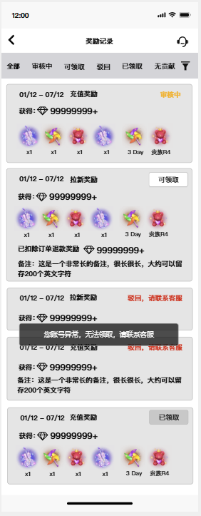

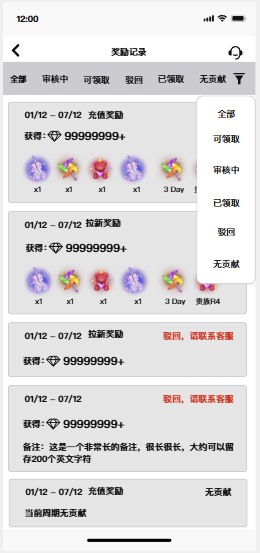

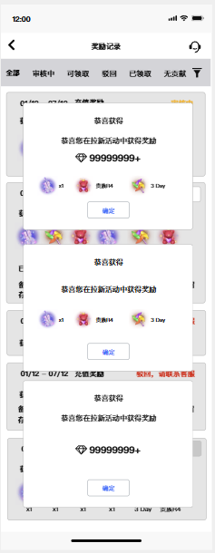

3.4.19 团队拉新 – 奖励记录和领取（BD团长）

| 功能名称 | BD团长结算和领取记录 |
|---|---|
| 优先级 | 高 |
| 功能描述 | BD团长结算和领取记录 |
| 输入/前置条件 | BD团长 |
| 交互原型 | 「图1」                  「图2」 「图3」 |
| 字段描述 | 「图1」:页面信息 展示拉新用户周期周期的领奖记录和充值周期记录以及领取，如「图1」； 显示开始和结束周期：dd/MM – dd/MM； 显示周期类型：拉新周期奖励、拉新充值周期奖励（具体参考翻译，可能过长调整）； 获得的物品展示： 实际发放的充值币数量，最大99999999超过99999999+，都用相同icon； 其余奖励展示奖励图片，相关单位天/时间/分钟等； 上述可能只有单一类型存在，如果没有相关类型，则只展示单一类型；如「图1」； 超过一排，横向滑动展示； 备注：为何后台对订单进行备注保存，当前由于拉新奖励为领取，无后台订单处理，所以只用在“拉新充值奖励”订单； 扣除订单退款：“拉新充值奖励”周期在结算时，需过滤之前相关绑定用户是否产生退款行为，如果产生退款，则需要展示统计到的之前的退款金额，如「图1」； 特殊情况：无状态，为拉充值订单在周期统计后，拉到金额为0的时候展示，不展示货币和奖励信息，展示“当前周期无贡献”，如果存在退款记录导致拉到金额为0，则按照上述条件，展示“扣除订单退款”信息；该类型不可领取奖励； 订单状态： 审核中：当前业务针对“拉新充值奖励”上个周期结束，在手动结算时，订单后台没有处理的时候的状态； 等待发放：人工审核，或自动审核审批过后，费用需要其他渠道打款，然后再后台进行变动为“已发放”； 已发放：后台针对“等待发放”进行发放后，手动进行调整，支持批量； 驳回，联系客服：当前业务针对“拉新充值奖励”上个周期结束，手动结算未通过时，玩家，通过点击右上角按钮联系客服（1.15修正不可领取文案）； 无贡献：仅为拉充值订单在周期统计后，拉到金额为0的时候展示； 订单排序规则 页面默认展示全部订单； 最多展示180天内的500条记录； 一页20条，上滑加载后续订单； 优先按照订单状态，从上到下先后：审核中、等待发放、已发放、驳回、无贡献； 然后按照周期结束时间进行倒叙，最近结束的展示在上面； 相同时间按照充值奖励在前，拉新在后； 「图2」筛选 页面默认为展示全部，横向按照全部、审核中、等待发放、已发放、驳回、无贡献排序tab单选； 根据订单状态点后，下方弹出筛选，全部、审核中、等待发放、已发放、驳回、无贡献； 点击内容则过滤出订单； 其他操作关闭弹窗； 退出页面重制筛选，并刷新页面； BD团队拉新充值结算方式： 基础统计方式：为本周期全部团员后拉新统计到的充值金币数（包括充值币和币商币）为基准，达到对应的等级；然后按照对应的等级按照金额的百分比作为奖励，BD类型团长获得充值币，但是这个币不会真实发放，只做订单处理，由运营按照一定比例折线发法币； 统计方式：即团队包括团长团队在内，从拉新绑定新用户那一刻开始，这个被拉来的新玩家计算到团队内，有效周期也为包括当前自然日在内的总计30个自然日（T+29），按照这个新绑定玩家的充值日，的充值货币（充值币+币商币）数量，统计到对应的周期和数量内；（和个人统计方式相同，只是扩大到团队层面）； 额外扣除： 3.1汇总当前周期拉新充值金额的时候扣除掉往期退款金额，然后根据所在等级进行结算； 3.2如果本期不够扣除，则在下个周期继续追溯，直道全部追溯； 3.3 这种扣除后再在发放的方式，会产生金额偏差，是可以接受的； 3.4举例1：团队在上一个周期，达到20%进行结算，但是当前周期扣除后依旧为10%的周期，20%发放的多，10%发的少，这个偏差是可以接受的； 3.5 举例2：团队本周期A拉充值200，往周期退款300，则本周期按照0计算，剩余100延后到下一个周期B继续追溯扣除； 例如：团队在当前周期内拉新为2000金币，达到要求B档位20%标准，那么用户可以获得400个金币（币商币）； 如果用户当前周期拉到的为0，结算则展示一个“无状态”的订单； 如果有额外奖励配置为物品+数量（根据物品属性决定单位，有天数，小时等，）统一展示在结算订单上，如上「图1」； 统计节点：周期结束后就开始统计，如果时间冲突等问题，可以先把订单统一处理为“审核中”，然后延后15-60分钟后处理； 订单状态处理：后台可以调整统计后的订单处理方式，为手动和自动，根据结算时的配置状态决定，已经手动的订单，不能修改为自动，只可以手动批量处理； 手动结算：为手动调整订单当状态，状态如上面模块提到的全部状态，除了无状态； 手动状态下，订单的统计中，和统计结束后，均为“审核中”状态在C端展示； 自动结算：根据上述的统计方式，统计后自动进行用户档位和可发放货币数； 自动结算也可以理解为自动批量处理为通过； 无状态订单直接自动处理为“无状态”不参与手动处理，也不可发放奖励； 发放说明： 奖励的货币: 由于BD团队的特殊性，货币结算的所有货币，只用作展示，不做发放； 奖励的平台物品：会在后台变更订单为“已发放”时发放到用户相关场景； |
| 需求描述 | / |
| 补充说明 | / |

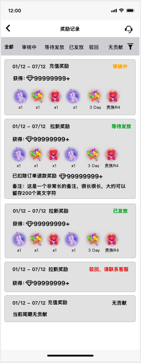

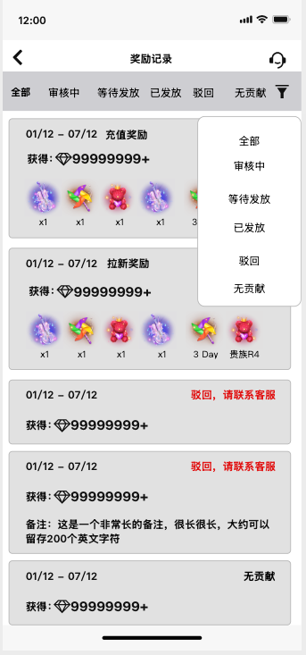

3.4.20 团队拉新 – 团队数据详情“充值数据”

| 功能名称 | 团队数据详情 |
|---|---|
| 优先级 | 高 |
| 功能描述 | 团队数据详情 |
| 输入/前置条件 | / |
| 交互原型 | 「图1」                     「图2」 「图3」                 「图4」 |
| 字段描述 | 团队数据汇总： 团队数据入口为“当前攻击周期预计可得”金额的“更多数据获得； 有两个TAB，一个是‘充值数据“，一个是“拉新数据”，默认为充值数据，如果为空则为“拉新数据”，如果都为空，回默认“充值数据”Tab； 展示对应的周期：显示开始和结束周期：dd/MM – dd/MM（GMT+3）； 展示当前预计可得的货币icon和金额，99999999，超过展示99999999+； 展示以及当前团队拉新充值阶梯；LV+数字，具体阶梯为后台配置； 展示在这个阶梯，除了金币额外配置的物品，后台设置，超过一排，横向滑动显示后续，包括物品图片，以及可获得物品的最小单位；数量/天/小时等；如果没有则不展示参考「图2」； 当前周期团队拉新的充值额度，货币icon和金额，99999999，超过展示99999999+； 当前周期团队的充值人数：99999999，超过展示99999999+； 团员数据明细： 团员基础信息：头像，显示ID，昵称（过长…展示）； 展示团员关联的玩家在周期的充值金币数量：icon和金额，99999999，超过展示99999999+； 点击团员所在栏（大范围）：进入二级页面，查看该团员在统计周期的详情如「图3」； 只展示有数据的团员，并按照周期关联金币数量，从高到低进行排列； 如果团员退出了团队，但当时拉到用户有贡献，则不展示在列表，但数据照常统计（之前有描述）； 如果为空，展示为「图2」； 团员数据详情 从充值页面的团员数据明细点进来，页面「图3」为该团员贡献的充值详情，也可以点击头部的tab，切换到该玩家在周期内拉来的新用户列表； 空状态如「图4」； 统计内容为点进的团员拉到的新用户，在当前周期的充值排行榜； 按照金币数量，从高到低进行排列，前三特殊展示； 刷新可以按照整点左右，1小时刷新一次； 展示对应玩家的，头像，显示ID，玩家昵称（过长…展示），还有VIP身份，如果有； |
| 需求描述 | / |
| 补充说明 | / |

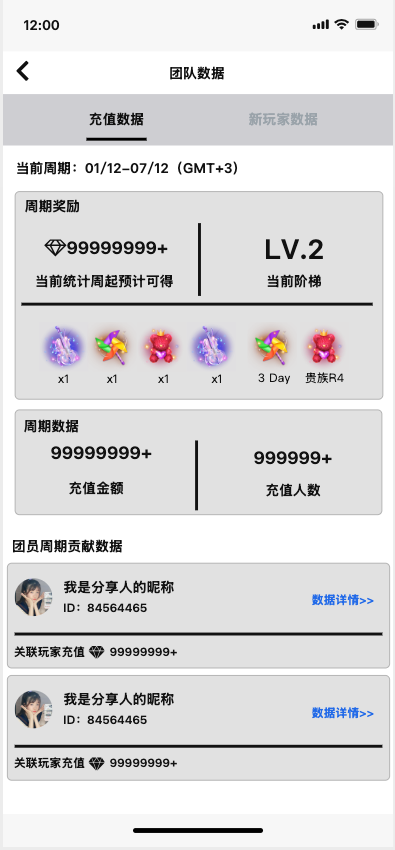

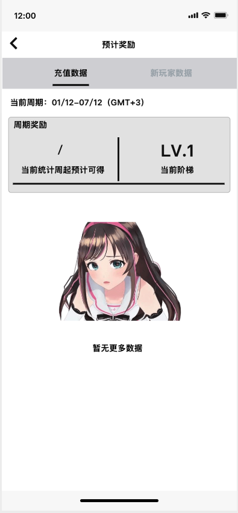

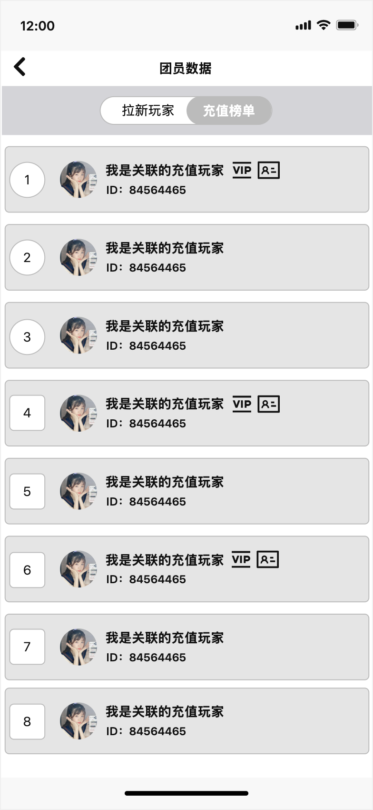

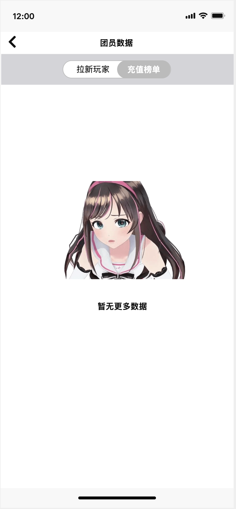

3.4.21 团队拉新 – 团队数据详情“拉新玩家”

| 功能名称 | 团队数据详情 |
|---|---|
| 优先级 | 高 |
| 功能描述 | 团队数据详情 |
| 输入/前置条件 | / |
| 交互原型 | 「图1」                       「图2」 「图3」                           「图4」 |
| 字段描述 | 团队数据汇总： 没有独立入口，为充值详情点击后进入； 展示对应的周期：显示开始和结束周期：dd/MM – dd/MM（GMT+3）； 展示当周期的拉新人数，99999999，超过展示99999999+； 团员数据明细： 团员基础信息：头像，显示ID，昵称（过长…展示）； 展示团员关联拉新人数：icon和金额，99999999，超过展示99999999+； 点击团员所在栏（大范围）：进入二级页面，查看该团员在统计周期的详情如「图3」； 只展示有数据的团员，并按照周期拉新人数，从高到低进行排列； 如果团员退出了团队，但当时拉到用户有贡献，则不展示在列表，在周期内产生的拉新数量不会被扣除（之前有描述）； 如果为空，展示为「图2」； 团员数据详情 从充值页面的团员数据明细点进来，页面「图3」为该团员在周期内的拉新列表，也可以点击头部的tab，切换到该玩家在周期内拉新充值列表； 空状态如「图4」； 按照关联时间，倒叙排列，最新的展示在上面； 刷新可以按照整点左右，1小时刷新一次； 展示对应玩家的，头像，显示ID，玩家昵称（过长…展示），还有VIP身份，如果有； 以及展示绑定时间； |
| 需求描述 | / |
| 补充说明 | / |

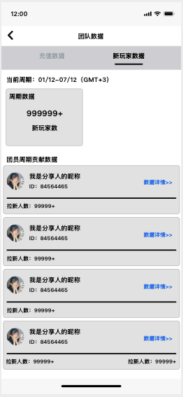

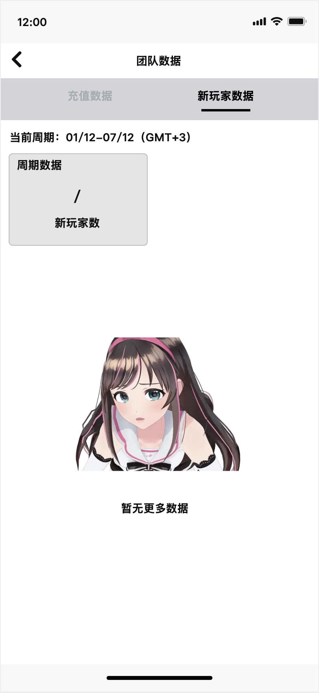

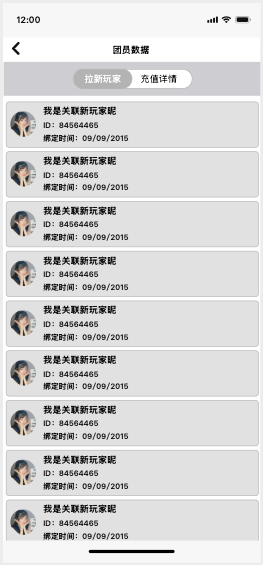

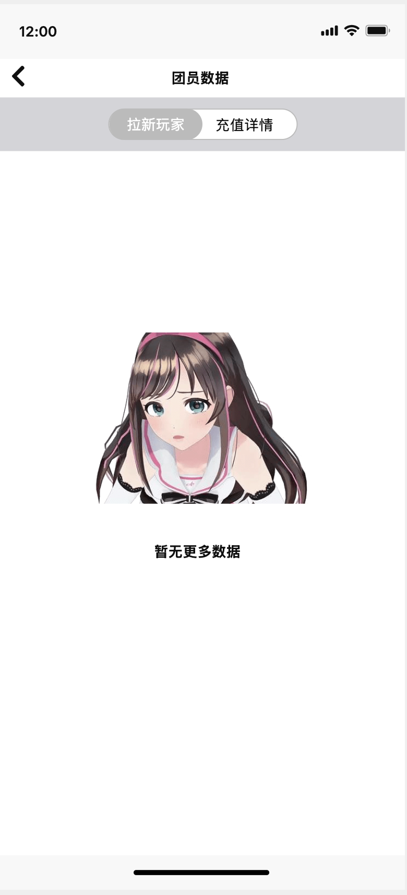

3.4.22 团队拉新 – 充值榜单

| 功能名称 | 团队汇总充值榜单 |
|---|---|
| 优先级 | 高 |
| 功能描述 | 团队汇总充值榜单 |
| 输入/前置条件 | / |
| 交互原型 | 「图1」                        「图2」 「图3」                        「图4」 |
| 字段描述 | 榜单入口： 从“7日充top值榜单‘入口进入，默认“7日充值榜”如「图1」，如果7日为空「图4」，则为30日，都为空则回归默认7日； 1日榜单：本日充值玩家数量，如果为空则展示空状态「图4」； 三个导航tab之间可以点击互相切换； 统计和时间展示以及刷新说明： 1日榜单为当前自然日榜单； 刷新时间15分钟一次，快更好（可聊），时间显示为：dd/MM（GMT+3）HH:mm，为展示当前日期和刷新的时间，24点后新周期开始，不展示历史数据； 7日榜单为包括前一日在内的前7日，每日0点-1点刷新完成即可；展示时间为统计日期，dd/MM-dd/MM，跨日数据没有刷新前，保持显示上一次统计数据； 30日榜单为包括前一日在内的前30日，每日0点-1点刷新完成即可；展示时间为统计日期，dd/MM-dd/MM，跨日数据没有刷新前，保持显示上一次统计数据； 排序规则； 均按照在对应日期，满足统计要求的充值玩家（30日规则，这里没有活动周期概念），的充值金币数量（币商币+充值币）从高到低进行排列； 榜单暂不考虑退款问题； 前三有单独展示样式； 展示信息： 基础的头像，显示ID，昵称（过长…展示），VIP身份，如果有； 以及该玩家当是是被哪个团员拉来绑定的，即使团员已经退出团队，依旧展示； 点击玩家所在条目，会打开玩家的资料页； |
| 需求描述 | / |
| 补充说明 | / |

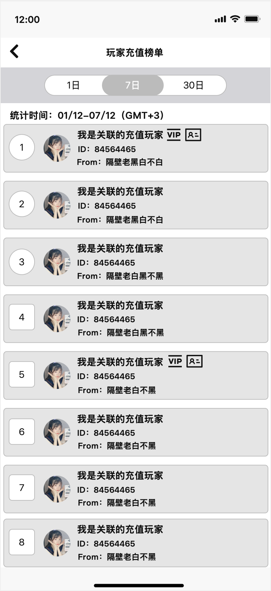

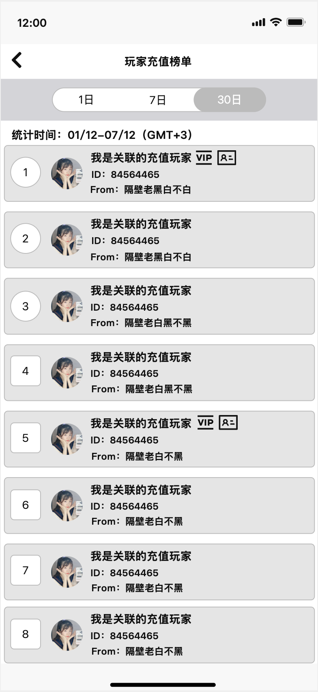

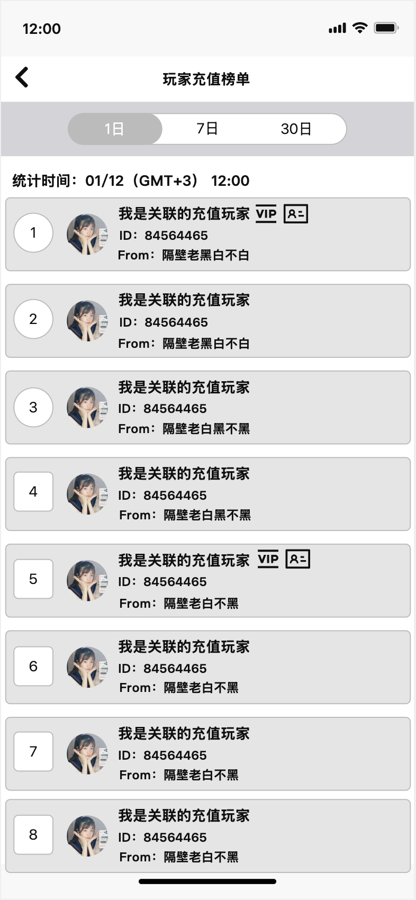

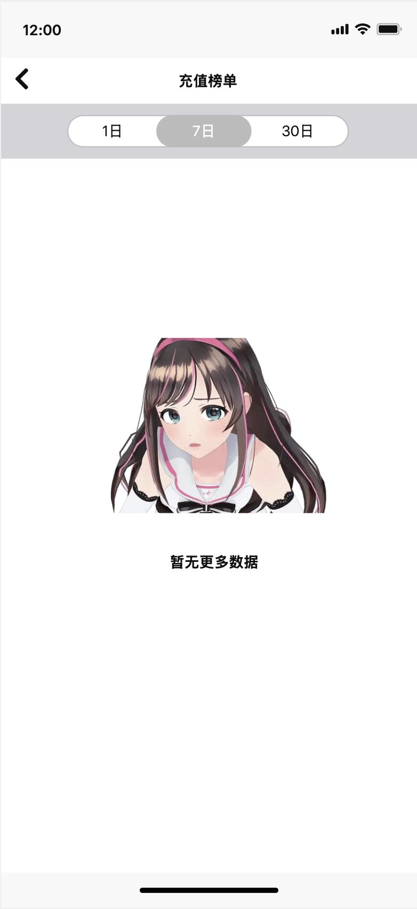

3.4.23 团队拉新 – 拉新列表

| 功能名称 | 拉新列表 |
|---|---|
| 优先级 | 高 |
| 功能描述 | 拉新列表 |
| 输入/前置条件 | / |
| 交互原型 | 「图1」                         「图2」 「图3」                          「图4」 |
| 字段描述 | 拉新玩家列表：通过“今日拉新玩家数”入口进入； 列表展示团队全部拉新的玩家，从绑定开始日在内，60自然日最多500条数据（关联统计只算30天，这个有区别记住分辨）； 按照绑定时间倒叙排列； 一页50个，上滑加载（也接受一次500条都展示，具体看性能，或者第一次下载缓存，后续进入页面对比服务端更新信息，各种方案都可接受）； 展示信息包括头像、昵称（过长…展示），显示ID，绑定时间dd/MM/yyyy； 支持点击头像，展开应用内用户资料（可商议，支持最好）； 如果没有数据则展示「图4」 |
| 需求描述 | 支持列表用户信息用户id精确搜索，支持粘贴进ID； 输入框激活前展示提示文案“输入ID搜索”； 单击输入框激活输入框，提示信息消失，激活输入光标，输入框引导内容清空‘X’「图2」，并激活数字键盘，下方展示列表信息不清空； 「图2」输入框清空按钮“x”点击后清空输入框信息，并退出搜索结果； 输入ID最长限制20是个数字，空格自动清空，超过20个数字自动退格超长信息； 点击搜索进行绑定列表的精确显示ID匹配； 如有，则展示「图2」，用户显示内容与列表信息相同； 如果不存在该ID，则展示「图3」，给出滞空样式，对不起您的搜索结果不存在；； |
| 补充说明 | / |

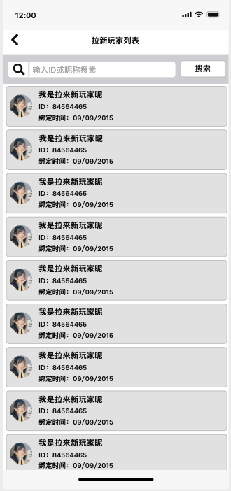

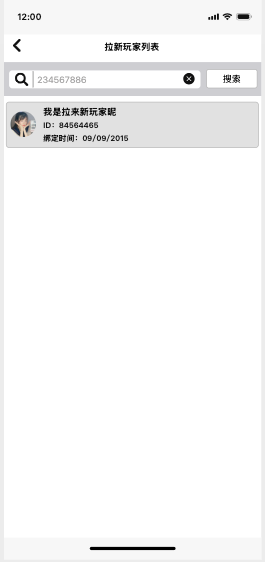

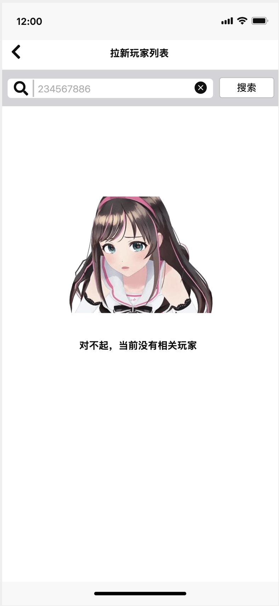

3.4.24 团队管理 – 团队列表

| 功能名称 | 团对列表 |
|---|---|
| 优先级 | 高 |
| 功能描述 | 团对列表 |
| 输入/前置条件 | / |
| 交互原型 | 「图1」                     「图2」 「图3」 |
| 字段描述 | 页面入口：为团队数据页面的“我的团员”点击进入； 当团员成员达到配置上限的时候，则展示「图3」； 如果团员成员为空则展示「图2」； 当团员成员未达到上限时，则展示「图1」； 当成员人数未达到上限的时候，会有“+（添加成员）”按钮，点击后进入到成员页； 成员不展示团长自己，只展示除了团长之外的团员，当存在其他团员的时候，团长可以通过右上角的；“删除成员”进行成员管理； 成员展示信息：头像，昵称（过长…展示），显示ID，入团时间； 排序按照入团时间的倒叙排列，相同时间，按照显示ID小的在前面； 支持点击消息进入单人消息详情页面进行消息发送； 点击用户头像，展示用户的资料页； 如果后台修改了玩家团队人数： 当数量增加：重新进入页面后，根据数量判断展示按钮信息； 如果修改数量后，团员人数大于团员数量；成员不会自动减少，只有人工缩减到配置数量以下，则可以重新增加成员； |
| 需求描述 | / |
| 补充说明 | / |

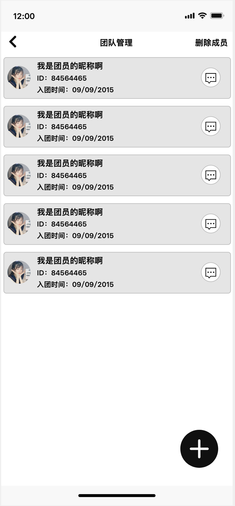

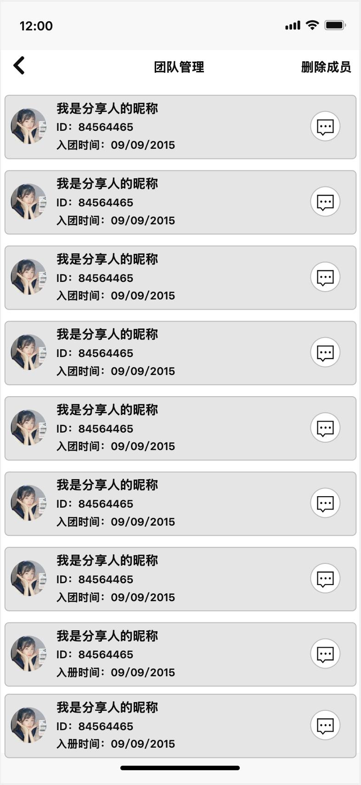

3.4.25 团队管理 – 成员删除

| 功能名称 | 成员删除 |
|---|---|
| 优先级 | 高 |
| 功能描述 | 成员删除 |
| 输入/前置条件 | / |
| 交互原型 | 「图1」                         「图2」 「图3」 |
| 字段描述 | / |
| 需求描述 | 点击“删除成员”后激活删除功能，原来“删除成员”变更为“退出”； 成员列表前增加选择按钮，支持多选； 下方弹出“全选”按钮，以及删除按钮，相对页面静止； 团长可以单独勾选用户进行删除，当勾选人数为0的时候，删除按钮灰色处理，不展示勾选数量； 当已经勾选人数之后，删除按钮亮起，并显示勾选数量； 点击“删除”；弹出二次确认弹窗如「图3」； 取消为关闭弹窗，并不退出删除； 如果删除的为单人的时候，弹出被删除玩家的头像，昵称，显示ID； 若果删除的人超过一个人，则展示删除数量和对应删除团员的头像，叠加显示，头像最多展示20个，超过不显示，按照删玩家ID正序列从下向上叠加（可方便的来）； 确认删除，删除成功（多个中，只有一个成功也按照成功计算），则关闭弹窗，toast提示“删除成功”刷新页面，保持激活在删除功能下； 如果删除出现失败（都失败），则不关闭弹窗，toast提示相关原因； |
| 补充说明 | / |

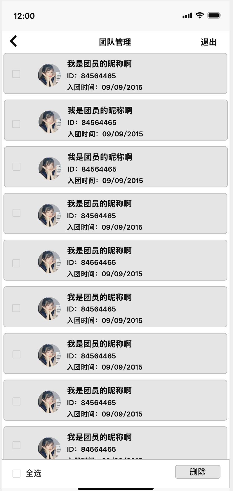

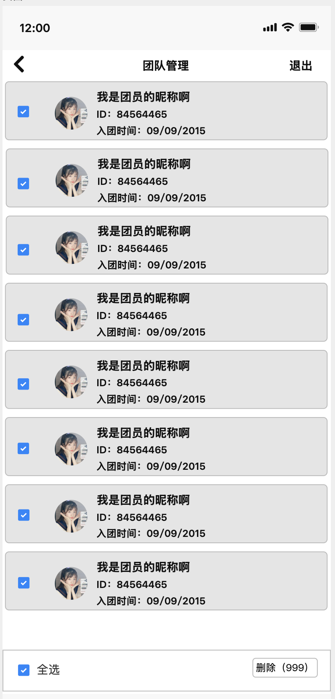

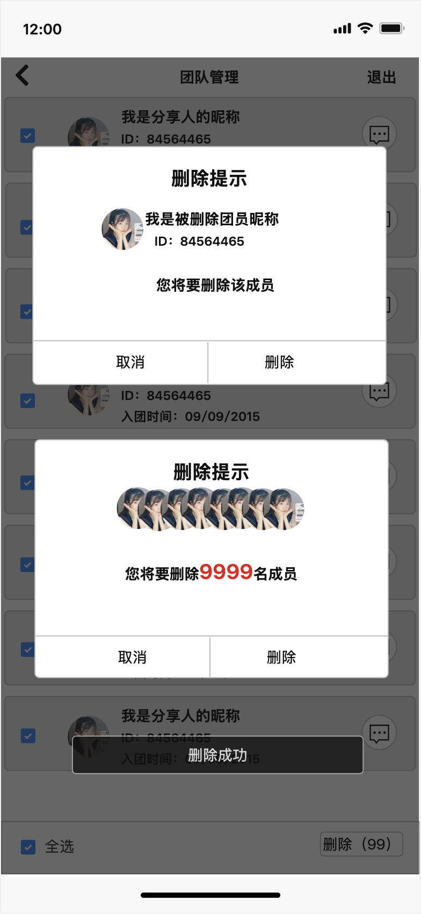

3.4.2团队管理 - 平台成员新增 - 二维码和链接邀请

| 功能名称 | 平台成员新增 |
|---|---|
| 优先级 | 高 |
| 功能描述 | 平台成员新增 |
| 输入/前置条件 | / |
| 交互原型 | 「图1」                          「图2」 「图3」                           「图4」 「图5」 |
| 字段描述 | 当团员人数没有达到数量上限的时候点击“增加”按弹出「图1」； 二维码分享：通过点击二维码，进行团员邀请； 链接分享：通过链接进行团员邀请； 应用内邀请，针对已经注册用户，通过应用内邀请称为团员； |
| 需求描述 | 二维码分享成为团员：「图2」 图片展示信息： 2.1 邀请人的头像、头像框、VIP身份（如果有）、分享者ID； 2.2 分享邀请的图片信息元素（当前通用一个，不做定制选择），偏赚钱风格； 2.3 图片的使用说明“1. 保存图片到相册”，“2. 使用软件扫描保存图片中的二维码”； 2.4 二维码：专属该用户的分享二维码； 3. 支持图片分享方式：（可以根据具体情况商议） 3.1 保存到本地：如果需要获取相册权限，弹出系统权限弹窗，弹窗和头像获取发送图片选择弹窗相同，保存成功toast提示“已保存”； 3.2 Facebook，需要支持直接分享到常规动态或帖子（也可能叫快照），当前可以二选一，常规动态最好，例如下方补充说明「图1」； 3.2 Whatsapp：跳转打开列表支持到whatsapp动态最好，补充说明「图2」； 3.3 Message：列表等分享位置，补充说明「图3」； 3.4 唤起APP需要确认弹窗如「图5」，如果有责唤起App，没有唤起对应系统应用市场； 3.4 点击取消退出页面，回到主页； 邀请链接分享成为团员：「图3」「图4」 吸顶部栏：分享着用户头像，头像框，VIP，昵称（过长缩略展示），显示ID； 中间为页面图片，可以和分享图片元素相同，偏赚钱风格； 支持分享方式：（可以根据具体情况商议） 3.1 复制链接：点击后，复制到剪贴板，按钮变更为「图4」“已复制”icon也产生变更，不可点击并且无效，保持3s后，还原为原icon和可点击状态，可以循环点击； 3.2 Facebook，需要支持直接分享到常规动态或帖子（也可能叫快照），当前可以二选一，常规动态最好，例如下方补充说明「图1」； 3.2 Whatsapp：跳转打开列表支持到whatsapp动态最好，补充说明「图2」； 3.3 Message：列表等分享位置，补充说明「图3」； 3.4 唤起APP需要确认弹窗如「图4」，如果有责唤起App，没有唤起对应系统应用市场； 3.4 点击取消退出页面，回到主页； 3.5 如果分享为链接的话，为：「我是分享玩家名」+打开链接+ 邀请你加入团队！；（具体文案参考翻译）； 邀请团员通用规则说明： 通过二维码/链接，注册的新用户，在成为团员的同时，也会给团长的新绑定用户数量+1，被邀请的团员，的绑定用户即为团长； 对于已经注册的用户，如果在注册48小时内，没有向上绑定拉新，没有成为团员，那么通过链接进入app会成为团员，也会给团长的新绑定用户数量+1； 对于已经注册的用户，如果在注册48小时内，没有向上绑定拉新，但是绑定了团队，那么通过链接不会成为团员，也不会给团长拉新+1； 对于已经注册的用户，如果在注册48小时内，没有向上绑定拉新，但是绑定关系已经超过了10个数量上限，那么通过链接只会成为团员，但是不会给团长增加新增绑定； 对于已经注册的用户，如果在注册48小时内外，无论是否有向上绑定拉新，但是听过团长分享成为团员，那么通过链接只会成为团员，但是不会给团长增加新增绑定； 每个团员在同一个时间内只有一个团长，且唯一，当前团员不支持自动退出，只支持团长踢出和后台提出； 对于绑定成为团员，和踢出都会收到系统消息，参考下一个章节文档； 对于通过链接/二维码打开app，定位到“个人”me页（3月2日删除）； |
| 补充说明 | 「图1」                 「图2」               「图3」 |

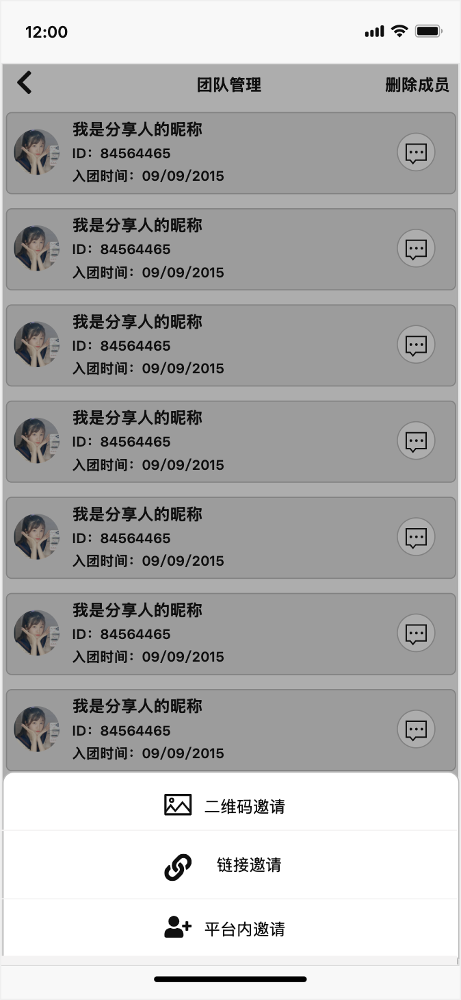

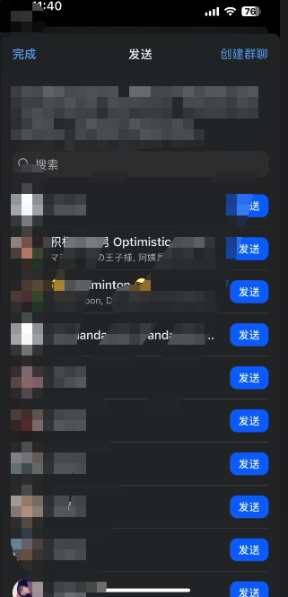

3.4.27 团队管理 - 平台成员新增 – 平台内邀请

| 功能名称 | 平台内邀请成为团员 |
|---|---|
| 优先级 | 高 |
| 功能描述 | 平台内邀请成为团员 |
| 输入/前置条件 | / |
| 交互原型 | 「图1」                       「图2」 「图3」                       「图4」 「图5」 |
| 字段描述 | 通过应用内邀请，点击后进入展示如「图1」； 展示内容为：好友列表，但是过滤掉已经成为团员的玩家，排序按照好友列表排序相同，如果没有好友展示「图3」； 一页展示50个； 展示为好友头像，显示ID，昵称（过长…缩写）； 点击头像，展示用户资料页； 邀请按钮，点击后发送邀请； 搜索用户： 支持列表用户信息用户id精确搜索，支持粘贴进ID； 输入框激活前展示提示文案“输入ID搜索”； 单击输入框激活输入框，提示信息消失，激活输入光标，输入框引导内容清空‘X’「图4」，并激活数字键盘，下方展示列表信息不清空； 输入框清空按钮“x”点击后清空输入框信息，并退出搜索结果； 输入ID最长限制20是个数字，空格自动清空，超过20个数字自动退格超长信息； 点击搜索进行绑定列表的精确显示ID匹配； 如有，则展示「图4」，用户显示内容与列表信息相同； 如果不存在该ID，则展示「图5」，给出滞空样式，对不起您的搜索结果不存在； 邀请逻辑 点击“邀请”则向对应用户功能进行判断； 判断用户身份是否为团长：toast提示“您当前身份无法发起邀请”； 团队成员是否已经达到上限：toast“您的团队已满”； 判断对方是否在团队中，toast“已经在团队中”； 判断对方身份是否可用如果没有被后台设置为“关闭”（不是没有开启，是被后台限制不可用，和个人页面领奖判断相同）：toast“对方身份异常，不可被邀请”； 一个自然日，只可以向一个用户发送一次邀请，超过则toast提示“今日已发送团队邀请”； 点击已邀请后，按钮灰色，提示“已邀请”，不可点击； 重新进入或重新搜索，刷新后，按钮回归可用状态，显示“邀请”； |
| 需求描述 | / |
| 补充说明 | / |

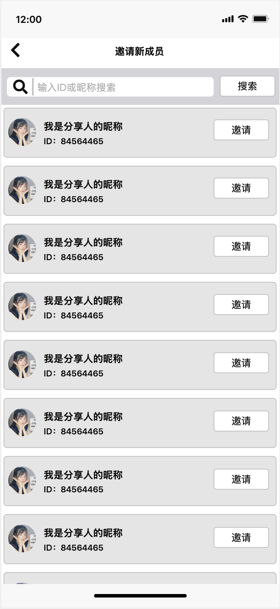

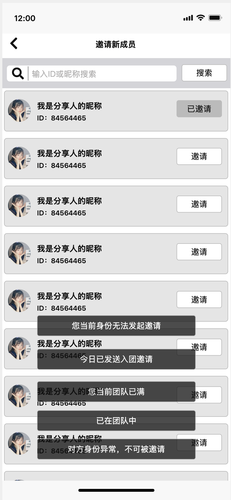

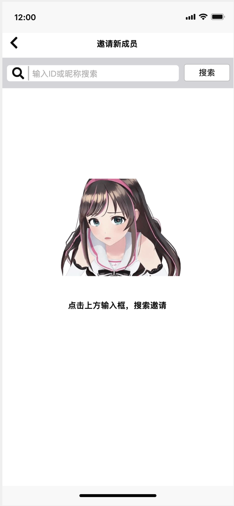

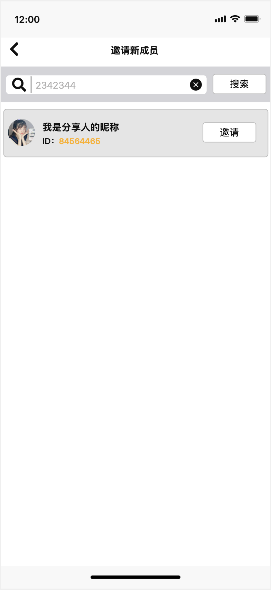

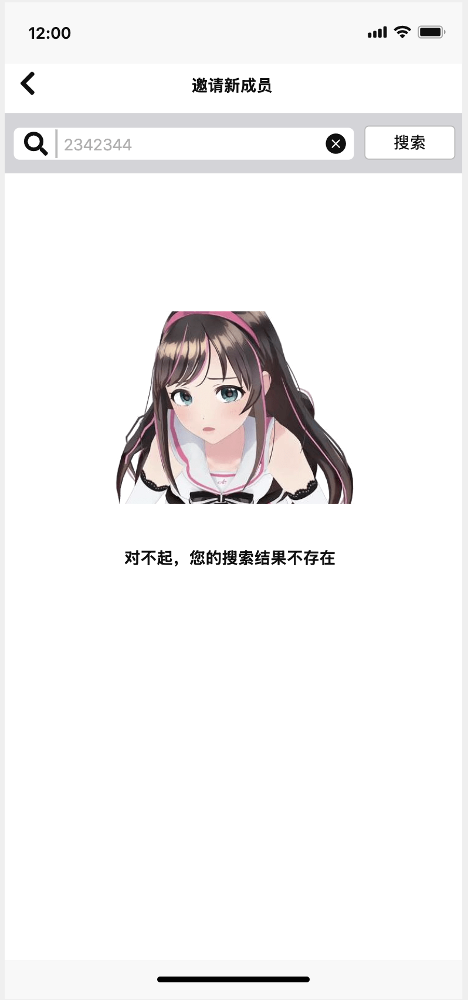

3.4.28 团员加入 – 下载页面提示和消息提示

| 功能名称 | 下载页面提示和消息提示 |
|---|---|
| 优先级 | 高 |
| 功能描述 | 下载页面提示和消息提示 |
| 输入/前置条件 | / |
| 交互原型 | 「图1」                     「图2」 「图3」（1月20日修改）                     「图4」 |
| 字段描述 | 「图1」被邀请者通过链接和图打开页面； 新用户通过扫描二维码或分享链接，在浏览器中打开的页面； 吸顶栏：app 图标，打开按钮； 页面信息：主要为应用内游戏元素，社交元素，礼物元素为主，也可参考应用市场图 吸底栏：分享者头像，昵称，显示ID，VIP信息，固定文案“邀请您来”，打开app按钮； 顶部和底部打开按钮功能相同，点击后判断该手机是否有安装app； 如果有安装app，则直接唤起app； 如果没有，则根据用户手机系统判断，苹果打开应用市场定位到对应的app，安卓则定位到Google应用市场； 如果出现其他的市场，后续再补充 关于团员的判断，如果用户有多个不同团长邀请，则最后一个打开到此页面下载app或打开app后注册的账号作为绑定关联； 团员规则，前2章节中，通用规则的描述； 「图2」通过链接二维码进入app定位页面，如果加入团队异常的提示； 当用户接受了链接进入app后，到定位页，如果身份被限制（后台关闭）则弹窗提示“您当前身份不可加入对方团队”； 如用户本身在其他团队中，则弹窗提示“您在其他团队中，不可加入其他团队”； 「图3」应用内被邀请团员消息页； 消息增加“团队邀请”模块，在本地没有相关消息和记录时不展示此tab； 在收到新消息时，显示tab，并增加红点提示； 用户点进进入tab，无论是否处理此消息，红点进行消除； 消息整合到新的“粉丝”消息中，生成一条消息：「邀请者」邀请您加入拉新团队中（1月20日调整）； 未处理的消息在收到后处理为本地消息，变更设备后，不展示历史消息，并展示本条消息收到的时间（通用规则）； 服务端该消息的过期时间为3日，如果发起者每天发送一次，则按照最新一次进行刷新，超过处理此消息则为过期显示“消息已超时”，按钮变更为“过期”，并且置灰不可用； 用户可以点击驳回或同意加入团队，驳回则按钮变更“驳回”置灰，不可用，发起者不收到驳回提示，但是发起者可以每天发起一次，刷新消息状态； 点击同意则进行判断：超时、是否在其他团队中，是否功能被平台显示，并显示相关toast；如果正常通过则按钮变更为“同意”，灰色，不可点击； 「图4」团员功能消息提示； 当加入团队成功，会收到系统消息提示”您已经加入了「我是团长昵称」的团队。可以点击“我 - 分享邀请”查看您的数据”； 当被团长踢出团队，包括后台移出，也会收到系统提示“您已经退出了「我是团长昵称」的团队。如果有问题请联系您的团长或官方客服。“ 消息标题都为：“尊敬的玩家“； |
| 需求描述 | / |
| 补充说明 | / |

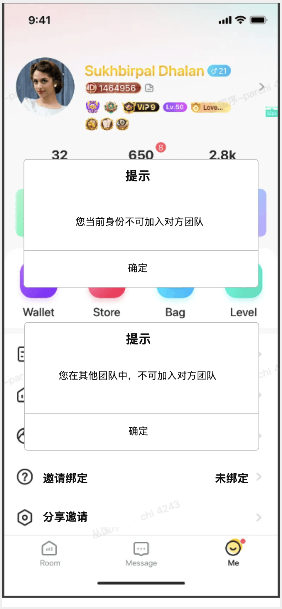

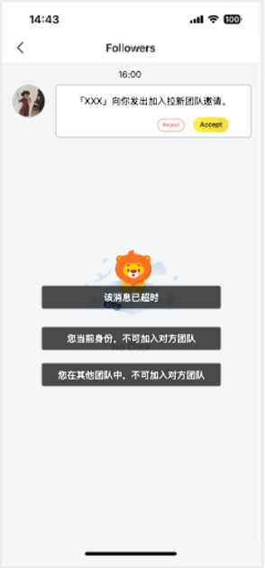

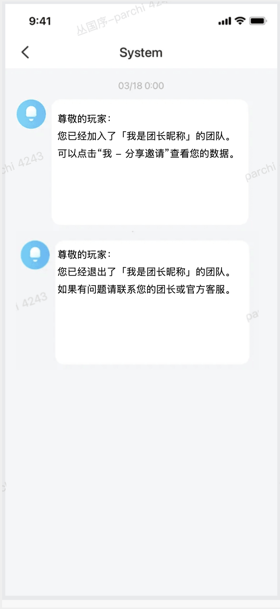

3.4.29 二维码生成交互调整

| 功能名称 | 二维码生成交互 |
|---|---|
| 优先级 | 高 |
| 功能描述 | 二维码生成交互 |
| 输入/前置条件 | / |
| 交互原型 | 「图1」 |
| 字段描述 | / |
| 需求描述 | 当用户“参与”到拉新系统后/成为团长后，系统会异步自动排队生成二维码； 用户在点击二维码邀请的时候，获取是否已生成图片，如已生成，则正常展示二维码海报； 如当前没有图片，则弹出弹窗「图1」，刷新则再次请求，如果点击取消的关闭弹窗； 当用户信息产生变更后，海报会重新生成，由于异步处理，再生成新海报前，依旧展示旧海报； 通过应用内分享到外部的图片路由地址保留有效期为90天，超过则旧海报进行释放不做保留； |
| 补充说明 | / |

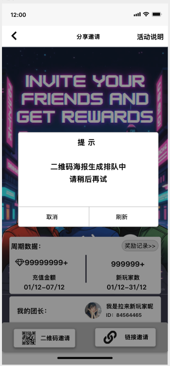
