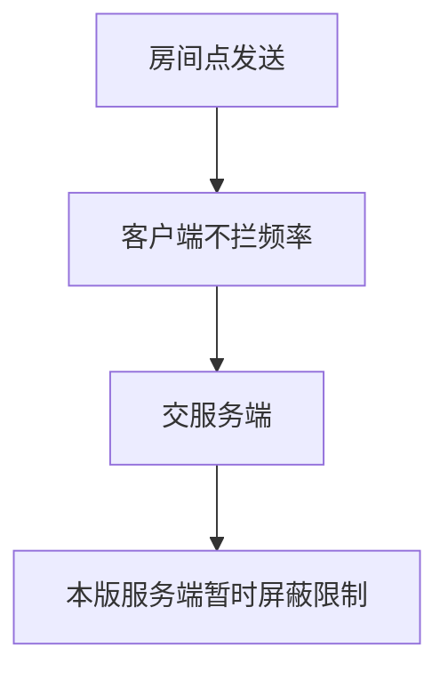

# 房间聊天 · 现行说明

> 派生阅读层。改规则仍改 [`../PRD.md`](../PRD.md)。基于已收录主线 **V1.4.0**。本文只覆盖公屏频率归属与 Android 列表重构，不展开完整房间产品。

## 元信息
<!-- chunk:no -->

| 字段 | 值 |
|---|---|
| 功能 ID | `room-chat` |
| 截止版本 | 已收录 V1.4.0（模块正文来自 V1.0.1） |
| 权威 | 派生；冲突以 `PRD.md` 为准 |
| 状态 | pending-review |

---

## 范围
<!-- chunk:default section=scope id=room-chat.scope -->

覆盖：房间公屏发消息频率由谁控制；Android 房间聊天列表重构（新消息闪烁、List 无数据变化感知）。不覆盖麦位、礼物、密码房、进房、房间大厅。

---

## 总流程
<!-- chunk:default section=flow id=room-chat.flow-main -->

用户在房间点发送后，客户端不再做频率拦截。是否限制只问服务端；本版服务端暂时屏蔽此限制。

---

## 业务逻辑

### 公屏频率 {#logic-freq}
<!-- chunk:default section=logic id=room-chat.logic-freq -->

原问题：同一用户短时间连发相同消息时，频率本应由服务端控制，但客户端与服务端会同时限制，改服务端时客户端不生效；线上表现为无论间隔多久都无法连着发两条相同消息。现行：删除客户端对房间发消息的频率控制，仅为服务端控制。同时服务端暂时屏蔽此限制。

---

## 客户端页面

### Android 聊天列表 {#page-android-list}
<!-- chunk:default section=page id=room-chat.page-android-list -->

Android 房间内聊天列表重构。要解决：添加新消息时新进来的消息会闪烁一下；原 List 控件是命令式、无数据变化感知。影响点仅房间聊天列表。公屏气泡样式、欢迎语、送礼消息仍见 [`../../room/brief/current.md`](../../room/brief/current.md)。

---

## 后台影响
<!-- chunk:default section=admin id=room-chat.admin-impact -->

无独立后台章。频率仅服务端控制；本版服务端暂时屏蔽该限制。不编造 admin 锚点。

---

## 关联影响

### 关联 · 房间 {#related-room}
<!-- chunk:related-row section=related id=room-chat.related-room target=room -->

公屏在房间内。麦位、礼物、进房、大厅不在本文。跳转 [`../../room/brief/current.md`](../../room/brief/current.md)。

---

## 相对变化
<!-- chunk:changelog section=changelog id=room-chat.changelog -->

相对原文：公屏连发频率从客户端+服务端双拦，改为仅服务端；服务端暂时屏蔽限制。

---

## 原文
<!-- chunk:no -->

[`../PRD.md`](../PRD.md) · [`../changelog.md`](../changelog.md) · [`../history/`](../history/)

---

## 计划预览
<!-- chunk:no -->

V1.5.0 工作区不是现行。本功能 changelog 无已收录之后的版本计划进入本文。

---

## 待校对
<!-- chunk:no -->

房间 `PRD.md` 消息区仍写客户端 1.5s 间隔。频率现行以本文为准。
