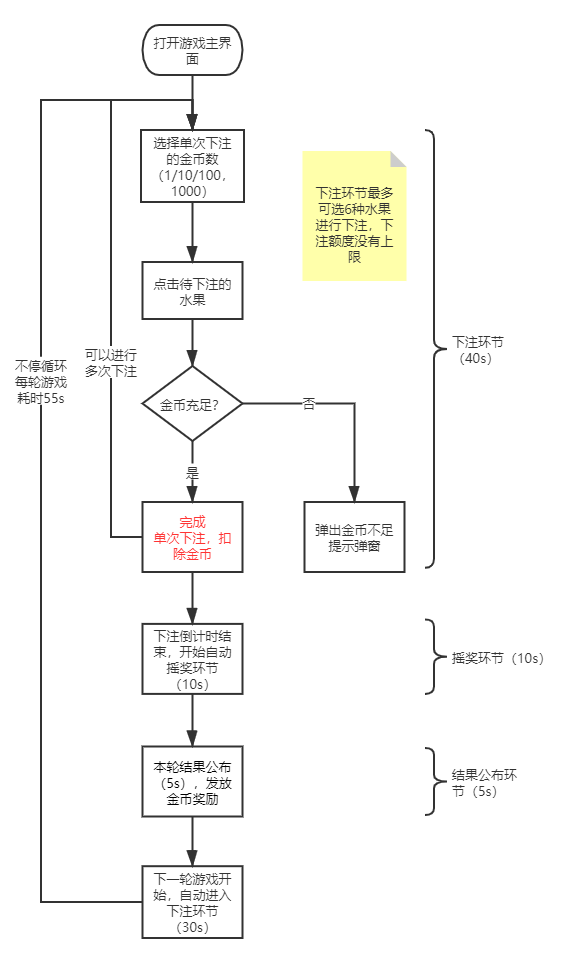
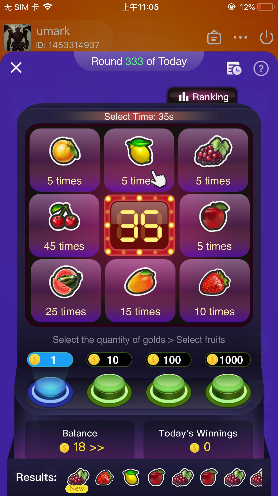
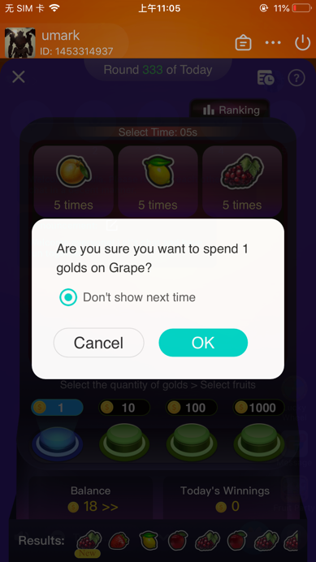
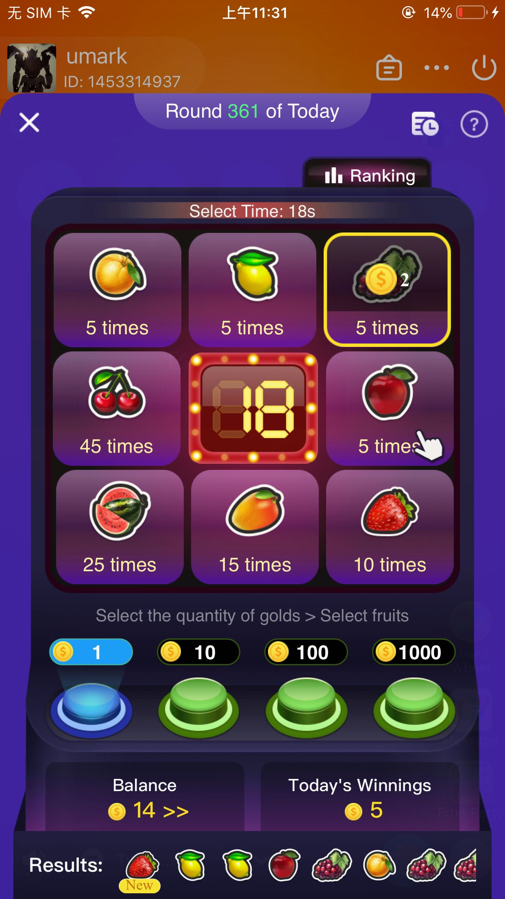
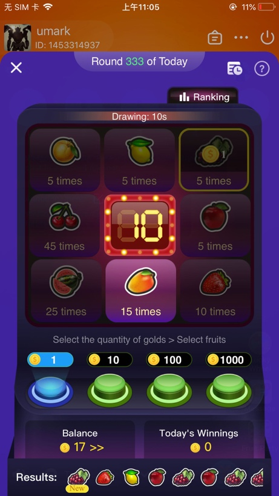
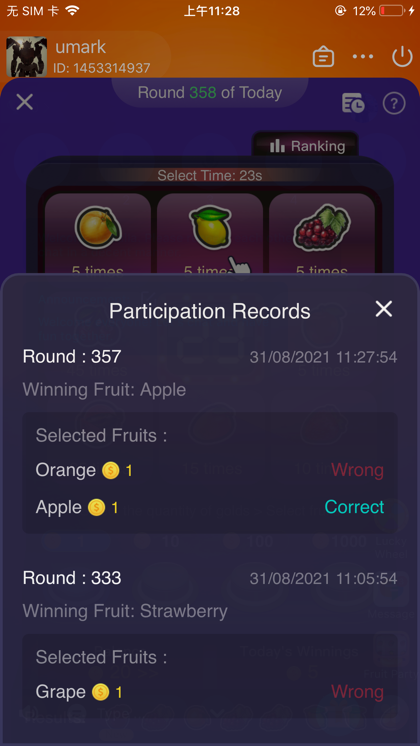
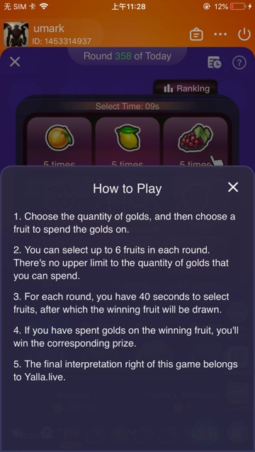
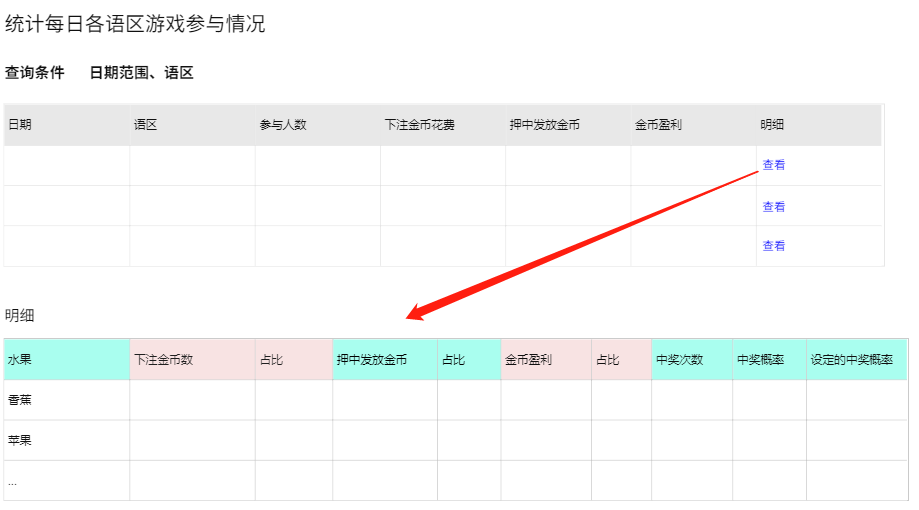
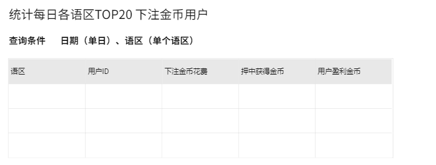

# 房间游戏（水果机 / 动物机 / 水果派对） — V1.0.0 原文切片

> 状态：`history`（非权威） · 来源见正文

## 3.15第十五部分 房间游戏-水果派对

3.15第十五部分 房间游戏-水果派对

3.15.1 功能概述

房间内新增小游戏“水果派对”，采用H5制作，以便于游戏的调整迭代

3.15.2游戏玩法流程图

3.15.3游戏入口

| 功能描述 | 游戏入口放在房间侧边栏的最后一位 |
|---|---|
| 优先级 | 高 |
| 输入/前置条件 | 进入房间 |
| 需求描述 | 由于是H5页面，因此加载资源过程获取需要有一个加载样式； |
| 输出/后置条件 | / |
| 补充说明 | / |

3.15.4游戏主界面介绍

| 功能描述 | 游戏主界面的简要介绍 |
|---|---|
| 优先级 | 高 |
| 输入/前置条件 | 点击房间侧边栏下方的游戏入口 |
| 需求描述 | 「图1」 如上「图1」所示，页面顶端显示正在进行游戏轮次，时间以自然日GMT+3的时间为准；more 点击【排行榜Rank】按钮，向上弹出“今日收益排行榜”页面，详见3.1.8 点击【参与记录】按钮（右上角），向上弹出我的“参与记录”，详见3.1.9 点击【？】按钮，向上弹出游戏规则说明页面，详见3.1.10 页面的主要区域为水果转盘，依次顺时针展示8种备选水果及对应的奖励倍数，如下表所示： 转盘内还会有倒计时显示。若当前为下注环节，显示下注剩余时长倒计时；若当前为摇奖环节，显示结果公布倒计时； 转盘下方为单次下注的金币数选择区域。共4个选项可供选择，分别为10金币、100金币、1000金币、10000金币（下注金币档位待定）。默认选中10金币，点击单选切换； 10金币 100金币 1000金币 10000金币 显示操作提示语，文案为“先选择花费的金币数，然后选择水果” 显示金币余额，以及【充值】按钮，点击关闭游戏弹窗，进入金币充值页； 需显示今日收益。今日收益指自然日当天（GMT+3）押中水果获得的金币总收益（通过游戏获得的收益），不需要扣除花费的金币； 需显示最近10轮游戏的结果，按照由近到远依次排列（结果倒叙排列），其中最新1轮的结果上需显示“New”标签，如果一排展示不开支持左右滑动； |
| 输出/后置条件 | 点击背景，或者关闭按钮，关闭游戏界面； |
| 补充说明 | / |

3.15.5下注环节

| 功能描述 | 先选择单次下注的金币数，然后选择要下注的水果，此阶段40s |
|---|---|
| 优先级 | 高 |
| 输入/前置条件 | 上一轮游戏结束，自动开启下一轮游戏，进入下注环节 |
| 需求描述 | 「图1」                            「图2」 「图3」 在下注环节（共40s）最多可以选择6种水果进行下注，下注额度没有上限，当下注金额不足时toast提示“金币不足”； 下注时，首先要选择单次下注花费的金币数（下方按钮，默认选择为1金币），然后再选择要下注的水果。单次下注花费的金币数选择按钮，在下注后保留上次的选中状态。离开房间后，可以不保留，重新回到1金币； 点击需要下注的水果，出现如「图2」所示的确认下注弹窗，默认勾选“不再提示”，可手动取消； 若当前勾选了“不再提示”，点击【确认】按钮，执行扣除金币的逻辑（金币不足时，出现金币不足弹窗），在接下来的下注中将不会出现此确认弹窗，即点击需要下注的水果直接执行扣除金币的逻辑。离开房间后，不保留“不再提示”的状态，下注时仍会出现此弹窗； 若取消了“不再提示”的勾选状态，点击确认按钮，执行扣除金币的逻辑。在下次下注时，仍然会出现此确认弹窗，并且不再勾选“不再提示”； 如「图3」所示，已经下注的水果上会显示下注的金币数（需要已下注的效果）。可以对单个水果进行多次下注（金额累加），没有上限。比如可以给“香梨”先下注10金币，再下注100金币，最后下注100金币，共210金币，这时“香梨”上会显示“210金币”； 每轮游戏支持选择6种水果进行下注，当下注第7个水果时，toast提示“每轮游戏最多可下注6种水果”，不执行下注逻辑； 在下注环节，转盘上会有“手势”动画，如「图1」，按照顺时针方向每隔1秒进行跳动，循环显示，为引导用户进行下注，更玄学，以UI效果图为准； |
| 输出/后置条件 | / |
| 补充说明 | / |

3.15.6摇奖环节

| 功能描述 | 摇奖环节由系统完成，需要有摇奖动画，此阶段10s |
|---|---|
| 优先级 | 高 |
| 输入/前置条件 | 下注环节完毕，自动进入摇奖环节 |
| 需求描述 | 「图1」 下注环节结束后，自动进入摇奖环节，摇奖环节持续10秒。在这10s内不能够下注（点击水果无效果），“手势”动画消失，摇奖的形式见效果图； 待摇奖倒计时结束后，最终选中的水果即为本轮的中奖水果； 各水果的摇中概率如下： |
| 输出/后置条件 | / |
| 补充说明 | / |

3.15.7公布结果环节

| 功能描述 | 公布本轮游戏的中奖结果，此阶段5s |
|---|---|
| 优先级 | 高 |
| 输入/前置条件 | 摇奖环节结束，公布本轮游戏结果 |
| 需求描述 | 「图1」 每轮的摇奖结果将以弹窗的形式进行公布，仅打开此游戏的用户才会自动弹出结果弹窗。结果弹窗将会展示5s，无法手动关闭，倒计时结束后自动关闭，开启下轮游戏，进入40s下注环节； 结果弹窗上展示标题、倒计时、本轮的中奖水果，用户自己的参与情况，以及每轮游戏的获奖TOP3玩家； 用户自己的参与情况可分为3种，分别为：未参与、参与未中奖、参与并中奖 若未参与，显示为“你并没有参与本轮游戏”； 若参与未中奖，显示为“抱歉，本轮没有中奖”； 若参与且中奖，显示为“恭喜，本轮游戏获得XXX金币奖励”，其中XXX为中奖水果的押注金币数*奖励倍数； 4.每轮游戏的收益TOP3玩家为用户所在语区本轮所有语区中奖水果押注最多的前3位用户获得奖励收益最高的前三用户，并按本轮收益降序排列，押注金额相同时，等级经验值越高，收益相同时， 注册早的账号，排序越靠前。每个用户需展示名次、头像、昵称、性别、贵族勋章（有则显示）、本轮收益总额（押注金币数*中奖倍数）。若中奖用户不足3位，显示全部的中奖用户；若没有中奖用户，显示占位语“本轮没有中奖用户”； |
| 输出/后置条件 |  |
| 补充说明 |  |

3.15.8每日收益排行榜

| 功能描述 | 展示当天所有语区收益最多的前10位用户，数据按照用户所在的语区进行分区 |
|---|---|
| 优先级 | 高 |
| 输入/前置条件 | 点击游戏主界面上【排行榜】按钮，打开“今日收益排行榜”弹窗页 |
| 需求描述 | 「图1」 “今日收益排行榜”展示用户所在语区的今日游戏收益最多的用户，不扣除游戏花费。用户在单个语区的数据只统计用户在该语区参与游戏获得的金币收益，不统计其它语区的参与数据； 榜单最多展示前10名，前3位用户需突出展示。收益相同时，按照注册时间排序，注册早的排在前面；按照个人等级经验值排序，经验值越高，排列越靠前。若今日没有中奖用户，需显示占位图和占位语“今日还没有用户上榜”；不足10人显示全部； 上榜用户需展示排名、头像、贵族勋章（有则显示）、昵称、性别、今日收益总值； 榜单数据每5分钟更新1次； 浏览排行榜时，可以上下滑动查看列表； |
| 输出/后置条件 | 点击【X】按钮或者背景，关闭排行榜弹窗； |
| 补充说明 |  |

3.15.9我的参与记录

| 功能描述 | 展示我的游戏参与记录，最多展示最近的50条记录 |
|---|---|
| 优先级 | 高 |
| 输入/前置条件 | 点击游戏主界面上【参与记录】按钮，打开“参与记录”弹窗页 |
| 需求描述 | 「图1」 “参与记录”弹窗上展示我的游戏参与记录，最多展示最近的50条记录。参与记录为空时，显示占位图和占位语“没有任何参与记录” 参与记录按照参与时间顺序倒序排列。每条参与记录会显示此轮游戏结束的时间（精确到秒，按GMT+3当地时间）、游戏当日轮次、摇出的水果（结果）、本轮下注情况（水果名+对应的下注金币数）。其中，中奖水果显示“正确的选择”字样，非中奖水果旁显示“错误的选择”； 浏览参与记录列表时，可以上下滑动查看列表； |
| 输出/后置条件 | 点击【X】按钮或者背景，关闭当前弹窗； |
| 补充说明 |  |

3.15.10游戏规则说明

| 功能描述 | 游戏规则说明弹窗，仅作纯展示 |
|---|---|
| 优先级 | 高 |
| 输入/前置条件 | 点击游戏主界面上【？】按钮，打开“游戏规则”弹窗页 |
| 需求描述 | 「图1」 游戏规则弹窗上将会对游戏进行文字说明 规则文案如下： 请选择下注的金币数和水果； 下注环节持续40s，之后会公布本轮摇奖结果； 所有玩家押中水果，将会获得相应的奖励； 你可以同时下注6种水果，下注金币数没有上限； Hayyakom拥有对此游戏的解释权； |
| 输出/后置条件 | 点击【X】按钮或者背景，弹窗关闭 |
| 补充说明 |  |

3.15.11数据监控（后台）

统计每日各语区游戏参与情况，如下表1。其中“语区”字段指用户所在语区，同个用户在多个语区的参与数据计入对应的语区，比如用户A当前在英语区下注10金币，在阿语区下注100金币，那么10金币计入英语区，100金币计入阿语区；

统计每日各语区TOP20下注用户的参与情况，如下表2。其中“语区”字段指用户所在语区，同个用户在多个语区的参与数据计入对应的语区；

「图1」

「图2」

3.15.12水线控制

| 功能描述 | 水线控制，防止亏损 |
|---|---|
| 优先级 | 高 |
| 输入/前置条件 | / |
| 需求描述 | 水线：即止损线为0金币（0金币）； 奖池：5000000金币（500w金币）【待定】； 当本轮游戏结后，奖池金额低于水线（水线0金币），下一轮游戏则按照最优解为结果，直到奖池金额高于水线后，按照正常概率计算； 当奖池金额达到上限500w金币之后，则清零从新计算，以此往复； |
| 输出/后置条件 | / |
| 补充说明 | 最优结果：返奖给用户金币最少的选项（多个都为最少则随机一个）； |
