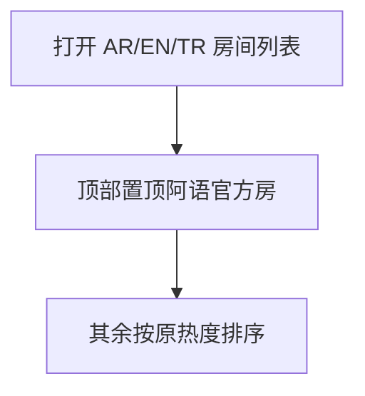

# 房间列表置顶 · 现行说明

> 派生阅读层。改规则仍改 [`../PRD.md`](../PRD.md)。拍板 RQ-10、RQ-21。

## 元信息
<!-- chunk:no -->

| 字段 | 值 |
|---|---|
| 功能 ID | `room-list` |
| 截止版本 | 已收录 V1.4.0 |
| 权威 | 派生 |
| 状态 | pending-review |

---

## 范围
<!-- chunk:default section=scope id=room-list.scope -->

覆盖 App 房间列表官方房置顶。无游戏房列表坑位，无主播房列表坑位。

---

## 总流程
<!-- chunk:default section=flow id=room-list.flow-main -->

阿语、英语、土语房间列表顶部强制置顶目前唯一的阿语官方房，不受热度排序影响。英语、土语没有自己的官方房，新人礼包会推荐进阿语官方房；置顶是为了回首页仍能看到该房。

---

## 业务逻辑

### 官方房置顶 {#logic-pin}
<!-- chunk:default section=logic id=room-list.logic-pin -->

阿语、英语、土语对应房间列表顶部置顶目前唯一的阿语官方房。技术方案为强行置顶，列表排序不会因为热度影响。没有游戏房模式坑位，没有主播房坑位。

---

## 客户端页面

### 房间列表 {#page-list}
<!-- chunk:default section=page id=room-list.page-list -->

列表第一位固定为该阿语官方房，其后条目按原列表规则。本功能不另做独立页面。

---

## 后台影响
<!-- chunk:default section=admin id=room-list.admin-impact -->

官方房 / 运营房配置见 [`../../admin/PRD.md#admin-rooms`](../../admin/PRD.md#admin-rooms)。本文不复制后台字段。

---

## 关联影响

### 关联 · 运营后台 {#related-admin}
<!-- chunk:related-row section=related id=room-list.related-admin target=admin -->

官方房 / 运营房配置。跳转 [`../../admin/brief/current.md#admin-rooms`](../../admin/brief/current.md#admin-rooms)。

### 关联 · 房间 {#related-room}
<!-- chunk:related-row section=related id=room-list.related-room target=room -->

置顶的是房间大厅列表中的官方房。跳转 [`../../room/brief/current.md`](../../room/brief/current.md)。

### 关联 · 基建 {#related-infra}
<!-- chunk:related-row section=related id=room-list.related-infra target=infra -->

新人礼包推荐进入阿语官方房，与本置顶配套。跳转 [`../../infra/brief/current.md`](../../infra/brief/current.md)。

---

## 相对变化
<!-- chunk:changelog section=changelog id=room-list.changelog -->

相对原文：删除游戏房 / 主播房列表坑位。

---

## 原文
<!-- chunk:no -->

[`../PRD.md`](../PRD.md) · [`../changelog.md`](../changelog.md) · [`../history/`](../history/)

---

## 计划预览
<!-- chunk:no -->

无。

---

## 待校对
<!-- chunk:no -->

无。
