# 房间
> 功能 ID：`room` · 权威：`current` · 产品：Hayyo · 更新：2026-09-16  
> 现行规则收到 V1.4.0。旧版原文见 [`history/`](history/)。叠稿回退见 [`history/PRD.stacked-2026-09-16.md`](history/PRD.stacked-2026-09-16.md)。  
> 拍板记录见 [`../../CONFIRMED.md`](../../CONFIRMED.md)。未收入版本或原文未写的接口/字段：不编造。

## 范围
- App 房间：大厅、进房、麦位、资料、礼物、密码房、音乐、发图、侧边栏活动、计分牌、周星、爆奖礼物客户端、房间内游戏入口。
- Party 可见房间都是语聊房。运营侧分类仍有官方房 / 运营房 / 币商房；密码房是房间属性，不是房间模式。
- 房间内游戏仍在：[`../room-game/PRD.md`](../room-game/PRD.md)、房间内休闲面板、幸运数字 / 掷色子。
- 无游戏房模式，无语聊↔游戏切换，无游戏房专属背景/榜单入口。无主播、无工会/公会、无家族。无房主专属麦、老板位、自动上麦。礼物面板无头饰卡 tab。
- 官方房满员/邀请 = **15** 个已占麦；非官方 = **8**。
- 房间列表置顶见 [`../room-list/PRD.md`](../room-list/PRD.md)，本文不复制置顶全文。
- 爆奖礼物后台见 [`../admin/PRD.md#admin-gift-burst`](../admin/PRD.md#admin-gift-burst)；本文只写客户端。

## 关联后台
- 后台页面与配置以 [`../admin/PRD.md`](../admin/PRD.md) 为准；本文只写 App 侧规则。
- 房间管理 / 运营房 / 考核 / 标签 / 广播：[`../admin/PRD.md#admin-rooms`](../admin/PRD.md#admin-rooms)
- 礼物管理：[`../admin/PRD.md#admin-gifts`](../admin/PRD.md#admin-gifts)
- 爆奖礼物后台：[`../admin/PRD.md#admin-gift-burst`](../admin/PRD.md#admin-gift-burst)
- 房间侧边栏活动：[`../admin/PRD.md#admin-activity`](../admin/PRD.md#admin-activity)

## 规则

图相对路径为 `images/`。

### 房间大厅

| 功能描述 | 应用内主界面内容和模块 |
|---|---|
| 优先级 | 高 |
| 输入/前置条件 |  |
| 点击“房间奖励”按钮需求描述 | 图1                 图2 图3                 图4 官方房列表置顶见 [`../room-list/PRD.md`](../room-list/PRD.md)，本文不重复置顶全文。 用户打开新版本APP停留页面： 1. 用户注册当天：用户登陆、杀掉程序重新进入APP、退出重新登陆 默认进入“推荐”列表；本次登陆期间离开推荐页面再次返回推荐页面 或 退到后台再次进入APP保留上一次tab选择； 2. 用户注册后次日及以后：杀掉程序重新进入APP保留上一次tab选择；退出重新登陆默认进入“推荐”列表；本次登陆期间离开推荐页面再次返回推荐页面 或 退到后台再次进入APP保留上一次标签选择； 房间大厅页包括六个主要模块：推荐房间列表、我关注的房间列表、[搜索]入口、国家筛选、[创建房间]/[我的房间]入口、banner位。（见图1） 点击顶部导航栏搜索按钮，进入搜索页面，见搜索 点击顶部导航栏筛选按钮，弹出筛选浮层，见国家筛选 推荐列表页面顶部支持后台配置banner图，未配置banner时不展示banner占位（见图1）；banner从右向左自动播放，每3s轮播下一张，最后一张循环到第一张。 Banner图加载失败时，有替代占位图，具体见UI出图 推荐、关注列表 1）用户注册第一次进入页面默认定位到“推荐”页面，再次进入停留上次离开时页面（推荐、关注页） 2）点击顶部导航栏标题或手势左右滑动可切换页面 3）在房间大厅页下拉可刷新房间列表，下拉时展示加载动画（见图4） 4）房间列表页中的房间均为当前所选语区的房间 5）在推荐、关注的某界面时，点击该界面对应的顶部导航栏中的按钮，该界面自动置顶且刷新界面；关闭应用进入页面自动刷新 6）列表内容： A. 列表中每一个房间卡片长宽固定（具体见UI出图），卡片上的信息包括：房间名、房间内总人数（包括房主）、房主在个人资料所选国家（未选不展示） B. 房间名显示在第一行，最大长度均固定，超出的部分用“…”代替 7）房间在服务端排序时，忽略被运营后台隐藏的房间，忽略房间内人数为0的房间。 A. 热度列表：热度值越高，排名越靠前。热度值一样，则随机排序 热度值 = n*0.1+a*500+b n = 近15分钟送礼总额(金币数) a = 当前房间内总人数 b = 运营后台增加/减少热度（热度值可以由运营后台调整，增加时为正数，减少时为负数。运营未设置时为0，运营一旦设置b的值后后对该房间永久生效） 我关注的房间列表排序： 房主在麦 根据房间热度值排序 关注列表-无关注房间时推荐数据排序规则见「关注列表优化」。 其他： 数据加载：客户端分页加载，每页加载20个房间数据，提前加载下一页的房间，加载期间展示加载图标； 若客户端展示完推荐列表的所有房间，底部文案提示“您已经到达底部。” 记录客户端已经拉取的房间数量n，客户端加载后续的房间（下一页）时，从服务端的推荐列表中第n+1个房间开始拉取，并去重已经拉取过的房间 官方房：官方房间展示“官方”标识，官方房间在列表排序可在后台对房间热度手动调整，官方房由后台配置 推荐列表排序（所有房间去重展示）： 列表根据房间热度进行排序； 列表不展示以下房间： 不展示密码房（不管是不是阿联酋用户查看或者阿联酋房间）； 不展示房间人数为0的房间； 不展示麦位无人的房间； 前 15个房间为 1 个官方房（推荐列表选择“全部”标签时固定第一个位置，选择标签或者国家筛选后根据实际筛选条件展示） + n 个 运营房 +（14-n）个根据热度从高到低的房间（详见上文热度列表）。 如果达到标准的运营房不足 n，则在列表中根据热度从高到低的房间补充。 运营房不足时由（14-n）个随机排序热度房补足。 暂定n=10，n服务端可调整 第16个房间起为剩余房间，按热度排序 “运营房”集合由运营后台“运营管理”取出，从中取出的“n个运营房”的标准需为： 麦上有人，非人满房 2.在房人数≥X且≤Y（由运营在“运营管理”列表推荐配置） 3.优先取与用户国家相同的“运营房”（A和B），若用户国家信息为空，执行4 4.然后取A级运营房，后取B级运营房（级别由运营标记，A级运营房质量更优），选取完的运营房仍为随机排列 币商房：该类型房间支持在审核期间服务端控制限制不在房间推荐列表展示，无法搜索到该类房间 房间在服务端排序时，忽略被运营后台隐藏的房间，房间人数为0的房间，暂时热度值计为0。 新版的推荐和热门列表，需要支持首页不显示以及首页隐藏功能 注： 在加载全页面数据、下拉刷新、上滑加载新数据时，有加载标识，具体见UI出图。 |
| 输出/后置条件 |  |
| 补充说明 | 服务端进房推荐逻辑与兜底逻辑区分语区 |

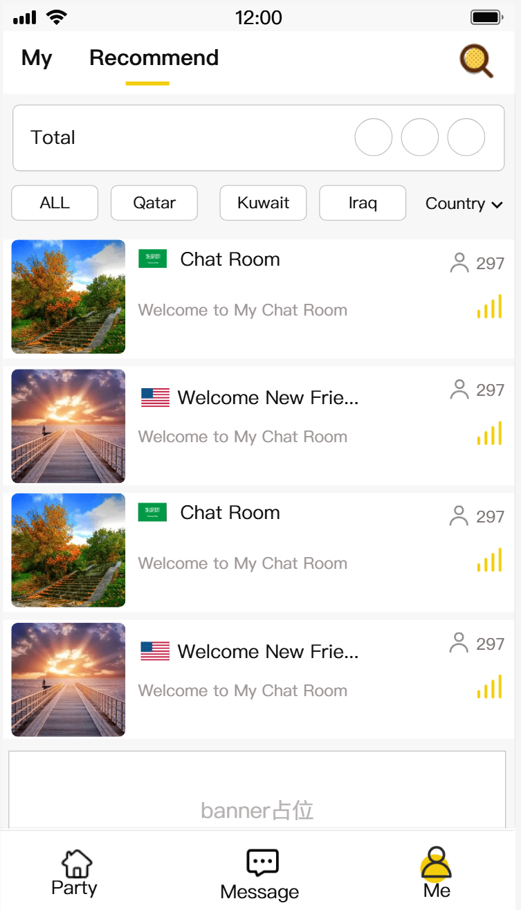

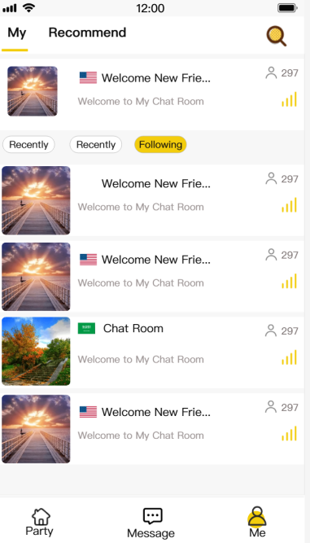

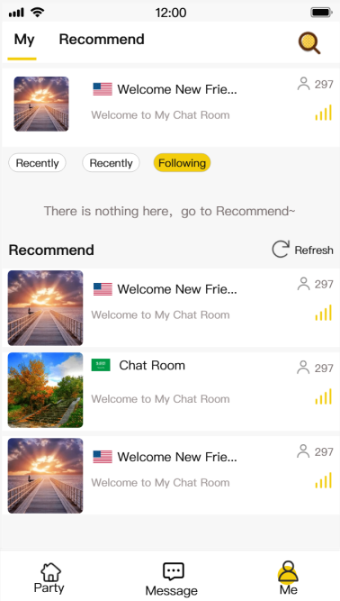

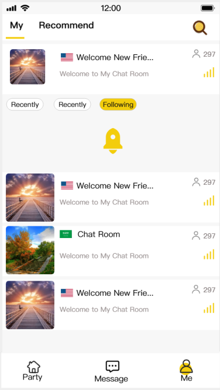

### 跟随好友进房

| 需求描述 | 房间大厅可以快速找到好友 |
|---|---|
| 优先级 | 高 |
| 输入/前置条件 |  |
| 需求描述 | 图1                     图2 房间大厅-我的、推荐、热门列表页面，悬浮贴边展示当前用户的在线好友在线浮层，见图1； 好友在线浮层展示内容：好友头像+音波动效图标+“找到我”文案；其中好友头像根据列表排序从右向左轮播展示； 点击在线浮层整个区域，页面由下至上弹出好友在线列表； 好友在线列表展示数据： 来源：当前在线且可“找到我”的用户； 排序：根据好友最近1次进房时间倒序展示； 展示内容：用户头像、头像框、用户昵称、用户所处房间（Party 可见房间均为语聊房；不展示 ludo 房、domino 房、桌球房）、“跟随”按钮；点击“跟随”按钮，页面跳转至对应好友所在的房间，若对应好友所处房间是密码房对应需要输入房间密码（详见密码房需求）； 每次打开当前列表数据需要刷新；列表支持分页加载数据，每次加载50条； 点击【图2】浮层外区域关闭当前浮层； 缩小房间悬浮窗（未退出房间）时浏览点击“进房”按钮也可以立即跟随用户进入其所在房间； |

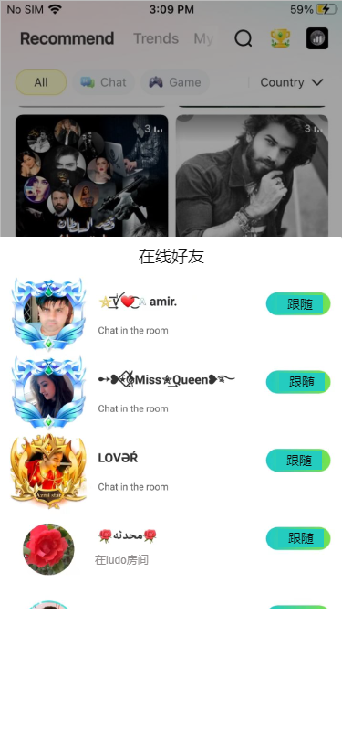

### 房间标签

| 需求描述 | 房间封面标签支持后台配置展示 |
|---|---|
| 优先级 |  |
| 交互原型 | 【图1】 |
| 需求描述 | 房间标签支持后台配置，并在客户端房间封面展示（具体展示详见UI稿） 支持标签在一段时间内展示（后台配置） 无游戏标签展示和逻辑； |
| 输出/后置条件 |  |
| 补充说明 | 官方房标签UI需要重新设计 |

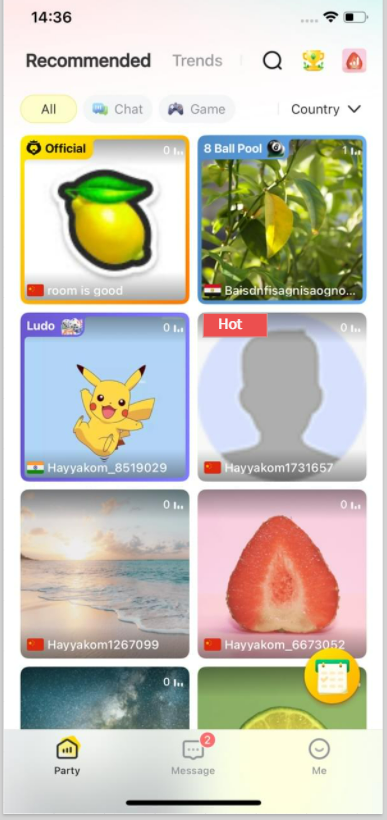

### 搜索

| 功能描述 | 房间 |
|---|---|
| 优先级 | 高 |
| 输入/前置条件 | 点击房间大厅页面-搜索按钮 |
| 需求描述 | 图1                            图2 图3                            图4 图5                            图6 图7 搜索页包括输入框、[取消]按钮、房间/用户切换Tab、搜索结果展示模块。进入搜索页时，输入光标自动聚焦于输入框，并弹出文字输入键盘。 输入框：占位语为“搜索房间或用户”，输入任何字符占位语消失，同时出现[一键清空]按钮。输入框最多可输入24位字符，超过限制后，再输入的字符不显示。输入框不允许输入换行。键盘上的[确认]按钮即为[搜索]按钮。[搜索]按钮的规则如下： 1）当用户未输入任何字符，或输入的只有空格时，[搜索]按钮为置灰不可点击状态。 2）如果用户输入字符前后有空格，搜索时删除前后的字符，比如用户输入“   123   ”，则只搜索与“123”匹配的结果。 3.  [取消]按钮：点击则返回到进入搜索页之前的页面。 4. 房间/用户切换Tab：通过点击切换。在房间下只展示搜索房间结果，在用户下只展示搜索用户结果。用户每次进入搜索页时默认为搜索房间。当用户搜索完房间或用户切换到另一个时，若另一个还未搜索过，则自动搜索并展示结果；若已经搜索过，则不用重新搜索，直接展示之前返回的结果。 搜索逻辑： 搜索房间： 搜索用户： 搜索结果展示模块：当用户点击[搜索]但还未获得搜索结果时，出现加载动画提示“搜索中...”（图2）。搜索结果最多展示前1000个，每页展示20个，继续下滑时加载下一页，加载时有“加载中”标识。搜索结果中与输入字符相同的字符高亮显示。 房间结果展示：每个房间卡片包括房间当前场景缩略图、房间标识、房间名、房间ID、当前入场人数、当前在房人数。点击房间卡片直接进入房间。 用户结果展示：每个用户卡片包括用户头像、用户名、用户ID。点击用户卡片直接进入相应的个人主页。 当没有匹配的搜索结果时，提示“无搜索结果”（图7）。 |
| 输出/后置条件 |  |
| 补充说明 |  |

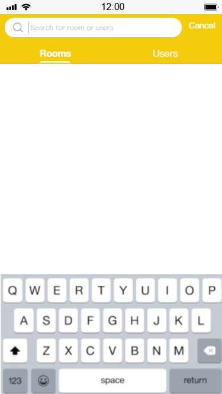

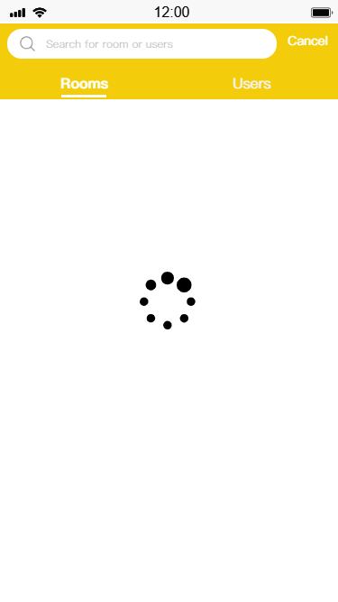

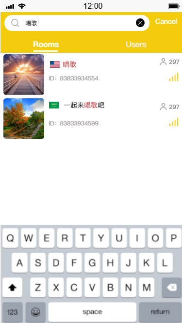

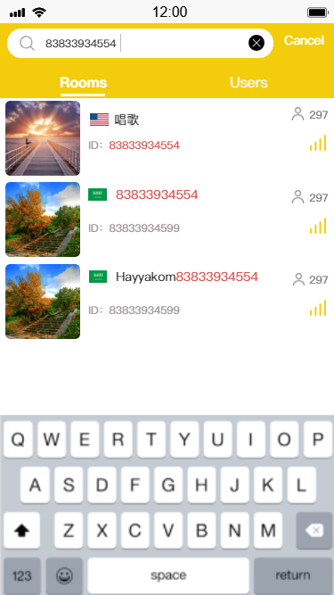

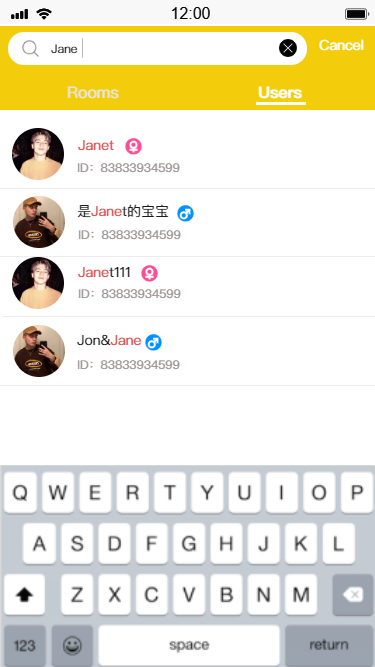

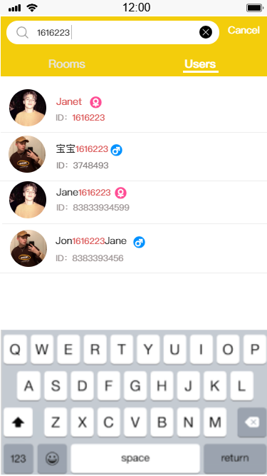

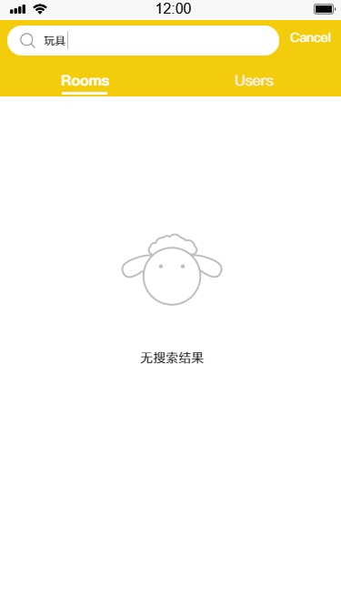

### 国家筛选

| 功能描述 | 房间大厅-推荐列表页对国家进行筛选 |
|---|---|
| 优先级 | 高 |
| 输入/前置条件 |  |
| 需求描述 | 图1                     图2 房间推荐列表页面默认展示所有国家地区的数据 国家仅展示自己语区对应国家选项 国家筛选交互： 国家仅支持单选，不可反选； 新注册用户登陆、杀掉程序重新登陆、退出重新登陆 默认选中“全部”国家，选中“全部”国家时，国家筛选图标状态见图1筛选栏右侧图标；本次登陆期间离开推荐页面再次返回推荐页面保留上一次国家选择； 点击国家筛选按钮弹出国家筛选浮层，浮层展示及交互操作同线上国家筛选；选择国家A后，国家筛选图标展示当前已经筛选的国家的图旗+箭头图标，见图3、图5筛选栏右侧图标；再次点击国家筛选图标可更换筛选，更换国家筛选流程同线上更换国家筛选流程； 上滑推荐列表数据时，筛选栏跟随列表数据一起上移直到滑动到顶部，固定在顶部，见图4、图5；下滑推荐列表数据至第一页时，筛选栏跟随列表数据下移直到图1位置后固定不再下移； 标签筛选与国家筛选可同时生效 支持房间列表筛选的国家： 待补充 |
| 输出/后置条件 |  |
| 补充说明 |  |

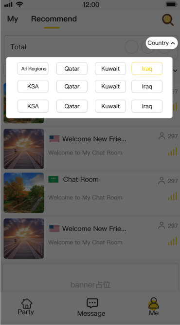

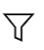

### 创建房间

| 功能描述 | 创建房间/进入自己房间 |
|---|---|
| 优先级 | 高 |
| 输入/前置条件 | 点击房间大厅顶部导航栏-房间按钮 |
| 需求描述 | 图1                              图2 图3                         图4 进入当前页面房间ID为用户ID（若本次未创建房间，下次创建房间时，房间ID不变） 房间头像展示创建房间用户的头像、房间名称展示用户昵称、房间公告展示“欢迎大家！我们一起来聊天聚会吧~”（间图1） +点击房间名称或房间公告输入框，自动弹出手机键盘（见图3、图4），清空输入框内容；并展示引导文案（灰色展示）。房间引导文案：给你的房间起个名字吧~；公告引导文案：简单告诉大家房间内的主题或活动，能更好的吸引其他用户进房哦~（见图3、图4） 1）房间名称输入框右侧展示：当前已输入字符数量/可输入字符剩余数量（跟随输入字符变动）；点击删除按钮可清除已输入内容 2）房间公告输入框右侧展示：当前已输入字符数量/可输入字符剩余数量（跟随输入字符变动）； 3）房间名称最多支持输入24个字符、房间公告最多支持输入150个字符 5. 点击房间底部创建房间按钮判断是否有房间名称或房间公告，若无房间名称或房间公告则【toas提示】：请填写房间名称/房间公告；若已填写房间名称或房间公告，则成功创建房间，页【toast提示】：创建成功，页面跳转房主房间页面，详见房间界面排版 注： 上传完成头像后立即传给第三方鉴黄，若第三方判断该图片为问题图片，toast提示“很抱歉，您上传的照片违规，请重新上传！”（鉴黄逻辑参考Yalla） 填写房间标题或公告保存时立即过滤敏感词库（详见屏蔽词规则），若判定输入文案涉及敏感，toast提示“很抱歉，您输入的文案有敏感词，请更换文案” |
| 输出/后置条件 |  |
| 补充说明 | 默认房间名 / 后台重置前缀见 [`../infra/PRD.md`](../infra/PRD.md)，前缀为 `player`。 |

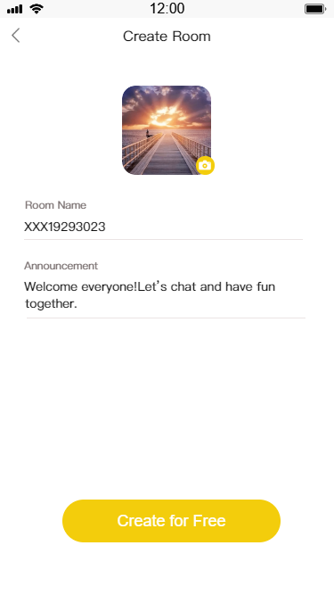

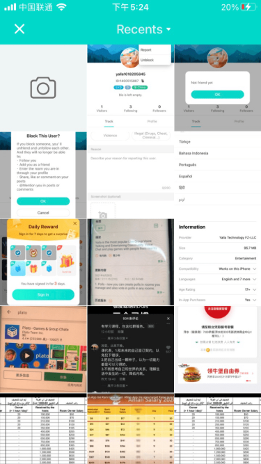

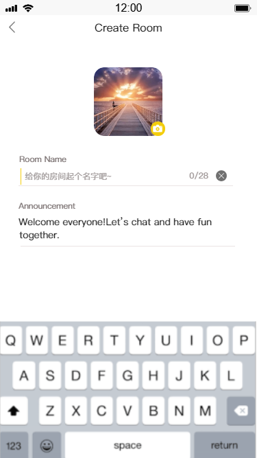

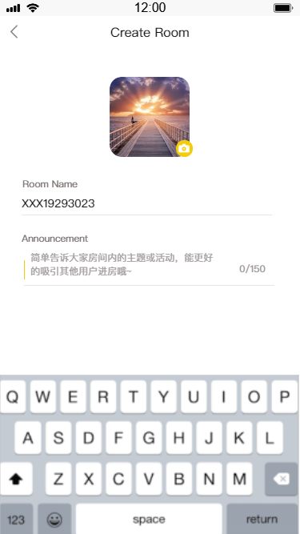

### 进房规则

| 功能描述 | 用户点击进入某个房间时，判定是否符合进房条件 |
|---|---|
| 优先级 | 高 |
| 输入/前置条件 | 点击房间大厅列表某个房间 |
| 需求描述 | 用户在房间大厅点击房间时，判定用户是否能进入房间： 如果用户被该房间房主踢出房间，且时间在2个小时内，【Toast】提示“您暂时不可以进入该房间”。 当该房间总在房人数到达上限时（上限50人，可服务端配置），【Toast】提示“该房间人数已满，请稍后再试”。房主、管理员可以无视房间人数限制，随时进入房间，进入后房间外显总人数为房间内实际总人数（可以超过上限）。 房主进房后不上麦；无房主专属麦、无自动上麦。 官方房间同时在线人数上限为2000人 |
| 输出/后置条件 |  |
| 补充说明 | 因技术压力暂定全房送礼一次支持500人 |

### 房间界面排版

| 功能描述 | 房主端、麦上嘉宾端、观众端界面排版 |
|---|---|
| 优先级 | 高 |
| 输入/前置条件 | 点击房间大厅顶部导航栏-房间按钮、点击房间大厅房间列表某一房间 |
| 需求描述 | 图1 图3 （嘉宾）            图4（观众） 顶部导航栏： 房间顶部导航栏左边展示房间头像、房间ID、房间名称、关注按钮（仅房主端无关注按钮）； 右边展示公告编辑/查看入口、分享房间至第三方按钮、关闭房间按钮 无房间顶部切换游戏模式入口；无房间家族入口；无房间俱乐部成员标识。 在线用户头像：房间顶部导航栏下面右边展示房间在线用户头像，最多展示5个用户头像，最右边展示当前房间所有用户数（根据房间用户出入房间实时变动） 麦克风区域展示内容：官方房固定 15 麦，一排 5 个；非官方房 8 麦。房主/管理员不能改麦位数。房主和嘉宾可以上任何麦位。无房主专属麦。麦上表情、头像框、计数器自适应；侧边栏加高。详见「官方房 15 麦」。 房主成功创建房间并进入房间内后不上麦；每次退出房间后再次进入房间也不自动上麦。 麦位展示内容： A. 展示上麦用户的头像和昵称，下麦后展示空麦位并展示麦位序号 B. 若麦位都为空麦位，从左至右展示麦位序号 消息区：麦位下方展示房间发言消息区，房间用户每发送一条消息，消息区消息自动向上滚动展示；用户（包括房主）进入房间后房间自动发一条警示消息，警示消息文案为：欢迎来到Hayyo，请大家相互尊重，禁止涉黄、暴力、侮辱和谈论敏感话题。文案高亮显示，字体颜色详见UI图。 底部操作栏：房间界面底部展示底部操作栏，从左到右分别为房间静音按钮、发消息按钮、麦克风控制按钮（开麦、闭麦，仅上麦时和嘉宾端有）、送礼按钮、消息入口按钮（常驻入口，未读消息数量超过99条时展示“99+”） |
| 输出/后置条件 |  |
| 补充说明 |  |

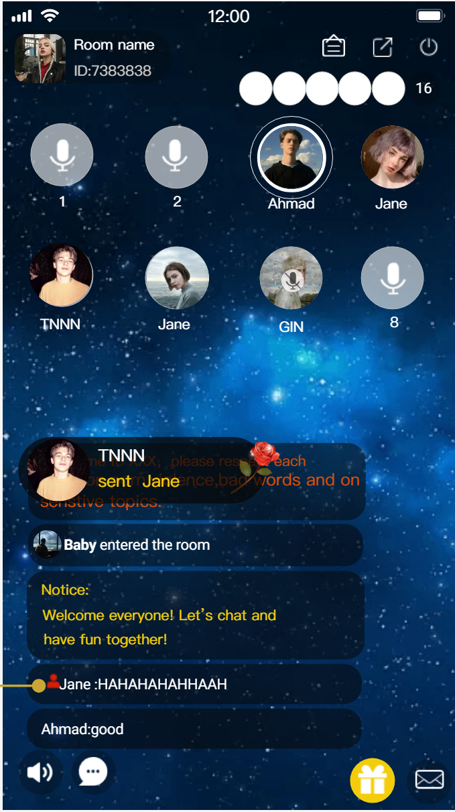

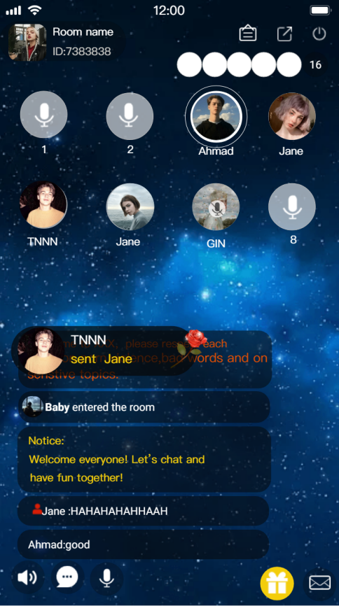

### 顶部状态栏

| 功能描述 | 房间顶部状态栏功能及展示 |
|---|---|
| 优先级 | 高 |
| 输入/前置条件 | 进入房间 |
| 需求描述 | 图1                           图2（观众） 顶部状态栏（图1）包含：房间名（房间资料入口）、[关注房间]按钮（房主无）、[关闭房间]/[最小化房间]按钮。顶部状态栏下方有[在房人数]标识/按钮。 房间名：最小与大宽度固定，若房间名长度超过最大宽度，则从右向左滑动播放，滑动到尾部停止2s，重新从头到尾滑动。点击房间名查看房间资料（见查看房间资料）。 [关注房间]按钮：有三个状态，如下表： 用户未关注房间时，显示状态1，点击判定用户已关注的房间是否达到上限5000，如果已达到【Toast】提示“您关注的房间已达上限”；如果未达到5000上限，则完成关注房间操作： 此处的[关注房间]变为状态3； 关注的房间出现在房间大厅-关注列表里； 房间资料页中的[关注房间]按钮由状态1变为状态2 [公告]按钮：点击显示房间公告浮层。公告浮层长度固定，高度有最大值和最小值，根据内容量纵向延长收缩，达到最大值时出现滚动条，可滚动查看（具体参考UI出图）。仅房主有[取消][保存]按钮。点击浮层外任意区域收起浮层。 房主点开公告            普通用户点开公告 房主未输入公告               房主 1）如果房主没有修改过公告，或者房主将公告设置为空，则公告内容区域占位文案为“请输入房间公告”。 A. 房主点击文本输入框自动弹出字母键盘，输入光标自动聚焦在文本输入区最后一个字符后面。 B. 文本输入区高度固定，超过可显示区域时出现滚动条可滚动查看。输入区下方有X/Y字数提示，X为当前字符数，Y为最多允许字符数150，达到上限后再输入则不显示。达到行数限制时再输入则不显示。 C. 点击[保存]后弹窗消失。【Toast】提示“公告已保存”。房间内实时更新房间公告，所有非房主用户的[公告]按钮旁边出现提示标识（见下图），点击查看公告后提示标识消失，且房间中用户点开查看公告为最新的房间公告。点击[取消]后不保存内容，弹窗消失。 2）若房主未编辑公告内容（公告内容为空），普通用户点开公告展示占位文案：“欢迎大家！我们一起来聊天聚会吧~” 分享房间：点击分享按钮，房间底部向上弹出分享浮层，再次点击浮层外任意区域收起浮层。（弹窗见下图） 分享房间弹窗 弹窗标题为“分享”。点击Facebook图标，加载跳转facebooke页面。如果手机尚未安装该第三方平台软件，则【Toast】提示“未安装该软件”，并且不进行跳转。 分享至第三方信息：分享文案为“XXX邀请您进入“YYY”的房间”，XXX为邀请人的用户名，YYY为房间名；分享图片为房间头像、Hayyo logo 在第三方平台点击房间链接时进入H5网页，H5网页包含房间名、房间ID、默认背景图、发起邀请用户的头像和用户名、[进入房间]按钮、Hayyo的Logo和Hayyo App文案（如下图），点击[进入房间]按钮时进行判断，如果用户已下载软件则直接进入房间，未下载软件则进入应用商店Hayyo下载页。 H5网页 [在房人数]标识+按钮：位置固定。实时显示房间内总人数，点击从房间底部向上弹出在房用户弹窗（见下图）。 图8-在房用户弹窗 弹窗高度固定，内容超过显示高度出现滚动条。弹窗标题为“在房用户”，旁边显示在房总人数。 观众列表展示内容：列表顶部展示房间在线人数总数量、展示用户头像、用户昵称、用户在房身份标识（房主、管理员）、用户ID、用户性别 点击用户头像，房间底部弹出用户个人资料弹窗见查看用户资料，用户列表弹窗不收起 用户列表排序：根据进房时间顺序，越晚进入越靠前（房主置顶）；后续排序优化见「房间用户列表排序优化」。 每次点开用户列表数据自动刷新，分页加载用户列表数据，每页30条，加载数据时展示“加载中...” 被房主禁言的用户右侧有房间禁言标识。房间禁言规则详见查看用户资料。 在线列表无房间俱乐部/家族成员标识。 退出房间/房间最小化：点击关闭房间按钮，弹出关闭房间浮层选项：最小化房间按钮、关闭房间按钮 最小化房间：点击最小化按钮，退出房间，页面返回进入房间时页面，房间缩小化展示至页面右下角，可手动拖动；最小化期间不影响收听房间声音（若用户最小化之前设置房间静音则听不到声音），点击最小化浮窗的关闭按钮可退出房间，最小化房间浮窗消失。 点击关闭房间按钮              房间最小化 关闭房间：点击浮层关闭房间按钮弹后退出房间，页面返回至进入房间前停留页面 |
| 输出/后置条件 |  |
| 补充说明 |  |

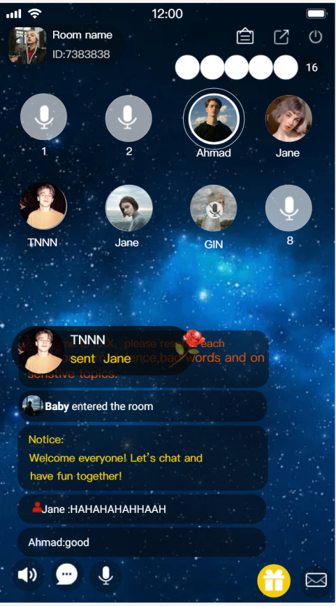

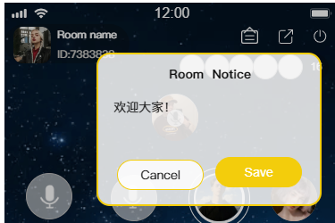

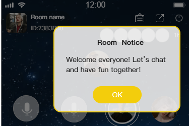

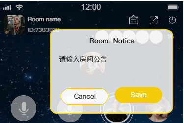

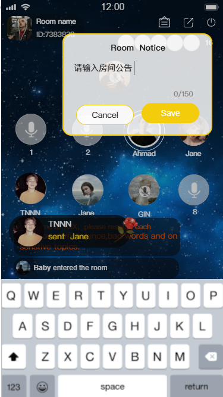

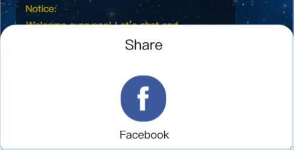

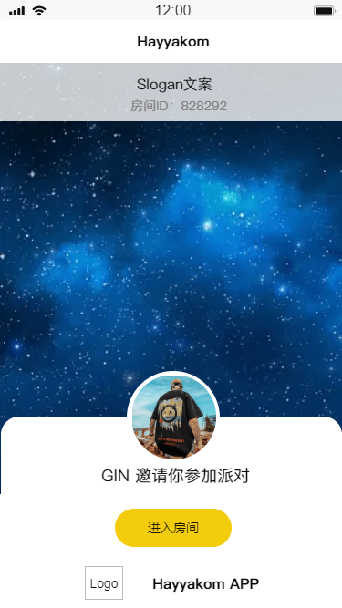

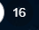

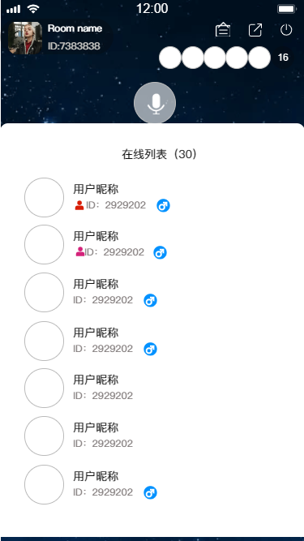

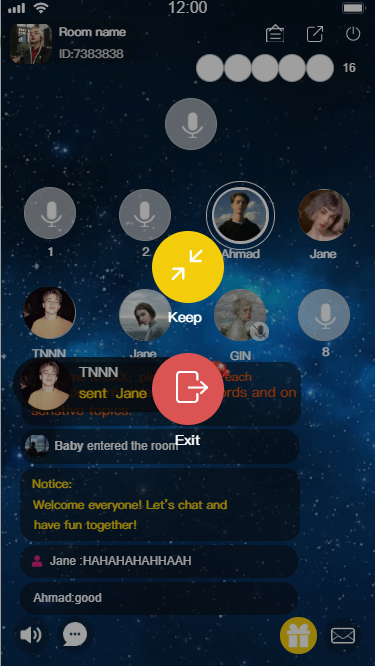

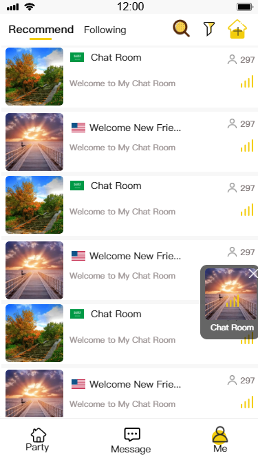

### 消息展示区与底部操作栏

| 功能描述 | 房间内消息展示板信息展示、按钮操作规则 |
|---|---|
| 优先级 | 高 |
| 输入/前置条件 | 进入房间 |
| 需求描述 | 图1（房主）                  图2（嘉宾） 图3（观众） 消息展示区： 消息展示板默认自动滚动显示最新消息。用户将消息展示板向下滑动任意距离时，则不再自动滚动。有新消息则显示[XXX条新消息]按钮（X为不自动滚动之后的新消息数量，超过99条后显示99+），点击按钮快速滚动到底部最新消息，并再次自动滚动显示最新消息。当消息处于非自动滚动的状态，弹出字母/表情键盘时不自动滚动到底部最新消息，若用户发送消息，则快速滚动到底部最新消息。 消息展示板客户端本地展示最新200条，每保存300条删掉100条。消息类型包含：普通文字/表情消息、送礼消息。 1）普通文字表情消息：包含用户头像、用户名、用户身份标识（房主、管理员）消息内容。其他人消息与自己消息均靠左显示，样式一样。消息气泡的最小宽度和最大宽度固定由UI给出。 2）欢迎进房消息：可被其他普通消息顶上去，UI上与普通消息有区别。文案为“欢迎来到Hayyo，请大家相互尊重，禁止涉黄、暴力、侮辱和谈论敏感话题。”用户进入房间时显示,仅自己可见。 3）送礼消息：与普通消息类型一样。消息的发送者显示送礼者的头像和用户名。消息气泡内显示被送礼者的用户名、礼物图片、礼物数量。用户名过长时隐藏用户名后面几位，用“...”代替。跑道不被消息展示板遮挡，可被浮层和弹窗遮挡。跑道出现的动效和时间参考UI出图。 4）进房提示跑道：位置固定。有用户进入房间时触发，跑道文案为“XXX加入了房间”，XXX为用户名，跑道最大宽度固定，超过宽度时隐藏用户名后几位，用“...”代替。跑道不被消息展示板遮挡，可被浮层和弹窗遮挡。跑道出现的动效和时间参考UI出图。 底部操作栏： 静音按钮：底部操作栏最左边为静音房间按钮，进入房间后默认非静音状态，点击静音按钮立即关闭房间声音，房间内其他用户不受影响；再次点击该按钮关闭静音状态恢复房间原来声音 闭麦按钮：闭麦按钮仅用户上麦时展示；闭麦按钮有两个状态，分别是开麦中和闭麦中，点击来回切换。闭麦时不应用不获取用户的声音。开麦时正常获取。用户每次入场默认为开麦中。 输入框：输入框的占位语为“说点什么吧...”，点击输入框将消息展示板变为全屏状态，然后字母全键盘向上弹出，将底部功能栏与消息展示版中消息气泡向上推动（见下图）；点击[表情]按钮时向上弹出表情键盘，[表情]按钮变为[键盘]按钮，其他规则与点击输入框一样。 未输入内容                        输入内容 1）键盘弹出时输入框： A. 输入框最大高度固定，约为4行，超过时出现滚动条，允许上下滚动查看。 B. 输入限制如下： C.键盘收起时，若输入框的内容若未发送，输入框恢复默认状态且显示原占位文案，若输入框内输入内容，输入的内容保存至退出房间。 2） 输入时[发送]按钮： A. 当用户未输入任何字符、或只输入空格、换行时，[发送]按钮与键盘上自带的[发送]键为不可点击状态；否则为可点击状态。 B. 点击[发送]按钮，先进行发送消息时间间隔判断，若本次点击[发送]按钮与上次点击时间间隔不到1.5s，则【Toast】提示“请等待1秒钟”，若达到1.5s则发送方完成消息发送，在公屏上显示自己的消息。服务端收到消息后进行屏蔽词检测（详见屏蔽词规则），若通过则发送到房间内其他所有用户公屏，若不通过则不送达至其它用户（即其它用户看不见违规消息）。 C. 弱网/断网时：用户点击[发送]立刻发送消息，并在自己公屏显示。如果因为网络原因服务器无法接受并送达至其它用户，则不送达至其他用户，并在发送方屏幕上显示相应的弱网或断网状态。 3）字母键盘弹出时显示[表情]按钮，表情键盘弹出时显示[键盘]按钮，点击在两个按钮与键盘之间切换。字母键盘和表情键盘高度保持一致： 4）键盘弹出时，用户点击输入框、按钮、键盘以外任意区域，或点击键盘自带的收起按钮时收起键盘。 送礼按钮：送礼按钮有动画跳动效果，具体见UI出图。点击向上弹出送礼弹窗，送礼相关规则和功能见送礼。 消息按钮： 点击消息按钮弹出消息浮层，浮层页面内容同消息中心（详见消息中心需求） 消息中心列表有新的未读消息时，图标展示未读消息提醒标识，查看未读消息后未读消息提醒标识消失 |
| 输出/后置条件 |  |
| 补充说明 |  |

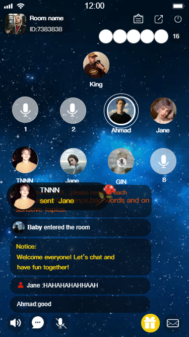

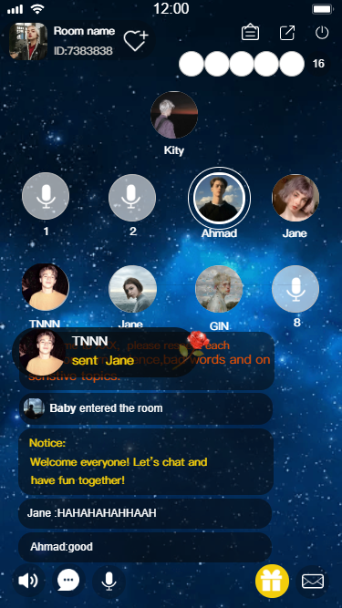

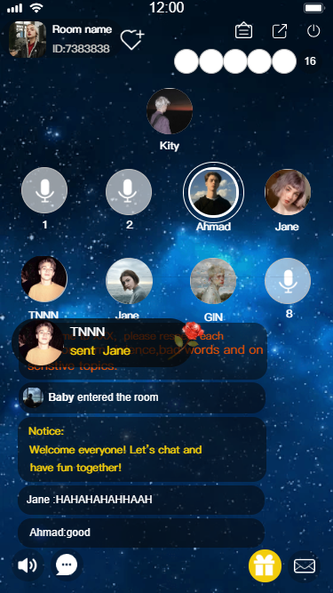

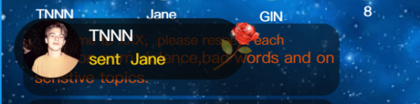

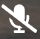

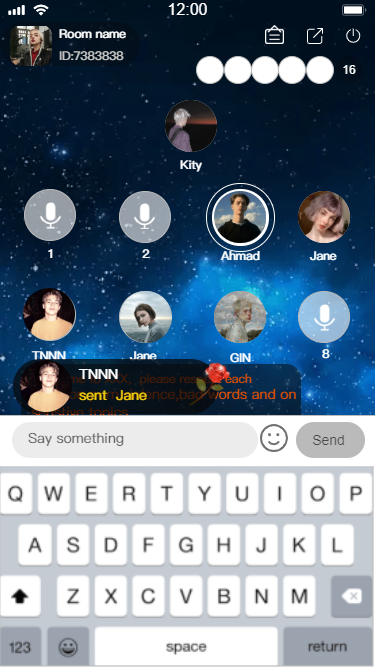

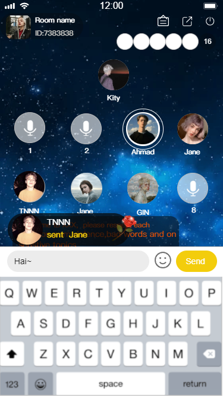

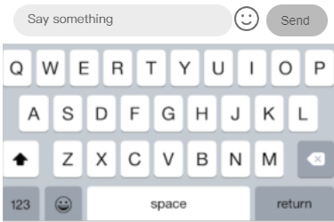

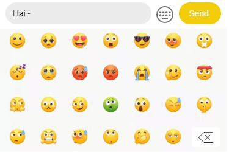

### 送礼

| 功能描述 | 向其他用户赠送礼物 |
|---|---|
| 优先级 | 高 |
| 输入/前置条件 | 点击房间底部送礼按钮/用户资料卡送礼按钮 |
| 需求描述 | 图1                           图2 图3                             图4 图5                             图6 图7 用户点击送礼图标触发送礼功能，送礼弹窗向上弹出。送礼完成或点击送礼弹窗外区域时，送礼弹窗下滑消失。 面板布局、分类、接收对象、数量选择 UI 以「礼物面板」为准。 选择礼物数量：选择小礼物、中礼物时，数量浮层中选项有1、7、17、77、777。当礼物为大礼物时，选项有1、7、17。默认选项为1。若当前有其他跑道/全屏特效正在展示，则展示完当前的跑道/全屏特效后立刻展示自己的。数量浮层展开时，点击浮层外任意区域收起浮层。 5. [赠送]按钮：点击时，判定选中用户是否在房，若不在房，【Toast】提示“该用户已离开”；若在房则进行余额判定，情况和结果如下： 送礼效果展示： 消息展示板送礼消息： 普通礼物消息：XXX（送礼人） 送给 YYY（被送礼人） ZZZ（礼物图片） * 数量。被送礼人只显示用户名。 B.送所有麦上用户礼物消息：XXX（送礼人） 送给 麦上所有用户 ZZZ（礼物图片） *数量。被送礼人只显示用户名。 C.送所有麦上用户礼物消息：XXX（送礼人） 送给 房间所有用户 ZZZ（礼物图片） *数量。被送礼人只显示用户名。 2）送礼跑道：用户送出任何礼物时触发，位置固定。 普通礼物跑道 普通送礼跑道：格式为 XXX（送礼人） 送给 YYY（被送礼人） ZZZ（礼物图片） * a（a的显示效果见下表）。送礼人显示头像+用户名，被送礼人只显示用户名。用户名过长时均使用“···”来显示多余部分。 送麦上所有用户跑道 送所有麦上用户礼物跑道：格式为 XXX（送礼人） 送给 麦上所有用户 ZZZ（礼物图片） * a（a的显示效果见下表）。送礼人显示头像+用户名，被送礼人只显示用户名。用户名过长时均使用“···”来显示多余部分。 送麦上所有用户跑道 送全房间用户礼物跑道：格式为 XXX（送礼人） 送给 房间所有用户 ZZZ（礼物图片） * a（a的显示效果见下表）。送礼人显示头像+用户名，被送礼人只显示用户名。用户名过长时均使用“···”来显示多余部分。 幸运礼物中奖跑道 幸运礼物中奖跑道 注：以上礼物数量跳动逻辑仅为参考，可复用其他成熟产品送礼时礼物 D. 当用户完成送礼时，自己屏幕：立刻展示自己的送礼跑道/全屏特效；若当前有其他跑道/全屏特效正在展示，则展示完当前的跑道/全屏特效后立刻展示自己的。其他在房用户屏幕：按照服务端接收到的送礼顺序展示所有人的送礼跑道。 3）全屏特效：用户送出大礼物时触发。全屏播放特效动画，持续时间5s到10s左右，具体时长和动画见UI出图。 A. 后台配置礼物是否自带大礼物特效。用户送出带大礼物特效的礼物时，每单个礼物播房一次大礼物特效，送出n个礼物时则播放n遍。 B.屏幕上送礼跑道和全屏特效触发事件互斥，展示特效时不展示送礼跑道。 C. 礼物送礼跑道与全屏特效在消息展示区外层，可被所有弹窗/浮层遮盖。房间最小化后、进入新页面时停止播放，重新返回房间时，播放返回到房间时间节点后房间内的第一个礼物的跑道或全屏特效。 7. 礼物类型 注： 以上礼物类型标识根据UI实际设计为准 点击礼物标识展示浮层展示礼物介绍，见图4 点击礼物标识可查看礼物介绍（见图4-图7） 幸运礼物配置详见后台需求，服务端逻辑同yalla幸运礼物 周星礼物入口与 Banner 见「活动与周星 Banner」「周星礼物榜单」。 8.送礼广播 1）全站礼物广播 全站礼物广播 广播内容： 房间ID：XXX 哇，大老板！快来看！YYY送给ZZZ 礼物图片 X 数量 [Go]按钮 点击“Go”按钮可跳转其房间 出现方式：从屏幕右侧进入，屏幕左侧消失。从头部进入到尾部消失的时间为8秒。 出现范围：当前语区所有房间 注：若密码房触发的广播仅在当前自己房间展示 2）送礼广播 送礼广播 广播内容： 房间ID：XXX YYY送给ZZZ 礼物图片 X 数量 [Go]按钮 点击“Go”按钮可跳转其房间出现方式：从屏幕右侧进入，屏幕左侧消失。从头部进入到尾部消失的时间为8秒。 出现范围：当前语区所有房间 注：若密码房触发的广播仅在当前自己房间展示 全站礼物通知仅通知当前语区房间，密码房触发的通知仅在当前房间展示。 9.幸运礼物中奖广播与中奖弹窗 图1（广播）             图2（弹窗） 中奖广播出现条件：送出幸运礼物获得一等奖时触发中奖广播（见图1），同语区所有房间显示中奖广播出现方式：从屏幕右侧进入，屏幕左侧消失。从头部进入到尾部消失的时间为8秒。 中奖广播展示内容：送礼人用户名、中奖礼物图片、中奖倍数，获得金币数量。即：恭喜XXX送[中奖礼物图片]获得YYY×奖励（ZZZ金币），XXX为中奖人昵称，YYY为中奖奖励，ZZZ为获得金币数量 中奖弹窗出现条件：送出幸运礼物获得一等奖时触发中奖弹窗（见图2），仅中奖者可见中奖弹窗展示内容：中奖文案（恭喜！ 送幸运礼物你中了一个金币奖励，请前往[钱包]-[金币]-[明细]查看）、中奖倍数×奖励、中奖金币数、“我知道了”按钮（点击“我知道了”按钮可关闭弹窗，点击弹窗外区域不可关闭弹窗） |
| 输出/后置条件 |  |
| 补充说明 | 礼物配置链接：https://docs.qq.com/sheet/DWmpyTHlkWEJnVHJQ?tab=BB08J2&_t=1629946451314（待定） |

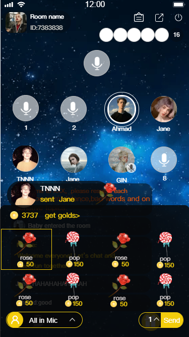

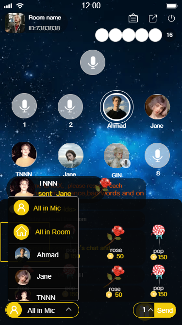

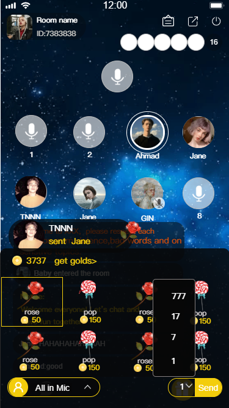

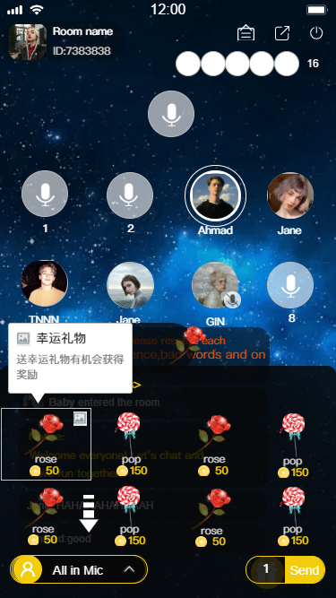

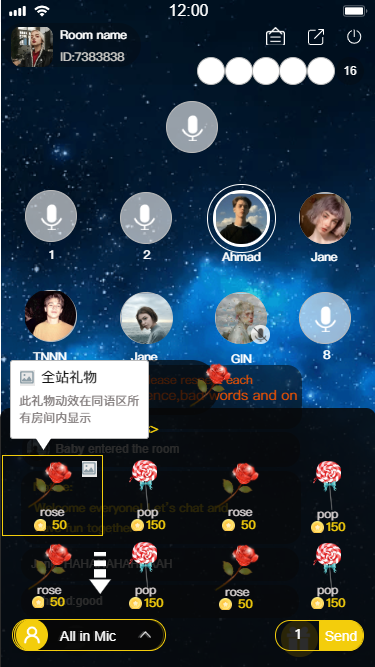

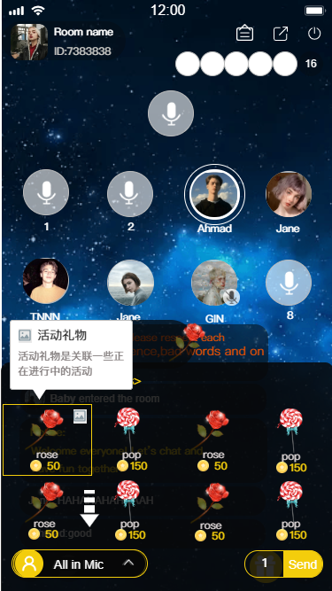

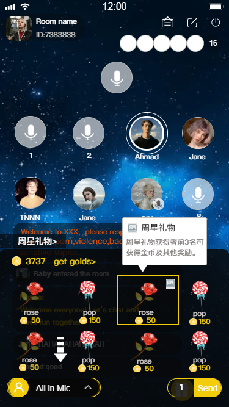

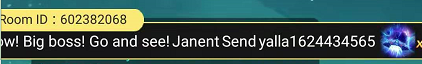

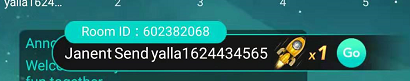

### 麦克风操作

| 功能描述 | 房主、麦上用户、观众对麦克风操作权限 |
|---|---|
| 优先级 | 高 |
| 输入/前置条件 | 进入房间 |
| 需求描述 | 图1（房主/嘉宾）            图2 对自己麦位操作： 创建房间或进入自己房间后，房主不自动上麦； 用户点击麦位判断时候是否已获取录音权限，若未获取，页面跳转授权页面，若已获取自动上麦（房主可上任意麦位）； 用户上麦后点击自己头像弹出对自己麦克风的操作浮层（见图1）。浮层显示[下麦]按钮和[查看资料卡]按钮；点击[下麦]按钮，应用停止获取该用户声音，麦位不展示该用户的头像和昵称，点击[查看资料卡]按钮，收起操作浮层，从房间底部向上弹出自己的个人资料卡 注：麦上用户点击其他空麦位提示是否要更换麦位，详见换麦 邀请上麦： 房主/管理员点击空麦位弹出[房间在线用户列表]，列表中非自己和麦上用户信息右边展示“邀请上麦”按钮，每次点开该列表刷新列表和按钮状态，点击[邀请上麦]按钮流程详见查看用户资料 主动上麦： 用户点击麦位判断是否获得录取声音权限，若未获得权限，弹出获取权限弹窗（详见权限申请），若获得权限，自动上麦 |
| 输出/后置条件 |  |
| 补充说明 | 无房主专属麦。房主不在房间时不保留专属麦位头像。 |

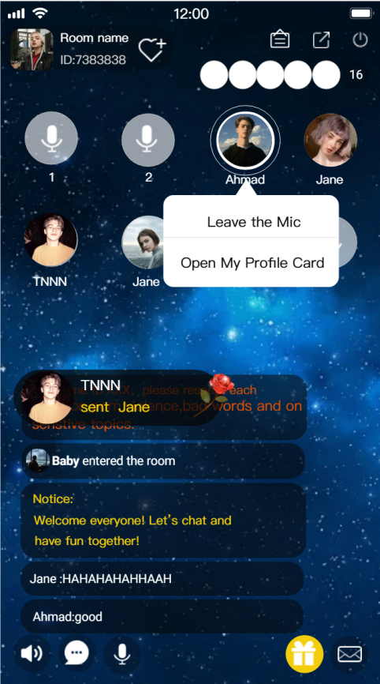

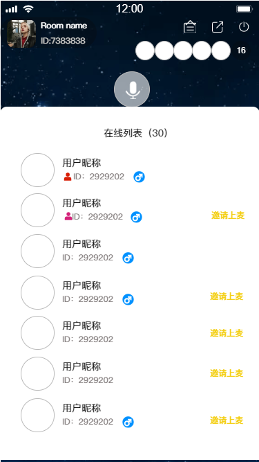

### 查看用户资料

| 功能描述 | 在房间查看用户资料卡 |
|---|---|
| 优先级 | 高 |
| 输入/前置条件 | 进入房间点击用户头像 |
| 需求描述 | 点击用户头像、消息区用户头像/昵称展示用户在房个人资料卡。 个人资料卡显示内容根据查看和被查看双方角色不同内容区别如下： [举报]按钮：查看自己时不显示，查看其它用户时显示。点击进入举报页面。 关闭个人资料卡弹窗：点击个人资料卡外任意区域收起弹窗。 1）用户资料：任何情况下均显示。包括用户头像、用户名、用户ID、用户性别（用户性别：显示用户已设置的性别，未填则不显示）、用户标识（仅显示房主、管理员） 房间个人资料卡片无家族/俱乐部勋章标识。 2）用户头像：点击个人资料卡头像进入用户个人户主页。返回房间仍保留个人资料卡弹窗 3）[加好友]按钮：未被拉黑/拉黑其他用户时显示。互关即好友，无好友验证、无申请箱，按钮状态见 [`../relationship/PRD.md`](../relationship/PRD.md)。 
A.双方非好友时显示关注/回关（原文「加好友」）；点击后立即关注，不走申请箱。 
B. 双方成为好友后，按钮变为已添加/好友状态，点击可取消好友关系，弹出二次确认弹窗“你确认要取消与当前用户的好友关系吗？ [取消]  [是的]” C. 若用户被拉黑或拉黑，则点击[加好友]按钮时，【toast】提示：“你已经拉黑该用户/被该用户拉黑”。 4）无论是否被用户拉黑，查看其个人资料卡[送礼]按钮均展示 [邀请入场]/[强制围观]按钮：房主查看普通用户时显示，查看超管/巡管时不显示。 5）[强制下麦]按钮：房主点击该按钮弹出二次确认弹窗：“你确定要将该用户下麦吗？ [取消] [是的]”，点击[取消]按钮关闭二次确认弹窗，点击[是的]按钮，被操作麦上用户立即下麦，并受到【toast】提示：你被XXX下麦。 6）当用户不在麦上时，其个人资料卡展示[邀请上麦]按钮（仅房主端、管理员可操作） 点击[邀请上麦]按钮，先判断用户是否被全平台禁言，如果是【Toast】提示“该用户已被系统禁言”。如果否则进行下一步b 判断用户是否被房主禁言，如果是【Toast】提示“该用户已被房主禁言”。如果否则进行下一步c。 判定麦上人数是否已满：官方房满员/邀请 = 15 个已占麦；非官方 = 8。已满时【Toast】提示“麦上嘉宾位已满”。未满则继续进行下一步d。 判断用户是否已经离开房间，如果是【Toast】提示“该用户已离开房间”。如果否则继续进行下一步e。 判断用户是否已经上麦，如果是【Toast】提示“该用户已经上麦”。如果否则进入f。 房主【Toast】提示“已邀请”。被邀请用户显示【弹窗】，文案为“房主邀请你一起上麦聊天”，选项中“取消”改为“忽略”。当被邀请用户未操作【弹窗】时，房主再次邀请弹窗不变化。当用户选择[确定]时立即上麦；选择[忽略]时关闭弹窗，不通知房主。 邀请上麦弹窗 8）[禁言按钮]：房主/管理员可对房间其他用户进行禁言操作，被禁言用户无法在房间内发送消息（可以上麦），单次禁言的有效时间为7天，时间可由后台配置。禁言操作对当前离开房间的用户同样生效。 1）点击出现【弹窗】，文案为“确定禁言该用户吗？禁言后该用户7天内不可以在房间发送消息或进入场景语音。”，确认[禁言]按钮变为[取消禁言]按钮。 A. 被禁言用户的屏幕出现【弹窗】提示“您在此房间被禁言7天。”。点击底部功能栏的输入框【toast】文案提示“禁言中”（如下图）。 B. 房间用户列表弹窗中，被禁言用户面后有禁言标识（如下图），分为全平台禁言标识和房间禁言标识 禁言标识 C.  [取消禁言]按钮，点击【Toast】提示“取消禁言成功”，[取消禁言]按钮变回[禁言]按钮，并取消用户禁言状态。若房主未进行取消禁言操作，禁言时间结束后禁言状态自动消失，[取消禁言]按钮自动变回[禁言]按钮。 后续禁言同时限制发语音、禁言后立即下麦，见「房间禁言」。  8）[踢出房间]按钮：房主/管理员可对房间普通用户操作，被踢出房间的用户2小时内不能再次进入该房间，时间可由后台配置。 A. 点击出现【弹窗】，文案为“确定踢出该用户吗？踢出后对方将2小时内不能进入自己房间。”，房主确定后【Toast】提示“该用户已被踢出房间”。 B. 被踢出用户退出房间，并【弹窗】提示“您已被移出该房间”，被踢出用户在禁止重新进房时间内不能再次进入该房间，期间若尝试进入该房间，【Toast】提示“您暂时不可以进入该房间”。 房主踢出用户时，无论该用户是否在房间，踢出操作都生效。 C.若踢出该用户弹窗时勾选“不可永久进入该房间”的选项（默认不勾选），该用户则被拉入当前房间黑名单，并永久不可进入该房间，被拉黑用户的房间大厅列表移除该房间，若用户尝试从关注房间列表进入该房间，则【toast】提示：您已被踢出该房间。 注： 管理员对管理员不能进行管理操作，管理员点击其他管理员个人资料卡无管理员操作按钮 管理员对房间用户有【邀请上麦】、【禁止书写】、【踢出房间】操作 |
| 输出/后置条件 |  |
| 补充说明 |  |

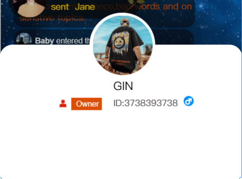

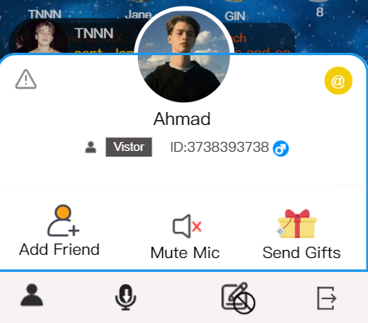

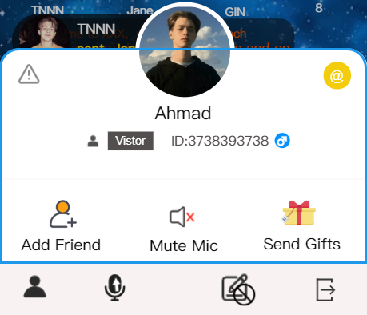

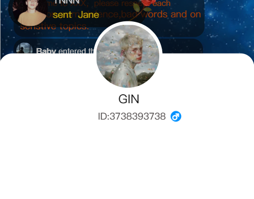

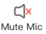

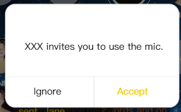

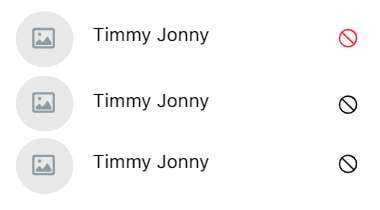

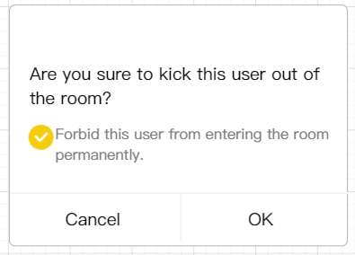

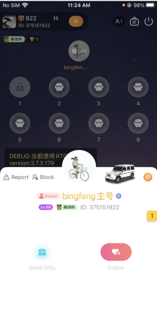

### 查看房间资料

| 功能描述 | 在房间查看房间资料 |
|---|---|
| 优先级 | 高 |
| 输入/前置条件 | 进入房间点击房间头像 |
| md需求描述 | 图1（房主）                  图2（非房主） 图3                             图4 图5                        图6 图7                          图8 图9                             图10 图11 用户点击房间头像从房间底部向上弹出房间资料页面（见图1、图2）。 房间资料页面展示信息：房间头像、房间名称、房间ID、房间ID复制按钮、房间公告内容、房间设置按钮（仅房主展示）、房间关注按钮（房主不展示） 房间资料卡无房间俱乐部卡片。 1）[关注房间]按钮：有三个状态，如下表 用户未关注房间时，显示状态1，点击后关注房间完成后变为状态2，且与房间顶部关注状态展示同步 点击状态2（[取消关注]按钮）出现【弹窗】，文案为“确定取消关注该房间吗？”，确定后完成取消关注房间操作： 房间资料页的[关注房间]按钮由状态2变回状态1。 房间内顶部状态栏的[关注房间]从状态3变回状态1。 房间大厅里我关注的列表被刷新后，该房间从列表消失。 点击房间资料弹窗外任意区域关闭当前弹窗 点击[复制]按钮，将当前房间ID复制到手机粘贴板中，并【toast】提示：复制成功 房间设置：房主点击房间设置按钮，进入房间设置页面 房间设置页无游戏模式切换入口、无老板位设置入口。 编辑房间信息： 修改房间头像：点击房间头像，调用手机相册功能，页面跳转手机相册选择和拍照界面（见图4），点击标题弹出浮层下来列表可选择相册类型；此处上传或拍照上传房间背景流程同上传头像流程，不再赘述。 修改房间名称（见图5）：房间名输入框，若已有房间名则自动填入现有的房间名。最高限制输入24个字符（一个系统自带emoji或软件自带emoji表情等于2个字符），不允许换行。输入框右边X/Y为字数提示，当输入字符达到最大限制时，新输入内容不在输入框显示。当用户点击输入框且输入框内字符数>0时，输入框内部右侧出现一键清空按钮。 修改房间公告：房间公告输入框：房间公告最高限制150个字符，用户输入内容时无[一键清空]按钮。其他规则与上方房间名模块相同。输入框上方有提示文案：“Tip：简单告诉大家房间内的主题或者活动，能更好的吸引其他用户进房哦。”。 [保存]按钮 点击进行房间名是否为空判定，若房间名为空，则【弹窗】提示“房间名不能该为空。”，若房间不为空则进行下一步敏感词判断。房间公告可以为空。 进行房间名和房间公告敏感词判定，若含有敏感词则【弹窗】提示：“XXX含有敏感词”，XXX为房间名或房间公告。若无敏感词则保存房间资料，在房间内实时更新，并自动返回上级页面。房间大厅中，用户下拉刷新即展示最新的房间信息。 [返回]按钮： 若检测到用户资料数据未发生变更，直接返回上级页面。 若发生变更，出现【弹窗】，弹窗文案为“是否保存所有编辑？”，按钮为[不保存]和[保存]。 点击[不保存]，资料数据不提交，直接返回上级页面 点击[保存]按钮，进行资料保存逻辑判定（与上方[保存]按钮一样）。 弹窗 管理员列表、踢出房间用户列表、禁言用户列表、房间黑名单列表（见图7、图8、图9、图10） 限制最多可设置8个管理员，管理员列表页面入口展示当前已设置管理员人数和可设置管理员人数（X/X格式，见图3） 列表展示用户头像、用户昵称、操作用户（管理员列表不展示）、操作时间、移除列表按钮；列表根据操作时间倒序展示；点击[移除]按钮，弹出二次确认弹窗：【弹窗】：“你要允许XXX进入房间吗？ [取消] [确认]”；【弹窗】：“你要将XXX移除管理员列表吗？[取消] [确认]”【弹窗】：“你想将XXX移除黑名单吗？[取消] [确认]” （“XXX”为被操作用户昵称） 从“踢出房间”列表移除弹窗       解除管理员设置弹窗 移除房间黑名单弹窗            解除禁言用户弹窗 游客进房开关：开关默认开启状态，允许游客进入当前用户房间，若用户关闭开关，【toast】提示：操作成功，游客在房间大厅列表不可见当前房间，若游客未刷新房间大厅列表且进入房间已设置不允许游客进入，游客收到【toast】提示：你已被踢出房间 房间奖励：点击“房间奖励”按钮（按钮入口位置展示当前可领取金币数量），进入房间奖励页面（H5方式开发，见图11） 页面展示“近7日房间收入”（不包括当日）、“近7日可领取金币数量”（不包括当日）、当天赚取领取金币数量、当月赚取金币数量（包括当日赚取）、[领取]按钮、规则解释；“近7日房间收入”和“近7日可领取金币数量”每日凌晨零点更新一次，当日的数据次日凌晨零点更新 可领取金币数量根据“房主可获得佣金”计算公式计算后向下取整展示（例如：计算120金币礼物对应房主佣金=120*0.3*0.03=1.08,向下取整为1）； 金币领取门槛：XX（服务端配置）；若用户未达到领取门槛点击“领取”按钮toast提示：“至少XX金币可领取” 金币每日可领取，可领取金币数不包括当日，每天的工资次日凌晨零点可领取，若7日内未领取则自动清零不可领取 房主可获得佣金=当前房间收入*3%（即可领取金币数量计算方式） 房间收入=在自己房间内收到礼物对应的金币数*30%（即房间收入计算方式） 点击[领取]按钮，清空可领取金币数，账户金币对应添加领取数量金币，并产生一条金币流水： “房间奖励领取             +2922” 房间奖励每个月底清算一次，若用户在每个自然月底最后一天00：00:00未领取本月房间奖励，则系统自动帮用户领取房间奖励，用户账户金币数量自动更新，并生成一条流水“房间奖励-系统领取      +282828” 每次房间送金币礼物，房主获得“房间收入”保留一位有效数字，超过小数点后一位向上取整，例如：0.81取0.9。若小数点后第一位为0，则不展示，例如：展示0，不展示0.0 访客上麦开关：默认开启，用户进入房间后可以主动上麦；若关闭开关，收到房主邀请上麦的用户才能上麦，用户进入房间后点击空麦位toast提示：仅房主邀请可上麦 访客发消息开关：默认开启，用户进入房间后可以在消息区域发送消息并展示；若关闭开关，用户进入房间后不可以在消息区域发送消息，用户发送消息时触发toast提示：房主已关闭房间发言功能 注：服务端需要支持客户端后期增加访客开关和访客发消息开关时，若限制用户不能上麦或发消息时，老版本能够发送toast提示 |
| 输出/后置条件 |  |
| 补充说明 |  |

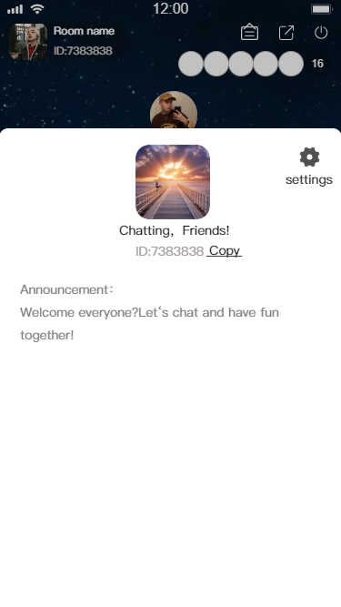

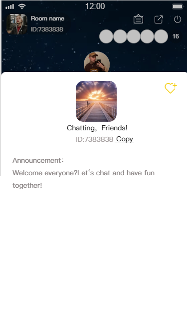

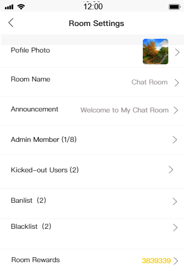

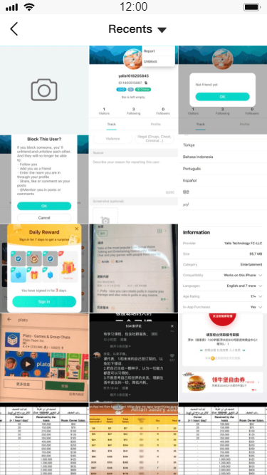

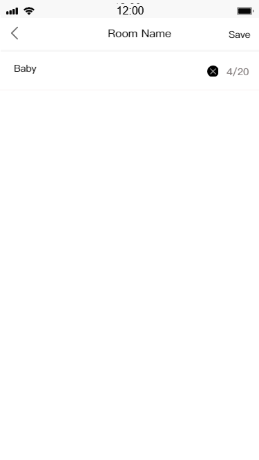

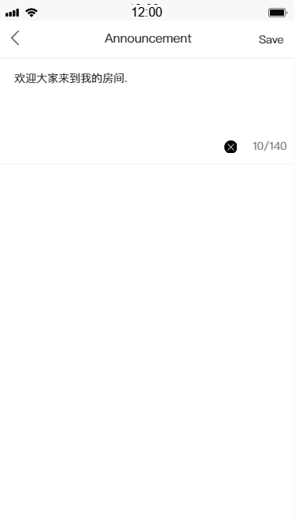

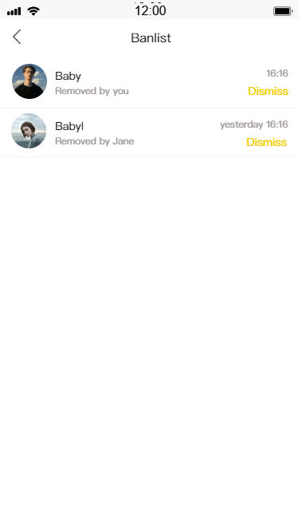

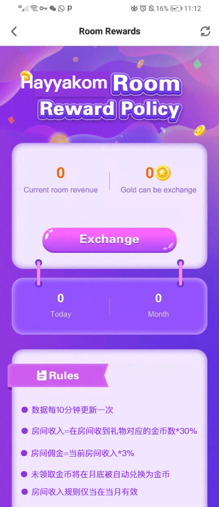

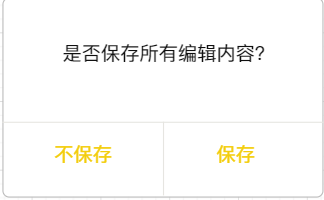

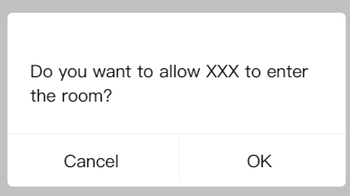

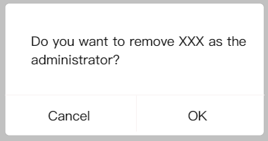

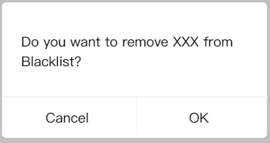

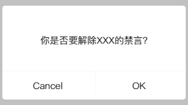

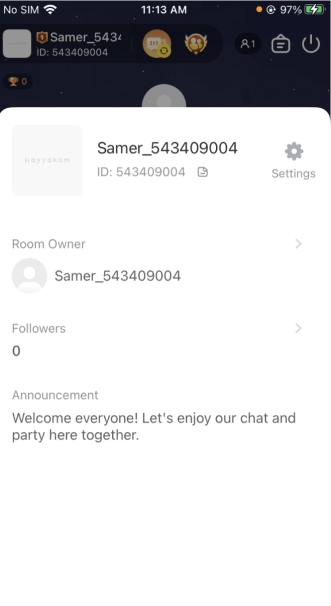

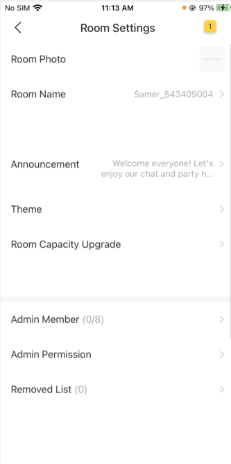

### 换麦

| 需求描述 | 功能优化 |
|---|---|
| 优先级 | 高 |
| 输入/前置条件 |  |
| 需求描述 | [图1]                    [图2] 非房主/管理员视角 若用户已经在麦位，用户点击其他麦位时弹窗提示：“你确定要更换到这个麦位吗？【更换】【取消】”，点击【更换】则立即更换麦位，头像展示在更换的麦位，点击【取消】则关闭当前弹窗； 房主/管理员视角 无论用户是否上麦，点击其麦位时展示图2浮层，点击上麦和锁麦选项（房主允许管理员锁麦，否则交互同“非房主/管理员视角”）；若用户没有在买上点击“上麦”立即上当前操作麦位；若用户已经在麦上点击“上麦”为更换到当前麦位； |
| 输出/后置条件 |  |
| 补充说明 | 无老板位。 |

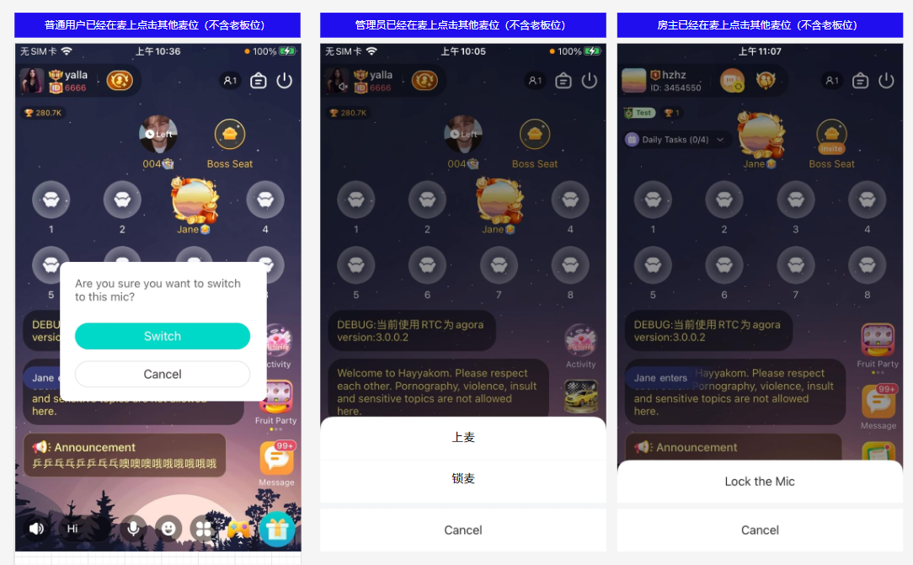

### 房间禁言

| 功能名称 | 房间房主/管理员对用户禁言后用户不能发言和语音 |
|---|---|
| 优先级 | 高 |
| 功能描述 |  |
| 前置条件 |  |
| 交互原型 | 图1                         图2 图3                      图4 图5 |
| 字段描述 | 原禁言功能：限制7天内不能在当前房间发送消息，但可以发送语音，再次点击该用户的禁言按钮可以取消禁言。 修改为：限制7天内不能在当前房间发消息，发语音，再次点击该用户的禁言按钮可以取消禁言。 点击禁言按钮弹出二次确认弹窗，详见图2，禁言成功后，当前用户在房立即收到1条toast提示：“你已被房主/管理员禁止聊天或发言”（见图3），若此时用户在麦上则立即下麦，该用户被禁言后点击发送消息按钮或点击上麦按钮toast提示：“你已被禁言”（见图4）； 房主或管理员再次点击当前被禁言用户的禁言按钮则弹出取消禁言的二次确认弹窗（见图5）点击确定即可取消当前用户的禁言，被解除禁言的用户在房收到toast：“你已被XXX解除禁止聊天或发言”； UI样式需要区分已禁言和未禁言的按钮状态样式（目前是一样的）； 新版本对老版本用户禁言或老版本对新版本用户禁言需要使用最新的禁言逻辑，老版本禁言文案不调整（无法调整）； 若当前用户已经被房主或管理员禁言，邀请上麦邀请按钮置灰，房主或管理员点击邀请当前用户上麦按钮（按钮入口：个人资料卡片、用户在线列表）时弹窗提示：“当前用户已被房主/管理员禁言，请先解除禁言。【好的】”点击【好的】关闭当前弹窗； 注：若用户被禁言，房主或管理员邀请上游戏座位不会自动上麦； |
| 需求描述 |  |
| 补充说明 |  |

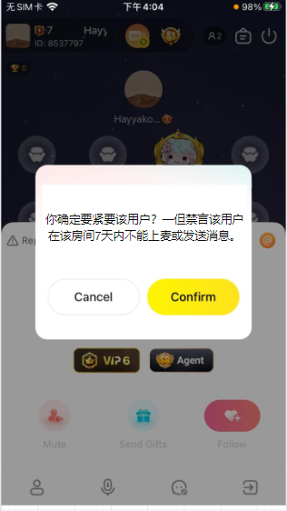

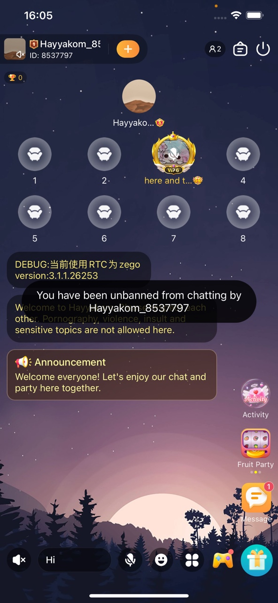

### 复制链接分享房间

| 功能名称 | 复制链接分享房间 |
|---|---|
| 优先级 | 高 |
| 功能描述 | 复制房间分享链接，用于app外引导用户加入房间或下载app |
| 前置条件 | 用户在房间中点击分享按钮 |
| 交互原型 | 「图1」                                「图2」 |
| 字段描述 | 「图1」增加【链接分享】分享方式 点击后，复制分享文案，并toast提示“复制成功” 分享文案，以翻译文档为准： {分享者昵称}+固定文案{“邀请你一起来聊天，点击链接加入：”}+{复制链接分享url} 分享url：跳转到h5房间分享页「图2」 「图2」h5房间分享页（已有） |
| 需求描述 |  |
| 补充说明 |  |

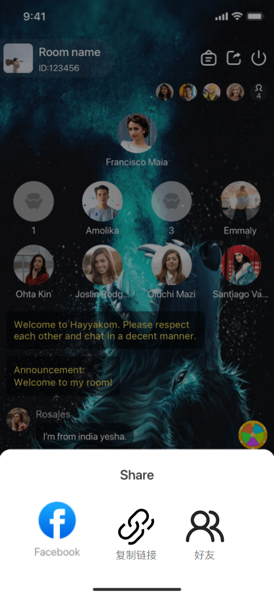

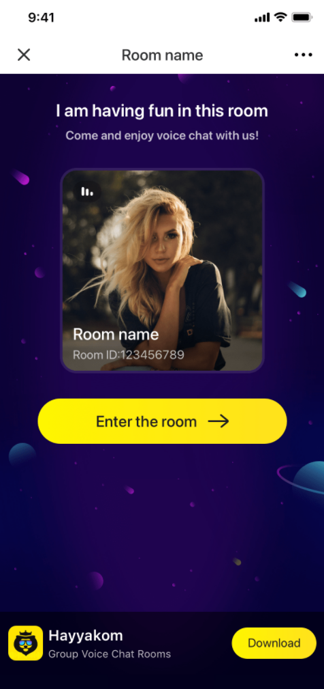

### 锁麦

#### 管理员权限

| 功能名称 | 房间锁麦权限管理 |
|---|---|
| 优先级 | 高 |
| 功能描述 | 房主可选择是否允许管理员锁麦/解锁麦 |
| 前置条件 | 房主进入房间设置页设置权限 |
| 交互原型 | 「图1」 |
| 字段描述 | 「图1」管理员权限开关 默认状态：不允许 状态实时变更 房主变更权限后，管理员实时获得或取消对应权限。详见下方需求。 滑动按钮交互 房主点击后，按钮状态变更为“是”或“否” 变更时，动效展示按钮左右滑动 |
| 需求描述 |  |
| 补充说明 | 房主永远拥有自己房间的锁麦权限 |

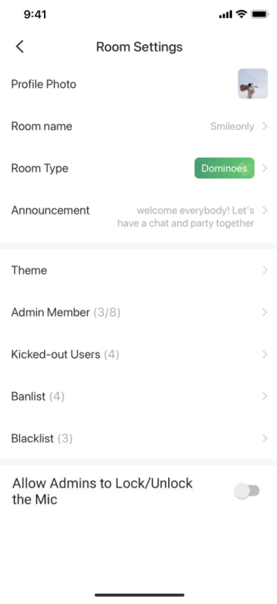

#### 锁麦/解锁麦

| 功能名称 | 锁麦/解锁麦 |
|---|---|
| 优先级 | 高 |
| 功能描述 | 房主/管理员可锁麦或解锁麦 |
| 前置条件 | 房主/管理员点击某个无人麦位 |
| 交互原型 | 「图1」 |
| 字段描述 | 「图1」空麦位操作 点击空麦位 房间内管理员权限实时变更 管理员在房间中时，若权限变更，则实时同步 注：有权限的管理员在房时，若权限变更为无权限，则点击【锁麦位】【解锁麦位】时，操作失败并toast提示“操作失败” 滑动按钮交互 房主点击后，按钮状态变更为“是”或“否” 变更时，动效展示按钮左右滑动 |
| 需求描述 |  |
| 补充说明 | 无房主专属麦。取消房主点击普通麦位的原交互：打开成员列表 老版本兼容：老版本用户点击已锁麦位时，统一提示“操作失败” |

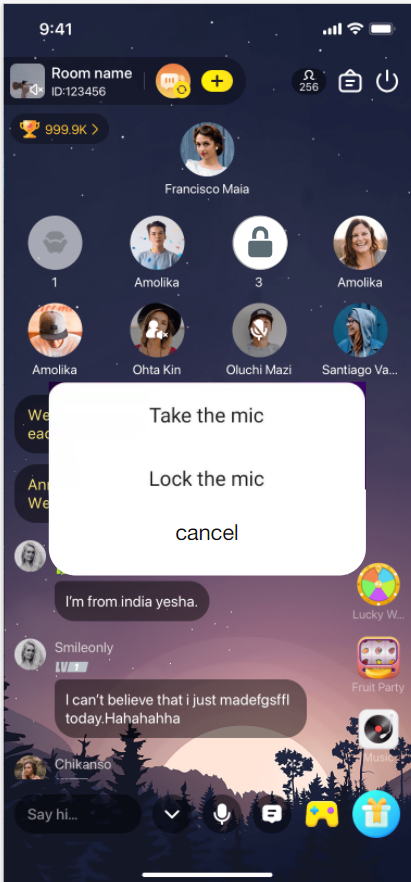

### 礼物计数器

#### 入口与时间选择

| 功能描述 | 麦上用户收礼相当于麦上用户收礼PK，最后在指定时间内根据收礼金币价值的多少决出胜利者. |
|---|---|
| 优先级 | 高 |
| 前置条件 |  |
| 交互原型 | 【图1】 麦上用户收礼入口             【图2】计分牌弹窗 【图3】倒计时模式              【图4】切换房间二次确认弹窗 【图5】结束计分二次确认弹窗       【图6】计分牌按钮打开 【图7】计分牌说明 |
| 需求描述 | 【图1】麦上用户收礼入口 房间底部更多选项里新增【计分牌】选项，此时按钮处于关闭状态（仅房主/管理员可见）。点击后，弹出计分牌时间选择框（如图2）。 该入口在现行房间（均为语聊房）展示。 特殊说明：如果在计时器未开启时，管理员被房主取消了管理员权限，则不展示入口（下次打开底部更多选项时）。 【图2】计分牌弹窗 展示内容: 标题 问号按钮 叉号按钮 时长选择按钮（默认选择5分钟）---服务端可配。 预埋功能6个选项，之后可服务端配置展示;比如5分钟、10分钟、15分钟、20分钟、25分钟、30分钟。 开始按钮 操作说明 点击问号按钮，弹出计分牌说明页。（如图7） 点击叉号按钮，关闭计分牌时间选择弹窗 点击开始按钮，进入倒计时模式（如图3） 点击计分牌弹窗外区域，弹窗关闭。 【图3】倒计时模式 页面展示内容 页面右上角展示【计分牌】按钮，按钮是打开状态，仅管理员和房主可见 计分牌按钮下方展示【文案】：倒计时+具体倒计时数据（精确到秒），所有在房用户可见（包括房主和管理员） 评论区新增内容：【#用户昵称#开启了计分牌，当限制时间为#X分钟#】。 用户昵称下方展示计分分数 小于10,000时，以”个”为单位。如“9999“； 小于1,000,000，且大于等于10,000时，以千K为单位，显示1位小数，向下取整。如”999.9K“； 大于等于1,000,000时，以百万M为单位。显示1位小数，向下取整。如”2.0M”； 计分规则说明 用户送出金币礼物，以金币礼物的价格计入计分分数。（该麦上用户收到的金币礼物金币价值*数量） 用户送出宝石礼物，宝石礼物不计入计分分数 用户送出包裹礼物，按照包裹礼物的金币价值计入计分分数； 用户下麦后再次上麦，计分分数不清空，展示为下麦前的分数； 用户离开房间后，分数不清空；再次进入房间上麦时，分数从上次离开房间开始计算。 房主离开房间后，计分模式不关闭。 交互说明： 房主/管理员点击页面右上角计分牌按钮（开关权限见下方特殊说明），弹出二次确认弹窗（见图6） 房主切换房间时，弹出二次确认弹窗（见图5） 点击房间底部更多选项里的【计分牌】选项，此时按钮处于打开状态（见图7）-开关权限控制同下方特殊说明。点击后，弹出二次确认弹窗（见图6）。 特殊说明 在控制开关上，房主权限最大。 如果开关是房主开启的，开关只能房主关，其他管理员关闭时，弹出toast提示："您没有权限进行操作。“ 如果开关是管理员开启的，开关只能房主关和开启计分模式的管理员关，其他管理员关闭时，弹出toast提示：“您没有权限进行操作。” 如果开关开启期间管理员被撤销了管理员权限，该管理员看到的还是开关开启状态（包括底部更多选项和页面上的叉号开关），点击弹出toast提示：“您没有权限进行操作。计数器关闭后，撤销权限的管理员无法看到开关。 【图5】切换房间二次确认弹窗 页面展示内容 弹窗标题 【固定文案】目前房间正在计分，确定要切换房间吗？ 【取消】按钮 【确认】按钮 交互说明： 用户点击【取消】按钮，弹窗消失，重新返回计分模式。 用户点击【确认】按钮，切换房间，结束计分模式，且弹出用户计分排行榜（见需求计分排行榜） 【图6】结束计分二次弹窗 页面展示内容 弹窗标题 【固定文案】是否确认结束计分？ 【取消】按钮 【确认】按钮 交互说明： 用户点击【取消】按钮，弹窗消失，重新返回计分模式。 用户点击【确认】按钮，结束计分模式（回到开启计分牌模式前的房间模式），且弹出用户计分排行榜（见需求计分排行榜），同时底部更多里入口变成关闭模式，且评论区展示一条消息（见需求计分排行榜）。 【图7】计分牌说明页 进行计分牌相关规则的说明。 点击【叉号】按钮，关闭计分牌说明页，返回到计分牌时间选择弹窗（图2）。 特殊说明：如果礼物计数器和蛇梯同时进行时，如果切换房间，只弹礼物计数器的切换房间二次确认弹窗 |
| 补充说明 |  |

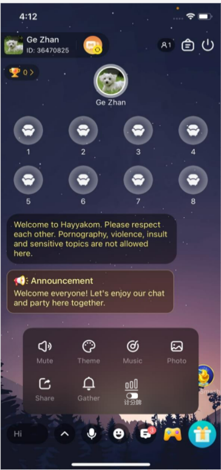

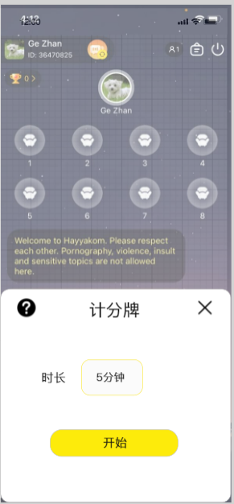

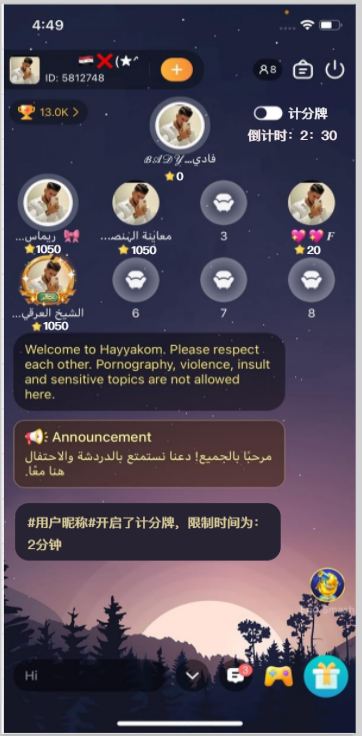

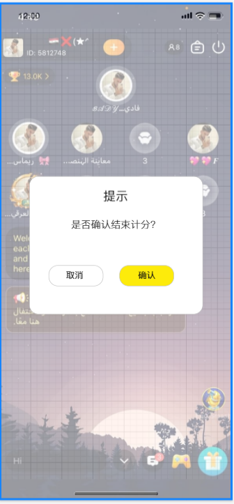

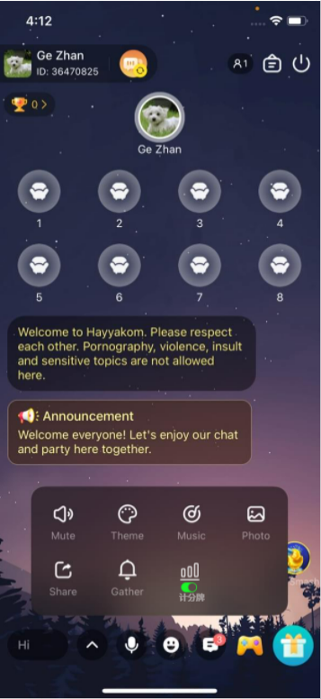

#### 计分排行榜

| 功能描述 | 计分模式结束后弹出的计分排行榜 |
|---|---|
| 优先级 |  |
| 前置条件 |  |
| 交互原型 | 【图1】                          【图2】 【图3】礼物计数器消息 |
| 需求描述 | 页面元素：（见图1） 弹窗标题 顶部的冠军展示 用户头像+冠军标识 用户昵称 获得的分数 用户排序 排名序号 用户头像 用户昵称 获得的分数 叉号按钮 排序规则： 根据用户的分数进行排名，第一名展示在最上方 如果用户分数相同，则排名序号展示相同，且最先到达分数的用户展示在最上方。 如果有其他用户和第1名排名相同，则最先达到分数的用户展示在顶部冠军。 如果用户都是0分的话，则按照最先上麦时间展示用户排名顺序。 如果计时结束时，麦上有人，则下麦的用户不展示在排行榜。 如果计时结束时，麦上无人，弹出图2排行榜。 交互说明： 用户点击叉号按钮，关闭弹窗 用户点击弹窗外蒙层，关闭弹窗 【图3】礼物计数器消息 消息发出时间：计分模式结束时 展示元素： 文案：#获得冠军的用户名称#获得了冠军。 【查看详情】按钮 交互说明： 用户点击【查看详情】，展开相对应的排行榜。 特殊说明： 如果计时结束时，麦上无人，则不发送评论消息。 |
| 补充说明 |  |

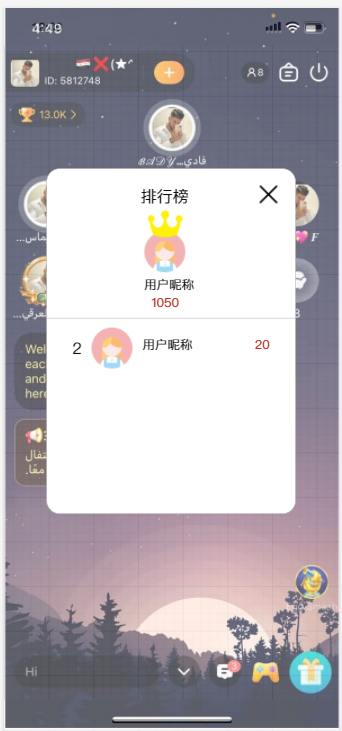

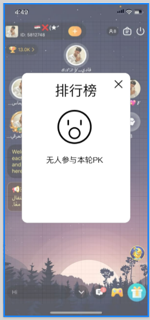

| 需求描述 | 1. 展示路径：数据统计-房间统计-礼物计数器 【字段释义】 【筛选项】 日期筛选框：支持根据日期选择进行筛选； 支持数据导出 |
|---|---|
| 输出/后置条件 |  |
| 补充说明 | 后台页面以 [`../admin/PRD.md`](../admin/PRD.md) 为准。 |

### 礼物面板背包：包裹礼物

#### 功能概述

- 增加包裹礼物，仅支持平台下发（有使用期限），不可购买，用于功能和活动的运营手段；

- 包裹礼物也在礼物后台配置，仅做使用场景的差别；

- 用户可使用库存的包裹礼物完成赠送，送出礼物的效果和分成与面板礼物一致。

- 礼物面板背包只含包裹礼物。无头饰卡 tab。私聊背包只含包裹礼物 tab。

#### 礼物面板背包入口及页面

| 需求描述 |  |
|---|---|
| 优先级 |  |
| 输入/前置条件 | 点击进入“礼物面板” |
| 需求描述 | [图1-入口]                   [图2-页面] 背包入口位于礼物面板右侧（icon+文字，固定展示，图1），点击拉起半屏的背包面板（图2），含“包裹礼物”tab；从背包入口进入，默认定位到“包裹礼物tab” 私聊页面也增加背包入口，背包页只含包裹礼物tab |
| 补充说明 |  |

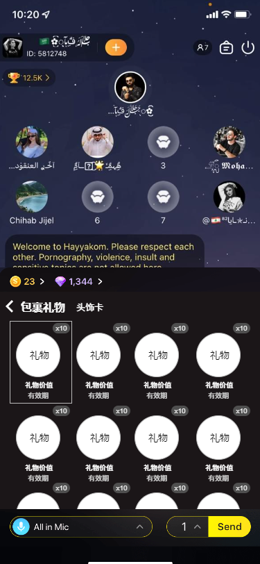

#### 包裹礼物

| 需求描述 | - 用户的礼物库存，由平台下发，通过活动或功能赠送，有使用有效期限制，无法购买 - 包裹礼物在使用效果上与普通礼物无区别 - 包裹礼物可在“礼物面板-背包”、“个人主页-背包”查看 |
|---|---|
| 优先级 |  |
| 输入/前置条件 |  |
| 需求描述 | [图3-包裹礼物面板]             [图4-库存不足提示] 展示范围：用户已有的包裹礼物 展示元素： - 礼物小图、礼物价值、选中效果，与礼物面板一致 - 库存数量：展示该用户此种包裹礼物的库存数量 - 有效期：展示该包裹礼物的有效期，以倒计时方式展示；多数量的相同包裹礼物有效期不一样，展示最近的到期时间；时间展示规则：数字向下取整，大于1天单位展示为d，不足1天单位展示为h，不足2h时展示为红色字体；时间大于99d时隐藏不展示 - 页面交互：上下滑动展示，面板高度稍高，UI上展示两行半 - 没有包裹礼物时，页面展示为空，文字提示“没有包裹礼物” 新获得包裹礼物的红点提示 - 用户新获得了包裹礼物，在背包入口展示红点，点击进入页面后，将新获得的礼物置顶，并在左上角展示“新获得”角标 - 退出页面，则红点消失，所有“新获得”的状态清空 包裹礼物按优先级排序： - 服务端排序逻辑：到期时间不足1天的礼物>其他礼物，组内以礼物价值倒序排列，金币礼物的价值均高于宝石礼物 - 客户端将“新获得”状态的礼物置顶展示，“新获得”礼物中的排序遵从服务端给到的排序数据 赠送操作： - 赠送流程同普通礼物，可选择赠送用户、数量 - 若选中的包裹礼物数量 < 选中赠送的用户数量x赠送个数，点击Send按钮，将已有库存送出，（赠送优先级：麦上用户>房间其他用户，麦上用户以麦序排列，麦序越靠前优先级越高，房间其用户以在房列表中的排序为优先级，之前送普通礼物的优先级也一并调整为该策略），同时toast提示“库存数量不足，无法赠送给全部用户”，则无法送出礼物，toast提示：库存不足，无法完成赠送，仍保持包裹面板打开 - 赠送后效果、分成与普通礼物一致 [图5-背包页面-包裹礼物]      [图6-背包页面预览] 背包页面展示包裹礼物 - 背包页面增加“包裹礼物”tab，展示用户已获得的包裹礼物；位于背包第一位，从Me页进入背包，默认定位到该tab - 展示元素：礼物主体、礼物价值、礼物库存、有效期，展示规则同礼物面板 - 点击礼物，弹出礼物公告预览页面，静态礼物无呼吸动效，动态礼物展示动效预览，点击下方“关闭”按钮，可关闭浮层 - 没有包裹礼物时，页面展示为空，展示文案：“没有包裹礼物” |
| 补充说明 | 展示样式后续见「礼物面板 · 背包礼物」。包裹有效期/库存不重写。 |

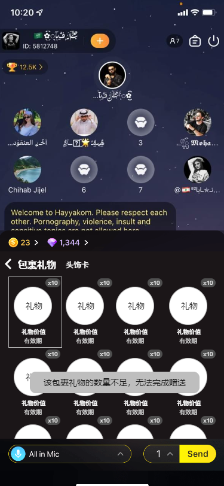

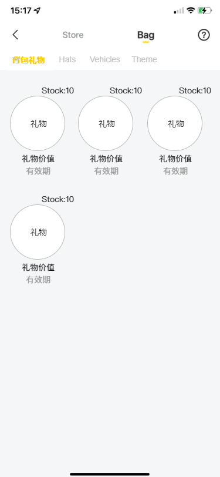

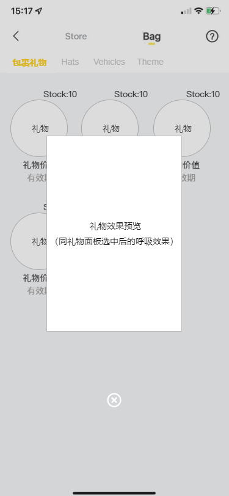

### 密码房

密码房是房间属性，不是一种房间模式。

#### 密码房设置

| 功能描述 | 后台给相应的房间配置密码房，该房间的房主可自行设置密码。 |
|---|---|
| 优先级 |  |
| 前置条件 | 后台给相应的房间配置密码房 |
| 交互原型 | 【图1】密码房入口             【图2】密码设置框 【图3】密码房设置提示 |
| 需求描述 | 1.在房间的房主端更多里增加密码房设置入口-见图1（仅后台设置的特定房间的特定时间里房主才展示）。 2.点击密码房设置入口，弹出密码设置框和数字键盘（如图2） 3.密码设置框元素：（图2） 标题 【固定文案】：输入密码 密码输入框 【确认】按钮 【取消】按钮 4.密码设置框交互操作： 用户未输入密码，【确认】按钮置灰不可点击，输入4位密码（纯数字）后，【确认】按钮高亮可点击。点击【确认】，密码设置成功，弹窗消失，toast 提示“操作成功”，房间内显示上锁状态，同时在评论区展示提示："#房主名称#设置房间为密码房”（如图3），点击【取消】，弹窗消失，返回上级页面。 5.特殊说明： 如果用户点击【密码房设置入口】时，密码房过期，则弹出toast提示："密码房设置权限已过期。"同时密码房设置入口不展示。 如果用户在【密码设置框】界面时，密码房过期，则点击【confirm】时弹出toast提示："密码房设置权限已过期。”同时密码房设置入口不展示。 密码房风控处理逻辑： 若当前用户国家为“阿联酋”，用户查看【房间大厅-推荐列表】看不到【密码房】、房间大厅搜索不到密码房； 非"阿联酋”地区用户查看【房间大厅-推荐列表】和房间大厅搜索密码房支持能够看到&搜索到； 密码房触发的全语区广播仅在当前房间展示； 非阿联酋地区用户通过[私域]列表（关注、好友列表等）点击[跟随]按钮进入阿联酋密码房弹窗提示：“进入失败”（不告诉真实原因）。 |
| 补充说明 |  |

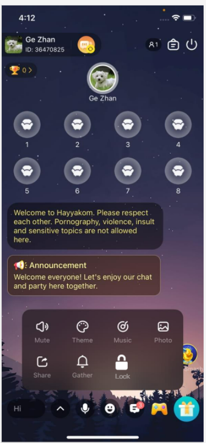

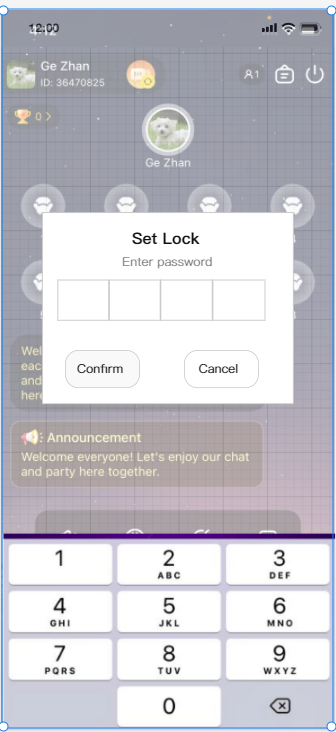

#### 更换密码与解锁

| 功能描述 | 房主进行密码更换或解锁 |
|---|---|
| 优先级 |  |
| 前置条件 |  |
| 交互原型 | 【图1】密码房解锁入口                  【图2】更换密码弹窗 【图3】解锁弹窗 |
| 需求描述 | 密码房若已设置密码，密码房设置入口变更为解锁状态（如图1） 点击解锁按钮（图1），弹出更换密码弹窗和数字键盘（图 2）. 更换密码弹窗元素： 标题 固定文案+当前房间设置的密码 【上锁】选项 【解锁】选项 【固定文案】更换密码 密码输入框 【确认】按钮 【取消】按钮 4.更换密码弹窗交互操作： 输入4位密码（纯数字）后，【确认】按钮高亮可点击。点击【确认】，密码更改成功，弹窗消失，toast 提示“操作成功”，房间内显示上锁状态。 点击【解锁】选项，弹窗更换为解锁弹窗（图3），点击确认，toast 提示“操作成功”，房间内上锁状态消失，同时评论区展示提示："当前房间已不是密码房。”点击【取消】按钮，弹窗消失。 5.特殊说明： 密码房到期且当前密码房是上锁状态，在评论区展示提示：“当前房间已不是密码房。” 密码房到期时，房主收到系统消息提示：“密码房已到期，你已不能设置密码房。”并且房主端的密码房设置入口不展示。 |
| 补充说明 |  |

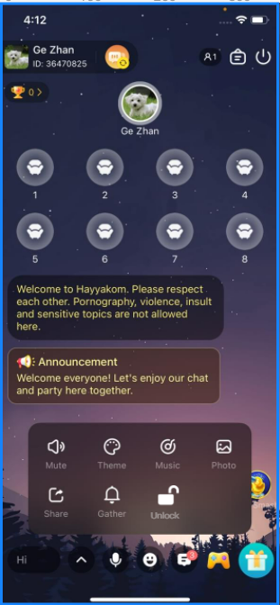

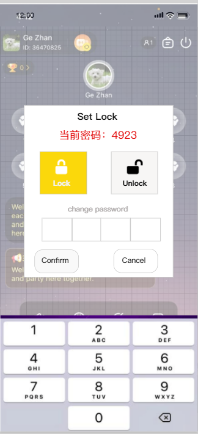

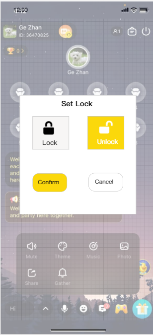

#### 进入密码房

| 功能描述 | 非房主用户进入密码房需要输入密码 |
|---|---|
| 优先级 |  |
| 前置条件 |  |
| 交互原型 | 【图1】输入密码弹窗         【图2】输入密码等待状态 【图3】密码输入错误      【图4】输错密码达到5次弹窗 【图5】密码房                             【图6】 |
| 需求描述 | 不同入口进入房间对应密码房是否支持分发逻辑： 1）推荐房间入口删除分发密码房：官方消息、活动跳转、任务进房、AF链接进房、新用户推荐进房、新人礼包推荐进房； 2）非阿联酋用户在公共场景点击进房需要提示输入密码：个人主页、私聊分享+三方分享、私聊在房状态点击、跟随好友进房、平台排行榜点击进房、币商列表； 阿联酋地区用户点击公共场景进房入口弹窗提示：”进入失败。【好的】“，文案不展示具体失败原因； 非房主用户点击密码房进入时，先判断用户是否进房登录成功，如果用户已被该房间拉黑或者踢出，优先弹拉黑或踢出弹窗；在判断是否是密码房，如果是密码房，弹出输入密码弹窗且同时弹出数字键盘（图1） 输入密码弹窗元素： 标题 密码输入框 【加入】按钮 叉号按钮 输入密码弹窗交互说明： 如果用户输对了密码，点击【加入】按钮后，在等待进房过程中，按钮文案变为【进入中】，按钮内新增加载中的动态图标（如图 2）。此时，点击该按钮的操作无效， 点击【❎】按钮，关闭弹窗，返回上级页面。 如果用户输错了密码或没输入密码，点击【加入】按钮后，密码清空，且密码输入框标红表示，且密码输入框下方显示字样：“密码错误，请重新输入。”，同时，密码房下方展示文案【你还有#剩余机会次数#机会】里的剩余机会次数数字减1，用户开始默认有5次机会（如图3） 如果用户输错密码次数小于5次时，退出房间重新进入该密码房（距离第一次输入密码时间小于等于30分钟时），输错密码的剩余次数同上次退出时一致；数据存储记录30分钟。 如果用户输入密码错误超过五次，弹出密码输入错误达到5次弹窗（如图4），该弹窗提示文案【密码错误已达5次，请稍后再试】，点击该弹窗的确认按钮，关闭弹窗，返回上级页面。 用户1分钟（距离最后一次验证密码时间）内重新进入密码输错达到五次的房间，再次弹出密码输入弹窗，输入密码点击确认后，弹出错误达到5次弹窗（图4）；超过1分钟后重新进入房间，则重新弹出输入密码弹窗，输错机会重置为5次。 首页展示的密码房、在私聊页面分享的密码房和搜索页面搜索出来的密码房均展示密码房图标。（详见UI稿） 特殊说明 所有用户密码房在Party页的【Recommend】【Trends】页面展示，在【Recommend】页面的前20个房间排序中不包含密码房（从热度值取的数据如果是密码房，按照热度值正常排序），后21个房间的密码房按照热度正常排序 新人礼包弹窗进入房间去除密码房 如果用户在房间内跳转跳到密码房（包括全站礼物公屏点击跳转），用户关闭密码输入框的叉号按钮或点击【输错密码达到5次弹窗】的确认按钮时，用户直接返回大厅。 用户输入密码时，如果密码房解锁了，变成非密码房，用户点击【Enter】按钮直接进入房间。 AF链接跳到房间、新人进房引导浮层、活动跳到房间、任务里（在房间里发消息、上麦5分钟、上麦15分钟、玩Ludo/Domino游戏、在房间里待30分钟）、官方消息配置随机跳转到房间时 去除密码房。 |
| 补充说明 |  |

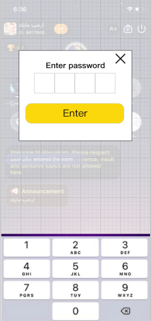

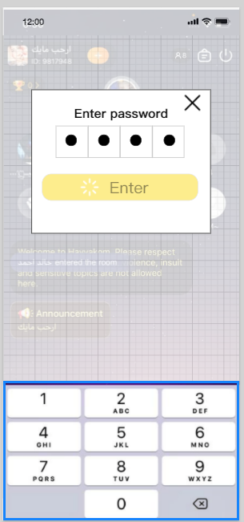

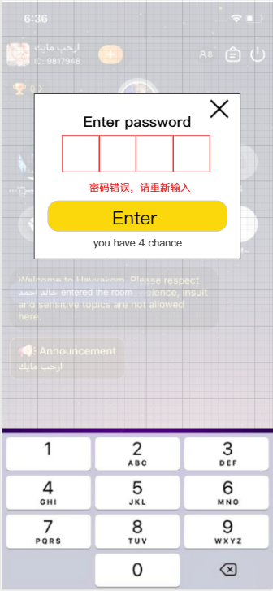

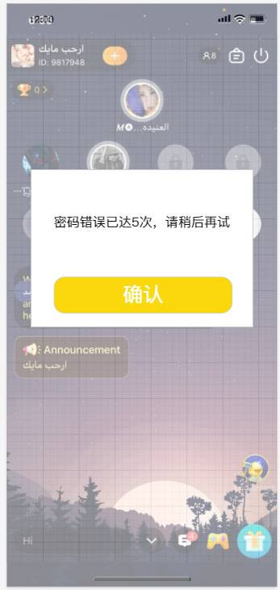

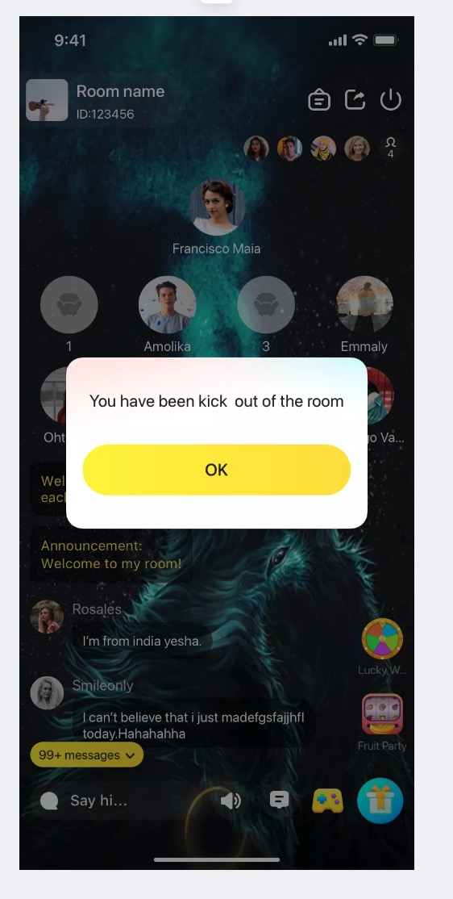

### 房间升级

| 需求描述 | 房间最大在线人数&管理员人数升级 |
|---|---|
| 优先级 | 高 |
| 输入/前置条件 |  |
| 需求描述 | 图1                      图2 图3                      图4 图5                        图6 图7 房间升级档位（数值待定）： 用户进入商城默认展示当前正在使用的房间类型； 点击“升级”按钮判断当前金币余额是否充足，若金币不足时弹出toast提示并跳转金币充值页面（“我的-钱包-金币”页面）快捷充值弹窗，支付完成后返回当前页面保留当前操作页面（例如：升级为低级房时金币不足，完成充值后页面返回低级房页面），见图4；快捷充值不返回/不展示「还差 XXX 金币」。 已获得的房间类型页面底部不再展示购买按钮，替换为“当前你的房间类型是XX房”（XX是房间类型），见图5；例：房间类型已经升级为中级房，查看基础房或低级房页面底部展示：“当前你的房间类型是低级房”； 若当前用户已经升级房间，购买的房间类型非最高等级，点击更高等级的房间类型页面看到的价格仅为第一次直接购买当前房间类型的差价，详见上表，页面展示原价和现价，见图6； 房主点击【图3】房间更多操作面板或【图7】的“升级房间”按钮，页面跳转房间升级页面，页面默认选中当前正在使用的房间类型； 房间升级后不可降级； 购买成功后弹出toast：“升级成功”，对应生成金币消费流水（“我的-钱包”可见）：YYY1房升级至YYY2         -XXX金币；XXX是升级房间类型消费的金币数量，YYY1和YYY2是房间类型等级； 若用户进入某房间因当前房间同时在线人数达到上限不能进房，此时当前房主收到1条系统消息通知：“你的房间容量已达上限，X个用户无法进入你的房间，请前往升级房间容量。”点击消息跳转自己的房间升级页面并自动选中更高一级的房间档位； 注： X为截止当前时间今天累计因容量上限原因无法进入房间的累计人数，去重；每次升级后该数据清零； 次系统消息触发频率限制：1天最多触发3次，每10分钟最多触发1次（此处数值可配置）； 如果当前等级已经是最高等级，不再触发该系统消息 |
| 补充说明 | 业务需要记录以下数据： 低级/中级/高级/超级房使用房间数量； 低级升中级，低级升高级，低级升超级房数量；中级升高级，中级升超级房数量；高级升超级房数量； |

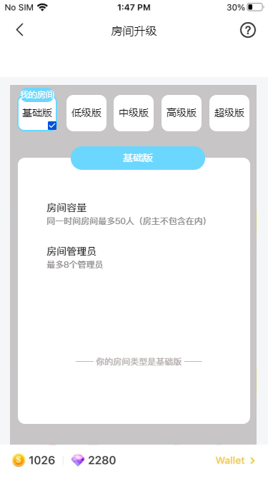

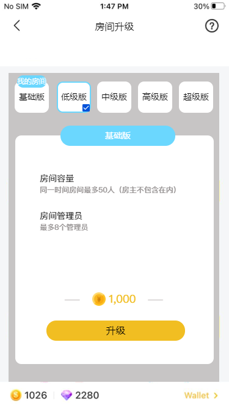

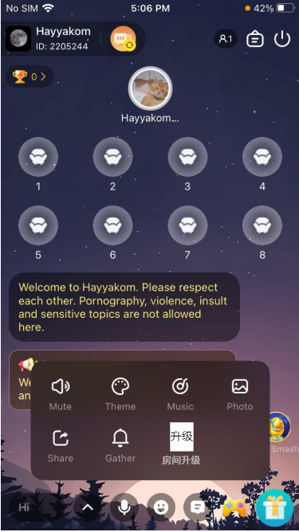

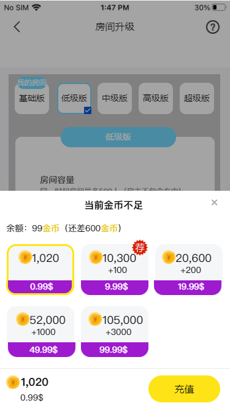

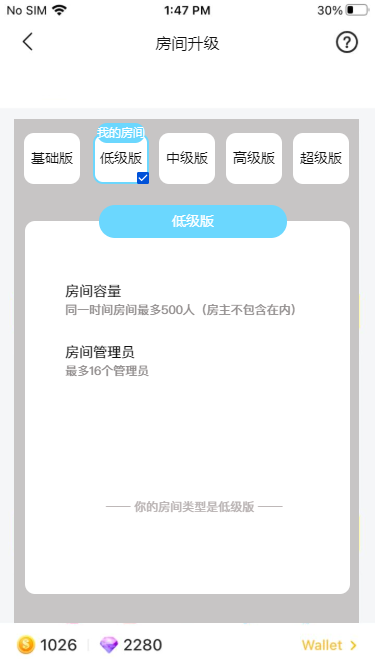

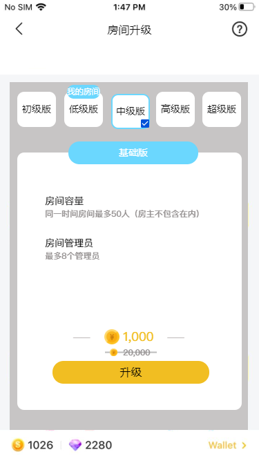

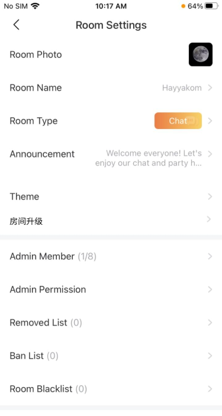

### 房间音乐

#### 房间音乐入口

| 功能描述 | 房间音乐入口 |
|---|---|
| 优先级 | 高 |
| 输入/前置条件 |  |
| 需求描述 | 图1                        图2 图3                       图4 点击图1页面更多操作按钮弹出更多操作浮层，见图2，点击音乐按钮，音乐列表为空时出现图3所示音乐播放器，点击弹窗外区域可关闭音乐播放器。 |
| 输出/后置条件 |  |
| 补充说明 |  |

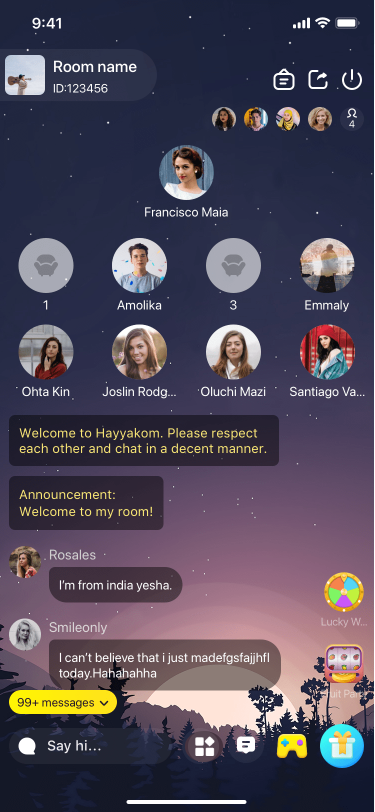

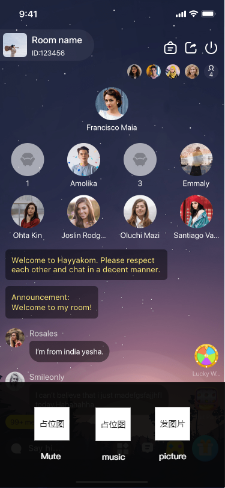

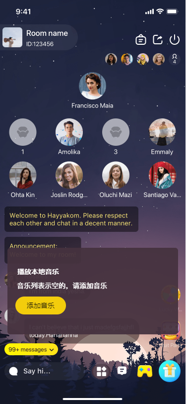

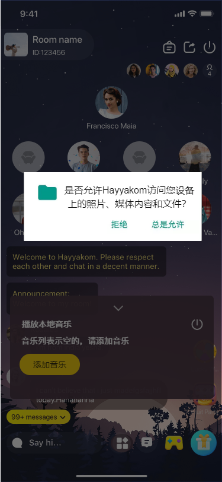

#### 添加音乐-安卓

| 功能描述 | 房间添加音乐-安卓端 |
|---|---|
| 优先级 | 高 |
| 输入/前置条件 |  |
| 需求描述 | 图3 图5-安卓             图6-安卓 图7-安卓            图8-安卓 图9 点击添加音乐按钮（见图3）自动获取手机照片媒体内容文件的权限，见图4，获取权限后进入添加音乐页，见图5。图5为手机中所有音乐文件夹，每个文件夹名称下显示音乐数量。点击文件夹，从文件夹中选择要添加的音乐，点击全选按钮可一键选中当前文件夹中所有音乐，见图6。点击返回按钮或完成按钮，回到添加音乐页，见图7；返回图7后可从其他文件夹中继续选择音乐。点击返回按钮或完成按钮，回到添加音乐页。对应文件夹右侧显示已选择的音乐数量，见图7，点击确认添加按钮，Toast提示“成功！”，进入音乐列表，图8。 点击扫描按钮可检测更新列表展示手机最新的音乐文件，扫描动效见图9 |
| 输出/后置条件 |  |
| 补充说明 |  |

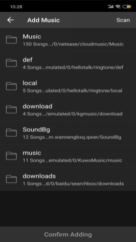

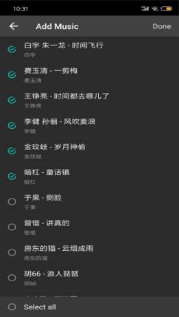

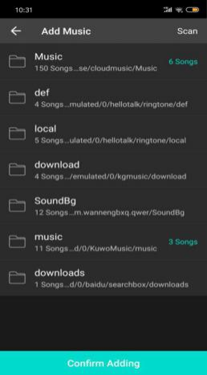

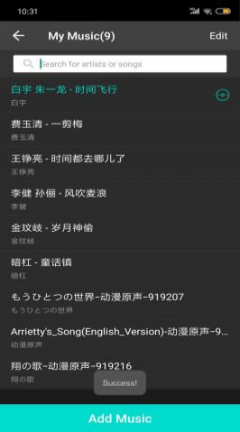

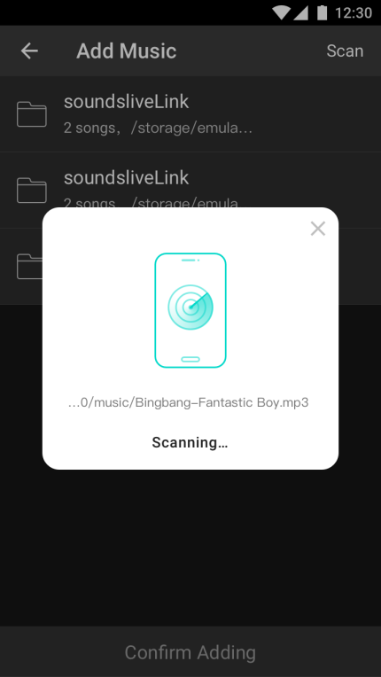

#### 添加音乐-本地音乐-ios

| 功能描述 | 手机上传本地音乐 |
|---|---|
| 优先级 | 高 |
| 输入/前置条件 |  |
| 需求描述 | 图1               图2 图3                  图4 图5 iOS客户端添加音乐有两种方式：上传手机本地音乐和WiFi上传音乐。 点击上传手机本地音乐按钮（见图1），进入本地曲库页，标题右侧显示本地音乐数量，见图2/图3，没有音乐时显示占位语（见图4）。占位语：没有可用音乐，请先下载音乐到你的手机 逐一选择或一键全选要上传的音乐后添加按钮变成可点击状态，按钮右侧显示选择的音乐数。点击按钮，音乐添加成功后跳转到音乐列表页，图5。 |
| 输出/后置条件 |  |
| 补充说明 |  |

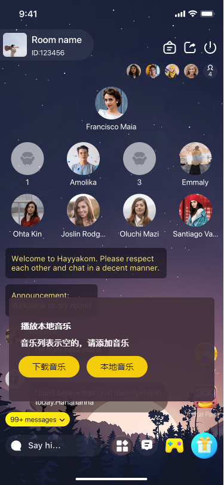

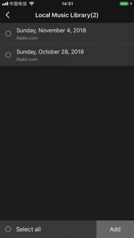

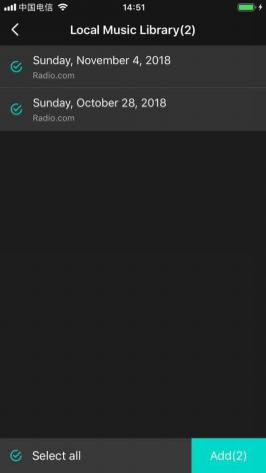

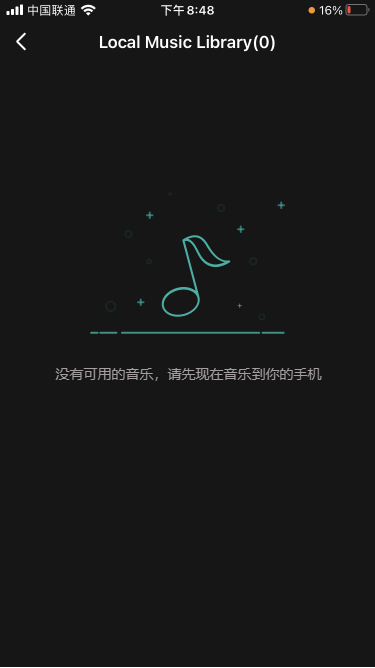

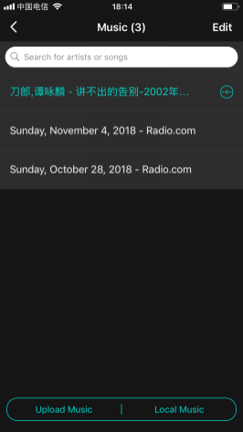

#### 添加音乐-WIFI上传音乐-ios

| 功能描述 | WIFI环境下上传音乐 |
|---|---|
| 优先级 | 高 |
| 输入/前置条件 | 用户打开音乐播放器 |
| 需求描述 | 图0 图1              图2 图3                     图4 图5                 图6 图7 点击WiFi上传音乐按钮（见图0或图1），进入上传音乐页，见图2。手机和电脑连接同一WiFi后点击下一步按钮，弹出获取位置权限弹窗，见图7，同意权限后进入图3所示页面。在电脑浏览器中输入页面显示的网址，打开上传音乐页，图4。点击选择按钮从电脑中选择音乐，选择完成后页面上显示已选择的音乐，图5，点击上传按钮，进度条达到100%时音乐上传成功（见图6），可在手机上“音乐列表”查看已下载的音乐。 |
| 输出/后置条件 |  |
| 补充说明 |  |

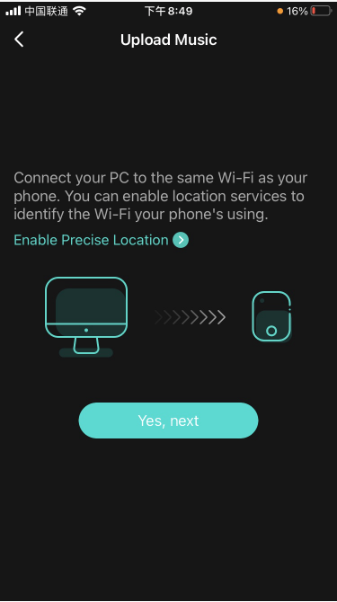

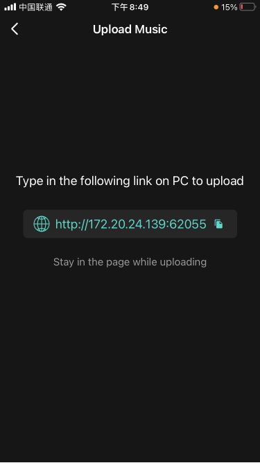

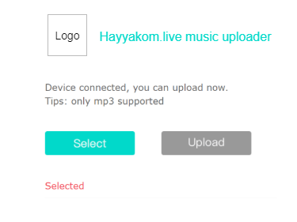

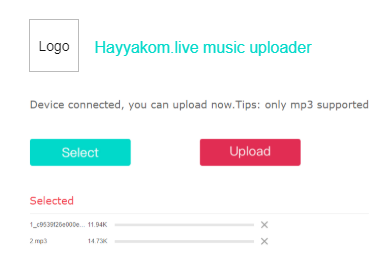

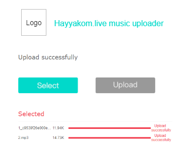

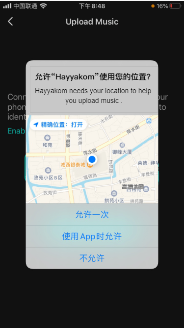

#### 音乐列表

| 功能描述 | 音乐列表功能 |
|---|---|
| 优先级 | 高 |
| 输入/前置条件 | 打开房间音乐列表 |
| 需求描述 | 图1-ios             图2-安卓 图3-ios             图4-安卓 图5-安卓            图6 点击图6右下角音乐列表图标跳转音乐列表页面，见图1、图2； 音乐列表由编辑按钮、搜索框、已添加的音乐和添加音乐按钮组成，标题右侧显示音乐数量，图1、图2。 搜索音乐：在搜索框中输入音乐名或作者名，自动出现搜索结果，可快速查找音乐。支持精确搜索和模糊搜索（搜索规则参考房间大厅-用户/房间搜索）。 播放音乐：点击音乐列表中的任意音乐即可播放此音乐，播放中的音乐显示为绿色，见图1、图2、图3 删除音乐：点击编辑按钮，进入编辑页，图3&图4。可逐一选择或一键全选音乐，选中效果见图5（ios端选中按钮显示效果同安卓端）；无点击删除按钮即可删除音乐，删除后页面自动刷新。 添加音乐：点击添加音乐按钮进入添加音乐页，如何添加音乐在上一部分已经叙述过，不再重复提及。 |
| 输出/后置条件 |  |
| 补充说明 |  |

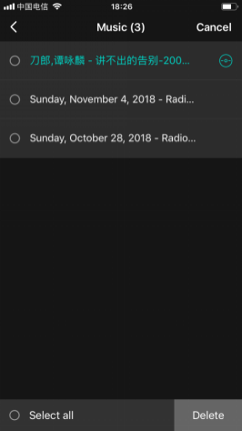

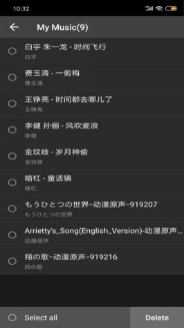

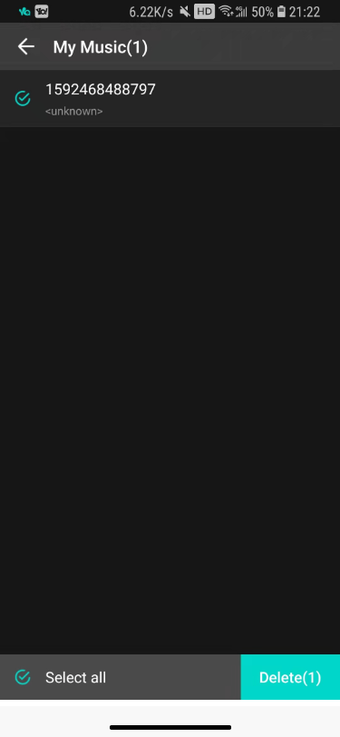

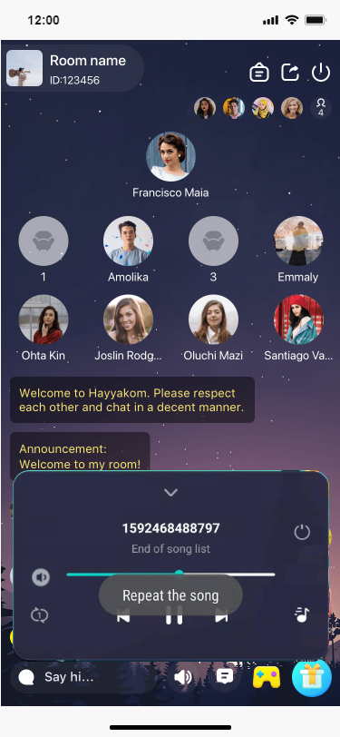

#### 播放音乐

| 功能描述 | 音乐播放功能 |
|---|---|
| 优先级 | 高 |
| 输入/前置条件 | 已上传音乐 |
| 需求描述 | 图1                 图2 图3 点击音乐按钮，出现图1所示音乐播放器。音乐播放器中显示当前正在播放（暂停中）的音乐名，下方显示下一首音乐名。若音乐列表中只有一首音乐，下一首音乐名位置处显示“End of song list”。 音乐播放器操作功能有：调节音量、收起音乐播放器按钮（收起后在侧边栏展示，展示位置在游戏上方）、音乐列表图标、关闭音乐播放器按钮、单曲/列表循环播放按钮、上一首/停止/下一首按钮，见图1。 播放：点击播放按钮开始播放音乐。默认循环播放列表音乐。播放音乐时上麦，房间内所有人都可听到音乐，不上麦时仅自己可听到音乐。 循环模式：可切换列表循环/单曲循环，按钮中显示当前的播放模式，点击按钮可直接切换为另一种模式，默认为列表循环，下次打开播放音乐弹窗时显示为上次离开时的播放模式。切换为单曲循环时toast提示：“单曲循环”，切换为列表循环时toast提示：“列表循环” 暂停：播放按钮点击后变成暂停按钮，点击按钮音乐暂停。 调节音量：滑动调节音量。左滑降低音量，右滑提高音量。 播放上/下一首：点击上/下一首按钮 收起播放器：播放器最小化至屏幕侧边栏，图2，音乐照常播放。播放音乐时侧边栏音乐图标中唱片转动，不播放时唱片不转动。点击侧边栏音乐图标，音乐播放器打开，音乐图标从侧边栏消失。侧边音乐图标展示位置：侧边图标最下面的位置 音乐列表：点击音乐列表按钮可打开音乐列表。 关闭播放器：点击关闭按钮则播放器关闭，收起音乐播放浮窗，侧边不展示音乐图。 注：若点击房间消音按钮也会关闭背景音乐，若当前自己正在播放音乐，点击房间消音按钮不用关闭背景音乐。 |
| 输出/后置条件 |  |
| 补充说明 |  |

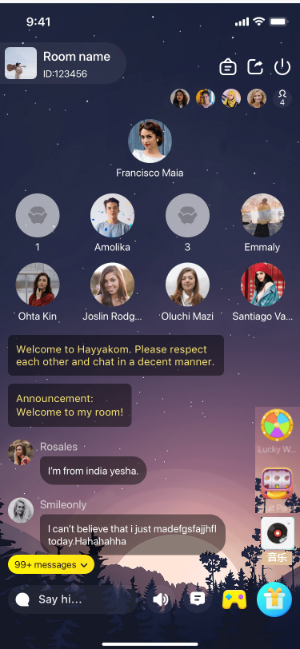

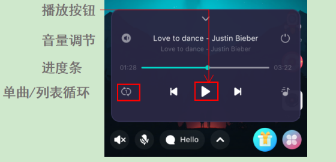

### 房间聊天发图

| 功能名称 | 房间聊天发图 |
|---|---|
| 优先级 | 高 |
| 功能描述 | 在房间内发送图片到聊天 |
| 输入/前置条件 | 拥有功能权限，且获取系统相册/相机权限的用户 |
| 交互原型 | 「图1」                「图2」               「图3」 「图4」 「图5」 |
| 字段描述 | 「图1」入口 房间内，点击”更多操作“icon，再点击”Photo“icon。需判断： 用户是否有聊天发图权限，若无则弹窗引导用户成为VIP； 若有聊天发图特权，则判断是否有相册权限，若有则进入选择照片页；若无则请求相册权限，如图4，弹窗文案”图片会用于聊天发图。“（功能逻辑复用） 「图2」图片展示 用户发送图片后，在房间内展示该图片。所有人可见。 缩略图规则： 见下方补充说明。 交互：点击缩略图，缩略图放大至「图3」效果。 「图3」原图展示交互 长按，弹出下载弹窗。点击后判断设备权限，并下载。或点击右下角下载按钮，判断设备权限，并下载。 点击：单次点击任意区域，关闭查看原图。 双击：连续双击图片某个区域，以点击区域为中心，并放大图片。再次双击：取消放大。 双指缩放：双指可缩放图片。以双指区域为中心，放大或缩小图片。若缩小图片，再双指离开屏幕后，恢复正常大小。 「图4」客户端相册、相机流程（请求权限文案不同） 复用现有逻辑。含请求相册权限、请求相机权限、选择图片、确认发送等。 请求相机权限的弹窗文案：“相机会用于拍摄照片。” iOS说明：iOS取消相机功能。 「图5」下载-请求权限 用户点击下载图片，但未授权对应权限时： 若可申请当前设备授权，则弹窗提示“保存图片需要获取您的设备存储权限”。 点击【确定】，则获取权限，下载对应原图； 点击【取消】，则关闭该弹窗。 若不可申请当前设备授权，则弹窗提示“权限获取失败，请到设置中获取相关权限”。 点击【设置】，进入手机系统设置页。若系统允许，进入应用的对应权限设置页； 点击【取消】，则关闭弹窗。 |
| 需求描述 | 图片风控 1. 先审后发；用户发送图片，若图片命中风控策略，则发送失败，并toast“发送失败”。 |
| 补充说明 |  |

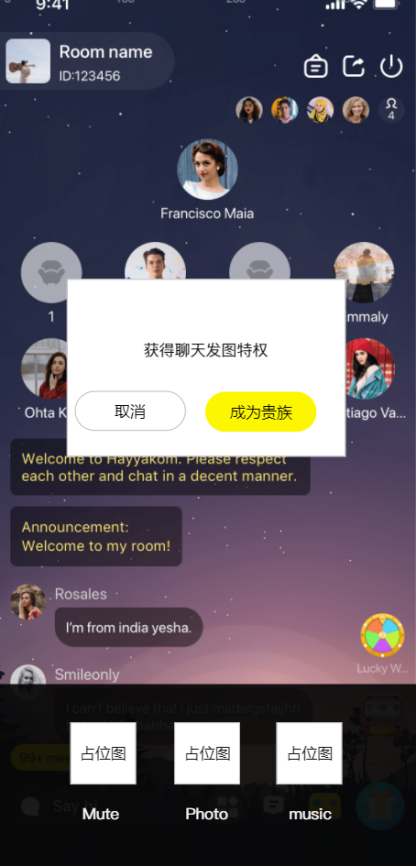

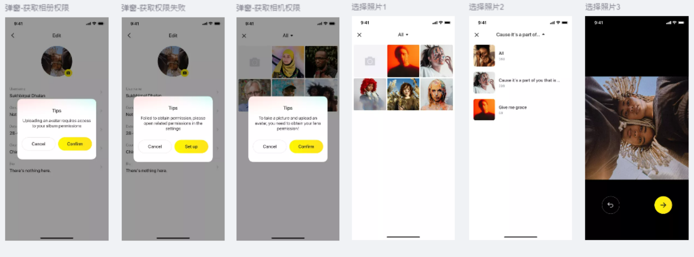

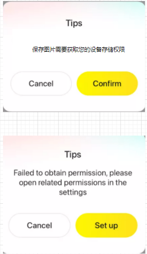

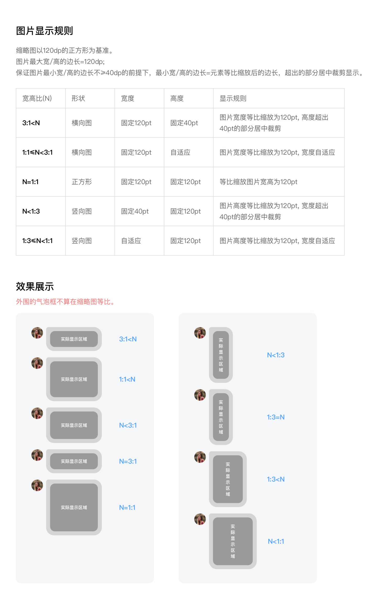

### 房间添加 banner 入口

| 功能描述 | 房间内侧边栏添加活动banner入口 |
|---|---|
| 优先级 | 高 |
| 输入/前置条件 |  |
| 需求描述 | 图1              图2 图3 房间内侧边栏游戏图标上方展示平台活动banner和活动名称，见图1，支持配置两个banner位，上面的banner位最多可配置5个banner，下面的banner位最多可配置1个banner 当活动banner位配置大于等于2个时，banner和活动名称下方展示“...”（点的个数等于配置的banner个数），手动左右滑动banner或每个banner及对应活动名称展示5秒后自动轮播循环播放当前配置的所有banner，点击banner跳转对应H5页面，点击返回按钮可返回当前房间 当活动名称文字数量较多导致文字换行时，当前banner位配置的所有banner的文字都用2行展示的方式（即文字不满2行，第2行空一行），切换banner需要图片在一条水平线，见图2和图3 文字超过2行的宽度时（宽度根据UI提供的宽度来定），展示不下的文字显示“...” 当右边侧边栏9麦以下，底部送礼按钮以上的侧边栏区域如果展示不下的话可以手动上下滑动展示展示 |
| 输出/后置条件 |  |
| 补充说明 |  |

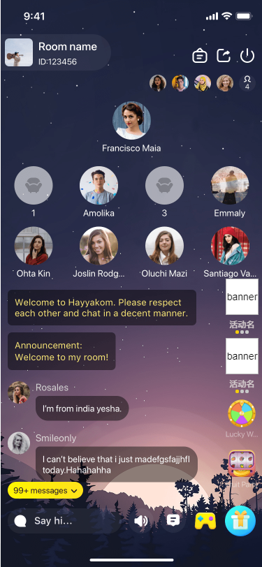

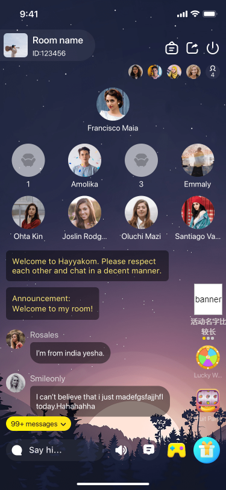

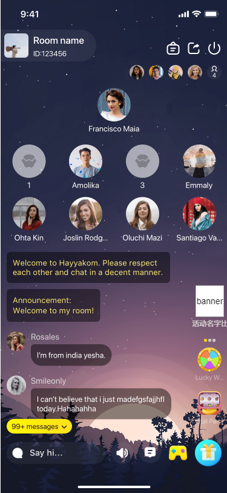

### 麦上表情包

| 功能描述 | 用户使用麦上表情包 |
|---|---|
| 优先级 | 高 |
| 输入/前置条件 | 用户上麦 |
| 需求描述 | 图1           图2 图3           图4 图5           图6 用户上麦后，自己视角房间底部操作栏自动展示表情图标，见图1 点击麦上表情图标弹出对应浮层窗（见图2），每次打开面板默认展示第一个普通麦上表情tab页面。无贵族专属表情 tab。长按任意表情该表情上方预览该表情的播放效果（见图4），点击任意表情后自动收起当前浮层窗，自己的麦位播放当前表情动画，见图5； 表情浮层窗展示表情超过一页后，浮窗底部展示“...”，一个“.”表示一页，手动左右滑动可切换展示每一页的表情，当前页面的“.”高亮展示，见图2 |
| 输出/后置条件 |  |
| 补充说明 |  |

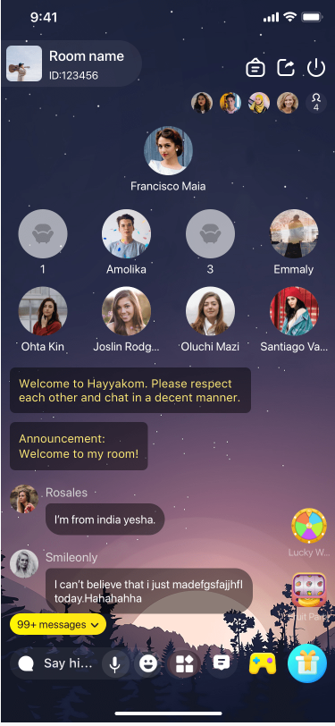

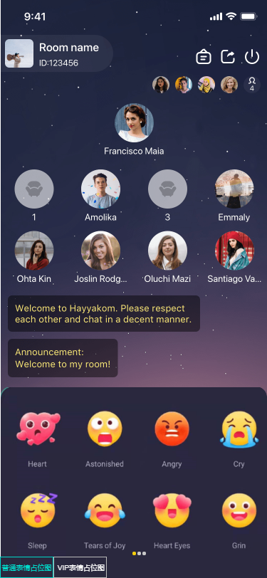

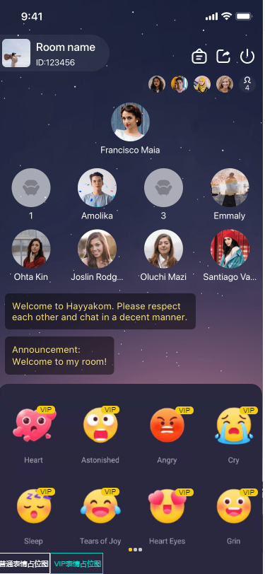

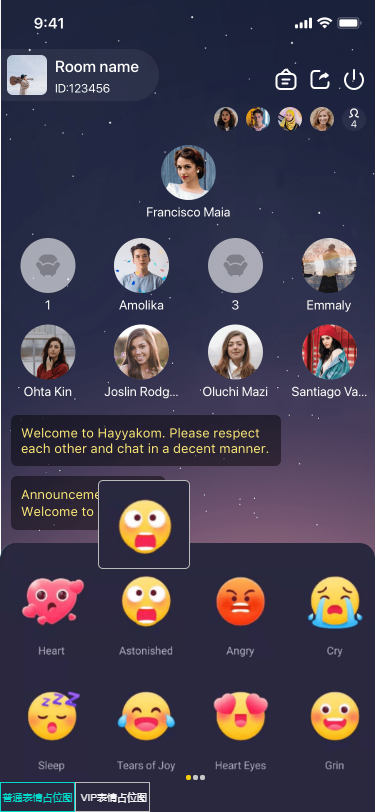

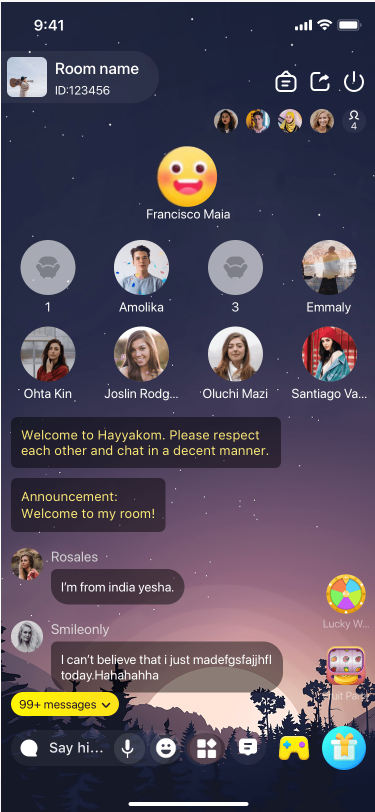

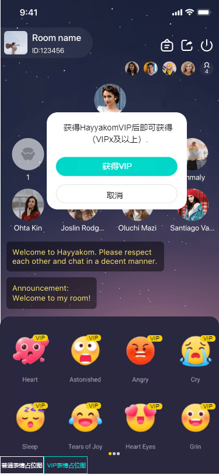

### 周星礼物榜单

| 功能描述 | 周星礼物 |
|---|---|
| 优先级 | 高 |
| 输入/前置条件 | 后台配置周星礼物 |
| 需求描述 |  |
| 输出/后置条件 | 图1 后台礼物管理配置周星礼物后，客户端展示周星礼物及周星礼物标记和周星礼物详情描述（一期已做，未联调） 周星榜单：选中周星礼物时的 Banner 与入口见「活动与周星 Banner」。点击可进入周星榜单页面（H5开发） 周星榜单Top3可获得对应奖励，奖励每周发放一次，发放时间详见图1，本周/上周周星榜展示Top10用户，展示用户头像，昵称，本周收到当前周星礼物累计数量（本周/上周榜单区域交互：选中那个周星礼物按钮，榜单对应刷新哪个周星礼物的榜单），数据更新时间详见图一规则描述；用户进入H5页面默认进入本周榜单数据；H5页面右上角需要添加刷新按钮，点击可刷新当前页面 周星礼物后台功能联调：周星礼物后台配置礼物管理需要和客户端进行联调测试。 奖励发放配置表（待定）： 注：座驾发放至用户背包，不需要自动佩戴。 奖励发放系统消息：恭喜你获得本周周星第XXX名，金币奖励和座驾奖励已发放至你的账户，金币奖励请前往“我的-钱包-金币”页面查看，座驾奖励请前往“我的-背包-座驾”页面查看 |
| 补充说明 |  |

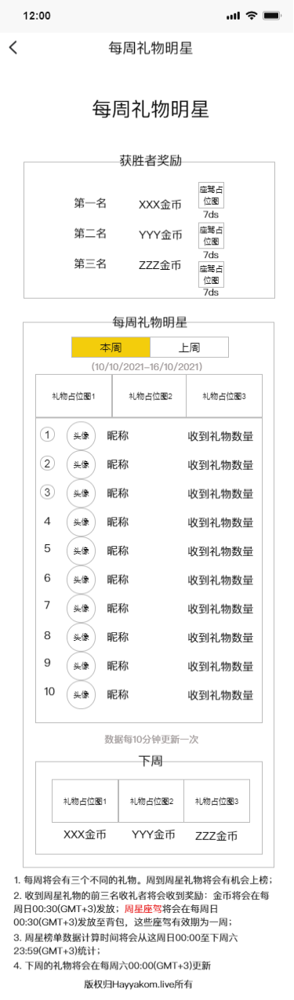

### 房间用户列表排序优化

| 功能描述 | 房间内用户列表排序优化 |
|---|---|
| 优先级 | 高 |
| 输入/前置条件 |  |
| 需求描述 | 在房列表排序规则（与身份相关） 房主 房间贡献周榜上用户（按名次降序排） 房间贡献日榜上用户（按名次降序排） VIP（先根据VIP等级从高到低，再根据用户等级降序排，等级相同时按经验值降序排） 管理员（根据用户等级降序排，等级相同时按经验值降序排） 普通用户（根据用户等级降序排，等级相同时按经验值降序排） 在房列表展示信息补充： 增加展示标识：贡献榜排名（未上榜不展示）、个人等级（等级为0不展示）、VIP标识（没有不展示） 标识展示顺序：榜单排名、用户等级、VIP标识 |
| 输出/后置条件 |  |
| 补充说明 | 无贵族标识。 |

### 活动礼物标识

| 功能描述 | 活动礼物需要展示活动礼物标识 |
|---|---|
| 优先级 | 高 |
| 输入/前置条件 | 后台配置活动礼物 |
| 需求描述 |  |
| 输出/后置条件 | 图1 后台礼物管理配置活动礼物后，客户端展示的活动礼物需要展示活动礼物标识及对应详情介绍，见图1. 查看活动礼物详情介绍交互：选择了礼物A，再点击一下礼物A时出现礼物详情介绍，此时再点击礼物B立即选中礼物B，点击礼物B或点击礼物面板外区域则消失，详情每次出现3秒后自动消失。 |
| 补充说明 | 二次点击选中礼物打开说明，亦见「礼物面板」。 |

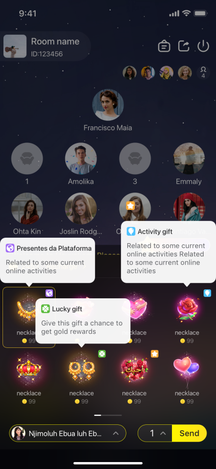

### 关注列表优化

| 功能描述 | 若用户未关注任何房间，关注列表-推荐列表排序优化 |
|---|---|
| 优先级 | 高 |
| 输入/前置条件 |  |
| 需求描述 | 图1 关注列表-推荐列表排序规则： 1.  14天内自己送过礼物的房间：房间数据根据最后一次在该房间送礼时间倒序排序（最近送过礼的房间展示在上面） 2.  14天内自己上过麦的房间：房间数据根据在该房间最后一次上麦时间倒序排序（最近上过麦的时间展示在前面） 3.  14天内自己发言过的房间：房间数据根据在该房间发言最后一次时间倒序排序（最近发过言的时间展示在前面） 4.  14天内收到过礼的房间：房间数据根据在该房间最后一次收到礼物的时间倒序排序（最近收过礼的房间展示在前面） 5.  根据房间大厅-推荐列表数据排序逻辑展示（优先官方/运营房、当前语区房间并根据热度从大到小排序、根据热度从到到小排序） |
| 输出/后置条件 |  |
| 补充说明 |  |

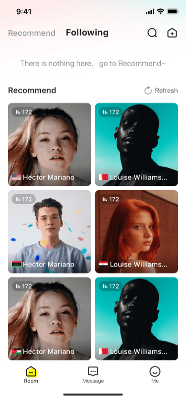

### 消息列表添加活动消息

| 功能描述 | 消息列表添加活动消息入口 |
|---|---|
| 优先级 | 高 |
| 输入/前置条件 |  |
| 需求描述 | 图1               图2 图3 消息列表添加活动消息入口，见图1/图2；当前无活动消息时，消息列表不展示消息和消息时间，见图1；当前有活动消息时，消息列表展示最近一条活动消息的标题和消息发送时间，见图2 点击活动消息入口进入活动详情页面，见图3；活动详情页面显示内容为：活动消息后台发送时间（格式：日/月/时:分）、活动名称、活动banner、活动描述、[查看更多]按钮（点击整个图文区域跳转活动H5页面） 新用户活动消息列表只显示进行中，过期不展示。 |
| 输出/后置条件 |  |
| 补充说明 | 推送打开活动页见「活动推送与新用户列表」。 |

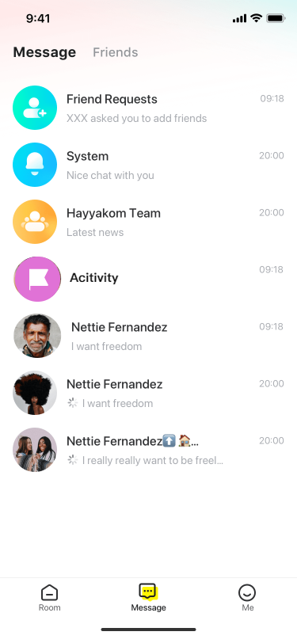

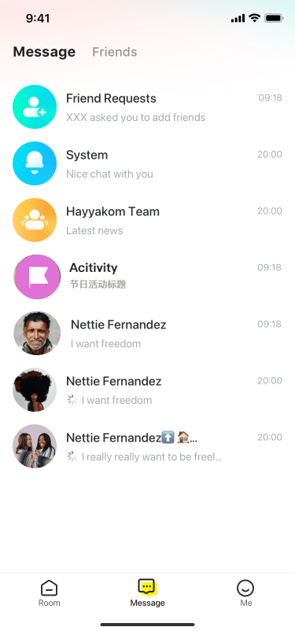

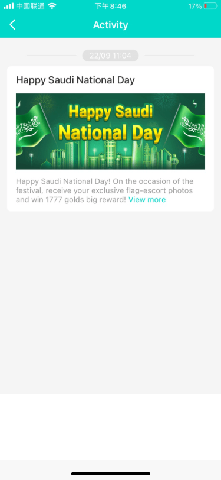

### 网络检测

| 功能描述 | APP网络监测 |
|---|---|
| 优先级 | 高 |
| 输入/前置条件 |  |
| 需求描述 | 图1                   图2 图3                 图4 图5 我的-设置页面添加“网络监测”入口，见图5 网络检测前，“网络检测”页面上方会显示通用的提示语，页面下方悬浮显示【开始检测】按钮（如图1），点击该按钮，页面切换为网络检测进行中的状态，页面上方的提示语继续保留，【开始检测】按钮隐藏，页面中间出现当前检测进度条、进度值，以及其它提示语（图2）。 因为检测项中包含用户所在国家，需要获取用户的手机定位权限，所以当检测开始时， 若之前未获取该权限，则需要弹出系统自带的获取定位权限弹窗。若用户同意时，检测结果中显示用户所在的国家；若用户拒绝时，结果中所在国家项信息为空即可。另外，该弹窗出现时，网络检测的进程不得中断 若之前已同意或已拒绝获取定位权限，则不会弹出弹窗。 检测完成时，页面切换为检测完成的状态（图3），页面切换的前提是定位授权提示弹窗已关闭，否则不进行切换。页面上方的提示语继续保留，页面中间显示检测完成提示语，页面下方出现悬浮按钮【重新检测】与【显示详情】 点击【重新检测】按钮，页面重新切换回网络检测进行中的状态 点击【显示详情】按钮，进入“检测报告”展示页面（图4），页面下方悬浮显示【复制】按钮，点击即可复制页面中的所有文本内容，toast提示“复制成功” 检测报告包含的检测项目如下所示： 客户端上生成的报告只需以纯文本的形式依次罗列各参数的检测结果，各参数的名称使用英文名 检测报告需在检测完成时通过API接口自动上传至日志服务器。上传过程中离开检测页面不得中断，继续完成上传。 |
| 输出/后置条件 |  |
| 补充说明 |  |

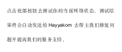

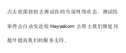

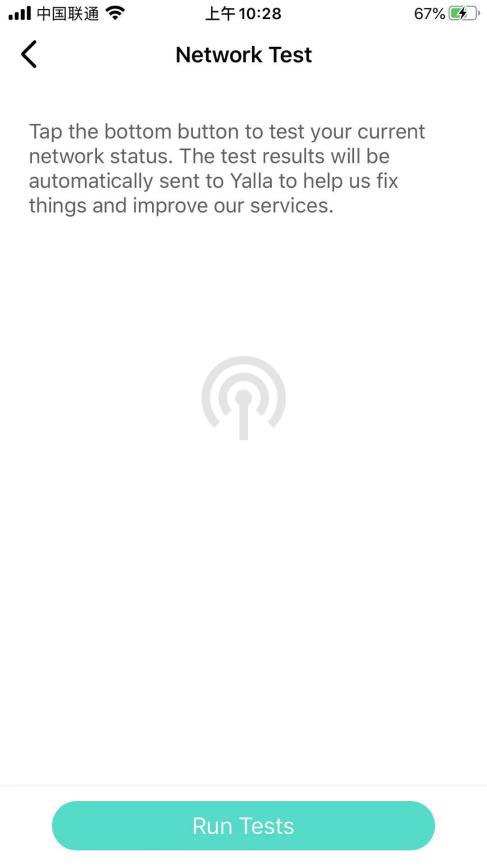

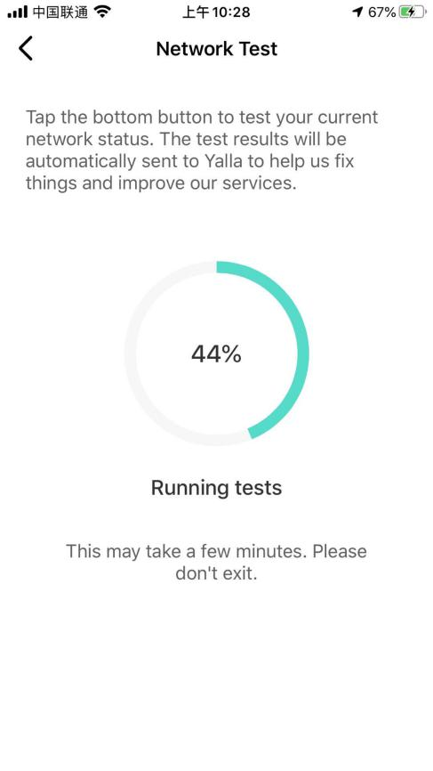

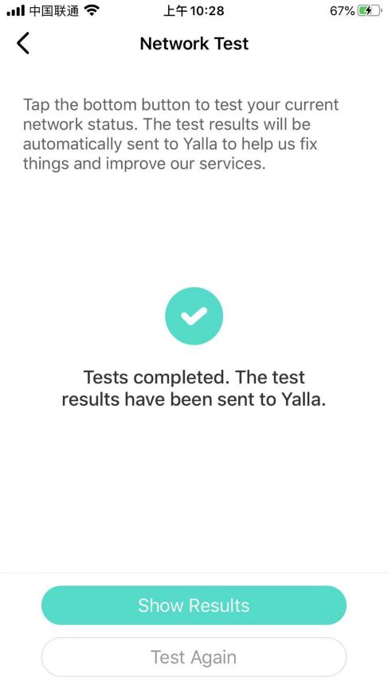

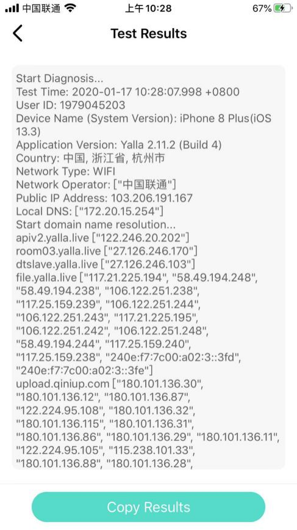

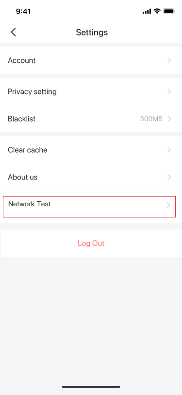

### 一键打招呼

| 功能描述 | 用户进入房间，其他用户可以进行打招呼+邀请上麦 |
|---|---|
| 优先级 | 高 |
| 前置条件 | 每次用户进入房间 |
| 需求描述 | [图1]用户进入房间-自己视角   [图2]用户进入房间-房主/管理员视角 [图3]打过招呼-房主/管理员视角  [图4]打过招呼-进房用户自己视角 [图5]打过招呼再次进房-房主/管理员视角 注：被禁言用户点击打招呼按钮toast提示“你已被禁言”（走禁言后用户发言提示逻辑，提示文案同之前逻辑提示文案） 注册3天内用户进入房间后房间公屏消息展示一条进入房间的系统消息（与房间发言消息为同类型消息，有新的消息会被顶上去），仅房主、管理员可见（区分自己视角和他人视角，见图1、图2）系统消息内容包含：新人标签+用户等级+VIP标识+用户头像+用户昵称+固定文案 房主/管理员户点击进房的系统消息（消息全部区域）立即打开该用户的个人资料卡片；如果用户已经离开房间，点击无反应，不会调起个人资料卡； 用户进房后，房主/管理员视角看到的进房系统消息附带一个打招呼按钮+邀请上麦按钮，按钮高亮显示，见图2； 房主/管理员点击打招呼按钮后从“打招呼文字库”中随机取一个打招呼用语，并@进房用户立即发出消息（被打招呼的用户收到的文案为房间语区对应语言），见图3； 注：打招呼文字库内文字服务端可配置调整 房主/管理员对每次进来的同一个用户只能打一次招呼，本次打过招呼后招呼按钮置灰失，见图3；当天打过招呼的用户，进来后系统消息“XXX进来了”文案后不显示打招呼按钮，仅显示邀请上麦按钮，见图5； 6. 房主/管理员对本次进来的同一个用户消息区域的“邀请上麦”按钮只能发起一次邀请上麦的请求（无论对方是否同意上麦），成功发起邀请上麦请求后置灰，下次进入房间仍展示该“邀请上麦”按钮（见图2）；房主/管理员点击邀请上麦按钮后，用户收到上麦请求（后续逻辑同线上邀请上麦功能）； 若麦上人满（官方房 15 个已占麦，非官方 8），toast提示：“麦位已满，请稍后再试”，邀请上麦按钮仍高亮，可再次点击该按钮发起邀请上麦请求； 若用户已经在麦上了，toast提示：“用户已经在麦上”，邀请上麦按钮仍高亮，可再次点击该按钮发起邀请上麦请求； 若房主或多个管理员同时给一个新进房的用户发送多个邀请上麦请求，接受邀请上麦请求的用户只收到最先收到的请求，不会重复展示请求弹窗； 若房主/管理员 点击打招呼/邀请上麦按钮，用户已经离开房间，对应打招呼、上麦邀请操作不生效，提示：“该用户不在房” 注： 房主/管理员退出房间，再进入房间后，打招呼功能的次数限制会清零，可以对已打过招呼的新注册用户再次打招呼/邀请上麦（考虑客户端实现问题） 若消息区有多条打招呼消息，房主/管理员对其中1条消息操作过“打招呼”/“邀请上麦”后，其他打招呼消息与本条打招呼消息的“打招呼”/“邀请上麦”按钮一起置灰 |
| 后置条件 |  |
| 补充说明 |  |

### 安卓消息页通知权限

背景：安卓端因历史包袱，手机权限默认不会开启通知权限，导致用户进入应用默认无法收到推送消息。

优化安卓逻辑：进入 Message 页面检测当前应用是否开启权限通知，如果没有开启弹窗提示开启权限，点击按钮跳转系统设置开启权限，若关闭弹窗或关闭权限，7天（自然日）内不再弹起弹窗，直到下一个周期进入 Message 页面。

### 幸运数字与掷色子

幸运数字 / 掷色子仍是房间工具。房间幸运数字、掷色子保留服务防刷屏逻辑：X秒内最多能输入Y次（X=30，Y=30），两个游戏限制分开计算，跨房间不重新计算；超过次数提示：“操作频繁，稍后再试”。

### 爆奖礼物

后台配置、统计见 [`../admin/PRD.md#admin-gift-burst`](../admin/PRD.md#admin-gift-burst)。本节只写客户端。不重写爆奖玩法。

#### 新增“爆奖”礼物类型与赠送规则

| 功能描述 | 新增“爆奖”礼物类型&赠送规则 |
|---|---|
| 优先级 | 高 |
| 输入/前置条件 |  |
| 需求描述 | 图1 礼物面板类型新增：新增“爆奖礼物”类型，后台配置该类型礼物时，客户端礼物面板增加“爆奖”tab，若未配置任何该类型礼物不展示此tab；该类型礼物tab展示在礼物面板“VIP”tab之后,爆奖礼物需要在礼物图标右上角展示礼物类型专属标识（见图1）； 选中礼物面板的“爆奖”tab按钮进入对应礼物面板，默认不选中任何礼物，礼物面板顶部展示当前礼物类型说明与排行榜/礼物中奖记录入口按钮（点击跳转“幸运榜单”，详见礼物中奖榜单）； 爆奖礼物支持送全麦人员（每个人支持送1、7、17个）、送全员（每个人支持送1个）； 送单个人支持赠送1、7、17、77、777个； 爆奖礼物支持配置为小礼物、大礼物；不支持设置为幸运礼物、周星礼物（详见后台需求）；说明条展示优先级为：爆奖礼物＞动效活动礼物＞普通活动礼物＞国家礼物额外动效触发条件说明＞全站礼物＞VIP专属礼物 选中爆奖礼物时，礼物面板顶部展示当前的礼物说明：“赠送后最高返还金币奖励达1000倍！”，文案一行展示不下时需要轮播展示（同线上逻辑）； 私聊支持赠送爆奖礼物； 私聊、动态、短视频送礼中100倍及以上大奖仍需要展示中奖弹窗（详见中奖弹窗）； 私聊赠送爆奖礼物，私聊界面送礼消息下放需要展示中奖系统消息，双方视角可见，金币信息需要高亮展示，中奖者点击跳转“钱包-金币明细页面”，非中奖者点击无反应，见下图： 中奖流水与中奖记录仍需要更新在“钱包”与爆奖礼物中奖记录页面; |
| 输出/后置条件 |  |
| 补充说明 |  |

#### 礼物玩法与中奖规则

| 功能描述 | 礼物玩法与中奖规则 |
|---|---|
| 优先级 | 高 |
| 输入/前置条件 |  |
| 需求描述 | 礼物玩法： 每赠送1个“爆奖”礼物，当前礼物平台抽成15%，收礼者抽成为0%，其余比例金币放入平台“爆奖”礼物奖池（详见下文“数值设置-礼物设定”抽水设置）；同时根据下文“数值设置”对应概率实时计算出当前礼物中奖对应金币数，当前金币数为此用户赠送当前礼物获得的奖励金币数，一次赠送多个礼物时每个礼物需要计算一次中奖概率，若本次送礼金币不足时不进行扣费并弹窗提示进行充值（同线上逻辑）； 若奖池剩余金币小于本次计算中奖金则本次送礼不中奖； 赠送爆奖礼物的金币消费不记在以下业务： 不计算在房间工资统计中；H5功能说明页补充此说明，详见翻译文档“历史文案修改”； 数值设置： 注： 1）邮件预警5分钟1次； 2）爆奖礼物数值文档链接： https://365.kdocs.cn/l/chvSTR9Z66Km 送礼跑道&中奖信息通知： 送礼跑道：赠送爆奖礼物的送礼跑到样式与颜色需要区别与其他送礼跑道（老版本展示普通跑道），赠送1个或多个爆奖礼物对应跑道效果见下图： 中奖跑道：若本次赠送爆奖礼物中奖（赠送1个或多个），立即触发1条中奖跑道（老版本不展示此跑道），中奖跑道出现效果与送礼效果相同，需要和送礼跑道一样在送礼跑道队列中排队展示；未中奖不展示； 中奖跑道展示信息：展示爆奖礼物图标、中奖用户头像、本次赠送爆奖礼物（1个或多个）中奖金币数（金币总数=本次送礼所有中奖礼物中奖金币数之和）、本次赠送的爆奖礼物图标、爆奖礼物榜单名次（详见“中奖跑道展示榜单名次规则”）、送礼本人的中奖跑道自己视角需要展示“Me”标识； 中奖跑道展示今日榜单名次规则（数据为0不上榜）： 图1-他人视角“爆奖”礼物中奖跑道 图2-自己视角“爆奖”礼物中奖跑道 前三名文字颜色1+彩带动效； 2-5名文字颜色2； 6-10名文字颜色3； 中奖系统消息（见下图）： 房间用户本次送“爆奖”礼物中奖时在评论区展示1条系统消息：“恭喜XXX赠送【礼物图标】获得YYY金币奖励【爆奖礼物图标】”（若本次送礼1次赠送多个时，YYY为本次送礼所有礼物中奖金币的总和）； 点击系统消息默认调起送礼面板并自动定位在“爆奖”tab并选中第一个礼物； 中奖弹窗：当本次送礼中奖倍率满100倍时（服务端可调整）当前用户会收到中间弹窗提示： 送单个礼物中奖弹窗（见下图3）： 弹窗标题：恭喜获得XXX倍大奖 内容：奖励占位图、获得奖励金币数、【收下】按钮 关闭弹窗条件：点击【收下】按钮或点击弹窗外区域 图3 送多个礼物中奖弹窗（见下图4）： 弹窗标题：恭喜获得XXX倍大奖（XXX为本次送礼中中奖礼物中最大中奖倍率） 内容：奖励占位图、获得奖励金币数、【收下】按钮、中奖礼物个数、本次送礼获得最大倍率奖励个数、中奖最大倍率 关闭弹窗条件：点击【收下】按钮或点击弹窗外区域 图4 中奖广播（见下图）： 若全平台有用户赠送“爆奖”礼物（房间内或房间外）获得500倍及以上（服务端支持调整）奖励则在全站房间和私聊对话页面展示中奖广播； 广播展示内容：“【中奖用户头像】+XXX1（用户昵称）获得XXX金币奖励通过赠送【本次中奖赠送爆奖礼物图标】【跳转按钮】”，“XXX”金币为本次送礼中奖金币数，若本次送礼送多个“爆奖礼物”则“XXX”为本次送礼所有中奖礼物中奖金币之和； 点击中奖广播“【跳转按钮】”： 若用户在房：页面跳转至对应中奖用户所在房间； 若用户不在房：页面跳转至对应中奖用户的个人主页； 若广播展示文字展示不下时需要轮播展示，详见设计稿效果； 若当前房间用户触发广播则广播不展示“Go”按钮； 点击“GO”按钮相关二次确认弹窗： 若用户点击跳转房间（广播用户在房），且当前用户也在房间则弹窗确认：“你确定要跳转这个用户所在房间吗？【取消】【确认】”（可复用全站广播二次确认弹窗）； 若用户点击跳转房间（广播用户在房），且当前用户不在房间内，则直接跳转对应房间； 若用户点击跳转个人主页（广播用户不在房），不弹二次确认弹窗； Keep状态算在房； 金币奖励流水明细 用户送爆奖礼物中奖获得金币立即产生1条金币流水： 爆奖礼物返币        +XXX金币 用户赠送爆奖礼物中奖获得金币立即产生1条中奖记录，详见礼物中奖榜单 特殊情况 老版本：房间看到用户送爆奖礼物，看到的是普通送礼跑道、无中奖系统消息、无中奖跑道、无广播、礼物面板不展示此礼物 |
| 输出/后置条件 |  |
| 补充说明 | 需要奖池数据实时监控看板 |

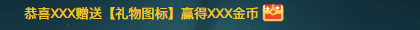

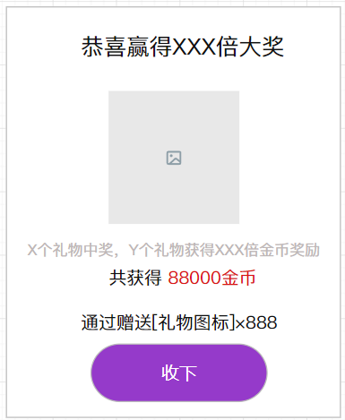

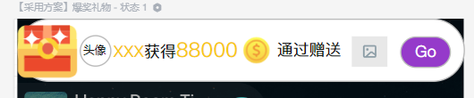

#### 【含H5】礼物中奖榜单与我的中奖记录

| 功能描述 | 礼物中奖榜单&我的中奖记录 |
|---|---|
| 优先级 | 高 |
| 输入/前置条件 |  |
| 需求描述 | 中奖榜单入口： 选中礼物面板的“爆奖”tab展示爆奖礼物的排行榜入口，见下图： 排行榜入口轮播展示排行榜图标、排行榜日榜Top1用户头像，头像展示皇冠标识； 中奖榜单（H5）： 图1                         图2 点击礼物面板“爆奖礼物”排行榜入口，页面默认进入当前礼物中奖排行榜，页面默认定位在今日榜单页面，日榜数据统计每日（00：00:00-23:59:59 GMT+2）进行结榜； 列表数据根据送本日赠送爆奖礼物中奖金币数从高到低进行排序； 列表数据展示用户头像、昵称、统计期间中奖获得金币数，数据不超过每5分钟刷新1次；点击头像限制不可跳转对应用户个人主页； 列表展示数据支持分页加载，默认加载50条数据，下拉支持查看所有数据； 榜单底部展示查看者个人榜单信息（名次、头像、昵称、中奖金币数），展示信息区域低吸展示： 若个人榜单数据不为0：名次小于等于100展示名次，大于100展示“100+”（见图1）； 若个人榜单数据为0：展示“我要上榜”按钮（见下图），点击按钮自动关闭当前弹窗并调起送礼面板并自动定位在“爆奖”礼物面板并选中第一个礼物； 点击弹窗“返回”按钮可返回至礼物面板（进入弹窗页面前选中面板礼物不变）；点击弹窗外区域关闭当前页面，礼物面板仍展示，礼物面板之前选中礼物状态不变（同现逻辑）； 榜单页面展示用户送礼中奖广播： 广播展示内容：XXX中奖YYY金币； 广播展示最近50条数据，每隔1分钟刷新； 点击榜单弹窗外区域关闭弹窗； 点击榜单图标，弹窗展示榜单说明，见下图，点击返回按钮返回榜单页面，点击弹窗外区域关闭弹窗； 我的中奖记录（H5） 图3 点击“我的历史”tab或左右滑动弹窗可切换中奖榜单和个人中奖记录页面（即：“幸运榜单”和“我的历史”页面）； 个人中奖记录页面展示数据：本次送礼图标、本次送礼个数、本次送礼消费金币数、本次送礼中奖金币总数（一次送礼多个礼物流水展示一条）； 列表支持分页加载，默认加载50条数据，拉下支持查看所有数据，列表数据根据时间倒序展示； 点击弹窗“返回”按钮可返回至礼物面板（进入弹窗页面前选中面板礼物不变）；点击弹窗外区域关闭弹窗并关闭礼物面板； 记录保留近3个月数据 榜单Top1荣誉展示弹窗： 若昨日榜获得第一名则平台所有用户当天打开榜单展示此弹窗，点击弹窗外区域或点击“知道了”按钮可以关闭当前弹窗，关闭弹窗不关闭榜单页面； 此弹窗限制每人每天最多只弹一次； 系统消息:榜单第一名收到1条系统通知（次日00:05（GMT+3）），见下图： 1）展示榜单第一名的时间、第一名用户头像、头像框装饰（样式固定）、跳转按钮； 2）点击跳转按钮跳转当前语区官方房并自动打开爆奖礼物榜单tab； 3）该系统消息图片样式为服务端上传（考虑后续其他榜单同类消息复用）； |
| 输出/后置条件 |  |
| 补充说明 |  |

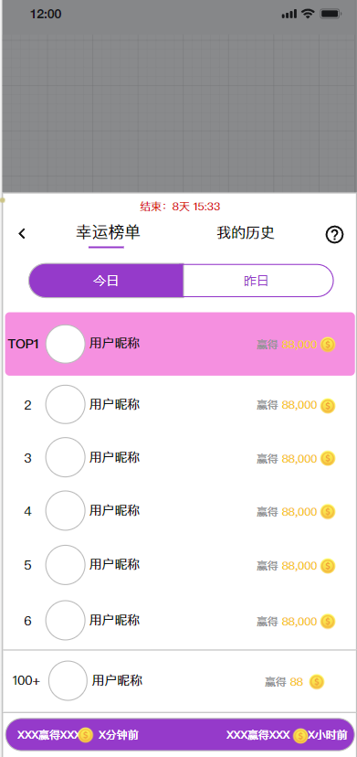

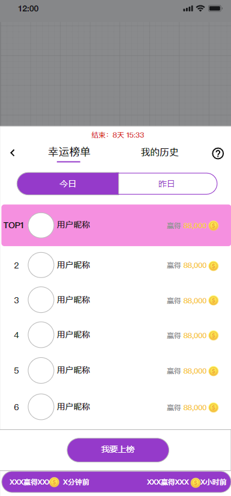

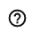

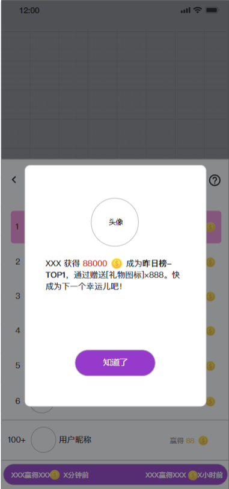

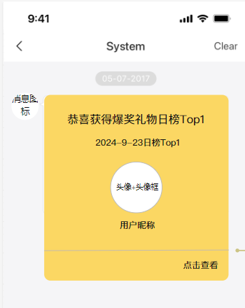

### 房间内游戏入口

房间内游戏仍在，不是游戏房模式。水果机 / 动物机 / 数值游戏细则见 [`../room-game/PRD.md`](../room-game/PRD.md)。休闲三款见 [`../casual-game/PRD.md`](../casual-game/PRD.md)。

#### 房间支持打开半屏水果机

| 功能描述 | 房间展示的水果机UI样式改为半屏 |
|---|---|
| 优先级 | 高 |
| 输入/前置条件 |  |
| 需求描述 | 房间支持半屏打开水果机游戏，对应页面布局优化； |
| 输出/后置条件 |  |
| 补充说明 |  |

#### 【H5】动物机（换皮水果机）

| 功能描述： | 原水果机换皮，并作一定优化 |
|---|---|
| 优先级： | 高 |
| 输入/前置条件 |  |
| 需求描述： |  |
|  | 概述：在不更改原水果机的界面布局与游戏基础逻辑上进行换皮，并一定的优化。 注：支持房间半屏打开 优化项： 缩短每回合的游戏时间： 缩短下注时间：从40S，缩短为30S，并且将规则页面中的40S页更改为30S。 缩短开奖时间：将开奖时间从10S缩短为5S。 结果展示时间不变更。 整体游戏一轮时间变为从原来的55S变更为40S。 开放下注上限：从原先6个下注上限，开放到8个，也就是一局所有选项都可以下注。 添加未付费用户盈亏上下限：该功能在幸运游戏优化详细说明。（保留此代码，不生效，水果机也保留此代码，不生效） 动物机图标种类： 种类包含： 安卡拉山羊：5倍 猫：5倍 马：5倍 骆驼：5倍 狼：10倍 金雕：15倍 老虎：25倍 亚洲狮：45倍 金币流水 下注：疯狂动物下注 赢钱：疯狂动物赢分 文案调整 参与记录页面： 获胜水果：XXX 修该为 获胜动物：XXX 选择水果：XXX 修改为 选择动物：XXX 规则页面： 选择合适数目的金币与你想要下注动物来参与游戏。 你每回合可以下注所有的动物，并且每种动物都没有下注上限。 每回合你都有30S的时间选择你要下注的动物与下注的额度，倒计时结束后你将无法再下注，并且系统会选择出该回合中奖的动物。 如果你下注到了本回合中奖的动物，会根据你的下注额度发放对应倍率的金币奖励。 最后一条规则不用改。 提示弹窗： 你是否花费XXX金币下注XXX？ |
| 补充 | 后台相关（含水果机后台） 换皮水果机（动物机）后台套用水果机相同模板，但统计的是换皮水果机自身的数据。 其中明细一栏的水果，替换为动物，动物套用图标类别。 |

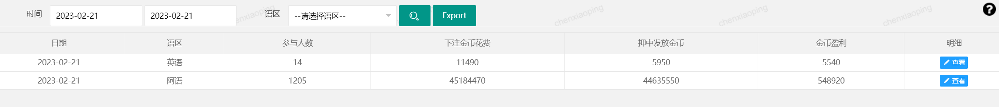

#### 房间游戏操作交互优化

| 功能描述 | 房间游戏操作交互优化 |
|---|---|
| 优先级 | 高 |
| 输入/前置条件 |  |
| 需求描述 | 图1                         图2 用户进入房间，房间侧边栏默认展示水果机游戏图标，若用户点击打开图1水果机半屏游戏页面，在当前页面用户可快捷点击其他游戏缩略图进行其他游戏切换，切换时页面增加加载动画；关闭游戏页面，房间侧边栏游戏要更新为关闭时的游戏； 若用户切换游戏后关闭当前游戏半屏页面，房间侧边栏游戏图标展示关闭时停留的游戏，退出当前房间再次进房重置为水果机图标； 游戏中心展示动物机； 审核风控包含动物机； |

### 支持用户关闭房间礼物动效

| 功能描述 | 支持用户关闭房间礼物动效 |
|---|---|
| 优先级 | 高 |
| 输入/前置条件 |  |
| 需求描述 | 图1              图2                 图3 关闭礼物特效开关： 开启：默认开启，开启后当前用户可以看到房间所有礼物特效 关闭：支持用户关闭礼物特效 开启或关闭后按钮状态更新，见图1、图2； 设置跟随本地保存，更换房间后该设置仍生效，卸载后重置为默认打开状态； 点击开启/关闭按钮二次确认弹窗： 1）关闭： 弹窗正文：关闭后你将收不到房间所有礼物特效。 按钮：取消、关闭 2）开启： 弹窗正文：开启后你将收到房间所有礼物特效。 按钮：取消、开启 关闭/开启成功后toast提示：“操作成功” |
| 输出/后置条件 |  |
| 补充说明 |  |

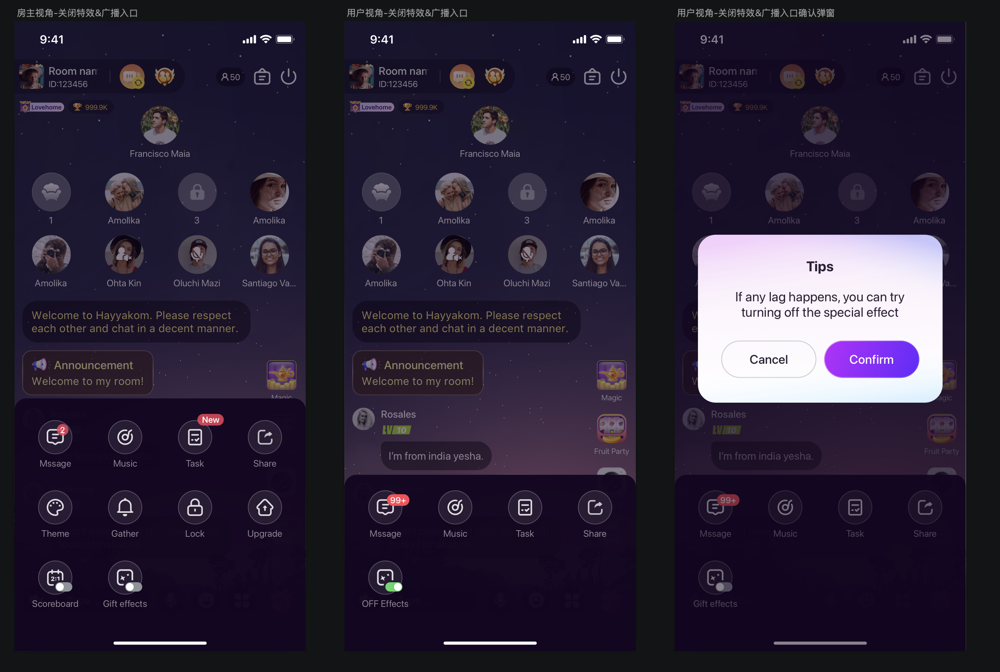

### 官方房 15 麦

| 功能名称 | 官方房支持 15 麦位 |
|---|---|
| 优先级 | 高 |
| 需求描述 | 官方房固定 15 麦，一排 5 个；房主/管理员不能改麦位数。麦上表情、头像框、计数器自适应；侧边栏加高。非官方房仍 8 麦。 满员/邀请按已占麦计数：官方房 15，非官方 8。无房主专属麦。 老包看不见多出来的麦，但听得到、送得到；全麦/全房礼物仍含这些人。 进房更新弹窗两种由服务端选：弹窗1 取消后留房；弹窗2 取消即退房。去更新跳对应商店；未装商店则提示下载 App Store / Google Play。 |
| 补充说明 | 「只能静音当下麦位」及部分弹窗原文待定 → `needs-input`。 |

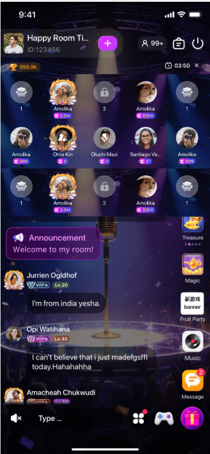

### 活动推送与新用户列表

推送打开活动页：后台推送须带 URL（admin）。客户端按版本拦截；过低则升级提示。立即升级退出活动页并打开升级链接；取消退出活动页并回活动列表。

新用户活动消息列表只显示进行中，过期不展示。

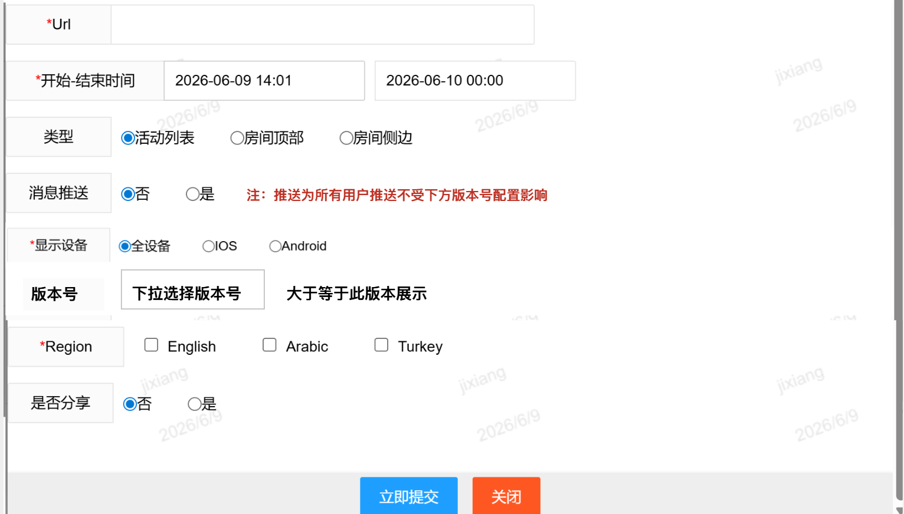

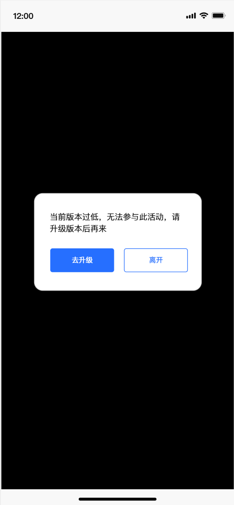

### 礼物面板

旧包使用不受影响。双端同一套。私聊无对象区、IM 入口 New、引导 2 步在 [`../messaging/PRD.md`](../messaging/PRD.md) 只放指针。VIP 体验券时间格式指向 [`../coupon/PRD.md`](../coupon/PRD.md)。

#### 面板介绍与数量

接收对象区在顶端，默认全麦；左侧用户明细，右侧全麦/全房。选全房间/全麦气泡 2 秒。分类顺序：经典、VIP、爆奖、背包、道具。无头饰卡 tab。向上/下滑动超过说明高度后说明离场，松手再入场覆盖礼物上方。关面板再开保留礼物与数量选择；离房后销毁重置。New 标记按后台。角标最多 3 个，超过只显示前 3；同一礼物排序：活动、周星、爆奖、全站。二次点击选中礼物打开说明。列表改为上下滑，右侧进度条，倍率随手指。财产默认左上；有首充标记则在金币后，点开首充；无则箭头进充值。选中宝石礼物切宝石余额。数量选择只改 UI。道具背包弹窗仍盖在礼物面板上，高出部分隐藏，关闭后恢复。

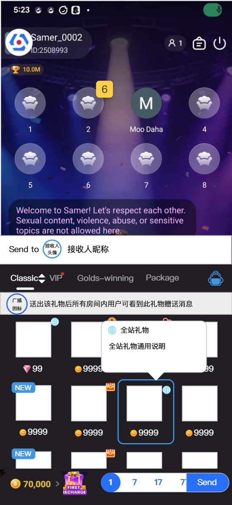

#### 接收对象

默认全麦快照（打开面板或全房切全麦时刷新；送礼人在麦则不展示自己）。点已选头像取消 → 自由选择；自由选择选满全麦则回全麦。全麦再点全麦 → 全部未选。头像区可左右滑。关面板再开恢复默认。

自由选择按人数出多条跑道、多条公聊、满足条件则多条全站广播（单人金额各自满足）。指定用户来自资料卡/IM/快捷送回礼；关面板再开回默认。对象离房：原逻辑送礼失败；指定用户则提示已不在房并回默认。无人在麦：显示无人，点 Send toast。全房/全麦气泡 2 秒。空状态：房间无人且取消全麦，显示无接收人。**私聊页不展示对象选择区。**

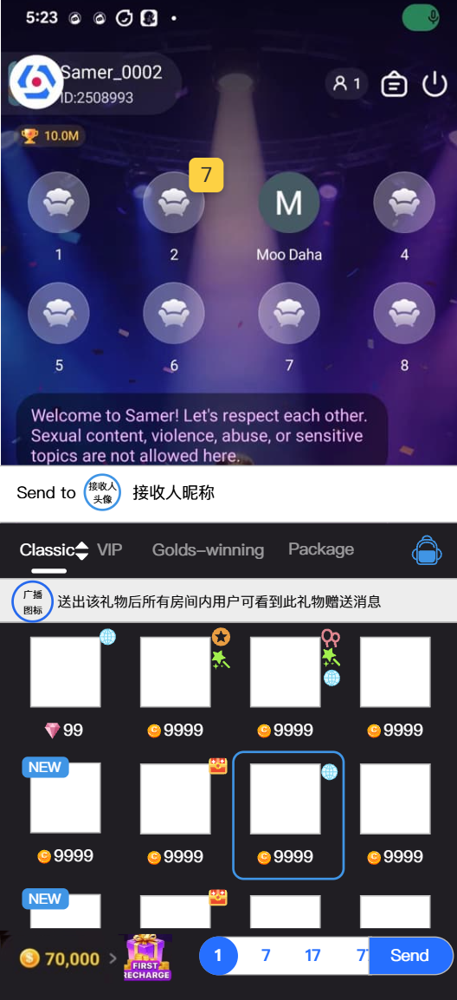

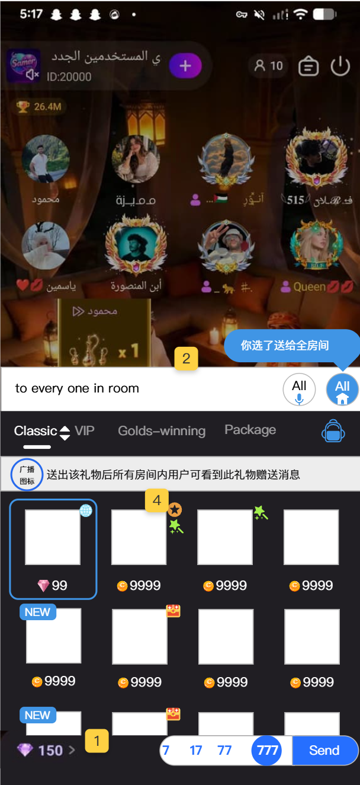

#### 活动与周星 Banner

选中活动礼物：顶部活动 Banner，点开活动页。取消周星常驻入口，改为选中周星礼物时展示周星 Banner。同时是活动+周星则**活动优先**。

#### Classic 价格筛选

仅 Classic tab。循环：默认 → 高到低 → 低到高。非默认气泡 2 秒。关面板重置。按设定数字排；同价按排序值小的在前。

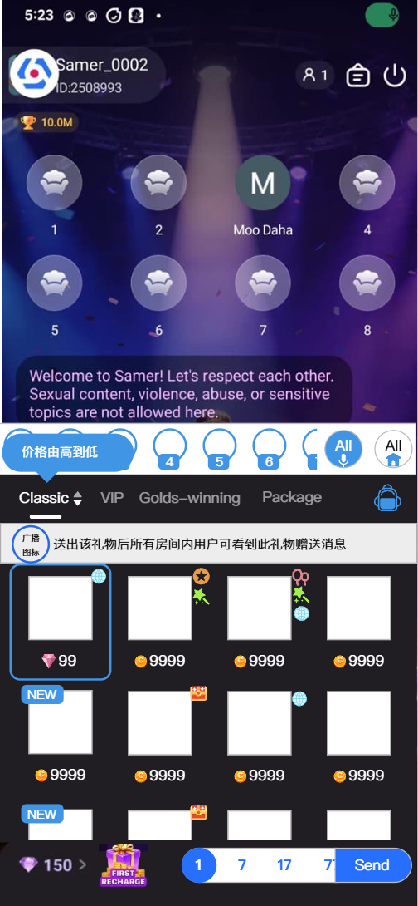

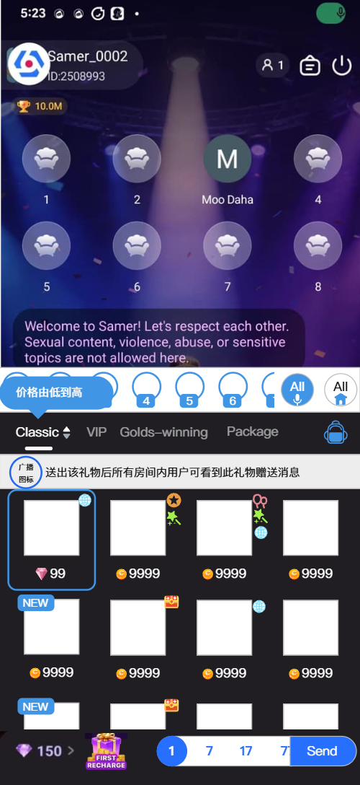

#### VIP 说明

未解锁：说明区成为 VIP 解锁，更多进 VIP 页；赠送仍弹 VIP。已解锁：当前 VIP 图标、经验、距下一级；满级显示保级经验（已满足则为 0）。体验券使用中不显示图 2，显示体验等级图标与剩余时间，点说明进 VIP 页。剩余时间格式引用 coupon（1 分钟 / X 分 / X 小时 / X 天）。刷新：每次打开面板、充值后、VIP 升降级。

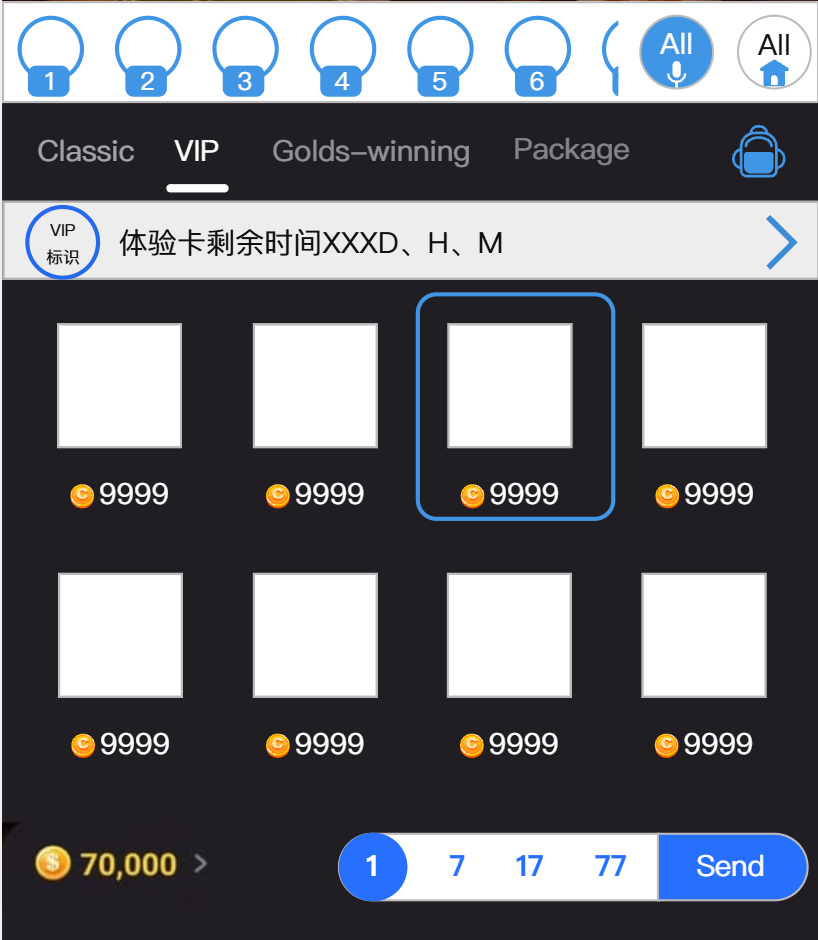

#### 背包礼物

新获得标记在左上，过期时间仍在左上且规则不变。角标在右上，数量改到图片中间偏下。

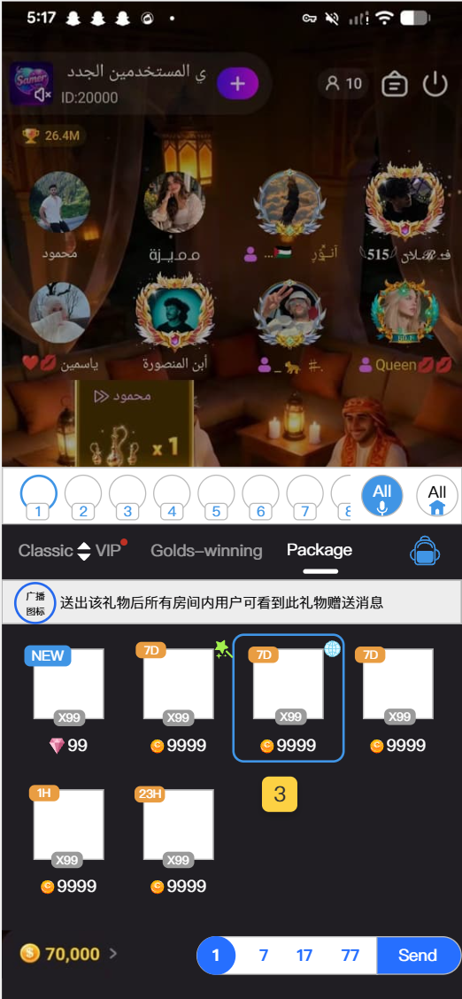

#### 引导

有新礼物时，进任意房间或 IM 送礼入口展示 New，打开面板后外部标记消失。分类红点点过消失。礼物 New 显示时长后台配；选中隐藏，切走再显示。本版更新用户或新注册用户：首次房间打开 3 步引导；首次私聊打开 2 步（无对象选择步）。房间与私聊各自首次。IM 入口 New 见 messaging 指针。

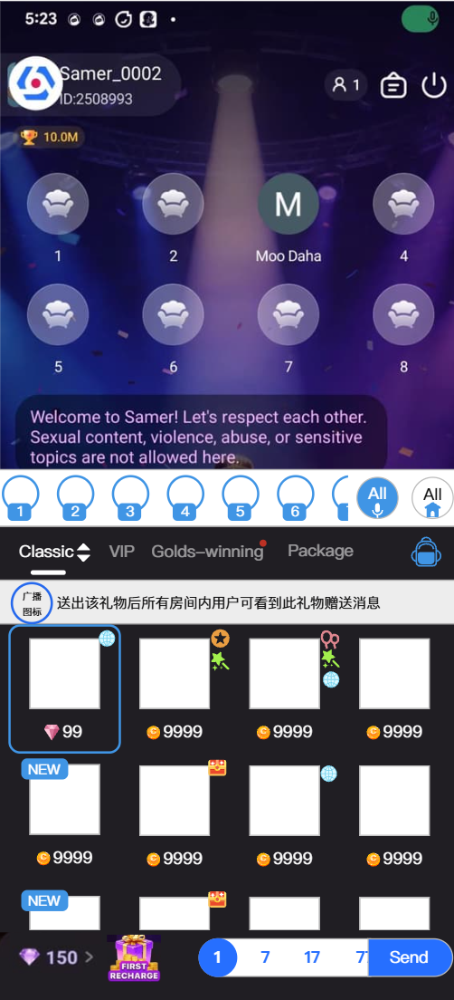

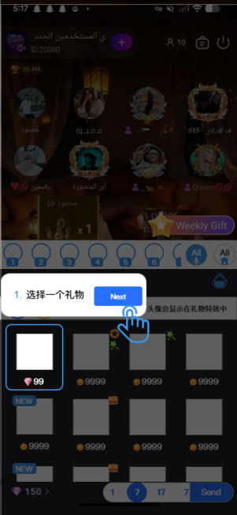

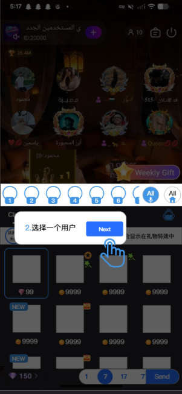

## 版本

明细见 [`changelog.md`](changelog.md)。原文切片与叠稿在 [`history/`](history/)。
