# 用户 VIP — V1.0.0 原文切片

> 状态：`history`（非权威） · 来源见正文

## 3.14 第十四部分 用户VIP（丛国序）

3.14 第十四部分 用户VIP（丛国序）

3.14.1 VIP - 数值及计算逻辑

| 需求描述 |  |
|---|---|
| 优先级 |  |
| 输入/前置条件 |  |
| 需求描述 | 功能描述： VIP是基于付费贡献的保级制用户身份体系。不同的VIP等级，提供提供不同的展示和功能特权，使付费用户拥有区别于普通用户的荣誉展示和使用体验。 VIP是保级制，用户达到VIP的某个等级后，身份会维持一个月；用户保级所需的金额，要低于直接升上去的金额，以此维持用户的持续充值。 单位 - VIP以财富值为计量单位 - 财富值来源： 通过充值得来的金币（商店充值、币商，以及后续接入的第三方充值方式）计算财富值，200金币=1财富值（1月19日更新数值）； 运营后台加币时，若操作类型为“工资抵扣”（删除）和“对掉单的用户补单”，则计算财富值，200金币=1财富值（1月19日更新数值）； - 除以上途径外，其他获取金币的方式均不加财富值，包括：非上述两种操作类型的运营后台加币、系统返币等；订阅贵族的花费及贵族返币，不加财富值 - 后台扣币，不减财富值； 各等级财富及权益 - VIP财富值达到最高等级的保级线时，保持在保级线的数值，不再继续提升 升级、保级、降级策略 - VIP每轮周期为30天，自用户首次充值（财富值有数字）开始，开启30天周期；为方便任务处理，VIP结算时间统一为每天GMT+3时区的12点，因此实际周期时间比30天略长 - VIP周期在升级、降级、保级成功的各个节点重置，因此每个用户的周期不一致 升级：在本周期内，达到下一等级所需财富值 - 财富值数字保持，升级到下一等级，发放下一等级的特权并回收当前等级的聊天气泡、头像框、座驾 - 结束当前周期，并开启新的一轮30天周期 保级：在本周期结束时，若用户没有达到下一等级所需财富值，但达到了本等级保级财富值 - 将财富值重置为本等级的初始财富值，保持本等级特权 - 开启新的一轮30天周期 降级：在本周期结束时，若用户没有达到本等级保级财富值 - 将财富值重置为上一等级的初始财富值，发放上一等级的特权并回收当前等级的聊天气泡、头像框、座驾 - 开启新的一轮30天周期 退款处理 用户发生退款后，VIP财富值以200退款金币=3财富（1月26日修正）值的比例进行扣除 退款后，因财富值下降而导致的VIP等级下降： - 保持退款后的财富值，不进行充值财富值至上一周期初始值的操作；发放上一等级的特权并回收当前等级的聊天气泡、头像框、座驾 - 开启新的一轮30天周期 上线时初始定级 - 目前运营有手动结算的旧VIP体系，并有一部分用户使用；在新的VIP体系上线后，针对原VIP体系的用户，产运会提供一份“UID+财富值”的对照表格，服务端将这些用户的财富值订正，直接赋予这些原VIP体系用户相应的等级和权益。（1月26日删除） |
| 补充说明 | 因每天12点的结算处理需要一定时间，因此每次发放商店商品及密码房权限时，多发放1h时间，以避免结算还未完成而原有的VIP特权失效的情况 在正式发包之后，线上再开始跑VIP相关的任务、计算VIP体系的等级&周期数据。在服务端代码上线，到正式发包之间的时间，仅针对特定的内部UID加财富值（用以测试），线上其他用户不受影响。 |

3.14.2 VIP - 页面

| 需求描述 | VIP相关的前端页面 |
|---|---|
| 优先级 |  |
| 输入/前置条件 |  |
| 需求描述 | [图1]-ME页VIP入口 VIP入口 -  ME页，贵族入口右侧固定展示VIP入口，点击进入VIP主页 - 未获得VIP时，展示为“Get VIP” - 已获得VIP时，展示为用户的VIP等级 VIP主页（H5） [图2]-VIP主页 2.1 头部区域 - 用户头像，如果用户有VIP头像框，需展示VIP头像框（此处固定展示用户的VIP头像框，而非用户自主佩戴的头像框） - 用户昵称，如果用户是VIP，昵称展示为VIP昵称的金色 - VIP标识，如果用户是VIP，展示VIP标识（含有等级）；如果用户没有VIP，展示为固定的“Non-VIP”的灰色标识 - 有效期展示： 未保级成功，且周期开始14天以内：VIP有效期至 年/月/日 未保级成功，且周期开始14天之后：VIP有效期至 年/月/日，还剩X天完成保级；X为距离本周期到期所剩的天数 已保级成功：已保级成功，VIP有效期至 年/月/日；日期为当前周期的下一周期的截止时间 - 进度条：左侧为当前等级数+初始值，右侧为下一等级数+初始值，进度值为用户当前财富值；当用户在VIP11时，右侧没有下一等级，展示为保级线； - 保级线：用户所在等级所对应的保级数值所在刻度，用户非VIP（左端为0）时不展示保级线； - 还需X升级/保级的文案： 未保级成功，还需要X财富值完成保级 保级成功：再获得X财富值即可升级到VIP Y，Y为下一等级的VIP 满级（达到VIP11的保级线）：保级成功，你已是满级VIP 2.2 权益区域 - 按照服务端配置各等级权益展示，展示icon、对应等级、文字 - 各等级对应权益发生变化后，此处展示的各等级权益随之变化 2.3 充值按钮 - 浮动展示，下滑时隐藏，上划及页面静止时出现 - 点击吊起半屏充值页面 VIP权益介绍页（H5） [图3]-VIP权益介绍页 - 在VIP主页点击某项权益后，进入权益介绍页，定位到对应权益 - 权益页顶部可滑动，点击顶部某项权益，进入对应权益页 - 页面左右滑动，可切换查看权益 - 部分有预览的页面，点击查看对应特权的预览效果 - 权益排序、权益切图、权益预览效果，均可更改，保留后期调整空间 VIP规则页 [图4]-商店页新增按钮状态 商店页面，新增按钮状态 [图5]-商店页新增按钮状态 - 当商品后台，按钮状态配置为“VIP”专属时，头像框、座驾、背景的按钮状态展示为“VIP Exclusive”，点击跳转进入VIP页面 |
| 补充说明 | VIP权益介绍页，VIP10和VIP11的座驾、头像框、房间背景、聊天气泡等UI素材，在上线时来不及全部输出，因此先用“Coming Soon”占位图放在H5页上，后续UI素材输出后在更新实际素材上去 |

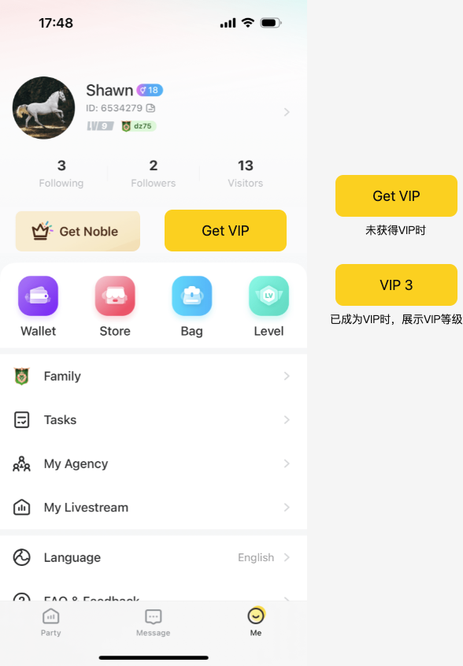

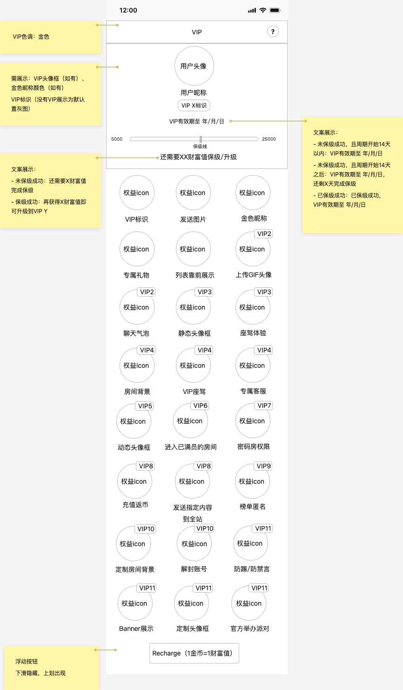

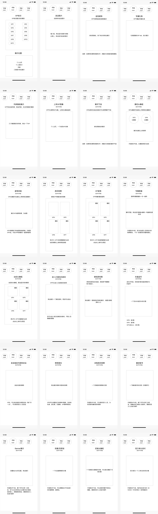

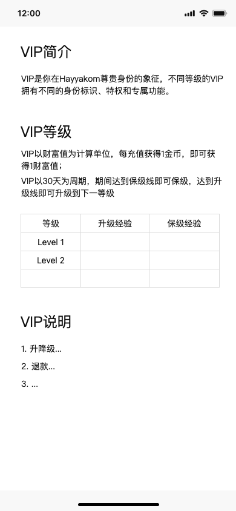

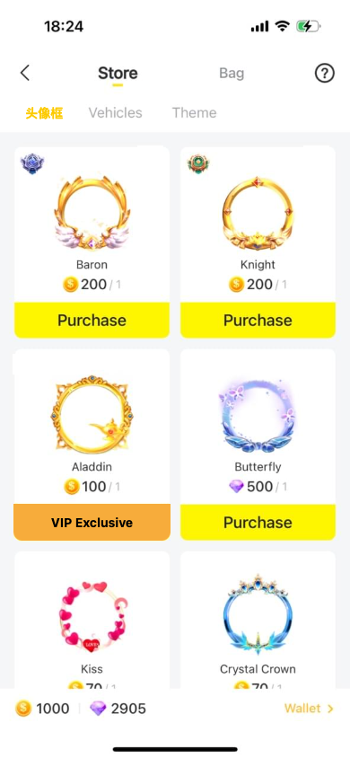

3.14.3 VIP - 权益

| 需求描述 |  |
|---|---|
| 优先级 |  |
| 输入/前置条件 |  |
| 需求描述 | VIP各等级对应权益 - 权益所对应的等级，为服务端控制，后续可调整 - 权益向上覆盖，高等级VIP自动拥有更低等级的权益 - VIP标识、VIP聊天气泡、VIP头像框、VIP座驾、VIP房间背景，该五类权益属于升级权益，每一等级对应的权益样式或ID不一致，在等级发生变化时（升级或降级）需将原来等级的权益回收 - 发送图片、专属礼物、列表靠前展示、上传GIF头像、专属客服、进入已满员的房间、密码房权限、充值返币权限（删除）、榜单匿名权限、防踢/防禁言，需要客户端/服务端配合实现 - 发送指定内容到全站、定制房间背景、Banner展示、定制头像框、官方举办派对，由运营对接，前端仅做展示，无需客户端/服务端配合。 VIP标识 从VIP1开始获得，跟随VIP等级，每一等级标识样式不同 展示位置同现有展示位置： - 房间贡献榜单 - 发言消息区 - 在线列表 - 个人资料卡 - 平台榜单 - Top Supporter榜单 - 个人主页 - 我页 - 关注、粉丝、访客、私聊列表 - 私聊详情页 - 消息页-好友列表 - 房间粉丝列表、俱乐部成员列表 - 房间内邀请进房列表 - 团队邀请充值榜单和拉新列表（samer新增）； - 个人邀请充值榜单和拉新列表（samer新增）； - 邀请新用户二维码图片（samer新增）； - 邀请新团员二维码图片（samer新增）； 房间内个人资料卡处的VIP标识，点击跳转用户自己的VIP页面（不管点击自己还是他人的VIP标识），从页面返回即返回房间 发送图片 VIP1用户即拥有发送图片权益 [图1]-发送图片 - 贵族也有发送图片权益，两者满足其一即可发送图片（删除） - 点击发送图片按钮时，若用户没有相应权益（既不是贵族也不是VIP），则拉起半屏引导页面，展示文案+VIP权益 点击下方“查看更多VIP特权”，进入VIP主页 金色昵称颜色 VIP1用户即拥有昵称颜色特权； 昵称颜色的展示位置同贵族昵称颜色展示位置： - 麦位昵称 - 房间聊天发言区昵称 - 个人资料卡昵称 - 房间在线成员列表昵称 - 私聊列表昵称 - 私聊页面昵称 - 个人主页（自己视角和他人视角） - 房间内排行榜 若用户同时是VIP及贵族（删除），展示VIP的昵称颜色 VIP专属礼物 [图2]-VIP专属礼物 4.1 前端展示 - VIP1用户即可拥有赠送专属礼物的权限 - 礼物面板新增“VIP”tab（包含房间和私聊），展示VIP专属礼物；缩略图、金额、选中预览同普通礼物 - 对VIP用户，礼物正常展示，正常送出，效果同普通礼物 - 对非VIP用户，礼物上增加蒙层，礼物可选中，无法赠送；点击赠送按钮时，拉起半屏引导页面，操作同发送图片浮层；关闭浮层后需回到礼物面板 列表靠前展示 VIP1用户即可拥有列表靠前展示的权限，生效列表：房间内在线列表 5.1 房间内在线列表排序规则： 房主>房间贡献周榜上用户（按名次降序排）>房间贡献日榜上用户（按名次降序排）>VIP（根据VIP等级从高到低、相同VIP等级按贵族等级从高到低、相同贵族等级（删除）按用户等级从高到低、等级相同时按经验值降序排）>贵族（先根据贵族等级从高到低，再根据用户等级降序排，等级相同时按经验值降序排）（删除）>管理员（根据用户等级降序排，等级相同时按经验值降序排）>粉丝>普通用户（根据用户等级降序排，等级相同时按经验值降序排） 5.2 贵族处，列表靠前展示的权限下，增加一行文字说明，说明贵族排序优先级低于VIP（删除） 上传GIF头像 VIP2拥有上传GIF图像的权限 [图3]-上传GIF头像 6.1 客户端部分 - 点击修改头像入口（包含在个人资料页点击头像选择更换头像、进入个人资料编辑页两个入口），弹出选择浮层，包含“图片”、“动态图片（VIP2专属）”另个选项 - 点击“图片”，进入原有图片选择流程，图片选择器仅筛选展示静态图片文件类型 - 点击“动态图片”， 若用户是VIP2以下，则拉起半屏引导页面，操作同其他VIP浮层；关闭浮层后需回到选择浮层 若用户是VIP2及以上，则进入图片选择器，进筛选展示动态图片文件类型（GIF） - 选中GIF图片后，不进入图片裁剪大小页面，进入预览页面，点击确认直接使用原图片作为头像 - GIF图片大小上限为10M，超过10M时无法选择，在预览页面确认时，toast提示“GIF图片不能超过10M” 6.2 服务端部分 - 服务端存两个字段，分别是静态头像和动态头像（静态头像为动图的第一帧），根据用户的VIP状态，若用户是VIP2及以上，则返回动态头像 - VIP等级的变动，不影响已存入的两个头像字段，服务端在用户等级下降时（VIP2降为VIP1），返回静态头像，等级升回VIP2，则返回动态头像 聊天气泡 VIP2用户拥有聊天气泡权益 - 每一等级的聊天气泡样式不同，在用户升级或降级时，需发放新的聊天气泡，并回收旧的聊天气泡 - 本期新增的VIP聊天气泡，服务端处理时，归属于商城&背包体系，但不做前端展示页面；历史已有的贵族聊天气泡仍是客户端处理，和VIP聊天气泡处理方式不同，后期整合进商城&背包体系 - VIP聊天气泡的展示位置，同贵族聊天气泡；若用户同时拥有VIP和贵族聊天气泡，则展示VIP聊天气泡 静态头像框 VIP3用户拥有静态头像框权益 - VIP头像框仍归属于商城&背包体系，用户每次保级、升级后，下发对应等级的VIP头像框，有效期为30天，会展示在背包中，并在“获得记录”中录得一条记录 - VIP头像框，在升级时，触发自动佩戴逻辑，用户在获得VIP头像框时将自动佩戴上，但用户可在背包页面自主选择其他头像框佩戴；保级时不触发自动佩戴逻辑 - 在用户升级或降级时，需发放新的头像框（30天有效期），并回收旧的头像框 座驾权益（包含VIP3的座驾体验与VIP4的座驾权益） VIP3用户拥有座驾体验权益，VIP4用户拥有完整的座驾权益 - VIP3拥有7天有效期的座驾（发普通座驾，非VIP系列座驾），每次升级/降级/保级到VIP3时，发放7天有效期； - VIP4则在整个VIP周期都可使用座驾（VIP系列座驾），对应有效期为30天； - VIP座驾仍归属于商城&背包体系，用户获得VIP座驾后，会展示在背包中，并在“获得记录”中录得一条记录； - VIP座驾，在升级时，触发自动使用逻辑，用户在获得VIP座驾时将自动使用，但用户可在背包页面自主选择使用其他座驾；保级时不触发自动使用逻辑； - 在用户升级或降级时，需发放新的座驾（7天或30天有效期），并回收旧的座驾；针对VIP3用户，若用户在7天有效期内意外降级至VIP2，不回收VIP3座驾； - VIP3的座驾体验权益，权益展示图优化为实际下发的法拉利座驾效果图； - VIP4开始的VIP座驾权益，预览的svga资源缩减大小（通过降低清晰度、抽帧等方式） 补充：因缩减大小后，仍然出现在部分情况下频繁点击多个座驾预览导致的闪退问题，因此处理为点击一个座驾预览时，loading过程不允许关闭来规避此情况 房间背景 VIP4用户拥有房间背景权益 - VIP房间背景仍归属于商城&背包体系，用户获得VIP背景后，会展示在背包中，并在“获得记录”中录得一条记录 - VIP房间背景无自动使用逻辑 - 在用户升级或降级时，需发放新的背景（30天有效期），并回收旧的背景 VIP4-6为静态背景，VIP7及以上获得为动态背景，获得动态背景不再获得静态（1月14日新增） VIP座驾，同第9点 专属客服 VIP4用户拥有专属客服权益 [图4]-专属客服入口 - “VIP Service”账号为特殊逻辑的官方账号（使用原有的KA联系的账号），在私聊列表、好友列表有特殊标识，也支持WhatsApp跳转； - VIP4及以上的用户，和VIP Service账号的私聊，不做限制，随意发送，低于VIP4的账户（包含从VIP4降级的用户），用其他方式找到VIP Service时，遵循之前做的私聊限制 - VIP4及以上用户，VIP页面内展示客服入口，点击进入和“VIP Service”的私聊页面 - 不同语言的用户，在使用专属客服的时候，都会跳转到对应语言的专属客服，（客服账号由运营提供）； - 专属客服账号，和超管一样，不应被搜索发现（原逻辑）； 动态头像框，同第8点 VIP5用户拥有动态头像框权益 进入已满员的房间 VIP6用户拥有进入已满员的房间权益 - VIP用户不受房间满员限制，在进入满员房间时，判断用户是否为VIP6及以上，若是则可进入，房间人数展示+1；多个VIP用户也可同时进入满员房间，在房人数展示为房间内实际人数 密码房权限 VIP7用户拥有密码房权益 - 用户升级/保级到VIP7及以上时拥有该权限，在VIP7及以上的周期内，始终拥有密码房权限 - 用户从VIP7降级时，回收密码房权限 充值返币（删除） VIP8用户拥有充值返币权益 - 自VIP8开始，VIP用户在VIP每个周期内的前X次充值（包含商店充值、代理充值及后续加入的三方充值），可获得充值金币数Y%的返币 VIP8，X=10，Y=5% VIP9，X=10，Y=8% VIP10，X=10，Y=10% VIP11，X=10，Y=10% - 每次周期结束后升级或保级，次数机会均清零，按照新的等级赋予新的次数和返币比例 - 权益使用时，需发送相应通知，见需求 3.1.5中第5点 - 商店充值发生退款时，需同时追回此笔充值带来的返币，但充返次数算作已使用，不再回退 发送指定内容到全站 VIP8用户拥有发送指定内容到全站权益，本权益仅做展示，由运营操作 榜单匿名 VIP9用户拥有榜单匿名权益 [图5]-排行榜匿名权限 18.1 操作设置 - Setting-Privacy，增加“排行榜匿名”选项，下方问题提示“只有VIP9拥有排行榜匿名权限” - 点击时判断用户VIP等级： 若大于等于VIP9，则可正常开启、关闭； 若小于VIP9，但已经是VIP身份，拉起引导浮层，按钮显示“查看我的VIP等级” 若非VIP身份，拉起引导浮层，按钮显示“查看更多VIP特权” - 若用户从VIP9降级，则自动将该权限更改为关闭 18.2 前端展示 - 生效榜单： 个人相关的全局排行榜（Giver、Receiver、Billionaire），包含入口外显的头像 游戏榜单，包含入口外显的头像 房间内贡献榜 个人页Top Supporter榜单，包含入口外显的头像 - 匿名用户，在客态展示为固定头像+匿名的形式，不展示头像框、性别等附带信息，也不展示VIP、贵族、等级等荣誉信息；主态正常展示，增加一个tag标明当前是匿名状态 - 无点击操作，点击时toast提示“对方是匿名状态” 定制房间背景 VIP10用户拥有定制房间背景权益，本权益仅做展示，由运营操作 解封账号 VIP10用户拥有解封账号权益，本权益仅做展示，由运营操作 防踢/防禁言 VIP11用户拥有防踢/防禁言权益 [图6]-防踢/防禁言 - 房主/管理员操作踢人、禁言时，判断被踢、被禁言用户的VIP等级，若大于等于VIP11，则无法操作成功，弹窗提示“对方是VIP11，你无法将对方禁言/踢出房间。如对方有严重违规行为（色情、宗教），请联系官方客服。” - 权益使用时，需对被操作的VIP用户发送相应通知； Banner展示 VIP11用户拥有Banner展示权益，本权益仅做展示，由运营操作 定制头像框 VIP11用户拥有定制头像框权益，本权益仅做展示，由运营操作 官方举办派对 VIP11用户拥有官方举办派对权益，本权益仅做展示，由运营操作 特殊说明：去除掉：发放ludo游戏皮肤的权益； |
| 补充说明 | 能否使用VIP权益是由服务端判断，因此在权益归属等级调整和VIP结算期间的短时间内，会出现客户端有入口但服务端返回失败的情况（重启App后会拉到新的配置），此类情况统一toast提示“你的VIP等级不足”，包含场景： - 使用发送图片特权时 - 使用动态头像特权时 - 发送VIP专属礼物时 - 设置榜单匿名权限时 |

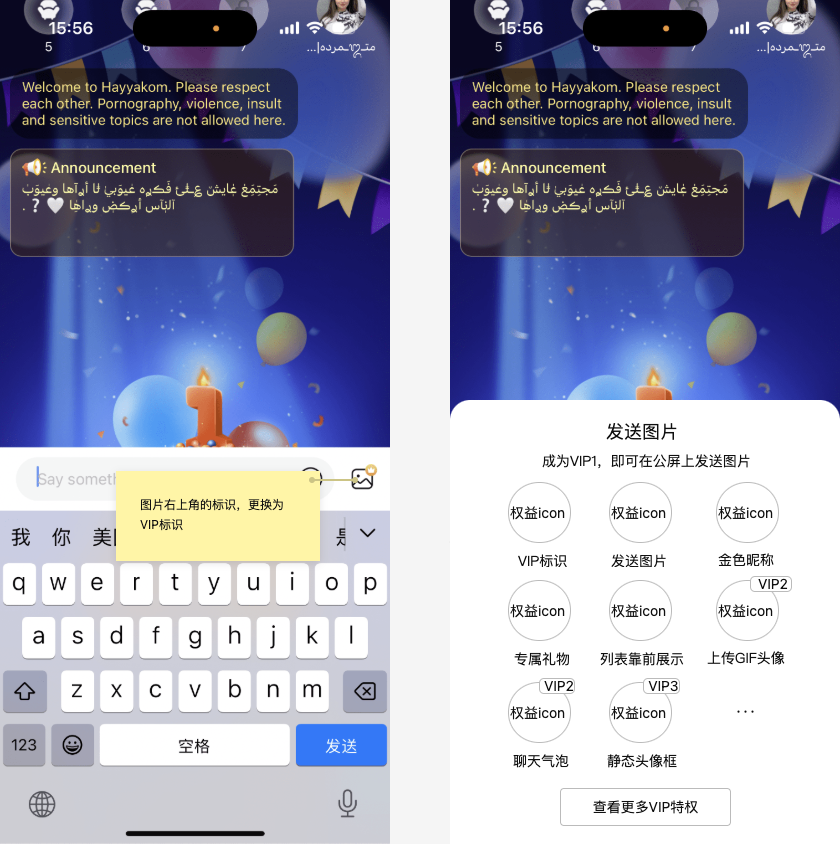

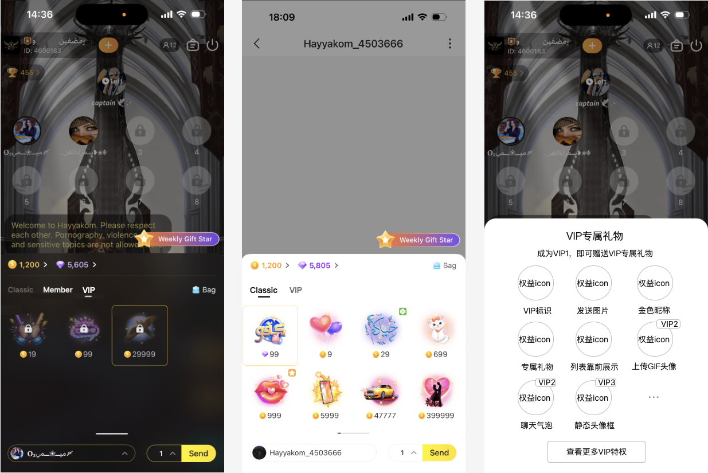

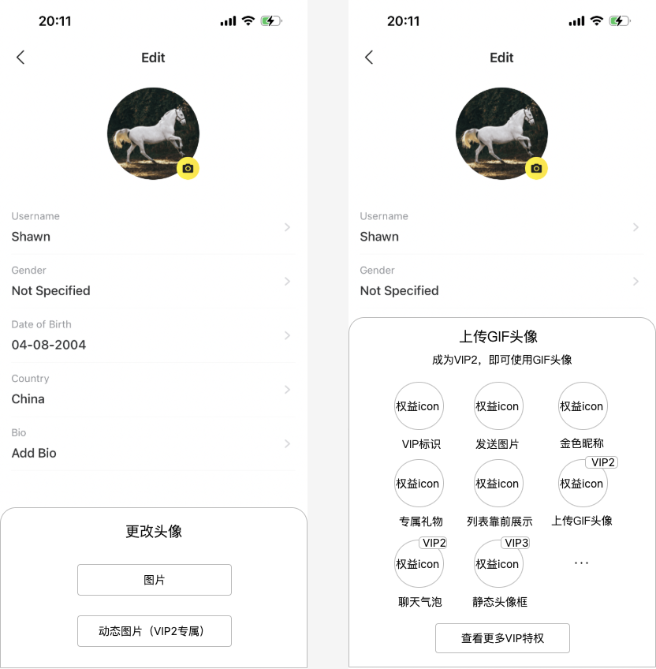

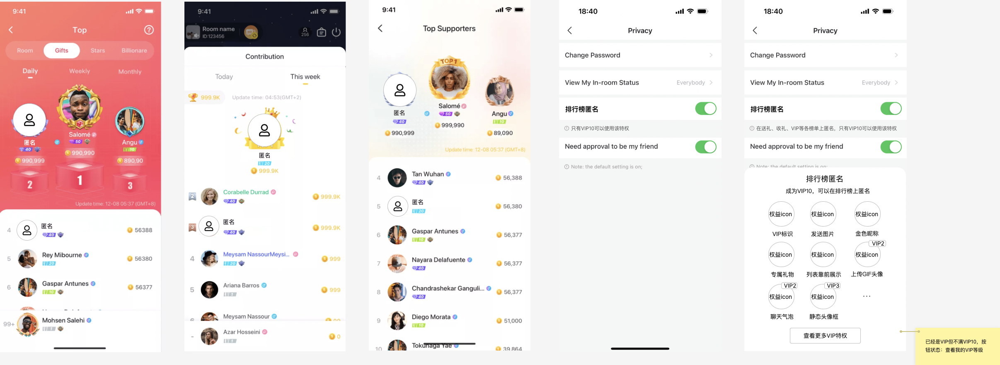

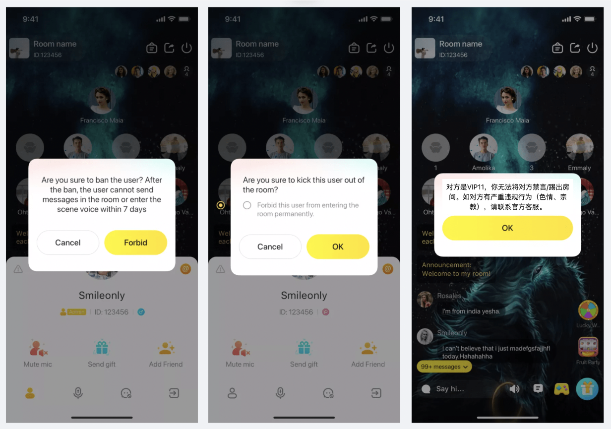

3.14.4 （删除业务）VIP - 高级VIP账号私聊页增加WhatsApp跳转

| 需求描述 | 客服系统已接入infobip系统，可通过WhatsApp维系用户，希望将高阶VIP用户转移至WhatsApp客服，方便后续回流等操作。 |
|---|---|
| 优先级 |  |
| 输入/前置条件 |  |
| 需求描述 | [图1]-和VIP Service私聊页 VIP Service账号私聊页，增加WhatsApp跳转入口， - 链接格式：https://wa.me/xxxxxxxx - 入口需满足以下条件才可展示： 和VIP Service私聊的账户是VIP4级及以上 用户手机中安装了WhatsApp - 展示WhatsApp跳转入口情况下，原未关注用户时的关注引导不展示 跳转入口在是否展示及链接地址，需服务端控制；上线初期，infobip系统处于调试阶段，入口会统一关闭，调试完成后统一打开。 |
| 补充说明 |  |

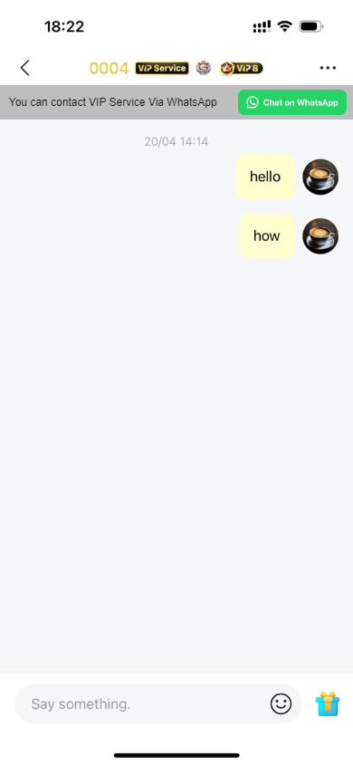

3.14.5 VIP – 个人相关通知

| 需求描述 | VIP体系相关的通知，包含升级、降级、保级及各类提醒 |
|---|---|
| 优先级 |  |
| 输入/前置条件 |  |
| 需求描述 | VIP相关消息发送至“System”下，使用新的VIP消息模板 升级、降级的通知 - 升级时，同时触发应用内弹窗提醒 - 自然触发的升级（非后台赠送或回收），若出现连升/连降情况，则发送多条升级/降级通知；升级弹窗也发送多个，关闭一个弹出另一个，若在过程中点击了“Check My VIP”则中断弹窗展示，队列中的弹窗不再继续展示 - VIP降级时，若非降级到VIP0，使用交互图中文案；若降级到VIP0，消息Title展示为“VIP已到期”，说明文案展示为“很遗憾，你在本周期保级失败，已失去VIP身份” 保级提醒、保级成功、VIP新周期开始的通知 VIP周报通知 VIP权益使用提醒通知 - 使用“充值返币”、“防踢/防禁言”权益时，需对用户发送相应提醒 |
| 补充说明 | 旧版本无法接收VIP相关的通知； 各类定时通知发送的时间（均为GMT+3时区）：VIP过期结算，每天12点开始；VIP11防踢权益使用提醒，每天22点开始；VIP周报，每天14点开始；VIP保级提醒，每天15点开始； |

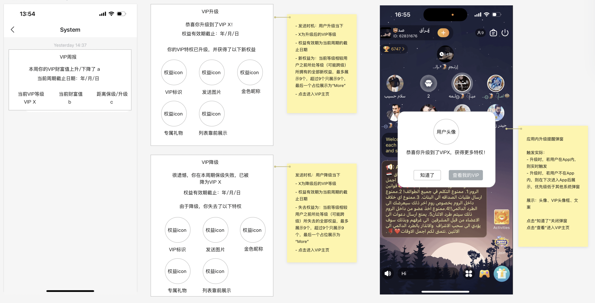

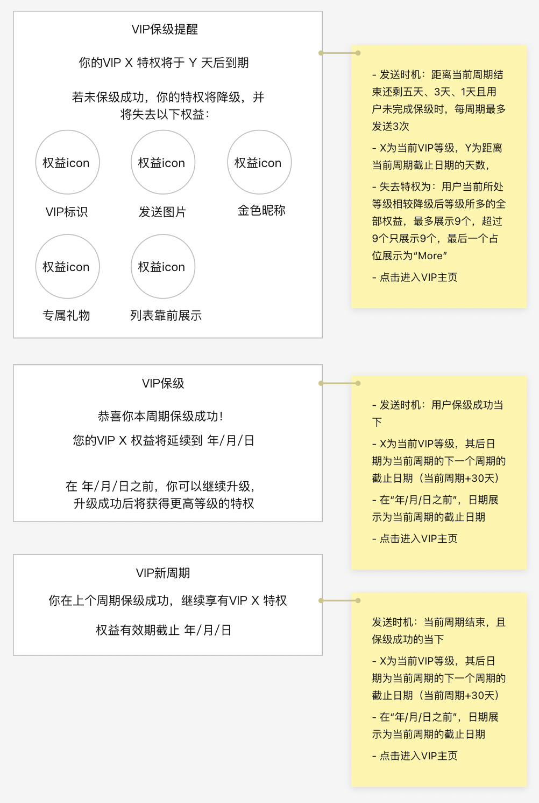

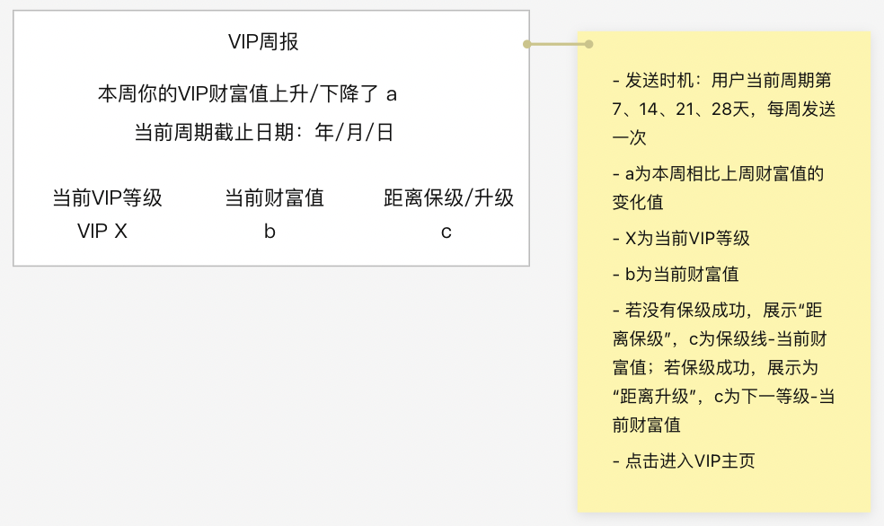

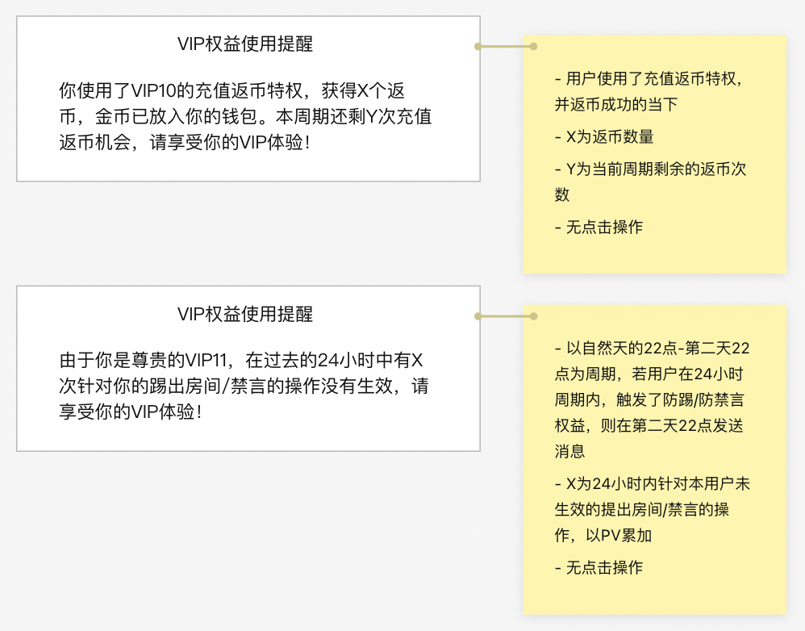

3.14.6 VIP - 全服“VIP升级全服通知”特权

| 需求描述 | 支持者的全服通知权益，添加在高阶VIP权益中。 |
|---|---|
| 优先级 |  |
| 输入/前置条件 |  |
| 需求描述 | [图1]-VIP增加横幅通知权益 升级至VIP 7及以上，以及VIP 7及以上保级成功时，发送全服的房间内横幅通知，全服可见，点击横幅跳转进入用户的个人主页 升级通知发送时机：用户触发VIP等级升级的时刻；保级通知发送时机：用户的VIP财富值增加并超过保级线的时刻（而非VIP周期结算时真正触发保级的时刻） 该权益放在VIP 7的特权包中，在VIP 7的升级、降级通知中展示 特殊情况case： - 用户通过一次大额充值触发多个等级的升级、保级，则连续发送这些等级的升级和保级全服通知 - 用户触发某一等级的升级或保级通知后，29天内无法再次触发≤该通知级别的其他通知（避免用户升级或保级后，通过退款再充值的方式多次刷全服通知），触发更高等级的通知后，29天限制更新 举例：用户触发了VIP10的升级通知，之后通过退款等形式降到了VIP7，则在29天内无法触发VIP7-VIP9的升级&保级通知、VIP10的升级通知，但可以触发VIP10 的保级通知、VIP11的升级和保级通知 - 在运营后台赠送VIP和调整VIP财富值的操作，均不触发飘屏消息 |
| 补充说明 |  |

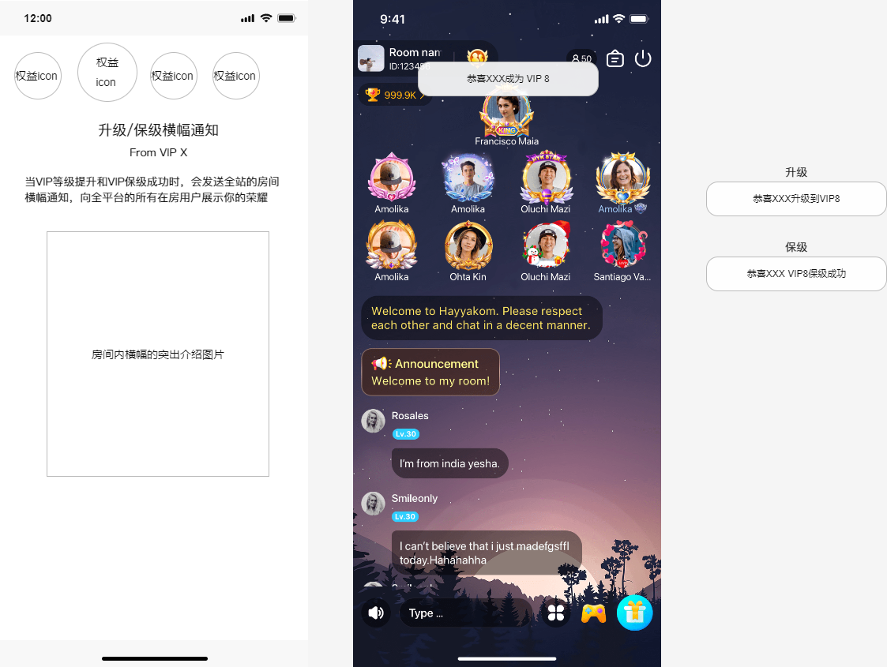

3.14.7 VIP - 增加靓号权益展示

| 需求描述 | 靓号权益与VIP体系挂钩，通过VIP期间累计充币数，赋予用户“永久”的靓号权益，与VIP等级无关，只要用户是VIP且满足累计充币数条件即可一直持有，失去VIP身份自动回收。 |
|---|---|
| 优先级 |  |
| 输入/前置条件 |  |
| 需求描述 | [图1]-VIP增加靓号权益展示 VIP发放靓号规则 - 以用户累计充值金币数为指标（与VIP财富值口径一致，包含商店充值、代充、后续接入的三方充值、运营后台加币“工资抵扣”和“对掉单的用户补单”两种类型）， - 用户每次失去VIP身份，则累计充值金币数清零1次，之后的累计充值金币数从0重新累积； - VIP页面，展示当前累计金币数值、能够获得的靓号等级；用户达到相应门槛后，联系运营进行挑选靓号、下发靓号的流程 - 在“靓号赠送”后台，支持选择靓号下发的业务，通过VIP业务下发的靓号，运营会手动勾选上VIP业务； 用户在失去VIP身份后，若当前所拥有的靓号被标记为VIP业务下发，则自动将该靓号回收 VIP靓号数值 - 共分十级 靓号tab - 靓号独立为新一类特权，原VIP特权展示在“特权”tab下，靓号权益展示在“靓号”tab下 - VIP页面默认权益定位在“特权”tab 靓号特权展示 我的累计充币数： - 仅在用户是VIP身份时展示 靓号区域展示（详见UI图分类） 4.2.1 个人靓号区域的四种展示情况： - 无VIP靓号（包含两种情况，一是没有靓号、二是有靓号但下发业务不是“VIP”），展示为空 - 有VIP靓号（靓号的下发业务为“VIP”），则展示“我的靓号ID”，靓号展示为数字 - 无VIP靓号但满足VIP靓号标准，可获得靓号，则展示“可获得”，靓号展示为可获得的靓号等级 - 有VIP靓号且可升级（累计充币数满足更高的VIP靓号标准），则展示“我的靓号ID”，靓号展示为数字，和“可升级”，展示为可升级的靓号等级 4.2.2 房间靓号区域和个人靓号区域规则一致 4.2.3 联系官方入口 - 展示为：“你可联系官方挑选靓号，点击联系”+按钮，仅在用户在4.2.1和4.2.2中有可获得或可升级的靓号时展示 - 点击时，若用户当前身份为VIP4及以上，跳转到和VIP Service的私聊，VIP4以下，跳转到官方反馈页面 4.3 说明区域 - 文案说明+靓号效果图展示 - 累计充币数与靓号效果对照表格，点击弹出浮层，展示更详尽的靓号排列规则 - 靓号权益的规则展示 靓号特权通知 5.1 获得权益通知 - 用户是VIP身份时，每次累计充币数达到阶梯，在系统消息发送一条通知 - 文案：“恭喜你的累计充币数达到 XXX，可免费获得靓号权益”，并展示当前阶梯可获得的两类靓号 - 点击信息，跳转进VIP页面，并上滑页面，定位到“靓号”tab 5.2 失去权益通知 - 用户失去VIP身份时，将其通过VIP业务下发的靓号自动回收，并发送一条文字系统消息：你的VIP靓号已被回收 |
| 补充说明 |  |

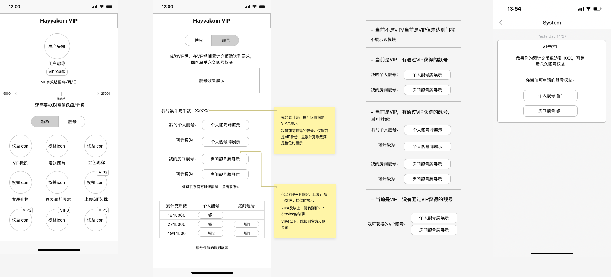
