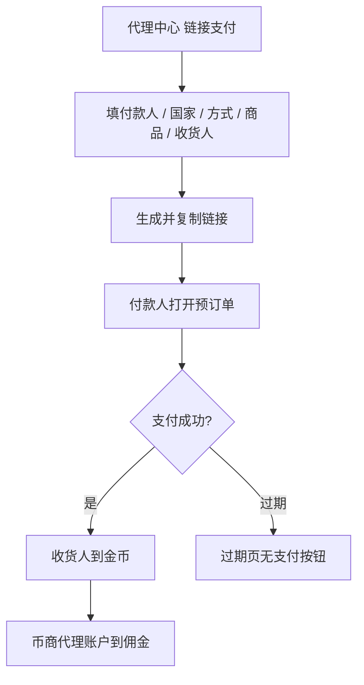

# YallaPay · 现行说明

> 派生阅读层。改规则仍改 [`../PRD.md`](../PRD.md)。基于已收录主线 **V1.4.0**。拍板 RQ-01、RQ-17。积分提现不在本文。

## 元信息
<!-- chunk:no -->

| 字段 | 值 |
|---|---|
| 功能 ID | `yallapay` |
| 截止版本 | 已收录 V1.4.0（模块正文来自 V1.1.1） |
| 权威 | 派生；冲突以 `PRD.md` 为准 |
| 状态 | pending-review |

---

## 范围
<!-- chunk:default section=scope id=yallapay.scope -->

覆盖币商 YallaPay 分销支付：生成支付链接、付款人 / 收货人、链接记录、订单查询、用户打开链接付款与到账。只写 YallaPay 支付 / 钱包相关。积分提现见积分提现说明。展示靓号标识为统一一种样式，不区分等级。记录字段可含 WhatsApp 号码用于回填，不作币商 WhatsApp 沟通功能。商品 SKU 明细表未进入现行 PRD，不编造档位数字。

---

## 总流程
<!-- chunk:default section=flow id=yallapay.flow-main -->

币商在代理中心点「链接支付」，按付款人 → 国家 → 支付方式 → 商品 → 收货人生成链接。付款人打开链接支付成功后，收货人钱包到不可交易金币，佣金立即进入币商代理账户（可交易）。

---

## 业务逻辑

### 生成链接 {#logic-create}
<!-- chunk:default section=logic id=yallapay.logic-create -->

币商默认同时开 YallaPay 充值入口与分销支付入口，相同档位每美元金币数不同。必须先选付款人，再选国家，再选支付方式，再选商品；否则点收货人输入或「添加用户」弹窗「请先填写付款人/国家/支付方式信息。【好的】」。选付款人后默认收货人=付款人。近 1 年有该付款人成功交易则回填国家 / 方式 / 商品（国家下架则整段不回填；方式下架只回填国家；商品下架仍回填国家与方式）。改国家清空方式、档位、收货币数量，不清空收货人；改方式清空档位与收货币；收货人 1 人改档位则更新收货币，大于 1 人则清空各人收货币。最多 5 个收货人，至少 1 人；剩 1 人不可删。1 人：收货金币=档位金币。2 人：系统保证两人金币之和=购买金币。大于 2 人：不自动拆，点创建时若之和≠购买金币弹窗「收货人获得金币总数高于/低于购买金币数。【好的】」（另一处文案为「收货人金币数大于/小于购买金币数，请修改。【好的】」）。删到只剩 1 人时把该人金币重置为购买金币；删到 2 人或仍大于 2 人不自动重算。页面临时态保活 24 小时，超时「操作超时，请重新填写。【好的】」回币商中心。浏览器打开编辑页拦截「请在应用内操作。」且无法关闭。链接域名含 samer 信息（本轮不改 scheme 名）。

### 佣金与到账 {#logic-pay}
<!-- chunk:default section=logic id=yallapay.logic-pay -->

币商本单收益按所选档位公式计算（用户充值赠送率 = 1.999801999802%）：90 档 5.95980595980596%；88 档 8.03880803880804%；87 档 8.97930897930898%；86 档 10.01881001881%；84 档 12.048312048312%；82 档 14.028314028314%；80 档 16.008316008316%。公式均为（用户三方链接充值币数量 /（1+赠送率））× 对应比例；「充值币」按金币来源标签理解，到用户钱包后为不可交易金币。支付成功：佣金立即进币商代理账户并写流水；付款人获 VIP 积分、充值任务进度、拉新返利；收货人不获 VIP 积分；链接支付不算首充，收货人均不获首充礼包。付款人自己流水「充值 +XXX金币」；非付款人「好友赠送 +XXX金币」。系统消息：付款人「你通过链接充值的XXX金币已到帐，请前往钱包查看【去查看】」；非付款人「YYY给你赠送了XXX金币…」；去查看进钱包金币流水。预订单可支付有效时间以 YallaPay 侧为准，本文不编时长。

---

## 客户端页面

### 链接编辑与搜人 {#page-editor}
<!-- chunk:default section=page id=yallapay.page-editor -->

默认不预填付款 / 收货。底部实时展示本单收益金币。创建链接出二次确认；点「复制链接」或点弹窗外都复制，toast「复制成功」，关闭后清空页面。搜人页默认近 1 年最近 10 个交易人（去重、时间倒序）：头像、昵称、ID / 靓号（有靓号展示靓号）。交易含应用内转账成功或链接支付成功。支持用户 ID / 靓号精确搜索（靓号为字符串）；无数据占位。动态头像正常展示。

### 链接记录与订单查询 {#page-records}
<!-- chunk:default section=page id=yallapay.page-records -->

编辑页右上角进记录。默认全部，生成时间倒序，每页 20，近 1 年。可筛已付款 / 未付款。展示：链接有效 / 无效、付款状态、支付国家及图标、链接、付款人与收货人（头像、昵称、ID / 靓号）、金额及货币、三方订单号（无则「--」不可复制）、生成时间到秒、成功单的本单收益。点收货人头像行出收货人弹窗。订单查询：近 1 年按订单号或付款人 ID / 靓号精确查；可清空输入；无结果占位。

### 付款页 {#page-pay}
<!-- chunk:default section=page id=yallapay.page-pay -->

预订单展示币商 ID / 靓号、昵称、头像。语言默认付款人应用语言，可手动切换。点支付调 YallaPay 接口。过期页不再展示支付按钮。成功出成功态页，并回写 APP 内链接订单状态。

---

## 后台影响
<!-- chunk:default section=admin id=yallapay.admin-impact -->

本文无独立后台锚。国家 / 支付方式 / 商品上架与佣金档位以后台配置为准，不复制字段。币商身份与代理账户规则见 [`../../admin/PRD.md#admin-merchant`](../../admin/PRD.md#admin-merchant)。

---

## 关联影响

### 关联 · 运营后台 {#related-admin}
<!-- chunk:related-row section=related id=yallapay.related-admin target=admin -->

本文无独立后台锚。币商身份与代理账户配置见 [`../../admin/brief/current.md#admin-merchant`](../../admin/brief/current.md#admin-merchant)。

### 关联 · 币商 {#related-merchant}
<!-- chunk:related-row section=related id=yallapay.related-merchant target=merchant -->

入口在币商管理中心「链接支付」；佣金进入代理账户（可交易金币）。跳转 [`../../merchant/brief/current.md`](../../merchant/brief/current.md)。

### 关联 · 积分提现 {#related-payout}
<!-- chunk:related-row section=related id=yallapay.related-payout target=payout -->

积分兑法币打款不并入本文。跳转 [`../../payout/brief/current.md`](../../payout/brief/current.md)。

### 关联 · 商城 {#related-mall}
<!-- chunk:related-row section=related id=yallapay.related-mall target=mall -->

付款人 / 收货人有靓号则展示靓号，标识仅一种样式；商城不卖靓号。跳转 [`../../mall/brief/current.md`](../../mall/brief/current.md)。

---

## 相对变化
<!-- chunk:changelog section=changelog id=yallapay.changelog -->

相对原文：积分提现从本功能拆出；「充值币」按金币来源标签理解，用户侧不可交易；靓号只展示、不按等级分样式；币商 WhatsApp 沟通不作现行。

---

## 原文
<!-- chunk:no -->

[`../PRD.md`](../PRD.md) · [`../changelog.md`](../changelog.md) · [`../history/`](../history/)

---

## 计划预览
<!-- chunk:no -->

V1.5.0 工作区不是现行。无已收录之后的版本计划进入本文。

---

## 待校对
<!-- chunk:no -->

- 商品 SKU 配置表（价格列 / 用户得金币列）未进入现行 PRD。
- 预订单可支付有效时间写「详见 YallaPay 侧」，无平台时长。
- 收货人金币不符时存在两套弹窗文案，未裁定只用哪一句。
- 历史记录 WhatsApp 字段仅回填，交互形态原文未单列。
