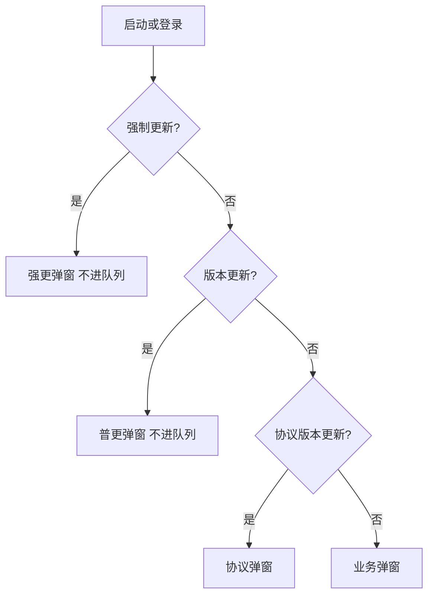

# 品牌/更新 · 现行说明

> 派生阅读层。改规则仍改 [`../PRD.md`](../PRD.md)。基于已收录主线 **V1.4.0**。拍板 RQ-04。

## 元信息
<!-- chunk:no -->

| 字段 | 值 |
|---|---|
| 功能 ID | `app-branding` |
| 截止版本 | 已收录 V1.4.0（正文含 V1.2.0 / V1.3.0 / V1.4.0） |
| 权威 | 派生；冲突以 `PRD.md` 为准 |
| 状态 | pending-review |

---

## 范围
<!-- chunk:default section=scope id=app-branding.scope -->

覆盖对外品牌 Hayyo、改名物料、强制更新 / 版本更新弹窗、iOS 首页配置。默认昵称 / 房间名 / 后台重置前缀 = `player`（昵称规则权威在基建）。scheme `samer` / `parchisw` 本轮不改名。

---

## 总流程
<!-- chunk:default section=flow id=app-branding.flow-main -->

启动或登录时先判更新：有强制更新只出强更，不会同时出版本更新。强更 / 普更都不进弹窗队列，可能与当前页弹窗重叠。无更新再判隐私协议，再才到业务弹窗（活动、新人礼包、签到）。

---

## 业务逻辑

### 对外品牌与改名物料 {#logic-rename}
<!-- chunk:default section=logic id=app-branding.logic-rename -->

对外品牌 **Hayyo**。需改：应用 Logo；启动 / 登录 / 官网名称与 Logo；房间分享名称与 Logo；离线推送图标；官方消息图标；官方账号标识；刷新加载动效；拉新海报；隐私及协议中的名称与邮箱；第三方账号应用名与 LOGO；短信文案模板；服务端 / 客户端 / H5 翻译（含 app 名、优惠券说明、拉新说明、数值游戏说明等）；日报邮件名称；后台运营管理 Logo 与名称（正式 / 测试）。物料以 UI 稿为准。研发需自查遗漏。

Android 客户端预埋外部浏览器唤醒，同时支持 `samer` 和 `parchisw` scheme。H5 后续版本才统一把 scheme 从 `samer` 改为 `parchisw`；**本轮不改名**。影响 Yalla Pay 支付页登录 token 过期后唤醒 App。因 Android 已改名称，iOS 侧对应项 Android 仅改 Logo、加载图标、占位图标。双端共用隐私协议与官网：协议改名；官网加「儿童安全协议」、换 Logo、调布局；协议调整涉及游戏；拉新分享海报 logo 图片。

### 强制更新与版本更新 {#logic-update}
<!-- chunk:default section=logic id=app-branding.logic-update -->

优先级：强制弹窗 / 版本更新弹窗 ＞ 协议弹窗 ＞ 业务弹窗（活动弹窗、新人礼包、签到）。强更 / 普更不进弹窗队列，队列权威在基建。有强制更新就不会有版本更新。

iOS 补齐：服务端操作强制更新后，该版本用户被强制退出；点苹果登录授权后，或输入手机号点 Next 时，提示「请更新版本」。

协议：客户端判隐私协议版本号，有更新才弹。第一次下载包的新注册用户不弹隐私协议。未卸载 App 时，老账号未确认新协议，此时新注册一个号登录仍会弹协议。

### 爆奖礼物经验 {#logic-exp}
<!-- chunk:default section=logic id=app-branding.logic-exp -->

爆奖礼物消费金币计入用户等级经验，比例同线上：1 经验 = 4000 金币。

### iOS 指定首页 {#logic-home}
<!-- chunk:default section=logic id=app-branding.logic-home -->

iOS 根据服务端配置，切换进入应用内的首页。

---

## 客户端页面

### 更新弹窗 {#page-update}
<!-- chunk:default section=page id=app-branding.page-update -->

强更与版本更新弹窗按 `{#logic-update}` 展示。本功能不另做独立页面。iOS 首页落地由服务端配置，见 `{#logic-home}`。

---

## 后台影响
<!-- chunk:default section=admin id=app-branding.admin-impact -->

版本更新弹窗按语区配置，每语区上传 3 种语言文案。活动 / Banner 以后台为准。跳转 [`../../admin/PRD.md#admin-update-popup`](../../admin/PRD.md#admin-update-popup)、[`../../admin/PRD.md#admin-banner`](../../admin/PRD.md#admin-banner)。

---

## 关联影响

### 关联 · 运营后台 {#related-admin}
<!-- chunk:related-row section=related id=app-branding.related-admin target=admin -->

更新弹窗语区、活动 / Banner。跳转 [`../../admin/brief/current.md#admin-update-popup`](../../admin/brief/current.md#admin-update-popup)、[`../../admin/brief/current.md#admin-banner`](../../admin/brief/current.md#admin-banner)。

### 关联 · 基建 {#related-infra}
<!-- chunk:related-row section=related id=app-branding.related-infra target=infra -->

默认昵称 / 房间名 / 重置前缀 `player` 的权威在基建。强更 / 普更不进队，队列排序权威也在基建。跳转 [`../../infra/brief/current.md`](../../infra/brief/current.md)。

### 关联 · 用户等级 {#related-user-level}
<!-- chunk:related-row section=related id=app-branding.related-user-level target=user-level -->

爆奖礼物按 4000 金币 = 1 经验计入等级。跳转 [`../../user-level/brief/current.md`](../../user-level/brief/current.md)。

---

## 相对变化
<!-- chunk:changelog section=changelog id=app-branding.changelog -->

相对原文：对外品牌落地为 Hayyo；默认前缀为 `player`，`Samer_{ID}` 等不当现行。scheme `samer` / `parchisw` 本轮不改名。

---

## 原文
<!-- chunk:no -->

[`../PRD.md`](../PRD.md) · [`../changelog.md`](../changelog.md) · [`../history/`](../history/)

---

## 计划预览
<!-- chunk:no -->

V1.5.0 工作区不是现行，不进入正文。升格为已收录后再判定覆盖或增量。

---

## 待校对
<!-- chunk:no -->

- scheme / 包名是否改为 Hayyo 仍待定（本轮明确不改 scheme 名）。
- H5 何时把 scheme 从 `samer` 统一到 `parchisw`，原文写后续版本，无已收录版本号。
