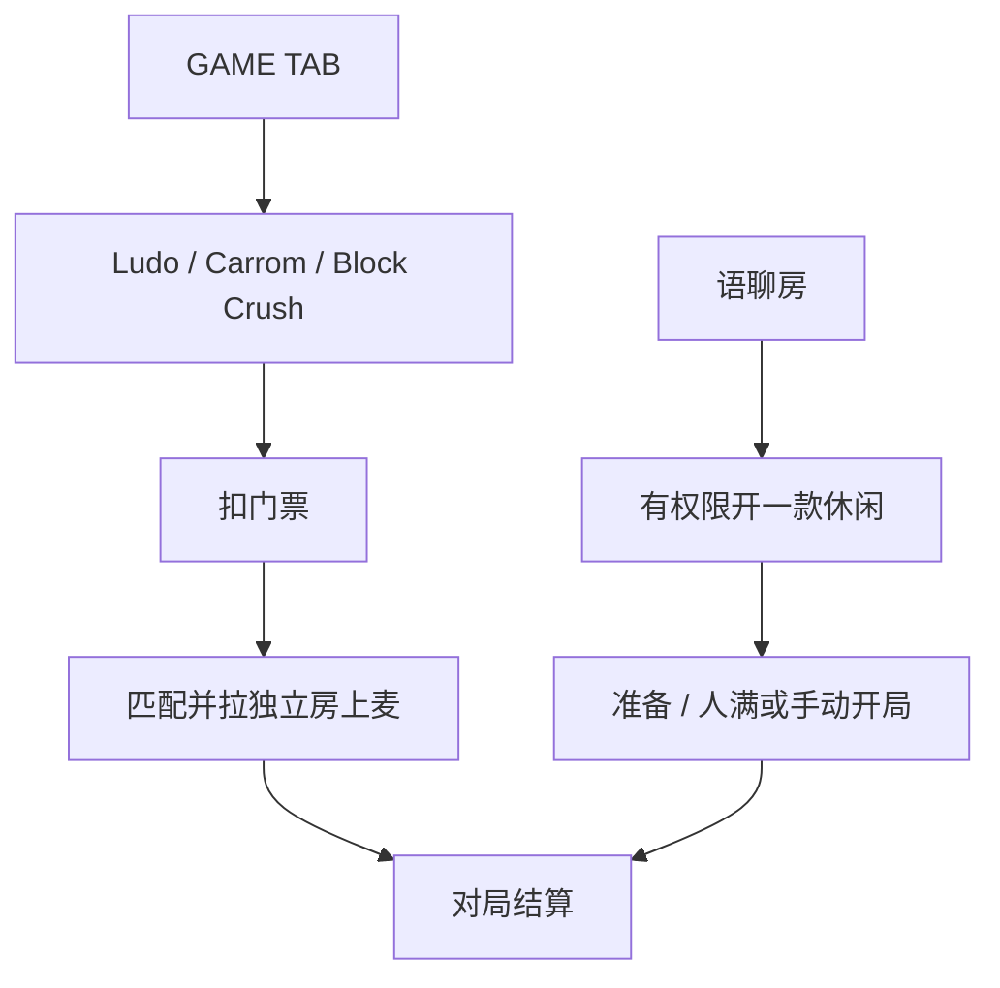

# 休闲游戏 · 现行说明

> 派生阅读层。改规则仍改 [`../PRD.md`](../PRD.md)。基于已收录主线 **V1.4.0**。拍板 RQ-12、RQ-21。

## 元信息
<!-- chunk:no -->

| 字段 | 值 |
|---|---|
| 功能 ID | `casual-game` |
| 截止版本 | 已收录 V1.4.0（正文含 V1.3.0 / V1.3.2 / V1.4.0） |
| 权威 | 派生；冲突以 `PRD.md` 为准 |
| 状态 | pending-review |

---

## 范围
<!-- chunk:default section=scope id=casual-game.scope -->

仅 Ludo / Carrom / Block Crush。水果机 / 动物机 / Bounty Racing / Lord of Olympus 只在房间游戏。幸运数字 / 掷色子是房间工具，不是休闲三款。「Casual Games = 数值游戏」不当现行。房间内休闲面板在语聊房内开启，不是游戏房模式。房间外匹配不进 Party 列表，不定义成游戏房模式，也不删除。

---

## 总流程
<!-- chunk:default section=flow id=casual-game.flow-main -->

两条互不打通的路径。房间外：GAME TAB 点三款之一，扣门票后纯匹配，拉进独立聊天房上麦对局，这些房间不进 Party 搜索 / 资料页 / 列表。房间内：语聊房一次只开一款休闲，准备后开局，列表只打游戏图标标记，不是游戏房坑位。

---

## 业务逻辑

### 房间外匹配与门票 {#logic-lobby-match}
<!-- chunk:default section=logic id=casual-game.logic-lobby-match -->

底层是匹配到同一个独立聊天房上麦玩游戏，并支持公屏。当前版本不能被房间列表搜索、用户资料进入、聊天房列表展示；也不展示在资料页当前所在房间。机器人和匹配用房至少 700 个，与 Party 业务隔离；约 700 个机器人（男女大约各 300，剩 100 中性），不能和房间账号相同。

门票每人先按 10 金币收，点匹配扣费；未能正常开始（含匹配成功前主动取消、多次加载失败解散）双方返还。大厅和房间内扣费逻辑相同。组局成功抽门票 20%。主动退出不返还。各自为战只第一名拿抽成后全部金币；组队由胜出队伍均分；有小数整体向上取整。不同门票档位严禁匹配到同一对局。房间外当前全部为 10 金币一局，支持后台按游戏独立调整。不写「还差 XXX 金币」。

完成一场后双方进入各自 30 分钟回避池，同时在队列会跳过对方。匹配会筛掉不同档位、回避池、24 小时隔离保护中的用户。0–3 秒只试真人；第 3 秒仍未成功加 1 个机器人；之后每隔 15 秒补机器人直到满员。三消优先真人，无 IR 规则，不满足则按时间条件匹配中等机器人。匹配流程里仍有「新用户判定 → 直接匹配 3 个 / 1 个 Level 1 机器人」；原文另有「首局保护」标 7 月 23 日删除，是否同一条见待校对。

### 房间外开局与逃跑 {#logic-lobby-play}
<!-- chunk:default section=logic id=casual-game.logic-lobby-play -->

点匹配先申请麦克风权限；无权限仍可匹配进游戏，只是不上麦；进房后仍可用公屏麦克风按钮申请上麦。当前若有正在进行的房间内游戏，点匹配需确认，确认则退出房间（含房间游戏）再匹配房间外。

付款成功后进入匹配，正计时 mm:ss。匹配中不能直接退房，取消才返还金币。杀进程或崩溃按退出匹配；卡在最后按游戏中。匹配成功展示 1.5 秒后不可取消，进入加载。加载最短 3 秒；单次超时 15 秒，重连一次，两次合计 30 秒。需房间服务器与游戏服务都正常，且双方进房上麦成功，才算开局；任一异常按失败。开局失败 toast「开局失败，金币返还」。加载失败文案：超时「网络错误，请重试」；本地房间服务器错误「游戏连接异常，请稍后再试」。

对局中聊天 1:1 复刻房间消息能力（不含顶部跑道、进房特效）。连续 3 次主动退出后，第 4 次发起要倒计时 59 秒才能再匹配；关弹窗不刷新 59 秒；完整完成一场刷新 3 次机制。确认退出后不再回到该回合；即使托管赢了也不给结算。Android 大厅游戏进行中保持屏幕常亮。

### 房间内开启与准备 {#logic-room-open}
<!-- chunk:default section=logic id=casual-game.logic-room-open -->

一个房间只能同时开一款休闲。有半屏开启权限且资源已就绪，二次确认后开启。无权限：普通用户「请联系房主或者管理员开启游戏」；管理员「房主未开启管理员开启/关闭游戏功能，请联系房主开启」。默认仅房主可开，房主可授权管理员，该开关默认关。权限表以效果图为准，本文不编造单元格。

下架受后台开关控制。未开启时点已下架图标提示已下架。进行中的本局不受影响，结束后回准备页关闭并提示已下架。已开启未开局时，变更 / 手动开局 / 自动开局触发下架通知并关游戏，离座返还门票。

管理可设模式、门票、加入范围。Ludo 默认 1v1、门票默认 Free、玩法默认 Classic 可选 Magic。人满后开始按钮可点并 15 秒倒计时，可提前手动开。变更加入范围为「所有人可加入」无需二次确认、不移除已加入用户；其它加入范围变更要二次确认，成功后公聊通知并移除已参与用户。变更模式 / 人数 / 门票均二次确认，参与者移出并 toast，公聊发条件变更消息。加入时余额小于门票给出充值提示（沿用现有充值半屏，不写「还差 XXX 金币」）。仅关注房间用户可参与时，未关注用户点加入需二次确认关注并加入；管理视角不受该条件限制。仅邀请可加入时，用户点击给提示（原文提示写成「房主设置仅关注房间用户可加入」）。管理可移除权限低于自己的参与者，需二次确认。

准备中：房主 / 获权管理可关游戏，二次确认后全员提示「操作人昵称 关闭了游戏」，公聊同步。准备中切换其他休闲：确认后关 A 开 B，公聊两条，已加入 A 的用户另给提示。对局中不可切换，提示「本局游戏未结束无法切换游戏」。

空位菜单：加入 / 邀请用户 / 取消（覆盖在面板上）。邀请列表为房内未加入用户，右上角可刷新。点邀请后按钮变已邀请，受邀未处理则弹窗一直展示，同时最多一个。已加入或已离开房间分别 toast。房间最小化时不展示邀请弹窗。接受则走加入流程；人满、已开局或状态变更则邀请过期。成功加入则提示邀请者「XX 接受了邀请并加入了游戏」。

### 房间内三款 {#logic-three-games}
<!-- chunk:default section=logic id=casual-game.logic-three-games -->

Ludo：默认 1v1 可选 4 人；默认门票 Free 可选 10 金币；默认 Classic。1v1 两人落座可开，4 人模式四人落座可开，人满 15 秒倒计时。胜者第一名获本局门票总额 80%。

Carrom：默认 1v1 可选 4 人；默认门票 Free 可选 10。1v1 无托管，两轮不操作即负；4 人两轮不操作进托管。开局人数规则同 Ludo。胜者第一名 80%。

Block Crush：房间外适配默认 Solo，只选用 180 秒，Team 为 2v2，人满 4 人发车。房间内默认 Solo 可选 Team；默认 180 秒可选 90 / 300 秒；默认门票 Free 可选 10。最多 6 人。Solo 满 2、3、4、5 人可开，6 人 15 秒倒计时；Team 满 2 组（4 人）可开，3 组坐满（6 人）15 秒倒计时。Solo 第一名 80%；Team 第一组 80%，组内平分。有人离座不做补位或挪位。默认选项均可配置。

房间外 Ludo 默认为经典（非 Magic）以及 1v1；Carrom 仅 1v1 与 4 人，默认 1v1。

### 对局状态、逃跑与提前结束 {#logic-settle}
<!-- chunk:default section=logic id=casual-game.logic-settle -->

正常参与结束弹出游戏方结算页；赢者通吃并获门票 80%，平台抽 20%；结束后参与者重新落座。加载最短 1 秒（房间内），超时 15 秒 + 重连，两次合计 30 秒。

主动退出房间统计为逃跑，不获奖励和门票返还；本场未结束可回房继续；若最终赢得本局，服务端拦截不加币。对局中不能踢出房间；对局中踢人 toast「当前用户正在游戏中，请对局结束后再操作」。踢座位只看是否在游戏座位，与麦位无关。对局中主动离开 / 切房给出逃跑提示，含 keep 后关房 / 进其他房，以及经全站广播、IM 跳房。

本局全部参与者逃跑则直接关局，门票不返还、奖励不结算；公聊发对局结束（发送人系统）；管理弹窗「本局所有对局用户已逃跑，对局结束」。大厅对局全部逃跑也提前结束并记后台。管理开局后可提前结束：走游戏方提前结束接口，未逃跑用户退还门票；5 分钟内只能关 1 次（间隔与次数服务端可配）。加载页不显示关闭；已结束时关闭按钮只关游戏。二次确认时若对局已结束，toast「该对局已结束」。

结算标记：正常结算、异常结算、逃跑结算、管理操作结算。超 1 小时或结算异常的对局由服务端强制结束。门票资金整表见原文外链，本文不粘贴。

配置：房间内每次开启、对局结束拉最新配置，缓存在服务端直至下次失效；本地与服务端不同则刷新并给参与者「信息变更」弹窗，旧包也提示。

玩数值游戏时房间开启休闲：休闲保持最小化；关掉数值弹窗后数值仍最小化。

---

## 客户端页面

### GAME TAB {#page-tab}
<!-- chunk:default section=page id=casual-game.page-tab -->

导航增加游戏 TAB；当前版本不做用户分层落地，落地页调整为 GAME。左上角本人头像 / 头像框（进资料）和金币（进充值，数量单位同首页）。列表固定三款，后台开关控制是否展示入口和更新。停留在游戏页时后台下架，点匹配 toast 后回游戏大厅。本地打包 + 热更：至少打包 Ludo 和 Carrom，Block Crush 手动点下载；多信息加载时先 Carrom 再 Ludo。打开 App 校验版本 / 下载；在列表页不展示进度；点游戏或切回 TAB 再校验，需更新或下载中展示进度且点击无效；失败 toast「游戏加载失败」，可再点下载。

### 匹配、加载与对局页 {#page-match}
<!-- chunk:default section=page id=casual-game.page-match -->

游戏页左上角同列表（头像、头像框、金币）。右侧退出回列表。拓展：说明（三方说明弹窗）、支持（Office 对话，返回游戏页）、设置。设置默认开，开关均 toast。麦克风：开则进游戏默认上麦并开麦，关则上麦但关麦。游戏音独立于房间媒体音。匹配中设置不展示规则和支持。充值半屏按身份展示应用市场或代理充值。

匹配只支持纯匹配，无邀请好友组队。自己在左侧首位或下位，展示头像、头像框、昵称（过长省略），不可点资料。加载页同样不可点资料。异常退出后再进 App：未完结则回游戏加载；已完结或加载中完结则出结果提示。该重连弹窗层级高于签到、高于新人礼包。最小化窗口、keep 房间、进入正在对局的房间：打开游戏页并展示我方本局加载页。

对局顶栏有 12 位对局 ID（`yyMMdd` + 大小写字母和数字，唯一）。聊天区默认缩起，点输入 / 展开按钮展开；点消息按钮则收起并出消息半屏。点输入栏激活键盘，发出后退出弹窗。

### 房间内休闲面板 {#page-room-panel}
<!-- chunk:default section=page id=casual-game.page-room-panel -->

开启后进房用户默认展开该窗口（不是弹窗）：在通知层之上、弹窗之下。资源未就绪时面板仍开并进更新 / 加载，可最小化、充值、设置；完成后按身份刷新。金币点加号开充值，展示规则同大厅。观众人数本版不做。声音与音效用媒体音；iOS 回声建议用游戏方 RTC 播放。仅有管理权限且未开局时显示关闭。最小化后游戏 BGM / 声效静音；图标在音乐播放器与水果机图标中间，点开展开；对局结束自动展开。

公聊默认折叠，礼物跑道在面板下方；展开后消息、右下角功能、全站广播正常。对局中点广播跳其他房，用离开房间弹窗文案。礼物 / 座驾动效在面板下层；特效开关默认开，改完 toast。计分器、礼物面板、麦上表情、游戏菜单、在线列表、房间榜单、房间信息、工具箱、公告、退出、充值均覆盖在面板之上。点水果机或动物转盘打开对应房间游戏并把休闲最小化。准备态被踢出房间则同步踢出游戏席位并返还门票。首次进入已开休闲的语聊房，不展示上麦 / 公聊 / 送礼入口引导组合，且引导标为已展示。不是游戏房模式。

列表侧：我的房间、最近进入、我关注的、房间列表显示对应游戏图标，属于内容标记，不影响房间排名。

---

## 后台影响
<!-- chunk:default section=admin id=casual-game.admin-impact -->

休闲数据 / 配置 / 门票 / 对局明细以后台为准。客户端结算仍用正常 / 异常 / 逃跑 / 管理操作四类标记。跳转 [`../../admin/PRD.md#admin-casual-game`](../../admin/PRD.md#admin-casual-game)。门票资金整表外链不展开。

---

## 关联影响

### 关联 · 运营后台 {#related-admin}
<!-- chunk:related-row section=related id=casual-game.related-admin target=admin -->

休闲数据 / 配置 / 门票 / 对局明细。跳转 [`../../admin/brief/current.md#admin-casual-game`](../../admin/brief/current.md#admin-casual-game)。

### 关联 · 房间游戏 {#related-room-game}
<!-- chunk:related-row section=related id=casual-game.related-room-game target=room-game -->

水果机 / 动物机 / Bounty / Olympus 只在房间游戏。数值与休闲同时存在时的最小化、全局重连弹窗排序见房间游戏。跳转 [`../../room-game/brief/current.md`](../../room-game/brief/current.md)。

### 关联 · 房间 {#related-room}
<!-- chunk:related-row section=related id=casual-game.related-room target=room -->

幸运数字 / 掷色子仍是房间工具，不是休闲三款。跳转 [`../../room/brief/current.md`](../../room/brief/current.md)。

### 关联 · 房间列表 {#related-room-list}
<!-- chunk:related-row section=related id=casual-game.related-room-list target=room-list -->

房间外匹配不进 Party 列表。房间内开启休闲只打内容标记，不是游戏房模式坑位。跳转 [`../../room-list/brief/current.md`](../../room-list/brief/current.md)。

### 关联 · 基建 {#related-infra}
<!-- chunk:related-row section=related id=casual-game.related-infra target=infra -->

异常退出重连弹窗高于签到和新人礼包；队列权威在基建。跳转 [`../../infra/brief/current.md`](../../infra/brief/current.md)。

---

## 相对变化
<!-- chunk:changelog section=changelog id=casual-game.changelog -->

相对原文：休闲仅 Ludo / Carrom / Block Crush；数值四款不在本文。「Casual Games = 数值游戏」不当现行。明确没有游戏房模式；房间外匹配不进 Party 列表。不写「还差 XXX 金币」。

---

## 原文
<!-- chunk:no -->

[`../PRD.md`](../PRD.md) · [`../changelog.md`](../changelog.md) · [`../history/`](../history/)

---

## 计划预览
<!-- chunk:no -->

V1.5.0 工作区不是现行，不进入正文。升格为已收录后再判定覆盖或增量。

---

## 待校对
<!-- chunk:no -->

- 「新用户首局保护」标 7 月 23 日删除，与匹配流程「新用户判定」是否同一条，原文未对账。
- 24 小时隔离保护的触发条件在该段只写了筛选，未写触发。
- 金币缩写规则标题在，正文未写规则。
- 门票资金整表仅外链，本文未收录单元格。
- 公聊 / Toast / 弹窗文案汇总只见图，本文不编造文案表。
- 「仅邀请可加入」的提示原文写成「仅关注房间用户可加入」，是否笔误未对账。
