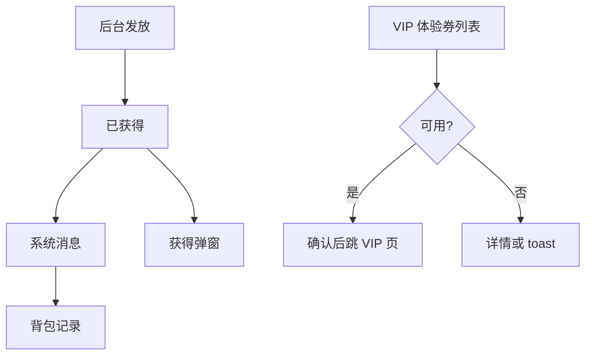

# 福利券 · 现行说明

> 派生阅读层。改规则仍改 [`../PRD.md`](../PRD.md)。基于已收录主线 **V1.4.0**。拍板 RQ-02：付费身份只有 VIP。

## 元信息
<!-- chunk:no -->

| 字段 | 值 |
|---|---|
| 功能 ID | `coupon` |
| 截止版本 | 已收录 V1.4.0（客户端体系来自 V1.1.0，发放不再按 VIP 拦截为 V1.4.0） |
| 权威 | 派生；冲突以 `PRD.md` 为准 |
| 状态 | pending-review |

---

## 范围
<!-- chunk:default section=scope id=coupon.scope -->

覆盖客户端福利券：系统消息、背包历史记录、获得弹窗、VIP 体验券列表与 VIP 页状态。券类型为金币膨胀券与 VIP 体验券。不覆盖后台券配置字段表。不写贵族券。

---

## 总流程
<!-- chunk:default section=flow id=coupon.flow-main -->

后台发放后用户已获得。在线则在允许的一级页弹出；离线则下次登录弹。同时发系统消息；即将过期每日 11 点与 21 点各检一次。VIP 体验券在背包使用，成功后跳 VIP 页。

---

## 业务逻辑

### 系统消息 {#logic-msg}
<!-- chunk:default section=logic id=coupon.logic-msg -->

新获得：每次收到同类型新券都发对应类型消息（不论数量、日期）。单次同步发两种类型则两条消息。点消息进 Me 背包对应 tab。金币膨胀券文案：「恭喜，您获得了“膨胀券”！购买金币买的越多，膨胀后得到金币越多！点击查看」。VIP 体验券：「恭喜，您获得了“VIP体验券”！点击查看」。

即将过期：每日 11 点、21 点检测，同类型存在 ≤24 小时（含 24）过期的券就发该类型一条；不同类型可同时发。X = 该 24 小时窗口内对应类型张数。膨胀券：「您还有X张“膨胀券”即将过期……」；VIP 体验券：「您还有X张“VIP体验券”即将过期……」。发放人多时可排队分段发，原文举例每分钟 500 人，以性能为准。

### 发放与弹窗 {#logic-popup}
<!-- chunk:default section=logic id=coupon.logic-popup -->

本版弹窗只支持 VIP 体验券与充值膨胀券，可两种一起展示。发放内容、每人张数、弹窗排序均后台配置。同一张券多张则铺开不折叠（同张标准后台配置）。每次发放只展示一次；展示过（含杀进程）不再二次展示。在线直接弹；不在线下次登录弹。登录后层级：本发放弹窗 > 新手礼包 > 签到。在线时只在停留或回到这些一级页按优先级弹：Party 的 Recommend/Mine、Message 的 message/Friends、Me。层级高于站内消息弹窗。不弹出：水果机、聊天房内、消息详情、H5（拉新、当前 VIP 等）。原文「平台独立游戏内（后续存在）」不是现行游戏房模式。消息发放后有效期 48 小时，超时未弹出则不再弹。房内收到后立刻用掉，仍按上述弹出规则。关按钮只关不跳。含两种类型时跳转膨胀券；只有一种则跳该种。

### VIP 体验券使用 {#logic-vip-trial}
<!-- chunk:default section=logic id=coupon.logic-vip-trial -->

满足条件时获得对应 VIP 等级与天数，结束自动回收。发放不再按用户当前 VIP 拦截；只要发放即可获得。使用时只能用比自己当前 VIP 高的券。一次一张，体验未结束不能用另一张，不叠加。使用成功不发升级提示，直接跳 VIP 页。体验中原财富值继续记，结算周期顺延（例：原 VIP3 还有 10 天结算，用 VIP7 体验 7 天，则 10+7 天后结算）。体验中财富未到体验等级：升级/保级都不发消息、弹窗、飘条。财富 ≥ 体验等级：立刻结束体验，进入该等级并给该级升级提示。结束时若未达体验等级则回收已发权益。发放后即可用，无开始时间窗；结束有效期、体验等级、体验时长（1–999 天，按天×24 小时）后台必填。

---

## 客户端页面

### 背包历史记录 {#page-history}
<!-- chunk:default section=page id=coupon.page-history -->

历史记录筛选增加膨胀券、VIP 体验券。展示：金币 icon + 充值膨胀比例或固定数量 / VIP 等级体验券；左侧比例或数量缩写 / VIP 勋章；获取时间 `dd/MM HH:mm(GMT+3)`；状态为未使用未过期只显示获取日期、过期显示「已过期」、已使用显示使用时间。排序：获得时间倒序；同时则膨胀券先于 VIP 体验券；再按比例大 / 固定数量大 / VIP 等级高；全相同则可随机或按 key。

### VIP 体验券列表 {#page-trial-list}
<!-- chunk:default section=page id=coupon.page-trial-list -->

背包新增「体验券」tab，数量空为 0，最大 99，超过 `99+`。问号仅该 tab 显示，点开使用说明。过期卡不展示。排序：结束时间倒序，再按可体验 VIP 从高到低，再随机或唯一 ID。相同券铺开不叠。≤24 小时加「临期」角标。不可用（自身 VIP ≥ 体验卡，或正在体验其他等级）按钮「不可用」，点开详情；可用为「使用」。一页 20，下手势刷新。点卡片出详情：体验天数、`dd/MM/yyyy HH:mm(GMT+3)前可用`、不可用原因。点使用：可用则二次确认「您即将使用VIPX体验券」，确定后跳 VIP 页并定位该等级。等级不够：「只可用体验高于您自身的VIP等级的权益」。正在体验：「当前有正在体验的VIP，请在结束后尝试」（原文「丹铅有正在体验的VIP」视为错字，待校对）。过期 toast「体验券过期已不可用，请在记录中查看」并刷新。

### VIP 页状态 {#page-vip}
<!-- chunk:default section=page id=coupon.page-vip -->

有可使用体验卡时，VIP 页右上角提示入口（双端原生），点进背包体验券 tab。使用中展示剩余时间、结束后将回到的 VIP（按当前财富值）、以及升到体验等级还差的财富值。

---

## 后台影响
<!-- chunk:default section=admin id=coupon.admin-impact -->

券配置、使用记录、发放计划、用户群体以后台为准，本文不复制字段。跳转 [`../../admin/PRD.md#admin-coupon`](../../admin/PRD.md#admin-coupon)。补单触发的系统消息见 [`../../admin/PRD.md#admin-recharge-msg`](../../admin/PRD.md#admin-recharge-msg)。

---

## 关联影响

### 关联 · 运营后台 {#related-admin}
<!-- chunk:related-row section=related id=coupon.related-admin target=admin -->

体验券 / 发放体系；补单系统消息见同后台 brief。跳转 [`../../admin/brief/current.md#admin-coupon`](../../admin/brief/current.md#admin-coupon)、[`../../admin/brief/current.md#admin-recharge-msg`](../../admin/brief/current.md#admin-recharge-msg)。

### 关联 · VIP {#related-vip}
<!-- chunk:related-row section=related id=coupon.related-vip target=vip -->

体验券使用成功跳 VIP 页；体验中财富与结算顺延按 VIP 规则。跳转 [`../../vip/brief/current.md`](../../vip/brief/current.md)。

### 关联 · 签到与任务 {#related-checkin-task}
<!-- chunk:related-row section=related id=coupon.related-checkin-task target=checkin-task -->

登录后弹窗层级：发放弹窗高于新手礼包，签到最后。跳转 [`../../checkin-task/brief/current.md`](../../checkin-task/brief/current.md)。

### 关联 · 基建 {#related-infra}
<!-- chunk:related-row section=related id=coupon.related-infra target=infra -->

发放弹窗与新人礼包、签到的优先级配套。跳转 [`../../infra/brief/current.md`](../../infra/brief/current.md)。

### 关联 · 充值 {#related-recharge}
<!-- chunk:related-row section=related id=coupon.related-recharge target=recharge -->

膨胀券文案指向购买金币膨胀。跳转 [`../../recharge/brief/current.md`](../../recharge/brief/current.md)。本文无独立膨胀券使用页。

---

## 相对变化
<!-- chunk:changelog section=changelog id=coupon.changelog -->

相对原文：发放不再按用户当前 VIP 拦截；使用仍只能用更高等级。身份为 VIP，不是贵族。

---

## 原文
<!-- chunk:no -->

[`../PRD.md`](../PRD.md) · [`../changelog.md`](../changelog.md) · [`../history/`](../history/)

---

## 计划预览
<!-- chunk:no -->

V1.5.0 工作区不是现行。本功能 changelog 无已收录之后的版本计划进入本文。

---

## 待校对
<!-- chunk:no -->

VIP 页剩余时间写「格式如下」但无正文格式。膨胀券缩写规则写「参考后续文档」。体验券详情原文混用「膨胀券详情」。原文「展示赌赢体验的VIP等级」「丹铅有正在体验的VIP」疑似错字。客户端无独立膨胀券列表页。
