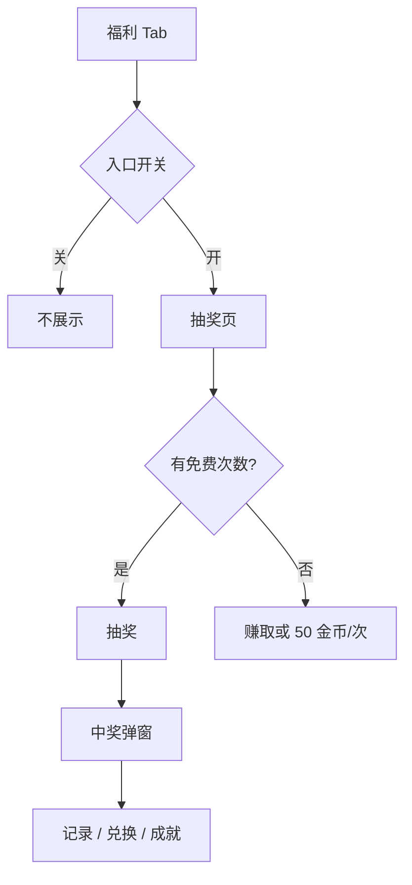

# 抽奖 · 现行说明

> 派生阅读层。改规则仍改 [`../PRD.md`](../PRD.md)。基于已收录主线 **V1.4.0**。拍板 RQ-17、RQ-01、RQ-21。

## 元信息
<!-- chunk:no -->

| 字段 | 值 |
|---|---|
| 功能 ID | `lottery` |
| 截止版本 | 已收录 V1.4.0（活动页来自 V1.1.0，首页待领气泡为 V1.4.0） |
| 权威 | 派生；冲突以 `PRD.md` 为准 |
| 状态 | pending-review |

---

## 范围
<!-- chunk:default section=scope id=lottery.scope -->

覆盖 App 抽奖一级 Tab、H5 活动页、中奖与兑换、成就榜、引导与通知、首页待领气泡。奖励只发现行商品、金币、宝石；不发头饰卡、钻石。头饰卡 ≠ 头像框。原文碎片用于兑换现行商品，礼物按现行礼物发放。水果机入口仍打开官方房内水果机（房间内游戏仍在）。无游戏房模式。

---

## 总流程
<!-- chunk:default section=flow id=lottery.flow-main -->

服务端打开入口开关后，一级 Tab 第二位出现福利入口。有免费次数则抽；用完可做任务赚次数，当天任务都完成后改为 50 金币/次。中奖出弹窗；碎片去兑换商城。活动结束可进入兑换与待领成就的宽限期。

---

## 业务逻辑

### 次数与扣费 {#logic-chance}
<!-- chunk:default section=logic id=lottery.logic-chance -->

每账号每天免费 5 次（服务端可配），按钮展示当天剩余次数。每设备指纹每天最多免费 5 次（服务端可配）。做对应任务可再得免费次数；领到「免费抽奖」奖励后按钮次数自动更新。免费用完按钮为「赚取机会」。推荐任务未完成时弹出优先级：抽奖任务 > 进房任务 > 开启权限任务 > 赠送爆奖礼物任务 > 邀请好友任务。当天可赚次数的任务都完成后，按钮改为【50金币/次】，下方「今日免费机会已用完」。点该按钮出扣款确认「你确定要花费XXX金币抽奖吗？」；确定立刻扣；勾选「今日不再提示」则当日不再弹。金币不足立刻出半屏快捷充值。每日任务每个设备指纹每天最多领 1 次；设备 A 完成后设备 B 显示已完成。限时抽奖：第 6 次领取后当天不可再领，每天 0 点重置。限时奖励配置表原文缺表，见待校对。

### 奖励口径 {#logic-reward}
<!-- chunk:default section=logic id=lottery.logic-reward -->

抽奖 / 成就 / 兑换只发现行商品、金币、宝石；不发头饰卡、钻石。滚筒：第一只先停，再第二、第三，时间逐渐缩短。每种结果样本在每只滚筒打乱展示 5 个。广播最近 50 条，每 3 分钟更新，从左到右循环；文案为昵称 + 金币或商品及个数/天数。

### 成就与榜 {#logic-achieve}
<!-- chunk:default section=logic id=lottery.logic-achieve -->

成就值来源说明点图标出气泡，点外或 4 秒消失。达成可领；未达按钮文案「还差XXX成就之解锁」。周榜：周日 00:00:00 至周六 23:59:59（GMT+3），成就值高到低，同值先到者靠前，每分钟刷新。总榜：活动开启至结束，规则同。只展示前 50，不分页。点头像不进个人主页。无人上榜前三「虚位以待」，底部「暂无数据」。入口轮播周榜 TOP1 / 总榜 TOP1，点进对应榜。周榜/总榜奖励原文缺表，见待校对。

### 兑换与结束 {#logic-exchange}
<!-- chunk:default section=logic id=lottery.logic-exchange -->

兑换商品具体 SKU 原文 `needs-input`。成功：「兑换成功，可前往背包查看。」碎片不足：「当前XXX碎片余额不足……【去抽奖】」回到抽奖位。达上限：「今日兑换已达上限。」活动剩余 X 天（默认示例 X=7，服务端可配）出倒计时：大于 1 天显示「XX天」，小于 1 天 `XX:XX:XX`。结束后若还有可兑碎片或待领成就，给 X 天宽限期（服务端可配）。宽限内可看榜、兑、领成就；每日任务因 0 点清零，过期不可领。抽奖按钮置灰「抽奖*0次」，每日任务 / 限时奖励置灰。宽限结束：一级 Tab 立刻移除；兑换中再点 toast「兑换时间已结束。」宽限开始时给符合条件用户一条系统消息，点【前往】进活动页。

---

## 客户端页面

### 入口与活动页 {#page-home}
<!-- chunk:default section=page id=lottery.page-home -->

一级 Tab 第二位；开关开则进应用即可见，关则不展示，都不必重登或杀进程。页顶：头像（可动图）、昵称、本期金币/碎片/礼物个数；点金币进钱包金币，点礼物进背包礼物，点碎片进商城兑换，点头像进个人主页。待领成就时宝箱出「待领取」直到领完。页内跳到其他页返回要保留离开位置；点一级 Tab 离开再回来则重置到活动首页。底滑出拉新 banner（进个人拉新）和水果机 banner（进官方房并自动打开水果机）；审核账号或设备看不到水果机 banner。无游戏房模式入口。

### 中奖与记录 {#page-win}
<!-- chunk:default section=page id=lottery.page-win -->

中奖弹窗适配 1～3 种奖励；点「收下」或弹窗外关闭，弹出时有氛围动画。中奖记录弹窗展示本期金币、礼物、碎片数量及每次记录（图标、有效期/数量、精确到秒），时间倒序，每页 20 条。

### 引导、通知、首页气泡 {#page-notice}
<!-- chunk:default section=page id=lottery.page-notice -->

未进过抽奖页：退出房间后一级页停留 6 秒弹出，每账号最多一次；进过则不再弹；入口未开不弹。活动开关开启后自动 1 条参与通知，每账号最多 1 次；入口关不推。离线推送：有待领任务/成就或可兑碎片时，22:00:00–次日 00:00:00（GMT+3）一次，直到兑换期结束。周榜/总榜奖励到账立刻推一次。活动期间抽过但当天未抽：12:00–14:00（GMT+3）一次，近 7 天活跃，直到活动结束。

首页待领气泡（V1.4.0 追加，不覆盖 Tab、页内宝箱、22:00 推送）：有未过期每日任务奖或成就奖时，每次进首页一级页满 3 秒弹出；一账号一天最多 3 次（服务端可配）。进房 / 进抽奖页 / 点页面任意处 / 8 秒结束则消失。点气泡或领取：含任务奖定位任务区，仅成就奖定位顶部。可穿透点击；层级在首页弹窗之下。

---

## 后台影响
<!-- chunk:default section=admin id=lottery.admin-impact -->

文首无独立后台锚点。入口开关、免费次数、设备指纹上限、宽限期天数、倒计时 X 天、待领气泡次数由服务端配置。本文不复制后台字段，不编造 `admin-lottery`。

---

## 关联影响

### 关联 · 房间 {#related-room}
<!-- chunk:related-row section=related id=lottery.related-room target=room -->

水果机 banner 进官方房并打开水果机，不是游戏房。跳转 [`../../room/brief/current.md`](../../room/brief/current.md)。

### 关联 · 房间内游戏 {#related-room-game}
<!-- chunk:related-row section=related id=lottery.related-room-game target=room-game -->

官方房内水果机细则在房间内游戏。跳转 [`../../room-game/brief/current.md`](../../room-game/brief/current.md)。

### 关联 · 拉新 {#related-referral}
<!-- chunk:related-row section=related id=lottery.related-referral target=referral -->

活动页拉新 banner 进个人拉新。跳转 [`../../referral/brief/current.md`](../../referral/brief/current.md)。

### 关联 · 商城 {#related-mall}
<!-- chunk:related-row section=related id=lottery.related-mall target=mall -->

碎片兑换现行商品；不发头饰卡。跳转 [`../../mall/brief/current.md`](../../mall/brief/current.md)。

### 关联 · 充值 {#related-recharge}
<!-- chunk:related-row section=related id=lottery.related-recharge target=recharge -->

金币不足抽奖时出半屏快捷充值。跳转 [`../../recharge/brief/current.md`](../../recharge/brief/current.md)。

---

## 相对变化
<!-- chunk:changelog section=changelog id=lottery.changelog -->

相对原文：奖励去掉头饰卡和钻石；水果机入口落在官方房内游戏，不设游戏房模式。V1.4.0 追加首页待领气泡，不覆盖 Tab / 页内宝箱 / 22:00 推送。

---

## 原文
<!-- chunk:no -->

[`../PRD.md`](../PRD.md) · [`../changelog.md`](../changelog.md) · [`../history/`](../history/)

---

## 计划预览
<!-- chunk:no -->

V1.5.0 工作区不是现行。本功能 changelog 无已收录之后的版本计划进入本文。

---

## 待校对
<!-- chunk:no -->

兑换商品原文 `needs-input`。每日任务奖励表、限时抽奖奖励配置表、成就勋章等级与奖励、周榜/总榜奖励原文缺表。「获得成就值方式」原文截断。成就未达文案「还差XXX成就之解锁」按原文保留。
