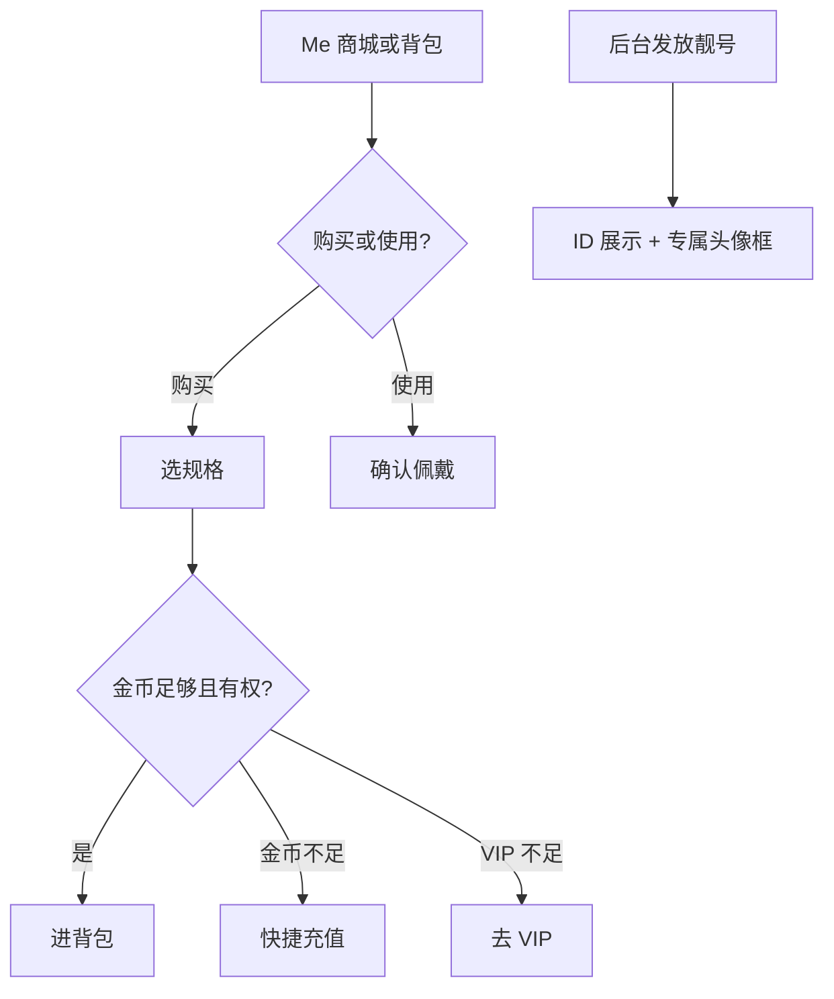

# 商城/背包/靓号 · 现行说明

> 派生阅读层。改规则仍改 [`../PRD.md`](../PRD.md)。基于已收录主线 **V1.4.0**。拍板 RQ-17。

## 元信息
<!-- chunk:no -->

| 字段 | 值 |
|---|---|
| 功能 ID | `mall` |
| 截止版本 | 已收录 V1.4.0（V1.0.0 商城/背包/靓号 + V1.4.0 默认房间背景） |
| 权威 | 派生；冲突以 `PRD.md` 为准 |
| 状态 | pending-review |

---

## 范围
<!-- chunk:default section=scope id=mall.scope -->

覆盖 App 侧靓号展示与发放结果、商城购买、背包使用。分类只有头像框、座驾、房间背景。**无头饰卡**（头饰卡 ≠ 头像框）。靓号仅后台发放，商城不卖；「购买靓号」不作现行。价格档位及特权表不抄入本文。后台页面与配置不在本文复制。

---

## 总流程
<!-- chunk:default section=flow id=mall.flow-main -->

Me 进商城用金币买头像框 / 座驾 / 房间背景，进背包使用。靓号由后台发放后，各 ID 展示位出靓号标识，并按档位给专属头像框。房主从房间 Theme 进背包换背景。

---

## 业务逻辑

### 靓号 {#logic-id}
<!-- chunk:default section=logic id=mall.logic-id -->

仅后台发放（含 VIP 联系运营挑选后下发），商城不支持购买。运营提供具体靓号及类型（个人或房间），服务端发给用户 / 房间。记录：当前靓号、获得者用户 / 房间 ID、发放时间。有靓号的 ID 位展示标识 + 号码与对应颜色，不再展示「ID：」前缀。进房提示、发言消息区与在线列表在 VIP 标识后展示靓号。搜索支持搜靓号。获得后实时更新。分类：对子、重复、顺子（含正反）、自定义字母；ID 首位不为 0；预留 10 位。勋章样式与专属头像框条件按后台档位配置。发放后自动获对应专属头像框；不满足条件时头像框页显示上锁，满足则可预览。房间靓号价格与同号个人靓号一致；发放后替换原房间 ID，搜索同样可搜。

### 购买与时长 {#logic-shop}
<!-- chunk:default section=logic id=mall.logic-shop -->

只售后台状态正常且勾选展示的商品。头像框单位为天，最低 1 天，展示 Day / Days。活动标识、仅 VIP 可买、仅活动获得、货币不足、跳转均跟原商品逻辑。排序按后台排序值倒序。VIP 要求为「无要求」且未勾选「可通过商城获得」时按钮为置灰 Obtain，点击 toast「商品无法通过购买获得」。已拥有永久时长再买 toast「已拥有该商品」。消耗金币流水摘要【商城消费】。多次获得同一有时长商品则叠加；一旦永久则不再叠加。任何方式获得有时长商品即开始倒计时，精确到秒。头像框 / 座驾到期：取消使用并从背包移除，不自动换成其他商品。

### 房间背景回落 {#logic-theme}
<!-- chunk:default section=logic id=mall.logic-theme -->

现行房间均为语聊房，展示 Theme。房主更换后房内所有用户实时换背景。背包提供 3 个默认背景可切换，正在使用显示 in use；去掉已装扮背景的取消选择；换背景仍要二次确认；点正在使用的 Use toast「正在使用中」。默认背景排在付费背景后，时长「永久」，按道具配置排序。付费背景到期自动落到排序第一的免费背景；房内用户有 1 小时延迟。

---

## 客户端页面

### 商城 {#page-shop}
<!-- chunk:default section=page id=mall.page-shop -->

Me 商城 icon。头部【商城 背包】tab。分类顺序：头像框、座驾、房间背景，默认第一类。一列 2 个。无商品占位「暂无商品出售」。列表静图，预览才播动效（若有）；房间背景 / 座驾非静态在右上角展示播放按钮（展示用，点击热区仍是整图）。购买按钮展示第一规格价格 + 规格；点出规格浮层，最多 4 个规格，默认第一个。吸底金币 + 充值（进钱包-金币，返回刷新金币）。预览可关蒙层。买成功出弹窗，【去背包】进对应分类。VIP 不足出身份文案弹窗，取消关浮层，成为 VIP 进 VIP 页返回后刷新身份。金币不足出余额不足弹窗引导充值。头像框 tab 右上角问号为头像框说明。商品说明按后台文案，未配不展示。

### 背包 {#page-bag}
<!-- chunk:default section=page id=mall.page-bag -->

Me 背包 icon，或商城头部切 tab。分类同商城。只展示已获得且未过期。使用中置顶，其余按后台优先级；VIP 自动获得商品排序默认 9999。有 VIP 购买要求则展示最低 VIP。按钮：使用 / 取消使用 / 替换（均二次确认）；房间背景取消使用见默认背景规则。头像框预览不显示操作按钮。右上角获得记录：购买或发放的全部商品，icon、名称、获得时间、有效期；近 30 天分页。空分类占位。房间设置 Theme、房间更多浮层 Theme（仅房主）进背包并定位房间背景；从该入口返回回到房间设置。

### 靓号与标识展示 {#page-id}
<!-- chunk:default section=page id=mall.page-id -->

展示个人靓号的场景含：我的、个人主页、个人资料卡、用户 / 房间搜索、消息好友列表、靓号页面等（原文要求核查其余 ID 位）。房间靓号：房间顶部、全站广播、三方分享 H5、私聊房间分享卡片等。各处道具标识：头像框（不可用于麦位）、彩色昵称、VIP 标识、用户等级牌、进房特效（VIP 标识 + 昵称 + entered the room）、座驾进房动效。麦位、资料卡、排行榜、ME、主页、信息页、好友列表、私聊按 PRD 各图组合展示，本文不抄表。贵族标识不作现行，展示走 VIP。

---

## 后台影响
<!-- chunk:default section=admin id=mall.admin-impact -->

商城商品 / 分类 / 展示见 [`../../admin/PRD.md#admin-mall`](../../admin/PRD.md#admin-mall)。商品 / 靓号 / VIP 赠送见 [`../../admin/PRD.md#admin-grant`](../../admin/PRD.md#admin-grant)。分类配置不含头饰卡。

---

## 关联影响

### 关联 · 运营后台 {#related-admin}
<!-- chunk:related-row section=related id=mall.related-admin target=admin -->

商城管理、商品 / 靓号 / VIP 赠送。跳转 [`../../admin/brief/current.md#admin-mall`](../../admin/brief/current.md#admin-mall)、[`../../admin/brief/current.md#admin-grant`](../../admin/brief/current.md#admin-grant)。

### 关联 · 金币充值 {#related-recharge}
<!-- chunk:related-row section=related id=mall.related-recharge target=recharge -->

商城金币不足走快捷充值；吸底与规格浮层充值进钱包-金币。跳转 [`../../recharge/brief/current.md`](../../recharge/brief/current.md)。

### 关联 · VIP {#related-vip}
<!-- chunk:related-row section=related id=mall.related-vip target=vip -->

部分商品仅 VIP 可买；条件不足引导成为 VIP。跳转 [`../../vip/brief/current.md`](../../vip/brief/current.md)。

### 关联 · 房间 {#related-room}
<!-- chunk:related-row section=related id=mall.related-room target=room -->

房主 Theme 换背景；进房特效 / 座驾 / 麦位标识在房间内展示。跳转 [`../../room/brief/current.md`](../../room/brief/current.md)。

---

## 相对变化
<!-- chunk:changelog section=changelog id=mall.changelog -->

相对原文：商城不卖靓号，「购买靓号」作废；本版无头饰卡；分类仅头像框、座驾、房间背景。

---

## 原文
<!-- chunk:no -->

[`../PRD.md`](../PRD.md) · [`../changelog.md`](../changelog.md) · [`../history/`](../history/)

---

## 计划预览
<!-- chunk:no -->

V1.5.0 工作区不是现行。无已收录之后的版本计划进入本文。

---

## 待校对
<!-- chunk:no -->

- 「价格档位及特权」表未进入现行 PRD，勋章样式与专属头像框阈值不编数字。
- 原文「需要核查其他展示 ID 的场景」未给闭环清单。
- 自定义字母靓号写「暂时仅支持后台发放」，与「仅后台发放」已对齐，是否另有计划入口未写。
