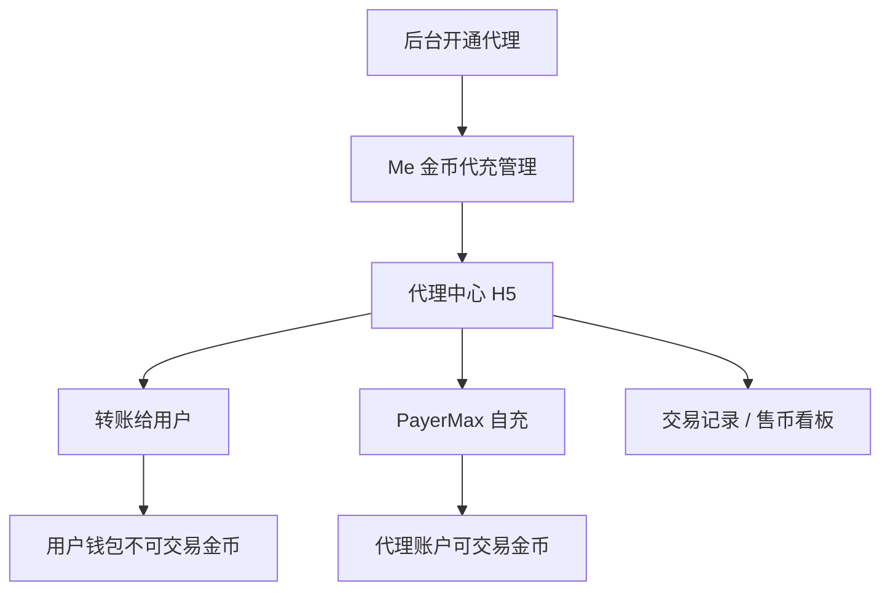

# 币商 · 现行说明

> 派生阅读层。改规则仍改 [`../PRD.md`](../PRD.md)。基于已收录主线 **V1.4.0**。拍板 RQ-01、RQ-05、RQ-15。

## 元信息
<!-- chunk:no -->

| 字段 | 值 |
|---|---|
| 功能 ID | `merchant` |
| 截止版本 | 已收录 V1.4.0（模块正文来自 V1.0.0） |
| 权威 | 派生；冲突以 `PRD.md` 为准 |
| 状态 | pending-review |

---

## 范围
<!-- chunk:default section=scope id=merchant.scope -->

覆盖币商代理中心、转账、交易记录、PayerMax 自充、代理列表、私聊转账 / 发图、售币看板。代理账户 = 可交易金币，来源为官方打款与币商自充（PayerMax）；卖给用户后用户侧金币不可再交易。无自动冻币；手动冻结 + 退款欠款限制转账（只动代理账户）。WhatsApp / 群发 / 自动回复 / Message「Agency」分类不作现行。币商自充短信单独（设备 10、号 50），不与登录配额合并。自动补币 `needs-input`，不编。不覆盖后台字段表。

---

## 总流程
<!-- chunk:default section=flow id=merchant.flow-main -->

运营后台开通金币充值代理后，Me 出现「金币代充管理」（H5）。币商可从代理账户转账给用户（用户侧为不可交易金币），或经短信验证后用 PayerMax 给代理账户买可交易金币。充值页在满足可见条件时展示代理列表。代理中心另有「链接支付」，规则在 YallaPay。

---

## 业务逻辑

### 代理账户与权限 {#logic-account}
<!-- chunk:default section=logic id=merchant.logic-account -->

代理账户区别于用户钱包金币。自充与官方打款都是现行买可交易金币的路径。关闭代理权限后入口立即不展示；页面有缓存时任何操作无下一步并 toast「你已没有操作权限。」，数据保留。无自动冻币。后台手动冻结后代理账户只进不出：限制给用户转账，不影响向代理账户充值；冻结不扣、不冻用户钱包金币。退款欠平台期间同样限制转账；自动扣余额只扣代理账户金币；还钱须充到代理账户；还款后解开转账限制。

### 转账 {#logic-transfer}
<!-- chunk:default section=logic id=merchant.logic-transfer -->

从代理账户扣可交易金币，转入收款用户钱包金币（不可再交易）。最低金额 10,000（服务端可配）；小于最低时转账按钮不点亮，收起输入框 toast「每次最少转账10000金额哦~」。输入大于代理余额则自动改为余额并 toast「输入金额不得大于账户余额哦~」。1 金币价值美金默认 0.000952$，服务端可配；实时展示对应美元。快捷面额第一行 4 个默认档（展示「K」，如 500,000 → 500k）；第二行近 30 天成功转账金额 4 个、时间倒序、与第一行去重补全，没有成功记录则不展示第二行。最近用户同近 30 天 4 个（头像、昵称、ID），不足则全展示，可左右滑。冻结中展示「冻结中」，点入口或置灰转账按钮弹窗「你当前账户冻结状态，限制不允许给用户转账，请联系官方。【好的】」。成功 toast「转账成功。」；代理流水「转账(ID、昵称、头像) -ZZZ金币(对应美金)」；用户流水「充值 +ZZZ金币」。该笔计入充值排行榜。

### PayerMax 自充 {#logic-payermax}
<!-- chunk:default section=logic id=merchant.logic-payermax -->

代理中心右上角「充值」进第三方页；网址域名不展示 YallaPay。后台添加币商手机号必填。当前设备第一次（含换设备或换账号）点充值走短信验证。自充短信：设备当日 ≤10、手机号当日 ≤50，均不与登录配额共用；手机号一天最多设备数 ≤3、IP 十分钟 ≤3，与登录共用。验证后问是否信任设备：不信任则每次（或换设备/账号）都验；信任则每 168 小时或换设备/账号再验。非 APP 内打开提示「请打开Hayyo查看此页面 [好的]」。非币商身份「对不起你的身份没有操作权限 [好的]」；发货前再验身份，不是代理不加币。支付成功且平台收到第三方回款后，金币加在代理账户。进价档位按后台区分币商展示，具体价格 `needs-input`。自动补币 `needs-input`，不编规则。

### 代理列表可见与排序 {#logic-list}
<!-- chunk:default section=logic id=merchant.logic-list -->

列表只展示代理账户余额大于 0 且不在代充灰名单的代理；分页 30 条。排序：余额大于 XXX（服务端可配）优先，其次在房、在线、服务国家含查看者国家、代理账户金币多、近 30 天成交订单数高。入口是否展示由服务端分 iOS / 安卓控制；提交审核期关闭，正式发布后按条件打开。可见条件原文多层并列（活跃天数 / 充值金额 / 白名单 / 非审核号 / 注册活跃占比 / 币商与拉新绑定），以后台与服务端配置为准，本文不合并成一条新公式。Message「Agency」分类不作现行；充值页「Agency」tab 仍是代理列表入口名称。

---

## 客户端页面

### 代理中心 {#page-center}
<!-- chunk:default section=page id=merchant.page-center -->

Me「金币代充管理」进 H5。展示代理账户余额（千分位逗号）、保证金「XXX USD」（后台填写）、支持服务国家及顺序（后台）。入口：转账、交易记录（默认出账）、拉新邀请、代理列表（跳充值页代理列表）、右上角充值。售币数据：默认本月（当月 1 日至当天，沙特时间）转账成功金币数与笔数、折线图；可切「代理售币订单数」；可筛最近 7 天、最近 30 天、自定义（至少可查 3 个月）；环比最多 2 位有效数字，无对比显示「--」。

### 转账页 {#page-transfer}
<!-- chunk:default section=page id=merchant.page-transfer -->

H5。上方展示代理余额。快捷面额单选可反选；选中填入输入框，改数字则取消选中。点输入框调数字键盘，金额千分位。搜用户：默认文案「请输入用户id」，有输入后「确定」点亮并出现删除；搜索中出动效，命中字符高亮；卡片含头像、用户名、ID；点卡片进个人主页，点「转账」带该用户进转账详情；无结果占位「无搜索结果」。点转账出二次确认：「你确定要向用户ID：XXX（YYY）」+ 头像 +「转账ZZZ金币吗？」；确定后结果页，「完成」回转账页。

### PayerMax 与流水 {#page-payermax}
<!-- chunk:default section=page id=merchant.page-payermax -->

充值页自动带币商 ID / 昵称 / 头像；语言跟 Me-语言（英、阿），切换应用语言则同步。充值方式默认收起，点开选档位（默认第一档）后吸底展示金额、可得金币、充值按钮。弱网占位，超过 30s「网络请求超时 [好的]」。渠道维护蒙层 toast「当前充值渠道正在维护中，请稍后再试」；超渠道上限蒙层 toast「当前商品不可用」。档位被后台删且未刷新：toast「充值失败请重试」并刷新档位。空闲超过 10 分钟（服务端可配）或 YallaPay 宕机：「请重新进入」或「页面加载失败，请稍后再试」，回代理中心。充值页左上角返回到 Me。进度页：已到账 / 进行中。PayerMax 流水：账户充值 + 方式 + 时间 + 金币 + 支付金额 + 状态；近 1 年、每页 50；可筛本月 / 上月。代理中心流水：入账「官方打款 +XXX金币」「代理账户充值 +XXX金币」；出账「打款（昵称、ID、头像） -XXX金币（YYY.YY$）」「官方扣除 -XXX金币（YYY.YY$）」；美金两位后省略；近 6 个月、每页 50；空态「暂无数据」。补币流水若日后确认，仅入账「H5充值补币」，PayerMax 列表不展示。

### 代理列表与私聊 {#page-list}
<!-- chunk:default section=page id=merchant.page-list -->

充值页可同时展示 Apple Pay / Google Pay 与代充；默认定 IAP。无代充权限则只展示 IAP。列表项：头像、ID、昵称、在房（点进代理房间）或在线、服务国家、代理账户余额、备注（未填不展示；币商可编自己备注最多 300 字，需三方审核）、历史完成交易 / 近 30 天成交金额 / 近 30 天成交单数（分别大于 X / Y / Z 才展示，服务端可配）。头像进主页，非头像区域进私聊。仅从代理列表进入的私聊顶部展示：余额（>100 万用 M，>10 亿用 B）、近 30 天单数 / 金额（过阈才展示）；余额为 0 或灰名单不展示。仅代理视角有悬浮「转账」，带当前用户进转账页。仅代理与官方客服可发图；图片审核过滤 `needs-input`。

---

## 后台影响
<!-- chunk:default section=admin id=merchant.admin-impact -->

开通 / 删除代理、保证金、服务国家、汇率、列表是否展示、灰名单、白名单、手动冻结、官方打款与代理加减币以后台为准。跳转 [`../../admin/PRD.md#admin-merchant`](../../admin/PRD.md#admin-merchant)。原文菜单名「公会管理」不作现行。自动补币后台原文保留待定，不升格。

---

## 关联影响

### 关联 · 运营后台 {#related-admin}
<!-- chunk:related-row section=related id=merchant.related-admin target=admin -->

开通 / 删除代理、保证金、灰白名单、冻币、官方打款与代理加减币。跳转 [`../../admin/brief/current.md#admin-merchant`](../../admin/brief/current.md#admin-merchant)。

### 关联 · 金币充值 {#related-recharge}
<!-- chunk:related-row section=related id=merchant.related-recharge target=recharge -->

代理列表挂在充值页 / 快捷充值弹窗；用户从 IAP 与代充之间切换。跳转 [`../../recharge/brief/current.md`](../../recharge/brief/current.md)。

### 关联 · YallaPay {#related-yallapay}
<!-- chunk:related-row section=related id=merchant.related-yallapay target=yallapay -->

代理中心「链接支付」生成分销链接，与 PayerMax 自充不是同一条路径；相同档位每美元金币数不同。跳转 [`../../yallapay/brief/current.md`](../../yallapay/brief/current.md)。

### 关联 · 拉新 {#related-referral}
<!-- chunk:related-row section=related id=merchant.related-referral target=referral -->

代理中心「拉新邀请」进币商角色拉新页。跳转 [`../../referral/brief/current.md`](../../referral/brief/current.md)。

---

## 相对变化
<!-- chunk:changelog section=changelog id=merchant.changelog -->

相对原文：WhatsApp / 群发 / 自动回复 / Message Agency 分类不作现行；无自动冻币，冻结与欠款限制只动代理账户；自充与官方打款都是买可交易金币的现行路径；钻石 / 游戏币不进入本功能。

---

## 原文
<!-- chunk:no -->

[`../PRD.md`](../PRD.md) · [`../changelog.md`](../changelog.md) · [`../history/`](../history/)

---

## 计划预览
<!-- chunk:no -->

V1.5.0 工作区不是现行。无已收录之后的版本计划进入本文。

---

## 待校对
<!-- chunk:no -->

- 自动补币仍待定，档位表未进现行。
- PayerMax 进价档位「具体价格待定」。
- 私聊发图是否走七牛审核 `needs-input`。
- 快捷默认面额四个具体数字原文未给出。
- 代理列表可见条件原文两套并列，未裁定唯一表达式。
