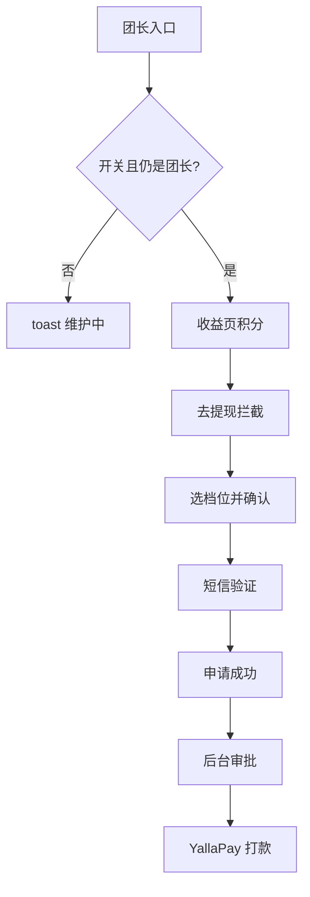

# 积分提现 · 现行说明

> 派生阅读层。改规则仍改 [`../PRD.md`](../PRD.md)。基于已收录主线 **V1.4.0**。拍板 RQ-01、RQ-05、RQ-14。

## 元信息
<!-- chunk:no -->

| 字段 | 值 |
|---|---|
| 功能 ID | `payout` |
| 截止版本 | 已收录 V1.4.0 |
| 权威 | 派生；冲突以 `PRD.md` 为准 |
| 状态 | pending-review |

---

## 范围
<!-- chunk:default section=scope id=payout.scope -->

覆盖用户用积分按汇率兑法币并提现（YallaPay 打款）。**不是**币商分销充值，**不是**用户第三套钱包。积分只兑 USD。积分可以扣成负数，用户端和管理后台都要能显示负数；余额为负不能发起提现，申请页只出现 0 和正数。展示最多 16 位，超出加 `+`。订单号前缀 HABBY、TLXX 保留。提现短信与登录注册共用配额：同设备 + 同号，GMT+3 自然日 ≤10。团长充值结算可发积分，发放时无积分户则自动开户；积分提现申请 / 审批写在本功能。「其他货币提取」`needs-input`，不编。

---

## 总流程
<!-- chunk:default section=flow id=payout.flow-main -->

后台开关开启且用户仍是团长时，团长主页与奖励记录展示积分 / 提现入口。去提现按拦截链通过后选档位、确认资料、短信验证并提交。后台审批后由 YallaPay 打款。

---

## 业务逻辑

### 积分账户与展示 {#logic-points}
<!-- chunk:default section=logic id=payout.logic-points -->

积分只用来兑换法币，默认 200000 积分 = 1 美金（后台可配；本版只做积分和美金）。正数或 0 显示「我的积分」，负数为「积分欠款」。最多 16 位，超出加「+」。本月收益、累计收益均支持负数。两种团长在得到发放奖励时可自动开户；非团长可由后台开户：可无入口但仍可加减积分。积分权限**不作为**提现判断，只看提现开关。后台按当前时间点扣当前、本月、累计。拉新充值结算金币 / 积分二选一、退款追溯、发放时无户自动开户见拉新，不在本条展开。

### 提现拦截 {#logic-guard}
<!-- chunk:default section=logic id=payout.logic-guard -->

点「去提现」顺序：① 平台提现开关关闭 → 维护提示；② 账号提现开关关闭 →「提现功能异常，请联系客服」，确定进 Official，返回仍回本页；③ 不看积分权限；④ 积分为负 → toast，不能进申请页；⑤ 未绑手机 → 绑定弹窗再进已有绑手机流程；⑥ 月上限（美金）：审核中 + 已成功 + 本单 ≤ 后台配置。都通过后进入申请。入口本身：后台开关 **且** 仍是团长才展示；不满足 toast「功能维护中，暂不对外开放」并刷新页面。

### 申请、首提与验证 {#logic-apply}
<!-- chunk:default section=logic id=payout.logic-apply -->

最多 9 档，排序后台配置。积分不够最低档 toast「您当前积分不够」。成功过提现则默认上次资料。首选货币本版现埃及。后台关「其他货币」则不展示首选以外货币。首提终身一次，只降低门槛不送积分；审核中 / 成功算用过，驳回退回资格；每档最多绑一个首提，原档关闭则首提也不展示。有单笔限额则超限档位置灰。YP 字段未返回前不展示对应手续费 / 到账。点去提现前二次校验比例、档位 / 首提、YP 汇率与渠道，变更则 toast「相关信息已经变更，请重新审查资料」，刷新并尽量保留未变信息；档位不可用则恢复未选。YallaPay v1.4.1 聚合支付外链不入库。短信：进页自动发，toast「验证码已发送～」；60 秒内不可重发，重发旧码失效；位数 / 倒计时 / 失效 / 每日条数同登录验证码，提现不另开配额；达上限弹窗「很抱歉，您当日获取验证码的次数已达上限，请明日再试」。「收不到验证码」打开换绑说明页，**不回登录**。

---

## 客户端页面

### 入口与收益 {#page-entry}
<!-- chunk:default section=page id=payout.page-entry -->

团长主页、奖励记录两个入口；手势滑动收起，悬停再展示。问号出积分说明。应用外打开提示回应用内。收益页：当前积分、本月 / 累计收益，进出页、操作后、下拉刷新。积分记录：默认近 60 天时间倒序，时间相同按订单 id 倒序；每页 50。订单号 `HABBY` + `yymmdd` + 加密 6 位，可复制 toast「已复制」。变动：使用 / 消费为负，获得为正。时间 GMT+3，日月年时分秒。状态 tab：拉新奖励、提现使用、提现失败返还、平台奖励、平台扣除。后台扣除描述有则展示。不并进拉新奖励记录列表。未绑手机时主页积分模块下方与设置「手机绑定」均为未绑定；三入口先到同一提示弹窗再进绑手机。已绑定后主页不再展示未绑定条，「去提现」进申请。

### 提现订单与申请 {#page-apply}
<!-- chunk:default section=page id=payout.page-apply -->

主页与详情列表默认近 60 天、时间倒序、同秒按订单 id 倒序，每页 50。订单号 `TLXX` + `yymmdd` + 加密 6 位。本页消耗积分只展示正整数。状态：审核中；已经发放（跟 YP）；驳回（可已返还或已扣除）。货币两位小数。YP 动态字段才展示；账号脱敏：>8 位前 4 后 4，≤8 前 2 后 2，≤4 全 `*`；银行展示 Account number，钱包展示手机号。空状态不展示「查看更多」。详情可按状态筛选。申请页只出现 0 和正数积分。确认信息：本次法币金额（非到账）、消费积分、手续费与比例、实际到账、收款资料；填写错误红字。

### 验证与成功 {#page-verify}
<!-- chunk:default section=page id=payout.page-verify -->

固定文案「账户安全验证，为保障您的资金安全，请完成验证」。展示提现金额、当前注册手机号（不脱敏）。成功页：货币数量、手续费、实际到账、预计到账（有银行字段用短说明，有手机号用对应说明，都没有用长说明）、收款资料、订单号（可复制）、GMT+3 订单时间。「查看订单」回提现订单列表。「再次提现」等同主页去提现，须再走拦截。

---

## 后台影响
<!-- chunk:default section=admin id=payout.admin-impact -->

订单审批、话术、配置、档位、统计、个人积分（含负数展示、加户）见 [`../../admin/PRD.md#admin-payout`](../../admin/PRD.md#admin-payout)。绑手机流程见个人中心，本文不抄。验证码规则见登录注册，提现不另开配额。

---

## 关联影响

### 关联 · 运营后台 {#related-admin}
<!-- chunk:related-row section=related id=payout.related-admin target=admin -->

订单审批、话术、配置、档位、统计、个人积分。跳转 [`../../admin/brief/current.md#admin-payout`](../../admin/brief/current.md#admin-payout)。

### 关联 · 拉新 {#related-referral}
<!-- chunk:related-row section=related id=payout.related-referral target=referral -->

团长充值结算可发积分；发放时无积分户则自动开户。积分提现申请 / 审批写在本文，不并进拉新奖励记录。跳转 [`../../referral/brief/current.md`](../../referral/brief/current.md)。

### 关联 · YallaPay {#related-yallapay}
<!-- chunk:related-row section=related id=payout.related-yallapay target=yallapay -->

提现打款走 YallaPay；分销支付链接不并入本文。跳转 [`../../yallapay/brief/current.md`](../../yallapay/brief/current.md)。

### 关联 · 登录注册 {#related-auth-login}
<!-- chunk:related-row section=related id=payout.related-auth-login target=auth-login -->

提现短信与登录注册、绑 / 换绑、改密、注销共用配额。跳转 [`../../auth-login/brief/current.md`](../../auth-login/brief/current.md)。

### 关联 · 个人中心 {#related-profile}
<!-- chunk:related-row section=related id=payout.related-profile target=profile -->

未绑手机不能提现，绑 / 改绑走已有流程。跳转 [`../../profile/brief/current.md`](../../profile/brief/current.md)。

---

## 相对变化
<!-- chunk:changelog section=changelog id=payout.changelog -->

相对原文：积分只兑 USD，不是用户钱包第三币种；展示按 16 位而非「第 9 位」；HABBY / TLXX 前缀保留。

---

## 原文
<!-- chunk:no -->

[`../PRD.md`](../PRD.md) · [`../changelog.md`](../changelog.md) · [`../history/`](../history/)

---

## 计划预览
<!-- chunk:no -->

V1.5.0 工作区不是现行。无已收录之后的版本计划进入本文。

---

## 待校对
<!-- chunk:no -->

- 「其他货币提取」原文截断，`needs-input`。
- 首选货币写「本版现埃及」，是否仅埃及未另确认。
- 考核翻译文案、Payout「其他货币提取」仍在总待定清单，本文不编。
