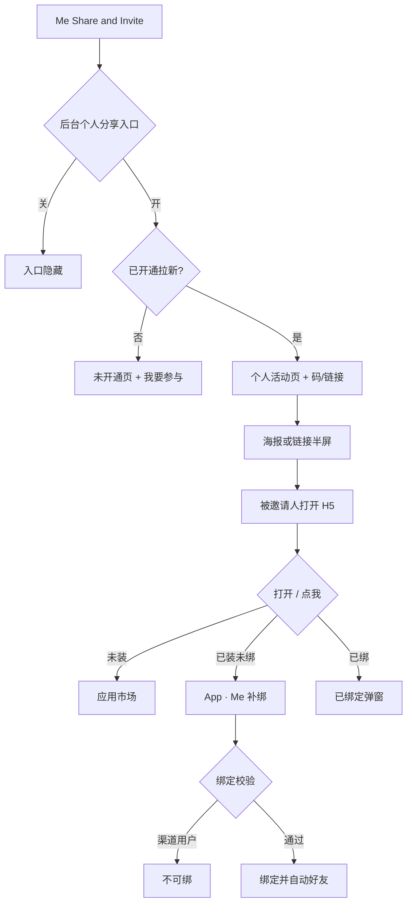

# 拉新 · 现行说明

> 派生阅读层，不是 Word 原文，也不是权威 [`../PRD.md`](../PRD.md)。  
> 基于已收录主线 **V1.4.0**。改规则仍改 `PRD.md`。本文只给人读「现在怎么规定」，并按标记切块。

## 元信息
<!-- chunk:no -->

| 字段 | 值 |
|---|---|
| 功能 ID | `referral` |
| 截止版本 | 已收录 V1.4.0 |
| 权威 | 派生；冲突以 `PRD.md` 为准，拍板见 [`../../../CONFIRMED.md`](../../../CONFIRMED.md) RQ-13 |
| 状态 | pending-review |

---

## 范围
<!-- chunk:default section=scope id=referral.scope -->

拉新覆盖：Me「Share and Invite」个人拉新、团队拉新（仅 BD / 币商团长）、分享物料、被邀请人 H5、Me 补绑、新手玩法、个人/团队奖励记录。

拉新不覆盖：后台配置字段表、积分提现申请与审批（只写拉新如何发积分）、工作区 V1.5.0。明确不做：团队页 Banner、综合调控。渠道限制仍按现行 PRD 的渠道章。C 端不展示审核中 / 待领取；用户端「已领取」改 **已发放**。

---

## 总流程
<!-- chunk:default section=flow id=referral.flow-main -->

拉新有两条链路：邀请人在 App 里分享，被邀请人打开带分享者信息的 H5 再进 App 绑定。

邀请人从 Me 点 Share and Invite。后台「个人分享入口」关闭则入口隐藏；打开则按是否已开通进入未开通页或个人活动页。未开通吸底是「我要参与」；已开通吸底是二维码 / 链接。发出去后，被邀请人先打开 H5（不再直接丢应用市场）。点「打开」按设备去商店；点「点我」时：未装去商店，已装未绑定则打开 App 到 Me 补绑，已绑定则弹出绑定信息。投放渠道用户不能绑定；团长邀团员链接对渠道用户只入团、不产生拉新绑定。

团长另有团队页，取决于后台「分享团队入口」且身份为 BD 团长或币商团长。

---

## 业务逻辑

### 身份 {#logic-identity}
<!-- chunk:default section=logic id=referral.logic-identity -->

拉新里普通玩家、团员、团长共用同一套个人周期算法，只差展示和团长才有的团队能力。普通 / 非团：不在团队且不是团长，个人页无团长信息块。团员：入团后个人算法不变，展示「我的团长」。团长（BD 或币商）：后台设置，可互转，个人算法不变，另有团队管理；展示「我是团长」。退团后个人算法不变，展示回到非团。

团长被后台删除后，当前周期继续统计，周期结束订单按「无贡献」，下一周期不再开始。身份转换按变化后的新日期统计，旧数据不带入。结算以结算时身份为准。BD 与币商展示和操作基本相同，后台配置两套；通常币商团长充值奖币商侧金币来源，BD 团长奖充值来源金币且 BD 货币不发放。原文「充值币 / 币商币」都是金币来源标签，不是第三钱包。

### 开通与停用 {#logic-activate}
<!-- chunk:default section=logic id=referral.logic-activate -->

拉新默认不开通。开通方式：在个人页点「我要参与」；后台加入个人拉新；设为任一种团长；经团长码或链接注册入团（该新用户同时绑在团长的拉新关系下）；已有账号在 App 内被邀成团员。

已开通不会因普通操作撤销。后台可停用：不能再分享、领奖、入团；已产生数据仍统计；已保存的码和链接仍有效。未开通不展示个人数据。开通 / 结算 / 领取校验不重写。

### 绑定与补绑 {#logic-bind}
<!-- chunk:default section=logic id=referral.logic-bind -->

多个邀请人时，以最后一次打开该落地页并下载或打开 App 后注册的账号为准。新号注册后 48 小时内可绑定或补绑；超时入口消失；用户端绑上后不可改绑。绑上后双方自动成好友，不能突破好友上限。同一设备最多绑 10 次；超过后扫码或补绑不再自动绑。白名单：绑定发起者、团长等账号 ID 可加入配置，绕过设备信息与绑定数量上限。

绑定关系按 30 个自然日统计。满 30 日后解除绑定关系，客户端不再展示「已绑定」入口和相关信息。头部「已绑展示头像」只适用于仍在 30 日内的绑定。解除后，该设备已经发生过的绑定次数不回退，只增不减。

投放渠道用户：补绑入口不展示，分享链接也不能绑；绕过则 toast「您不可以绑定其他用户」。团长邀请团员的链接：渠道用户只入团，不成为拉新绑定用户。市场渠道用户仍可被团长拉进团队。

补绑点确定时校验：超过 48 小时 toast「超时，不可被绑定」；对方被后台限制「该玩家不可被绑定」；本人已有绑定「您当前有绑定玩家，不可修改」；设备超过 10 次「您的设备已经到绑定上限」。对方未开通邀请则搜索无结果。

绑定成功（邀请链接、二维码，或站内搜索向上绑定）后，被邀请人收到一条系统消息。正文：恭喜您通过邀请链接和玩家「邀请人昵称全文」成为绑定关系。您可以参与新手活动拿取奖励。点「我要参与」进入新手玩法；该页因活动结束等原因不可展示时，toast「活动已结束」。团长码或链接这次没有形成拉新绑定时，不发这条消息。

单人拉新链接在新注册或打开 App 时绑定失败，只弹顶部条，不发上面这条系统消息。绑定成功不弹该顶部条。V1.5.0 工作区里的绑定成功顶部条不是现行。

### 人数奖 {#logic-cycle-headcount}
<!-- chunk:default section=logic id=referral.logic-cycle-headcount -->

个人拉新的人数奖按绑定日期是否落在本周期内计数。进度 = 本周期已拉人数 / 最高档人数，超过最高档只满格不溢出。达标即可领取，可以不按顺序领。必须在本周期结束前领完，过期作废。

领取校验不重写：不在周期或后台领取开关关闭，toast「当前领取未开启」；账号被限制，toast「账号异常，无法领取，请联系客服」。通过则物品到账、出恭喜弹窗、写奖励记录。未达标点宝箱只出约 3 秒奖励气泡。后台提前结束拉新周期时，人数奖是即领的，确认后直接关闭且不可恢复。

### 充值奖 {#logic-cycle-recharge}
<!-- chunk:default section=logic id=referral.logic-cycle-recharge -->

个人拉新的充值奖统计绑定用户在本周期内购买的金币（应用市场、YallaPay、币商买入），且充值日还要落在该用户绑定后 30 个自然日（T+29）内。页上展示的周期金额不考虑退款。个人拉新结算发放金币（原文称充值币），按所在档位百分比，不是点宝箱即时领取。

周期结束后开始结算；时间冲突时可先在后台处理为审核中，再延后 15–60 分钟。C 端不展示审核中。后台可配手动或自动；已经手动的订单不能改回自动。拉到金额为 0 记「无贡献」，不可领取。退款：结算时先扣往期退款再定档；不够扣则下周期继续追溯；因此产生的档位偏差可接受。

进行中的周期、阶梯、百分比不可变更或删除，但可提前结束；提前结束时可选择是否按配置结算，不结算则直接结束且不可恢复。新周期最早 T+1（服务器时间）。

### 数字与时间口径 {#logic-numbers}
<!-- chunk:default section=logic id=referral.logic-numbers -->

拉新空值展示 `/`。多数金额和人数上限为 99999999，超过显示 `99999999+`；人数进度条条文案另有 9999+。自然日按 GMT+3。个人页刷新约 5 分钟（可商定）。走势图不含当天，次日 1 点前生成前一日数据。总计充值从开通日起算，遇退款会减少。周期时间展示 `dd/MM – dd/MM`。

### 团队统计 {#logic-team}
<!-- chunk:default section=logic id=referral.logic-team -->

团队拉新把个人统计扩大到团长加团员。成员退出后，已经绑定的新玩家仍计在原团队，不带到新团队；已产生的拉人数不扣除。人数奖仅团长可领。团队充值预计可得 ≈（周期统计 − 往期退款追溯）× 当前档位百分比。团队页数据刷新约 1 小时。默认团队上限 50 人（含团长）。

### 封禁与积分奖池 {#logic-pool}
<!-- chunk:default section=logic id=referral.logic-pool -->

账号封禁时，即使结算通过也不发放、不写发放记录，用户端不展示该笔。团长充值结算在金币和积分里二选一；积分同样做退款追溯；发放时若没有积分户则自动开户。积分只兑 USD，不是用户第三套钱包。提现申请、汇率、审批见积分提现。

### 新手玩法 {#logic-novice}
<!-- chunk:default section=logic id=referral.logic-novice -->

新手玩法可见性：新注册即可见，不再仅限绑定用户。可见时长仍用基线：金币任务和活跃任务为 T+7；入口在绑定有效期内 T+8 可见；领奖超过 T+8 不可领；任务统计结束后多给一天停留可领。币商推荐仍仅绑定用户可见，且邀请者当时须为币商团长或币商团员。充值任务可并行累计。任务页按钮「领取 / 已领取」是任务页状态，不是奖励记录终态。

### 奖励记录 {#logic-reward-record}
<!-- chunk:default section=logic id=referral.logic-reward-record -->

奖励记录最多展示 180 天内 500 条，一页 20 条。用户端状态：不展示审核中、待领取；「已领取」改为「已发放」（个人和团队）。用户端出现「已发放」，表示该笔已经审核完成并发放；未审完的不会在用户端显示成已发放。后台仍可走手动或自动审核，C 端与后台终态都是「已发放」。红点出现在个人 / 团队奖励记录入口；有新记录才出；进入记录页视为已读；多条一次处理；不实时刷新，需手刷或重进再请求。

---

## 客户端页面

### 入口 {#page-entry}
<!-- chunk:default section=page id=referral.page-entry -->

拉新个人入口在 Me 的 Share and Invite。后台「个人分享入口」只控制显隐，不受审核状态影响。团队管理入口另受「分享团队入口」和团长身份同时满足才出现。

### 未开通个人页 {#page-personal-off}
<!-- chunk:default section=page id=referral.page-personal-off -->

未开通时页面标题为「分享邀请」，默认停在「拉新人数周期」tab。有进行中周期时展示充值金币与拉新人数日期以及竖进度条宝箱，不展示个人数据。后台空配置时接近空页。吸底固定「我要参与」，滑动时收起，静止再出现。头部绑定入口与 Me 补绑相同：投放渠道用户不展示；可绑未绑展示入口；已绑且未满 30 日展示对方头像；满 30 日解除后不再展示已绑定入口。

### 已开通个人页 {#page-personal-on}
<!-- chunk:default section=page id=referral.page-personal-on -->

已开通个人页标题仍是「分享邀请」。顶栏有返回、信封（奖励记录，有新记录出红点）、问号（活动说明）。头部绑定入口规则与未开通页相同。团长信息按身份变体；非团不展示该块。活动数据展示当前周期充值金额和新玩家数，点「更多数据」进二级页。双 tab 为充值周期奖励 / 拉新周期奖励，默认停在拉新。后台关闭开关或空配置则整块不展示；周期结束且没有新周期时，停在当前周期直到新周期开始。

主区域是竖进度条加宝箱，档位均分，数量多了向下延。拉新 tab：宝箱为已领取、点击领取、还差 X 人。定位优先第一个可领，没有则可即将完成的档。充值 tab：已超过该档为灰色、展示当前档、还差金币 X；定位停在当前档。人数奖和充值奖的计算见 `{#logic-cycle-headcount}`、`{#logic-cycle-recharge}`。

底部为「如何分享」四步加二维码邀请 / 链接邀请。滑动时分享按钮收起，静止再出。

### 更多数据 {#page-more-data}
<!-- chunk:default section=page id=referral.page-more-data -->

更多数据是个人页上层数据的二级页，团长信息不放在这一页。包含周期充值与新玩家数、本日充值、今日拉新人数、总计、7 日 / 30 日折线图。折线类型为充值走势、拉新人数、付费人数，一次只画一种。底部分享按钮仍在。

### 二维码与链接半屏 {#page-share}
<!-- chunk:default section=page id=referral.page-share -->

用户开通拉新或成为团长后，系统异步生成二维码海报。已生成则展示；未生成弹出刷新弹窗。用户资料变更会重生成，新图未完成前仍展示旧海报。应用外分享图片地址保留 90 天。团长邀请团员时外发文案为「邀请你加入团队」。

### 被邀请人 H5 {#page-h5}
<!-- chunk:default section=page id=referral.page-h5 -->

扫码或点链接先打开带分享者信息的 H5。吸顶为应用名、icon 和「打开」；中部为宣传和「如何绑定」；吸底为分享者头像、昵称、VIP、固定文案「邀请您来」、可复制的邀请 ID、「打开 Hayyo」。滑动时头栏和底栏收起。

「打开」按设备去 App Store 或 Google Play。「点我」：未装 App 去市场；已装未绑定则打开 App 到 Me 补绑；已绑定则弹出绑定信息弹窗。绑定校验见 `{#logic-bind}`。

### 团队页 {#page-team}
<!-- chunk:default section=page id=referral.page-team -->

团长团队页使用与个人页同一套竖进度条，默认停在充值 tab。团队 Banner 本版不做。积分栏见积分提现。拉人、充值宝箱交互与个人页对应 tab 相同，统计见 `{#logic-team}`。页上仍有团队人数、七日榜、本日数据、走势、奖励入口。管理能力含成员列表（不含团长自己）、删除成员、二维码 / 链接邀请、站内邀请。

### 到账推送 {#page-push}
<!-- chunk:default section=page id=referral.page-push -->

到账推送个人文案为「朋友，{{user_name}}又有新的奖励到账了」，点击跳个人奖励记录。团长文案为「团长，{{user_name}}你的团队又有新的奖励到账了」，点击跳团队奖励记录。右侧展示金币或积分 icon。状态不同步可以接受。综合调控本版不做。

---

## 后台影响
<!-- chunk:default section=admin id=referral.admin-impact -->

拉新后台页面与配置以运营后台为准，本说明不复制配置字段。

| 配置 | 客户端效果 |
|---|---|
| 个人分享入口 / 分享团队入口 | 只控制入口显隐 |
| 周期、阶梯、百分比、领取开关 | 进度条、结算、能否领取 |
| 提前结束（及是否结算） | 周期关闭；人数奖直接关 |
| 停用 / 账号限制 | 不能分享领奖入团；领取提示账号异常 |
| 奖励组 | 填商品 ID，名称只读 |
| 白名单 | 绕过设备与绑定次数上限 |
| 积分奖池 / 提现相关开关 | 团长结算货币；积分栏见提现 |

原文锚点：[`../../admin/PRD.md#admin-referral`](../../admin/PRD.md#admin-referral)、[`../../admin/PRD.md#admin-payout`](../../admin/PRD.md#admin-payout)。

---

## 关联影响

### 关联 · 积分提现 {#related-payout}
<!-- chunk:related-row section=related id=referral.related-payout target=payout -->

拉新会改积分提现的入账：团长充值结算在金币与积分中二选一，积分同样退款追溯，发放时没有积分户则自动开户。跳转 [`../../payout/brief/current.md`](../../payout/brief/current.md)。

### 关联 · 运营后台 {#related-admin}
<!-- chunk:related-row section=related id=referral.related-admin target=admin -->

拉新客户端入口、周期、领取开关、白名单、奖励组、封禁不发都以后台配置为准。跳转 [`../../admin/brief/current.md#admin-referral`](../../admin/brief/current.md#admin-referral)。

### 关联 · 个人中心 {#related-profile}
<!-- chunk:related-row section=related id=referral.related-profile target=profile -->

拉新个人页头部绑定入口与 Me 补绑同一套规则。「点我」在已装未绑时打开 App 并落到 Me 补绑。跳转 [`../../profile/brief/current.md`](../../profile/brief/current.md)。

### 关联 · 基建 {#related-infra}
<!-- chunk:related-row section=related id=referral.related-infra target=infra -->

绑定成功的系统消息见 `{#logic-bind}`。单人拉新链接绑定失败只弹顶部条，不发该系统消息；动效在基建原文。绑定成功顶部条若只在工作区 V1.5.0，不是现行。跳转 [`../../infra/brief/current.md`](../../infra/brief/current.md)。

### 关联 · 币商 {#related-merchant}
<!-- chunk:related-row section=related id=referral.related-merchant target=merchant -->

邀请者当时若是币商团长或币商团员，被邀请者的新手玩法可见「推荐商人」。跳转 [`../../merchant/brief/current.md`](../../merchant/brief/current.md)。

### 关联 · 渠道 {#related-channel}
<!-- chunk:related-row section=related id=referral.related-channel target=channel-tracking -->

投放渠道用户不能拉新绑定，补绑入口不展示；团长链接仍可使其入团但不计拉新绑定。跳转 [`../../channel-tracking/brief/current.md`](../../channel-tracking/brief/current.md)，规则细节以 `{#logic-bind}` 为准。

### 关联 · 关系体系 {#related-relationship}
<!-- chunk:related-row section=related id=referral.related-relationship target=relationship -->

拉新绑定或补绑成功后，双方自动成为好友，且不可突破好友数量上限。跳转 [`../../relationship/brief/current.md`](../../relationship/brief/current.md)。

---

## 相对变化
<!-- chunk:changelog section=changelog id=referral.changelog -->

相对叠稿清洗后的现行 PRD：C 端奖励终态为已发放；H5 带分享者信息落地；人数奖可不按序领；新手玩法新注册即可见；白名单、红点、封禁不发、积分奖池。未改开通停用、绑定 48 小时与设备 10 次、T+29 统计、充值结算与领取校验、渠道限制。团队 Banner 与综合调控本版不做。

---

## 原文
<!-- chunk:no -->

- 权威正文：[`../PRD.md`](../PRD.md)
- 变更摘要：[`../changelog.md`](../changelog.md)
- 分版切片与叠稿回退：[`../history/`](../history/)

---

## 计划预览
<!-- chunk:no -->

V1.5.0 工作区不是现行。升格为已收录后，先判定覆盖或增量，再重读或补充本文。

---

## 待校对
<!-- chunk:no -->

无阻塞项。拍板 RQ-13 已写入正文。
