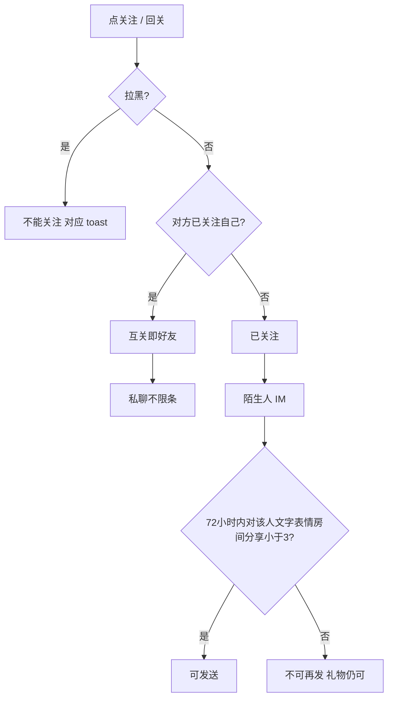

# 关系体系 · 现行说明

> 派生阅读层。改规则仍改 [`../PRD.md`](../PRD.md)。基于已收录主线 **V1.4.0**。拍板 RQ-08、RQ-21。

## 元信息
<!-- chunk:no -->

| 字段 | 值 |
|---|---|
| 功能 ID | `relationship` |
| 截止版本 | 已收录 V1.4.0 |
| 权威 | 派生；冲突以 `PRD.md` 为准，拍板见 [`../../../CONFIRMED.md`](../../../CONFIRMED.md) RQ-08 |
| 状态 | pending-review |

---

## 范围
<!-- chunk:default section=scope id=relationship.scope -->

覆盖关注 / 互关即好友、列表与资料卡按钮、房间公屏与私聊关注引导、发消息限制、跟随进房、房间分享给粉丝。无好友验证、无申请箱。无家族申请、无家族分享。陌生人 IM：72 小时内对同一人最多 3 条（文字 / 表情 / 房间分享，不含礼物）。跟随列表不展示 ludo / domino / 桌球房类型。无游戏房模式，房间内游戏仍在。

文首无独立后台锚点。profile 验证开关、消息「每天 20 条」不当现行。「30 天内最多触发 1 次」仍待定，不编造。

---

## 总流程
<!-- chunk:default section=flow id=relationship.flow-main -->

点关注立即关注；对方已关注自己则按钮为回关，点后成为好友（互关）。好友在房间资料卡上关注按钮变为私聊。陌生人私聊文字 / 表情 / 房间分享 72 小时内对同一人最多 3 条，礼物不计。房间内被关注或送礼可出仅相关人可见的回关 / 关注引导。消息页有关注提醒盒子，不是申请箱。

---

## 业务逻辑

### 关注状态机 {#logic-follow}
<!-- chunk:default section=logic id=relationship.logic-follow -->

去掉原资料卡、主页、粉丝列表、关注列表的「添加好友」，改为「关注」。自己的个人资料卡不展示关注 / 私聊。

- 关注：双方都未关注，点后立即关注，变为已关注，toast「关注成功」。
- 回关：对方关注自己、自己未关注，点后立即关注，变为好友，toast「关注成功」。粉丝列表：若点回关前对方已取消关注，状态仍变为「好友」（实际只是自己关注对方），再刷新则不展示该用户。
- 已关注：自己关注、对方未关注。点已关注出二次确认「你确定要取消关注当前用户吗？」确定后变为关注，toast「你已取消关注该用户」，列表立即删掉该用户。
- 好友：互关。主页 / 粉丝列表点出「你确定要解除与当前用户的好友关系吗？解除后你将不再关注他。」确定后变为回关。关注列表确定后同时从关注列表清除。
- 私聊：互关后，房间资料卡关注按钮变为私聊；任一方取消关注则回到上面状态。

拉黑（同线上）：A 拉黑 B 或反向，则不能关注、发消息、房间分享、送礼。点关注通知上的关注 / 回关：toast「你不能关注当前用户，因为你已拉黑他」或「你不能关注当前用户，因为你已被对方拉黑」。

历史数据：单方面关注保留；双方关注即为好友；原来是好友的自动相互关注。后台官方账号添加好友需要自动关注，原文「详见3.1.4」，不编造后台菜单。

### 陌生人 IM {#logic-im}
<!-- chunk:default section=logic id=relationship.logic-im -->

X 小时内 B 只能给 A 发送 Y 条消息。X=72，Y=3，服务端配置。限制的消息：文字、表情、房间分享卡片；不包括送礼。系统消息文案不算私聊条数。profile「每天 20 条」、好友验证不当现行。

「与同一个人发送或接收触发的上述消息 30 天内最多触发 1 次」以及系统提醒「XX 天（XX=30）内最多展示 1 次」仍 `needs-input`，见 CONFIRMED RQ-08，本文不编。

私聊回关引导：「他已关注你，回关一下吧。」点 X 或回关立即关注（toast「关注成功」）并关浮层；当天不再显示（每人每天最多 1 次）。即使关系变化，关闭后同一人当天只展示 1 次。进入该私聊立即展示；未关再进仍展示。

私聊关注引导：「聊天开心就关注一下吧。」规则同上，每天每人最多 1 次。

系统消息展示在当前第 1 条消息下方；若第一条是分享，则在分享卡片和分享文案下面。老版本发出未受限、升级后还能发时，新版本私聊发出的第 1 条后不用展示系统消息提醒（只作旧包兼容，不是后一版本现行规则）。

### 房间公屏引导 {#logic-room-guide}
<!-- chunk:default section=logic id=relationship.logic-room-guide -->

双方同时在一个房间且未拉黑：被房间内其他人关注后，被关注方公屏立即 1 条仅自己可见的引导：关注者头像 + 昵称 +「你可以点击“回关”与他/她成为好友」（女用她、男用他）+ 回关按钮。同一触发用户对接收方 M 分钟内最多 1 次，M=30，服务端可配。

点回关：若对方已取消关注，按钮变为已关注并立即关注对方；后续无论谁取消，此条按钮状态不再更新。双方成为好友且同时在房（含 Keep）时回关置灰为已关注，toast「关注成功」，并出双方可见的互关系统提示：自己头像在前 + 对方头像 +「你和」+ 昵称 +「已成为好友」。接收方对同一用户 Y 小时内最多 1 次，Y=12，服务端可配；发送方不限制。点互关提示：对方在房弹资料卡；不在房跳个人主页，返回回房间（原文随后又写弹出资料卡，见待校对）。

送礼引导：互未关注且未拉黑，送礼 / 收礼消息下出「关注」，仅双方收礼方可见；点后置灰为已关注，toast「关注成功」，此条之后不随取消关注更新。双方关注仍触发互关通知。对方已关注自己、自己未关注、对方给自己送礼：出「他关注了你」+ 回关，仅自己可见；点后变为「你们已经是好友」，去掉「他关注了你」，并出好友通知。自己已关注对方或已互关：送礼无上述按钮。

### 私聊成为好友与关注提醒 {#logic-im-guide}
<!-- chunk:default section=logic id=relationship.logic-im-guide -->

A 已关注 B 且 B 再关注 A 后：以 B 的身份发 1 条私聊（A、B 视角可见）「我们已经成为好友了，请我们一起尽情的玩吧~」，私聊列表可预览。A 视角收到该消息 X 分钟内最多 1 次，X=10，服务端可配。B 视角为客户端发出的假消息、不实际上发，B 每次关注触发都会展示。消息模块文案不同，见待校对。

消息页增加「关注提醒」盒子（不是申请箱）。每次进入消息页展示未读数。A 关注 B 且 B 未关注 A 时，B 立即 1 条关注提醒：头像 +「XXX刚刚关注了你，点击“回关”立即成为好友吧！」+ 关注 / 回关 / 聊天。同一人 X1 分钟内只能触发 1 次，X1=10 分钟，可配。按关注自己的时间倒序。近 30 天数据。按钮状态最多刷新最近 100 个用户（去重）。时间：当天时:分；昨天「昨天 时:分」；其它日/月 时:分。

按钮（每次进关注提醒页、或从主页 / 私聊退回该页时刷新）：B 关注 A 且 A 未关注 → 回关；B 取消且 A 未关注 → 关注；B 取消且 A 已关注 → 私聊；双方关注 → 私聊。点关注 / 回关 toast「关注成功」，按钮变聊天；点聊天进私聊。

### 跟随进房 {#logic-follow-room}
<!-- chunk:default section=logic id=relationship.logic-follow-room -->

「我关注的」来源：当前在房且隐私为「允许所有人可见」的自己关注的用户。排序：先好友（再按最近 1 次进房倒序，再按成为好友时间倒序）；再关注且非好友（同样先最近进房、再关注时间）。展示头像、头像框、昵称、所处房间类型（聊天房；不展示 ludo / domino / 桌球房，类型从服务端取）、好友标签、「跟随」。点跟随进对应房间；密码房须输入密码。每次打开刷新，每页 50。

隐私：去掉「好友」「好友&我关注的人」，增加「我关注的」。历史：所有人 / 无人可见不变；「好友&我关注的人」改为「我关注的」；「好友」不变。

### 房间分享给粉丝 {#logic-share}
<!-- chunk:default section=logic id=relationship.logic-share -->

房间分享增加粉丝 tab，展示所有关注自己的用户，排序与关注列表一致。同一人在粉丝与好友 tab 选中状态同步，分享人数去重。支持多选。最近分享过的置顶（聊天 / 好友 / 粉丝）。行内昵称、头像、用户 ID，点整行选中。无家族分享。

---

## 客户端页面

### 资料卡与列表按钮 {#page-buttons}
<!-- chunk:default section=page id=relationship.page-buttons -->

房间资料卡、个人主页、粉丝列表、关注列表使用关注 / 回关 / 已关注 / 好友 / 私聊，规则见 `{#logic-follow}`。自己的卡片不展示关注 / 私聊。

### 关注提醒 {#page-notify}
<!-- chunk:default section=page id=relationship.page-notify -->

消息页关注提醒盒子 + 未读数。列表与按钮见 `{#logic-im-guide}`。不是好友申请箱。

### 跟随与分享 {#page-follow-share}
<!-- chunk:default section=page id=relationship.page-follow-share -->

跟随进房列表含「我关注的人」，在线且满足关系才出现。房间分享页在原分享逻辑上加粉丝 tab。私聊顶栏回关 / 关注浮层见 `{#logic-im}`。

---

## 后台影响
<!-- chunk:default section=admin id=relationship.admin-impact -->

本功能文首未列后台锚点。公屏引导间隔 M / Y、私聊成为好友间隔 X、关注提醒间隔 X1、陌生人 X/Y 条、官方账号自动关注以后台 / 服务端配置为准，不编造菜单名。跳转仅作用户管理弱关联时用 [`../../admin/PRD.md#admin-users`](../../admin/PRD.md#admin-users)。

---

## 关联影响

### 关联 · 运营后台 {#related-admin}
<!-- chunk:related-row section=related id=relationship.related-admin target=admin -->

文首未列后台锚点；弱关联用户管理。跳转 [`../../admin/brief/current.md#admin-users`](../../admin/brief/current.md#admin-users)。

### 关联 · 消息 {#related-messaging}
<!-- chunk:related-row section=related id=relationship.related-messaging target=messaging -->

陌生人 72 小时 3 条在私聊落地；成为好友消息、关注提醒盒子在消息页。跳转 [`../../messaging/brief/current.md`](../../messaging/brief/current.md)。

### 关联 · 个人中心 {#related-profile}
<!-- chunk:related-row section=related id=relationship.related-profile target=profile -->

主页 / 粉丝 / 关注列表按钮、拉黑、无好友验证开关以本文状态机为准。跳转 [`../../profile/brief/current.md`](../../profile/brief/current.md)。

### 关联 · 房间 {#related-room}
<!-- chunk:related-row section=related id=relationship.related-room target=room -->

公屏关注引导、送礼消息上的关注 / 回关、跟随进房、房间分享粉丝 tab、密码房输入见房间。跟随列表不展示游戏房类型。跳转 [`../../room/brief/current.md`](../../room/brief/current.md)。

---

## 相对变化
<!-- chunk:changelog section=changelog id=relationship.changelog -->

相对原文：互关即好友，去掉好友验证和申请箱。陌生人 IM 为 72 小时 3 条（不含礼物）；每天 20 条不当现行。「30 天内最多触发 1 次」仍待定。无家族申请 / 分享。跟随列表不展示 ludo / domino / 桌球房。无游戏房模式。

---

## 原文
<!-- chunk:no -->

[`../PRD.md`](../PRD.md) · [`../changelog.md`](../changelog.md) · [`../history/`](../history/)

---

## 计划预览
<!-- chunk:no -->

V1.5.0 工作区不是现行。原文曾写「更新至1.5.0」只作旧包兼容说明，不把该版本当现行。无已收录之后的版本计划进入本文。

---

## 待校对
<!-- chunk:no -->

- 「30 天内最多触发 1 次」及系统提醒 30 天最多展示 1 次仍待定（RQ-08），未写入现行条数。
- 成为好友私聊文案与消息模块不一致。
- 点互关公屏提示：原文连续写跳个人主页又弹出资料卡，未拍板取舍。
