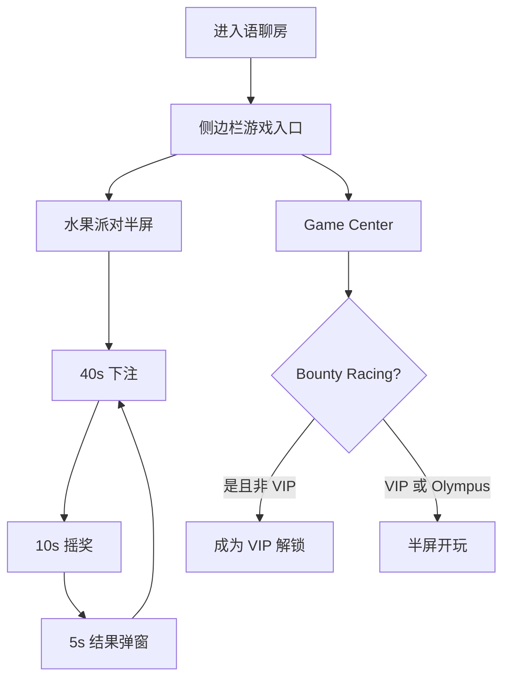

# 房间游戏 · 现行说明

> 派生阅读层。改规则仍改 [`../PRD.md`](../PRD.md)。基于已收录主线 **V1.4.0**。拍板 RQ-11、RQ-12、RQ-21。

## 元信息
<!-- chunk:no -->

| 字段 | 值 |
|---|---|
| 功能 ID | `room-game` |
| 截止版本 | 已收录 V1.4.0（正文含 V1.0.0 水果派对与 V1.4.0 三方） |
| 权威 | 派生；冲突以 `PRD.md` 为准 |
| 状态 | pending-review |

---

## 范围
<!-- chunk:default section=scope id=room-game.scope -->

覆盖语聊房内半屏 / 侧边栏的水果机、动物机、水果派对，以及房间内两款三方数值游戏 Bounty Racing、Lord of Olympus。只在语聊房内存在，不是游戏房模式。休闲三款（Ludo / Carrom / Block Crush）不在本文。幸运数字 / 掷色子是房间工具，不在本文。

---

## 总流程
<!-- chunk:default section=flow id=room-game.flow-main -->

进入语聊房后，侧边栏最后一位是游戏入口（H5，加载中要有样式）。默认打开水果机；也可进 Game Center 玩 Bounty Racing（仅 VIP）或 Lord of Olympus（全员）。水果派对按自然日 GMT+3 一轮一轮走：40 秒下注 → 10 秒摇奖 → 5 秒公布结果，然后自动下一轮。

---

## 业务逻辑

### 水果派对轮次 {#logic-round}
<!-- chunk:default section=logic id=room-game.logic-round -->

轮次时间以自然日 GMT+3 为准。转盘顺时针 8 种水果及对应倍数，倍数以效果图为准，本文不编造数字。下注环节转盘显示下注剩余倒计时，并有顺时针每隔 1 秒跳动的手势引导；摇奖环节显示结果公布倒计时，手势消失，点击水果无效果。今日收益 = 当天押中水果获得的金币总收益，不扣花费。最近 10 轮结果由近到远，最新一轮标 New，一排放不下可左右滑。

### 下注 {#logic-bet}
<!-- chunk:default section=logic id=room-game.logic-bet -->

先选单次金币数，再选水果。档位 **10 / 500 / 2K / 50K** 金币，默认 **10**。原文 10/100/1000/10000 及默认 1 金币不当现行。下注后保留档位；离开房间后不保留，回到 10。每轮最多 6 种水果；点第 7 种 toast「每轮游戏最多可下注 6 种水果」，不下注。单种可多次累加，额度无上限。金币不足 toast「金币不足」。点水果先出确认弹窗，默认勾选「不再提示」；勾选后本次在房内直接扣币，离开房间后不保留该勾选。取消勾选则下次仍弹确认，且不再默认勾选。确认扣币时金币不足出金币不足弹窗。不写「还差 XXX 金币」。

### 摇奖与结果 {#logic-result}
<!-- chunk:default section=logic id=room-game.logic-result -->

摇奖 10 秒由系统完成。各水果摇中概率以效果图 / 原文表为准，本文不编造。仅打开此游戏的用户自动弹出结果弹窗，展示 5 秒且无法手动关闭，结束后进入下一轮 40 秒下注。参与情况三种：未参与「你并没有参与本轮游戏」；参与未中奖「抱歉，本轮没有中奖」；参与并中奖「恭喜，本轮游戏获得 XXX 金币奖励」，XXX = 中奖水果押注金币 × 奖励倍数。本轮 TOP3 按本轮收益降序；押注相同看等级经验，收益相同看注册早晚。不足 3 人显示全部中奖用户；无人则占位「本轮没有中奖用户」。条目展示名次、头像、昵称、性别、VIP 勋章（有则显示）、本轮收益。

### 水线 {#logic-pool}
<!-- chunk:default section=logic id=room-game.logic-pool -->

水线（止损）为 0 金币。本轮结束后奖池低于水线，下一轮按最优解（返奖给用户最少的选项，多个则随机）直到奖池高于水线，再恢复正常概率。奖池上限原文写 5000000 金币并标【待定】，该数字不当已确认上限。

### 三方数值游戏 {#logic-thirdparty}
<!-- chunk:default section=logic id=room-game.logic-thirdparty -->

房间内半屏接 Bounty Racing、Lord of Olympus。提交审核时仍受服务端风控开关控制。Bounty Racing 玩法同线上水果机，可压更多选项，**仅 VIP**。Lord of Olympus 为 slots，**全员可玩**。两款档位 `needs-input`：原文摘录数字不是已确认档位。风控两款分开配：5 分钟检测，钉钉 + 邮件；低水位（水线 ≤ X）、7 天累计中奖 ≥ Y、单人 7 天累计中奖 ≥ Z（X/Y/Z 可配）；限频 1 小时最多 50 次（两款分开、数值相同）。中奖广播：XXX 赢得 YYY 金币 + 游戏图标 +【Go】；已在当前房间或密码房不展示 Go；触发为中奖金币＞N（两款分开配）；在线人数、送礼金币限制、限频同水果机；老版本不展示此广播。

### 与休闲游戏共存 {#logic-coexist}
<!-- chunk:default section=logic id=room-game.logic-coexist -->

用户在房间玩数值游戏时房间开启休闲：休闲保持最小化；关掉数值弹窗后，数值仍保持最小化。大厅 / 房间游戏重连提示为即时队列，排序 3（协议之后、其他业务弹窗之前），队列规则权威在基建。

---

## 客户端页面

### 入口与主界面 {#page-main}
<!-- chunk:default section=page id=room-game.page-main -->

游戏入口在房间侧边栏最后一位。主界面顶栏为当日轮次；【排行榜 Rank】打开今日收益排行榜；右上角【参与记录】；【？】打开规则。下方为 4 档金币单选、提示「先选择花费的金币数，然后选择水果」、金币余额、【充值】（关闭游戏弹窗进金币充值页）、今日收益。点背景或关闭按钮关界面。侧边栏默认水果机；关闭时停留在 X，则本次在房侧边栏为 X。半屏高度与水果机一致。不废除水果机 / 动物机切换。

### 排行榜、记录与规则 {#page-sub}
<!-- chunk:default section=page id=room-game.page-sub -->

今日收益排行榜按用户所在语区，不扣花费，最多前 10，前 3 突出；不足 10 显示全部；无人则占位「今日还没有用户上榜」。收益相同的排序原文并列写了注册早晚与等级经验。5 分钟更新一次。点 X 或背景关闭。

参与记录最多最近 50 条，按时间倒序；空则「没有任何参与记录」。每条含结束时间（秒，GMT+3）、当日轮次、摇出水果、本轮各水果下注；中奖水果标「正确的选择」，否则「错误的选择」。

规则弹窗纯展示：请选择下注的金币数和水果；下注环节持续 40s，之后会公布本轮摇奖结果；所有玩家押中水果，将会获得相应的奖励；你可以同时下注 6 种水果，下注金币数没有上限；Hayyo 拥有对此游戏的解释权。

### Game Center {#page-center}
<!-- chunk:default section=page id=room-game.page-center -->

两款三方展示在 Game Center 个人游戏区域。名称高度按该行 1 行 / 2 行自适应；超出可视区上滑时自动拉高半屏。仅 VIP 可玩的展示 VIP 角标。非 VIP 点击弹「成为 VIP 解锁当前游戏」+ 游戏图标 +【取消】【成为 VIP】；成为 VIP 跳 VIP 页，返回房间时游戏中心半屏不自动关闭。非 VIP 开启面板后不可切换 Bounty Racing，列表也不展示；本页未关期间成为 VIP 不立刻刷新，关闭再开才出现。

V1.4.0 包：所有非新注册用户首次进入房间 5 秒弹出上新引导；一个账号只弹一次，记本地，卸载重装仍会弹。点击气泡打开游戏中心半屏；点气泡外或满 6 秒消失。

---

## 后台影响
<!-- chunk:default section=admin id=room-game.admin-impact -->

水果机 / 动物机统计、日报「水果机」字段兼统计本版两款数值游戏。客户端侧：按用户所在语区记每日参与；同一用户在多个语区的下注计入对应语区；另有各语区 TOP20 下注用户。跳转 [`../../admin/PRD.md#admin-room-game`](../../admin/PRD.md#admin-room-game)。本文不复制后台字段表。

---

## 关联影响

### 关联 · 运营后台 {#related-admin}
<!-- chunk:related-row section=related id=room-game.related-admin target=admin -->

水果机 / 动物机统计。跳转 [`../../admin/brief/current.md#admin-room-game`](../../admin/brief/current.md#admin-room-game)。

### 关联 · 休闲游戏 {#related-casual-game}
<!-- chunk:related-row section=related id=room-game.related-casual-game target=casual-game -->

休闲三款不在本文。房间内同时开休闲与数值时的最小化规则见上文 `{#logic-coexist}`。跳转 [`../../casual-game/brief/current.md`](../../casual-game/brief/current.md)。

### 关联 · 房间 {#related-room}
<!-- chunk:related-row section=related id=room-game.related-room target=room -->

幸运数字 / 掷色子仍是房间工具，不是本功能。跳转 [`../../room/brief/current.md`](../../room/brief/current.md)。

### 关联 · 基建 {#related-infra}
<!-- chunk:related-row section=related id=room-game.related-infra target=infra -->

游戏重连弹窗归本功能，排序与队列权威在基建。跳转 [`../../infra/brief/current.md`](../../infra/brief/current.md)。

---

## 相对变化
<!-- chunk:changelog section=changelog id=room-game.changelog -->

相对原文：水果机档位改为 10 / 500 / 2K / 50K，默认 10，原文 10/100/1000/10000 及默认 1 金币不当现行。明确不是游戏房模式。Bounty / Olympus 档位仍待定，摘录数字不升格。

---

## 原文
<!-- chunk:no -->

[`../PRD.md`](../PRD.md) · [`../changelog.md`](../changelog.md) · [`../history/`](../history/)

---

## 计划预览
<!-- chunk:no -->

V1.5.0 工作区不是现行，不进入正文。升格为已收录后再判定覆盖或增量。

---

## 待校对
<!-- chunk:no -->

- Bounty Racing / Lord of Olympus 下注档位仍待定。
- 奖池上限 500w 金币原文标【待定】。
- 8 种水果倍数与摇中概率以效果图 / 原文表为准，本文未写入数字。
- 日榜「收益相同」原文并列注册时间与等级经验，未分主次。
- 基建「语区数据分区」写数值游戏榜本轮不按语区切；本文日榜 / TOP3 仍按所在语区。冲突未在本功能 PRD 内消解。
